# API Gateway — Guia Completo (Teoria + Prática + Dia a Dia)

## 0. O que é o API Gateway e por que ele existe


*Diagrama oficial da AWS: o API Gateway atua como "porta de entrada" entre os clientes (web, mobile, IoT) e seus backends (Lambda, EC2, outros serviços AWS ou aplicações externas), cuidando de tráfego, autenticação/autorização, monitoramento e versionamento. Fonte: [AWS Docs](https://docs.aws.amazon.com/apigateway/latest/developerguide/welcome.html).*

Antes de entrar nos tópicos, vale entender o problema que o API Gateway resolve.

Sem ele, se você tem uma Lambda ou um serviço em EC2/ECS e quer expor isso como uma API HTTP, você mesmo precisaria cuidar de: TLS/certificado, autenticação, throttling, validação de payload, logs, cache, versionamento, CORS, documentação (Swagger)... tudo isso é trabalho repetitivo de infraestrutura, não é lógica de negócio.

O API Gateway é uma **camada gerenciada na frente do seu backend** (Lambda, EC2, containers, outro serviço HTTP, ou até outro serviço AWS diretamente) que cuida de tudo isso para você. Ele é **totalmente gerenciado e serverless** — você não provisiona servidor nenhum, paga por requisição.

Pense nele como o "porteiro/recepcionista" da sua aplicação: ele recebe a requisição, confere quem está entrando (auth), confere se a pessoa não está abusando (throttling), talvez já responda direto do cache, transforma o formato se precisar, e só então manda pra dentro (seu backend).

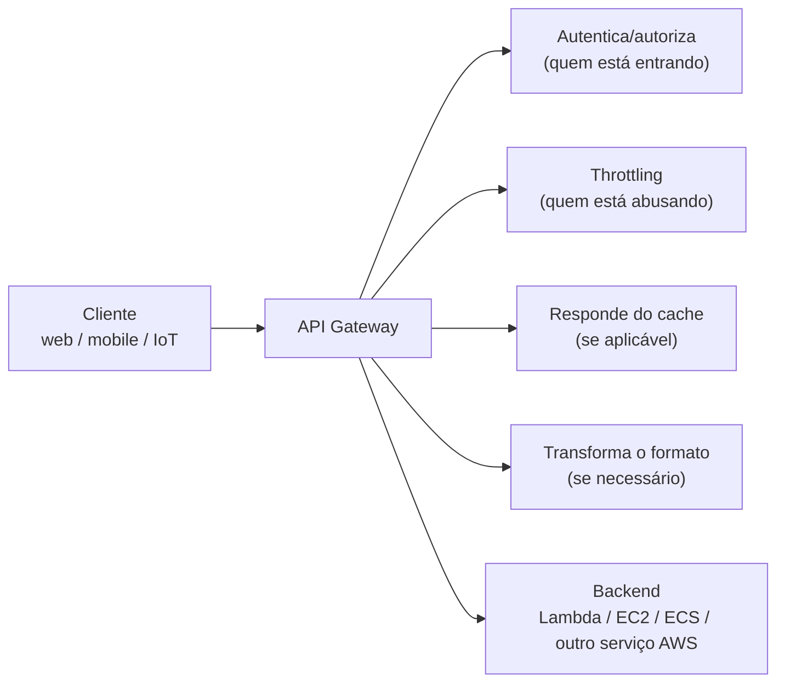
*O API Gateway como "porteiro": autenticação, throttling, cache e transformação antes de chegar ao backend.*

---

## 🗺️ Mapa Mental — Visão Geral de Todos os Tópicos

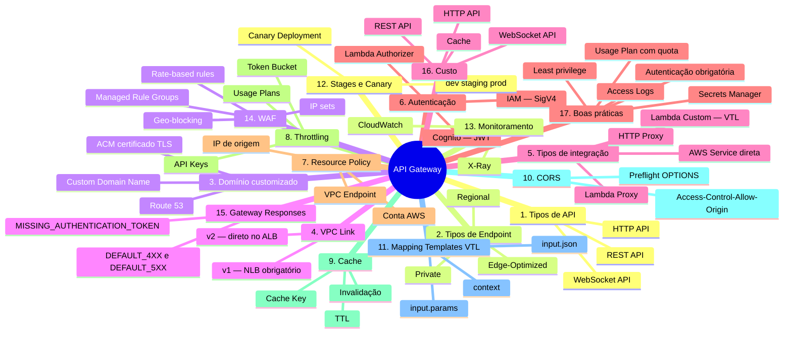
*Visão geral de todos os tópicos deste guia, organizados como aparecem nas seções abaixo.*

---

## 1. REST API vs HTTP API vs WebSocket API

### REST API
É a versão original e mais completa. Foi criada quando o API Gateway só existia nesse formato (por isso tem tanta feature). No dia a dia, você escolhe REST API quando precisa de pelo menos um destes:
- WAF na própria API (sem precisar de CloudFront)
- Cache de resposta
- Transformação de request/response (mapping templates)
- API Keys e Usage Plans nativos
- Resource Policies detalhadas
- Suporte a mais tipos de autorização combinados

**Trade-off real:** ela custa mais e tem latência um pouco maior porque tem mais "camadas" de processamento internamente.

### HTTP API
Lançada depois, para resolver o caso de uso mais comum: "eu só quero expor minha Lambda ou meu backend HTTP como uma API, com autenticação simples, e não preciso de todo o ferramental do REST API".

No dia a dia, é a escolha padrão quando você está construindo um backend novo simples (ex: um CRUD que fala com uma Lambda ou com um ALB). É **até 71% mais barata** e tem menor latência porque o AWS simplificou o pipeline de processamento interno.

**O que ela NÃO tem (e você sente falta quando precisa):** cache nativo, WAF direto, resource policies, request/response transformation completa. Se seu projeto crescer e precisar disso, você migra pra REST API ou coloca CloudFront + WAF na frente da HTTP API.

### WebSocket API
Resolve um problema totalmente diferente: comunicação **bidirecional e persistente**. HTTP tradicional é "pergunta-resposta" (request/response) e a conexão fecha. Em WebSocket, a conexão fica **aberta**, e tanto cliente quanto servidor podem mandar mensagens a qualquer momento sem o cliente precisar perguntar de novo.

Usado em: chat em tempo real, notificações ao vivo, dashboards que atualizam sozinhos, jogos multiplayer simples, cotações de bolsa em tempo real.

Como funciona na prática: você define rotas especiais —
- `$connect` (quando o cliente conecta)
- `$disconnect` (quando desconecta)
- `$default` (mensagens que não batem com nenhuma rota customizada)
- rotas customizadas baseadas no conteúdo da mensagem (ex: `sendMessage`, `joinRoom`)

Cada uma dessas rotas pode acionar uma Lambda diferente. É bem mais "evento" do que "requisição HTTP tradicional".

**Custo no dia a dia:** você paga por tempo de conexão ativa + por mensagem trafegada — diferente de REST/HTTP API que cobra só por requisição.

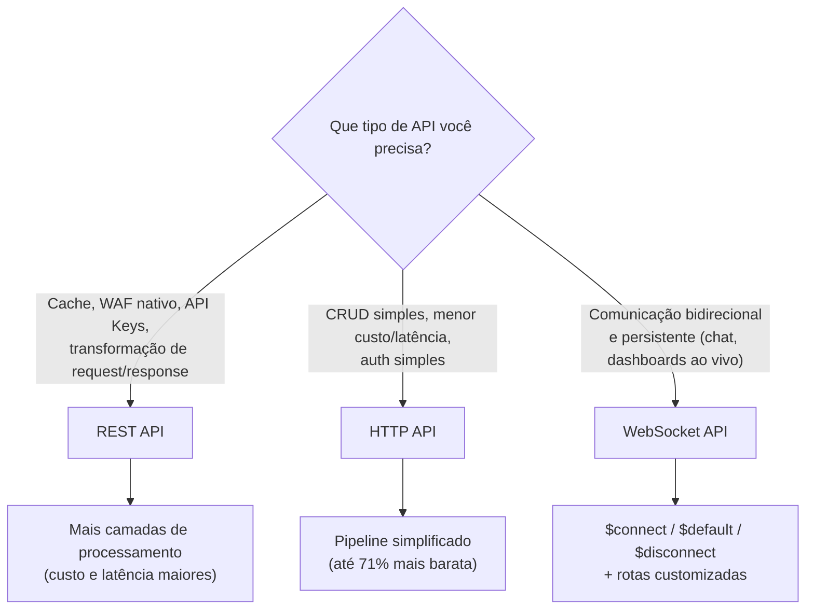
*Árvore de decisão entre os três tipos de API do API Gateway.*

---

## 2. Tipos de Endpoint — explicando o "porquê" por trás

### Edge-Optimized
O CloudFront (rede de CDN da AWS, com **pontos de presença espalhados no mundo todo**) fica na frente da sua API. Quando um usuário no Japão chama sua API, a requisição entra pelo ponto de presença do CloudFront mais próximo dele (não direto na sua região), e o CloudFront tem rotas otimizadas até a sua região de origem.

**Quando usar no dia a dia:** você tem usuários espalhados globalmente e latência de conexão importa (ex: app mobile consumido no mundo todo).

**O que muita gente erra na prova e no trabalho:** achar que Edge-Optimized "distribui o processamento" — não distribui. O processamento da API continua acontecendo só na região onde você criou ela. O CloudFront só otimiza a *rota de rede* até lá, não replica sua lógica.

### Regional
A requisição vai direto pra API na região, sem passar por CloudFront. Mais simples de gerenciar (menos uma camada), e faz mais sentido quando:
- Seus usuários estão concentrados numa região/país
- Você já vai colocar seu próprio CloudFront na frente (para ter controle total de cache, WAF, etc — muitas arquiteturas reais fazem isso mesmo em API regional, porque dá mais flexibilidade que o Edge-Optimized "pronto")

**Uso real comum:** a maioria dos projetos corporativos usa Regional + CloudFront próprio na frente, porque dá mais controle do que o modelo Edge-Optimized "empacotado".

### Private
A API nunca é exposta à internet. Ela só é acessível de dentro da sua VPC, através de um **Interface VPC Endpoint** (um ENI que "projeta" o serviço dentro da sua subnet).

**Uso real:** APIs internas entre microsserviços de uma empresa, onde por política de segurança/compliance nada pode ser exposto publicamente — ex: um sistema financeiro interno, uma API que só o time de outro departamento vai consumir, tudo dentro da rede corporativa (às vezes até integrada via Direct Connect/VPN com o datacenter on-premises).

```
EC2 (dentro da VPC) → VPC Endpoint (ENI privado) → API Gateway (Private)
```

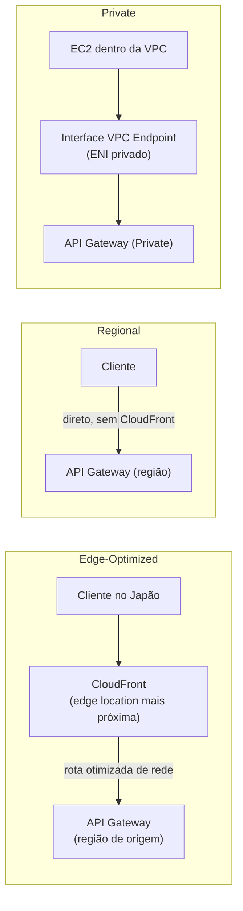
*Como a requisição chega até a API em cada tipo de endpoint.*

---

## 3. Domínio customizado, Route 53 e certificados — explicando o fluxo

Por padrão sua API tem essa URL feia:
```
https://abc123xyz.execute-api.us-east-1.amazonaws.com/prod
```

No dia a dia você quer algo como `api.suaempresa.com`. Para isso:

1. Você gera um certificado TLS no **ACM (AWS Certificate Manager)** para o domínio `api.suaempresa.com`.
2. Você cria um **Custom Domain Name** no API Gateway, associando esse certificado.
3. Você cria um registro no **Route 53** (tipo A/Alias) apontando `api.suaempresa.com` para o domínio gerado pelo API Gateway.

**Detalhe técnico importante (isso derruba muita gente na prática):**
- Se o endpoint for **Edge-Optimized**, o certificado TEM que estar na região **us-east-1 (N. Virginia)**, porque por baixo dos panos é o CloudFront que usa o certificado, e CloudFront exige certificados em us-east-1 — não importa em qual região sua API realmente está.
- Se for **Regional**, o certificado tem que estar na **mesma região** da API.

Isso é uma das pegadinhas mais comuns tanto na prova quanto em troubleshooting real de "certificado não funciona".

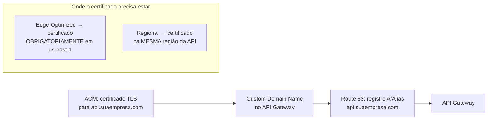
*Fluxo de configuração de domínio customizado e a regra de região do certificado.*

---

## 4. VPC Link — indo mais fundo

**Por que ele existe:** O API Gateway é um serviço *fora* da sua VPC, gerenciado pela AWS, rodando na infraestrutura deles. Ele não tem "acesso de rede" direto para dentro da sua VPC — assim como sua casa não tem acesso direto à rede interna do prédio vizinho. Precisa de uma "ponte" — isso é o VPC Link.

### VPC Link v1 (legado, historicamente usado por REST API)
Funciona criando um conjunto de **ENIs (Elastic Network Interfaces)** gerenciadas pela AWS que se conectam a um **Network Load Balancer (NLB)** que você precisa ter na sua VPC, na frente do seu backend (ALB, EC2, ECS).

Por que NLB e não direto no ALB? Porque NLB opera na camada 4 (TCP) e era o que permitia esse tipo de "peering" de rede de forma eficiente que o VPC Link v1 exigia.

```
API Gateway (REST) → VPC Link v1 → NLB → ALB → ECS/EC2
```


*Arquitetura legada: para a REST API chegar a um ALB privado, era obrigatório ter um NLB no meio como "ponte". Fonte: [AWS Compute Blog](https://aws.amazon.com/blogs/compute/build-scalable-rest-apis-using-amazon-api-gateway-private-integration-with-application-load-balancer/).*

### VPC Link v2 (usado por HTTP API, e agora também por REST API)
Mais moderno e direto — conecta-se a **ALB, NLB ou AWS Cloud Map** sem exigir NLB obrigatoriamente. Menos "camadas", mais simples de montar e mais barato.

```
API Gateway (HTTP API ou REST API) → VPC Link v2 → ALB → ECS
```


*Arquitetura atual: o NLB intermediário deixou de ser necessário. Fonte: [AWS Compute Blog](https://aws.amazon.com/blogs/compute/build-scalable-rest-apis-using-amazon-api-gateway-private-integration-with-application-load-balancer/).*

**⚠️ Atualização importante (novembro/2025):** até pouco tempo atrás, era regra fixa de prova que "REST API exige VPC Link v1 + NLB obrigatório na frente do ALB". A AWS anunciou em **21/nov/2025** que o **VPC Link v2 passou a suportar também REST APIs**, permitindo integração direta com ALB privado **sem precisar de NLB intermediário** — o mesmo benefício que já existia só para HTTP API. Isso reduz custo (menos um NLB rodando), reduz latência (menos um "salto" de rede) e simplifica a arquitetura. Bancas de certificação e materiais de estudo mais antigos ainda vão cobrar a regra antiga ("REST API = VPC Link v1 = precisa de NLB"), mas na prática atual, para uma arquitetura nova, você pode usar VPC Link v2 tanto com HTTP API quanto com REST API.

**No dia a dia:** se você está desenhando uma arquitetura nova hoje com backend privado, a combinação **VPC Link v2 + ALB** (seja com HTTP API ou REST API) é a mais simples, barata e recomendada.

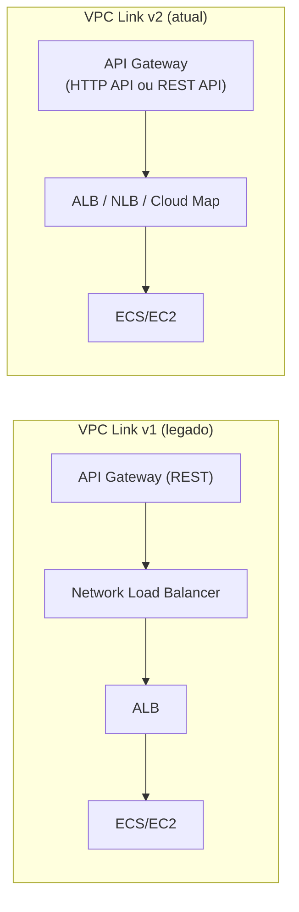
*v1 exige um NLB intermediário obrigatório; v2 conecta direto ao ALB (desde nov/2025, também para REST API).*

---

## 5. Tipos de integração — o que realmente acontece por dentro

### Lambda Proxy Integration
O API Gateway **não interpreta nada** da requisição. Ele empacota tudo (headers, query string, path params, body, IP do cliente, etc) num JSON padrão (`event`) e manda inteiro pra Lambda. A Lambda é responsável por interpretar tudo e devolver uma resposta num formato específico (`statusCode`, `headers`, `body`).

**Vantagem:** simples, flexível, você controla tudo no código.
**Desvantagem:** se você errar o formato de retorno da Lambda, a API quebra com erro genérico — no dia a dia isso é a causa nº1 de "minha API tá retornando 502" para quem está começando.

### Lambda Custom (non-proxy) Integration
Você configura **mapping templates** (VTL) para transformar a requisição antes dela chegar na Lambda, e a resposta antes dela sair. A Lambda recebe só o que você mapeou, não o evento inteiro.

**Quando usar no dia a dia:** quando você não controla o código da Lambda (ex: veio de outro time) e precisa adaptar formatos, ou quando quer esconder detalhes internos do backend do cliente da API.

### HTTP Proxy Integration
Repassa a requisição pra outra URL HTTP (pode ser um ALB, outro serviço, uma API de terceiro) sem transformação — o API Gateway vira basicamente um "reverse proxy gerenciado" com autenticação/throttling na frente.

### AWS Service Integration
O API Gateway chama a **API do próprio serviço AWS diretamente**, sem Lambda no meio. Você configura qual Action da API AWS ele deve chamar (ex: `SQS SendMessage`, `DynamoDB PutItem`).

**Por que isso é poderoso no dia a dia:** elimina uma "camada" desnecessária. Se seu objetivo é só "receber uma requisição HTTP e jogar numa fila SQS", colocar uma Lambda no meio só pra fazer `sqs.send_message()` é desperdício de custo e de latência. Chamar o SQS direto do API Gateway é mais rápido, mais barato e tem menos código pra manter.

Isso é chamado às vezes de arquitetura "Lambda-less" — ainda mais comum hoje em dia com HTTP API + integrações diretas.

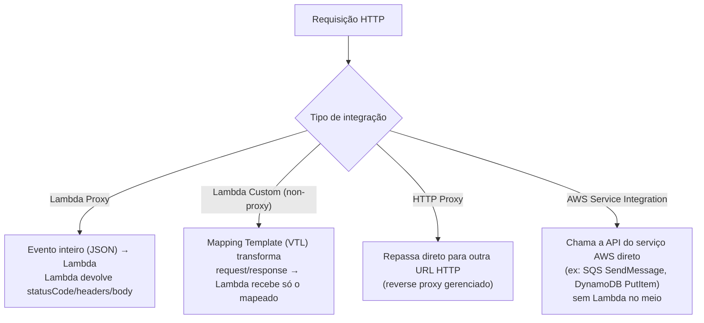
*Os quatro tipos de integração e o que acontece com a requisição em cada um.*

### HTTP API vs REST API — o que cada integração suporta

Nem toda integração está disponível nos dois tipos de API. Essa é uma pegadinha comum: você desenha a arquitetura pensando em HTTP API (mais barata) e descobre depois que precisa de um recurso que só existe em REST API.

| Integração / recurso | REST API | HTTP API |
|---|---|---|
| **Lambda Proxy** | ✅ | ✅ |
| **Lambda Custom (non-proxy, com VTL)** | ✅ | ❌ — só existe o modo proxy |
| **HTTP Proxy** | ✅ | ✅ |
| **HTTP Custom (non-proxy, com VTL)** | ✅ | ❌ — só existe o modo proxy |
| **AWS Service Integration direta** (SQS, DynamoDB, SNS, EventBridge, Step Functions, etc.) | ✅ desde o início | ✅ — mas só a partir de nov/2022 ("HTTP API direct integrations"), cobrindo cerca de 30 serviços |
| **Mock Integration** (resposta simulada, sem backend) | ✅ | ❌ — não existe em HTTP API |
| **Mapping Templates completos (VTL)** — transformar body/headers com lógica | ✅ | ❌ — só **parameter mapping** simples (ex: `$request.querystring.id`), sem lógica VTL |
| **VPC Link (integração privada)** | v1 (com NLB obrigatório) ou v2 (direto no ALB, desde nov/2025) | Apenas v2 (direto em ALB/NLB/Cloud Map) |
| **API Keys e Usage Plans nativos** | ✅ | ❌ — não tem suporte nativo (precisa controlar quota de outra forma, ex: Lambda Authorizer + DynamoDB) |
| **WAF** | ✅ (associação direta) | ❌ — precisa de CloudFront na frente |
| **Cache de resposta** | ✅ | ❌ — não existe cache nativo em HTTP API |

**Resumindo o critério na prática:** se o seu caso de uso é só "expor uma Lambda ou repassar pra um backend HTTP/ALB", **HTTP API** cobre bem, inclusive com integração direta a boa parte dos serviços AWS mais usados (SQS, EventBridge, Step Functions...). Mas no momento que você precisa de **VTL completo, Mock Integration, cache nativo, API Keys/Usage Plans ou WAF direto**, isso empurra a escolha de volta para **REST API**.

---

## 6. Autenticação/Autorização — aprofundando

### IAM Authorization
Usa as credenciais AWS do chamador (Access Key + Secret Key, assinando a requisição com **SigV4**). O API Gateway verifica se essa identidade (usuário/role IAM) tem uma **policy IAM** permitindo `execute-api:Invoke` naquele recurso.

**Uso real:** comunicação **serviço-a-serviço** dentro da AWS — ex: uma Lambda de outro sistema chamando sua API, ou um serviço em outra conta AWS (cross-account). Não é prático para usuários finais porque exigiria expor Access Keys no frontend, o que é inseguro.

### Cognito User Pools (JWT)
O fluxo completo:
1. Usuário se autentica no **Cognito User Pool** (login/senha, ou federado via Google/Facebook/SAML).
2. Cognito devolve um **JWT (JSON Web Token)** — um token assinado contendo as claims do usuário (id, grupos, etc).
3. O cliente manda esse token no header `Authorization` em toda chamada à API.
4. O API Gateway valida a assinatura do token (sem precisar chamar o Cognito de novo a cada requisição — valida localmente usando a chave pública do User Pool) e libera ou bloqueia.

**Uso real:** a combinação padrão para apps web/mobile modernos (SPA em React, app mobile) — é o "login com usuário e senha" clássico.

### Lambda Authorizer (Custom Authorizer)
Você escreve uma Lambda que recebe o token/headers da requisição e devolve uma **policy IAM customizada** dizendo se permite ou não, além de um `context` opcional que fica disponível pro backend.

**Quando usar no dia a dia:** quando seu sistema de autenticação não é Cognito (ex: você já tem um sistema de auth próprio, ou usa Auth0/Okta, ou valida um token de uma API de parceiro).

**Detalhe de performance importante:** por padrão o resultado do Lambda Authorizer é **cacheado por até 1 hora** (configurável) usando o token como chave — isso evita que toda requisição dispare uma nova execução da Lambda de auth, reduzindo custo e latência. Isso é um detalhe que passa despercebido e pode gerar bugs — "mudei a permissão do usuário mas a API não pegou" geralmente é isso.

```mermaid
flowchart TD
    subgraph IAM["IAM Authorization"]
        I1["Chamador assina requisição com SigV4"] --> I2["API Gateway verifica IAM Policy:\npermite execute-api:Invoke?"]
    end

    subgraph Cognito["Cognito User Pools (JWT)"]
        CO1["Usuário faz login no Cognito"] --> CO2["Cognito devolve JWT assinado"]
        CO2 --> CO3["Cliente envia JWT no header\nAuthorization em cada chamada"]
        CO3 --> CO4["API Gateway valida assinatura\nlocalmente (chave pública do User Pool)"]
    end

    subgraph LambdaAuth["Lambda Authorizer"]
        L1["Requisição chega com token/headers"] --> L2["Lambda Authorizer avalia"]
        L2 --> L3["Devolve policy IAM customizada + context"]
        L3 --> L4["Resultado cacheado por até 1h\n(chave = token)"]
    end
```
*Os três mecanismos de autenticação/autorização e o fluxo de cada um.*

---

## 7. Resource Policy — quando usar em vez de IAM normal

A Resource Policy fica **no lado da API** (diferente de uma IAM Policy, que fica no lado do usuário/role). Ela é útil quando você quer controlar acesso **independente de quem está chamando ter ou não uma IAM policy correta** — ex:

- Restringir por **IP de origem** (útil pra bloquear tudo fora da rede corporativa)
- Restringir por **VPC Endpoint específico** (útil para API privada, controlando exatamente qual VPC pode acessar)
- Permitir acesso apenas de **contas AWS específicas** (cenário multi-conta/organização)

**No dia a dia:** é muito usado em conjunto com IAM — a requisição só passa se **as duas** permitirem (é uma checagem em camadas, não uma substitui a outra).

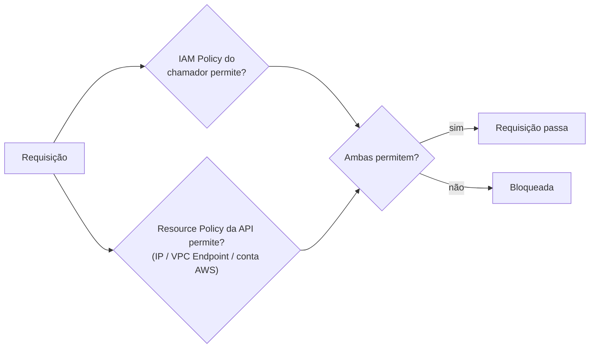
*Resource Policy e IAM Policy são checadas em camadas — as duas precisam permitir.*

---

## 8. Throttling e Usage Plans — o algoritmo por trás

O throttling do API Gateway usa o algoritmo de **Token Bucket**:
- Existe um "balde" com um número máximo de tokens = **burst limit**.
- Ele se reabastece numa taxa constante = **rate limit** (tokens/segundo).
- Cada requisição consome 1 token. Se o balde está vazio, a requisição é rejeitada com **HTTP 429**.

Isso permite picos curtos de tráfego (usando o burst acumulado) sem rejeitar tudo, mas protege contra tráfego sustentado alto.

**Usage Plans no dia a dia:** são usados para **API monetizada** — ex: você vende acesso à sua API para clientes externos, cada um recebe uma API Key associada a um plano (ex: "Free tier: 100 req/dia" vs "Pro: 10.000 req/dia"). É literalmente o modelo usado por diversos SaaS que vendem acesso a API.

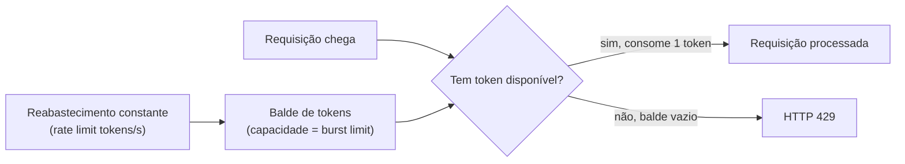
*Algoritmo de Token Bucket usado pelo throttling do API Gateway.*

---

## 9. Cache — indo além do TTL

O cache é armazenado por **cache key**, que por padrão é baseada no path + query strings do endpoint. Você pode customizar quais parâmetros fazem parte da chave.

**Cache por parâmetro (muito usado no dia a dia):** imagine `/produtos?categoria=eletronicos`. Se você incluir `categoria` na cache key, cada categoria terá sua própria entrada de cache — requisições com `categoria=roupas` não vão pegar o cache de `categoria=eletronicos`.

**Invalidação:** um cliente com a permissão IAM `execute-api:InvalidateCache` pode forçar a invalidação mandando o header `Cache-Control: max-age=0`. Isso é poderoso mas perigoso — em produção você normalmente **não** dá essa permissão para qualquer cliente, porque um cliente malicioso ou descuidado poderia invalidar o cache repetidamente e sobrecarregar seu backend (é uma forma de negar esse controle por segurança).

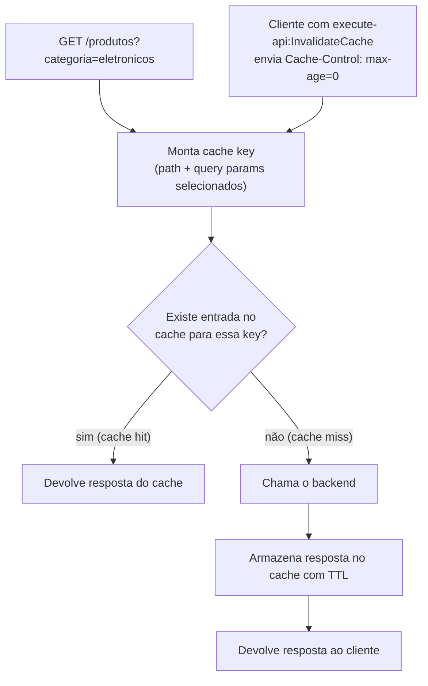
*Como a cache key é formada e o fluxo de hit/miss/invalidação.*

---

## 10. CORS — explicando o problema real por trás

CORS existe por causa da **Same-Origin Policy** dos navegadores: por segurança, JavaScript rodando numa página de um domínio (`app.suaempresa.com`) não pode, por padrão, fazer requisições para outro domínio (`api.suaempresa.com`) — mesmo sendo "sua própria" API.

Quando isso acontece, o navegador primeiro manda uma requisição **preflight** (`OPTIONS`) perguntando "ei API, você permite que `app.suaempresa.com` acesse você com o método POST e esse header customizado?". Se a API responder com os headers certos (`Access-Control-Allow-Origin`, etc.), o navegador libera a requisição real.

**Erro clássico do dia a dia:** você testa a API com Postman/curl e funciona perfeitamente, mas no navegador dá erro de CORS no console. Isso acontece porque **ferramentas como Postman e curl não aplicam CORS** (CORS é uma regra do navegador, não da API em si) — então só aparece quando você testa de fato no browser.

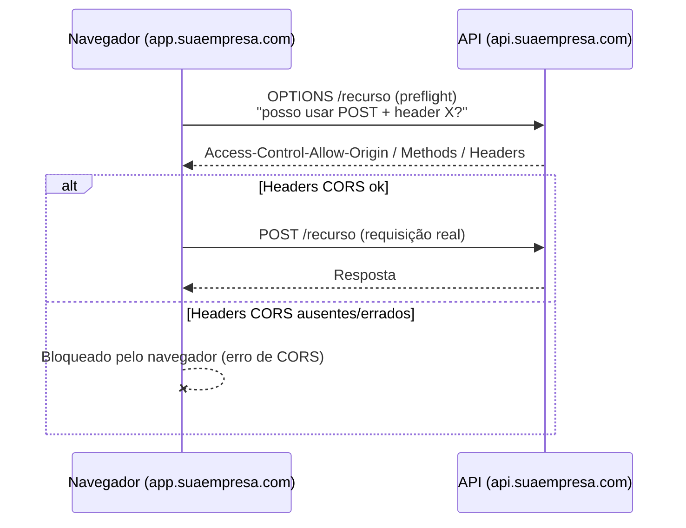
*Preflight OPTIONS é feito pelo navegador antes da requisição real — curl/Postman não fazem isso.*

---

## 11. Mapping Templates (VTL) — mais exemplos práticos

Além de transformar o corpo, você pode acessar parâmetros da requisição:

```vtl
{
  "usuarioId": "$input.params('userId')",
  "corpo": $input.json('$'),
  "ipOrigem": "$context.identity.sourceIp",
  "timestamp": "$context.requestTimeEpoch"
}
```

- `$input.params(...)` pega path/query/header params
- `$input.json(...)` pega o body inteiro ou parte dele (via JSONPath)
- `$context` dá acesso a metadados da requisição (IP, request ID, identidade do usuário autenticado, etc) — muito usado para logging/auditoria

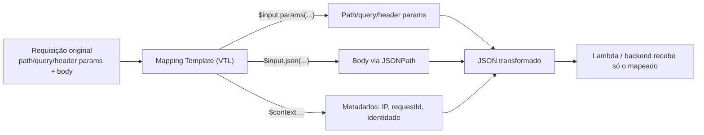
*Como o VTL monta o payload final a partir de diferentes fontes da requisição.*

---

## 12. Stages, Deployment e Canary — contexto de CI/CD real

No dia a dia (pipeline de CI/CD), o fluxo típico é:

1. Você desenvolve e testa a mudança em um ambiente `dev`.
2. Faz deploy pro stage `dev`, testa manualmente.
3. Promove (faz um novo deploy da mesma configuração) para o stage `staging`, roda testes automatizados.
4. Promove para `prod`.

**Canary Deployment na prática:** ao invés de jogar 100% do tráfego de produção pra nova versão de uma vez, você configura, por exemplo, "5% do tráfego vai pra nova versão, 95% continua na versão estável". Você monitora métricas de erro/latência da fatia canary por um tempo, e se estiver tudo bem, promove gradualmente até 100%. Isso é o mesmo conceito de *blue/green deployment*, aplicado no nível de configuração da API.

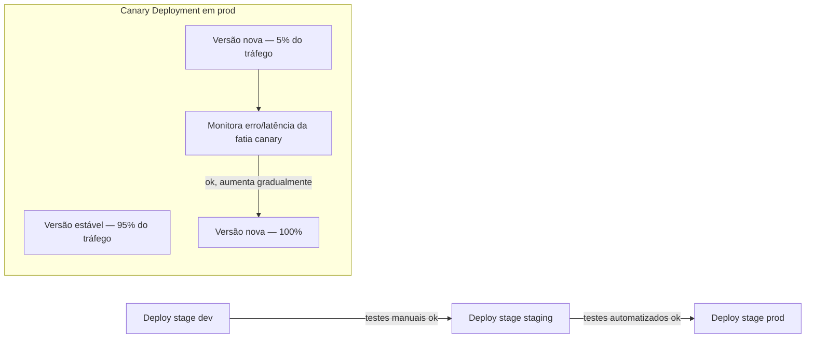
*Pipeline de promoção entre stages e o deploy gradual via canary.*

---

## 13. Monitoramento — o que observar de verdade em produção

No dia a dia, os alarmes mais úteis para configurar no CloudWatch são:
- **5XXError > 0** por período sustentado → algo quebrou no seu backend
- **4XXError** com pico anormal → pode ser bug no cliente, ou tentativa de ataque/abuso
- **Latency / IntegrationLatency** alto → `Latency` é o tempo total (API Gateway + backend); `IntegrationLatency` é só o tempo do backend. Se `IntegrationLatency` está alto mas `Latency` está só um pouco maior, o problema é no seu backend, não no API Gateway.
- **CacheHitCount vs CacheMissCount** → ajuda a saber se vale a pena manter cache ligado (se a taxa de hit é baixa, o cache não está ajudando muito e você paga por ele à toa)

**X-Ray no dia a dia:** essencial quando você tem uma cadeia tipo API Gateway → Lambda → DynamoDB → outro serviço, e precisa descobrir *onde exatamente* está a lentidão numa arquitetura distribuída. Sem X-Ray, você só vê "demorou 800ms" sem saber se foi a Lambda, o DynamoDB, ou uma chamada externa.

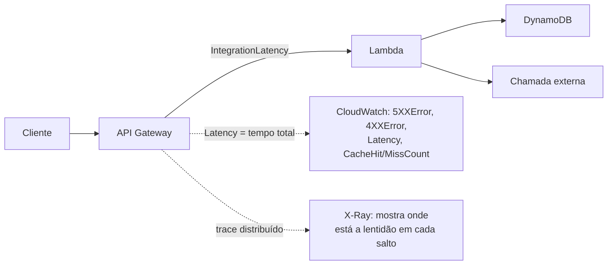
*Métricas do CloudWatch cobrem o total; X-Ray mostra o detalhe por serviço na cadeia.*

---

## 14. AWS WAF Integration — aprofundando

O WAF trabalha com **Web ACLs** compostas por regras. As mais usadas na prática:

- **Rate-based rules:** bloqueia automaticamente um IP que ultrapassa X requisições em 5 minutos — proteção básica contra DDoS de camada 7 e brute-force.
- **Managed Rule Groups da AWS:** conjuntos prontos (ex: `AWSManagedRulesCommonRuleSet`) que já bloqueiam padrões conhecidos de SQL Injection, XSS, etc — você não precisa escrever a regra, só ativar.
- **IP sets:** bloquear ou permitir listas específicas de IP.
- **Geo-blocking:** bloquear tráfego de países inteiros (útil se seu negócio só atende um país e você quer reduzir superfície de ataque).

**Limitação importante para lembrar:** WAF só se associa a **REST API regional** ou ao **CloudFront**. Se você usa HTTP API e precisa de WAF, a solução é colocar um **CloudFront na frente da sua HTTP API** e associar o WAF ao CloudFront.

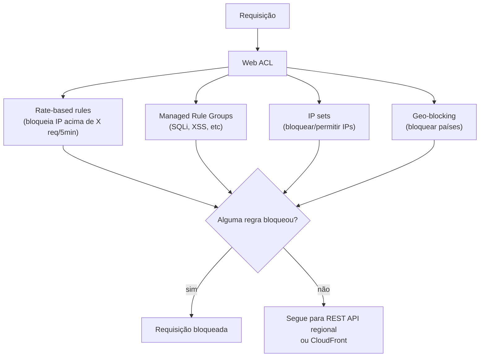
*WAF só se associa a REST API regional ou CloudFront — HTTP API precisa de CloudFront na frente.*

---

## 15. Gateway Responses

Controla como a API responde a erros que acontecem **antes mesmo de chegar no seu backend** — por exemplo, quando falta o token de autenticação, ou quando o throttling bloqueia. Sem isso, o cliente recebe uma resposta genérica da AWS que muitas vezes nem tem os headers de CORS, causando confusão ("por que dá erro de CORS só quando não estou autenticado?"). No dia a dia, é comum customizar pelo menos `DEFAULT_4XX`, `DEFAULT_5XX` e `MISSING_AUTHENTICATION_TOKEN` para garantir que os headers de CORS sempre estejam presentes, mesmo em erro.

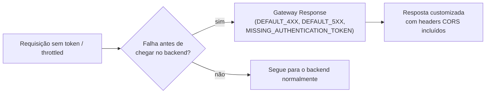
*Sem customizar o Gateway Response, erros antes do backend não têm headers CORS.*

---

## 16. Custo — o que pesa na fatura no mundo real

- REST API: cobrado por milhão de requisições + transferência de dados. Cache e uso adicional (X-Ray, etc) são cobrados à parte.
- HTTP API: significativamente mais barata por requisição.
- WebSocket API: cobrada por **conexão-minuto** + por mensagem — se você tem muitas conexões abertas e ociosas por longos períodos, isso pesa (vale considerar timeout de conexão inativa).
- Cache: cobrado por hora, baseado no tamanho alocado (0.5 GB a 237 GB) — **mesmo sem uso**, se está ligado, você paga. É comum esquecer cache ligado em ambiente de teste e ter surpresa na fatura.

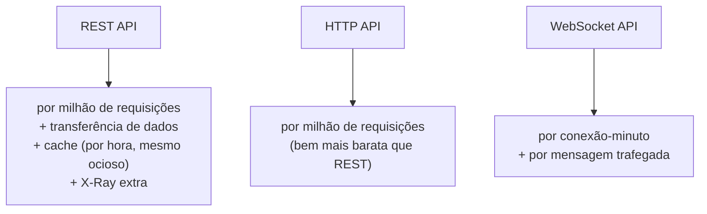
*Modelo de cobrança de cada tipo de API — atenção especial ao cache ligado sem uso.*

---

## 17. Boas práticas de segurança para o dia a dia

- Nunca deixe uma API em produção sem **algum tipo de autenticação**, mesmo que seja só uma API Key básica — evita indexação/abuso automático.
- Prefira **Usage Plans com quota** para qualquer API exposta a terceiros, mesmo internos — evita que um bug em outro time derrube seu backend com requisições em loop.
- Use **least privilege** nas Resource Policies e nas roles IAM que o API Gateway assume para chamar Lambda/serviços AWS.
- Habilite **Access Logs** em produção desde o primeiro dia — depurar um incidente sem log histórico é muito mais difícil.
- Trate segredos (tokens de terceiros, chaves de API de parceiros) fora do código — normalmente via **Secrets Manager** ou **Parameter Store**, nunca hardcoded em Lambda ou em mapping templates.

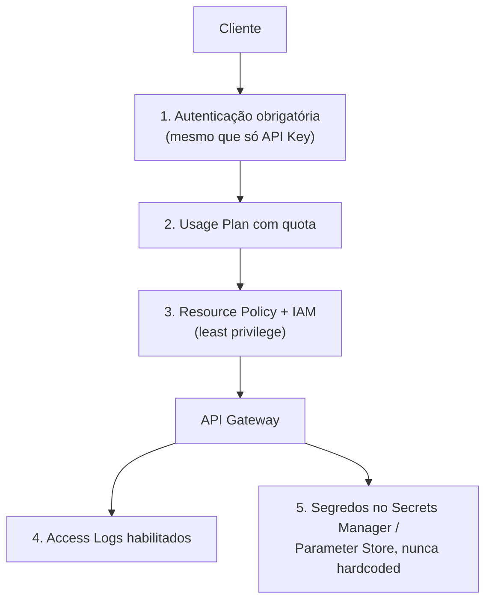
*Camadas de segurança recomendadas para uma API em produção.*

---

# 🧪 Laboratório prático (para executar na AWS)

## Objetivo
Criar uma REST API pública que aciona uma função Lambda, com deploy em um stage, e testar com `curl`.

### Passo 1 — Criar a função Lambda
Console → Lambda → **Create function**
- Nome: `minha-api-lambda`
- Runtime: Python 3.12 (ou Node.js)

```python
import json

def lambda_handler(event, context):
    return {
        "statusCode": 200,
        "headers": {"Content-Type": "application/json"},
        "body": json.dumps({"mensagem": "Olá do API Gateway!", "path": event.get("path")})
    }
```

### Passo 2 — Criar a REST API
Console → API Gateway → **Create API** → REST API → Build
- Endpoint Type: **Regional**
- Nome: `minha-primeira-api`

### Passo 3 — Criar recurso e método
- **Actions → Create Resource** → nome `hello`
- **Actions → Create Method** → GET
- Integration type: **Lambda Function**, marque **Use Lambda Proxy integration**
- Selecione a função `minha-api-lambda`

### Passo 4 — Deploy
- **Actions → Deploy API** → Stage name: `dev`
- URL gerada:
```
https://{api-id}.execute-api.{region}.amazonaws.com/dev/hello
```

### Passo 5 — Testar
```bash
curl https://{api-id}.execute-api.us-east-1.amazonaws.com/dev/hello
```

### Passo 6 — Experimentos para fixar cada conceito
1. **CORS:** habilite no recurso `hello`, veja o método `OPTIONS` criado automaticamente, e teste chamando de um HTML simples aberto no navegador (não no curl) para ver o comportamento real de preflight.
2. **API Key + Usage Plan:** exija a key no método (`API Key Required: true`), crie um Usage Plan com rate 1 req/s e burst 2, associe ao stage `dev`, gere uma API Key, e dispare requisições em loop rápido para ver o `429`.
3. **Cache:** habilite caching no stage `dev`, observe o header `X-Cache` e o tempo de resposta variar entre a primeira chamada (miss) e as seguintes (hit).
4. **Gateway Response:** customize o `MISSING_AUTHENTICATION_TOKEN` para devolver um JSON customizado com headers CORS.
5. **AWS Service Integration direto:** crie um segundo recurso `/fila`, método POST, integração direta com **SQS SendMessage** (sem Lambda), e compare a latência com a chamada via Lambda.
6. **Monitoramento:** abra o CloudWatch, veja as métricas `Count`, `Latency`, `4XXError` geradas pelos testes acima, e crie um alarme simples para `5XXError > 0`.

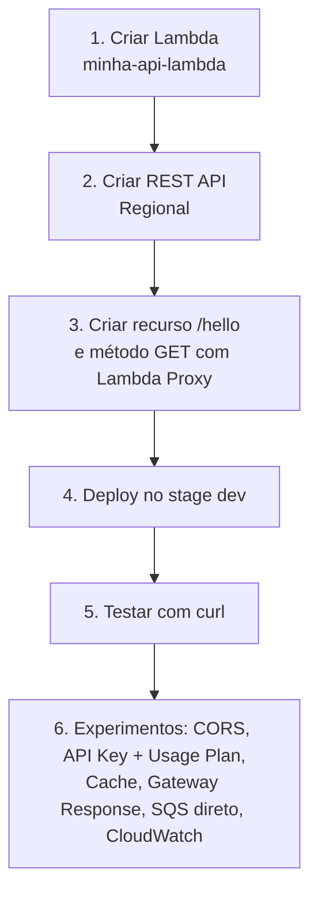
*Sequência dos passos do laboratório prático.*

---

## Comandos AWS CLI úteis

```bash
# Criar API
aws apigateway create-rest-api --name 'api-via-cli' --endpoint-configuration types=REGIONAL

# Listar APIs
aws apigateway get-rest-apis

# Deploy de um stage
aws apigateway create-deployment --rest-api-id {api-id} --stage-name dev

# Ver métricas de erro no CloudWatch (últimos 60 min)
aws cloudwatch get-metric-statistics \
  --namespace AWS/ApiGateway \
  --metric-name 5XXError \
  --dimensions Name=ApiName,Value=minha-primeira-api \
  --start-time $(date -u -d '-1 hour' +%Y-%m-%dT%H:%M:%S) \
  --end-time $(date -u +%Y-%m-%dT%H:%M:%S) \
  --period 300 \
  --statistics Sum
```

---

## Tabela de decisão rápida (prova + dia a dia)

| Cenário | Resposta provável |
|---|---|
| Menor custo/latência, sem recursos avançados | HTTP API |
| WAF, cache, transformação de request/response, API Keys | REST API |
| Comunicação em tempo real bidirecional | WebSocket API |
| Backend em VPC privada atrás de ALB (arquitetura nova, HTTP ou REST API) | VPC Link v2 (direto no ALB, sem NLB) |
| Backend em VPC privada (arquitetura legada/prova mais antiga) | REST API + VPC Link v1 + NLB |
| API só usada dentro da VPC, sem exposição pública | Private Endpoint + VPC Endpoint |
| Usuários globais, latência baixa via edge locations | Edge-Optimized |
| Controle total de cache/CDN próprio | Regional + CloudFront próprio |
| Só precisa jogar dado numa fila/tabela, sem lógica | AWS Service Integration direto (sem Lambda) |
. README.md
