# IAM Fundamentos — Guia Completo (Teoria + Prática + Dia a Dia)

## 0. O problema que o IAM resolve

Antes de entrar nos componentes, vale entender por que o IAM existe e por que ele é o serviço mais
fundamental de toda a AWS — literalmente tudo que você faz na AWS passa por uma checagem de IAM.

Numa infraestrutura em nuvem, você tem múltiplos atores tentando fazer coisas: pessoas (desenvolvedores,
administradores), aplicações (uma EC2 chamando S3, uma Lambda chamando DynamoDB), e sistemas externos
(um parceiro, um pipeline de CI/CD). Para cada uma dessas interações, duas perguntas precisam ser
respondidas antes de qualquer ação acontecer:

1. **Quem é você?** (autenticação — *authentication*)
2. **O que você tem permissão de fazer?** (autorização — *authorization*)

O **IAM (Identity and Access Management)** é o serviço que responde as duas. Sem ele, qualquer chamada
de API na AWS seria "confia e deixa passar" — o que obviamente não escala nem é seguro. O IAM é o
"segurança na porta + crachá de acesso" de toda a AWS: primeiro confere quem você é, depois confere
o que o seu crachá permite abrir.

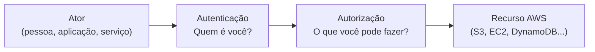
*Toda chamada de API na AWS passa primeiro pela pergunta "quem é você" e depois "o que você pode fazer".*

**Autenticação vs autorização — a distinção que a prova adora cobrar:**

| Conceito | Pergunta que responde | Exemplo prático |
|---|---|---|
| **Autenticação** | Quem é você? | Login com usuário/senha, Access Key + Secret Key assinando a requisição, MFA |
| **Autorização** | O que você pode fazer, dado quem você é? | Uma policy IAM permitindo `s3:GetObject` só no bucket `meu-bucket` |

Você pode estar perfeitamente autenticado (a AWS sabe exatamente quem você é) e mesmo assim ser barrado
por falta de autorização (você não tem uma policy permitindo aquela ação). São camadas independentes.

**Identidade vs recurso — a outra distinção importante:**

- **Identidade** (*principal*) é quem faz a chamada: um User, uma Role assumida, um serviço da AWS agindo
  em seu nome.
- **Recurso** é o alvo da chamada: um bucket S3, uma tabela DynamoDB, uma fila SQS.

Uma permissão pode ser anexada em qualquer um dos dois lados — isso é a diferença entre **identity-based
policy** (anexada à identidade) e **resource-based policy** (anexada ao recurso), que detalhamos na
seção 3.

---

## 1. Users, Groups e Roles — e por que Roles ganham no dia a dia

### IAM Users
Representam uma identidade permanente — normalmente uma pessoa real ou, historicamente, uma aplicação.
Um User pode ter:
- Senha para console (com política de senha configurável, MFA obrigatório recomendado)
- **Access Keys** (Access Key ID + Secret Access Key) para chamadas programáticas (CLI, SDK)

**O problema real dos Users com Access Key:** essas credenciais são **de longa duração** — elas continuam
válidas até alguém revogar manualmente. Se vazarem (commitadas por engano num repositório Git público,
por exemplo — isso acontece com uma frequência assustadora no mundo real), ficam utilizáveis
indefinidamente até alguém perceber e desativar.

### IAM Groups
Não são uma identidade — são um **agrupador de Users** para aplicar policies em lote. Você não pode
"logar" como um Group, e um Role não pode pertencer a um Group. É só uma forma de organizar: em vez de
anexar a mesma policy em 20 Users individualmente, você anexa uma vez no Group e coloca os 20 Users
dentro dele.

**Detalhe que pega gente na prova:** Groups não podem ser aninhados (não existe Group dentro de Group),
e um Group **não é um principal** — ele não pode ser referenciado como principal numa resource-based
policy ou numa trust policy.

### IAM Roles
Uma Role é uma identidade que **não tem credenciais fixas** — em vez disso, qualquer entidade autorizada
(um User, um serviço AWS, uma conta externa, um usuário federado) pode **assumir** a Role e, em troca,
recebe **credenciais temporárias** (Access Key, Secret Key e um Session Token, todos com expiração —
minutos a algumas horas) geradas pelo **STS (Security Token Service)**, que detalhamos na seção 7.

**Por que Roles são preferíveis a Access Keys de longa duração — o argumento completo:**

| Dimensão | Access Key de longa duração (User) | Credenciais temporárias (Role via STS) |
|---|---|---|
| Duração | Válida indefinidamente até rotação/revogação manual | Expira automaticamente (minutos/horas) |
| Risco se vazar | Alto — utilizável até alguém perceber e agir | Baixo — janela de exploração é curta, geralmente já expirou |
| Rotação | Manual, processo operacional que costuma ser esquecido | Automática, embutida no mecanismo |
| Uso em serviços AWS (EC2, Lambda) | Exigiria armazenar a chave em algum lugar (risco de exposição) | A AWS injeta e rotaciona a credencial por trás dos panos |
| Auditoria | Menos granular — a mesma chave é usada por muito tempo | Cada assunção de Role gera um evento de `AssumeRole` no CloudTrail, rastreável |

**No dia a dia:** a recomendação padrão (e cada vez mais reforçada pela própria AWS) é: **nunca crie
Access Keys de longa duração se puder evitar.** Para aplicações rodando em EC2/ECS/Lambda, use Roles
(Instance Profile, Task Role, execution role). Para pessoas, prefira login federado (SSO/Identity Center)
combinado com AssumeRole, em vez de Users com senha e Access Key fixos. Access Keys de longa duração
hoje em dia são vistas quase como um "último recurso" — usadas só quando realmente não há alternativa
(ex: uma aplicação legada fora da AWS que precisa de credenciais estáticas).

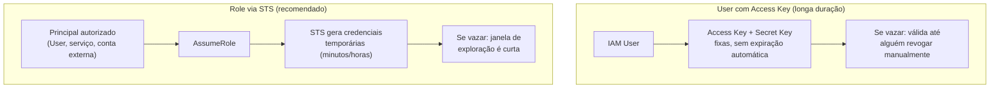
*Access Keys fixas vs credenciais temporárias via Role — o motivo pelo qual Roles são a prática recomendada.*

**Casos de uso clássicos de Role:**
- **Instance Profile** — uma EC2 assume uma Role para acessar S3/DynamoDB/etc sem credenciais hardcoded (seção 8).
- **Cross-account access** — usuários/roles de uma conta acessando recursos de outra (seção 6).
- **Federação** — usuários corporativos (via SAML/AD) ou usuários de um app mobile (via Cognito/OIDC)
  recebendo credenciais temporárias da AWS sem nunca terem um IAM User (seção 7).
- **Serviços AWS agindo em seu nome** — ex: Lambda precisa de uma **execution role** para gravar logs
  no CloudWatch, API Gateway precisa de uma role para chamar SQS diretamente.

---

## 2. Anatomia de uma Policy JSON

Toda policy IAM é um documento JSON com uma estrutura previsível. Entender essa anatomia é essencial
porque tanto a prova quanto o troubleshooting real giram em torno de "por que essa policy não fez o que
eu esperava".

```json
{
  "Version": "2012-10-17",
  "Statement": [
    {
      "Sid": "PermitirLeituraBucketEspecifico",
      "Effect": "Allow",
      "Action": ["s3:GetObject", "s3:ListBucket"],
      "Resource": [
        "arn:aws:s3:::meu-bucket",
        "arn:aws:s3:::meu-bucket/*"
      ],
      "Condition": {
        "IpAddress": {
          "aws:SourceIp": "203.0.113.0/24"
        }
      }
    }
  ]
}
```

- **Version** — versão da linguagem da policy (praticamente sempre `2012-10-17`, mesmo em policies novas
  — é só a versão da sintaxe, não uma data de criação).
- **Statement** — lista de declarações; cada uma é uma regra independente.
- **Sid** (opcional) — um identificador legível para a declaração, útil para debug.
- **Effect** — `Allow` ou `Deny`. Não existe meio-termo.
- **Action** — quais operações da API são afetadas (ex: `s3:GetObject`, `ec2:StartInstances`, ou `*`
  para tudo).
- **Resource** — em qual(is) recurso(s), identificados por ARN, essa regra se aplica.
- **Condition** (opcional) — restrições adicionais: IP de origem, presença de MFA, tag do recurso,
  horário, região, etc.

**Detalhe técnico importante:** em uma **identity-based policy** (anexada a um User/Group/Role), o
elemento `Resource` é obrigatório e o `Principal` **não aparece** — porque o principal já está implícito
(é quem a policy está anexada). Já em uma **resource-based policy** (anexada ao recurso, como uma bucket
policy do S3), o `Principal` é **obrigatório** — porque você precisa dizer explicitamente "quem" tem essa
permissão, já que a policy não está anexada a ninguém específico.

### Identity-based vs Resource-based Policies

| Aspecto | Identity-based Policy | Resource-based Policy |
|---|---|---|
| Onde fica anexada | No User, Group ou Role | No recurso (bucket S3, fila SQS, tópico SNS, KMS key...) |
| Elemento `Principal` | Não existe (implícito) | Obrigatório — declara quem tem acesso |
| Concede acesso cross-account? | Sozinha, não — precisa de AssumeRole do outro lado | Sim — pode conceder acesso direto a outra conta sem Role |
| Exemplos | Policies anexadas a um User ou Role | Bucket Policy (S3), Policy de fila (SQS), Key Policy (KMS) |
| Quem pode ter | Users, Groups, Roles | Poucos serviços suportam (S3, SQS, SNS, KMS, Lambda, API Gateway...) |

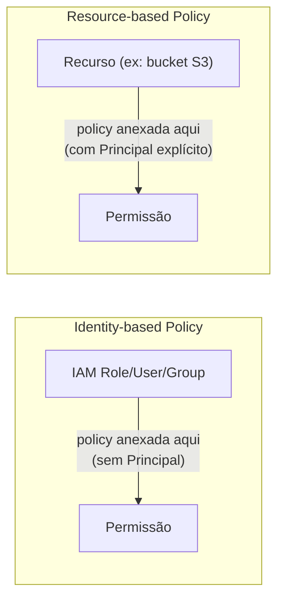
*Identity-based fica "no lado de quem pede"; resource-based fica "no lado do recurso" e precisa declarar quem tem acesso.*

**No dia a dia:** resource-based policies são a ferramenta principal para dar acesso **cross-account sem
precisar que o outro lado assuma uma Role** — por exemplo, uma bucket policy do S3 permitindo que a conta
`999999999999` leia objetos diretamente. Isso é mais simples em alguns cenários (ex: parceiros externos
lendo dados publicados), mas dá menos controle de auditoria do que o padrão AssumeRole.

---

## 3. Lógica de avaliação de policies — o coração da prova

Esse é provavelmente o tópico mais cobrado de toda a seção de segurança do SAA-C03. A lógica de avaliação
segue uma ordem fixa, sempre:

1. **Default deny** — por padrão, tudo é negado. Nenhuma ação é permitida a menos que exista um `Allow`
   explícito em algum lugar aplicável.
2. **Explicit allow** — se existir pelo menos um `Allow` em qualquer policy aplicável (identity-based,
   resource-based, permission boundary, SCP, session policy) e **nenhum Deny em nenhuma delas**, a ação
   é permitida.
3. **Explicit deny sempre vence** — se **qualquer** policy aplicável tiver um `Deny` explícito para
   aquela ação/recurso, a requisição é negada, **não importa quantos `Allow` existam em outro lugar**.

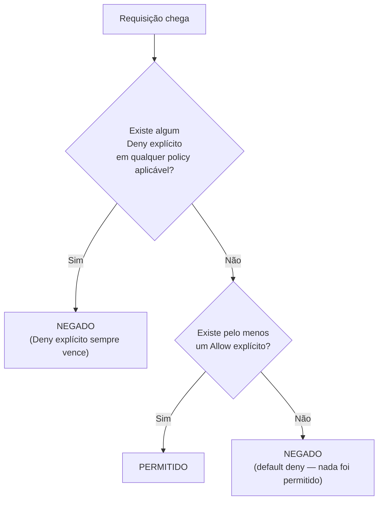
*Fluxo de avaliação: deny explícito vence tudo; sem allow explícito, o default é negar.*

**Por que isso importa na prática:** imagine que a Role de um desenvolvedor tem uma identity-based policy
com `"Effect": "Allow", "Action": "s3:*"` (acesso total a S3). Mas essa mesma Role também tem uma
**permission boundary** ou está sujeita a uma **SCP** que tem `"Effect": "Deny"` para `s3:DeleteBucket`.
Resultado: o desenvolvedor **não consegue** deletar buckets, mesmo com o `Allow` amplo na policy dele —
porque o Deny explícito, vindo de qualquer camada aplicável, sempre prevalece.

**Pegadinha clássica de prova:** "Se um User não tem NENHUMA policy anexada, ele consegue fazer alguma
coisa?" Resposta: **não** — o default é deny. É preciso um Allow explícito de algum lugar para qualquer
ação acontecer.

**Onde entram as múltiplas camadas de avaliação:** numa conta com Organizations, a avaliação completa
passa por: SCP da Organization (guard rail máximo) → Permission Boundary (se existir) → Identity-based
Policy → Resource-based Policy (se aplicável) → Session Policy (se a chamada for via AssumeRole com
policy de sessão). Um Deny em **qualquer** uma dessas camadas mata a requisição.

---

## 4. Managed Policies (AWS managed vs Customer managed) vs Inline Policies

| Tipo | Quem gerencia | Reutilizável entre identidades? | Versionamento | Uso recomendado |
|---|---|---|---|---|
| **AWS Managed Policy** | AWS | Sim — a mesma policy pode ser anexada a vários Users/Roles | AWS atualiza automaticamente | Bom para começar rápido (ex: `AmazonS3ReadOnlyAccess`), mas costuma ser mais ampla do que o necessário |
| **Customer Managed Policy** | Você | Sim | Você controla versões (até 5 versões guardadas, uma marcada como *default*) | Recomendado no dia a dia — você desenha least privilege sob medida e reaproveita entre identidades |
| **Inline Policy** | Você | Não — vive presa a um único User/Group/Role, morre se a identidade for deletada | Não tem versionamento próprio | Casos onde a permissão é estritamente 1-para-1 com aquela identidade específica e não deve ser reaproveitada nem sobreviver à identidade |

**No dia a dia:** a prática recomendada da própria AWS é preferir **customer managed policies** para a
maioria dos casos — dão flexibilidade de reuso e um histórico de versões que ajuda em rollback ("a policy
começou a quebrar algo, volto pra versão anterior"). AWS managed policies são ótimas para prototipagem
mas tendem a ser mais permissivas do que o ideal para produção. Inline policies fazem sentido quando você
quer garantir que aquela permissão **nunca** seja acidentalmente reaproveitada em outra identidade — por
exemplo, uma permissão bem específica e sensível atrelada só àquela Role de automação.

**O que muita gente erra na prova:** achar que Inline Policy é "mais forte" ou tem prioridade sobre
Managed Policy. Não tem — na avaliação, todas as policies aplicáveis (managed ou inline) são combinadas
juntas, seguindo a mesma lógica de default deny / explicit allow / explicit deny da seção 3. A diferença
entre elas é puramente de **gerenciamento e ciclo de vida**, não de precedência.

---

## 5. Permission Boundaries

Uma Permission Boundary é uma **policy JSON especial anexada a um User ou Role** que define o **teto
máximo** de permissões que aquela identidade pode ter — mesmo que as identity-based policies anexadas a
ela sejam mais permissivas.

**A regra chave:** a permissão efetiva de uma identidade com Permission Boundary é a **interseção** entre
o que a identity-based policy permite e o que a boundary permite. Se a boundary não menciona uma ação
como permitida, essa ação fica bloqueada — não importa o que a policy normal diga.

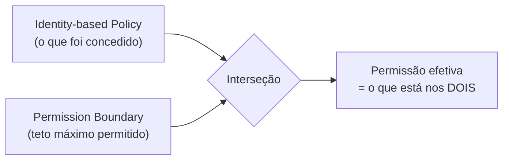
*A permissão efetiva de uma identidade com Permission Boundary é sempre a interseção entre a policy e a boundary.*

**Por que isso existe — o caso de uso real:** imagine que você tem um time de plataforma que precisa
poder **criar** Roles e Users para os desenvolvedores (delegação de administração de IAM), mas você não
quer que esse time consiga criar uma Role com permissões maiores do que as deles próprios (escalada de
privilégio). Você resolve isso definindo que qualquer Role criada por esse time **precisa** ter uma
Permission Boundary específica anexada — assim, mesmo que o time de plataforma anexe uma policy
`AdministratorAccess` por engano ou má intenção na Role criada, a boundary limita o que aquela Role
realmente pode fazer.

### Permission Boundary vs SCP vs Policy normal — tabela comparativa

| Aspecto | Permission Boundary | SCP (Service Control Policy) | Identity-based Policy normal |
|---|---|---|---|
| Nível de aplicação | Uma identidade específica (User/Role) | Toda uma conta, OU, ou toda a Organization | Uma identidade específica |
| Concede permissão sozinha? | Não — só define o teto máximo | Não — só define o teto máximo | Sim — é quem realmente concede |
| Afeta o root user da conta? | Não se aplica ao root | Sim (exceto na management account) | Não se aplica ao root da mesma forma |
| Onde é gerenciada | Dentro da conta, por quem administra IAM | No AWS Organizations, pela management account | Dentro da conta, por quem administra IAM |
| Análogia | "Coleira" numa identidade específica | "Guarda-corpo" em volta de contas inteiras | "O que essa identidade pode fazer" |

Ambas — Permission Boundary e SCP — são mecanismos de **teto** (não concedem nada por si só), mas atuam
em escopos diferentes: Boundary é por identidade dentro de uma conta; SCP é por conta/OU dentro da
Organization. Detalhamos SCP em profundidade no arquivo `02-Organizations-e-SCPs.md`.

**O que muita gente erra na prova:** confundir Permission Boundary com uma policy que "dá" permissão.
Ela nunca dá — ela só limita. Uma identidade sem nenhuma identity-based policy, mesmo com uma Permission
Boundary generosíssima, ainda não consegue fazer nada (porque a interseção com "nada" é "nada").

---

## 6. Cross-account access — Trust Policy vs Permission Policy

Quando você quer que uma identidade da Conta A acesse recursos da Conta B via Role, existem **duas
policies separadas e complementares** envolvidas — essa separação é outro ponto muito cobrado:

1. **Trust Policy** (Assume Role Policy) — fica **na Role da Conta B** (a conta que está "emprestando"
   acesso). Define **quem tem permissão de assumir essa Role** — o Principal aqui é a Conta A (ou uma
   Role/User específico da Conta A).
2. **Permission Policy** — também fica na Role da Conta B, mas define **o que a Role pode fazer** depois
   de assumida (ex: `s3:GetObject` no bucket X).

Além disso, do lado da Conta A, a identidade que vai assumir a Role precisa ter uma permissão explícita
para chamar `sts:AssumeRole` naquele ARN de Role específico — sem isso, mesmo que a trust policy da
Conta B permita, a Conta A também precisa autorizar a saída.

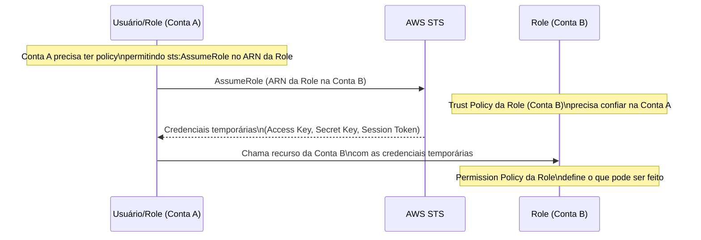
*Trust Policy autoriza QUEM pode assumir a Role; Permission Policy autoriza O QUE fazer depois de assumida.*

**Exemplo de Trust Policy (na Role da Conta B):**

```json
{
  "Version": "2012-10-17",
  "Statement": [
    {
      "Effect": "Allow",
      "Principal": {
        "AWS": "arn:aws:iam::111111111111:root"
      },
      "Action": "sts:AssumeRole",
      "Condition": {
        "StringEquals": {
          "sts:ExternalId": "id-combinado-com-o-parceiro"
        }
      }
    }
  ]
}
```

**No dia a dia:** o padrão `sts:ExternalId` acima é usado especificamente em cenários envolvendo
**terceiros** (ex: uma ferramenta de monitoramento SaaS que precisa de acesso à sua conta) para mitigar
o chamado **confused deputy problem** — evitar que outro cliente do mesmo terceiro, por engano ou má
intenção, consiga assumir sua Role usando as credenciais do terceiro.

**O que muita gente erra na prova:** achar que só a trust policy já é suficiente para o acesso funcionar.
Não é — faltando a permissão de `sts:AssumeRole` do lado de quem está chamando (Conta A), a assunção
falha mesmo com a trust policy da Conta B toda certa. As duas pontas precisam concordar.

---

## 7. STS — Security Token Service

O STS é o serviço que **emite credenciais temporárias**. Ele é o mecanismo por trás de praticamente todo
uso de Role. As operações mais importantes:

| Operação | Quando é usada |
|---|---|
| **AssumeRole** | Uma identidade IAM (User ou Role) já autenticada na AWS assume outra Role — cross-account, ou elevação de privilégio dentro da mesma conta |
| **AssumeRoleWithWebIdentity** | Um usuário autenticado por um provedor OIDC externo (Google, Facebook, um provedor OIDC customizado) troca o token dele por credenciais temporárias AWS — hoje, na prática, quase sempre feito **através do Cognito Identity Pool** em vez de chamado diretamente |
| **AssumeRoleWithSAML** | Um usuário autenticado via um IdP corporativo SAML 2.0 (Active Directory Federation Services, Okta, etc) troca a asserção SAML por credenciais temporárias AWS — usado tipicamente para acesso ao Console/CLI por funcionários sem precisar de IAM User individual |
| **GetSessionToken** | Gera credenciais temporárias para o próprio usuário (não troca de identidade) — usado principalmente para habilitar MFA em chamadas de API feitas com credenciais de longa duração |
| **GetFederationToken** | Gera credenciais temporárias federadas com uma policy customizada de sessão — legado, hoje em dia largamente substituído por AssumeRole |

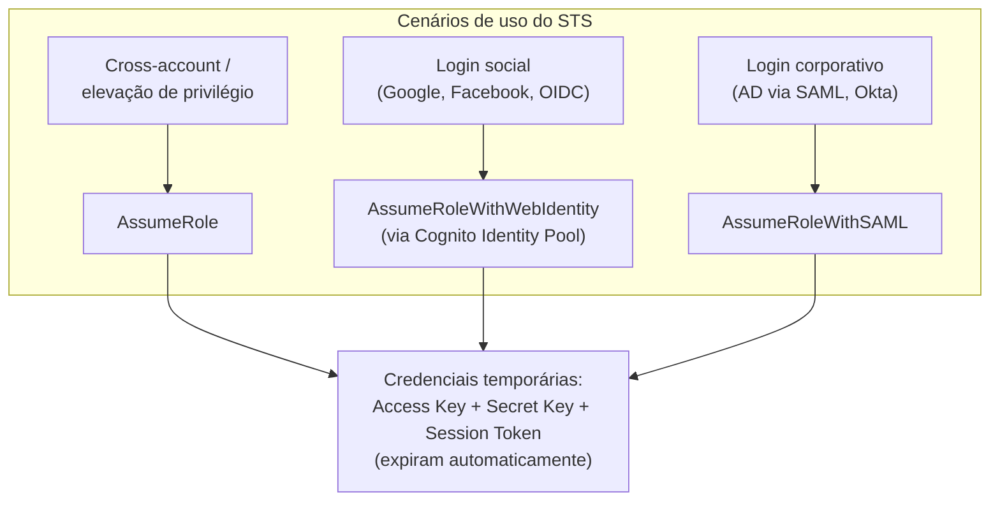
*As três formas principais de trocar uma identidade/autenticação por credenciais temporárias AWS.*

**Detalhe técnico importante:** todas as credenciais geradas pelo STS incluem, além do Access Key ID e
Secret Access Key, um **Session Token** obrigatório — diferente de uma Access Key de User, que não tem
esse terceiro componente. Esquecer de enviar o Session Token junto (em chamadas manuais de API, por
exemplo) é um erro comum de quem está começando a debugar chamadas assinadas com credenciais temporárias.

**No dia a dia:** o fluxo `AssumeRoleWithWebIdentity`/`AssumeRoleWithSAML` raramente é chamado "na mão" —
ele acontece por trás dos panos quando você usa **Cognito Identity Pools** (federação de app mobile/web,
ver `03-Cognito.md`) ou **IAM Identity Center** (federação corporativa de SSO). Entender que o mecanismo
por baixo é sempre STS ajuda a conectar os pontos na hora da prova.

---

## 8. Instance Profiles (EC2)

Uma Role não pode ser anexada diretamente a uma instância EC2 — o mecanismo técnico que faz a ponte é o
**Instance Profile**, um "container" que carrega a Role e é isso que de fato é associado à instância.
No Console, esse detalhe fica escondido (quando você "anexa uma Role a uma EC2", a AWS cria o Instance
Profile pra você automaticamente), mas via CLI/CloudFormation você às vezes precisa lidar com ele
explicitamente.

**Como funciona por dentro:** a instância consulta um endpoint interno de metadados
(`http://169.254.169.254/latest/meta-data/iam/security-credentials/...`, hoje protegido por padrão pelo
**IMDSv2**, que exige um token de sessão para mitigar ataques de SSRF) e recebe credenciais temporárias
que são automaticamente rotacionadas pela AWS antes de expirarem — sua aplicação nunca precisa se
preocupar com renovação manual.

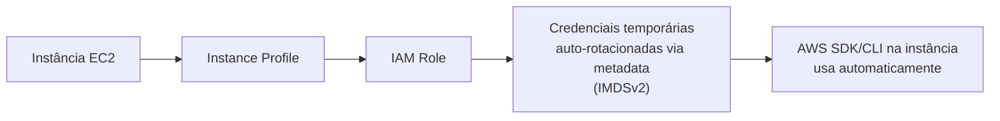
*O Instance Profile é o "container" técnico que liga uma Role a uma instância EC2.*

**No dia a dia:** o AWS SDK (boto3, Java SDK, etc) e a CLI, quando rodando dentro de uma EC2 com Instance
Profile, encontram e usam essas credenciais **automaticamente** — sem nenhuma configuração de Access Key
no código ou no `~/.aws/credentials`. É por isso que "hardcodar Access Key numa EC2" é considerado uma
prática ruim e desnecessária: o Instance Profile já resolve isso de forma mais segura e sem esforço.

O mesmo padrão conceitual se repete em outros serviços de computação: **ECS Task Role** (containers),
**Lambda execution role** (funções), **EKS IRSA/Pod Identity** (pods Kubernetes) — todos são variações
do mesmo princípio: dar credenciais temporárias ao workload sem embutir segredo nenhum.

---

## 9. MFA e boas práticas de root account

O **root account** (a identidade criada junto com a conta AWS, associada ao e-mail de cadastro) tem
poder irrestrito — inclusive sobre configurações que nenhuma outra identidade consegue tocar, como
fechar a conta ou alterar o plano de suporte. Justamente por isso, a lista de boas práticas para ele é
rígida e cobrada com frequência na prova:

- **Nunca use o root para tarefas do dia a dia.** Crie um IAM User (ou, melhor ainda, use IAM Identity
  Center) administrativo e guarde as credenciais do root só para as raríssimas operações que realmente
  exigem root.
- **Habilite MFA no root** — idealmente um dispositivo físico (hardware MFA) ou um MFA virtual (app
  autenticador), nunca deixe o root protegido só por senha.
- **Não crie Access Keys para o root.** Se existirem, delete.
- **Configure um contato alternativo e alertas de billing** para detectar rapidamente uso indevido.
- Em contas gerenciadas por **AWS Organizations**, é possível centralizar e restringir o gerenciamento do
  root das contas membro a partir da management account (root credential management), reduzindo a
  superfície de risco.

**MFA em geral (não só root):** o IAM suporta múltiplos tipos — **virtual MFA** (app tipo Google
Authenticator/Authy gerando TOTP), **MFA por hardware** (token físico), e **MFA baseado em FIDO
security key** (ex: YubiKey, via WebAuthn). Uma condição de policy comum e importante para produção é
exigir MFA para ações sensíveis:

```json
{
  "Effect": "Deny",
  "Action": "*",
  "Resource": "*",
  "Condition": {
    "BoolIfExists": {
      "aws:MultiFactorAuthPresent": "false"
    }
  }
}
```

Essa condição nega qualquer ação se a chamada não tiver sido feita com uma sessão autenticada via MFA —
um padrão comum para proteger ações destrutivas ou de alto privilégio.

---

## 10. IAM Access Analyzer

Resolve um problema real e difícil de enxergar manualmente: **"quais dos meus recursos estão acessíveis
de fora da minha conta/organização, e eu sei disso?"** Ele analisa resource-based policies (bucket
policies do S3, key policies do KMS, trust policies de Roles, policies de fila SQS, etc) e usa um motor
de **raciocínio matemático (provable security)** para identificar acessos concedidos a entidades externas
— não é uma checagem de padrão simples, é uma análise lógica completa de todos os caminhos possíveis que
aquela policy permite.

**O que ele gera:** *findings* apontando, por exemplo, "este bucket S3 está acessível pela conta
999999999999, que é externa à sua zona de confiança (conta ou Organization)". Você pode então arquivar o
finding (se for intencional) ou corrigir a policy.

**Além de análise de acesso externo, o Access Analyzer também oferece:**
- **Policy generation** — gera uma policy least-privilege com base no uso real de uma identidade
  (analisando logs do CloudTrail), útil para apertar permissões amplas demais.
- **Policy validation** — valida sintaxe e boas práticas de uma policy antes mesmo de salvá-la (integrado
  ao editor de policy no Console).
- **Custom policy checks** — verifica se uma policy nova introduz acesso além do que uma policy de
  referência permitiria (útil em pipelines de CI/CD que validam mudanças de IAM antes do deploy).

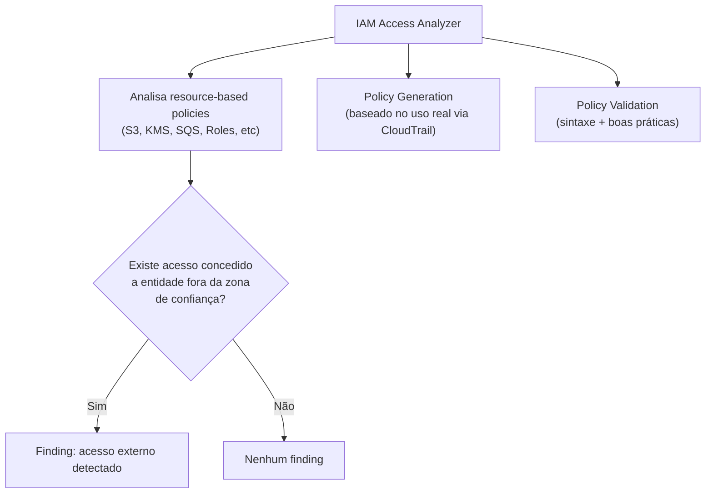
*O Access Analyzer combina detecção de acesso externo não intencional com geração/validação de policies least-privilege.*

**No dia a dia:** é uma das primeiras coisas que um time de segurança configura numa conta nova —
rodando continuamente (não é uma checagem pontual), ele avisa automaticamente quando alguém, por engano,
torna um bucket ou uma Role acessível de fora sem perceber.

---

## 11. IAM é global, não regional — a pegadinha clássica

Diferente da imensa maioria dos serviços AWS (EC2, S3, RDS, VPC...), que são **regionais** (você escolhe
uma região e os recursos vivem lá), o **IAM é um serviço global**. Isso significa:

- Users, Groups, Roles e Policies **não existem "dentro" de uma região** — eles existem uma vez, para a
  conta inteira, visíveis e utilizáveis em qualquer região.
- Quando você chama a API do IAM via CLI/SDK, o endpoint usado é sempre global
  (`https://iam.amazonaws.com`, sem sufixo de região) — embora, por consistência de configuração, o CLI
  ainda aceite (e ignore, na prática) um parâmetro de região.
- Uma Role criada uma vez pode ser assumida e usada por recursos em **qualquer região** — você não recria
  a Role por região.

**Contraste com STS:** embora o IAM em si seja global, o **STS tem endpoints regionais** (além de um
endpoint global legado) — isso importa para reduzir latência e para arquiteturas multi-região que
precisam continuar funcionando mesmo se uma região específica do STS tiver problema. É uma nuance sutil:
a *identidade* (IAM) é global, mas a *emissão de credenciais temporárias* (STS) pode ser regional.

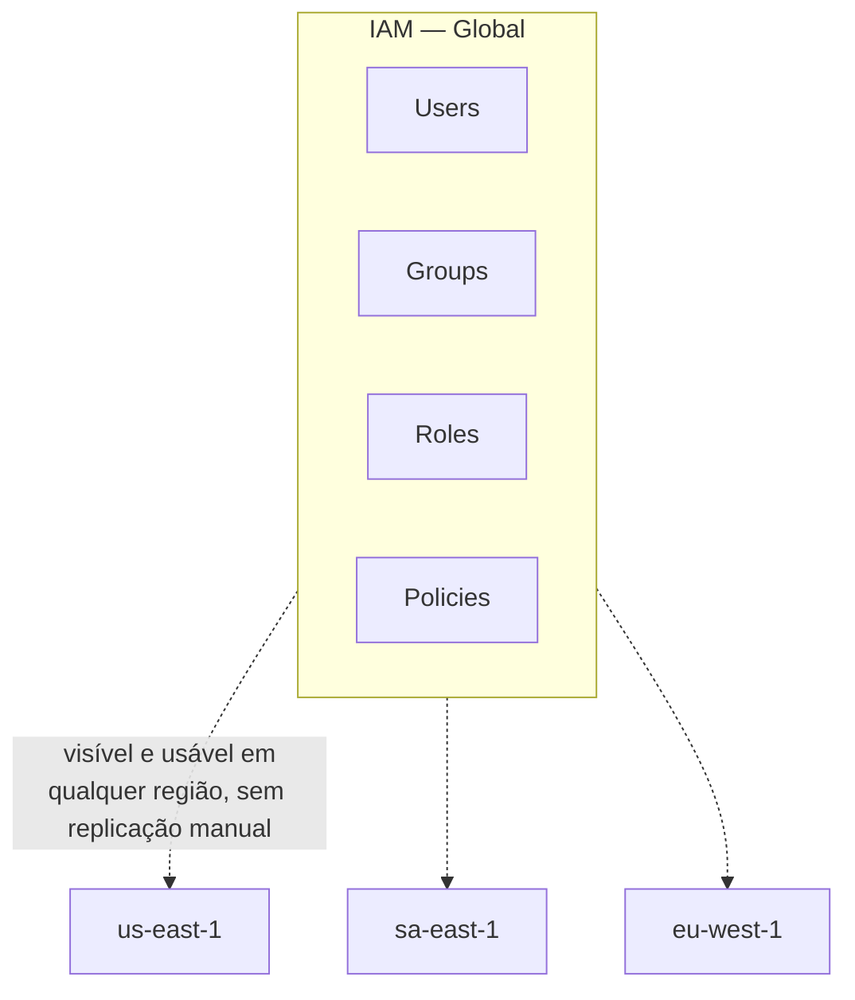
*IAM não vive "dentro" de uma região — é um único conjunto de identidades e policies para a conta inteira.*

**Pegadinha clássica de prova:** uma questão descreve alguém "procurando a Role no Console, na região
errada, e não encontrando" — a resposta é sempre lembrar que **Role não tem região**; se ela não aparece,
o problema é outro (conta errada, nome errado, permissão de visualização), nunca "a região selecionada
no Console".

---

# 🧪 Laboratório prático (para executar na AWS)

## Objetivo
Criar um User sem Access Key de longa duração, uma Role assumível por esse User, testar a lógica de
avaliação de policy com um Deny explícito, e configurar uma Permission Boundary.

### Passo 1 — Criar um IAM User administrativo (sem Access Key)
Console → IAM → **Users** → **Create user**
- Nome: `estudo-saa-user`
- Habilite acesso ao Console (senha), **não** gere Access Key nesse momento.
- Anexe a policy gerenciada `IAMReadOnlyAccess` diretamente (para fins de teste).

### Passo 2 — Criar uma Role para ser assumida
Console → IAM → **Roles** → **Create role**
- Trusted entity: **AWS account** → a própria conta (para testar AssumeRole dentro da mesma conta)
- Nome: `estudo-saa-role-s3`
- Permission policy: `AmazonS3ReadOnlyAccess`

Edite a **Trust Policy** da role para restringir quem pode assumi-la:

```json
{
  "Version": "2012-10-17",
  "Statement": [
    {
      "Effect": "Allow",
      "Principal": {
        "AWS": "arn:aws:iam::SEU_ACCOUNT_ID:user/estudo-saa-user"
      },
      "Action": "sts:AssumeRole"
    }
  ]
}
```

### Passo 3 — Permitir que o User assuma a Role
No User `estudo-saa-user`, anexe uma policy inline permitindo `sts:AssumeRole` no ARN da
`estudo-saa-role-s3`.

### Passo 4 — Testar o AssumeRole via CLI

```bash
aws sts assume-role \
  --role-arn arn:aws:iam::SEU_ACCOUNT_ID:role/estudo-saa-role-s3 \
  --role-session-name teste-saa
```

Use as credenciais temporárias retornadas (`AccessKeyId`, `SecretAccessKey`, `SessionToken`) como
variáveis de ambiente e teste um `aws s3 ls`.

### Passo 5 — Criar um Deny explícito e observar a precedência
Adicione, na policy da Role, uma segunda declaração com `"Effect": "Deny"` para `s3:DeleteObject`. Tente
deletar um objeto de teste — mesmo com `AmazonS3ReadOnlyAccess` não permitindo delete de qualquer forma,
adicione um `Allow` amplo (`s3:*`) e comprove que o `Deny` explícito ainda vence.

### Passo 6 — Criar e anexar uma Permission Boundary
Crie uma policy customizada `estudo-saa-boundary` permitindo só `s3:Get*` e `s3:List*`. Anexe-a como
**Permission Boundary** na Role `estudo-saa-role-s3` (aba **Permissions boundary**). Mesmo que a
permission policy da Role tenha `s3:*`, teste que ações fora de `Get`/`List` continuam bloqueadas.

### Passo 7 — Experimentos para fixar cada conceito
1. **Explicit deny vence:** confirme no Passo 5 que o Deny bloqueia mesmo com Allow amplo em outra
   declaração da mesma policy.
2. **Permission Boundary como teto:** no Passo 6, tente adicionar `s3:PutObject` à permission policy da
   Role e comprove que continua bloqueado pela boundary (interseção).
3. **Credenciais temporárias expiram:** espere o tempo de expiração da sessão do Passo 4 e tente reusar
   as mesmas credenciais — observe o erro de token expirado.
4. **IAM é global:** troque a região no Console (canto superior direito) enquanto visualiza a Role
   criada — confirme que ela continua visível, sem nenhuma opção de "região" na tela do IAM.
5. **Access Analyzer:** ative o IAM Access Analyzer (zona de confiança = conta atual) e crie uma bucket
   policy S3 temporária permitindo acesso de outra conta fictícia — observe o finding sendo gerado.
6. **MFA condicional:** adicione a condição `aws:MultiFactorAuthPresent` a uma policy e teste chamar a
   API sem MFA ativo na sessão — confirme o bloqueio.

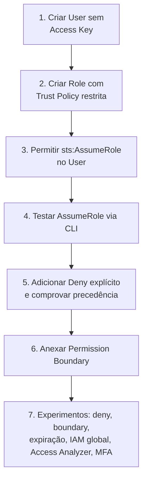
*Sequência dos passos do laboratório prático.*

---

## Comandos AWS CLI úteis

```bash
# Criar um usuário
aws iam create-user --user-name estudo-saa-user

# Criar uma role com trust policy a partir de arquivo JSON
aws iam create-role --role-name estudo-saa-role-s3 \
  --assume-role-policy-document file://trust-policy.json

# Anexar uma managed policy a uma role
aws iam attach-role-policy --role-name estudo-saa-role-s3 \
  --policy-arn arn:aws:iam::aws:policy/AmazonS3ReadOnlyAccess

# Assumir uma role e obter credenciais temporárias
aws sts assume-role \
  --role-arn arn:aws:iam::SEU_ACCOUNT_ID:role/estudo-saa-role-s3 \
  --role-session-name sessao-teste

# Ver a identidade atualmente autenticada (útil para debug)
aws sts get-caller-identity

# Simular se uma policy permite uma ação, sem executar de verdade
aws iam simulate-principal-policy \
  --policy-source-arn arn:aws:iam::SEU_ACCOUNT_ID:role/estudo-saa-role-s3 \
  --action-names s3:DeleteObject \
  --resource-arns arn:aws:s3:::meu-bucket/objeto.txt

# Anexar uma permission boundary a uma role existente
aws iam put-role-permissions-boundary \
  --role-name estudo-saa-role-s3 \
  --permissions-boundary arn:aws:iam::SEU_ACCOUNT_ID:policy/estudo-saa-boundary

# Listar findings do Access Analyzer
aws accessanalyzer list-findings --analyzer-arn arn:aws:access-analyzer:REGIAO:SEU_ACCOUNT_ID:analyzer/NOME
```

---

## Tabela de decisão rápida (prova + dia a dia)

| Cenário | Resposta provável |
|---|---|
| Aplicação em EC2 precisa acessar S3, sem hardcodar credencial | Instance Profile com Role |
| Acesso cross-account, precisa auditar quem assumiu o quê | AssumeRole (Trust Policy + Permission Policy) |
| Impedir que um time crie Roles com privilégio maior que o deles | Permission Boundary |
| Restringir o que TODAS as contas de uma OU podem fazer, mesmo com IAM Allow | SCP (ver `02-Organizations-e-SCPs.md`) |
| Dar acesso direto a outra conta sem ela precisar assumir Role | Resource-based Policy (ex: bucket policy) |
| Login corporativo via Active Directory para o Console AWS | AssumeRoleWithSAML (via IAM Identity Center) |
| App mobile com login social precisa acessar DynamoDB direto | AssumeRoleWithWebIdentity (via Cognito Identity Pool — ver `03-Cognito.md`) |
| Descobrir se um bucket está acessível de fora da conta sem querer | IAM Access Analyzer |
| Uma policy permite `s3:*` mas outra camada tem Deny para uma ação específica | Ação é negada — Deny explícito sempre vence |
| "Não encontro minha Role ao trocar de região no Console" | IAM é global — Role não pertence a região nenhuma |
