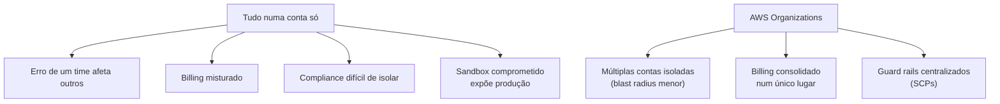
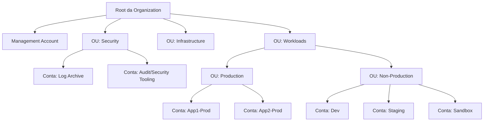
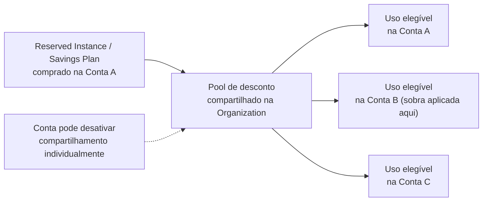
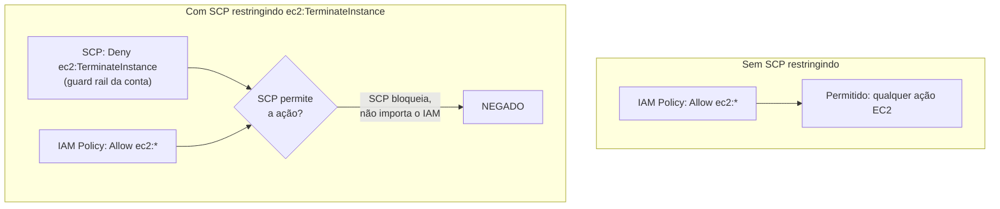
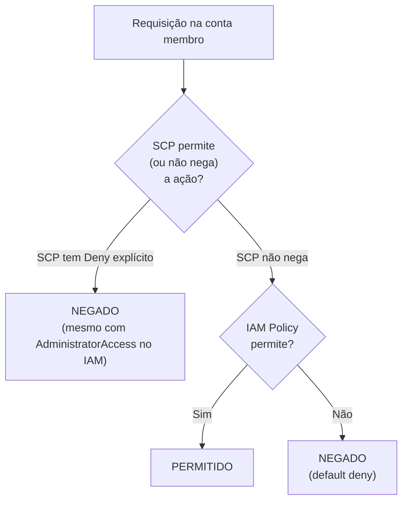
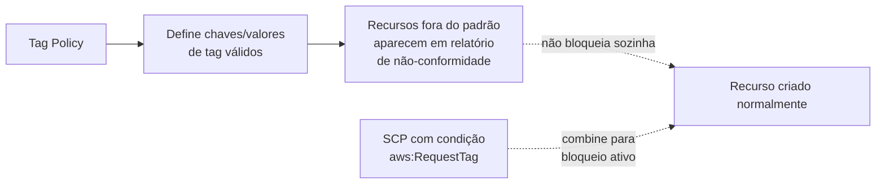
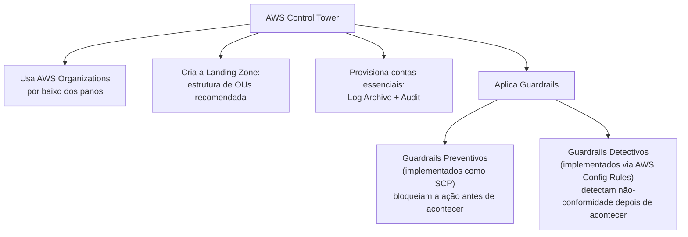
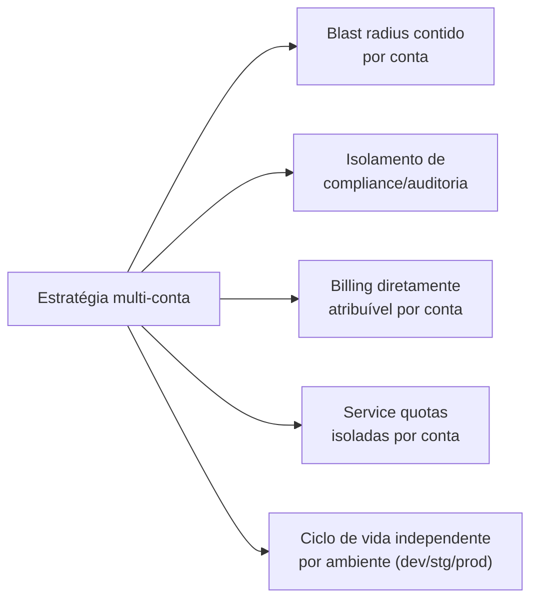
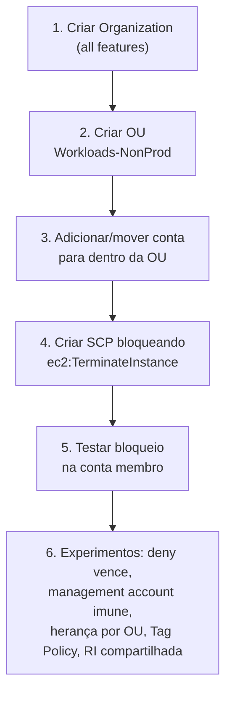

# AWS Organizations e SCPs — Guia Completo (Teoria + Prática + Dia a Dia)

## 0. O problema que o Organizations resolve

Antes de entrar na estrutura, vale entender por que empresas acabam com **múltiplas contas AWS** em vez
de uma conta só com tudo dentro.

No começo, é tentador colocar tudo numa única conta AWS: mais simples, um único lugar para olhar. Mas
conforme a empresa cresce, isso começa a doer:

- Um erro de configuração de um time (ex: uma policy de IAM mal escrita, um bucket público por engano)
  pode afetar recursos de **outros times inteiramente não relacionados**, porque estão todos na mesma
  "casa".
- Faturamento de times diferentes fica misturado — difícil saber quanto o time de Dados gastou vs o time
  de Marketing.
- Requisitos de compliance diferentes (ex: um ambiente que precisa de certificação PCI-DSS) ficam
  difíceis de isolar de ambientes que não precisam.
- Um ambiente de teste/sandbox de desenvolvedor, se comprometido, expõe produção — porque estão na mesma
  conta, compartilhando o mesmo "raio de explosão" (blast radius).

O **AWS Organizations** existe para permitir crescer com **múltiplas contas AWS**, mas ainda assim
administradas de forma centralizada — um único lugar para consolidar billing, aplicar guard rails de
segurança/compliance, e organizar contas hierarquicamente. É a resposta arquitetural ao princípio de
**isolamento de blast radius**: cada conta é uma "sala com paredes", e um problema numa sala não vaza
automaticamente para as outras.


*O problema de "tudo numa conta só" e como o Organizations resolve com isolamento + gestão centralizada.*

---

## 1. Estrutura do AWS Organizations

### Management Account (antiga "master account")
A conta que **cria** a Organization. Tem privilégios especiais que nenhuma outra conta tem:
- É a única que pode criar/gerenciar SCPs, Tag Policies, Backup Policies.
- É a única que **não é afetada por SCPs** — SCPs se aplicam a todas as contas membro, mas nunca à
  management account.
- Recebe o faturamento consolidado de todas as contas membro.

**No dia a dia:** a recomendação forte da AWS é que a management account seja usada **exclusivamente**
para administração do Organizations — não rodar cargas de trabalho de produção nela. Isso reduz o risco
de alguém explorar uma vulnerabilidade de uma aplicação para chegar até o nível de controle mais alto de
toda a organização.

### Member Accounts
Contas normais adicionadas à Organization — seja criadas do zero através dela, seja convidadas (contas
que já existiam). Cada uma continua sendo uma conta AWS completa e isolada (recursos, IAM, billing
individual antes da consolidação) — a diferença é que agora fica sujeita às políticas centralizadas
aplicadas via Organizations.

### Organizational Units (OUs)
São **pastas** dentro da árvore da Organization, usadas para **agrupar contas** que devem compartilhar as
mesmas políticas. OUs podem ser aninhadas (OU dentro de OU), formando uma hierarquia. Uma política
aplicada numa OU **se propaga automaticamente** para todas as contas e sub-OUs dentro dela — você não
precisa aplicar conta por conta.

**Estrutura típica no mundo real:**


*Estrutura multi-conta típica: OUs separando ambientes de segurança/auditoria e produção/não-produção, cada uma com contas próprias.*

**Por que separar em OUs por ambiente (Prod vs Non-Prod):** permite aplicar SCPs diferentes — por
exemplo, uma SCP muito mais restritiva na OU de Produção (bloqueando ações destrutivas, exigindo MFA para
certas operações) e uma SCP mais permissiva na OU de Sandbox (para permitir experimentação livre, com
talvez só um limite de tipos de instância permitidos para controlar custo).

---

## 2. Consolidated Billing e compartilhamento de Reserved Instances/Savings Plans

### Consolidated Billing
Todas as contas membro têm o faturamento agregado e cobrado **de uma vez só na management account** — os
donos de cada conta membro não precisam (nem conseguem, a menos que autorizado) pagar individualmente.
Isso também destrava **descontos por volume**: se você usa muito de um serviço com pricing em camadas
(ex: S3, que fica mais barato por GB conforme o volume aumenta), o Organizations soma o uso de **todas**
as contas para calcular em qual camada de desconto você está — algo que contas separadas sem
Organizations não conseguiriam.

### Compartilhamento de Reserved Instances (RIs) e Savings Plans
Por padrão, o desconto de RIs e Savings Plans comprados numa conta é **automaticamente compartilhado**
com outras contas da mesma Organization que tenham uso elegível — ou seja, se a Conta A comprou uma
Reserved Instance de `m5.large` mas está usando menos do que contratou, e a Conta B tem uma instância
`m5.large` rodando sem cobertura de desconto, o desconto "sobra" e se aplica automaticamente ao uso da
Conta B, na mesma região/tipo compatível.

**Detalhe importante:** esse compartilhamento pode ser **desativado por conta**, individualmente, se você
quiser isolar o benefício de desconto de uma conta específica (por exemplo, para fins de charge-back
interno mais previsível, onde cada time precisa ver o custo "real" da própria conta sem descontos
"emprestados" de outra).


*O desconto de RI/Savings Plan forma um "pool" compartilhado entre contas elegíveis da Organization, a menos que desativado.*

**No dia a dia:** esse comportamento automático é ótimo para otimização de custo agregada, mas pode
confundir times que fazem análise de custo por conta sem entender que parte do desconto que aparece ali
"veio emprestado" de outra conta. Vale documentar isso para o time de FinOps.

---

## 3. Service Control Policies (SCPs)

### O conceito central: SCP é um guard rail, não uma concessão de permissão

Esse é o ponto mais importante — e mais cobrado — sobre SCPs, então vale repetir de formas diferentes:

**Uma SCP nunca concede permissão. Ela só define o teto máximo do que é possível, mesmo que uma IAM
policy dentro da conta permita mais.**

A analogia mais usada: se a IAM policy é "o que você tem permissão de fazer", a SCP é "o tamanho da sala
onde você está" — não importa o que sua permissão diga, você fisicamente não consegue sair dos limites da
sala. Mesmo um `AdministratorAccess` (acesso total) anexado a uma Role, dentro de uma conta cuja SCP
bloqueia `ec2:TerminateInstance`, não consegue terminar instâncias — a SCP nega antes mesmo da IAM policy
ser considerada relevante.


*A SCP age como um teto: mesmo um Allow amplo na IAM policy não escapa de uma restrição definida na SCP.*

### Onde SCPs se aplicam

- SCPs são anexadas em **Root, OUs, ou contas individuais** da Organization.
- Se propagam **para baixo na hierarquia** — uma SCP anexada numa OU se aplica a todas as contas dentro
  dela e de suas sub-OUs.
- **Se aplicam a todos os principals de uma conta membro — inclusive o root user daquela conta.** Isso
  surpreende muita gente: normalmente pensamos no root como "sem limites", mas dentro de uma conta membro
  sujeita a Organizations, mesmo o root dela está sujeito às SCPs.
- **Exceção única: a management account nunca é afetada por SCP**, nem diretamente nem através de uma
  SCP anexada ao Root — ela está estruturalmente fora do alcance das próprias políticas que ela cria.

### Tipos de SCP: Deny List (padrão) vs Allow List

| Estratégia | Como funciona | Quando usar |
|---|---|---|
| **Deny List** (padrão de fábrica) | A SCP padrão `FullAWSAccess` permite tudo; você adiciona SCPs adicionais com `Deny` explícito para bloquear ações específicas | Mais comum e mais simples de manter — você lista só o que quer proibir |
| **Allow List** | Você remove a `FullAWSAccess` e passa a listar explicitamente, com `Allow`, cada serviço/ação permitido | Ambientes de alta restrição (ex: contas de produção regulada) onde você quer "negado por padrão, libere só o que é necessário" — mais seguro, porém mais trabalhoso de manter conforme times pedem acesso a serviços novos |

**Exemplo de SCP em Deny List, bloqueando ações fora de uma região permitida:**

```json
{
  "Version": "2012-10-17",
  "Statement": [
    {
      "Sid": "NegarForaDaRegiaoPermitida",
      "Effect": "Deny",
      "NotAction": [
        "iam:*",
        "organizations:*",
        "sts:*",
        "support:*"
      ],
      "Resource": "*",
      "Condition": {
        "StringNotEquals": {
          "aws:RequestedRegion": ["sa-east-1", "us-east-1"]
        }
      }
    }
  ]
}
```

Esse padrão (`NotAction` + `Deny`) é uma forma comum de dizer "negue tudo, exceto essas exceções globais
necessárias (IAM/STS/Organizations em si são globais e normalmente ficam de fora dessa restrição de
região)".

### Pegadinha clássica de prova: explicit deny em SCP sempre vence

Mesmo que o IAM da conta membro tenha um `Allow` explícito e amplíssimo (`AdministratorAccess`), se a SCP
tiver um `Deny` para aquela ação, **a ação é bloqueada**. A ordem de avaliação (retomando o que foi visto
em `01-IAM-Fundamentos.md`) inclui a SCP como uma das camadas verificadas, e qualquer Deny explícito em
qualquer camada aplicável — SCP incluída — vence sobre qualquer Allow.


*SCP é checada como uma camada adicional — um Deny nela bloqueia mesmo com Allow amplo no IAM da conta.*

### SCP vs IAM Policy vs Permission Boundary — tabela comparativa completa

| Aspecto | SCP | IAM Policy (identity-based) | Permission Boundary |
|---|---|---|---|
| Concede permissão sozinha? | **Não** — só define teto máximo | **Sim** — é quem de fato concede | **Não** — só define teto máximo |
| Escopo de aplicação | Conta inteira, OU, ou toda a Organization | Uma identidade específica (User/Role) | Uma identidade específica (User/Role) |
| Afeta o root da conta? | Sim (exceto na management account) | Não relevante (root não depende de IAM policy) | Não se aplica ao root |
| Onde é gerenciada | AWS Organizations, só pela management account | Dentro de cada conta, por quem administra IAM | Dentro de cada conta, por quem administra IAM |
| Afeta a management account? | Não, nunca | Sim, normalmente | Sim, se configurada |
| Análogia | "Paredes da sala" (conta/OU inteira) | "O que você pode fazer" | "Coleira" numa identidade específica |

O ponto chave para gravar: **SCP e Permission Boundary são primos conceituais** — ambos são mecanismos de
teto/guard rail que não concedem nada por si só — mas atuam em **escopos diferentes**: SCP é de cima
(nível Organization/conta), Permission Boundary é de baixo (nível de uma identidade específica dentro da
conta). Uma IAM Policy normal é a única das três que efetivamente **concede** permissão.

---

## 4. Tag Policies

Resolvem um problema operacional comum: tags inconsistentes entre contas (`Environment` vs `environment`
vs `Env`, `Prod` vs `production` vs `PROD`) tornam relatórios de custo e automação baseada em tag uma
bagunça. Uma **Tag Policy** define regras de padronização — quais chaves de tag são válidas, quais
valores são aceitos para cada chave, e quais tipos de recurso são obrigados a ter determinada tag.

**Importante: Tag Policies não bloqueiam a criação de recursos com tags fora do padrão** — elas geram
**relatórios de não-conformidade** (visíveis no Console do Organizations) para que o time de governança
identifique e corrija. Se você precisa de um bloqueio ativo e obrigatório, isso é feito combinando com uma
SCP que usa a condição `aws:RequestTag` para negar a criação de recursos sem a tag correta.


*Tag Policy sozinha só reporta não-conformidade; bloqueio ativo exige combinar com SCP.*

---

## 5. Backup Policies

Permitem definir, centralizadamente a partir da Organization, **planos de backup do AWS Backup** que se
aplicam automaticamente a contas/OUs inteiras — por exemplo, "todo recurso com a tag `Backup: true` em
qualquer conta da OU de Produção precisa ter snapshot diário retido por 30 dias".

**Por que isso importa no dia a dia:** sem Backup Policies centralizadas, cada time de cada conta membro
teria que configurar seu próprio plano de backup manualmente — com risco real de algum time esquecer.
Centralizar na Organization garante uma política mínima de proteção de dados **independente da disciplina
de cada time individual**, o que é frequentemente um requisito de auditoria/compliance corporativo.

---

## 6. AWS Control Tower

O Control Tower **não substitui** o Organizations — ele é construído **em cima** dele, adicionando uma
camada de automação e melhores práticas prontas para montar uma **landing zone**: um ambiente multi-conta
já configurado com estrutura de OUs recomendada, contas essenciais pré-criadas (normalmente uma conta de
**Log Archive** centralizando logs do CloudTrail/Config de todas as contas, e uma conta de **Audit**
compartilhando alertas de segurança), e um conjunto de **guardrails** já aplicados.


*O Control Tower usa o Organizations como base e adiciona landing zone + guardrails preventivos/detectivos prontos.*

### Guardrails preventivos vs detectivos

| Tipo | Mecanismo por baixo | Comportamento | Exemplo |
|---|---|---|---|
| **Preventivo** | SCP | Bloqueia a ação **antes** de ela acontecer — a chamada de API nem é executada | "Não permitir desabilitar o CloudTrail" |
| **Detectivo** | AWS Config Rule | A ação **acontece**, mas o sistema detecta e sinaliza o desvio depois, marcando o recurso como não-conforme | "Detectar buckets S3 que se tornaram públicos" |

**O que muita gente erra na prova:** achar que Control Tower é "um serviço separado e independente do
Organizations" — na verdade ele **exige** o Organizations como base e usa SCPs por baixo para os
guardrails preventivos. Control Tower é a camada de "melhores práticas prontas e automação de setup";
Organizations é a fundação estrutural sobre a qual ele opera.

**No dia a dia:** empresas que estão começando uma estratégia multi-conta do zero hoje em dia costumam
usar Control Tower em vez de montar a estrutura de Organizations manualmente peça por peça — ele acelera
bastante o "dia 1" (landing zone pronta em minutos/horas em vez de dias de configuração manual) e já
aplica um conjunto de guardrails alinhados com boas práticas de segurança da AWS.

---

## 7. Motivação real de estratégia multi-conta (aprofundando)

Voltando ao ponto da introdução, os motivadores reais (não só teóricos) para separar em múltiplas contas:

- **Blast radius / isolamento de falha:** um incidente de segurança, um bug que consome recursos
  descontroladamente, ou um erro humano destrutivo fica **contido dentro da conta** onde aconteceu — não
  se propaga automaticamente para outras contas, porque contas diferentes são fronteiras de segurança
  reais (IAM, rede, tudo isolado por padrão).
- **Isolamento de compliance:** cargas de trabalho sujeitas a regulação específica (ex: dados de saúde,
  dados financeiros com PCI-DSS) ficam em contas dedicadas, facilitando auditoria — o auditor consegue
  focar só nas contas relevantes, sem precisar "filtrar" recursos dentro de uma conta gigante e
  compartilhada.
- **Isolamento de billing:** cada time/produto/cliente pode ter sua própria conta, tornando o custo
  diretamente atribuível sem esforço extra de tagging e alocação — a fatura consolidada do Organizations
  já vem separada por conta.
- **Limites de serviço (service quotas) são por conta:** uma conta com uso intenso não consome a cota de
  outra conta — evita que um time "esgote" um limite compartilhado que afetaria outros times.
- **Ciclo de vida diferente por ambiente:** contas de Dev/Staging podem ser recriadas, resetadas ou até
  destruídas sem nenhum risco de afetar Produção, porque fisicamente são ambientes AWS separados.


*Os cinco motivadores mais citados na prática para adotar uma estratégia multi-conta.*

---

# 🧪 Laboratório prático (para executar na AWS)

## Objetivo
Criar uma Organization, uma OU, mover uma conta membro para dentro dela, e aplicar uma SCP de exemplo
bloqueando uma ação específica mesmo com IAM permissivo.

> **Atenção de custo:** criar contas extras na AWS não gera custo em si, mas qualquer recurso criado
> dentro delas sim. Use o Free Tier e delete recursos de teste ao final.

### Passo 1 — Criar a Organization
Console (na conta que será a management account) → AWS Organizations → **Create an organization**.
Escolha **Enable all features** (necessário para SCPs — o modo "Consolidated billing only" não suporta).

### Passo 2 — Criar uma OU
Console → Organizations → **AWS accounts** → **Actions → Create organizational unit**
- Nome: `Workloads-NonProd`

### Passo 3 — Convidar ou criar uma conta membro
- **Invite account** (se já existir uma conta AWS separada disponível para teste) ou **Add an AWS
  account** (cria uma conta nova gerenciada pela Organization).
- Mova a conta para dentro da OU `Workloads-NonProd` (arraste no Console ou use `move-account` via CLI).

### Passo 4 — Criar e anexar uma SCP de teste
Console → Organizations → **Policies → Service control policies → Create policy**

```json
{
  "Version": "2012-10-17",
  "Statement": [
    {
      "Sid": "BloquearTerminacaoDeInstancias",
      "Effect": "Deny",
      "Action": "ec2:TerminateInstance",
      "Resource": "*"
    }
  ]
}
```

Anexe essa SCP na OU `Workloads-NonProd`.

### Passo 5 — Testar o bloqueio
Dentro da conta membro (mesmo logado como root dessa conta, ou com uma Role com `AdministratorAccess`),
tente terminar uma instância EC2 de teste e confirme que a SCP bloqueia, independente da permissão IAM.

### Passo 6 — Experimentos para fixar cada conceito
1. **Explicit deny em SCP vence tudo:** confirme no Passo 5 que mesmo o root da conta membro (não a
   management account) é bloqueado.
2. **Management account é imune:** tente a mesma ação de terminar instância a partir da management
   account — confirme que a SCP não se aplica lá.
3. **Herança por OU:** mova a conta de teste para fora da OU `Workloads-NonProd` (para o Root direto) e
   confirme que a restrição deixa de existir, comprovando que a SCP se propaga pela posição na hierarquia.
4. **Deny List vs Allow List:** remova a SCP padrão `FullAWSAccess` da OU e observe que **tudo** passa a
   ser negado — depois adicione de volta e crie uma SCP explícita permitindo só `s3:*` e `ec2:Describe*`,
   testando a diferença de abordagem.
5. **Tag Policy:** crie uma Tag Policy exigindo a chave `Environment` com valores `Prod`/`NonProd`, crie
   um recurso sem essa tag, e observe o relatório de não-conformidade (sem bloqueio).
6. **RI/Savings Plan compartilhado:** se tiver mais de uma conta disponível, compre (ou simule, olhando a
   documentação) uma Reserved Instance numa conta e observe no Cost Explorer consolidado como o desconto
   aparece potencialmente aplicado a outra conta com uso elegível.


*Sequência dos passos do laboratório prático.*

---

## Comandos AWS CLI úteis

```bash
# Criar a Organization (a partir da conta que será management account)
aws organizations create-organization --feature-set ALL

# Criar uma OU
aws organizations create-organizational-unit \
  --parent-id r-xxxx \
  --name "Workloads-NonProd"

# Criar uma conta membro dentro da Organization
aws organizations create-account \
  --email time-dev@suaempresa.com \
  --account-name "Workloads-Dev"

# Mover uma conta para dentro de uma OU
aws organizations move-account \
  --account-id 111111111111 \
  --source-parent-id r-xxxx \
  --destination-parent-id ou-xxxx-yyyyyyyy

# Criar uma SCP a partir de um arquivo JSON
aws organizations create-policy \
  --name "BloquearTerminacaoEC2" \
  --type SERVICE_CONTROL_POLICY \
  --content file://scp-deny-terminate.json

# Anexar uma SCP a uma OU ou conta
aws organizations attach-policy \
  --policy-id p-xxxxxxxx \
  --target-id ou-xxxx-yyyyyyyy

# Listar as policies efetivas aplicadas a uma conta
aws organizations list-policies-for-target \
  --target-id 111111111111 \
  --filter SERVICE_CONTROL_POLICY

# Simular se uma SCP bloqueia uma ação (via IAM Policy Simulator, considerando o efeito da SCP)
aws organizations describe-effective-policy \
  --policy-type SERVICE_CONTROL_POLICY \
  --target-id 111111111111
```

---

## Tabela de decisão rápida (prova + dia a dia)

| Cenário | Resposta provável |
|---|---|
| Bloquear uma ação em todas as contas de uma OU, mesmo com IAM permissivo | SCP com `Deny` explícito |
| Consolidar faturamento de várias contas num único lugar | AWS Organizations (Consolidated Billing) |
| Reserved Instance comprada numa conta beneficiando outra automaticamente | Compartilhamento de RI/Savings Plan entre contas da Organization |
| Restringir o que uma Role específica pode fazer, dentro de uma única conta | Permission Boundary (não SCP) |
| Montar rapidamente um ambiente multi-conta com boas práticas prontas | AWS Control Tower |
| Bloquear ação antes de acontecer (preventivo) | Guardrail preventivo via SCP |
| Detectar recurso não-conforme depois de criado | Guardrail detectivo via AWS Config Rule |
| Padronizar nomes/valores de tags entre contas (sem bloquear) | Tag Policy |
| Garantir backup mínimo obrigatório em todas as contas de produção | Backup Policy |
| SCP aplicada ao Root afeta a management account? | Não — management account nunca é afetada por SCP |
| Isolar blast radius de um ambiente de teste vs produção | Contas AWS separadas (estratégia multi-conta) |
