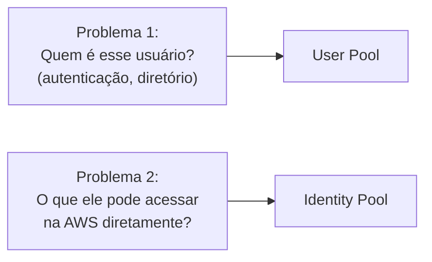
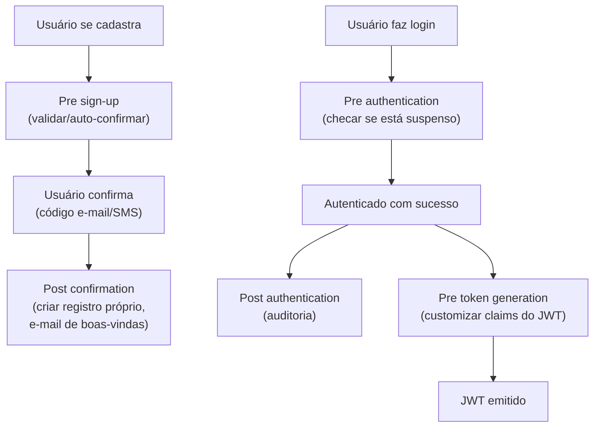
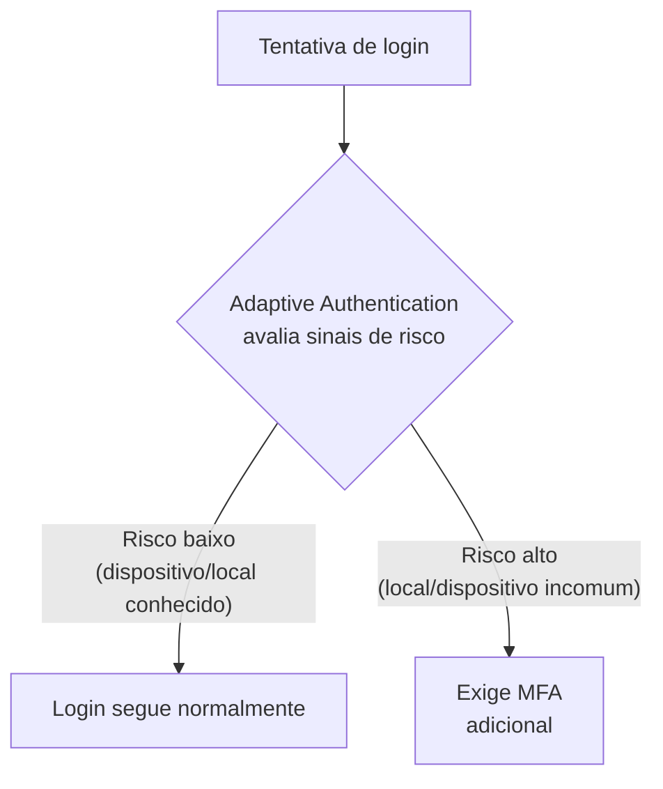
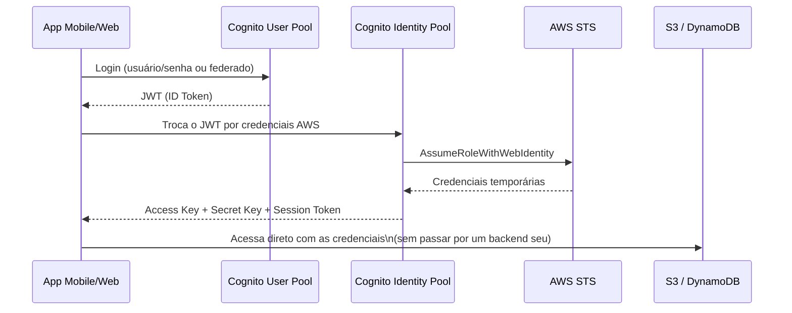
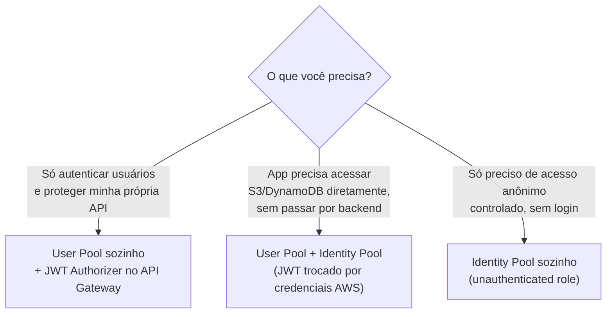
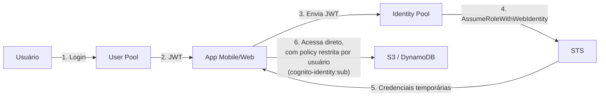
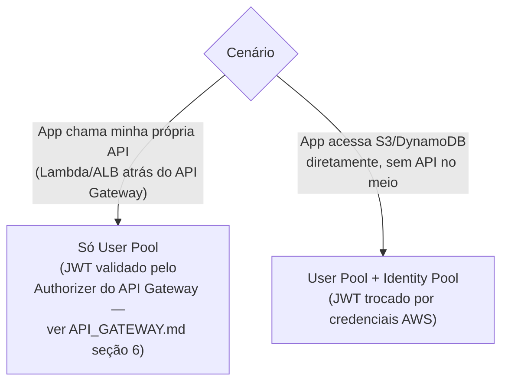
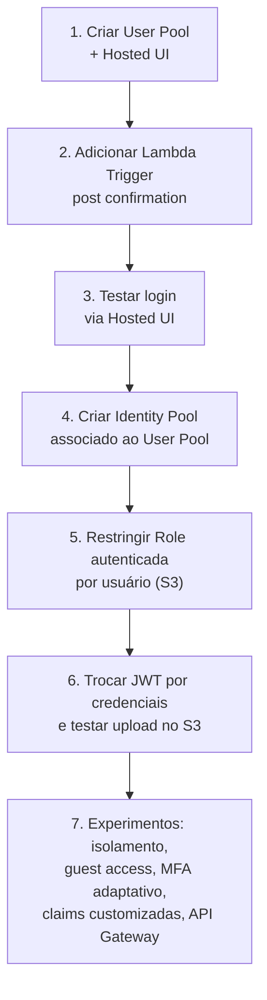

# Amazon Cognito — Guia Completo (Teoria + Prática + Dia a Dia)

## 0. O problema que o Cognito resolve

Antes de entrar nos dois componentes principais, vale entender o problema real por trás do Cognito.

Se você está construindo um app mobile ou uma SPA (Single Page Application) que precisa de login de
usuário, você tem basicamente duas necessidades bem diferentes, que costumam ser confundidas:

1. **"Quem é esse usuário?"** — você precisa de um lugar para armazenar usuários, senhas (com hashing
   seguro), permitir cadastro, confirmação de e-mail, recuperação de senha, MFA, e login social (Google,
   Facebook, Apple) — ou seja, um **diretório de identidade completo**, sem você ter que construir e
   manter isso do zero (o que é trabalho sério de segurança, historicamente cheio de armadilhas quando
   feito por conta própria).
2. **"O que esse usuário autenticado pode fazer diretamente na AWS?"** — depois que o usuário provou quem
   é, se o seu app precisa que ele acesse diretamente serviços AWS (ex: fazer upload de uma foto direto
   pro S3 a partir do celular, sem passar por um backend seu no meio), você precisa de **credenciais AWS
   temporárias e com permissão restrita** para aquele usuário específico.

O Cognito resolve as duas necessidades com **dois componentes distintos e frequentemente confundidos na
prova**: **User Pools** (resolve o problema 1) e **Identity Pools** (resolve o problema 2). Eles podem ser
usados juntos ou separadamente — essa é uma das primeiras coisas a entender.


*Dois problemas diferentes, dois componentes diferentes do Cognito.*

---

## 1. User Pools — "quem você é"

Um **User Pool** é um diretório de usuários totalmente gerenciado — pense nele como um serviço de
autenticação como serviço (semelhante em conceito a um Auth0/Okta, mas nativo da AWS).

### O que ele oferece

- **Cadastro e login** com usuário/senha, incluindo política de senha configurável, hashing seguro
  (você nunca lida com senha em texto puro), confirmação de e-mail/telefone via código, fluxo de
  "esqueci minha senha".
- **Hosted UI** — uma tela de login **pronta, hospedada pela própria AWS**, para a qual você redireciona
  o usuário (padrão OAuth 2.0 Authorization Code / Implicit Grant). Você não precisa construir a tela de
  login você mesmo — pode customizar logotipo/cores, ou usar totalmente sua própria UI chamando as APIs
  do Cognito diretamente se preferir mais controle visual.
- **Federação com identity providers externos:**
  - **Social login** — Google, Facebook, Apple, Amazon (via protocolo OAuth2/OIDC configurado dentro do
    User Pool).
  - **SAML 2.0** — para integração com IdPs corporativos (Active Directory Federation Services, Okta,
    Azure AD) — comum quando o "usuário final" do seu app é na verdade um funcionário da empresa cliente,
    que já tem identidade corporativa e não deveria precisar criar outra senha.
  - **OIDC genérico** — qualquer provedor compatível com OpenID Connect.

  Em todos esses casos, o usuário federado acaba representado dentro do User Pool como um usuário
  "linkado" ao provedor externo — do ponto de vista do seu app, o fluxo de obtenção de token é
  padronizado independente de qual foi o mecanismo de login por trás.

- **Lambda Triggers** — pontos de extensão que rodam uma função Lambda sua em momentos específicos do
  ciclo de vida da autenticação, permitindo customizar comportamento sem você ter que reimplementar o
  fluxo inteiro. Os mais usados:

| Trigger | Quando dispara | Uso comum no dia a dia |
|---|---|---|
| **Pre sign-up** | Antes de criar a conta do usuário | Auto-confirmar usuários de domínios corporativos conhecidos, bloquear cadastro de domínios de e-mail descartáveis, validar regras de negócio customizadas |
| **Post confirmation** | Depois que o usuário confirma o cadastro (e-mail/SMS) | Criar um registro correspondente numa tabela DynamoDB própria da aplicação, disparar um e-mail de boas-vindas, sincronizar com um CRM |
| **Pre authentication** | Antes de autenticar o login | Bloquear login de usuários marcados como suspensos numa lista própria |
| **Post authentication** | Depois de autenticar com sucesso | Registrar auditoria de login, atualizar "último acesso" |
| **Pre token generation** | Antes de emitir o JWT | Customizar claims do token — por exemplo, injetar um `role` ou `tenant_id` vindo de uma tabela própria, para o backend usar depois sem precisar de outra consulta |
| **Custom message** | Antes de enviar e-mail/SMS de confirmação/recuperação | Customizar o texto/template da mensagem enviada |


*Os principais Lambda Triggers do User Pool e em que ponto do ciclo de vida cada um dispara.*

### O que o User Pool devolve: JWT

Depois de um login bem-sucedido, o User Pool devolve três tokens:

- **ID Token** — contém as claims de identidade do usuário (nome, e-mail, grupos, atributos customizados)
  — é o que você usa para saber "quem é esse usuário".
- **Access Token** — usado para autorizar chamadas a APIs (ex: no header `Authorization` de uma chamada
  ao API Gateway) — contém escopos/grupos, mas não necessariamente todos os atributos do usuário.
- **Refresh Token** — de vida mais longa, usado para obter novos ID/Access Tokens sem o usuário precisar
  logar de novo (válido por um período configurável, tipicamente dias).

**No dia a dia:** o Access Token é o que normalmente viaja para o backend/API validar a requisição; o ID
Token é mais usado no lado do cliente para exibir informações do usuário logado (nome, e-mail) sem
precisar de outra chamada.

### MFA e Adaptive Authentication

- **MFA** no User Pool suporta **SMS** e **TOTP** (aplicativo autenticador tipo Google
  Authenticator/Authy), configurável como opcional, obrigatório para todos, ou opcional por usuário.
- **Adaptive Authentication** (parte do recurso de detecção de ameaças do Cognito) analisa sinais de
  risco em cada tentativa de login — localização incomum, dispositivo não reconhecido, padrão de acesso
  suspeito — e pode **exigir MFA dinamicamente** só quando o risco calculado é alto, em vez de forçar MFA
  em 100% dos logins o tempo todo. Isso equilibra segurança e fricção do usuário: a maioria dos logins
  "normais" passa direto, e só os suspeitos pedem verificação extra.


*Adaptive Authentication ajusta a exigência de MFA dinamicamente conforme o risco calculado do login.*

---

## 2. Identity Pools — "o que você pode acessar na AWS"

Um **Identity Pool** (também chamado de *Federated Identities*) resolve um problema completamente
diferente: **trocar uma identidade já autenticada (de qualquer origem) por credenciais temporárias AWS**,
via STS, com permissões controladas por uma IAM Role.

### Origens de identidade que um Identity Pool aceita

- Um usuário autenticado via **Cognito User Pool** (o caso mais comum e mais integrado).
- Um usuário autenticado via **login social direto** (Google, Facebook, Apple, Amazon) sem
  necessariamente passar por um User Pool.
- Um usuário autenticado via **SAML ou OIDC** de terceiros.
- **Guest/unauthenticated access** — usuários que **não** fizeram login nenhum, mas ainda assim recebem
  credenciais AWS temporárias com permissões bem restritas (útil para funcionalidades que devem funcionar
  antes do login, como visualizar um catálogo público).

### Como a troca funciona por dentro

Por baixo dos panos, o Identity Pool usa o **STS**, especificamente o mecanismo
`AssumeRoleWithWebIdentity` (para federação via token OIDC/social) — o Identity Pool automatiza esse
processo para você, então na prática você raramente chama isso manualmente.

- **Roles distintas para usuários autenticados vs não-autenticados** — você configura duas IAM Roles no
  Identity Pool: uma para quando o usuário está autenticado (normalmente mais permissiva, ex: acesso a
  pastas do S3 específicas do próprio usuário) e outra para acesso anônimo (bem mais restrita).
- **Role mapping** — é possível mapear diferentes grupos de usuários (ex: grupos definidos no User Pool)
  para Roles IAM diferentes, permitindo controle de acesso granular por tipo de usuário dentro do próprio
  Identity Pool.


*Fluxo completo: login no User Pool gera JWT; o Identity Pool troca esse JWT por credenciais temporárias da AWS via STS.*

---

## 3. A distinção clássica de prova: User Pool vs Identity Pool

Essa é, sem exagero, uma das perguntas mais repetidas de toda a seção de segurança da prova SAA-C03. Vale
gravar a frase exata:

> **User Pool = "quem você é" (autenticação). Identity Pool = "o que você pode acessar na AWS"
> (autorização, via credenciais temporárias).**

| Aspecto | User Pool | Identity Pool |
|---|---|---|
| Resolve | Autenticação (diretório de usuários, login) | Autorização para acessar recursos AWS diretamente |
| O que devolve | JWT (ID Token, Access Token, Refresh Token) | Credenciais temporárias AWS (via STS) |
| Depende do outro? | Não — pode ser usado sozinho (ex: só para autenticar usuários de uma API própria) | Pode receber identidade de um User Pool, mas também aceita outras origens (social direto, SAML, guest) |
| Uso típico | Login de app, proteção de API (via JWT Authorizer no API Gateway) | App acessando S3/DynamoDB diretamente do cliente, sem servidor no meio |
| Suporta acesso anônimo? | Não — sempre exige alguma forma de autenticação | Sim — Role específica para unauthenticated access |

**Pegadinha clássica:** uma questão descreve "preciso que o app faça upload de fotos direto para o S3
depois do login" — a resposta exige **os dois**: User Pool para autenticar, Identity Pool para obter as
credenciais que permitem o `s3:PutObject` diretamente do cliente. Usar só o User Pool não seria
suficiente, porque JWT sozinho não dá acesso direto a um recurso AWS — só prova identidade.


*Árvore de decisão entre usar User Pool sozinho, Identity Pool sozinho, ou os dois combinados.*

---

## 4. Fluxo completo: do login até acessar S3/DynamoDB direto do app mobile

Juntando tudo, o fluxo ponta a ponta mais citado na prova e mais comum na prática:

1. Usuário abre o app e faz login — usuário/senha, ou social (Google/Facebook), ou SAML corporativo —
   através do **User Pool** (diretamente via SDK, ou pela **Hosted UI**).
2. User Pool valida as credenciais e devolve um **JWT** (ID Token + Access Token + Refresh Token).
3. O app envia o **ID Token** para o **Identity Pool**, pedindo para trocá-lo por credenciais AWS.
4. O Identity Pool, usando o mecanismo de `AssumeRoleWithWebIdentity` do **STS**, verifica o token e
   assume a **IAM Role configurada para usuários autenticados** (podendo variar por grupo, se houver Role
   mapping configurado).
5. O STS devolve **credenciais temporárias** (Access Key, Secret Key, Session Token) para o app.
6. O app usa essas credenciais, via AWS SDK (Amplify, SDK mobile nativo, etc), para chamar **S3,
   DynamoDB, ou qualquer outro serviço permitido pela Role** — diretamente do dispositivo do usuário, sem
   nenhum backend seu no meio para essa operação específica.

**Por que isso é poderoso no dia a dia:** elimina a necessidade de um backend intermediário só para
repassar chamadas simples (ex: "salvar essa foto no S3", "ler esse item do DynamoDB do próprio usuário").
Isso reduz custo de infraestrutura e latência — mas exige desenho cuidadoso de IAM Policy na Role
associada, tipicamente usando variáveis de política como `${cognito-identity.amazonaws.com:sub}` para
garantir que cada usuário só acesse os próprios dados (ex: restringir o `Resource` do S3 a
`arn:aws:s3:::meu-bucket/privado/${cognito-identity.amazonaws.com:sub}/*`), evitando que um usuário
autenticado acesse a pasta de outro usuário.


*O fluxo completo: login gera JWT, JWT é trocado por credenciais temporárias, credenciais acessam AWS diretamente com escopo por usuário.*

---

## 5. Integração com API Gateway

O Cognito User Pool também é usado como mecanismo de autenticação/autorização **na frente de uma API**,
não só para acesso direto a recursos AWS. Esse cenário — o mais comum quando você tem um backend próprio
(Lambda, ALB, etc.) atrás do API Gateway — já está detalhado em profundidade no arquivo
`Seçao18:Application_Integration/API_GATEWAY.md`, seção 6 ("Autenticação/Autorização — aprofundando"),
que cobre:

- Como o **Cognito User Pool Authorizer** funciona nativamente em REST API.
- Como o mecanismo equivalente em HTTP API é o **JWT Authorizer** (mesmo mecanismo usado para qualquer
  provedor OIDC, apontando o User Pool como emissor).
- Por que **WebSocket API não tem suporte nativo a Cognito** — só via Lambda Authorizer validando o token
  manualmente.

Vale só reforçar aqui a diferença conceitual com o fluxo da seção 4 deste arquivo: quando o Cognito
protege uma **API sua**, o que importa é só o **JWT sendo validado pelo API Gateway** (não há troca por
credenciais AWS — é o User Pool sozinho fazendo esse papel). Já quando o app acessa **serviços AWS
diretamente** (S3, DynamoDB) sem uma API no meio, aí sim entra o **Identity Pool** para obter credenciais
temporárias. São dois padrões de arquitetura diferentes, e a prova gosta de testar se você sabe qual se
aplica a qual cenário.


*Proteger uma API própria usa só o User Pool; acessar serviços AWS direto do cliente exige também o Identity Pool.*

---

## 6. Custo e limites — o que pesa na prática

- Cognito cobra por **MAU (Monthly Active Users)** — usuários que efetivamente se autenticaram no mês,
  não por total de usuários cadastrados no diretório. Um diretório com 1 milhão de usuários cadastrados
  mas só 10 mil logando no mês é cobrado pelos 10 mil MAUs.
- Recursos de segurança avançada (Adaptive Authentication / detecção de ameaças, compromised credentials
  check) têm cobrança adicional em cima do MAU básico.
- **No dia a dia:** para produtos com base de usuários grande mas baixo engajamento recorrente, esse
  modelo de cobrança por MAU costuma ser bem mais vantajoso do que manter e operar um serviço de
  autenticação próprio hospedado 24/7.

---

# 🧪 Laboratório prático (para executar na AWS)

## Objetivo
Criar um User Pool com Hosted UI, um Identity Pool associado, e testar a troca de JWT por credenciais
temporárias para acessar um bucket S3 restrito por usuário.

### Passo 1 — Criar o User Pool
Console → Cognito → **User Pools** → **Create user pool**
- Sign-in options: e-mail
- Configure MFA como **Optional** (TOTP)
- Nome do app client: `app-cliente-web`
- Habilite a **Hosted UI**, defina um domínio (`estudo-saa-XXXX.auth.us-east-1.amazoncognito.com`)

### Passo 2 — Adicionar um Lambda Trigger (post confirmation)
Crie uma função Lambda simples que só grava um log (`print`/`console.log`) recebendo o evento, e associe
como trigger **Post confirmation** no User Pool, para observar o payload recebido.

### Passo 3 — Testar login via Hosted UI
Acesse a URL da Hosted UI, cadastre um usuário de teste, confirme via código de e-mail, e faça login.
Observe na URL de retorno (`redirect_uri`) o `code` (Authorization Code) ou os tokens, dependendo do
grant configurado.

### Passo 4 — Criar o Identity Pool
Console → Cognito → **Identity Pools** → **Create identity pool**
- Autenticação: associe o User Pool e o App Client criados no Passo 1.
- Deixe a AWS criar as duas Roles padrão (autenticada e não-autenticada).

### Passo 5 — Restringir a Role autenticada a uma pasta por usuário
Edite a IAM Policy da Role autenticada para restringir o acesso a S3 usando a variável de política:

```json
{
  "Version": "2012-10-17",
  "Statement": [
    {
      "Effect": "Allow",
      "Action": ["s3:PutObject", "s3:GetObject"],
      "Resource": "arn:aws:s3:::meu-bucket-estudo-saa/privado/${cognito-identity.amazonaws.com:sub}/*"
    }
  ]
}
```

### Passo 6 — Testar a troca de token por credenciais
Usando o SDK (ex: AWS Amplify, ou chamadas manuais via `boto3`/CLI simulando o app), troque o ID Token
obtido no Passo 3 por credenciais temporárias no Identity Pool, e use-as para fazer upload de um arquivo
de teste no S3, confirmando que só a própria pasta do usuário é acessível.

### Passo 7 — Experimentos para fixar cada conceito
1. **User Pool vs Identity Pool:** tente usar só o JWT do User Pool para chamar o S3 diretamente (sem
   passar pelo Identity Pool) e confirme que não funciona — JWT sozinho não é uma credencial AWS.
2. **Isolamento por usuário:** crie um segundo usuário de teste, faça login, e tente acessar a pasta do
   primeiro usuário no S3 — confirme o bloqueio pela policy com `cognito-identity.amazonaws.com:sub`.
3. **Acesso anônimo (guest):** habilite unauthenticated access no Identity Pool, associe uma Role bem
   restrita (ex: só `s3:GetObject` num prefixo público), e teste obter credenciais sem nenhum login.
4. **MFA adaptativo:** habilite Adaptive Authentication no User Pool e faça login de uma rede/IP
   incomum (ex: VPN de outro país) para observar a exigência dinâmica de MFA.
5. **Lambda Trigger pre token generation:** adicione um trigger que injeta uma claim customizada
   (ex: `"tenant_id"`) no JWT e confirme a claim decodificando o token gerado.
6. **Integração com API Gateway:** crie uma HTTP API simples protegida por um JWT Authorizer apontando
   para esse User Pool (ver `API_GATEWAY.md` seção 6) e compare esse fluxo com o acesso direto ao S3 via
   Identity Pool.


*Sequência dos passos do laboratório prático.*

---

## Comandos AWS CLI úteis

```bash
# Criar um User Pool
aws cognito-idp create-user-pool --pool-name estudo-saa-user-pool

# Criar um App Client no User Pool
aws cognito-idp create-user-pool-client \
  --user-pool-id us-east-1_XXXXXXXXX \
  --client-name app-cliente-web \
  --no-generate-secret

# Criar um usuário administrativamente (sem passar pela Hosted UI)
aws cognito-idp admin-create-user \
  --user-pool-id us-east-1_XXXXXXXXX \
  --username usuario.teste@exemplo.com

# Autenticar via CLI (fluxo admin, útil para testes)
aws cognito-idp admin-initiate-auth \
  --user-pool-id us-east-1_XXXXXXXXX \
  --client-id XXXXXXXXXXXXXXXXXXXXXXXXXX \
  --auth-flow ADMIN_USER_PASSWORD_AUTH \
  --auth-parameters USERNAME=usuario.teste@exemplo.com,PASSWORD=SenhaForte123!

# Criar um Identity Pool associado ao User Pool
aws cognito-identity create-identity-pool \
  --identity-pool-name estudo_saa_identity_pool \
  --allow-unauthenticated-identities \
  --cognito-identity-providers ProviderName=cognito-idp.us-east-1.amazonaws.com/us-east-1_XXXXXXXXX,ClientId=XXXXXXXXXXXXXXXXXXXXXXXXXX

# Trocar um ID Token por credenciais temporárias (fluxo simplificado)
aws cognito-identity get-id \
  --identity-pool-id us-east-1:xxxxxxxx-xxxx-xxxx-xxxx-xxxxxxxxxxxx \
  --logins cognito-idp.us-east-1.amazonaws.com/us-east-1_XXXXXXXXX=ID_TOKEN_AQUI

aws cognito-identity get-credentials-for-identity \
  --identity-id us-east-1:xxxxxxxx-xxxx-xxxx-xxxx-xxxxxxxxxxxx \
  --logins cognito-idp.us-east-1.amazonaws.com/us-east-1_XXXXXXXXX=ID_TOKEN_AQUI
```

---

## Tabela de decisão rápida (prova + dia a dia)

| Cenário | Resposta provável |
|---|---|
| App precisa de cadastro/login com e-mail e senha | Cognito User Pool |
| App precisa fazer upload direto para S3 do lado do cliente, sem backend | User Pool + Identity Pool |
| Proteger uma API própria (Lambda atrás do API Gateway) com login de usuário | User Pool + Cognito Authorizer/JWT Authorizer (ver `API_GATEWAY.md` seção 6) |
| Permitir acesso anônimo restrito a um recurso AWS | Identity Pool com unauthenticated role |
| Login corporativo via Active Directory para um app | User Pool federado com SAML |
| Login social (Google/Facebook) direto num app | User Pool com federação social, ou Identity Pool direto se não precisar de diretório próprio |
| Customizar claims do JWT antes de emitir | Lambda Trigger "Pre token generation" |
| Exigir MFA só em logins de risco elevado | Adaptive Authentication |
| Garantir que cada usuário só acesse a própria pasta no S3 | IAM Policy com `${cognito-identity.amazonaws.com:sub}` na Role do Identity Pool |
| "Quem você é" vs "o que você pode acessar" | User Pool = quem você é; Identity Pool = o que você pode acessar na AWS |
