# AWS KMS e Criptografia — Guia Completo (Teoria + Prática + Dia a Dia)

## 0. O problema que o KMS resolve

Antes de entrar nos tópicos, vale entender por que criptografia gerenciada existe como serviço.

Criptografar dados não é o problema difícil — qualquer biblioteca faz `AES-256` em duas linhas. O problema difícil é **gerenciar as chaves**: onde elas ficam guardadas, quem pode usá-las, como girar (rotacionar) sem quebrar dados já criptografados, como auditar cada uso, e como fazer tudo isso sem expor a chave em texto puro em lugar nenhum — nem em disco, nem em memória de uma aplicação que você não controla totalmente.

O **AWS KMS (Key Management Service)** é um serviço gerenciado para criar, guardar e controlar o uso de chaves de criptografia, com a chave em si **nunca saindo do KMS em texto puro** (exceto no fluxo específico de envelope encryption, que veremos já já) e com **todo uso registrado no CloudTrail**. Ele é a peça de infraestrutura que praticamente todo outro serviço AWS (S3, EBS, RDS, DynamoDB, Secrets Manager, Lambda...) usa por baixo dos panos quando você liga "criptografia em repouso".

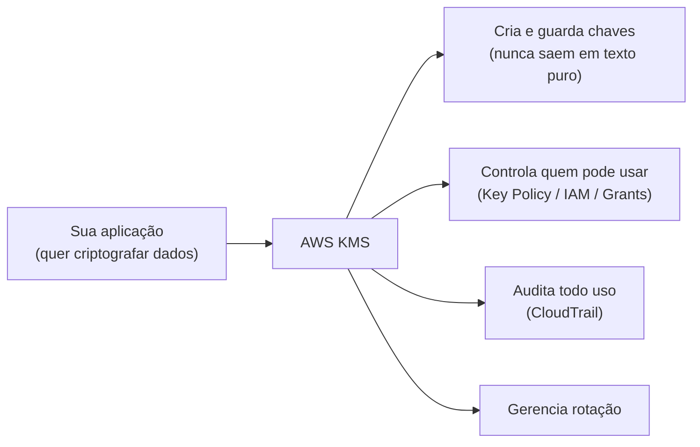
*O KMS resolve o problema de gestão de chave, não o de criptografar bytes — isso qualquer lib faz.*

---

## 1. Envelope Encryption — por que não criptografar tudo direto com o CMK

Essa é a ideia mais importante para entender o KMS de verdade, e é onde a maioria das pessoas confunde o que realmente acontece.

**Por que não usar a chave mestra (CMK) direto em cada arquivo?** Duas razões práticas:

1. **Performance e limite de API.** O KMS é um serviço remoto — cada chamada `Encrypt`/`Decrypt` é uma requisição de rede, sujeita a *throttling* (existe um limite de requisições por segundo por conta/região). Se você tivesse que chamar o KMS para criptografar **cada byte** de um arquivo de 10 GB, isso seria lento e estouraria limites rapidinho.
2. **Blast radius.** Se uma única chave criptografa terabytes de dados diretamente, um vazamento ou comprometimento dessa chave expõe tudo de uma vez.

A solução é **envelope encryption** (criptografia em envelope), um padrão em duas camadas:

1. Você pede ao KMS uma **Data Key** (chave de dados) — o KMS gera essa chave, devolve **duas versões** dela: a versão **em texto puro** (plaintext) e a versão **criptografada pela CMK** (ciphertext).
2. Você usa a versão em texto puro da Data Key para criptografar seus dados **localmente**, na sua própria máquina/serviço, usando AES-256 — rápido, sem chamada de rede por byte.
3. Você **descarta a Data Key em texto puro da memória** imediatamente após o uso, e guarda só a versão criptografada dela **junto com os dados** (normalmente no cabeçalho do arquivo).
4. Para decriptar depois, você manda a Data Key criptografada de volta ao KMS, ele decripta usando a CMK e devolve a versão em texto puro — só então você decripta os dados localmente.

**O "envelope" é literal:** os dados vão dentro de um envelope selado pela Data Key, e a Data Key vai dentro de outro envelope selado pela CMK. Só o KMS consegue abrir o envelope de fora.

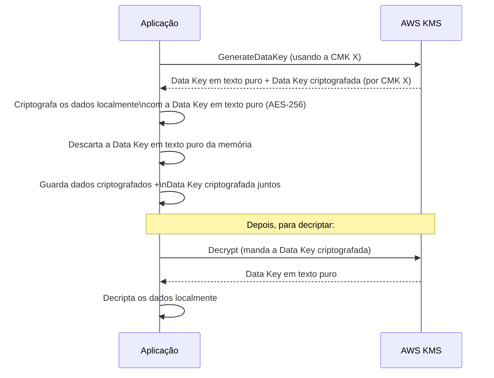
*Fluxo de envelope encryption: a CMK nunca criptografa os dados diretamente, só a Data Key que por sua vez criptografa os dados.*

**O que muita gente erra na prova:** achar que o CMK criptografa o arquivo inteiro. Na prática, o CMK **nunca toca nos dados em si** — ele só criptografa/decripta a Data Key (que tem no máximo alguns KB). Isso é o que permite o KMS escalar para criptografar volumes de dados gigantescos com poucas chamadas de API.

**Detalhe técnico importante:** existe também a API `GenerateDataKeyWithoutPlaintext`, que devolve **só** a versão criptografada da Data Key — útil quando você quer distribuir a Data Key criptografada para vários lugares e só decriptar (chamando o KMS de novo) no momento exato do uso.

---

## 2. Tipos de chave: AWS owned, AWS managed e Customer managed (CMK)

| Tipo de chave | Quem cria/gerencia | Quem vê no console | Controle de política | Rotação |
|---|---|---|---|---|
| **AWS owned keys** | AWS, compartilhada entre várias contas/clientes | Você nem vê essa chave | Nenhum — você não controla nada | Gerenciada pela AWS, você não vê |
| **AWS managed keys** (`aws/s3`, `aws/rds`, etc) | AWS, mas uma instância dedicada **para sua conta** | Aparece no console KMS da sua conta (só leitura) | Você não edita a Key Policy | Rotação automática **a cada ano**, obrigatória, sem opção de desligar |
| **Customer managed keys (CMK)** | Você | Total controle — cria, edita, desabilita, agenda exclusão | Você define a Key Policy inteira | Rotação automática **opcional**, a cada ano (ou manual quando quiser) |

**No dia a dia:** quando você simplesmente marca "Enable encryption" num bucket S3 sem escolher uma chave específica, o S3 usa uma **AWS managed key** (`aws/s3`). É grátis (sem custo mensal por chave) mas você não tem controle granular — não dá para restringir "só esse usuário específico pode usar essa chave" além do que a política padrão da AWS já define, nem compartilhar a chave entre contas.

Quando você precisa de controle fino — Key Policy customizada, compartilhar a chave entre contas (cross-account), auditoria detalhada de quem usou quando, ou desabilitar/agendar a exclusão da chave — você cria uma **Customer Managed Key (CMK)**, que tem **custo mensal fixo por chave** + custo por chamada de API.

**Pegadinha clássica de prova:** "AWS owned key" e "AWS managed key" parecem sinônimos, mas não são. AWS owned key é uma chave **compartilhada entre múltiplos clientes da AWS** (você nunca vê nem interage com ela diretamente — é usada, por exemplo, em criptografia padrão de alguns serviços internos). AWS managed key é dedicada à **sua conta**, você consegue ver ela no console (em "AWS managed keys"), mas não pode editar a política dela.

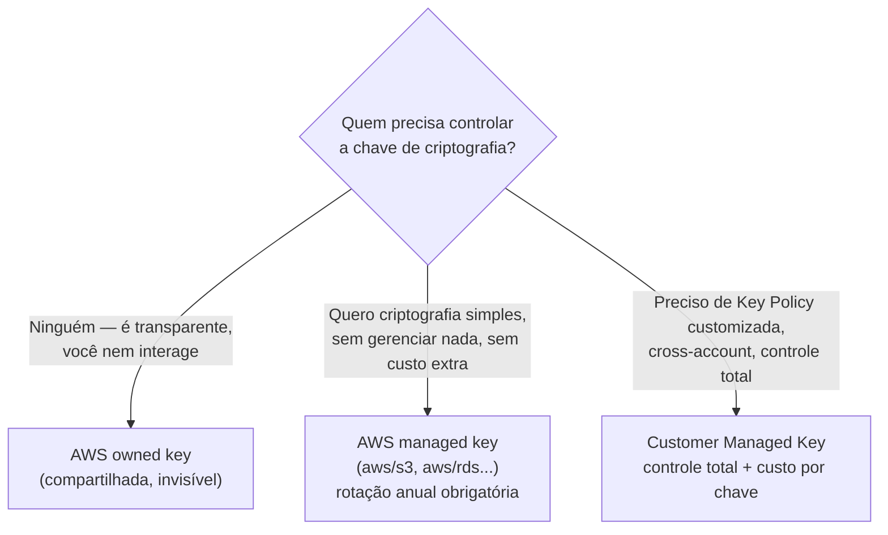
*Árvore de decisão entre os três tipos de chave do KMS.*

---

## 3. Chaves simétricas vs assimétricas

### Simétricas (padrão, a mais usada)
Uma única chave criptografa e decripta. É o tipo padrão quando você cria uma CMK no console sem mexer em nada. Usa **AES-256-GCM** por baixo.

**Uso real:** praticamente todo caso de "criptografar dados em repouso" (S3, EBS, RDS, envelope encryption) usa chave simétrica. A chave em si **nunca sai do KMS** em texto puro (só a Data Key sai, no fluxo de envelope encryption) — é por isso que você não consegue "exportar" uma CMK simétrica normalmente.

### Assimétricas
Um par de chaves: **pública** (pode ser exportada/distribuída livremente) e **privada** (fica sempre dentro do KMS, nunca sai). Suporta RSA ou curvas elípticas (ECC).

**Quando usar no dia a dia:**
- **Assinatura digital** (sign/verify) — você assina algo com a chave privada dentro do KMS, e qualquer um pode verificar a assinatura com a chave pública, sem precisar ter acesso ao KMS.
- **Criptografia onde quem criptografa e quem decripta são partes diferentes** — ex: um parceiro externo que não tem (e não deveria ter) acesso ao seu KMS precisa mandar um dado criptografado para você. Você distribui a chave pública para ele, ele criptografa com ela, e só você (dentro da sua conta, com acesso à chave privada no KMS) consegue decriptar.

**Detalhe técnico importante:** você **não** usa chave assimétrica para envelope encryption de grandes volumes de dados — isso é sempre simétrico, por performance. Assimétrica é para os casos específicos de assinatura ou troca de chave com terceiros que não têm acesso à sua conta AWS.

| Cenário | Tipo de chave |
|---|---|
| Criptografar volumes EBS, buckets S3, backups RDS | Simétrica |
| Assinar documentos/transações para verificação por terceiros | Assimétrica (sign/verify) |
| Parceiro externo sem acesso à sua conta AWS precisa te mandar dado criptografado | Assimétrica (criptografa com a pública) |
| Envelope encryption de aplicação | Simétrica |

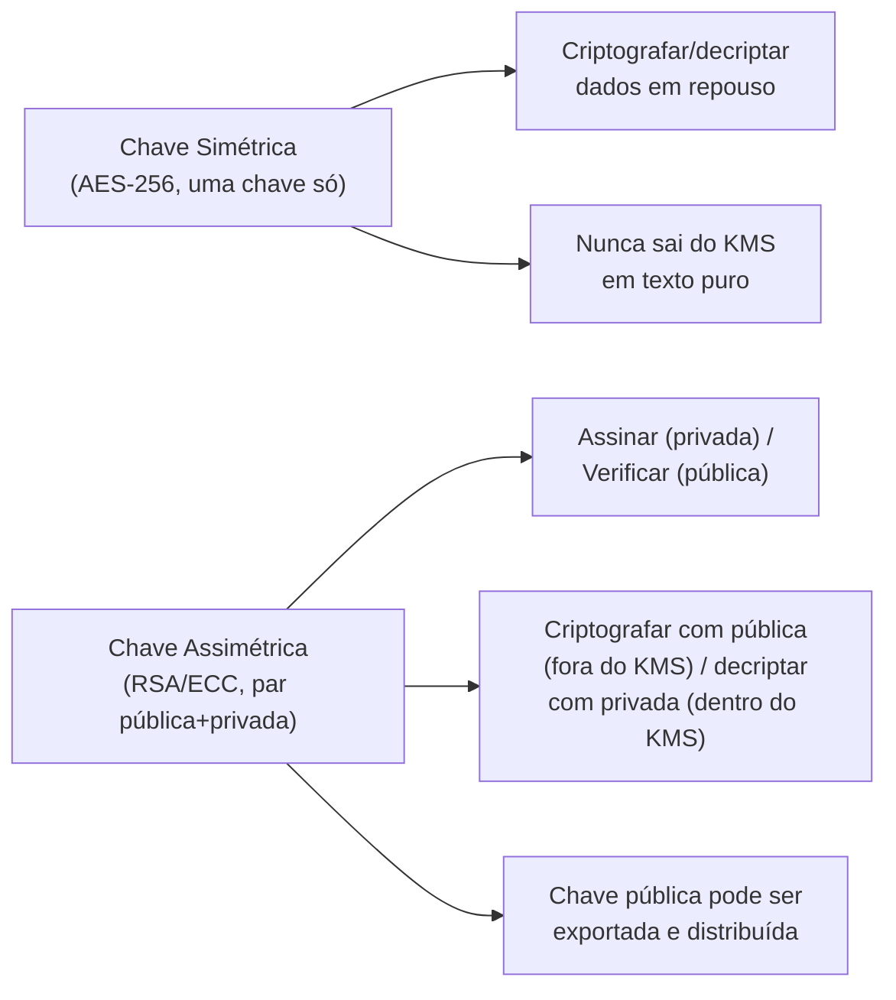
*Simétrica para o caso comum de criptografia em repouso; assimétrica para assinatura e troca com terceiros externos.*

---

## 4. Key Policy vs IAM Policy — como interagem

Esse é um dos pontos que mais confunde na prova, porque quebra a intuição de "IAM Policy controla tudo" que se aplica à maioria dos outros serviços.

**No KMS, a Key Policy é o mecanismo PRIMÁRIO e obrigatório de controle de acesso.** Toda CMK tem uma Key Policy — se você não define nenhuma explicitamente, o KMS aplica uma política padrão que dá acesso total (`kms:*`) à conta (root), o que na prática delega o controle para as IAM Policies dos usuários/roles da conta.

A diferença fundamental de comportamento:

- Em S3, IAM Policy sozinha já basta para dar acesso (a Bucket Policy é opcional/adicional).
- Em **KMS, a Key Policy é obrigatória e é ela quem decide se o IAM entra em jogo ou não.** Se a Key Policy não conceder à conta a permissão de "delegar para IAM", nenhuma IAM Policy vai conseguir liberar acesso à chave — não importa quão permissiva ela seja.

Isso significa que o acesso efetivo a uma CMK é a **interseção** do que a Key Policy permite com o que a IAM Policy do usuário/role permite — os dois precisam concordar (deny explícito em qualquer um dos dois já bloqueia).

**No dia a dia:** o padrão mais comum é a Key Policy conceder `kms:*` à conta root (a política padrão gerada pelo console faz isso), e a partir daí você controla o acesso granular só via IAM Policies normais — como se fizesse com qualquer outro serviço. Isso é feito de propósito para simplificar o gerenciamento do dia a dia, mas é importante saber que essa "delegação para IAM" é uma **decisão explícita da Key Policy**, não o comportamento padrão do serviço.

**Uso real de Key Policy restritiva:** compartilhamento **cross-account** — você adiciona uma statement na Key Policy permitindo que uma conta AWS externa use a chave, e do lado da conta externa, uma IAM Policy também precisa permitir. Sem a Key Policy permitir explicitamente o ARN da outra conta, nenhuma IAM Policy de lá vai conseguir usar sua chave.

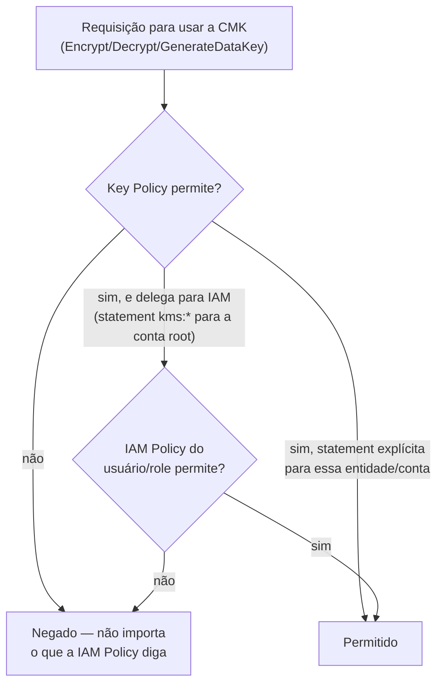
*Key Policy é o portão obrigatório; ela decide se delega a decisão para IAM ou resolve tudo sozinha.*

**O que muita gente erra na prova:** achar que "dar `kms:Decrypt` numa IAM Policy" é suficiente. Se a Key Policy da CMK não delega para IAM (ou nega explicitamente essa entidade), a IAM Policy não tem efeito nenhum sobre aquela chave específica.

---

## 5. Grants — acesso temporário/programático

**Grants** são uma forma alternativa e mais dinâmica de dar permissão de uso de uma chave, pensada para cenários **programáticos**, diferente da Key Policy (mais estática, editada manualmente).

**Por que grants existem, e não só Key Policy/IAM:** imagine um serviço AWS (ex: EBS) que precisa, em nome de uma role sua, decriptar um volume toda vez que uma instância inicia. Editar a Key Policy toda vez que uma nova instância/volume é criado seria inviável. Em vez disso, o serviço cria um **Grant** programaticamente (`CreateGrant`), concedendo a si mesmo permissão temporária e específica de usar aquela chave para aquela operação, e depois **revoga** (`RevokeGrant`) quando não precisa mais.

**Características importantes:**
- Grants concedem permissões **adicionais** (nunca restringem o que a Key Policy já nega).
- Podem ter uma condição de **`grant tokens`**, usada quando você precisa usar a permissão imediatamente, antes da propagação (eventual consistency) do grant se completar em todos os lugares.
- São a forma que **muitos serviços AWS usam por baixo dos panos** para ter acesso pontual a uma CMK sua (EBS, RDS, Redshift, etc.) sem você precisar editar a Key Policy manualmente para cada recurso.

**No dia a dia:** você raramente cria grants manualmente — isso normalmente acontece de forma transparente quando você usa uma CMK customizada com outro serviço AWS (ex: EBS criptografado com sua CMK). Mas é importante saber que é assim que a "mágica" acontece por trás dos panos, e que você **pode** usar a API `CreateGrant` diretamente em cenários de aplicação própria que precisam de delegação temporária e granular (ex: dar a um microsserviço específico permissão de decriptar por um tempo limitado, sem tocar na Key Policy geral).

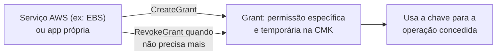
*Grants dão acesso programático e temporário, sem precisar editar a Key Policy a cada novo recurso.*

---

## 6. Rotação automática de chaves — o que muda e o que não muda

Quando você habilita **rotação automática** numa CMK simétrica (customer managed), o KMS gera **material criptográfico novo** (o "backing key") a cada ano, automaticamente.

**O que NÃO muda — e isso é o ponto que mais cai em prova:**
- O **ARN/Key ID** da chave continua o mesmo.
- Todos os dados que já foram criptografados com versões anteriores da chave **continuam decriptáveis normalmente** — o KMS mantém todo o material antigo internamente e sabe qual versão usar para decriptar cada coisa, de forma transparente para você.
- Você não precisa recriptografar nada quando a rotação acontece.

**O que muda:**
- Só o material novo (backing key) é usado para **novas** operações de criptografia a partir da rotação.

**Detalhes por tipo de chave:**

| Tipo de chave | Rotação automática |
|---|---|
| AWS managed key | Automática, a cada ano, **obrigatória**, sem opção de desabilitar |
| Customer managed key (simétrica) | Opcional, você habilita, a cada ano (ou período customizável em algumas condições), **pode desabilitar** |
| Customer managed key (assimétrica) | **Não suporta** rotação automática — se precisar, você cria uma chave nova e migra manualmente |
| Chave importada (BYOK) | **Não suporta** rotação automática — você reimporta material novo manualmente se quiser trocar |

**Rotação manual:** para chaves que não suportam rotação automática (assimétricas, importadas), o padrão é criar uma **CMK nova** e usar **aliases** (`alias/minha-chave`) apontando para a chave atual — assim sua aplicação referencia sempre o alias, e trocar a chave por trás é só repontar o alias, sem precisar mudar código.

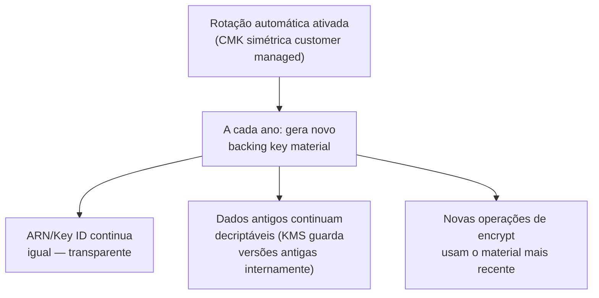
*Rotação troca só o material interno — nada que você referencia (ARN, dados já criptografados) precisa mudar.*

---

## 7. Multi-Region Keys

Por padrão, uma CMK é **regional** — não existe fora daquela região. Isso é um problema em cenários de **disaster recovery** ou replicação de dados entre regiões (ex: replicação de bucket S3, backup cross-region de RDS) onde os dados criptografados precisam ser decriptáveis na região de destino.

**Multi-Region Keys** resolvem isso: você cria uma chave "primária" numa região e **replica** ela para outras regiões, gerando "chaves réplicas". As chaves réplicas:
- Têm o **mesmo Key ID/material criptográfico** da primária (isso é diferente do comportamento normal — normalmente cada CMK é única).
- Podem ser usadas para decriptar dados criptografados pela chave primária (ou por outra réplica) **sem precisar re-enviar a requisição pela rede até a região original**.
- São gerenciadas de forma **independente** para rotação/desabilitação em cada região (você pode desabilitar uma réplica sem afetar as outras).

**Uso real:** replicação cross-region de S3 (S3 Cross-Region Replication) com objetos criptografados por KMS, DynamoDB Global Tables com criptografia, ou qualquer cenário de disaster recovery onde a aplicação precisa continuar decriptando dados numa região secundária sem depender da região primária estar no ar.

**Pegadinha clássica de prova:** Multi-Region Keys **não são** a mesma coisa que ter várias CMKs independentes com o mesmo nome em regiões diferentes — o ponto central é que o **material criptográfico é o mesmo**, permitindo criptografar numa região e decriptar em outra diretamente, sem chamar a região original.

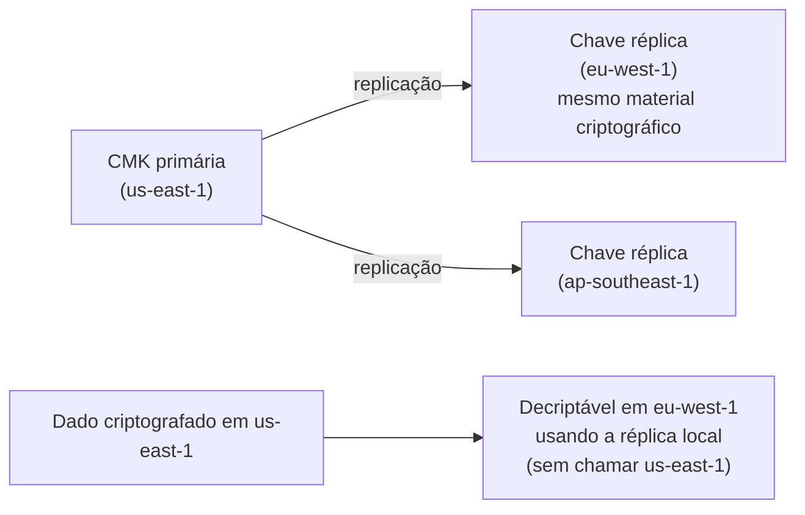
*Chaves réplica compartilham o material da primária — permitem decriptar localmente em cada região.*

---

## 8. KMS vs CloudHSM

| Característica | AWS KMS | AWS CloudHSM |
|---|---|---|
| Modelo | **Multi-tenant** (hardware compartilhado entre clientes, isolamento lógico) | **Single-tenant** (hardware dedicado só a você) |
| Certificação | Módulos validados internamente pela AWS | **FIPS 140-2 Nível 3** (nível mais alto, com validação de adulteração física) |
| Controle da chave | AWS controla o hardware; você controla acesso via Key Policy/IAM | **Você tem controle total** — inclusive acesso administrativo ao HSM |
| Gerenciamento | Totalmente gerenciado, zero manutenção | Você gerencia (patching, cluster, backup) — a AWS só cuida da infra do hardware |
| Integração nativa com outros serviços AWS | Excelente — S3, EBS, RDS, etc usam KMS nativamente | Limitada — normalmente via KMS custom key store, ou integração direta via cliente/SDK do CloudHSM |
| Custo | Por chave/mês + por chamada de API (barato) | Custo de cluster dedicado (bem mais caro, cobra por hora de instância HSM) |
| Caso de uso típico | 99% dos casos de criptografia em repouso na AWS | Compliance que **exige** HSM dedicado single-tenant certificado, ou operações criptográficas customizadas que o KMS não suporta nativamente |

**Quando o CloudHSM é a resposta certa (motivo real, não só "é mais seguro"):** alguns frameworks de compliance (certos contratos governamentais, alguns requisitos de PCI-DSS mais rígidos, certificações específicas de instituições financeiras) **exigem explicitamente** um HSM dedicado, single-tenant, com certificação FIPS 140-2 Nível 3, onde a organização tem controle administrativo total sobre o dispositivo — não basta "a AWS garante que é seguro", o requisito é de **posse e controle exclusivo do hardware**.

**Detalhe técnico importante:** existe um meio-termo — o **KMS Custom Key Store**, que faz o KMS usar um cluster CloudHSM seu como backend para armazenar as chaves, combinando a conveniência de API do KMS com o controle de hardware dedicado do CloudHSM. Isso é útil quando você precisa do compliance do CloudHSM mas não quer abrir mão da integração nativa do KMS com outros serviços AWS.

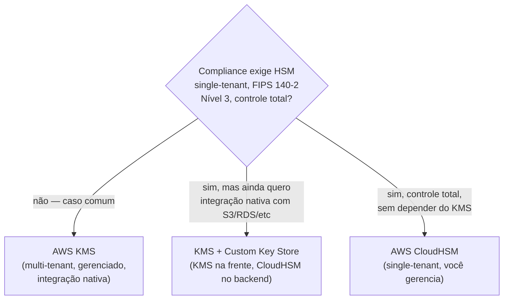
*A decisão gira em torno de exigência de compliance sobre o hardware, não sobre "qual é mais seguro" no abstrato.*

---

## 9. Import de chave própria (BYOK — Bring Your Own Key)

Por padrão, o KMS **gera** o material criptográfico da CMK internamente. Mas existem cenários onde a organização já tem seu próprio processo de geração de chaves (às vezes por exigência regulatória) e quer usar esse material **dentro** do KMS, em vez de deixar a AWS gerar do zero.

**Como funciona o fluxo de import:**
1. Você cria uma CMK no KMS com **origem "EXTERNAL"** (sem material ainda).
2. O KMS te dá um **wrapping key pública** (para você criptografar seu material antes de enviar) e um **import token**.
3. Você criptografa seu material de chave localmente com essa wrapping key pública.
4. Você importa (`ImportKeyMaterial`) o material criptografado — o KMS decripta internamente com a wrapping key privada correspondente (que nunca sai do KMS) e passa a usar esse material.

**Trade-offs importantes de uma chave importada (BYOK):**
- **Você é responsável pela durabilidade do material** — se perder o backup do material original fora da AWS, e o material expirar/for deletado, os dados criptografados com essa chave ficam **permanentemente irrecuperáveis**, porque a AWS não tem cópia de backup dele.
- Você pode definir um **período de expiração** para o material importado (opcional) — passado esse prazo, a chave para de funcionar automaticamente, útil para políticas de compliance que exigem descarte programado.
- **Não suporta rotação automática** — para "rotacionar", você precisa reimportar material novo manualmente.

**Uso real:** organizações com processos internos de geração/custódia de chave já auditados e certificados (ex: banco que já tem HSM próprio on-premises gerando chaves mestras) que precisam continuar usando esse material específico por exigência de auditoria, mas querem os benefícios operacionais do KMS (integração nativa com S3/EBS/RDS, API unificada).

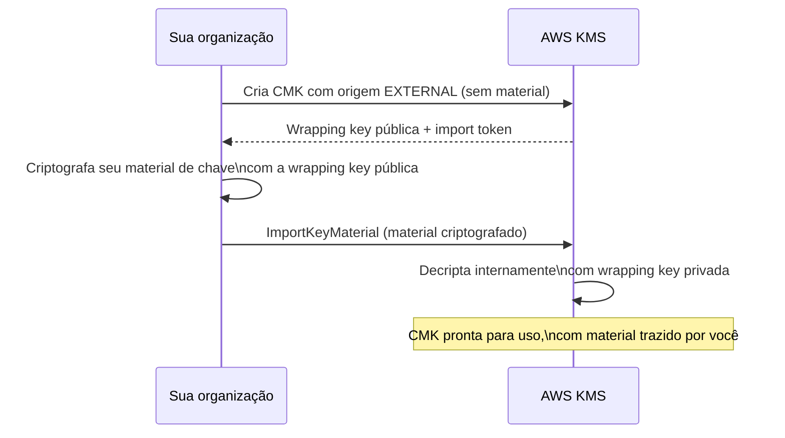
*Fluxo de BYOK: seu material nunca viaja em texto puro, mas a responsabilidade de backup dele é sua.*

---

## 10. Criptografia em outros serviços

### S3

| Modo | Quem gerencia a chave | Como funciona |
|---|---|---|
| **SSE-S3** | AWS totalmente (chave própria do S3, não é nem KMS) | Criptografia automática, transparente, sem custo adicional, sem controle granular de acesso à chave |
| **SSE-KMS** | Você, via KMS (managed ou customer managed) | Mesma ideia, mas usando uma CMK do KMS — ganha Key Policy, auditoria via CloudTrail de quem acessou o objeto, controle de rotação |
| **SSE-C** | Você, fora da AWS | Você manda a própria chave em **cada requisição** (via HTTPS); a AWS usa para criptografar/decriptar e **descarta imediatamente** após a operação — a AWS nunca armazena essa chave |
| **Client-side encryption** | Você, totalmente fora da AWS | Você criptografa o objeto **antes** de enviar pro S3, usando uma biblioteca (ex: AWS Encryption SDK) — o S3 recebe e armazena só bytes já criptografados, nunca vê a chave nem o dado em texto puro |

**No dia a dia:** SSE-S3 é o padrão mais simples ("liguei e esqueci"). SSE-KMS é o mais comum em ambientes corporativos porque dá auditoria (quem acessou qual objeto, via CloudTrail) e controle de acesso via Key Policy — inclusive dá pra restringir por VPC Endpoint, IP, etc. SSE-C é raro, usado quando a organização tem requisito explícito de "a AWS nunca deve guardar minha chave, nem que seja criptografada". Client-side é o nível mais alto de controle — usado quando nem a AWS deve ter qualquer chance de ver o dado em texto puro em trânsito.

**Detalhe técnico importante (pegadinha clássica):** SSE-KMS tem um limite de throughput por chave nas chamadas ao KMS (requests/segundo), porque toda operação de PUT/GET precisa chamar o KMS para gerar/decriptar a Data Key. Em cargas de trabalho de altíssimo volume de objetos pequenos, isso pode virar gargalo — S3 Bucket Keys (uma feature que reduz o número de chamadas ao KMS reusando uma "bucket-level key" derivada com TTL curto) existe justamente para mitigar isso.

### EBS
Volumes EBS criptografados usam envelope encryption com KMS de forma **transparente para a aplicação** — a criptografia/decriptação acontece na camada de host, sem impacto perceptível de performance na maioria dos casos. Pontos importantes:
- **Snapshots de um volume criptografado são sempre criptografados.**
- **Volumes criados a partir de um snapshot criptografado também são criptografados**, com a mesma chave (ou outra, se você especificar ao restaurar).
- Você pode configurar **criptografia por padrão** a nível de conta/região, garantindo que todo volume novo seja automaticamente criptografado, mesmo que quem cria esqueça de marcar a opção — uma boa prática comum de segurança.
- Volumes **não criptografados não podem ser "criptografados depois" diretamente** — o caminho é: criar um snapshot, copiar o snapshot habilitando criptografia, criar um novo volume a partir da cópia criptografada.

### RDS
Criptografia at rest no RDS cobre o storage subjacente (dados, logs automatizados, snapshots, réplicas). Pontos importantes:
- Só pode ser habilitada **na criação** da instância — não dá para ligar depois numa instância já existente rodando sem criptografia.
- Para "criptografar depois": snapshot da instância não criptografada → copiar o snapshot habilitando criptografia → restaurar uma nova instância a partir da cópia criptografada (mesmo padrão do EBS).
- Réplicas de leitura de uma instância criptografada são **sempre** criptografadas.

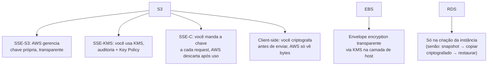
*Cada serviço aplica o mesmo padrão de envelope encryption por baixo dos panos, com nuances de quando/como habilitar.*

---

## 11. Conexão com os domínios da prova

- **Segurança:** é o tema central deste arquivo — controle de acesso via Key Policy/IAM/Grants, auditoria via CloudTrail, compliance via CloudHSM/FIPS.
- **Resiliência:** Multi-Region Keys sustentam estratégias de disaster recovery cross-region sem depender de uma única região estar no ar.
- **Performance:** envelope encryption existe justamente para não gargalar performance com chamadas de rede por byte; S3 Bucket Keys mitigam throttling de KMS em alto volume.
- **Custo:** AWS managed keys são grátis; customer managed keys têm custo mensal por chave + por chamada de API — em arquiteturas com centenas de CMKs, isso soma; CloudHSM é significativamente mais caro que KMS puro, reservado para exigências reais de compliance.

---

# 🧪 Laboratório prático (para executar na AWS)

## Objetivo
Criar uma Customer Managed Key simétrica, usar envelope encryption via CLI para criptografar um arquivo, e testar o efeito de Key Policy no acesso.

### Passo 1 — Criar a CMK
Console → KMS → **Customer managed keys** → **Create key**
- Tipo: Simétrica
- Uso da chave: Encrypt/Decrypt
- Nomeie o alias: `alias/minha-chave-lab`
- Defina os administradores da chave (seu usuário) e quem pode usá-la (seu usuário)

### Passo 2 — Criptografar um arquivo pequeno diretamente (sem envelope, só para ver a API)
```bash
aws kms encrypt \
  --key-id alias/minha-chave-lab \
  --plaintext fileb://mensagem.txt \
  --output text --query CiphertextBlob | base64 --decode > mensagem.encrypted
```

### Passo 3 — Simular envelope encryption manualmente
```bash
# Gera uma Data Key (versão plaintext + versão criptografada)
aws kms generate-data-key \
  --key-id alias/minha-chave-lab \
  --key-spec AES_256 > datakey.json

# Em uma aplicação real, você usaria o campo "Plaintext" para criptografar
# localmente (ex: com openssl ou uma lib AES) e guardaria só o "CiphertextBlob"
```

### Passo 4 — Testar rotação automática
```bash
aws kms enable-key-rotation --key-id alias/minha-chave-lab
aws kms get-key-rotation-status --key-id alias/minha-chave-lab
```

### Passo 5 — Testar o efeito da Key Policy
- Edite a Key Policy da chave no console removendo a statement que dá `kms:*` para a conta root.
- Adicione uma statement específica permitindo `kms:Decrypt` só para o seu usuário IAM.
- Tente decriptar com um segundo usuário/role IAM que tenha uma IAM Policy permissiva (`kms:*` em `Resource: *`) — observe que ele **ainda assim é negado**, porque a Key Policy não delega para ele.

### Passo 6 — Experimentos para fixar cada conceito
1. **Envelope encryption de verdade:** escreva um script Python simples com `boto3` que chama `generate_data_key`, usa a `Plaintext` para criptografar um arquivo localmente com `cryptography.fernet` ou AES, descarta a Plaintext, e guarda o `CiphertextBlob` no cabeçalho do arquivo — depois escreva a função inversa de decriptação.
2. **Key Policy vs IAM:** repita o Passo 5 com variações — negue explicitamente no IAM mesmo a Key Policy permitindo, e veja o `deny` explícito vencer.
3. **Grants:** use `aws kms create-grant` para dar a uma role temporária permissão de `Decrypt` só por um tempo, depois `aws kms revoke-grant` e teste que o acesso para.
4. **Multi-Region Key:** crie uma chave com `--multi-region`, replique para outra região com `aws kms replicate-key`, criptografe um dado na região de origem e decripte na réplica.
5. **BYOK:** crie uma CMK com `--origin EXTERNAL`, gere um par de chaves localmente com `openssl`, e siga o fluxo de import (`get-parameters-for-import` → `import-key-material`).
6. **S3 SSE-KMS:** crie um bucket com criptografia SSE-KMS usando sua CMK, suba um objeto, e veja no CloudTrail o evento `Decrypt`/`GenerateDataKey` disparado pelo S3 nos bastidores.

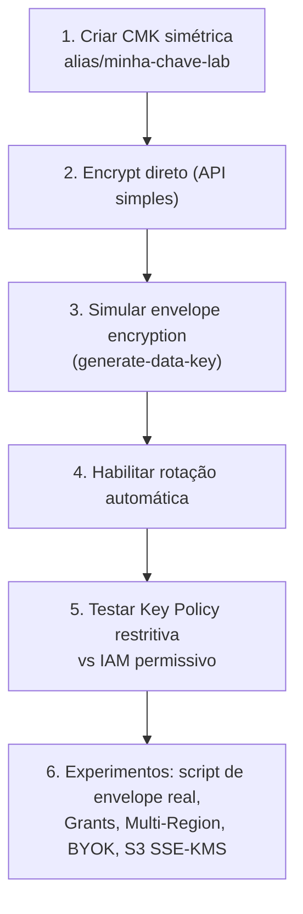
*Sequência dos passos do laboratório prático.*

---

## Comandos AWS CLI úteis

```bash
# Criar uma CMK simétrica
aws kms create-key --description "Minha CMK de lab" --key-usage ENCRYPT_DECRYPT

# Criar um alias amigável
aws kms create-alias --alias-name alias/minha-chave-lab --target-key-id {key-id}

# Gerar uma Data Key (envelope encryption)
aws kms generate-data-key --key-id alias/minha-chave-lab --key-spec AES_256

# Criptografar/decriptar diretamente (só dados pequenos, <4KB)
aws kms encrypt --key-id alias/minha-chave-lab --plaintext fileb://dados.txt
aws kms decrypt --ciphertext-blob fileb://dados.encrypted

# Habilitar/checar rotação automática
aws kms enable-key-rotation --key-id alias/minha-chave-lab
aws kms get-key-rotation-status --key-id alias/minha-chave-lab

# Ver a Key Policy atual
aws kms get-key-policy --key-id alias/minha-chave-lab --policy-name default

# Criar um Grant temporário
aws kms create-grant --key-id alias/minha-chave-lab \
  --grantee-principal arn:aws:iam::123456789012:role/minha-role \
  --operations Decrypt GenerateDataKey

# Replicar uma Multi-Region Key para outra região
aws kms replicate-key --key-id {key-id} --replica-region eu-west-1

# Agendar exclusão de uma chave (com waiting period de segurança)
aws kms schedule-key-deletion --key-id {key-id} --pending-window-in-days 30
```

---

## Tabela de decisão rápida (prova + dia a dia)

| Cenário | Resposta provável |
|---|---|
| Criptografar grandes volumes de dados sem chamar KMS byte a byte | Envelope encryption (Data Key local + CMK criptografa só a Data Key) |
| Preciso de controle total de Key Policy, cross-account | Customer Managed Key (CMK) |
| Criptografia simples, sem custo extra, sem controle granular | AWS managed key (ex: `aws/s3`) |
| Assinar/verificar documentos, ou troca de chave com terceiro externo | Chave assimétrica (sign/verify ou encrypt com pública) |
| IAM Policy permissiva mas acesso à chave negado | Key Policy não está delegando para IAM — revisar Key Policy primeiro |
| Precisa dar acesso temporário e programático a uma chave, sem editar Key Policy | Grants |
| Recriptografar tudo depois de rotação automática | Não precisa — dados antigos continuam decriptáveis normalmente |
| Decriptar dados numa região secundária sem depender da região primária | Multi-Region Keys |
| Compliance exige HSM single-tenant, FIPS 140-2 Nível 3, controle total do hardware | AWS CloudHSM (ou KMS + Custom Key Store) |
| Organização já tem processo próprio de geração de chave e precisa reusar esse material | Import de chave própria (BYOK, origem EXTERNAL) |
| S3: quer auditoria de acesso e controle de rotação da chave | SSE-KMS |
| S3: requisito de que a AWS nunca guarde a chave, nem criptografada | SSE-C ou client-side encryption |
| RDS: preciso criptografar uma instância já existente sem criptografia | Snapshot → copiar habilitando criptografia → restaurar novo |
