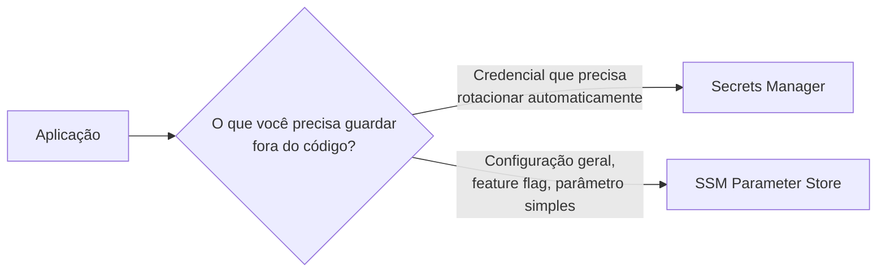
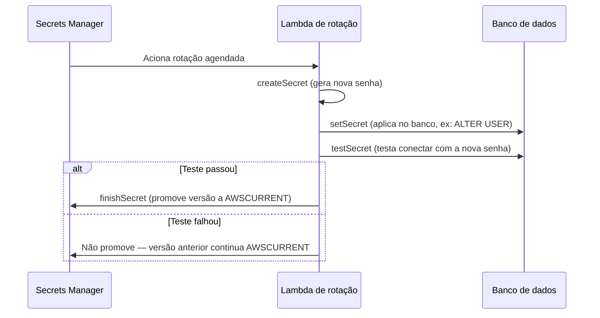
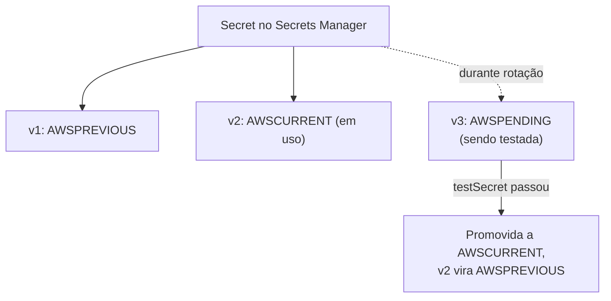
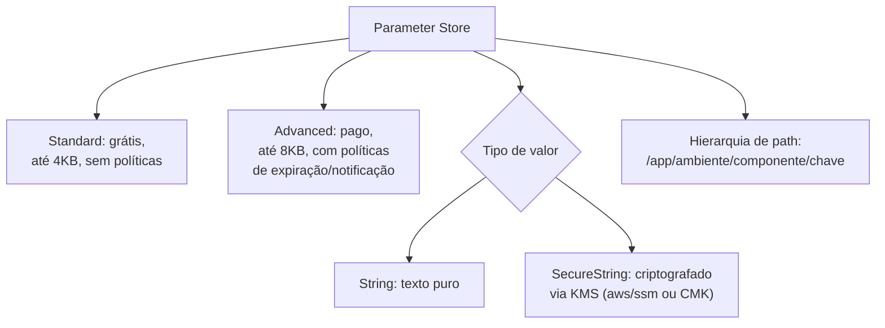
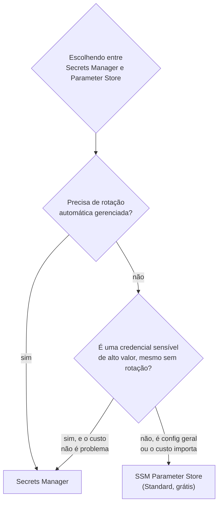
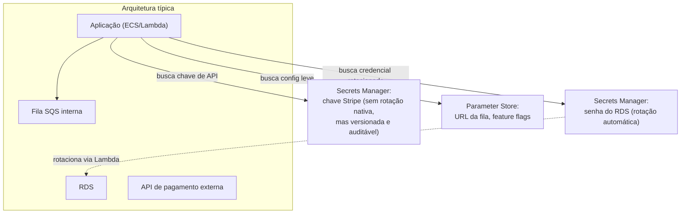
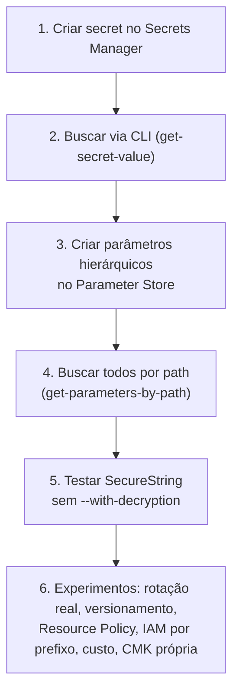

# Secrets Manager e Systems Manager Parameter Store — Guia Completo (Teoria + Prática + Dia a Dia)

## 0. O problema que os dois resolvem

Antes de comparar os dois serviços, vale entender o problema comum que eles atacam.

Toda aplicação real precisa de **configuração externa**: string de conexão de banco, senha de API de terceiro, chave de licença, feature flag, URL de outro microsserviço, endpoint de fila. O erro clássico (e ainda muito comum) é colocar isso **hardcoded no código** ou em variáveis de ambiente sem criptografia — o que significa que qualquer pessoa com acesso ao repositório, ao console EC2, ou a um snapshot vê a senha do banco em texto puro.

A AWS oferece **dois serviços** para isso, e a confusão entre eles é uma das pegadinhas mais recorrentes da prova: **Secrets Manager** (focado em segredos que precisam de **rotação automática** e ciclo de vida de credencial) e **SSM Parameter Store** (focado em **configuração** geral, com ou sem criptografia, de forma mais simples e barata).


*A pergunta que decide entre os dois: você precisa de rotação automática gerenciada, ou só de um valor de configuração guardado com segurança?*

---

## 1. AWS Secrets Manager

### O que ele resolve especificamente

Secrets Manager foi desenhado para o ciclo de vida completo de uma **credencial**: guardar, criptografar, versionar, **rotacionar automaticamente** e integrar nativamente com bancos de dados. Ele existe porque credenciais têm um problema que configuração comum não tem: se ficam paradas para sempre, viram um risco de segurança crescente (quanto mais tempo uma senha existe sem trocar, maior a superfície de exposição em caso de vazamento).

### Rotação automática via Lambda

O coração do Secrets Manager é a rotação automática. O fluxo funciona assim:

1. Você configura uma **política de rotação** no secret (ex: a cada 30 dias).
2. No horário agendado, o Secrets Manager invoca uma **função Lambda de rotação** (a AWS fornece templates prontos para RDS, Redshift, DocumentDB — ou você escreve a sua para outros sistemas).
3. Essa Lambda executa **quatro etapas** internamente (o padrão oficial de rotação da AWS):
   - **createSecret** — gera uma nova credencial/senha.
   - **setSecret** — aplica essa nova credencial no sistema de destino (ex: `ALTER USER` no banco).
   - **testSecret** — testa se a nova credencial funciona de verdade, conectando com ela.
   - **finishSecret** — marca a nova versão como a versão **atual** (`AWSCURRENT`), movendo a versão anterior para `AWSPREVIOUS`.
4. Se qualquer etapa falhar, o Secrets Manager **não promove** a nova versão — a aplicação continua usando a credencial anterior, que ainda é válida, evitando um outage por rotação malsucedida.


*As quatro etapas do processo de rotação — só promove a nova credencial se ela realmente funcionar.*

### Integração nativa com RDS, Redshift e DocumentDB

Para esses três, a AWS oferece rotação **"turnkey"** — você marca uma caixinha ao criar o secret associado ao banco, e a AWS provisiona e gerencia a Lambda de rotação automaticamente, sem você escrever nada. Existem dois padrões de rotação:

- **Single-user rotation:** a mesma credencial é rotacionada no lugar — mais simples, mas existe uma janela onde a senha antiga já não vale e a nova pode ainda não ter propagado para todas as conexões ativas.
- **Alternating-users (multi-user) rotation:** o Secrets Manager alterna entre **duas credenciais** (usuário A e usuário B) — enquanto uma é rotacionada, a outra continua válida e em uso, eliminando o problema de janela de indisponibilidade. É o padrão recomendado para produção.

**No dia a dia:** essa é a integração que resolve o problema clássico de "a senha do RDS está hardcoded numa Lambda/EC2 há dois anos e ninguém sabe trocar sem quebrar produção". Com Secrets Manager + rotação nativa, sua aplicação nunca precisa saber a senha atual — ela **busca o secret em tempo de execução** (via SDK) e sempre recebe a versão válida no momento.

### Resource Policies

Assim como o KMS, um secret pode ter uma **Resource Policy** anexada diretamente a ele, controlando quem pode acessá-lo (`secretsmanager:GetSecretValue`, etc) **independente** da IAM Policy do chamador — útil para cenários cross-account, onde a conta dona do secret precisa conceder acesso explícito a uma conta/role externa.

### Versionamento de secret

Cada mudança de valor gera uma **nova versão**, identificada por um `VersionId` (UUID). As versões recebem **labels** (`AWSCURRENT`, `AWSPREVIOUS`, `AWSPENDING` durante rotação em andamento) que apontam para qual versão é a "atual" em cada momento. Isso permite:
- Rollback rápido (repontar `AWSCURRENT` para uma versão anterior, em caso de rotação problemática).
- Auditoria de histórico de mudanças.

### Custo

Secrets Manager cobra **por secret armazenado por mês** + **por 10.000 chamadas de API**. É significativamente mais caro que o Parameter Store Standard (que é grátis) — esse é o principal motivo de não usar Secrets Manager para tudo indiscriminadamente, mesmo ele sendo "melhor" em features.


*Labels de versão controlam qual credencial está "ativa" em cada momento, permitindo rollback.*

---

## 2. SSM Parameter Store

### O que ele resolve especificamente

Parameter Store é parte do **AWS Systems Manager** e resolve o problema mais amplo de "configuração como serviço" — não só segredos, mas qualquer valor que sua aplicação precise buscar em runtime: URL de endpoint, nome de fila, feature flag, versão de AMI aprovada, e também senhas simples (via `SecureString`).

### Standard vs Advanced

| Característica | Standard | Advanced |
|---|---|---|
| Custo | **Grátis** | Cobrado por parâmetro/mês |
| Número de parâmetros por conta | Limite mais baixo (histórico: 10.000) | Limite bem maior |
| Tamanho máximo do valor | 4 KB | 8 KB |
| Políticas de parâmetro (expiração, notificação) | Não suporta | Suporta (ex: expirar automaticamente, notificar antes de expirar) |
| Integração com **CloudFormation** para parâmetros de alto uso | Limitada | Completa |

**No dia a dia:** a esmagadora maioria dos casos de uso cabe no tier **Standard**, que é grátis — você só migra para Advanced quando precisa de mais de 10.000 parâmetros na conta, valores maiores que 4 KB, ou as políticas de expiração/notificação.

### SecureString com KMS

Um parâmetro pode ser do tipo `String` (texto puro, sem criptografia) ou `SecureString` (criptografado usando o **KMS** — pode usar a chave `aws/ssm` gerenciada pela AWS, ou uma CMK sua). Isso é o que permite guardar segredos simples no Parameter Store com segurança equivalente, em termos de criptografia em repouso, ao Secrets Manager.

**Detalhe técnico importante:** buscar um `SecureString` via API/CLI exige o parâmetro `--with-decryption` (ou a flag equivalente no SDK) — sem isso, você recebe o valor ainda criptografado. E a permissão IAM para decriptar via KMS precisa estar presente além da permissão do Parameter Store em si (as duas policies — SSM e KMS — entram em jogo, como vimos no arquivo de KMS).

### Hierarquia de parâmetros

Parâmetros são organizados por **path**, como um sistema de arquivos:
```
/minhaapp/prod/db/host
/minhaapp/prod/db/porta
/minhaapp/prod/feature-flags/novo-checkout
/minhaapp/dev/db/host
```

Isso permite buscar **todos os parâmetros de um ambiente de uma vez** com `get-parameters-by-path`, e também aplicar **controle de acesso granular por prefixo** via IAM (ex: uma role de dev só acessa `/minhaapp/dev/*`, nunca `/minhaapp/prod/*`).

**Uso real:** é o padrão mais comum para configuração de aplicação multi-ambiente — você usa a mesma estrutura de path em dev/staging/prod, e a aplicação só precisa saber o ambiente atual (via variável de ambiente `ENV=prod`) para montar o prefixo certo e buscar todos os parâmetros daquele ambiente de uma vez.

### Rotação — o que falta nativamente

Parameter Store **não tem rotação automática nativa** como o Secrets Manager. Se você precisa rotacionar um valor guardado lá, a alternativa é construir isso você mesmo (ex: um EventBridge Schedule acionando uma Lambda que gera um valor novo e chama `put-parameter`), ou — mais comum na prática — usar o **Secrets Manager** para a credencial que precisa rotacionar, e o Parameter Store só para o resto.

**Pegadinha clássica de prova:** existe uma integração onde o Secrets Manager pode "espelhar" um secret como referência dentro do Parameter Store (útil para ferramentas que só sabem ler do Parameter Store), mas isso não é "Parameter Store rotacionando nativamente" — quem rotaciona ali, por trás, continua sendo o Secrets Manager.


*Parameter Store: dois tiers de custo/limite, dois tipos de criptografia, organizado hierarquicamente.*

---

## 3. Tabela comparativa completa

| Critério | Secrets Manager | SSM Parameter Store |
|---|---|---|
| **Custo** | Por secret/mês + por 10k chamadas de API | Standard: grátis / Advanced: pago por parâmetro |
| **Rotação automática nativa** | Sim — via Lambda, com templates prontos para RDS/Redshift/DocumentDB | Não — precisa construir você mesmo, ou delegar ao Secrets Manager |
| **Criptografia** | Sempre criptografado via KMS (obrigatório) | Opcional — só se usar tipo `SecureString` |
| **Versionamento** | Sim, com labels (`AWSCURRENT`/`AWSPREVIOUS`/`AWSPENDING`) | Sim, versão numérica simples (sem labels de rotação) |
| **Hierarquia/organização** | Não tem conceito de path hierárquico nativo | Sim — `/app/ambiente/chave` |
| **Resource Policy (cross-account)** | Sim | Limitado — mais comum via IAM |
| **Integração nativa com RDS/Redshift/DocumentDB** | Sim, "turnkey" | Não |
| **Tamanho máximo do valor** | Até 64 KB | 4 KB (Standard) / 8 KB (Advanced) |
| **Notificação/expiração de parâmetro** | Não é o foco do serviço | Sim, no tier Advanced |
| **Caso de uso típico** | Credencial de banco, chave de API de terceiro, qualquer coisa que precise rotacionar | Config de app, feature flag, nome de recurso, senha simples que não rotaciona automaticamente |


*Árvore de decisão prática: rotação automática é o critério decisivo; o resto normalmente pende para Parameter Store por custo.*

---

## 4. Uso real: onde cada um se encaixa numa arquitetura

Pensando numa arquitetura típica de aplicação web com backend em containers/Lambda e banco RDS:

- **Senha de conexão do RDS** → **Secrets Manager**, com rotação automática turnkey habilitada (alternating-users). A aplicação nunca guarda a senha localmente — busca via SDK a cada necessidade de reconexão (com cache local de curto prazo para não estourar limite de API).
- **Chave de API de um serviço de pagamento de terceiro (ex: Stripe)** → **Secrets Manager**, mesmo sem rotação automática nativa disponível para esse tipo de credencial — porque ainda ganha versionamento, Resource Policy e a possibilidade de rotação manual/custom via Lambda própria se um dia precisar.
- **URL do endpoint de um microsserviço interno, nome de uma fila SQS, flag `MODO_MANUTENCAO=false`** → **SSM Parameter Store Standard** — configuração de baixo risco, sem necessidade de rotação, e sem custo.
- **Uma senha simples de um serviço interno legado, que não tem integração de rotação nativa e você não quer pagar Secrets Manager por ela** → **SSM Parameter Store com `SecureString`** — ainda criptografada via KMS, mas sem o overhead de custo do Secrets Manager. Você aceita o trade-off de não ter rotação automática.
- **Config compartilhada entre múltiplos ambientes (dev/staging/prod) de um mesmo app** → **SSM Parameter Store**, usando a hierarquia de path para organizar e IAM Policy por prefixo para isolar ambientes.


*Credenciais de banco e chaves de terceiro no Secrets Manager; configuração leve e não sensível no Parameter Store.*

---

## 5. Conexão com os domínios da prova

- **Segurança:** ambos os serviços evitam hardcoding de credenciais/config sensível; Secrets Manager acrescenta rotação automática que reduz a janela de exposição de uma credencial comprometida; SecureString no Parameter Store dá o mesmo nível de criptografia em repouso via KMS.
- **Resiliência:** rotação com alternating-users evita downtime durante troca de credencial — um detalhe que aparece tanto na prova quanto em produção real.
- **Performance:** buscar segredos/parâmetros em toda invocação de Lambda gera latência e pode esbarrar em limites de API — o padrão recomendado é fazer cache local do valor por um TTL curto, em vez de buscar a cada execução.
- **Custo:** essa é a maior diferença prática entre os dois — Parameter Store Standard grátis vs Secrets Manager cobrando por secret + por chamada, o que pesa em arquiteturas com centenas de segredos/parâmetros.

---

# 🧪 Laboratório prático (para executar na AWS)

## Objetivo
Criar um secret com rotação simulada no Secrets Manager, e um parâmetro hierárquico `SecureString` no Parameter Store, comparando o fluxo de acesso dos dois.

### Passo 1 — Criar um secret no Secrets Manager
Console → Secrets Manager → **Store a new secret**
- Tipo: "Other type of secret"
- Chave/valor: `usuario` / `admin`, `senha` / `MinhaSenh@123`
- Nome do secret: `minhaapp/prod/db-credenciais`

### Passo 2 — Buscar o secret via CLI
```bash
aws secretsmanager get-secret-value --secret-id minhaapp/prod/db-credenciais
```

### Passo 3 — Criar parâmetros hierárquicos no Parameter Store
```bash
aws ssm put-parameter --name "/minhaapp/prod/db/host" --value "db.exemplo.com" --type String
aws ssm put-parameter --name "/minhaapp/prod/db/senha" --value "MinhaSenh@123" --type SecureString
aws ssm put-parameter --name "/minhaapp/prod/feature-flags/novo-checkout" --value "true" --type String
```

### Passo 4 — Buscar todos os parâmetros de um path de uma vez
```bash
aws ssm get-parameters-by-path --path "/minhaapp/prod" --recursive --with-decryption
```

### Passo 5 — Testar acesso sem `--with-decryption`
```bash
aws ssm get-parameter --name "/minhaapp/prod/db/senha"
# Observe que o valor vem ainda criptografado/ilegível sem a flag --with-decryption
```

### Passo 6 — Experimentos para fixar cada conceito
1. **Rotação real:** associe o secret a uma instância RDS real (ou simulada com um free-tier db.t3.micro) e habilite rotação automática turnkey, observando a Lambda gerada automaticamente pela AWS e os logs dela no CloudWatch.
2. **Versionamento:** atualize o valor do secret (`put-secret-value`) duas vezes, depois liste as versões com `list-secret-version-ids` e observe os labels `AWSCURRENT`/`AWSPREVIOUS`.
3. **Resource Policy cross-account:** anexe uma Resource Policy ao secret permitindo uma segunda conta AWS (se disponível em sandbox) a ler o valor, e teste o acesso de lá.
4. **IAM por prefixo no Parameter Store:** crie uma IAM Policy que só permite `ssm:GetParameter*` em `arn:aws:ssm:*:*:parameter/minhaapp/dev/*`, anexe a um usuário de teste, e confirme que ele não consegue ler `/minhaapp/prod/*`.
5. **Custo na prática:** compare no console de billing (ou na calculadora AWS) o custo estimado de 50 secrets no Secrets Manager vs 50 parâmetros Standard no Parameter Store.
6. **SecureString com CMK própria:** crie um parâmetro `SecureString` especificando uma CMK sua (`--key-id alias/minha-chave-lab`, do arquivo anterior) em vez da `aws/ssm` padrão, e note a Key Policy entrando em jogo para liberar o acesso.


*Sequência dos passos do laboratório prático.*

---

## Comandos AWS CLI úteis

```bash
# --- Secrets Manager ---

# Criar um secret
aws secretsmanager create-secret --name minhaapp/prod/db-credenciais \
  --secret-string '{"usuario":"admin","senha":"MinhaSenh@123"}'

# Buscar o valor atual
aws secretsmanager get-secret-value --secret-id minhaapp/prod/db-credenciais

# Atualizar o valor (gera nova versão)
aws secretsmanager put-secret-value --secret-id minhaapp/prod/db-credenciais \
  --secret-string '{"usuario":"admin","senha":"NovaSenh@456"}'

# Habilitar rotação automática (com Lambda já associada)
aws secretsmanager rotate-secret --secret-id minhaapp/prod/db-credenciais \
  --rotation-lambda-arn arn:aws:lambda:us-east-1:123456789012:function:MinhaLambdaRotacao \
  --rotation-rules AutomaticallyAfterDays=30

# Listar versões e seus labels
aws secretsmanager list-secret-version-ids --secret-id minhaapp/prod/db-credenciais

# --- SSM Parameter Store ---

# Criar parâmetro simples
aws ssm put-parameter --name "/minhaapp/prod/feature-flags/novo-checkout" \
  --value "true" --type String

# Criar SecureString com KMS padrão (aws/ssm)
aws ssm put-parameter --name "/minhaapp/prod/db/senha" \
  --value "MinhaSenh@123" --type SecureString

# Criar SecureString com CMK própria
aws ssm put-parameter --name "/minhaapp/prod/db/senha" \
  --value "MinhaSenh@123" --type SecureString --key-id alias/minha-chave-lab

# Buscar um parâmetro com decriptação
aws ssm get-parameter --name "/minhaapp/prod/db/senha" --with-decryption

# Buscar todos os parâmetros de um path recursivamente
aws ssm get-parameters-by-path --path "/minhaapp/prod" --recursive --with-decryption
```

---

## Tabela de decisão rápida (prova + dia a dia)

| Cenário | Resposta provável |
|---|---|
| Senha de RDS que precisa rotacionar automaticamente | Secrets Manager, com rotação turnkey |
| Chave de API de terceiro, sem rotação nativa disponível, mas sensível | Secrets Manager (versionamento, Resource Policy, custo aceito) |
| Config simples (URL, feature flag, nome de recurso) | SSM Parameter Store Standard (grátis) |
| Senha simples, sem necessidade de rotação, minimizando custo | SSM Parameter Store com `SecureString` |
| Mais de 10.000 parâmetros ou valores acima de 4KB | SSM Parameter Store Advanced |
| Organizar config por ambiente (dev/staging/prod) com controle de acesso granular | SSM Parameter Store, hierarquia de path + IAM por prefixo |
| Precisa de rollback rápido para credencial anterior | Secrets Manager, repontar label `AWSCURRENT` |
| Compartilhar segredo entre contas AWS diferentes | Secrets Manager com Resource Policy (ou Parameter Store via IAM cross-account, mais raro) |
| "Por que meu SecureString retorna valor criptografado?" | Faltou `--with-decryption` na chamada |
| Minimizar custo em arquitetura com centenas de valores de config | SSM Parameter Store Standard sempre que rotação automática não for necessária |
