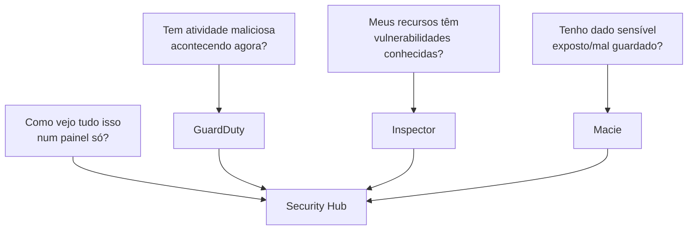
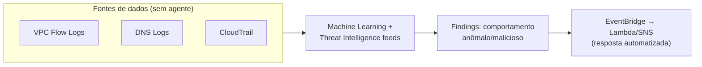
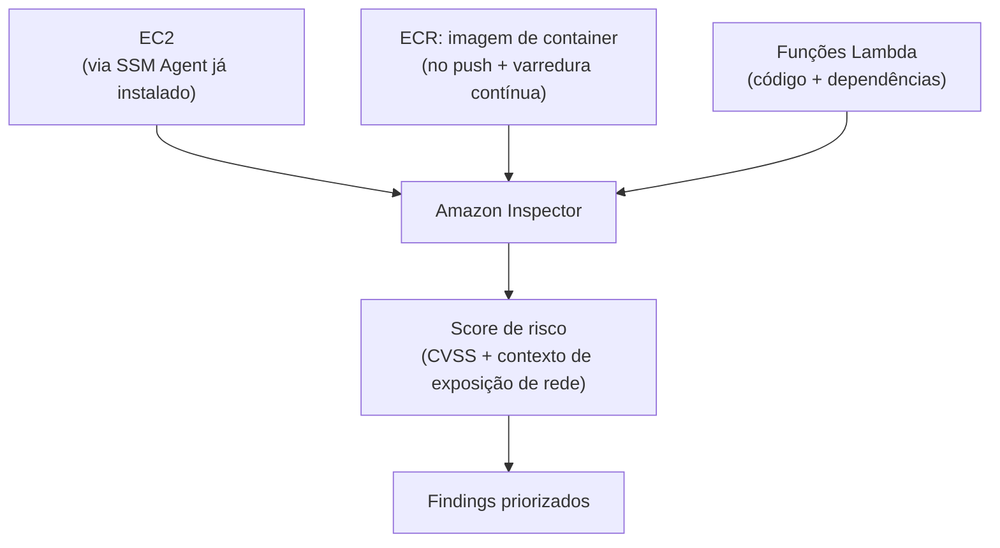
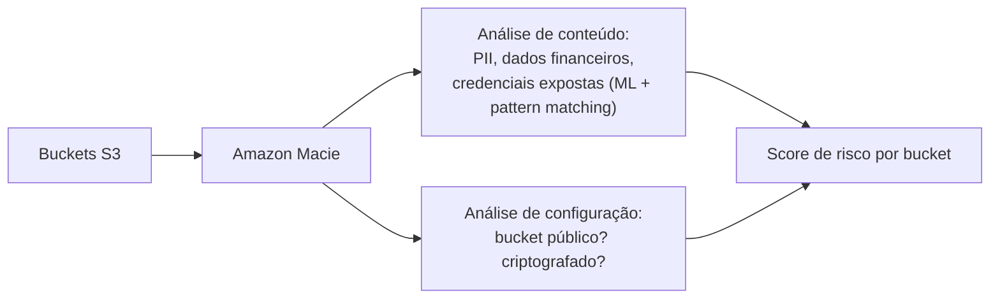
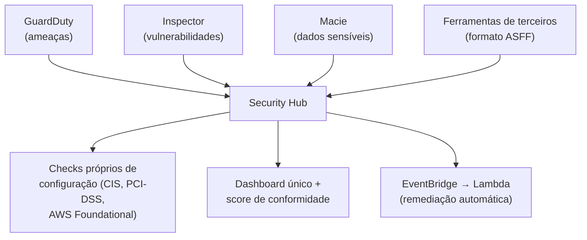
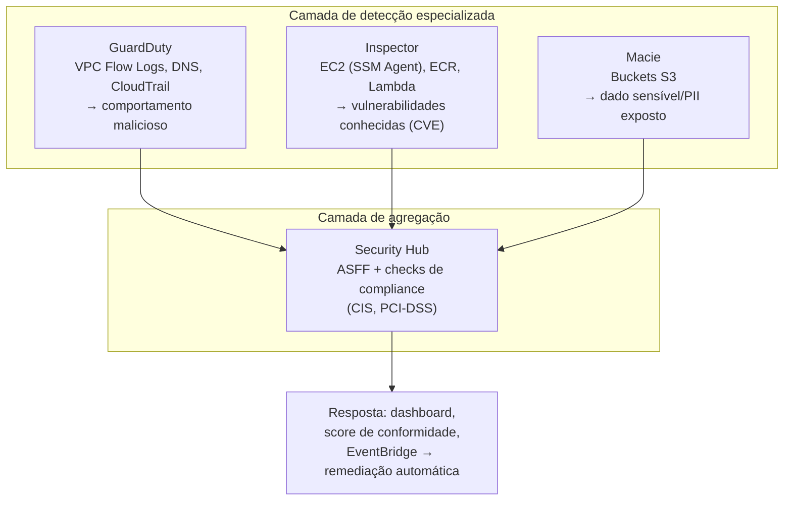
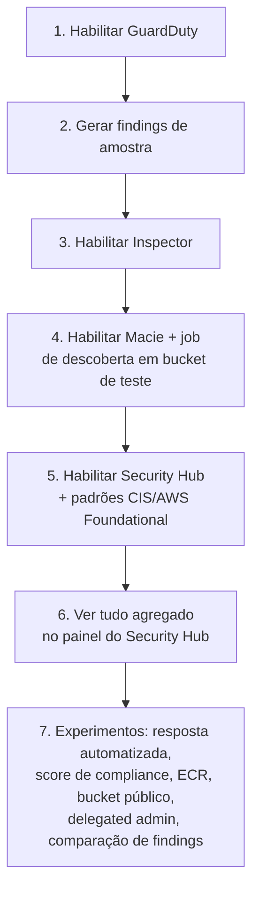

# GuardDuty, Inspector, Macie e Security Hub — Guia Completo (Teoria + Prática + Dia a Dia)

## 0. O problema que esses quatro serviços resolvem juntos

Antes de detalhar cada um, vale entender por que a AWS tem **quatro** serviços de segurança que parecem se sobrepor — essa é uma fonte enorme de confusão tanto na prova quanto no dia a dia.

Segurança na nuvem tem várias perguntas diferentes que precisam de resposta, e cada uma exige uma abordagem técnica distinta:
- "Alguém está fazendo algo malicioso **agora**, dentro da minha conta?" (detecção de ameaça em tempo real)
- "Meus recursos (EC2, containers, funções Lambda) têm **vulnerabilidades conhecidas** de software que um atacante poderia explorar?" (scanning de vulnerabilidade)
- "Eu tenho **dados sensíveis** (CPF, cartão de crédito, dados médicos) armazenados em algum lugar que não deveria, ou expostos publicamente?" (descoberta e classificação de dados)
- "Como eu vejo **tudo isso junto**, de forma centralizada, sem entrar em quatro consoles diferentes toda manhã?" (agregação e postura de compliance)

Cada um dos quatro serviços responde a **uma** dessas perguntas. Eles não competem entre si — são complementares, e o quarto (Security Hub) existe justamente para juntar a saída dos outros três (e de mais fontes) num único painel.


*Cada serviço responde uma pergunta de segurança diferente; Security Hub agrega as respostas de todos.*

---

## 1. Amazon GuardDuty — detecção de ameaças

### O problema que resolve
Você pode ter todas as configurações de segurança perfeitas (IAM restrito, SGs fechados, criptografia ligada) e ainda assim ser comprometido — uma credencial vazada, uma instância comprometida por malware, um insider malicioso. GuardDuty existe para detectar **comportamento anômalo/malicioso enquanto ele está acontecendo**, não para checar configuração estática.

### Como funciona
GuardDuty é um serviço de **detecção de ameaças usando Machine Learning e inteligência de ameaças** (threat intelligence feeds da AWS e de parceiros como Proofpoint e CrowdStrike). Ele analisa continuamente três fontes principais de dados, **sem exigir a instalação de nenhum agente**:

- **VPC Flow Logs** — metadados de tráfego de rede (quem falou com quem, em qual porta, quanto tráfego) — GuardDuty lê isso mesmo que você **não tenha habilitado** Flow Logs manualmente no seu VPC, porque ele acessa a fonte de dados diretamente por baixo dos panos.
- **DNS Logs** — consultas DNS feitas pelos seus recursos — útil para detectar comunicação com domínios conhecidos de comando-e-controle (C2) de malware, ou exfiltração de dados via DNS tunneling.
- **CloudTrail Logs** (management events e, opcionalmente, S3 data events) — chamadas de API feitas na conta — útil para detectar comportamento anômalo de uma credencial (ex: uma IAM Role que nunca chamou `CreateUser` de repente começa a criar usuários e anexar policies administrativas, um padrão clássico de comprometimento de credencial).

**Por que "sem agente" é um ponto importante:** diferente de ferramentas de segurança tradicionais que exigem instalar software dentro de cada instância, o GuardDuty analisa dados que a própria AWS já tem (logs de rede, DNS, API) sem precisar rodar nada dentro da sua EC2. Isso significa cobertura completa e imediata, sem risco de "esqueci de instalar o agente nessa instância".

**Exemplos de findings típicos:**
- Instância EC2 se comunicando com um IP conhecido de mineração de criptomoeda.
- Chamada de API vinda de uma geolocalização incomum para aquela credencial (ex: chave de acesso usada nos EUA de repente sendo usada da Rússia minutos depois — fisicamente impossível, indicando vazamento de credencial).
- Reconhecimento de rede (port scanning) vindo de uma instância sua contra outros hosts.
- Consulta a um bucket S3 de forma incomum comparado ao padrão histórico daquele usuário/role.

**No dia a dia:** GuardDuty é normalmente uma das primeiras coisas que se habilita numa conta AWS nova, porque é **um clique** (não exige nenhuma configuração de infraestrutura) e o custo é baseado em volume de dados analisado, com um free trial inicial generoso.


*GuardDuty consome logs que a AWS já coleta — não precisa de agente em nenhuma instância.*

---

## 2. Amazon Inspector — scanning de vulnerabilidades

### O problema que resolve
Mesmo sem nenhum comportamento malicioso acontecendo, seus recursos podem ter **vulnerabilidades conhecidas** (CVEs) em bibliotecas, pacotes de sistema operacional, ou na própria imagem de container — um problema estático, não comportamental.

### O que ele varre
| Recurso | O que o Inspector analisa |
|---|---|
| **EC2** | Vulnerabilidades de software (pacotes do SO) e, opcionalmente, exposição de rede (se a instância está acessível de formas inseguras) — usa o **SSM Agent** já presente na instância, não exige agente adicional separado |
| **ECR (imagens de container)** | Varre a imagem **no momento do push** para o repositório (e periodicamente depois, para pegar CVEs novas descobertas após a imagem já estar publicada) |
| **Lambda** | Varre o código da função e suas dependências (camadas/libraries) em busca de vulnerabilidades conhecidas |

**Detalhe técnico importante:** o Inspector não é "instale um agente novo" para EC2 — ele reaproveita o **SSM Agent**, que já roda na maioria das AMIs modernas da AWS. Isso simplifica a adoção, mas significa que a instância precisa ter o SSM Agent ativo e a role IAM correta para o Inspector conseguir escanear.

**Como ele prioriza:** cada finding recebe um **score de risco** que combina a severidade do CVE (CVSS) com o contexto da rede (ex: uma vulnerabilidade numa instância exposta diretamente à internet tem prioridade maior que a mesma vulnerabilidade numa instância isolada em subnet privada) — isso ajuda a equipe de segurança a não se afogar em milhares de CVEs de baixo risco real e focar no que importa primeiro.

**No dia a dia:** é essencial em pipelines de CI/CD modernos — a varredura de imagem ECR **no push** permite bloquear o deploy de uma imagem com vulnerabilidade crítica antes mesmo dela chegar em produção, um controle de "shift-left" de segurança.


*Inspector cobre três superfícies diferentes de vulnerabilidade, sem exigir agente novo em EC2.*

---

## 3. Amazon Macie — descoberta de dados sensíveis

### O problema que resolve
Você pode ter dezenas ou centenas de buckets S3 numa conta, acumulados ao longo de anos, sem saber com certeza **onde** existe dado sensível (PII — informação pessoal identificável, dados financeiros, credenciais expostas em arquivo texto) nem se algum desses buckets está **exposto publicamente**.

### Como funciona
Macie usa **Machine Learning e pattern matching** para escanear o conteúdo de buckets S3 e identificar automaticamente:
- **PII** — CPF, RG, número de cartão de crédito, endereço, nome completo combinado com outros dados identificáveis.
- Dados financeiros e de saúde.
- Credenciais/segredos deixados por engano em arquivos (ex: uma chave de acesso AWS num arquivo `.env` esquecido dentro de um bucket).

Além do conteúdo, Macie também avalia a **configuração de segurança do bucket** em si — se está público, se tem criptografia, se tem versionamento — cruzando isso com a sensibilidade do dado encontrado para gerar um **score de risco por bucket** (um bucket público contendo PII é uma prioridade crítica; um bucket privado sem dado sensível é baixo risco).

**No dia a dia:** muito usado em auditorias de compliance (LGPD no Brasil, GDPR na Europa) para responder à pergunta "onde exatamente estão os dados pessoais dos nossos clientes na nossa infraestrutura AWS?" — uma pergunta que, sem uma ferramenta assim, exigiria varredura manual de cada bucket.


*Macie combina descoberta de dado sensível com a configuração de segurança do bucket que o guarda.*

---

## 4. AWS Security Hub — agregador central

### O problema que resolve
Depois de habilitar GuardDuty, Inspector e Macie (e possivelmente outras ferramentas de terceiros), você teria que abrir **quatro consoles diferentes** toda manhã para ter uma visão de postura de segurança. Security Hub existe para centralizar tudo isso num **dashboard único**, com um formato de finding padronizado (**AWS Security Finding Format — ASFF**).

### O que ele faz, especificamente

1. **Agrega findings** de GuardDuty, Inspector, Macie, e também de ferramentas de terceiros compatíveis com o formato ASFF, além de findings gerados pelo próprio Security Hub via seus checks de configuração.
2. **Roda checks automáticos contra padrões de compliance** — os mais citados na prova são:
   - **CIS AWS Foundations Benchmark** — um conjunto de boas práticas de configuração de segurança consolidado pelo Center for Internet Security.
   - **PCI-DSS** — padrão de segurança para quem processa dados de cartão de crédito.
   - **AWS Foundational Security Best Practices** — o padrão próprio da AWS.
3. Gera um **score de conformidade** (percentual de checks que passam) por padrão habilitado, e permite acompanhar a evolução ao longo do tempo.
4. Permite **automação de resposta** — um finding do Security Hub pode disparar uma regra do EventBridge, que aciona uma Lambda de remediação automática (ex: um bucket que ficou público é automaticamente corrigido).

**Detalhe técnico importante:** Security Hub **não substitui** GuardDuty/Inspector/Macie — ele não faz a detecção/varredura em si, só consome e centraliza os findings que eles geram (mais os seus próprios checks de configuração). Você ainda precisa ter cada um dos três habilitado individualmente para ter o dado alimentando o Security Hub.

**No dia a dia:** em contas AWS de organizações maiores, é comum usar o **AWS Organizations** integrado com Security Hub para ter uma **conta de segurança centralizada (delegated administrator)** vendo os findings agregados de todas as contas-membro da organização — um único painel para toda a empresa, não só uma conta.


*Security Hub não detecta nada sozinho — ele agrega, padroniza (ASFF) e centraliza a resposta e a visualização.*

---

## 5. Como os quatro se relacionam — visão consolidada


*Três serviços especializados de detecção alimentando um único agregador com visão de compliance e automação de resposta.*

---

## 6. Distinções clássicas de prova

| Pergunta da prova | Serviço certo | Por quê |
|---|---|---|
| "Detectar atividade maliciosa/anômala em tempo real, sem agente" | **GuardDuty** | Analisa VPC Flow Logs, DNS, CloudTrail com ML |
| "Encontrar CVEs conhecidas em pacotes de uma instância EC2" | **Inspector** | Scanning de vulnerabilidade via SSM Agent |
| "Escanear imagem de container antes/depois do push no ECR" | **Inspector** | Cobre EC2, ECR e Lambda |
| "Descobrir onde há CPF/cartão de crédito armazenado em buckets S3" | **Macie** | ML + pattern matching sobre conteúdo do S3 |
| "Ver todos os findings de segurança da conta num painel único" | **Security Hub** | Agregador central, formato ASFF |
| "Checar conformidade com CIS Benchmark ou PCI-DSS" | **Security Hub** | Roda checks automáticos de compliance |
| "Uma instância está se comunicando com IP de mineração de cripto" | **GuardDuty** | Padrão de comportamento malicioso via threat intel |
| "Função Lambda usa uma dependência com vulnerabilidade crítica" | **Inspector** | Cobre também Lambda, não só EC2/ECR |
| "Bucket S3 está público e contém dados de cartão de crédito" | **Macie** (detecta o dado) **+ Security Hub** (agrega e prioriza) | Macie encontra o dado sensível; Security Hub combina com o contexto de compliance |
| "Preciso de detecção de ameaça, MAS meus recursos não têm nenhum agente instalado" | **GuardDuty** | É o único dos quatro que não depende de agente algum (Inspector usa SSM Agent, que tecnicamente já vem em AMIs modernas, mas ainda é um agente) |
| "Automatizar remediação quando um finding aparece" | **Security Hub + EventBridge + Lambda** | Security Hub centraliza e dispara a automação; a detecção em si vem de GuardDuty/Inspector/Macie |

**Pegadinha clássica:** a prova gosta de testar se você sabe que **Security Hub não detecta nada sozinho** — ele é um consumidor/agregador. Uma pergunta do tipo "qual serviço detecta que uma instância está minerando criptomoeda" tem resposta GuardDuty, não Security Hub, mesmo que você "veja" esse finding no painel do Security Hub depois.

Outra pegadinha: confundir Inspector com GuardDuty porque os dois "olham" para EC2. A diferença é **estático vs comportamental** — Inspector te diz "essa instância tem uma vulnerabilidade conhecida que *poderia* ser explorada"; GuardDuty te diz "essa instância *está* fazendo algo suspeito agora".

---

## 7. Conexão com os domínios da prova

- **Segurança:** os quatro serviços são, em conjunto, a resposta padrão para "como eu tenho visibilidade e detecção de segurança contínua na AWS" — um tema recorrente em cenários de prova sobre postura de segurança.
- **Resiliência:** GuardDuty com resposta automatizada (EventBridge + Lambda) permite conter uma ameaça (ex: isolar uma instância comprometida automaticamente) antes que ela afete a disponibilidade de outros recursos.
- **Performance:** nenhum dos quatro serviços introduz overhead de performance na aplicação em si — todos operam sobre logs/metadados já existentes (GuardDuty, Security Hub) ou scanning assíncrono fora do caminho crítico da aplicação (Inspector, Macie), o que é frequentemente citado como vantagem sobre soluções de terceiros baseadas em agente pesado.
- **Custo:** GuardDuty e Macie cobram por volume de dados analisado; Inspector cobra por recurso escaneado (instância, imagem, função); Security Hub cobra por finding ingerido/check de compliance executado — em contas com muitos recursos, vale acompanhar esses custos, especialmente ao habilitar tudo pela primeira vez numa conta com histórico grande de dados em S3/CloudTrail.

---

# 🧪 Laboratório prático (para executar na AWS)

## Objetivo
Habilitar os quatro serviços numa conta de teste, gerar um finding de amostra em cada um dos três especializados, e observar tudo agregado no Security Hub.

### Passo 1 — Habilitar o GuardDuty
Console → GuardDuty → **Get Started** → **Enable GuardDuty**

### Passo 2 — Gerar findings de amostra no GuardDuty
```bash
aws guardduty create-sample-findings \
  --detector-id {detector-id} \
  --finding-types Backdoor:EC2/XORDDOS Recon:EC2/PortProbeUnprotectedPort
```

### Passo 3 — Habilitar o Inspector
Console → Inspector → **Activate** (para EC2, ECR e Lambda)

### Passo 4 — Habilitar o Macie e rodar um job de descoberta
Console → Macie → **Get Started** → Enable
- Crie um bucket de teste, suba um arquivo `.txt` com um CPF fictício e um número de cartão fictício dentro.
- **Create job** → selecione o bucket → rode uma vez.

### Passo 5 — Habilitar o Security Hub e os padrões de compliance
Console → Security Hub → **Go to Security Hub** → habilite os padrões **CIS AWS Foundations Benchmark** e **AWS Foundational Security Best Practices**.

### Passo 6 — Observar a agregação
Console → Security Hub → **Findings** → filtre por `ProductName` e observe findings vindos de GuardDuty, Inspector e Macie todos no mesmo painel, no formato ASFF.

### Passo 7 — Experimentos para fixar cada conceito
1. **Resposta automatizada:** crie uma regra no EventBridge que capture findings do GuardDuty com severidade alta e dispare um tópico SNS por e-mail — simule uma ameaça com `create-sample-findings` e veja a notificação chegar.
2. **Score de compliance:** no Security Hub, veja o score percentual do CIS Benchmark, escolha um check que falhou (ex: "MFA não habilitado no root"), corrija na conta, e observe o score subir na próxima avaliação.
3. **Inspector em ECR:** faça push de uma imagem Docker desatualizada (ex: uma imagem base antiga com CVEs conhecidas) para um repositório ECR com scanning habilitado, e veja os findings de vulnerabilidade aparecerem automaticamente.
4. **Macie em bucket público:** torne o bucket de teste do Passo 4 público temporariamente (com cuidado, em conta de teste) e veja o score de risco do Macie subir por causa da combinação de dado sensível + exposição pública — depois reverta a exposição.
5. **Delegated administrator:** se tiver acesso a AWS Organizations em sandbox, configure uma conta de segurança centralizada recebendo os findings de Security Hub de múltiplas contas-membro.
6. **Diferenciação Inspector vs GuardDuty:** compare um finding do Inspector (ex: "pacote X tem CVE-2024-YYYY") com um finding do GuardDuty (ex: "instância se comunicando com IP malicioso") lado a lado no Security Hub, reforçando a diferença estático vs comportamental.


*Sequência dos passos do laboratório prático.*

---

## Comandos AWS CLI úteis

```bash
# --- GuardDuty ---

# Habilitar o GuardDuty (cria o detector)
aws guardduty create-detector --enable

# Gerar findings de amostra para teste
aws guardduty create-sample-findings --detector-id {detector-id} \
  --finding-types Backdoor:EC2/XORDDOS

# Listar findings
aws guardduty list-findings --detector-id {detector-id}

# --- Inspector ---

# Habilitar o Inspector (v2) para EC2, ECR e Lambda
aws inspector2 enable --resource-types EC2 ECR LAMBDA

# Listar findings de vulnerabilidade
aws inspector2 list-findings

# --- Macie ---

# Habilitar o Macie
aws macie2 enable-macie

# Criar um job de descoberta de dados sensíveis
aws macie2 create-classification-job \
  --job-type ONE_TIME \
  --name "job-lab-macie" \
  --s3-job-definition '{"bucketDefinitions":[{"accountId":"123456789012","buckets":["meu-bucket-teste"]}]}'

# --- Security Hub ---

# Habilitar o Security Hub
aws securityhub enable-security-hub

# Habilitar um padrão de compliance (CIS)
aws securityhub batch-enable-standards \
  --standards-subscription-requests '[{"StandardsArn":"arn:aws:securityhub:us-east-1::standards/cis-aws-foundations-benchmark/v/1.4.0"}]'

# Listar findings agregados
aws securityhub get-findings
```

---

## Tabela de decisão rápida (prova + dia a dia)

| Cenário | Resposta provável |
|---|---|
| Detectar comportamento malicioso/anômalo em tempo real, sem instalar agente | GuardDuty |
| Encontrar CVEs conhecidas em pacotes de EC2, imagens ECR ou código Lambda | Inspector |
| Descobrir PII/dado sensível armazenado em buckets S3 | Macie |
| Painel único agregando findings de segurança de toda a conta/organização | Security Hub |
| Checar conformidade com CIS Benchmark ou PCI-DSS | Security Hub |
| Instância se comunicando com IP malicioso conhecido | GuardDuty |
| Imagem de container com vulnerabilidade crítica antes de ir para produção | Inspector (scanning no push do ECR) |
| Bucket público contendo dados de cartão de crédito | Macie detecta o dado; Security Hub agrega e prioriza |
| Diferenciar "vulnerabilidade conhecida" de "comportamento malicioso ativo" | Inspector = estático (CVE); GuardDuty = comportamental (ameaça em andamento) |
| Automatizar remediação quando um finding crítico aparece | Security Hub + EventBridge + Lambda |
| Visão de segurança centralizada de múltiplas contas AWS (Organizations) | Security Hub com delegated administrator |
| "Qual serviço detectou isso?" ao ver um finding no Security Hub | Verificar o campo `ProductName`/`ProductArn` do finding ASFF — Security Hub não gera a detecção primária sozinho |
