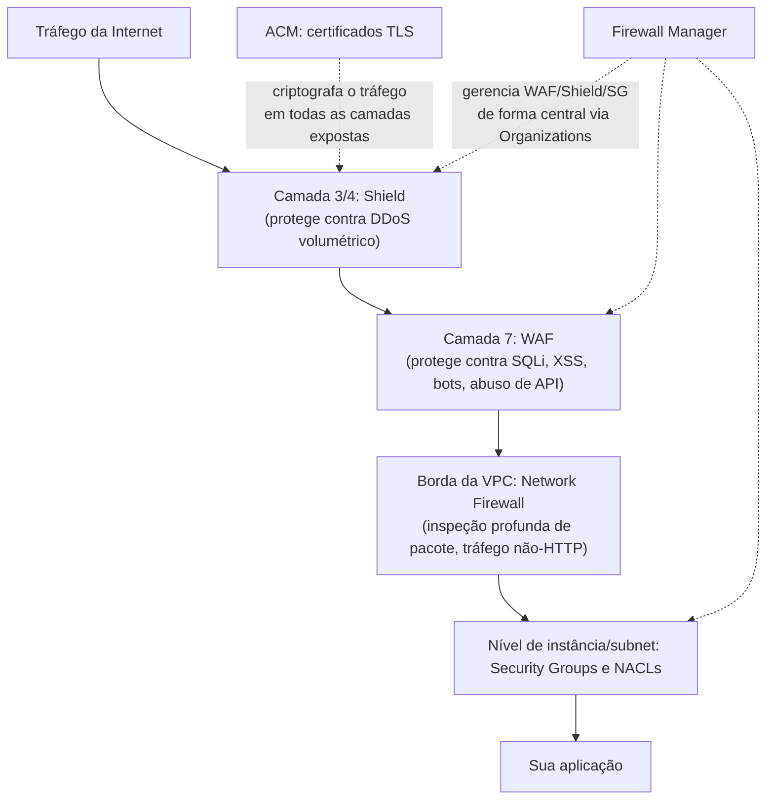
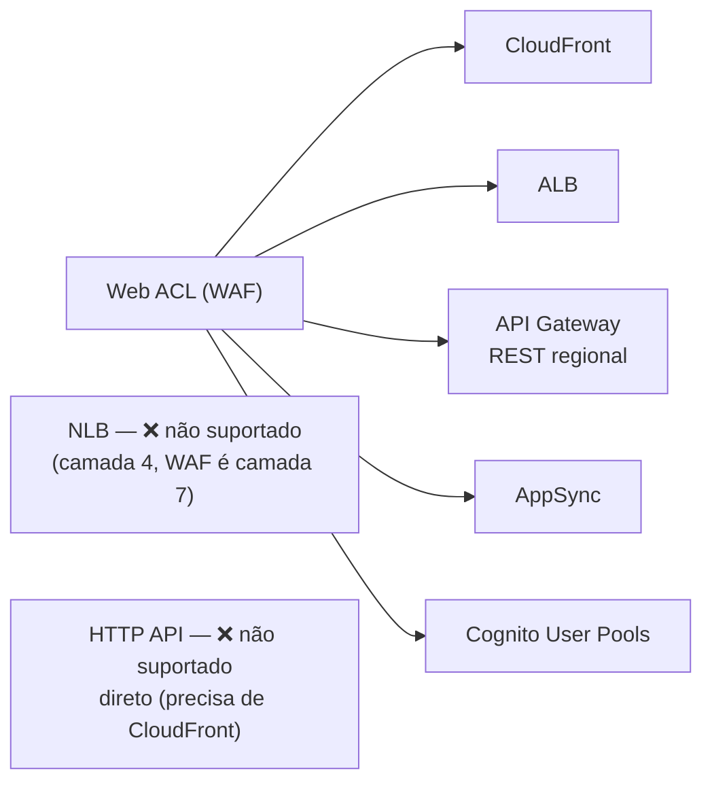
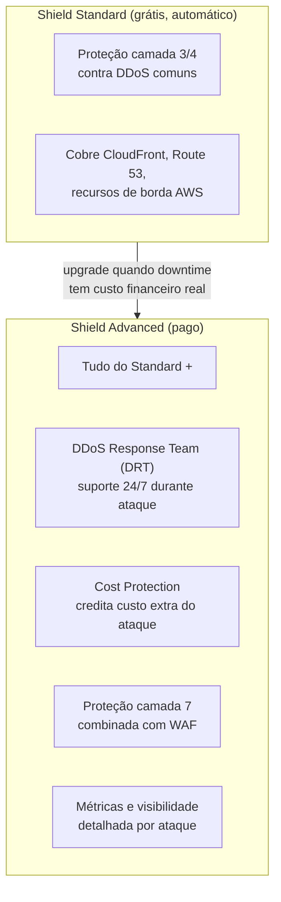
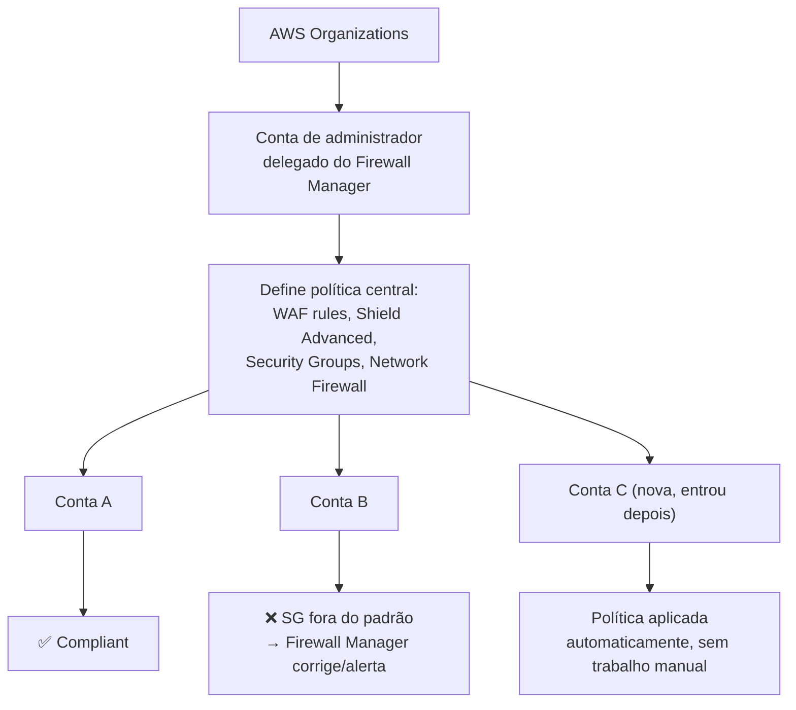
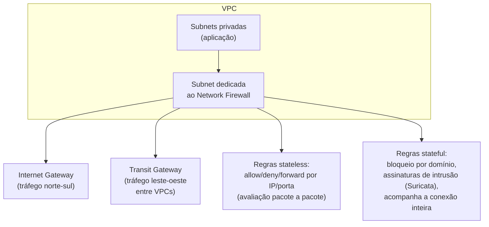
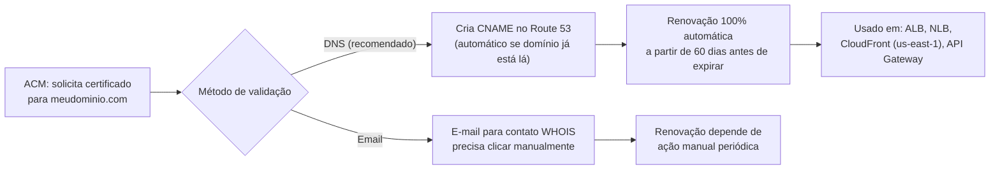
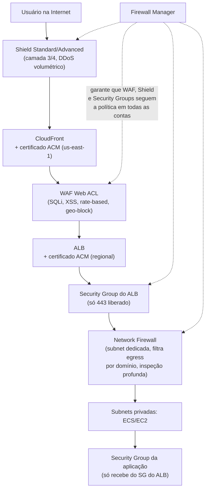
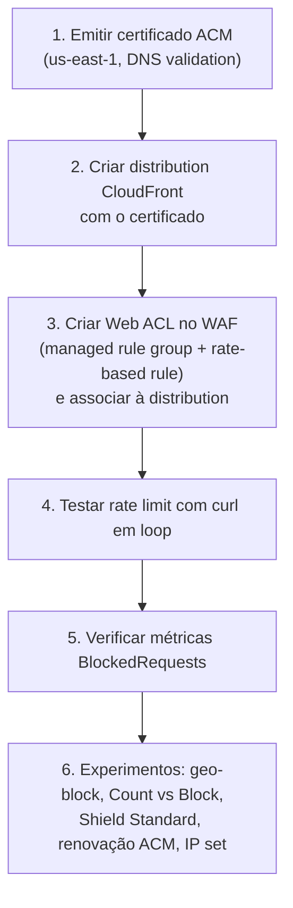

# WAF, Shield, Firewall Manager, Network Firewall e ACM — Guia Completo (Teoria + Prática + Dia a Dia)

## 0. O problema que essas ferramentas resolvem juntas

Antes de entrar serviço por serviço, vale entender por que a AWS tem **cinco** ferramentas diferentes de proteção de borda/rede em vez de uma só.

Cada uma resolve um problema diferente na cadeia de ataque:

- **DDoS volumétrico** (alguém tentando afogar sua infraestrutura com volume de tráfego) → **Shield**.
- **Ataques na camada de aplicação** (SQL Injection, XSS, bots, scraping, abuso de API) → **WAF**.
- **Gerenciar WAF/Shield/Security Groups de forma consistente em dezenas ou centenas de contas** → **Firewall Manager**.
- **Inspeção de pacote no nível de rede da VPC, incluindo tráfego que nem é HTTP** (ex: tráfego saindo para a internet, tráfego entre VPCs, DNS filtering) → **Network Firewall**.
- **Criptografar o tráfego em trânsito (TLS/HTTPS)** → **ACM**.

Nenhuma dessas ferramentas substitui a outra — elas são **camadas complementares**. Uma arquitetura AWS madura normalmente usa várias delas ao mesmo tempo, cada uma protegendo uma camada diferente do "bolo".


*Visão geral de como as cinco ferramentas se encaixam como camadas de defesa complementares, da borda até a instância.*

---

## 1. AWS WAF — Web Application Firewall

### O que é e o problema que resolve

O WAF protege contra ataques que acontecem **dentro do conteúdo da requisição HTTP** — coisas que um firewall de rede tradicional (que só olha IP/porta) não consegue ver, porque a requisição em si parece "válida" do ponto de vista de rede. Um `SELECT * FROM users WHERE id='1' OR '1'='1'` dentro do body de um POST é uma requisição HTTP perfeitamente formada — só o WAF, que entende o conteúdo da aplicação, consegue identificar isso como um ataque.

Esse repositório já cobre a integração do WAF com o API Gateway em profundidade (Web ACLs, rate-based rules, managed rule groups, IP sets, geo-blocking) no arquivo `Seçao18:Application_Integration/API_GATEWAY.md`, seção 14. Aqui o foco é generalizar o WAF para além do API Gateway — onde mais ele se associa, e os detalhes que a prova cobra fora desse contexto específico.

### Web ACLs e regras — recapitulando e expandindo

Uma **Web ACL (Web Access Control List)** é o container principal do WAF: um conjunto de regras que são avaliadas, em ordem, contra cada requisição. Cada regra tem uma ação: `Allow`, `Block` ou `Count` (conta mas não bloqueia — muito usado para testar uma regra nova sem impacto em produção antes de ativá-la de verdade).

| Tipo de regra | O que faz |
|---|---|
| **Rate-based rules** | Bloqueia automaticamente um IP (ou uma chave customizada, como um header) que ultrapassa um limite de requisições numa janela de tempo — proteção padrão contra brute-force e DDoS de camada 7 |
| **Managed Rule Groups (AWS ou Marketplace)** | Conjuntos prontos de regras (ex: `AWSManagedRulesCommonRuleSet`, `AWSManagedRulesSQLiRuleSet`) mantidos e atualizados pela AWS ou por fornecedores terceiros — você não escreve a lógica, só ativa |
| **IP sets** | Listas de IPs/CIDRs para bloquear ou permitir explicitamente |
| **Geo-match (geo-blocking)** | Bloqueia ou permite tráfego baseado no país de origem do IP |
| **Regras customizadas (custom rules)** | Você define condições próprias combinando campos da requisição (header, query string, body, URI) com operadores lógicos |

**No dia a dia:** a combinação mais comum em produção é `AWSManagedRulesCommonRuleSet` (proteção genérica OWASP Top 10) + uma rate-based rule (anti brute-force/DDoS L7) + IP sets customizados para bloquear IPs específicos identificados em incidentes anteriores.

### Onde o WAF se associa

Essa é a parte que a prova cobra pesado, porque é fácil confundir com "WAF funciona em qualquer coisa".

| Recurso | Suporta WAF? |
|---|---|
| **CloudFront** | ✅ — WAF é global aqui (a Web ACL vive em us-east-1 quando associada a CloudFront) |
| **ALB (Application Load Balancer)** | ✅ |
| **API Gateway — REST API regional** | ✅ — associação direta |
| **API Gateway — HTTP API** | ❌ — precisa de CloudFront na frente (ver `API_GATEWAY.md`, seção 14) |
| **API Gateway — WebSocket API** | ❌ — nenhuma forma direta |
| **AWS AppSync (GraphQL API)** | ✅ |
| **AWS Cognito User Pools** | ✅ — protege a própria tela/endpoint de login contra credential stuffing |
| **NLB (Network Load Balancer)** | ❌ — WAF opera na camada 7, NLB é camada 4, não faz sentido aqui |
| **EC2/instâncias diretamente** | ❌ — não existe associação direta a uma instância, precisa estar atrás de um dos recursos suportados acima |

**Pegadinha clássica de prova:** o WAF nunca protege um recurso na camada 3/4 pura (NLB, IP diretamente). Ele sempre precisa de um recurso que fale HTTP/HTTPS na frente — ALB, CloudFront, API Gateway (REST regional), AppSync ou Cognito.


*Recursos onde o WAF pode ser associado diretamente — tudo que fala HTTP/HTTPS na camada de aplicação.*

### Detalhe técnico importante: escopo Regional vs CloudFront (Global)

Quando você cria uma Web ACL, escolhe o escopo:
- **REGIONAL** — para ALB, API Gateway regional, AppSync, Cognito. A Web ACL vive na mesma região do recurso.
- **CLOUDFRONT** — para associar a uma distribution CloudFront. Nesse caso, a Web ACL **sempre é criada/gerenciada em us-east-1**, independente de onde seus usuários estão, porque CloudFront é um serviço global e o WAF segue essa mesma regra (o mesmo padrão que vale para certificados ACM usados em CloudFront — ver seção 5).

**O que muita gente erra na prova:** tentar associar uma Web ACL criada com escopo `REGIONAL` (em `sa-east-1`, por exemplo) a uma distribution CloudFront — isso não é possível, você precisa recriar a Web ACL com escopo `CLOUDFRONT` em `us-east-1`.

---

## 2. AWS Shield — Standard vs Advanced

### O problema: ataques DDoS volumétricos

Diferente do WAF (que olha o **conteúdo** da requisição), Shield foca em proteger contra **volume anormal de tráfego** tentando esgotar sua capacidade de rede/computação — na camada 3 (rede) e camada 4 (transporte), e no caso do Advanced, também ajuda na camada 7.

### Shield Standard

- **Gratuito e automático** — toda conta AWS já tem, sem precisar ativar nada.
- Protege contra os ataques DDoS mais comuns de camada 3/4 (ex: SYN floods, UDP reflection).
- Cobre automaticamente CloudFront, Route 53 e qualquer recurso na borda da rede AWS.
- Não tem dashboard dedicado de métricas de ataque nem suporte especializado — é proteção "de fábrica", passiva.

### Shield Advanced

- **Pago** (assinatura mensal com compromisso mínimo de 1 ano, mais taxa de uso de dados).
- Adiciona:
  - **DDoS Response Team (DRT)** — time especializado da AWS que você pode acionar 24/7 durante um ataque ativo, inclusive para ajudar a escrever regras de mitigação customizadas no WAF em tempo real.
  - **Cost protection** — se um ataque DDoS causar um pico artificial de custo (ex: Auto Scaling disparando mais instâncias por causa do tráfego malicioso, ou mais requisições no CloudFront/API Gateway), a AWS credita de volta esse custo extra causado pelo ataque.
  - **Proteção avançada de camada 7**, combinada com WAF — o Shield Advanced monitora padrões e pode criar/ajustar regras de WAF automaticamente para mitigar ataques de aplicação em tempo real.
  - **Visibilidade e métricas detalhadas** de cada ataque via console e CloudWatch.
  - Cobertura para EC2, ALB, NLB, CloudFront, Global Accelerator e Route 53 (Elastic IPs incluídos).

**Uso real:** Shield Advanced faz sentido para empresas onde um ataque DDoS tem impacto financeiro real e mensurável — e-commerce em datas de pico, serviços financeiros, plataformas onde downtime custa caro o suficiente para justificar a assinatura. A maioria dos workloads pequenos/médios vive tranquilamente só com Shield Standard.

**Pegadinha clássica de prova:** "proteção de camada 7 contra DDoS" sozinha não é suficiente para justificar Shield Advanced — WAF já ajuda bastante nisso. O que só o Shield Advanced traz e o WAF sozinho não traz é **DRT + cost protection + SLA de proteção com garantias contratuais**. Se a questão menciona "proteção contra custo inesperado gerado por ataque" ou "suporte especializado 24/7 durante ataque", a resposta é Shield Advanced.


*Shield Standard cobre o básico automaticamente; Shield Advanced adiciona resposta ativa, proteção de custo e camada 7.*

---

## 3. AWS Firewall Manager — gerenciamento central multi-conta

### O problema que resolve

Se você tem uma empresa com 50 contas AWS dentro de uma AWS Organizations, garantir que **todas** tenham WAF configurado corretamente, Shield Advanced ativo nos recursos certos, e Security Groups seguindo o padrão da empresa — manualmente, conta por conta — é inviável e propenso a erro (alguém esquece de aplicar numa conta nova, um time desativa uma regra sem avisar, etc).

**Firewall Manager** resolve isso centralizando a definição de políticas de segurança numa **conta de administrador delegado** dentro da Organizations, e aplicando automaticamente essas políticas em todas as contas (ou num subconjunto, via tags/OUs) — inclusive em **contas novas que entrarem na Organization no futuro**, sem trabalho manual adicional.

### O que ele gerencia centralmente

- **Políticas de WAF** — mesma Web ACL (ou mesmo conjunto de regras) aplicada consistentemente em todos os ALBs, API Gateways e CloudFront distributions da organização.
- **Shield Advanced** — garante que os recursos elegíveis (ALB, CloudFront, Elastic IP) tenham a proteção ativada.
- **Security Groups** — audita e corrige Security Groups que fogem do padrão definido (ex: bloquear qualquer SG que libere a porta 22 para `0.0.0.0/0`).
- **AWS Network Firewall** — implanta e gerencia políticas de Network Firewall de forma centralizada nas VPCs da organização.
- **Route 53 Resolver DNS Firewall** — políticas de filtragem de DNS.

**No dia a dia:** o time de segurança central define a política uma vez (ex: "toda distribution CloudFront tem que ter essa Web ACL com o managed rule group X associado"), e o Firewall Manager garante compliance contínuo — inclusive gerando relatório de quais contas/recursos estão em conformidade e quais não estão.

**Pré-requisito importante:** Firewall Manager exige que você tenha o **AWS Organizations** habilitado, com **AWS Config** ativado em todas as contas-membro (ele usa o Config por baixo dos panos para descobrir e monitorar os recursos).


*Firewall Manager aplica e mantém políticas de segurança consistentes em todas as contas de uma Organization, inclusive novas.*

---

## 4. AWS Network Firewall — firewall com estado no nível de VPC

### O problema que resolve

WAF protege HTTP/HTTPS. Security Groups e NACLs filtram por IP/porta/protocolo, mas **não fazem inspeção profunda de pacote** (não entendem o conteúdo além do cabeçalho) e não conseguem, por exemplo, bloquear tráfego baseado num domínio específico ou numa assinatura de malware conhecida.

**Network Firewall** preenche essa lacuna: é um firewall **com estado (stateful)**, gerenciado, que você posiciona no nível da VPC para inspecionar tráfego de forma muito mais profunda — incluindo protocolos não-HTTP.

### Onde ele se posiciona e o que inspeciona

Diferente do WAF (que fica na camada de aplicação de um recurso específico), o Network Firewall fica **dentro da própria VPC**, tipicamente numa subnet dedicada, filtrando:

- **Tráfego norte-sul** — entrando/saindo da VPC para a internet (via Internet Gateway) ou para on-premises (via VPN/Direct Connect).
- **Tráfego leste-oeste** — entre VPCs diferentes (via Transit Gateway, por exemplo) ou entre subnets dentro da mesma VPC.

### Regras stateful vs stateless

| Tipo de regra | Comportamento |
|---|---|
| **Stateless** | Avalia cada pacote isoladamente, sem lembrar de pacotes anteriores da mesma conexão — mais rápido, usado para regras simples de allow/deny/forward baseadas só em IP/porta/protocolo, parecido com uma NACL só que mais flexível |
| **Stateful** | Acompanha o **estado da conexão inteira** (ex: uma sessão TCP completa), permitindo regras muito mais ricas — bloquear por domínio (ex: `*.dominio-malicioso.com`), por assinaturas de intrusão (padrão Suricata IDS/IPS), por protocolo em nível de aplicação mesmo sem ser HTTP |

Você pode usar **managed rule groups** (padrões de ameaças conhecidas mantidos pela AWS, similar ao conceito do WAF) ou escrever regras customizadas.

**Uso real comum:** empresas com requisitos de compliance rigorosos (ex: setor financeiro, saúde) usam Network Firewall para **filtrar todo o tráfego de saída da VPC para a internet**, permitindo apenas domínios explicitamente aprovados (allowlist de domínios) — algo que Security Groups/NACLs não conseguem fazer porque eles não entendem DNS/domínio, só IP.


*Network Firewall inspeciona tanto tráfego norte-sul (internet) quanto leste-oeste (entre VPCs), com regras stateless e stateful.*

**Diferença chave vs WAF (pegadinha de prova):** WAF entende HTTP/HTTPS e o conteúdo de uma requisição de aplicação. Network Firewall entende tráfego de rede em geral (qualquer protocolo), incluindo coisas que o WAF nunca veria, como tráfego DNS, FTP, ou qualquer protocolo customizado trafegando dentro da VPC. Se a questão menciona "bloquear domínios específicos no tráfego de saída da VPC" ou "inspeção de pacote em nível de rede, não só HTTP", a resposta é Network Firewall, não WAF.

---

## 5. AWS Certificate Manager (ACM)

### O problema que resolve

TLS/HTTPS exige um certificado — e gerenciar certificados manualmente (comprar, instalar, renovar antes de expirar, trocar em todos os servidores) é um dos tipos de trabalho operacional mais chatos e propensos a causar incidente ("certificado expirou e ninguém percebeu" é uma das causas clássicas de outage evitável).

**ACM** resolve isso: gera, gerencia e **renova automaticamente** certificados TLS integrados nativamente aos principais serviços de borda da AWS.

### Certificados públicos vs privados

| Tipo | Uso |
|---|---|
| **Certificado público (ACM público)** | Para domínios públicos, confiado por qualquer navegador/cliente — usado em ALB, CloudFront, API Gateway. Gratuito quando usado com serviços AWS integrados. |
| **Certificado privado (ACM Private CA)** | Para comunicação interna (ex: entre microsserviços dentro da VPC, mTLS interno) — emitido por uma **Autoridade Certificadora privada** que você mesmo opera dentro do ACM, não é confiado publicamente por navegadores comuns, só por clientes que confiam explicitamente na sua CA privada. Tem custo próprio pela CA privada. |

### Validação de domínio (DNS validation vs email validation)

Para emitir um certificado público, o ACM precisa confirmar que você realmente controla o domínio:
- **Validação por DNS (recomendada):** o ACM te dá um registro CNAME específico para criar no seu DNS (o Route 53 pode fazer isso automaticamente com um clique se o domínio já está lá). Uma vez criado, a validação e as **renovações futuras acontecem automaticamente**, sem nenhuma ação manual — porque o ACM revalida esse mesmo CNAME periodicamente.
- **Validação por e-mail:** a AWS manda um e-mail para os contatos administrativos do domínio (WHOIS) pedindo confirmação. Funciona, mas **não é totalmente automática para renovação** — exige que alguém clique no link do e-mail de novo quando necessário, e se o e-mail cair em spam ou o contato do WHOIS estiver desatualizado, o certificado pode expirar sem ninguém perceber.

**No dia a dia:** validação por DNS é praticamente sempre a escolha certa quando disponível, exatamente por causa da renovação 100% automática — é a diferença entre "nunca mais pensar em certificado expirando" e "ter que lembrar de checar um e-mail de tempos em tempos".

### Renovação automática — o detalhe que evita incidente

Certificados emitidos pelo ACM têm validade de 13 meses, mas o ACM tenta renovar automaticamente a partir de 60 dias antes de expirar — **desde que a validação (DNS ou email) continue funcionando**. Se o registro DNS de validação for removido, ou o certificado tiver sido importado manualmente (não emitido pelo ACM), a renovação automática não funciona e você precisa agir manualmente.

**Pegadinha clássica de prova:** um certificado **importado** para o ACM (ex: você comprou de uma CA terceira e só fez upload) **não é renovado automaticamente** pela AWS — a renovação automática só existe para certificados **emitidos pelo próprio ACM**.

### Onde o ACM pode ser usado

| Serviço | Suporte a certificado ACM |
|---|---|
| **ALB / NLB (com listener TLS)** | ✅ |
| **CloudFront** | ✅ — mas o certificado **precisa estar em us-east-1**, independente da região de origem (mesma regra do Custom Domain Name do API Gateway Edge-Optimized, coberta em `API_GATEWAY.md` seção 3) |
| **API Gateway (Regional)** | ✅ — certificado na mesma região da API |
| **API Gateway (Edge-Optimized)** | ✅ — certificado obrigatoriamente em us-east-1, porque por baixo é CloudFront |
| **EC2 diretamente (num servidor web rodando na instância)** | ❌ — o ACM não instala o certificado dentro do SO da instância; para isso você precisaria emitir via ACM Private CA e instalar manualmente, ou usar outra ferramenta |


*Validação por DNS habilita renovação totalmente automática; validação por e-mail exige ação manual recorrente.*

---

## 6. Diagrama consolidado — camadas de defesa numa arquitetura real

Juntando tudo: uma arquitetura típica de uma aplicação web pública, com backend em containers dentro de uma VPC privada, mostrando onde cada ferramenta atua.


*Cada camada filtra um tipo diferente de ameaça: Shield contra volume, WAF contra ataques de aplicação, Network Firewall contra tráfego de rede não autorizado, Security Groups como última barreira de instância — tudo mantido consistente pelo Firewall Manager, e criptografado de ponta a ponta com certificados ACM.*

---

# 🧪 Laboratório prático (para executar na AWS)

## Objetivo
Colocar uma Web ACL do WAF na frente de uma distribution CloudFront simples, com certificado ACM, e observar rate-based rule bloqueando tráfego excessivo.

### Passo 1 — Emitir um certificado no ACM (us-east-1)
Console → Certificate Manager (região **us-east-1**, mesmo que seu resto da arquitetura esteja em outra região) → **Request a certificate** → Public certificate
- Domain name: `app.seudominio.com` (ou um domínio de teste que você controle)
- Validation method: **DNS validation**
- Se o domínio estiver no Route 53, clique em **Create records in Route 53** para validar automaticamente

### Passo 2 — Criar uma distribution CloudFront simples
Console → CloudFront → **Create Distribution**
- Origin: um bucket S3 (pode ser um bucket com um `index.html` simples de teste) ou um ALB de teste
- Alternate domain name (CNAME): `app.seudominio.com`
- Custom SSL certificate: selecione o certificado criado no Passo 1

### Passo 3 — Criar a Web ACL no WAF
Console → WAF & Shield → **Create web ACL**
- Resource type: **CloudFront distributions**
- Region: Global (us-east-1)
- Adicione uma regra:
  - **Managed rule group**: `AWSManagedRulesCommonRuleSet`
  - **Rate-based rule**: limite de 100 requisições em 5 minutos por IP, ação `Block`
- Associe a Web ACL à distribution CloudFront criada no Passo 2

### Passo 4 — Testar o rate limit
```bash
for i in $(seq 1 150); do curl -s -o /dev/null -w "%{http_code}\n" https://app.seudominio.com/; done
```
Observe as primeiras respostas `200`, e depois de ultrapassar o limite configurado, respostas `403` (bloqueado pela Web ACL).

### Passo 5 — Verificar métricas
Console → WAF & Shield → sua Web ACL → aba **Metrics** → veja `BlockedRequests` subindo conforme o teste de rate limit foi executado.

### Passo 6 — Experimentos para fixar cada conceito
1. **Geo-blocking:** adicione uma regra de geo-match bloqueando um país específico, e use um serviço de VPN/proxy (ou simplesmente altere a lógica de teste) para validar o bloqueio.
2. **Count vs Block:** mude a rate-based rule para ação `Count` em vez de `Block`, gere tráfego acima do limite, e confira nos logs que a requisição passou mas foi contabilizada — útil para testar regras novas sem impacto em produção.
3. **Shield Standard automático:** confira no console do Shield que sua distribution CloudFront já aparece coberta por Shield Standard, sem nenhuma configuração extra sua.
4. **Renovação do certificado:** no ACM, veja o status "Renewal eligibility" do certificado criado por DNS validation, e entenda por que ele nunca vai precisar de ação manual enquanto o CNAME de validação existir no Route 53.
5. **IP set:** crie um IP set com seu próprio IP público, adicione uma regra de `Block` para esse IP set na Web ACL, e confirme que você mesmo fica bloqueado de acessar a distribution.
6. **(Conceitual, sem custo) Network Firewall:** desenhe no papel (ou no console, sem deployar) uma VPC com subnet dedicada ao Network Firewall filtrando egress — pense em quais domínios você permitiria numa allowlist para uma aplicação de produção típica.


*Sequência dos passos do laboratório prático.*

---

## Comandos AWS CLI úteis

```bash
# Solicitar certificado público no ACM (DNS validation)
aws acm request-certificate \
  --domain-name app.seudominio.com \
  --validation-method DNS \
  --region us-east-1

# Listar certificados e status de validação
aws acm list-certificates --region us-east-1

# Criar uma Web ACL básica no WAFv2 (escopo CLOUDFRONT)
aws wafv2 create-web-acl \
  --name minha-web-acl \
  --scope CLOUDFRONT \
  --region us-east-1 \
  --default-action Allow={} \
  --visibility-config SampledRequestsEnabled=true,CloudWatchMetricsEnabled=true,MetricName=minhaWebAcl

# Associar uma Web ACL a um recurso regional (ex: ALB)
aws wafv2 associate-web-acl \
  --web-acl-arn arn:aws:wafv2:us-east-1:123456789012:regional/webacl/minha-web-acl/xxxx \
  --resource-arn arn:aws:elasticloadbalancing:us-east-1:123456789012:loadbalancer/app/meu-alb/xxxx

# Ver status de proteção do Shield Advanced num recurso
aws shield describe-protection --resource-arn arn:aws:cloudfront::123456789012:distribution/EXXXXXXX

# Listar políticas do Firewall Manager (precisa ser a conta admin delegada)
aws fms list-policies --region us-east-1

# Criar um Network Firewall numa VPC
aws network-firewall create-firewall \
  --firewall-name meu-firewall \
  --firewall-policy-arn arn:aws:network-firewall:us-east-1:123456789012:firewall-policy/minha-politica \
  --vpc-id vpc-xxxxxxxx \
  --subnet-mappings SubnetId=subnet-xxxxxxxx
```

---

## Tabela de decisão rápida (prova + dia a dia)

| Cenário | Resposta provável |
|---|---|
| Bloquear SQL Injection/XSS numa API pública | WAF com Managed Rule Group |
| Proteção contra DDoS volumétrico, grátis, sem configuração | Shield Standard (já ativo por padrão) |
| Precisa de suporte 24/7 durante ataque DDoS + reembolso de custo causado pelo ataque | Shield Advanced |
| Aplicar a mesma política de WAF em 50 contas de uma Organization | Firewall Manager |
| Bloquear tráfego de saída da VPC para domínios não aprovados | Network Firewall |
| Inspecionar tráfego não-HTTP dentro da VPC (leste-oeste ou norte-sul) | Network Firewall |
| Certificado TLS para CloudFront | ACM em us-east-1, emitido (não importado), validação DNS |
| Certificado TLS para ALB/API Gateway regional | ACM na mesma região do recurso |
| Certificado com renovação garantida 100% automática | ACM emitido com validação por DNS |
| WAF na frente de uma HTTP API do API Gateway | Não é direto — precisa de CloudFront na frente com WAF associado a ele |
| Comunicação interna criptografada entre microsserviços, CA própria | ACM Private CA (certificado privado) |
