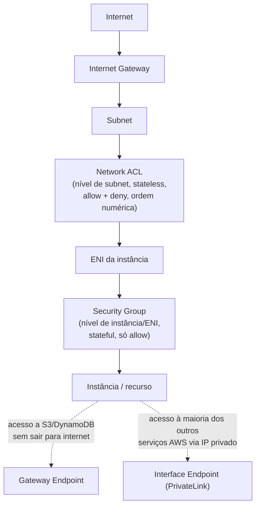
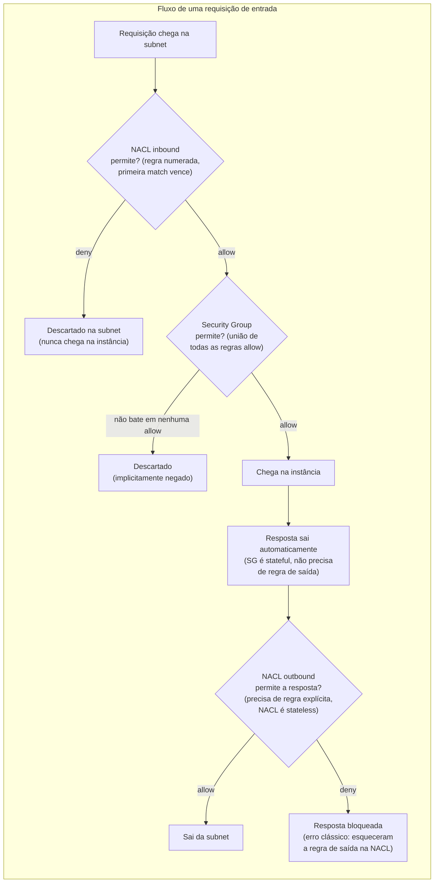
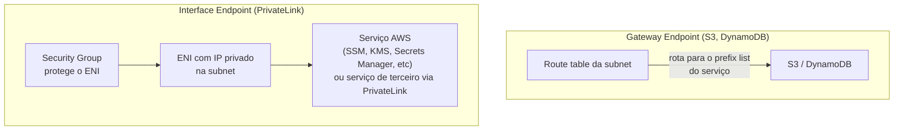
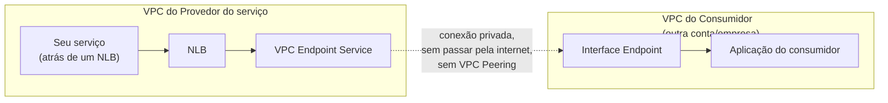
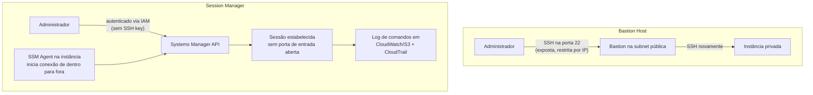
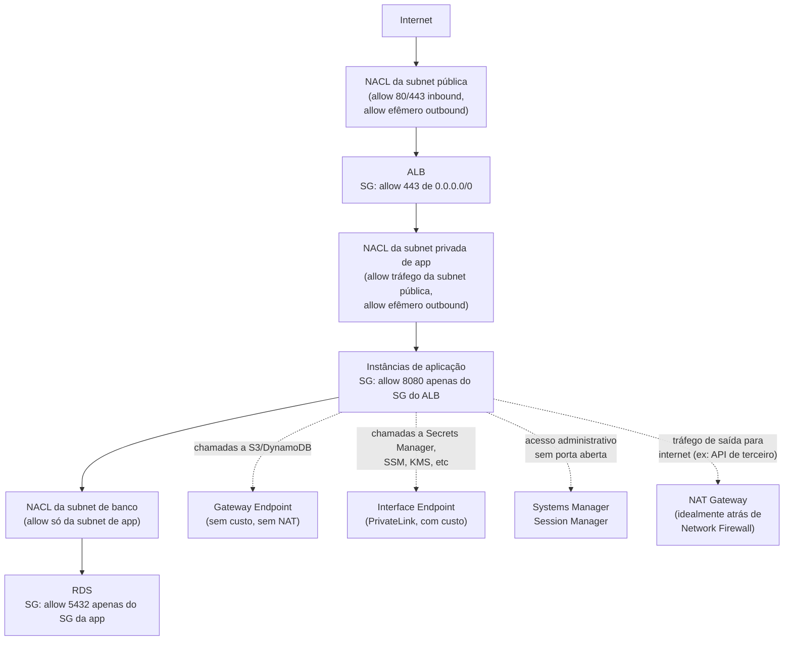
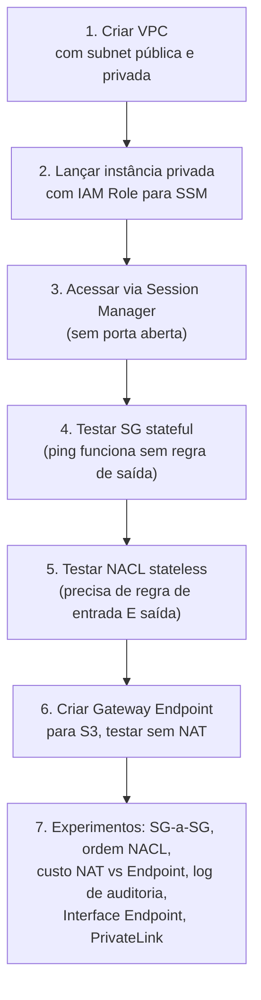

# Segurança de Rede na VPC — Security Groups, NACLs, Endpoints e Acesso Seguro — Guia Completo (Teoria + Prática + Dia a Dia)

## 0. O problema: onde cada camada de rede entra em jogo

Dentro de uma VPC, existem várias camadas de controle de tráfego, e a prova adora testar se você sabe **exatamente** em qual nível cada uma atua e como elas se combinam. A confusão mais comum é achar que Security Group e NACL são "a mesma coisa em lugares diferentes" — elas não são, têm comportamentos fundamentalmente diferentes (stateful vs stateless, allow-only vs allow+deny).

Além disso, expor recursos AWS (S3, DynamoDB, outros serviços) ou até administrar uma instância EC2 sem passar pela internet pública é um requisito comum de segurança/compliance — é aí que entram VPC Endpoints, PrivateLink e Session Manager.


*Ordem de avaliação do tráfego chegando a uma instância: primeiro a NACL da subnet, depois o Security Group da instância — e os Endpoints como caminho alternativo que nem passa pela internet.*

---

## 1. Security Groups vs Network ACLs

### Security Groups (SG)

- Atuam no nível de **instância/ENI** (Elastic Network Interface) — cada instância pode ter um ou mais SGs associados.
- **Stateful:** se o tráfego de entrada é permitido, o tráfego de resposta correspondente é automaticamente permitido de volta, sem precisar de uma regra explícita de saída. Isso é o comportamento que a maioria das pessoas espera intuitivamente de um firewall.
- **Só permite (allow), nunca nega explicitamente.** Tudo que não está numa regra de allow é implicitamente negado. Não existe "regra de deny" num Security Group.
- Você pode referenciar **outro Security Group como origem/destino** de uma regra (em vez de um CIDR) — isso é extremamente usado no dia a dia: "o SG da aplicação só aceita tráfego vindo do SG do ALB", por exemplo, o que continua funcionando mesmo que os IPs das instâncias mudem (ex: Auto Scaling trocando instâncias).
- Todas as regras (de todos os SGs associados a uma ENI) são avaliadas **em conjunto** — não existe ordem de prioridade entre regras dentro de um SG, todas são "somadas" (união das permissões).

### Network ACLs (NACL)

- Atuam no nível de **subnet** — toda instância dentro daquela subnet está sujeita à mesma NACL, automaticamente, sem precisar associar nada por instância.
- **Stateless:** tráfego de entrada permitido **não** implica tráfego de saída permitido automaticamente — você precisa de uma regra explícita tanto de entrada (inbound) quanto de saída (outbound) para o mesmo fluxo. Isso é a causa nº1 de "configurei a NACL e a conexão simplesmente não funciona, mesmo com a regra de entrada certa" — geralmente falta a regra de saída correspondente (ou vice-versa), incluindo a porta efêmera de resposta.
- **Permite allow E deny explícitos.** Você pode ter uma regra dizendo "bloqueie esse IP especificamente" — algo impossível de fazer com Security Group sozinho.
- Regras são numeradas e **avaliadas em ordem crescente** — a primeira regra que der match (allow ou deny) é aplicada, e a avaliação para aí. Por padrão, a NACL default de uma VPC tem uma regra `*` (wildcard, número mais alto) que nega tudo que não bateu em nenhuma regra anterior.
- Cada VPC vem com uma **NACL default** que permite todo tráfego de entrada e saída — se você não customizar nada, ela funciona de forma "transparente" (parece que não existe).

### Tabela comparativa completa

| Característica | Security Group | Network ACL |
|---|---|---|
| Nível de atuação | Instância/ENI | Subnet |
| Stateful ou stateless | Stateful (resposta é automática) | Stateless (precisa regra de ida e volta) |
| Tipos de regra | Só **Allow** | **Allow** e **Deny** |
| Ordem de avaliação | Todas as regras avaliadas juntas (sem ordem/prioridade) | Avaliadas **em ordem numérica**, para na primeira que der match |
| Aplica-se a | Só às instâncias explicitamente associadas | Automaticamente a **todas** as instâncias da subnet |
| Pode referenciar outro SG como origem? | ✅ sim | ❌ não — só CIDR |
| Uso típico no dia a dia | Controle fino por aplicação/camada (web, app, DB) | Camada extra de proteção no nível de subnet, ex: bloquear um IP malicioso especificamente, ou isolar sub-redes públicas de privadas |


*O caminho completo: NACL filtra na entrada e na saída da subnet (stateless, precisa de regra nos dois sentidos); Security Group filtra na instância, mas só precisa de regra de entrada porque é stateful.*

**Pegadinha clássica de prova:** "por que minha instância não responde, mesmo com a porta liberada no SG?" — se a resposta menciona que a regra de entrada está certa mas ainda assim falha, a causa quase sempre é a NACL faltando a regra de **saída** (outbound) para a porta efêmera de resposta (tipicamente range `1024-65535`), porque NACL é stateless e SG sozinho não resolve isso.

**No dia a dia:** a grande maioria dos times usa só Security Groups no cotidiano (é mais simples de raciocinar) e deixa a NACL default (permite tudo) como está. NACL customizada entra em cena principalmente quando você precisa de uma camada extra de "cinto de segurança" no nível de subnet — por exemplo, bloquear explicitamente um IP identificado num ataque, sem precisar mexer em Security Group nenhum (que exigiria tocar em cada instância/grupo afetado).

---

## 2. VPC Endpoints — acessando serviços AWS sem passar pela internet

### O problema que resolve

Por padrão, se uma instância numa subnet privada (sem rota para Internet Gateway) precisa chamar a API do S3 ou do DynamoDB, ela não consegue — porque essas APIs são endpoints públicos na internet. A solução ingênua seria colocar um NAT Gateway para dar saída à internet, mas isso significa que o tráfego para um serviço AWS (que já está "dentro" da rede da AWS) sai desnecessariamente para a internet pública, com custo de NAT Gateway e uma superfície de exposição maior do que o necessário.

**VPC Endpoints** resolvem isso: eles criam um caminho **privado**, dentro da rede da AWS, entre sua VPC e o serviço, sem passar por internet, sem precisar de Internet Gateway, NAT Gateway, VPN ou Direct Connect.

### Gateway Endpoints

- Suportam apenas **dois serviços: S3 e DynamoDB**.
- Funcionam adicionando uma **entrada na route table** da subnet, apontando o tráfego destinado àquele serviço através do endpoint, em vez de pela rota padrão.
- **Gratuitos** — não há cobrança por hora nem por dado transferido através do Gateway Endpoint.
- Não usam ENI — não têm um IP dentro da sua subnet, é puramente uma entrada de rota.
- Podem ter uma **Endpoint Policy** (política em formato IAM) controlando quais ações/recursos são permitidos através daquele endpoint especificamente (ex: só permitir acesso a um bucket S3 específico via aquele endpoint).

### Interface Endpoints (AWS PrivateLink)

- Suportam a **maioria dos outros serviços AWS** (EC2 API, SSM, Secrets Manager, KMS, CloudWatch Logs, SNS, SQS, e centenas de outros, incluindo serviços de terceiros publicados via PrivateLink).
- Funcionam criando uma ou mais **ENIs com IP privado dentro das suas subnets** — literalmente "projetam" o serviço para dentro da sua rede, e você acessa através desse IP privado (o DNS privado do serviço resolve automaticamente para esse IP quando o "private DNS" está habilitado no endpoint).
- **Cobrados por hora** (por AZ onde o endpoint existe) **+ por GB de dado processado**.
- Podem ter Security Group associado (porque têm ENI) — diferente do Gateway Endpoint.
- Também suportam Endpoint Policy.

### Tabela comparativa

| Característica | Gateway Endpoint | Interface Endpoint (PrivateLink) |
|---|---|---|
| Serviços suportados | Só S3 e DynamoDB | Maioria dos outros serviços AWS + serviços de terceiros/próprios via PrivateLink |
| Mecanismo | Entrada na route table | ENI com IP privado na subnet |
| Custo | Gratuito | Cobrado por hora + por GB processado |
| Precisa de Security Group | Não (não tem ENI) | Sim |
| Acessível on-premises (via VPN/Direct Connect) | Não | Sim, com configuração de DNS adequada |


*Gateway Endpoint é uma rota gratuita só para S3/DynamoDB; Interface Endpoint é um ENI pago que "projeta" praticamente qualquer outro serviço para dentro da VPC.*

**Pegadinha clássica de prova:** "preciso acessar o S3 de uma subnet totalmente privada, sem NAT Gateway, com o menor custo possível" → **Gateway Endpoint**, não Interface Endpoint (mesmo S3 também tendo suporte via Interface Endpoint em alguns cenários específicos — mas a resposta padrão de menor custo para S3/DynamoDB é sempre Gateway Endpoint).

---

## 3. AWS PrivateLink — expondo seu próprio serviço

Interface Endpoints são o mecanismo pelo qual você **consome** um serviço via PrivateLink. Mas PrivateLink também permite o inverso: você pode **expor seu próprio serviço** (rodando atrás de um NLB, por exemplo) para outras VPCs — da mesma conta, de outra conta, ou até de clientes externos — sem que o tráfego passe pela internet pública e sem precisar de VPC Peering, VPN ou Transit Gateway.

### Como funciona

1. Você roda seu serviço atrás de um **Network Load Balancer** na sua VPC.
2. Você cria um **VPC Endpoint Service** apontando para esse NLB.
3. Você compartilha o nome desse serviço (ou aprova solicitações de conexão) com quem deve ter acesso.
4. Do lado do consumidor, eles criam um **Interface Endpoint** apontando para o seu serviço — e passam a acessá-lo via IP privado dentro da própria VPC deles, como se fosse um serviço AWS nativo.

**Por que isso é poderoso no dia a dia:** é o mecanismo usado por SaaS B2B que precisam expor uma API para dentro da VPC de clientes corporativos sem que o tráfego trafegue pela internet pública — muito comum em setores regulados (financeiro, saúde), onde o cliente exige que nenhum dado saia da rede privada. Também é usado internamente em empresas grandes para expor um serviço compartilhado (ex: um serviço de autenticação central) para múltiplas VPCs/contas de times diferentes, sem abrir rota completa de rede entre elas (diferente do VPC Peering, que conecta as duas redes inteiras — PrivateLink expõe só o serviço específico, numa única direção).


*PrivateLink expõe apenas o serviço específico atrás do NLB para o consumidor — não conecta as duas redes inteiras como VPC Peering faria.*

**Diferença chave vs VPC Peering (pegadinha de prova):** VPC Peering conecta **duas redes inteiras**, permitindo que qualquer recurso de um lado alcance qualquer recurso do outro lado (sujeito a SG/NACL) — é uma relação de rede completa. PrivateLink expõe **um serviço específico**, unidirecionalmente (o consumidor acessa o serviço do provedor, nunca o contrário), sem expor a topologia de rede de nenhum dos dois lados um para o outro. Se a questão menciona "expor um serviço específico para múltiplos clientes sem revelar a topologia de rede" ou "sem risco de sobreposição de CIDR", a resposta é PrivateLink.

---

## 4. Acesso administrativo seguro: Bastion Host vs Session Manager

### O problema

Instâncias em subnets privadas não têm IP público — então como você faz SSH/RDP nelas para administração? A solução clássica é um **Bastion Host** (também chamado de jump box): uma instância na subnet pública, com SSH exposto (idealmente restrito por IP), que serve de "ponte" para você pular até as instâncias privadas.

### Bastion Host — a abordagem tradicional

- Instância dedicada, geralmente pequena, na subnet pública.
- Você faz SSH no bastion, e do bastion faz SSH de novo para a instância privada de destino.
- **Desvantagens reais:** é mais uma instância para manter, patchear e pagar; exige gerenciar chaves SSH (rotação, quem tem acesso a qual chave); a porta 22 (ou 3389) fica exposta, mesmo que restrita por IP, é uma superfície de ataque a mais; auditoria de quem acessou o quê exige configuração adicional (não vem de fábrica).

### AWS Systems Manager Session Manager — a abordagem moderna

- Não exige **nenhuma porta de entrada aberta** — nem 22, nem 3389, nem em Security Group nem em NACL. A conexão é iniciada **de dentro para fora**: o SSM Agent na instância se conecta ao serviço Systems Manager (via internet, VPN/Direct Connect, ou via Interface Endpoint do SSM para manter tudo privado), e o console/CLI do usuário se conecta a essa mesma sessão através da API do Systems Manager.
- **Não precisa de SSH key** — a autenticação e autorização são feitas via **IAM** (a pessoa precisa de uma policy permitindo `ssm:StartSession` no recurso). Isso elimina todo o problema operacional de gerenciar/rotacionar chaves SSH.
- **Log de auditoria nativo:** cada sessão pode ser configurada para logar todos os comandos digitados em CloudWatch Logs e/ou S3, e cada início/fim de sessão gera eventos rastreáveis via CloudTrail (quem, quando, em qual instância) — algo que um Bastion Host tradicional não oferece de fábrica.
- Requer que a instância tenha o **SSM Agent** instalado (já vem pré-instalado nas AMIs Amazon Linux e Ubuntu mais recentes da AWS) e uma **IAM Role** anexada com a policy `AmazonSSMManagedInstanceCore` (ou equivalente).
- Funciona tanto para instâncias com quanto sem acesso à internet, desde que exista conectividade até o endpoint do Systems Manager — em ambientes totalmente privados/air-gapped, isso é feito via **Interface Endpoints** do SSM (`ssm`, `ssmmessages`, `ec2messages`).

### Comparativo

| Característica | Bastion Host | Session Manager |
|---|---|---|
| Porta de entrada exposta | Sim (22/3389, mesmo que restrita) | **Nenhuma** |
| Gerenciamento de SSH key | Necessário | **Não necessário** — autenticação via IAM |
| Infraestrutura extra para manter | Sim (a instância bastion) | Não (é um serviço gerenciado) |
| Log de auditoria de comandos | Precisa configurar manualmente | Nativo, via CloudWatch Logs/S3 + CloudTrail |
| Funciona em subnet 100% privada, sem internet | Só com rota até o bastion | Sim, via Interface Endpoint do SSM |
| Custo | Custo de uma instância EC2 rodando 24/7 | Sem custo adicional pelo Session Manager em si (paga só a instância normal) |


*Bastion Host exige porta de entrada exposta e gestão de chaves; Session Manager elimina ambos, autenticando via IAM e logando tudo nativamente.*

**No dia a dia:** Session Manager é hoje a recomendação padrão da AWS e da maioria das empresas modernas — a única razão real para ainda usar Bastion Host é compatibilidade com ferramentas legadas que dependem especificamente de um túnel SSH tradicional, ou acesso a sistemas que não são EC2 (embora Session Manager também suporte port forwarding para outros destinos dentro da VPC, cobrindo boa parte desses casos também).

---

## 5. Implicações de segurança do NAT Gateway

O **NAT Gateway** permite que instâncias em subnets privadas iniciem conexões de **saída** para a internet (ex: baixar atualizações de pacotes, chamar uma API externa) sem terem IP público próprio e sem serem alcançáveis a partir da internet — a natureza de NAT (Network Address Translation) é unidirecional: conexões de fora para dentro não são permitidas, só o retorno de uma conexão iniciada de dentro.

**Pontos de segurança a ter em mente:**

- O NAT Gateway em si **não é um firewall** — ele não filtra por conteúdo nem aplica regras de segurança sofisticadas, só faz a tradução de endereço. Se uma instância privada está comprometida e tenta se comunicar com um servidor de comando e controle malicioso na internet, o NAT Gateway **permite** essa saída, a menos que Security Group/NACL/Network Firewall bloqueiem especificamente.
- Justamente por isso, ambientes com requisitos de segurança mais rígidos combinam NAT Gateway com **Network Firewall** (coberto no arquivo `07-WAF-Shield-Network-Firewall-ACM.md`) posicionado entre as subnets privadas e o NAT Gateway, para inspecionar e restringir o tráfego de saída por domínio/assinatura, já que Security Groups sozinhos não conseguem filtrar por domínio.
- Todo tráfego de saída de todas as instâncias de uma subnet privada passa pelo **mesmo IP público** do NAT Gateway — isso é útil para whitelisting em sistemas externos (o parceiro externo libera esse IP fixo na allowlist dele), mas também significa que, se você precisa que APIs de saída sejam atribuíveis a instâncias/times diferentes, o NAT Gateway sozinho não distingue isso (fica tudo com a mesma origem).
- NAT Gateway é **gerenciado pela AWS** (diferente do antigo NAT Instance, que era uma EC2 comum que você mesmo mantinha, patcheava e escalava) — isso reduz a superfície de ataque porque você não tem um SO próprio para manter atualizado nesse componente.

**No dia a dia:** para tráfego destinado a serviços AWS (S3, DynamoDB, e centenas de outros via PrivateLink), prefira sempre VPC Endpoints em vez de rotear pelo NAT Gateway — além de mais barato, reduz a superfície de tráfego saindo desnecessariamente para a internet pública.

---

## 6. Cenário prático — como as camadas se combinam numa arquitetura real

Um cenário típico de 3 camadas (web, aplicação, banco de dados), mostrando onde cada controle entra:


*Cada subnet tem sua NACL própria (stateless, camada extra), cada grupo de instâncias tem seu SG específico referenciando o SG anterior na cadeia (stateful, granular), e o tráfego para serviços AWS sai via Endpoints em vez de NAT sempre que possível — reduzindo custo e superfície de exposição à internet.*

**Racional da combinação, camada por camada:**
1. **NACL de cada subnet** — barreira ampla, "o que pode entrar/sair dessa subnet como um todo", útil para bloquear algo especificamente (ex: um IP malicioso) sem depender de reconfigurar dezenas de instâncias.
2. **Security Group de cada camada** — controle fino "quem especificamente pode falar com quem", usando referência de SG a SG em vez de IP, o que sobrevive a mudanças de IP por Auto Scaling.
3. **VPC Endpoints** — elimina a necessidade de tráfego para a internet pública quando o destino é um serviço AWS, reduzindo tanto custo quanto superfície de ataque.
4. **Session Manager** — acesso administrativo sem depender de porta aberta nem chave SSH espalhada.
5. **NAT Gateway** — só para o que realmente precisa sair para a internet pública (APIs de terceiros, por exemplo), idealmente com Network Firewall inspecionando esse tráfego.

---

# 🧪 Laboratório prático (para executar na AWS)

## Objetivo
Construir uma VPC com subnet pública e privada, demonstrar a diferença de comportamento entre SG e NACL, criar um Gateway Endpoint para S3, e acessar uma instância privada via Session Manager.

### Passo 1 — Criar a VPC e subnets
Console → VPC → **Create VPC** → "VPC and more"
- Nome: `lab-vpc`
- 1 subnet pública (`lab-public`), 1 subnet privada (`lab-private`)
- NAT Gateway: crie 1 (para comparação mais adiante)

### Passo 2 — Lançar uma instância na subnet privada
Console → EC2 → **Launch Instance**
- Nome: `lab-private-instance`
- Subnet: `lab-private` (sem IP público)
- IAM Role: crie/anexe uma role com a policy gerenciada `AmazonSSMManagedInstanceCore`
- Security Group: crie `sg-lab-private`, sem nenhuma regra de entrada por enquanto

### Passo 3 — Testar Session Manager (sem porta aberta)
Console → Systems Manager → **Session Manager** → **Start session** → selecione `lab-private-instance`

Confirme que você consegue abrir um shell na instância mesmo sem nenhuma regra de entrada no Security Group e sem IP público — porque a conexão foi iniciada de dentro para fora pelo SSM Agent.

### Passo 4 — Demonstrar Security Group (stateful)
No `sg-lab-private`, adicione uma regra de entrada permitindo ICMP (ping) apenas do seu IP. Tente pingar a instância (via outra instância na mesma VPC) e observe que a resposta volta automaticamente, sem regra de saída.

### Passo 5 — Demonstrar NACL (stateless)
Na NACL da subnet `lab-private`, adicione uma regra **allow** de entrada para ICMP, mas **não** adicione a regra de saída correspondente. Tente pingar novamente — mesmo com o Security Group permitindo, o ping falha porque a NACL está bloqueando a resposta de saída (stateless). Adicione a regra de saída e teste de novo.

### Passo 6 — Criar o Gateway Endpoint para S3
Console → VPC → **Endpoints** → **Create Endpoint**
- Service category: AWS services
- Service: `com.amazonaws.<região>.s3` (tipo Gateway)
- Route table: associe a route table da subnet privada
- Teste de dentro da instância (via Session Manager): `aws s3 ls` deve funcionar mesmo sem rota para o NAT Gateway/Internet Gateway, se você remover temporariamente a rota 0.0.0.0/0 da subnet.

### Passo 7 — Experimentos para fixar cada conceito
1. **SG referenciando SG:** crie um segundo Security Group para um "ALB fake" e configure `sg-lab-private` para só aceitar tráfego HTTP vindo desse outro SG (não de um CIDR) — confirme que funciona mesmo mudando o IP da instância de origem.
2. **Ordem de avaliação da NACL:** crie duas regras conflitantes na NACL (uma allow com número baixo, uma deny com número mais alto para o mesmo tráfego) e confirme que a de número mais baixo vence.
3. **Custo comparativo:** compare, no Cost Explorer (ou só conceitualmente), o custo de rotear tráfego para S3 via NAT Gateway (cobrado por GB processado) vs via Gateway Endpoint (gratuito).
4. **Log de auditoria do Session Manager:** habilite logging de sessão para um bucket S3 ou CloudWatch Logs, rode alguns comandos na sessão, e confira o log gerado depois — depois veja o evento correspondente no CloudTrail.
5. **Interface Endpoint:** crie um Interface Endpoint para o Secrets Manager, associe um Security Group liberando 443 apenas da subnet privada, e teste `aws secretsmanager list-secrets` de dentro da instância.
6. **PrivateLink (conceitual):** desenhe (sem precisar deployar) como você exporia um serviço interno da sua empresa para uma VPC de um parceiro externo via VPC Endpoint Service, sem usar VPC Peering.


*Sequência dos passos do laboratório prático.*

---

## Comandos AWS CLI úteis

```bash
# Criar um Security Group
aws ec2 create-security-group --group-name sg-lab-private --description "SG do lab" --vpc-id vpc-xxxxxxxx

# Autorizar entrada no SG referenciando outro SG (não um CIDR)
aws ec2 authorize-security-group-ingress \
  --group-id sg-xxxxxxxx \
  --protocol tcp --port 8080 \
  --source-group sg-yyyyyyyy

# Criar uma NACL customizada
aws ec2 create-network-acl --vpc-id vpc-xxxxxxxx

# Adicionar regra de entrada numa NACL (allow, número 100)
aws ec2 create-network-acl-entry \
  --network-acl-id acl-xxxxxxxx \
  --rule-number 100 --protocol tcp --port-range From=443,To=443 \
  --cidr-block 0.0.0.0/0 --rule-action allow --ingress

# Criar um Gateway Endpoint para S3
aws ec2 create-vpc-endpoint \
  --vpc-id vpc-xxxxxxxx \
  --service-name com.amazonaws.us-east-1.s3 \
  --route-table-ids rtb-xxxxxxxx \
  --vpc-endpoint-type Gateway

# Criar um Interface Endpoint (ex: Secrets Manager)
aws ec2 create-vpc-endpoint \
  --vpc-id vpc-xxxxxxxx \
  --service-name com.amazonaws.us-east-1.secretsmanager \
  --subnet-ids subnet-xxxxxxxx \
  --security-group-ids sg-xxxxxxxx \
  --vpc-endpoint-type Interface

# Iniciar uma sessão via Session Manager
aws ssm start-session --target i-0123456789abcdef0

# Ver histórico de sessões (auditoria)
aws ssm describe-sessions --state History
```

---

## Tabela de decisão rápida (prova + dia a dia)

| Cenário | Resposta provável |
|---|---|
| Bloquear um IP malicioso específico no nível de subnet | Network ACL (deny explícito) |
| Permitir que só o ALB fale com as instâncias de app, mesmo com IPs mudando | Security Group referenciando outro Security Group |
| Tráfego de entrada permitido mas resposta não sai | NACL sem regra de saída (stateless) — SG resolveria automaticamente (stateful) |
| Acessar S3/DynamoDB de subnet privada, sem custo, sem NAT | Gateway Endpoint |
| Acessar Secrets Manager/KMS/SSM de subnet privada | Interface Endpoint (PrivateLink) |
| Expor seu próprio serviço para VPC de outra conta, sem VPC Peering | AWS PrivateLink (VPC Endpoint Service) |
| Administrar instância privada sem abrir porta 22/3389 e sem gerenciar SSH key | Systems Manager Session Manager |
| Precisa de log de auditoria nativo de comandos administrativos | Session Manager (não Bastion Host) |
| Instância privada precisa baixar atualizações da internet | NAT Gateway |
| Filtrar tráfego de saída do NAT Gateway por domínio | Network Firewall na frente do NAT Gateway |
