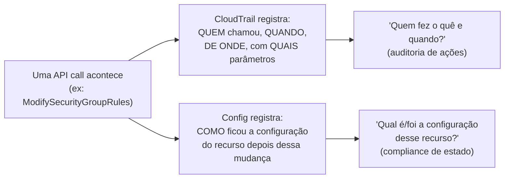
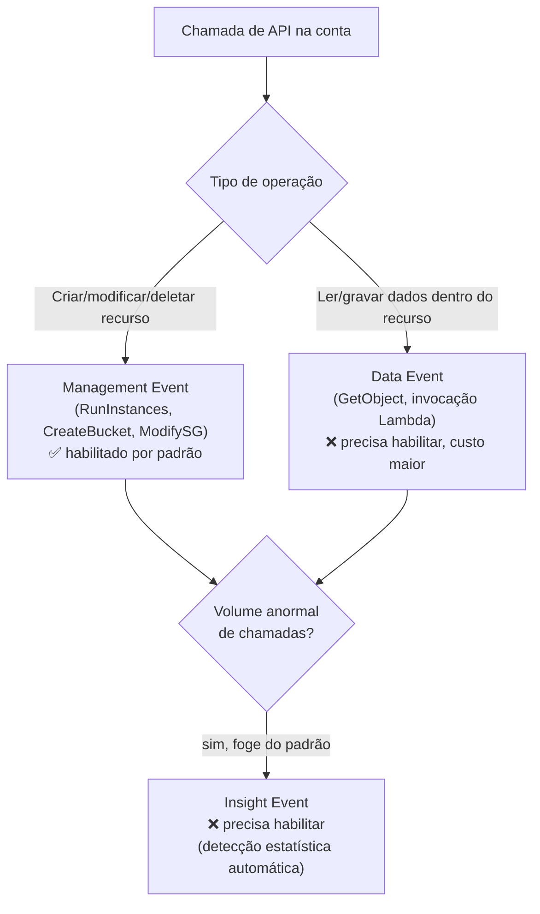
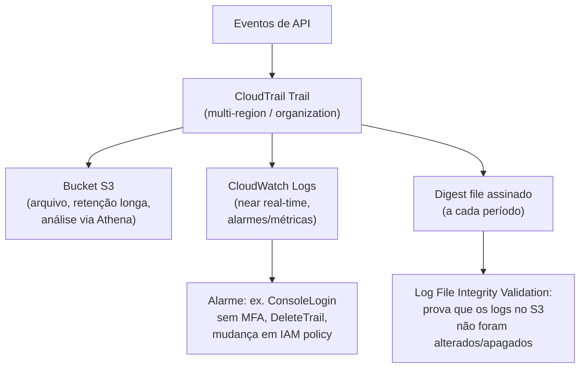
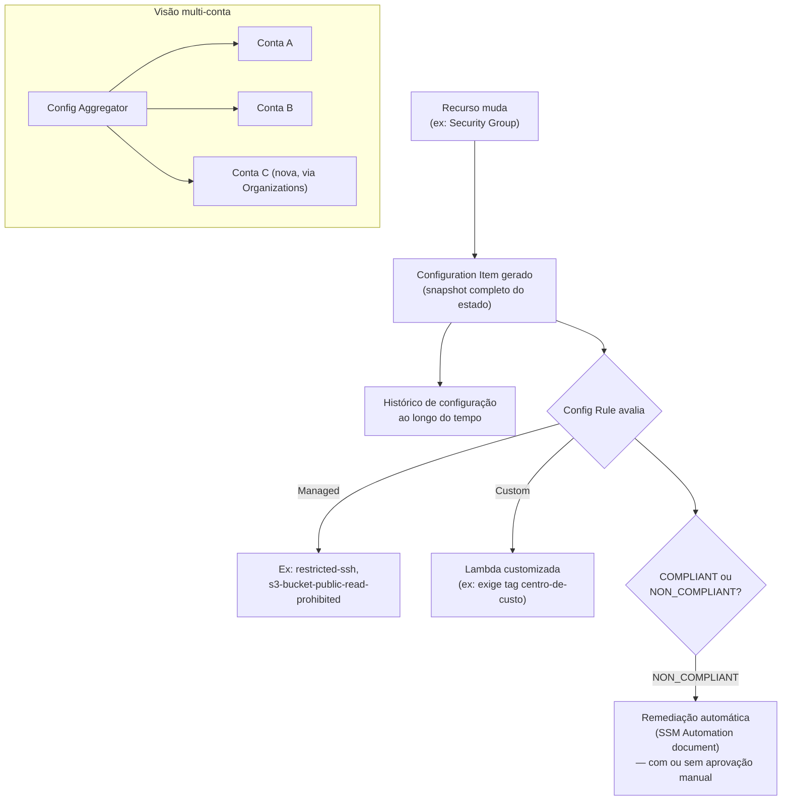
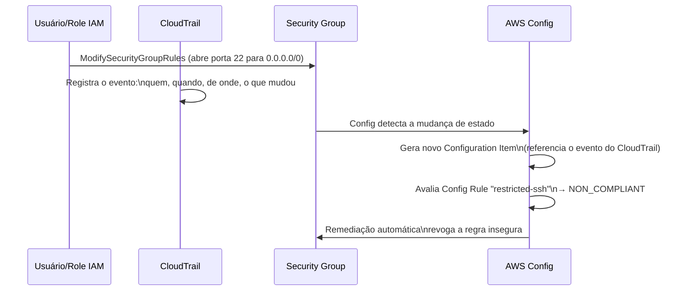
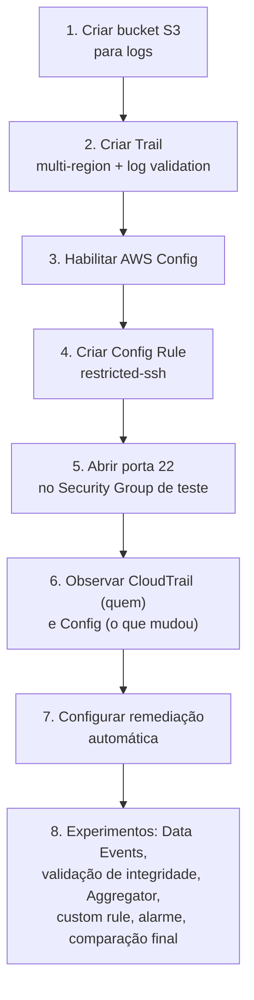

# CloudTrail e AWS Config — Guia Completo (Teoria + Prática + Dia a Dia)

## 0. O problema que cada um resolve — e por que a prova sempre compara os dois

Existem duas perguntas fundamentalmente diferentes que você precisa responder numa investigação de segurança ou auditoria:

1. **"Quem fez o quê, e quando?"** — alguém apagou um bucket S3 às 3h da manhã; quem foi, de qual IP, com qual credencial?
2. **"Qual era a configuração desse recurso num determinado momento, e como/quando ela mudou?"** — esse Security Group já teve a porta 22 aberta para `0.0.0.0/0` em algum momento? Quando isso mudou e voltou ao normal?

A primeira pergunta é sobre **ações (API calls)** — isso é **CloudTrail**. A segunda é sobre **estado de configuração ao longo do tempo** — isso é **AWS Config**. Essa distinção ("quem fez o quê" vs "qual é/foi a configuração") é a comparação mais cobrada da prova sobre esses dois serviços, e vale entender a fundo o porquê: CloudTrail é essencialmente um **log de eventos de API**, enquanto Config é um **sistema de snapshot e histórico de estado** — eles capturam dimensões diferentes do mesmo mundo, e frequentemente são usados juntos numa investigação real (CloudTrail te diz quem mudou o Security Group; Config te mostra exatamente qual era a configuração antes e depois dessa mudança).


*A mesma mudança gera dois tipos de registro completamente diferentes: CloudTrail foca na ação (o verbo), Config foca no resultado (o estado).*

---

## 1. AWS CloudTrail

### O que ele grava, no fundo

CloudTrail registra **toda chamada feita à API da AWS** dentro da sua conta — seja originada do Console (que por baixo dos panos também faz chamadas de API), da AWS CLI, de um SDK, ou de outro serviço AWS agindo em seu nome. Cada registro (chamado de **event**) inclui: quem fez a chamada (usuário/role IAM, ou serviço), de qual IP, em qual timestamp, qual API foi chamada, com quais parâmetros, e se a chamada teve sucesso ou foi negada.

### Management Events vs Data Events vs Insight Events

| Tipo de evento | O que cobre | Exemplo | Habilitado por padrão? |
|---|---|---|---|
| **Management Events** | Operações de controle/administração nos recursos da conta — criar, modificar, deletar, configurar | `RunInstances`, `CreateBucket`, `ModifySecurityGroupRules`, `DeleteUser` | ✅ Sim, todo trail novo já registra por padrão |
| **Data Events** | Operações no **conteúdo/dados** dentro dos recursos — geralmente de volume muito maior | `GetObject`/`PutObject` no S3, invocações de função Lambda, itens lidos/gravados no DynamoDB | ❌ Não — precisa ser habilitado explicitamente, recurso por recurso, por causa do volume e custo |
| **Insight Events** | Detecta **padrões anormais** de atividade de API na conta, usando análise estatística automática | Um pico incomum de chamadas `DeleteBucket`, ou volume de erros de API muito acima do normal | ❌ Não — precisa ser habilitado, e tem custo próprio |

**Por que Data Events não vêm ligados por padrão:** o volume de operações de dados (cada `GetObject` num bucket com milhões de requisições/dia) é ordens de magnitude maior que operações de gerenciamento, e isso tem impacto direto de custo — CloudTrail cobra por volume de eventos registrados a partir de um certo limite gratuito. No dia a dia, você liga Data Events seletivamente, geralmente só nos buckets/funções mais sensíveis (ex: um bucket com dados financeiros ou PII), não na conta inteira.

**Uso real do Insight Events:** detectar coisas como uma credencial vazada sendo usada para tentar deletar recursos em massa, ou um bug num pipeline de automação que começou a chamar uma API em loop — o Insight Events aprende o padrão normal da sua conta e alerta quando foge muito disso, sem você precisar escrever regra nenhuma manualmente.


*Management Events cobrem administração de recursos e vêm ligados; Data Events cobrem operações de conteúdo e precisam ser ligados manualmente; Insight Events detectam anomalias em cima dos outros dois.*

### Trail: single-region vs multi-region vs organization trail

- **Trail single-region:** registra eventos só da região onde foi criado. Raramente é a escolha certa hoje em dia, porque um atacante (ou um erro operacional) pode acontecer em qualquer região, inclusive numa que você nem usa ativamente.
- **Trail multi-region:** registra eventos de **todas as regiões** da conta automaticamente, incluindo regiões novas que a AWS lançar no futuro, sem precisar reconfigurar nada — essa é a recomendação padrão da AWS e a configuração default ao criar um trail pelo console hoje.
- **Organization trail:** um trail multi-region criado na **conta de management (ou numa conta delegada) de uma AWS Organizations**, que automaticamente aplica o mesmo trail em **todas as contas-membro** da organização. Isso garante que nenhuma conta fique sem CloudTrail habilitado (inclusive contas novas que entrarem na organização depois), e centraliza os logs.

**No dia a dia:** empresas com múltiplas contas AWS (praticamente todas as empresas de porte médio/grande, seguindo a prática de "uma conta por ambiente/time") usam Organization Trail para garantir governança consistente — sem depender de cada time lembrar de configurar CloudTrail na conta deles.

**Pegadinha clássica de prova:** "eventos de uma região que você não usa normalmente não aparecem no seu trail" — isso só é verdade num trail **single-region**. Um trail multi-region (ou organization trail) cobre isso automaticamente.

### Entrega para S3 e CloudWatch Logs

- CloudTrail entrega os eventos como arquivos de log (`.json.gz`) para um **bucket S3** — esse é o destino "de arquivo", retenção de longo prazo, análise posterior (ex: via Athena).
- Opcionalmente, CloudTrail também pode entregar os eventos em tempo quase real para um **CloudWatch Logs Log Group** — isso permite criar **alarmes em tempo real** baseados em métricas de filtro (ex: disparar um alarme quando aparecer um evento `DeleteTrail` ou `ConsoleLogin` sem MFA), algo que analisar arquivos no S3 não faz de forma prática/imediata.

**No dia a dia:** a combinação padrão é: S3 para retenção/auditoria histórica de longo prazo (barato, durável), CloudWatch Logs para alertas em near real-time nos eventos mais críticos (ex: mudanças em IAM, desabilitar o próprio CloudTrail, login sem MFA de usuário root).

### Log File Integrity Validation

CloudTrail pode gerar, periodicamente, um **arquivo de digest** assinado criptograficamente contendo hashes dos arquivos de log entregues no período. Isso permite provar, depois, que um arquivo de log **não foi alterado ou deletado** desde que foi entregue — importante em cenários de investigação forense/compliance, onde você precisa demonstrar que os logs apresentados são autênticos e não foram adulterados (por exemplo, por um atacante tentando cobrir rastros apagando ou editando entradas específicas do log).

**Detalhe técnico importante:** essa validação é **opcional** (precisa ser habilitada explicitamente no trail) e funciona através de uma cadeia de hashes — cada digest referencia o hash do digest anterior, então qualquer alteração em qualquer arquivo do meio da cadeia quebra a validação de tudo que vem depois, tornando adulteração detectável.


*Entrega dupla (S3 para arquivo, CloudWatch Logs para alarme em tempo real) e a cadeia de digests que garante integridade dos logs.*

---

## 2. AWS Config

### O que ele faz, no fundo

Config monitora continuamente os recursos da sua conta e mantém um **histórico de como a configuração de cada recurso mudou ao longo do tempo** — não é log de ação (isso é CloudTrail), é **snapshot de estado**.

### Configuration Items (CI)

Cada vez que um recurso monitorado muda (ou periodicamente, mesmo sem mudança), o Config gera um **Configuration Item** — um registro em JSON descrevendo o estado completo daquele recurso naquele momento: seus atributos, relações com outros recursos (ex: "essa instância EC2 está associada a esse Security Group e essa VPC"), e opcionalmente o evento do CloudTrail que causou a mudança (é aqui que os dois serviços se conectam na prática).

Isso permite responder perguntas como "como estava configurado esse Security Group há 3 meses?" ou "quando exatamente essa porta foi aberta, e para qual configuração ela mudou?" — reconstruindo uma linha do tempo completa do recurso.

### Config Rules — managed vs custom

Uma **Config Rule** avalia continuamente se um recurso está em conformidade com uma condição desejada, e marca o recurso como `COMPLIANT` ou `NON_COMPLIANT`.

| Tipo | Como funciona |
|---|---|
| **Managed Rules** | Regras prontas, mantidas pela AWS, cobrindo padrões comuns (ex: `s3-bucket-public-read-prohibited`, `restricted-ssh`, `encrypted-volumes`) — você só ativa e configura os parâmetros |
| **Custom Rules** | Você escreve a lógica própria, tipicamente numa função **Lambda**, para avaliar condições específicas do seu negócio que nenhuma managed rule cobre (ex: "toda instância EC2 tem que ter a tag `centro-de-custo` preenchida") |

**No dia a dia:** a maioria dos casos comuns de compliance (buckets públicos, portas abertas, criptografia desabilitada, MFA não habilitado no root) já tem managed rule pronta — custom rule entra quando a regra é específica do negócio/organização (convenções de tagging, políticas internas que não são padrão de mercado).

### Remediação automática

Config Rules podem ser associadas a uma **ação de remediação automática** — tipicamente um documento do **Systems Manager Automation** — que corrige o recurso não-conforme sozinho, sem intervenção manual. Exemplo clássico: uma regra detecta um Security Group com a porta 22 aberta para `0.0.0.0/0`, e a remediação automática revoga essa regra de entrada automaticamente.

**Detalhe importante:** você pode configurar a remediação para disparar automaticamente assim que o recurso é marcado `NON_COMPLIANT`, ou exigir aprovação manual antes de executar — a segunda opção é mais comum em ambientes de produção críticos, onde uma remediação automática mal calibrada poderia causar um incidente (ex: revogar uma regra que na verdade era intencional e necessária).

### Aggregators — visão multi-conta

Um **Config Aggregator** centraliza dados de Configuration Items e compliance de Config Rules de **múltiplas contas e regiões** numa única conta, dando uma visão consolidada — "quantos recursos na organização inteira estão em não-conformidade com a regra X?" sem precisar entrar conta por conta.

Pode ser configurado manualmente (lista explícita de contas) ou automaticamente via integração com **AWS Organizations** (inclui automaticamente contas novas que entrarem na organização).

**No dia a dia:** essencial para times de segurança/compliance centralizados em empresas com múltiplas contas — é o equivalente, para o Config, do que o Organization Trail é para o CloudTrail e do que o Firewall Manager é para WAF/Shield/SG (ver `07-WAF-Shield-Network-Firewall-ACM.md`): um jeito de ter governança consistente sem depender de cada conta individual estar configurada corretamente.


*Config gera um Configuration Item a cada mudança, avalia contra regras (managed ou custom), pode remediar automaticamente, e o Aggregator consolida tudo isso entre múltiplas contas.*

---

## 3. CloudTrail vs Config — comparando lado a lado

| Característica | CloudTrail | AWS Config |
|---|---|---|
| Pergunta que responde | "Quem fez o quê e quando?" | "Qual é/foi a configuração de um recurso?" |
| Unidade de registro | Evento de API (ação) | Configuration Item (snapshot de estado) |
| Granularidade temporal | Um evento por chamada de API | Um CI a cada mudança detectada (+ snapshots periódicos) |
| Serve para | Auditoria de ações, forense de segurança, "quem apagou isso" | Compliance de estado, "isso está configurado corretamente", drift detection |
| Tem conceito de regra/compliance? | Não nativamente (você constrói alarmes em cima dos eventos) | Sim — Config Rules nativas, com `COMPLIANT`/`NON_COMPLIANT` |
| Tem remediação automática nativa? | Não | Sim, via SSM Automation |
| Cobre chamadas negadas (tentativas falhas)? | Sim — inclusive chamadas que falharam por falta de permissão | Não é o foco — Config só registra o estado resultante de mudanças bem-sucedidas |
| Granularidade de dados dentro de recursos (ex: leitura de um objeto S3) | Sim, via Data Events | Não — Config trabalha em nível de configuração do recurso, não de conteúdo/dados |

**Pegadinha clássica de prova:** uma questão descreve "preciso saber se esse Security Group já teve uma porta insegura aberta no passado, mesmo que agora esteja corrigido" — isso é **AWS Config** (histórico de configuração), não CloudTrail. Já uma questão do tipo "preciso descobrir qual usuário IAM foi responsável por abrir essa porta" é **CloudTrail** (quem fez a ação). Frequentemente a resposta certa da vida real é **os dois juntos**: Config aponta que a configuração mudou e quando, CloudTrail (referenciado no próprio Configuration Item) aponta quem foi.


*Numa investigação real, CloudTrail identifica quem fez a mudança e Config mostra o antes/depois do estado — e pode até corrigir automaticamente.*

---

## 4. Conectando aos 4 domínios da prova

- **Segurança:** ambos são pilares centrais de auditoria e compliance — praticamente toda arquitetura "bem desenhada" na prova assume CloudTrail e Config habilitados, especialmente em cenários envolvendo múltiplas contas (Organization Trail + Config Aggregator).
- **Resiliência:** Config Rules com remediação automática ajudam a manter o ambiente num estado conhecido e consistente mesmo com mudanças frequentes — reduz "configuration drift" que poderia causar falhas inesperadas.
- **Performance:** indiretamente — Data Events do CloudTrail e a frequência de avaliação do Config têm custo/overhead que você deve dimensionar conscientemente, sem monitorar tudo indiscriminadamente.
- **Custo:** ambos cobram por volume (CloudTrail por eventos registrados além do free tier de management events; Config por Configuration Item registrado e por Config Rule avaliada) — habilitar Data Events na conta inteira ou monitorar recursos desnecessários com Config pode gerar custo significativo sem necessidade real.

---

# 🧪 Laboratório prático (para executar na AWS)

## Objetivo
Criar um trail multi-region com validação de integridade, e uma Config Rule com remediação automática, observando como os dois se complementam numa mudança real.

### Passo 1 — Criar um bucket S3 para os logs
Console → S3 → **Create bucket** → nome `lab-cloudtrail-logs-<sufixo-unico>`

### Passo 2 — Criar o Trail
Console → CloudTrail → **Create trail**
- Nome: `lab-trail`
- Marque **multi-region trail**
- Bucket S3: o criado no Passo 1
- Habilite **Log file validation**
- Habilite entrega para **CloudWatch Logs** também (crie um novo Log Group)

### Passo 3 — Habilitar o AWS Config
Console → Config → **Get started**
- Grave todos os recursos suportados na região
- Bucket de entrega: pode ser o mesmo do Passo 1 ou outro dedicado

### Passo 4 — Criar uma Config Rule gerenciada
Console → Config → **Rules** → **Add rule**
- Escolha a managed rule `restricted-ssh` (verifica se algum Security Group libera a porta 22 para `0.0.0.0/0`)

### Passo 5 — Gerar o evento de teste
Crie um Security Group de teste e adicione uma regra de entrada liberando a porta 22 para `0.0.0.0/0`.

### Passo 6 — Observar os dois lados
- Em **CloudTrail → Event history**, procure o evento `AuthorizeSecurityGroupIngress` e veja quem/quando/de onde.
- Em **Config → Rules → restricted-ssh**, veja o Security Group marcado como `NON_COMPLIANT`, e no **Resource timeline** do Security Group, veja o histórico de Configuration Items, incluindo a referência ao evento do CloudTrail.

### Passo 7 — Configurar remediação automática
Na regra `restricted-ssh`, adicione uma ação de remediação usando o documento gerenciado `AWS-DisablePublicAccessForSecurityGroup` (ou similar), e observe a porta sendo fechada automaticamente na próxima avaliação.

### Passo 8 — Experimentos para fixar cada conceito
1. **Data Events:** habilite Data Events do CloudTrail só para o bucket criado no Passo 1, faça upload de um arquivo, e veja o evento `PutObject` aparecendo (algo que Management Events sozinho não capturaria).
2. **Integridade do log:** use o comando `aws cloudtrail validate-logs` para validar a cadeia de digests do trail e confirmar que nenhum arquivo foi alterado.
3. **Config Aggregator (conceitual, se você tiver mais de uma conta):** configure um aggregator puxando de uma segunda conta/região e veja a visão consolidada de compliance.
4. **Custom Config Rule:** escreva uma Lambda simples que marca como `NON_COMPLIANT` qualquer instância EC2 sem a tag `owner`, e registre como uma custom rule.
5. **Alarme em tempo real:** crie um metric filter no Log Group do CloudTrail (Passo 2) para o evento `ConsoleLogin` com `MFAUsed = No`, e um alarme no CloudWatch disparando notificação SNS.
6. **Diferença na prática:** apague a regra de porta 22 manualmente (desfazendo a remediação automática) e compare: o CloudTrail mostra sua ação de "revogar"; o Config volta a mostrar `COMPLIANT` com um novo Configuration Item — os dois serviços reagindo à mesma ação de ângulos diferentes.


*Sequência dos passos do laboratório prático.*

---

## Comandos AWS CLI úteis

```bash
# Criar um trail multi-region com validação de integridade
aws cloudtrail create-trail \
  --name lab-trail \
  --s3-bucket-name lab-cloudtrail-logs-xxxx \
  --is-multi-region-trail \
  --enable-log-file-validation

# Iniciar a gravação do trail
aws cloudtrail start-logging --name lab-trail

# Validar a integridade dos arquivos de log (log file integrity validation)
aws cloudtrail validate-logs --trail-arn arn:aws:cloudtrail:us-east-1:123456789012:trail/lab-trail --start-time 2026-08-01T00:00:00Z

# Buscar eventos recentes de um usuário específico
aws cloudtrail lookup-events \
  --lookup-attributes AttributeKey=Username,AttributeValue=meu-usuario \
  --max-results 20

# Habilitar o AWS Config (configuration recorder)
aws configservice put-configuration-recorder \
  --configuration-recorder name=default,roleARN=arn:aws:iam::123456789012:role/config-role \
  --recording-group allSupported=true,includeGlobalResourceTypes=true

# Criar uma Config Rule gerenciada
aws configservice put-config-rule \
  --config-rule '{"ConfigRuleName":"restricted-ssh","Source":{"Owner":"AWS","SourceIdentifier":"INCOMING_SSH_DISABLED"}}'

# Ver o histórico de configuração de um recurso específico
aws configservice get-resource-config-history \
  --resource-type AWS::EC2::SecurityGroup \
  --resource-id sg-xxxxxxxx

# Ver o status de compliance de uma regra
aws configservice describe-compliance-by-config-rule --config-rule-names restricted-ssh
```

---

## Tabela de decisão rápida (prova + dia a dia)

| Cenário | Resposta provável |
|---|---|
| Descobrir quem deletou um bucket S3 e quando | CloudTrail |
| Saber se um Security Group já teve configuração insegura no passado | AWS Config (histórico de Configuration Items) |
| Auditar leituras individuais de objetos num bucket sensível | CloudTrail com Data Events habilitado |
| Detectar automaticamente um pico anormal de chamadas de API | CloudTrail Insights |
| Corrigir automaticamente um recurso fora de compliance | AWS Config Rule + remediação (SSM Automation) |
| Provar que os logs de auditoria não foram adulterados | CloudTrail Log File Integrity Validation |
| Visão de compliance consolidada em dezenas de contas | AWS Config Aggregator (+ Organization Trail no CloudTrail) |
| Garantir que toda conta nova de uma Organization já nasça com auditoria ativa | Organization Trail (CloudTrail) |
| Regra de compliance específica do negócio (ex: tag obrigatória) | Config Custom Rule via Lambda |
| Alarme em tempo real para login sem MFA | CloudTrail entregando para CloudWatch Logs + metric filter/alarme |
