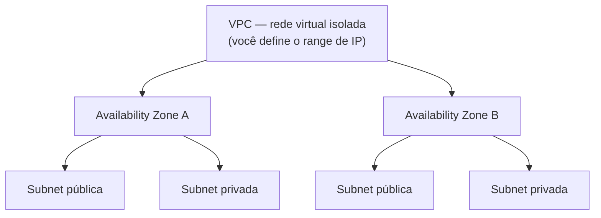
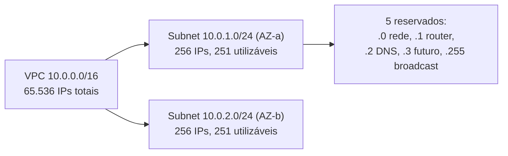
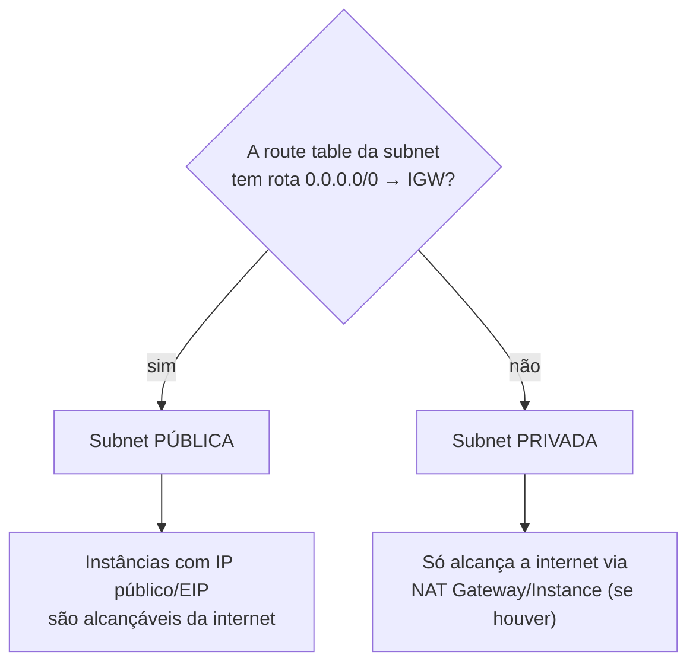
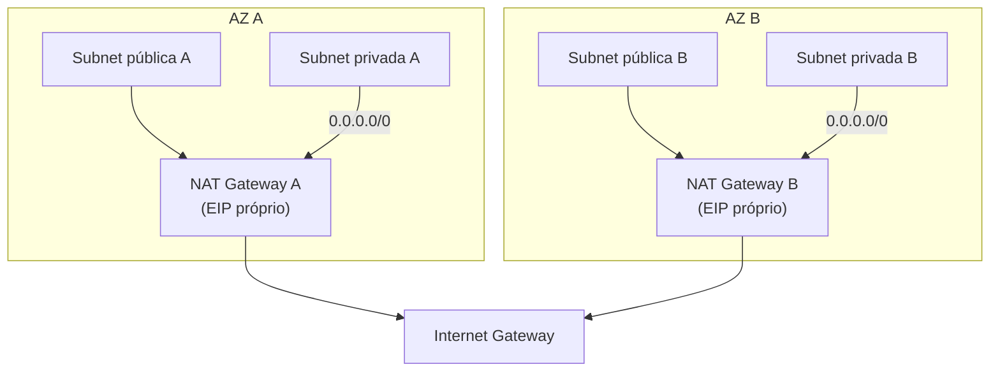
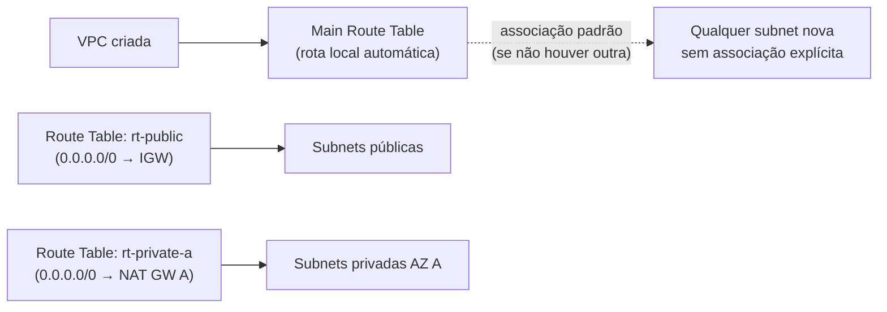
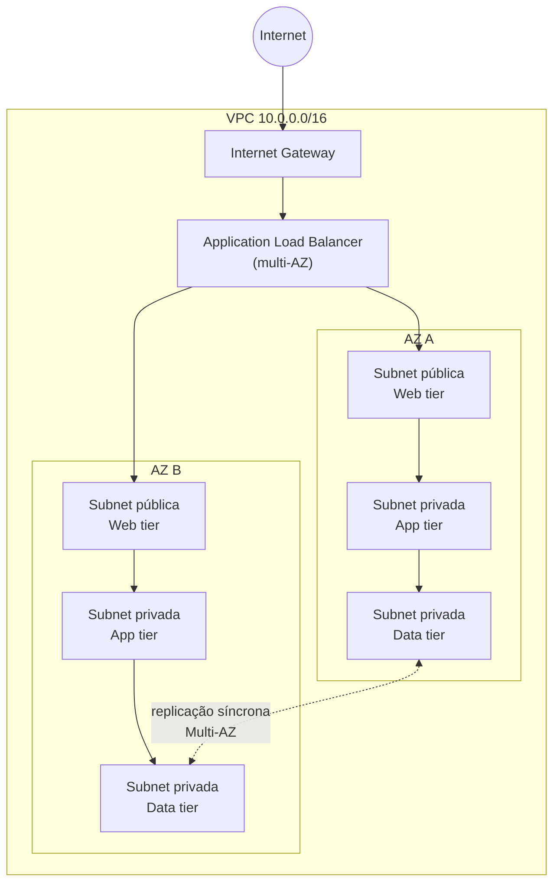
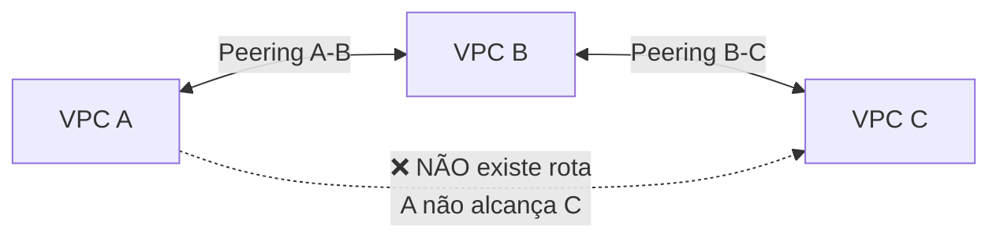
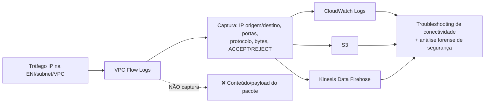
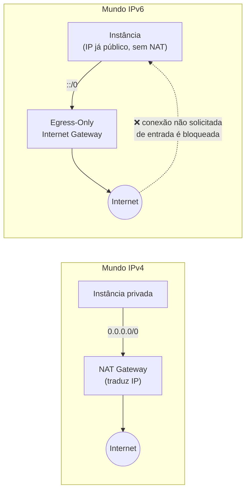
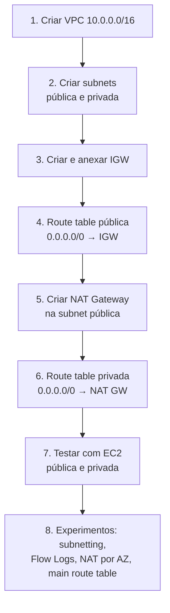

# VPC — Fundamentos e Design de Rede (Teoria + Prática + Dia a Dia)

## 0. O que é uma VPC e por que ela existe

Antes de existir a VPC, quando você lançava uma instância EC2 na "nuvem clássica" (EC2-Classic, hoje aposentado), ela caía num pool de rede compartilhado entre todos os clientes da AWS na região — você não tinha controle real sobre endereçamento IP, isolamento ou topologia de rede. Isso é péssimo para qualquer empresa que precise de segurança de rede previsível, compliance ou integração com uma rede corporativa on-premises.

A **VPC (Virtual Private Cloud)** resolve isso: é a sua própria rede virtual, logicamente isolada dentro da AWS, onde **você** decide o range de IPs, como ela é dividida em sub-redes, quais rotas existem, o que pode entrar e sair. Pense nela como o datacenter que você projetaria fisicamente — só que definido em software, provisionado em segundos, e elástico.

Toda a resiliência e segurança de uma arquitetura na AWS começa aqui: uma VPC bem desenhada (sub-redes públicas/privadas corretas, múltiplas AZs, rotas certas) é a base que sustenta alta disponibilidade, isolamento de camadas e defesa em profundidade. Uma VPC mal desenhada é a causa raiz de boa parte dos incidentes de segurança e indisponibilidade que aparecem tanto na prova quanto na vida real.


*Uma VPC é o "datacenter lógico"; ela é dividida em sub-redes, cada uma vivendo dentro de uma única AZ.*

---

## 1. CIDR Blocks e a matemática de subnetting

### O bloco CIDR da VPC

Ao criar uma VPC, você define um bloco CIDR (Classless Inter-Domain Routing) — por exemplo `10.0.0.0/16`. O número depois da barra indica quantos bits são fixos (a "rede") e quantos ficam livres para endereçar hosts.

- `/16` → 32 - 16 = 16 bits livres → 2^16 = 65.536 endereços IP no total na VPC.
- A AWS permite VPCs de `/16` (o maior, mais endereços) até `/28` (o menor).

**Por que `/16` é o padrão recomendado:** te dá margem enorme para crescer em sub-redes sem precisar redesenhar a rede depois. É comum começar um projeto achando que vai precisar de pouco IP e descobrir meses depois que faltou espaço — planejar o CIDR grande desde o início evita esse retrabalho.

### Subnetting — dividindo a VPC em sub-redes

Cada subnet também tem seu próprio CIDR, um subconjunto do CIDR da VPC, e **vive inteiramente dentro de uma única AZ** (isso é fixo, não dá para uma subnet cobrir duas AZs).

Exemplo prático: VPC `10.0.0.0/16`, dividida em subnets `/24`:
- `10.0.1.0/24` → 32 - 24 = 8 bits livres → 2^8 = 256 endereços.

**Os 5 endereços reservados em toda subnet AWS** (isso é uma pegadinha clássica de prova — a AWS reserva 5, não os 2 "tradicionais" de redes IP puras):

| Endereço | Uso |
|---|---|
| `10.0.1.0` | Endereço de rede (identifica a subnet, não atribuível) |
| `10.0.1.1` | Reservado para o **router** da VPC |
| `10.0.1.2` | Reservado para o **DNS** da AWS (Amazon-provided DNS, base + 2) |
| `10.0.1.3` | Reservado para uso futuro da AWS |
| `10.0.1.255` | Endereço de broadcast (não atribuível — mesmo VPC não suportando broadcast, a AWS reserva mesmo assim) |

Então numa subnet `/24` (256 endereços), você tem **256 - 5 = 251 IPs utilizáveis** de verdade.

**O que muita gente erra na prova:** calcular só "2 reservados" (rede + broadcast) como em redes on-premises tradicionais. Na AWS **sempre subtraia 5**, não 2. Isso muda a resposta em qualquer questão de "quantos hosts cabem nessa subnet".

Tabela rápida de referência (bits livres → total → utilizável):

| Máscara | Total de IPs | IPs utilizáveis (menos 5) |
|---|---|---|
| /28 | 16 | 11 |
| /27 | 32 | 27 |
| /26 | 64 | 59 |
| /25 | 128 | 123 |
| /24 | 256 | 251 |
| /23 | 512 | 507 |
| /20 | 4.096 | 4.091 |
| /16 | 65.536 | 65.531 |

**No dia a dia:** subnets muito pequenas (`/28`) são comuns para subnets dedicadas de propósito único (ex: subnet só para NAT Gateway, ou só para um endpoint de banco), onde você sabe que nunca vai precisar de muitos IPs ali. Subnets de aplicação/workload geralmente ficam em `/24` para cima, porque Auto Scaling Groups, ENIs de containers (ECS/EKS usam bastante IP por task/pod) e Lambdas em VPC consomem IP rápido.


*Cada subnet reserva sempre 5 endereços, independente do tamanho do bloco.*

---

## 2. Subnets públicas vs privadas — o que realmente define isso

Essa é outra pegadinha clássica: **não é o nome que você dá à subnet, nem "auto-assign public IP" sozinho**, que a torna pública. O que define uma subnet como **pública** é a existência de uma rota, na **route table associada a ela**, apontando `0.0.0.0/0` (todo o tráfego de saída) para um **Internet Gateway (IGW)**.

Se a route table da subnet não tem essa rota para um IGW, ela é **privada** — mesmo que você tenha nomeado ela de "public-subnet" no console.

**Detalhe técnico importante:** ter uma rota para o IGW não basta sozinho para uma instância ser alcançável da internet — ela também precisa ter um **IP público ou Elastic IP** atribuído, e o Security Group/NACL precisam permitir o tráfego. Mas a classificação "pública vs privada" da *subnet em si*, no contexto de exame, é sempre sobre a rota na route table.


*O que define pública vs privada é exclusivamente a rota na route table — não o nome, não o "auto-assign IP".*

---

## 3. Internet Gateway

O **Internet Gateway (IGW)** é o componente que conecta a VPC à internet. Ele é:
- **Horizontalmente escalável, redundante e altamente disponível** por padrão — a AWS gerencia isso, você não precisa pensar em capacidade ou failover dele.
- Um recurso **por VPC** (uma VPC só pode ter um IGW anexado por vez).
- Responsável por fazer o **NAT 1:1** entre o IP público/Elastic IP da instância e o IP privado dela — a instância nunca "sabe" seu IP público de fato, o IGW faz essa tradução.

**No dia a dia:** anexar um IGW à VPC não basta — você também precisa da rota na route table da subnet apontando pra ele (ver seção 2) e do Security Group liberando a porta certa.

---

## 4. NAT Gateway vs NAT Instance

Uma instância numa subnet **privada** não tem rota direta para o IGW — ela não recebe conexões de entrada da internet, o que é o objetivo (ex: um servidor de aplicação que só deve ser acessado via ALB, nunca diretamente). Mas frequentemente ela **precisa iniciar** conexões de saída para a internet — para baixar patches do SO, chamar uma API externa, etc. É esse problema que o NAT resolve: permite tráfego de **saída** iniciado pela instância privada, mas bloqueia conexões de **entrada** iniciadas de fora.

### NAT Gateway (gerenciado pela AWS)

- Serviço **totalmente gerenciado**: você não corrige patch, não escala capacidade manualmente, não cuida de alta disponibilidade dele mesmo.
- Vive numa **subnet pública** (ele precisa de rota para o IGW) e é usado pelas subnets **privadas** como próximo salto no `0.0.0.0/0`.
- Tem **um Elastic IP fixo** — útil quando um sistema terceiro (ex: um parceiro, um firewall corporativo) precisa fazer *IP whitelisting* do seu tráfego de saída.
- Suporta até **45 Gbps** de banda, escalando automaticamente conforme a demanda — você não provisiona capacidade.
- Cobrado por **hora de uso + por GB processado** — em ambientes com muito tráfego de saída, isso pesa na fatura (veja seção sobre custo mais abaixo).

### NAT Instance (legado, autogerenciado)

- É literalmente uma instância EC2 comum, rodando uma AMI configurada para fazer NAT (com IP forwarding habilitado e a verificação **source/destination check desabilitada** — detalhe técnico clássico de prova: por padrão toda ENI recusa tráfego que não seja origem/destino dela mesma, e uma NAT Instance precisa aceitar tráfego "de outros" para repassar).
- Você é responsável por: escolher o tamanho certo (dimensionar throughput manualmente), patch de segurança do SO, alta disponibilidade (script/Auto Scaling próprio para failover), e ela vira um **single point of failure** se você não desenhar isso com cuidado.
- **Pode** servir como bastion host ao mesmo tempo (multi-propósito) — algo que o NAT Gateway não permite, já que é um serviço gerenciado opaco.
- **Uso real hoje:** praticamente abandonado em arquiteturas novas. É citado sobretudo na prova como comparação, ou em cenários muito específicos de orçamento apertado com baixo tráfego, onde uma instância `t3.nano` fazendo NAT sai mais barato que o NAT Gateway.

### Tabela comparativa

| Característica | NAT Gateway | NAT Instance |
|---|---|---|
| Gerenciamento | Totalmente gerenciado pela AWS | Você gerencia (patch, SO, scaling) |
| Alta disponibilidade | Dentro da AZ, automática | Você precisa desenhar (Auto Scaling + script) |
| Throughput | Até 45 Gbps, escala automático | Limitado pelo tipo de instância escolhido |
| Elastic IP fixo | Sim | Sim (se você atribuir) |
| Pode ser bastion host junto | Não | Sim |
| Security Group | Não se aplica (não tem SG próprio) | Sim, você controla o SG |
| Source/Dest check | Não se aplica | Precisa ser **desabilitado** manualmente |
| Custo | Por hora + por GB processado | Custo da instância EC2 (pode ser mais barato em baixo tráfego) |
| Uso recomendado hoje | Praticamente sempre | Casos legados/nicho |

### Alta disponibilidade do NAT Gateway — o ponto que mais cai em prova

**O NAT Gateway é um recurso de zona (por AZ), não regional.** Se você cria um único NAT Gateway numa AZ e a subnet privada de outra AZ aponta a rota `0.0.0.0/0` para esse mesmo NAT Gateway, você criou uma **dependência cross-AZ** — se aquela AZ cair, todas as subnets privadas perdem acesso à internet, mesmo as que estão saudáveis em outras AZs. E ainda tem o efeito colateral de custo: tráfego cruzando AZ tem cobrança de transferência de dados.

**A prática recomendada (e a resposta esperada na prova) é: um NAT Gateway por AZ**, cada um na subnet pública daquela AZ, e cada subnet privada roteando para o NAT Gateway **da sua própria AZ**. Isso elimina o single point of failure e o tráfego cross-AZ desnecessário.


*Um NAT Gateway por AZ evita dependência cruzada entre zonas — se AZ A cair, a subnet privada B continua com saída via NAT Gateway B.*

---

## 5. Route Tables

Toda subnet **precisa estar associada a exatamente uma route table** por vez (mas uma route table pode ser associada a várias subnets). A route table decide, para cada destino de IP, qual é o "próximo salto" (target) — IGW, NAT Gateway, peering connection, Transit Gateway, VPC endpoint, etc.

### Main Route Table

Toda VPC nasce com uma **main route table** — é a que se aplica **por padrão** a qualquer subnet que você não associar explicitamente a outra route table. Ela vem com uma rota "local" (o tráfego dentro do próprio CIDR da VPC é sempre roteado automaticamente, essa rota `local` não pode ser removida).

**No dia a dia:** boa prática é **não deixar a main route table como a route table "de produção"** de nenhuma subnet crítica — em vez disso, você cria route tables explícitas (ex: `rt-public`, `rt-private-a`, `rt-private-b`) e associa cada subnet à route table certa deliberadamente. Isso evita o erro clássico de alguém criar uma subnet nova, esquecer de associar a route table certa, ela cair na main route table por padrão, e ter comportamento de rede inesperado (ex: uma subnet que deveria ser privada acabar tendo rota pra internet porque a main route table foi editada em algum momento por engano).


*A main route table é a associação "default" — o ideal é ter route tables explícitas por camada/AZ e nunca depender do comportamento default para produção.*

---

## 6. Design multi-AZ — a arquitetura clássica de 3 camadas

O padrão de referência para alta disponibilidade numa VPC é a arquitetura de **3 camadas (web / app / data)**, replicada em **pelo menos duas Availability Zones**. A lógica por trás:

- **Camada web** (ex: ALB + instâncias/containers servindo a interface): fica em subnets **públicas**, porque precisa ser alcançável da internet.
- **Camada de aplicação** (lógica de negócio, APIs internas): fica em subnets **privadas** — não precisa e não deve ser exposta diretamente à internet, só recebe tráfego vindo da camada web.
- **Camada de dados** (RDS, ElastiCache, etc): fica em subnets **privadas ainda mais isoladas**, geralmente com regras de Security Group restringindo a origem só à camada de aplicação. Muitas vezes nem tem rota de saída para internet nenhuma (nem via NAT), a menos que precise, por exemplo, para patches automáticos.

**Por que replicar em múltiplas AZs:** cada AZ é um datacenter fisicamente isolado (ou conjunto de datacenters) com energia, refrigeração e rede independentes. Se uma AZ inteira tiver um problema (o que acontece, ainda que raro), a aplicação continua rodando nas outras AZs. É o requisito mínimo de qualquer arquitetura "altamente disponível" cobrada na prova — **uma única AZ nunca é uma resposta correta para alta disponibilidade**, não importa quantas instâncias você coloque lá dentro.


*Arquitetura clássica de 3 camadas replicada em duas AZs: web pública, app e data privadas, banco de dados com replicação Multi-AZ.*

**No dia a dia:** essa é literalmente a arquitetura de referência que a AWS recomenda em quase todo whitepaper de Well-Architected Framework, e é o desenho padrão esperado em qualquer questão de prova que mencione "alta disponibilidade" ou "tolerância a falhas".

---

## 7. VPC Peering

O **VPC Peering** conecta duas VPCs (na mesma conta ou entre contas diferentes, na mesma região ou entre regiões) permitindo que elas se comuniquem usando IPs privados, como se estivessem na mesma rede. Requisitos importantes:
- Os CIDRs das duas VPCs **não podem se sobrepor**.
- Depois de criado o peering, você ainda precisa **adicionar rotas manualmente** nas route tables das duas VPCs apontando o CIDR uma da outra para a peering connection — o peering em si não cria rota automaticamente.

### Pegadinha clássica de prova: peering não é transitivo

Se a VPC A tem peering com a VPC B, e a VPC B tem peering com a VPC C, **a VPC A NÃO consegue alcançar a VPC C automaticamente** através de B. Cada peering é uma conexão ponto a ponto isolada — não existe "roteamento em cadeia" via peering.


*VPC Peering não é transitivo — mesmo com A-B e B-C conectados, A não alcança C sem um peering direto A-C.*

Se você precisar conectar **muitas** VPCs entre si (o clássico "mesh" onde N VPCs precisam de N×(N-1)/2 conexões de peering, o que fica insustentável rapidamente), a resposta certa não é criar dezenas de peerings — é usar o **Transit Gateway**, um hub central de roteamento que resolve exatamente esse problema de transitividade. Para profundidade completa sobre Transit Gateway (e também Direct Connect e VPN Site-to-Site, que também terminam se conectando à VPC via esses mesmos conceitos de rota), veja `Dominio3-Performance/12-Direct-Connect-VPN-Transit-Gateway.md`.

---

## 8. Elastic IP, ENI e VPC Flow Logs

### Elastic IP (EIP)

Um **Elastic IP** é um endereço IPv4 público, estático, que você aloca na sua conta e pode associar/desassociar de recursos (instância EC2, NAT Gateway, NLB) livremente. A diferença para um IP público comum (auto-assign): o IP público padrão **muda** se você parar e iniciar a instância; o Elastic IP **permanece o mesmo** até você explicitamente liberá-lo.

**No dia a dia:** usado quando um sistema externo precisa confiar num IP fixo (whitelist de firewall de parceiro, registro DNS que não pode mudar). **Detalhe de custo que pega gente desprevenida:** a AWS cobra por um Elastic IP **alocado mas não associado a nenhum recurso em uso** — a lógica é desencorajar reservar IPv4 (recurso escasso) sem usar.

### Elastic Network Interface (ENI)

Uma **ENI** é a interface de rede virtual em si — o componente que carrega o IP privado, o(s) IP(s) públicos/EIP associados, endereço MAC, Security Groups e pertence a uma subnet específica. Toda instância EC2 tem pelo menos uma ENI (a *primary network interface*), mas você pode anexar ENIs adicionais.

**Uso real:** ENIs "soltas" (não anexadas a uma instância específica) são usadas para cenários como *failover* — você move uma ENI de uma instância para outra rapidamente, preservando o IP privado, o que é mais rápido que reconfigurar rede na instância nova. Também é o mecanismo por trás de recursos gerenciados que "aparecem" dentro da sua VPC — um NAT Gateway, um Interface VPC Endpoint, um Lambda em VPC, todos se materializam como ENIs.

### VPC Flow Logs

Os **Flow Logs** capturam metadados sobre o tráfego IP que entra e sai das interfaces de rede da sua VPC — **não capturam o conteúdo/payload dos pacotes**, só metadados: IP de origem, IP de destino, portas, protocolo, número de pacotes/bytes, se foi aceito (`ACCEPT`) ou rejeitado (`REJECT`) pela regra de Security Group/NACL, e timestamps.

Podem ser habilitados em três níveis: **VPC inteira**, **subnet específica**, ou **ENI específica** — e o destino pode ser **CloudWatch Logs**, **S3** ou **Kinesis Data Firehose**.

**Uso real para troubleshooting:** o cenário clássico é "minha instância não consegue se conectar a tal serviço" — você habilita Flow Logs e procura por entradas `REJECT` correspondentes àquele tráfego, o que indica imediatamente se o bloqueio é de Security Group ou NACL (sem precisar adivinhar).

**Uso real para segurança:** análise forense pós-incidente (de onde veio um ataque, quais IPs internos se comunicaram com um IP malicioso conhecido), detecção de exfiltração de dados (volume anormal de tráfego de saída), e é uma fonte de dados comum para alimentar o GuardDuty e outras ferramentas de detecção.

**O que muita gente erra na prova:** achar que Flow Logs mostram o conteúdo da requisição (como um log de aplicação mostraria) — eles só mostram **que** o tráfego aconteceu e **se foi aceito/rejeitado**, nunca o payload.


*Flow Logs capturam metadados de tráfego (nunca o payload) e podem ser direcionados a três destinos diferentes.*

---

## 9. Egress-Only Internet Gateway (IPv6)

Com **IPv6**, todo endereço atribuído numa VPC já é, por design, **globalmente único e roteável publicamente** — não existe o conceito de "IP privado" com NAT no mundo IPv6 como existe em IPv4. Isso cria um problema diferente: como permitir que uma instância IPv6 **inicie** conexões de saída para a internet, mas **bloquear** conexões de entrada iniciadas de fora — exatamente o mesmo objetivo que o NAT Gateway resolve para IPv4, mas sem tradução de endereço (já que não há nada para traduzir).

A resposta é o **Egress-Only Internet Gateway (EIGW)**: um componente com propósito único, que só permite tráfego IPv6 de **saída** iniciado internamente, e as respostas correspondentes, mas bloqueia conexões de entrada não solicitadas. Conceitualmente é o "NAT Gateway do mundo IPv6", mesmo não fazendo NAT nenhum.

**Detalhe técnico:** é stateful (lembra da conexão que você iniciou, para permitir a resposta) e você configura via rota `::/0 → egress-only-igw-id` na route table das subnets que precisam desse comportamento — exatamente o mesmo padrão de "rota default para um gateway" que você já usa com IGW e NAT Gateway.


*O Egress-Only IGW cumpre para IPv6 o mesmo papel de "só saída" que o NAT Gateway cumpre para IPv4 — mas sem tradução de endereço, porque IPv6 não usa NAT.*

---

## 10. DNS na VPC — enableDnsSupport e enableDnsHostnames

Toda VPC tem dois atributos booleanos que controlam comportamento de DNS, e a diferença entre eles é uma fonte comum de confusão:

- **`enableDnsSupport`**: controla se o DNS resolver da AWS (o endereço `.2` reservado em cada subnet, mencionado na seção 1) responde a consultas DNS feitas dentro da VPC. Se desabilitado, recursos dentro da VPC não conseguem resolver nomes usando o resolver da AWS.
- **`enableDnsHostnames`**: controla se instâncias lançadas na VPC **recebem nomes de host DNS** correspondentes aos seus IPs (públicos e privados) — por exemplo, permite que uma instância com IP público tenha um hostname público resolvível (`ec2-x-x-x-x.compute-1.amazonaws.com`).

**Ambos precisam estar habilitados** (o padrão numa VPC criada pelo assistente/default é os dois `true`) para que funcionalidades que dependem de resolução de nome funcionem corretamente — por exemplo, para uma instância dentro de uma VPC customizada conseguir resolver o endpoint de um bucket S3 ou de um RDS por nome, ou para Interface VPC Endpoints funcionarem com resolução de DNS privado.

**No dia a dia:** se você criar uma VPC do zero manualmente (não pelo wizard), é fácil esquecer de habilitar esses dois atributos e depois passar tempo depurando "por que meu RDS endpoint não resolve" ou "por que o VPC Endpoint não está sendo usado automaticamente" — a causa raiz costuma ser um desses dois atributos desligado.

---

## 11. Default VPC vs VPC customizada

Toda conta AWS nova vem com uma **Default VPC** por região, já pré-configurada para facilitar o começo rápido:
- CIDR fixo `172.31.0.0/16`.
- Uma subnet pública **em cada AZ** da região, todas já com rota para um Internet Gateway já anexado.
- `enableDnsSupport` e `enableDnsHostnames` já habilitados.
- Instâncias lançadas nela recebem IP público automaticamente por padrão.

**Por que isso importa na prova e no trabalho:** a Default VPC é conveniente para testar algo rapidamente, mas **não é apropriada para produção** — todas as subnets são públicas por padrão, não há segmentação de camadas (web/app/data), e o CIDR é fixo, o que pode colidir com outros CIDRs que você venha a precisar conectar via peering ou VPN.

Uma **VPC customizada** é o que você projeta deliberadamente: CIDR escolhido para não colidir com sua rede corporativa ou outras VPCs, subnets públicas e privadas separadas por camada e por AZ, route tables explícitas, NAT Gateway(s) posicionados corretamente. É sempre a resposta esperada para qualquer cenário de prova envolvendo produção, segurança ou conectividade híbrida.

| Aspecto | Default VPC | VPC customizada |
|---|---|---|
| CIDR | Fixo `172.31.0.0/16` | Você escolhe |
| Subnets | Só públicas, uma por AZ | Você desenha (públicas/privadas por camada) |
| IP público automático | Sim, por padrão | Você decide por subnet |
| Adequada para produção | Não recomendado | Sim, é o padrão esperado |
| Pode ser recriada se deletada | Sim, via console/CLI | N/A (você cria do zero) |

---

# 🧪 Laboratório prático (para executar na AWS)

## Objetivo
Construir uma VPC customizada do zero, com subnet pública, subnet privada, Internet Gateway, NAT Gateway, e testar conectividade — a base de qualquer arquitetura multi-AZ.

### Passo 1 — Criar a VPC
Console → VPC → **Create VPC**
- Nome: `lab-vpc`
- CIDR IPv4: `10.0.0.0/16`

### Passo 2 — Criar as subnets
- `lab-subnet-public-a`: CIDR `10.0.1.0/24`, AZ `us-east-1a`
- `lab-subnet-private-a`: CIDR `10.0.2.0/24`, AZ `us-east-1a`

### Passo 3 — Internet Gateway
- **Create Internet Gateway** → nome `lab-igw` → **Attach to VPC** → `lab-vpc`

### Passo 4 — Route Table pública
- **Create Route Table** → nome `lab-rt-public`, VPC `lab-vpc`
- Adicione rota: `0.0.0.0/0` → target `lab-igw`
- **Associate subnet** → `lab-subnet-public-a`

### Passo 5 — NAT Gateway
- Aloque um Elastic IP
- **Create NAT Gateway** → subnet `lab-subnet-public-a` (precisa estar em subnet pública) → associe o EIP alocado

### Passo 6 — Route Table privada
- **Create Route Table** → nome `lab-rt-private`, VPC `lab-vpc`
- Adicione rota: `0.0.0.0/0` → target o NAT Gateway criado no passo 5
- **Associate subnet** → `lab-subnet-private-a`

### Passo 7 — Testar
- Lance uma instância EC2 na subnet pública com IP público automático habilitado, e outra na subnet privada (sem IP público).
- Conecte via **Session Manager** (não precisa de bastion/SSH exposto) na instância privada e teste `curl https://aws.amazon.com` — deve funcionar via NAT Gateway.
- Confirme que a instância privada **não é alcançável diretamente** de fora.

### Passo 8 — Experimentos para fixar cada conceito
1. **Matemática de subnet:** calcule manualmente quantos IPs utilizáveis existem em `10.0.1.0/24` e confira no console (Subnet → Details → "Available IPv4 addresses").
2. **O que define pública vs privada:** remova a rota `0.0.0.0/0 → IGW` da `lab-rt-public` temporariamente e observe a instância pública perder conectividade de entrada/saída — confirme que a subnet "vira" privada na prática, mesmo mantendo o nome.
3. **Falha de NAT por AZ:** crie uma segunda AZ (subnet privada B) apontando para o **mesmo** NAT Gateway da AZ A, e reflita sobre o que aconteceria se a AZ A caísse — depois corrija criando um segundo NAT Gateway dedicado à AZ B.
4. **VPC Flow Logs:** habilite Flow Logs na `lab-vpc` direcionando para CloudWatch Logs, gere tráfego, e localize entradas `ACCEPT`/`REJECT` correspondentes aos testes de conectividade.
5. **Main route table:** crie uma terceira subnet sem associar explicitamente nenhuma route table, e confirme no console que ela caiu automaticamente na main route table da VPC.
6. **Elastic IP ocioso:** aloque um Elastic IP e não associe a nada por alguns minutos — observe no Billing/Cost Explorer (ou na documentação de preço) que ele gera cobrança por estar ocioso.


*Sequência dos passos do laboratório prático.*

---

## Comandos AWS CLI úteis

```bash
# Criar a VPC
aws ec2 create-vpc --cidr-block 10.0.0.0/16 --tag-specifications 'ResourceType=vpc,Tags=[{Key=Name,Value=lab-vpc}]'

# Criar subnets
aws ec2 create-subnet --vpc-id vpc-xxxx --cidr-block 10.0.1.0/24 --availability-zone us-east-1a
aws ec2 create-subnet --vpc-id vpc-xxxx --cidr-block 10.0.2.0/24 --availability-zone us-east-1a

# Criar e anexar Internet Gateway
aws ec2 create-internet-gateway
aws ec2 attach-internet-gateway --internet-gateway-id igw-xxxx --vpc-id vpc-xxxx

# Criar route table e associar rota + subnet
aws ec2 create-route-table --vpc-id vpc-xxxx
aws ec2 create-route --route-table-id rtb-xxxx --destination-cidr-block 0.0.0.0/0 --gateway-id igw-xxxx
aws ec2 associate-route-table --route-table-id rtb-xxxx --subnet-id subnet-xxxx

# Alocar EIP e criar NAT Gateway
aws ec2 allocate-address --domain vpc
aws ec2 create-nat-gateway --subnet-id subnet-public-xxxx --allocation-id eipalloc-xxxx

# Habilitar VPC Flow Logs para CloudWatch Logs
aws ec2 create-flow-logs \
  --resource-type VPC --resource-ids vpc-xxxx \
  --traffic-type ALL \
  --log-destination-type cloud-watch-logs \
  --log-group-name /vpc/flow-logs \
  --deliver-logs-permission-arn arn:aws:iam::123456789012:role/flow-logs-role

# Verificar atributos de DNS da VPC
aws ec2 describe-vpc-attribute --vpc-id vpc-xxxx --attribute enableDnsSupport
aws ec2 describe-vpc-attribute --vpc-id vpc-xxxx --attribute enableDnsHostnames
```

---

## Tabela de decisão rápida (prova + dia a dia)

| Cenário | Resposta provável |
|---|---|
| Quantos IPs utilizáveis numa subnet `/24`? | 251 (256 - 5 reservados) |
| O que define se uma subnet é pública | Rota `0.0.0.0/0` para IGW na route table associada |
| Instâncias privadas precisam de saída à internet (patches, APIs) | NAT Gateway |
| Alta disponibilidade do NAT | Um NAT Gateway por AZ, cada subnet privada roteando para o da própria AZ |
| Menor custo, aceita gerenciar você mesmo | NAT Instance (raro em arquitetura nova) |
| Conectar dezenas de VPCs entre si | Transit Gateway (peering não é transitivo) |
| Saída de internet só para IPv6, sem NAT | Egress-Only Internet Gateway |
| Troubleshoot "SG ou NACL bloqueou minha conexão" | VPC Flow Logs, procurar REJECT |
| VPC endpoint/RDS não resolve por nome | Checar `enableDnsSupport`/`enableDnsHostnames` |
| Arquitetura de produção com alta disponibilidade | 3 camadas (web/app/data) replicadas em 2+ AZs |
| Ambiente rápido de teste, sem preocupação de produção | Default VPC |
