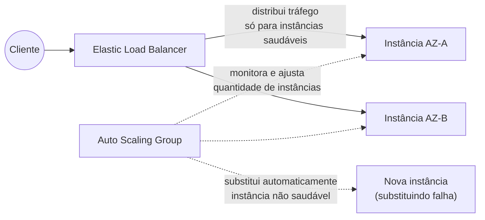
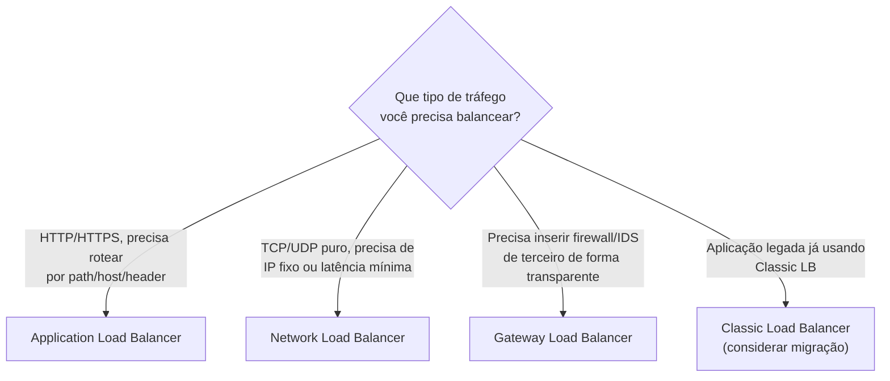
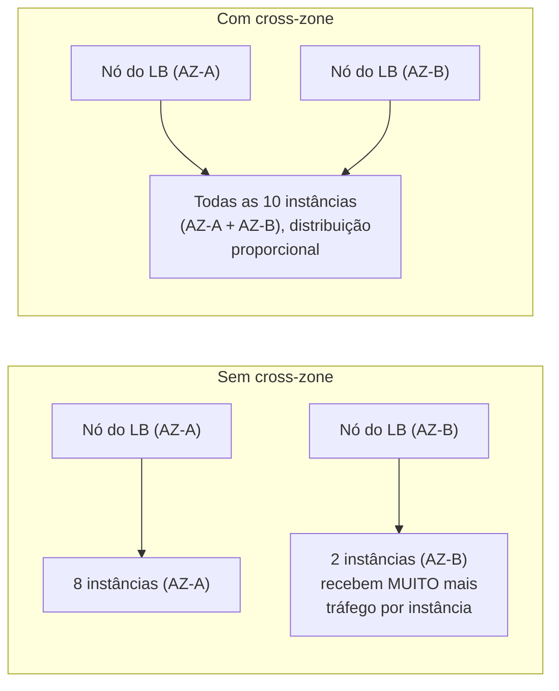
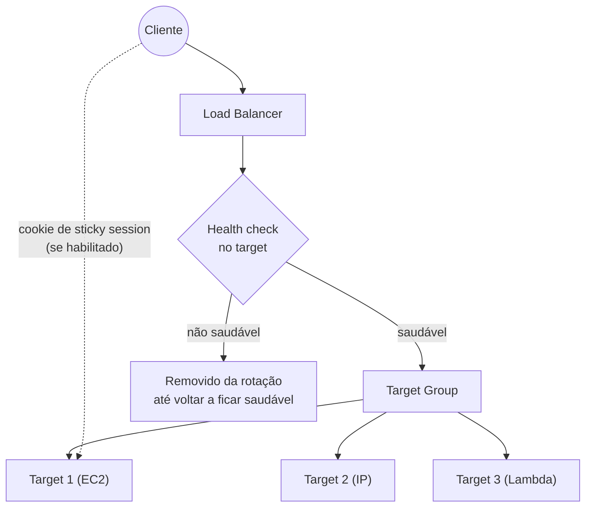
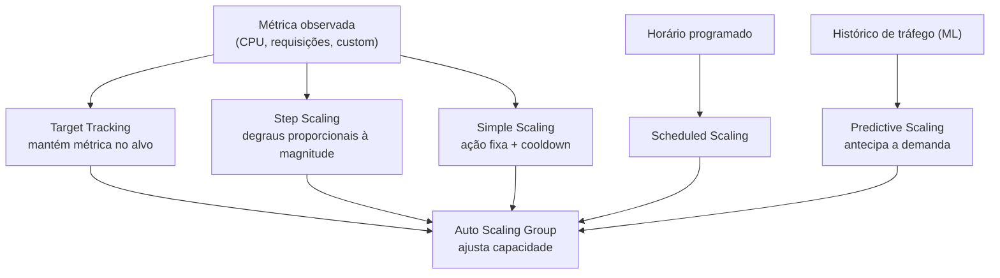
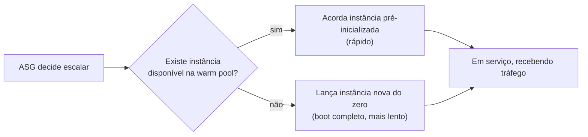
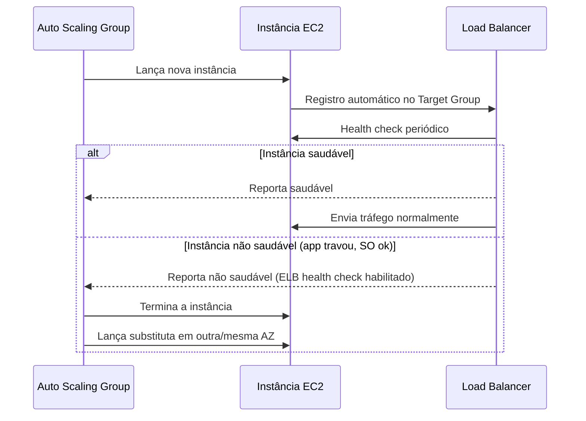
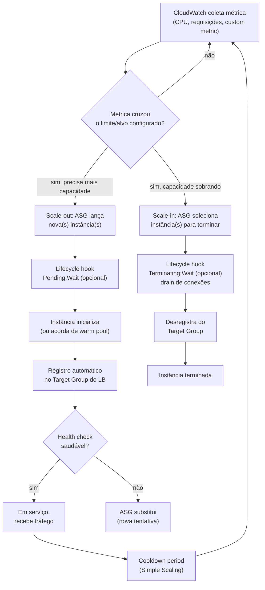
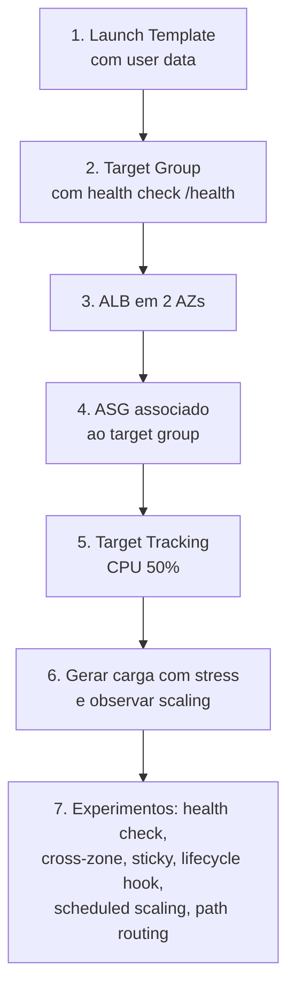

# Elastic Load Balancing e Auto Scaling — Guia Completo (Teoria + Prática + Dia a Dia)

## 0. O problema que esses dois serviços resolvem juntos

Imagine uma aplicação rodando numa única instância EC2. Dois problemas surgem cedo ou tarde: primeiro, se essa instância cair, a aplicação fica fora do ar — não existe redundância. Segundo, se o tráfego crescer além da capacidade dessa instância, ela satura e a aplicação fica lenta ou indisponível — não existe elasticidade.

O **Elastic Load Balancing (ELB)** resolve o primeiro problema distribuindo tráfego entre múltiplas instâncias saudáveis, em múltiplas AZs — se uma cair, o tráfego simplesmente para de ir para ela. O **Auto Scaling Group (ASG)** resolve o segundo, adicionando ou removendo instâncias automaticamente conforme a demanda muda.

Sozinhos, cada um resolve metade do problema. Juntos — que é como praticamente toda arquitetura real os usa — eles formam a dupla que sustenta a promessa central de "alta disponibilidade e elasticidade" que aparece o tempo todo na prova e no trabalho: o ELB nunca manda tráfego para uma instância não saudável, e o ASG garante que sempre existam instâncias saudáveis o suficiente para atender a demanda, substituindo automaticamente as que falharem.


*ELB distribui tráfego só para instâncias saudáveis; ASG garante que a quantidade certa de instâncias saudáveis exista.*

---

## 1. Tipos de Load Balancer

A AWS oferece quatro tipos de load balancer, cada um resolvendo um problema de camada de rede diferente. Escolher o tipo errado é uma fonte comum de pegadinha de prova — a pergunta quase sempre está testando se você sabe **em qual camada OSI** cada um opera e **por que** isso importa.

### Application Load Balancer (ALB) — camada 7

Opera na camada de **aplicação (HTTP/HTTPS)**. Como ele entende o conteúdo da requisição HTTP (não só pacotes IP/TCP), ele consegue tomar decisões de roteamento **baseadas em conteúdo**:

- **Path-based routing**: `/api/*` vai para um target group, `/imagens/*` vai para outro.
- **Host-based routing**: `loja.suaempresa.com` vai para um target group, `blog.suaempresa.com` vai para outro — mesmo ALB atendendo múltiplos domínios/aplicações.
- Também roteia por **header**, **query string** e **método HTTP**.
- Suporta **WebSocket** nativamente (upgrade de conexão HTTP para WebSocket, mantendo a conexão persistente através do balanceador) e **HTTP/2**.
- Termina TLS no próprio ALB (você anexa o certificado ACM nele), e pode fazer **redirect automático** de HTTP para HTTPS.

**Uso real:** é o load balancer padrão para praticamente qualquer aplicação web moderna — microsserviços atrás de um único ALB roteando por path, apps com múltiplos domínios, APIs REST.

### Network Load Balancer (NLB) — camada 4

Opera na camada de **transporte (TCP/UDP/TLS)**, sem entender nada do conteúdo HTTP. Isso o torna extremamente mais rápido e simples internamente, resultando em:

- **Altíssima performance e baixíssima latência** — projetado para lidar com milhões de requisições por segundo mantendo latência na casa de microssegundos.
- **IP estático por AZ** — diferente do ALB (que só tem DNS name, IP dinâmico), o NLB permite associar um **Elastic IP fixo por AZ**. Isso é essencial quando um sistema terceiro precisa fazer *whitelist* de IP.
- Preserva o **IP de origem do cliente** por padrão (o ALB também pode, via header `X-Forwarded-For`; o NLB preserva no próprio pacote).
- Suporta **TCP, UDP e TLS** — inclusive protocolos que não são HTTP (ex: um servidor de jogos usando UDP, um serviço de mensageria com protocolo TCP customizado).

**Uso real:** cenários que exigem latência extrema (trading, jogos), qualquer coisa que não seja HTTP (bancos de dados customizados, protocolos proprietários), e integração com o **VPC Link do API Gateway**, que historicamente exigia um NLB na frente do backend privado.

### Gateway Load Balancer (GWLB) — camada 3 (com inspeção transparente)

Resolve um problema bem específico: como inserir **appliances de rede de terceiros** (firewalls, sistemas de detecção de intrusão/IDS-IPS, ferramentas de inspeção de tráfego) **de forma transparente** no caminho do tráfego, sem que o cliente ou o backend percebam que existe um appliance no meio.

Funciona com o protocolo **GENEVE** (encapsulamento) na porta 6081: o GWLB recebe o tráfego, encaminha para um pool de instâncias de appliance de terceiros (ex: um firewall virtual de um parceiro como Palo Alto, Fortinet), que inspecionam e devolvem o tráfego, e o GWLB segue o encaminhamento até o destino final.

**Uso real:** empresas com requisito de compliance que exige que **todo** tráfego passe por um firewall de próxima geração antes de chegar à aplicação, sem reescrever a arquitetura de rede toda vez que o appliance escala.

### Classic Load Balancer (CLB) — legado

O balanceador original da AWS, hoje considerado **legado**. Operava tanto em camada 4 quanto 7 de forma limitada, mas sem os recursos avançados dos tipos modernos (sem path/host-based routing eficiente, sem suporte nativo a containers com múltiplas portas por instância, sem Network target type). A AWS recomenda migrar qualquer CLB restante para ALB ou NLB.

**Na prova:** aparece principalmente como "distrator" — a resposta errada que parece familiar mas é a opção desatualizada. Raramente é a resposta certa em cenários novos.

### Tabela comparativa

| Característica | ALB | NLB | Gateway LB | Classic LB |
|---|---|---|---|---|
| Camada OSI | 7 (aplicação) | 4 (transporte) | 3 (rede, com GENEVE) | 4 e 7 (limitado) |
| Protocolos | HTTP, HTTPS, WebSocket, HTTP/2 | TCP, UDP, TLS | IP (qualquer, via GENEVE) | HTTP, HTTPS, TCP |
| Roteamento por conteúdo (path/host) | Sim | Não | Não (não é o propósito) | Não |
| IP estático | Não (só DNS) | Sim, por AZ | Sim, por AZ | Não |
| Latência | Baixa | Ultra baixa | Baixa (appliance no meio soma) | Moderada |
| Caso de uso principal | Apps web/API modernas | Alta performance, não-HTTP, IP fixo | Appliances de terceiros (firewall/IDS) | Legado, evitar em novo design |
| Preserva IP de origem nativamente | Via header X-Forwarded-For | Sim, nativamente | N/A (repassa) | Limitado |


*Árvore de decisão entre os quatro tipos de Load Balancer, baseada na camada e no requisito principal.*

---

## 2. Cross-zone load balancing

Por padrão, cada nó do load balancer (um por AZ habilitada) distribui tráfego **apenas** entre as instâncias saudáveis da **sua própria AZ**, a menos que cross-zone esteja habilitado. Com **cross-zone load balancing** ligado, cada nó distribui igualmente entre **todas** as instâncias saudáveis, em **todas** as AZs habilitadas — não só a sua.

**Por que isso importa:** imagine 2 AZs, uma com 8 instâncias e outra com 2. Sem cross-zone, o DNS do LB manda ~50% do tráfego para cada AZ (assumindo distribuição de DNS uniforme entre os nós), então as 2 instâncias da AZ menor recebem proporcionalmente **muito mais tráfego por instância** que as 8 da outra AZ — desequilíbrio real de carga. Com cross-zone habilitado, o tráfego se distribui proporcionalmente entre as 10 instâncias no total, independente de AZ.

| Load Balancer | Cross-zone por padrão |
|---|---|
| ALB | Habilitado por padrão, sem custo extra |
| NLB | Desabilitado por padrão — habilitar pode gerar cobrança de transferência de dados entre AZs |
| Gateway LB | Configurável, mesmo princípio do NLB |

**No dia a dia:** mantenha o número de instâncias **balanceado entre AZs** sempre que possível (o próprio ASG já tenta fazer isso automaticamente distribuindo por AZ) — isso reduz a dependência de cross-zone e evita surpresa de custo em NLB.


*Sem cross-zone, cada nó só enxerga a própria AZ, gerando desequilíbrio quando o número de instâncias difere entre AZs.*

---

## 3. Health checks, target groups e sticky sessions

### Health checks

O load balancer verifica periodicamente se cada instância registrada está saudável, fazendo requisições (HTTP, HTTPS ou TCP, dependendo do tipo de LB) contra um caminho configurado (ex: `/health`) e um intervalo definido. Parâmetros chave: **intervalo** entre checks, **timeout**, **threshold saudável** (quantos sucessos seguidos para considerar saudável) e **threshold não saudável** (quantas falhas seguidas para considerar não saudável).

**No dia a dia:** o endpoint de health check deveria verificar dependências críticas reais (ex: consegue conectar no banco?), não só "o processo está de pé" — senão você tem instâncias "saudáveis" segundo o LB, mas que na prática não conseguem completar requisições reais.

### Target groups

O **target group** é o conjunto de destinos para onde o LB envia tráfego. Pode ser composto por:
- **Instances** — instâncias EC2 registradas por ID.
- **IP addresses** — qualquer IP roteável dentro da VPC (inclusive on-premises via VPN/Direct Connect) — útil quando o destino não é uma EC2 gerenciada por ASG.
- **Lambda** — o ALB pode invocar uma função Lambda diretamente como destino, sem servidor nenhum por trás.
- **ALB** (só para NLB) — permite encadear um NLB na frente de um ALB, útil quando você precisa do IP estático do NLB, mas ainda quer o roteamento de camada 7 do ALB.

Um mesmo ALB pode ter **múltiplos target groups**, cada um associado a uma regra de roteamento diferente (path/host) — é assim que path-based routing funciona na prática: cada path aponta para um target group distinto.

### Sticky sessions (session affinity)

Por padrão, o load balancer distribui cada requisição de forma independente entre os targets saudáveis — sem "lembrar" de qual target atendeu o mesmo cliente antes. Isso é ótimo para escalabilidade, mas quebra aplicações que guardam **estado de sessão localmente na instância** (ex: carrinho de compras guardado em memória do servidor, sem armazenamento externo).

**Sticky sessions** resolve isso: o LB usa um cookie (gerado por ele mesmo, `AWSALB`, ou um cookie de aplicação que você define) para sempre mandar as requisições do mesmo cliente para o **mesmo target**, enquanto a sessão estiver ativa.

**O que muita gente erra na prova e no dia a dia:** sticky sessions é uma **muleta**, não uma solução arquitetural. Ela reintroduz acoplamento entre cliente e instância específica, prejudicando a distribuição de carga (uma instância "grudada" com muitos clientes fica sobrecarregada enquanto outras ficam ociosas) e complica scaling (se aquela instância for removida no scale-in, a sessão se perde de qualquer forma). A resposta "correta" de arquitetura, sempre que possível, é tornar a aplicação **stateless**, guardando sessão em algo compartilhado como **ElastiCache/Redis** ou **DynamoDB**, eliminando a necessidade de sticky sessions.


*Health checks controlam quem recebe tráfego; target groups agrupam os destinos; sticky sessions força afinidade cliente-target via cookie.*

---

## 4. Auto Scaling Groups

### Launch Templates

Um **Launch Template** é a "receita" que o ASG usa para lançar novas instâncias: AMI, tipo de instância, key pair, Security Groups, user data (script de inicialização), IAM instance profile, tipo de armazenamento, entre outros. É a evolução do antigo *Launch Configuration* (hoje deprecated) — Launch Templates suportam versionamento (você pode ter várias versões e apontar o ASG para a mais recente ou uma específica) e recursos mais novos como especificar **múltiplos tipos de instância** e integração com **Spot Instances** misturado com On-Demand.

**No dia a dia:** versionar o Launch Template é essencial para rollout controlado — você testa uma nova versão da AMI/user data numa versão nova do template, valida, e só depois atualiza o ASG para usá-la, sem impactar instâncias já rodando até o próximo scaling/refresh.

### Políticas de scaling

| Política | Como funciona | Quando usar |
|---|---|---|
| **Target Tracking** | Você define uma métrica alvo (ex: "CPU média em 50%") e o ASG ajusta automaticamente o número de instâncias para manter aquele alvo, como um termostato | Padrão recomendado — mais simples, cobre a maioria dos casos |
| **Step Scaling** | Você define degraus de ajuste baseados na magnitude do alarme (ex: CPU 50-70% → +1 instância; CPU >70% → +3 instâncias) | Quando picos de carga variam muito em intensidade e você quer reagir proporcionalmente |
| **Simple Scaling** | Uma ação fixa por alarme (ex: CPU > 70% → +2 instâncias), com um período de cooldown obrigatório antes da próxima ação | Legado — Step Scaling e Target Tracking geralmente são preferíveis hoje |
| **Scheduled Scaling** | Ajusta capacidade em horários pré-definidos (ex: aumentar capacidade toda segunda às 8h, reduzir às 20h) | Padrões de tráfego previsíveis e recorrentes (horário comercial, campanhas programadas) |
| **Predictive Scaling** | Usa Machine Learning analisando o histórico de tráfego para **prever** a demanda futura e provisionar capacidade **antecipadamente**, antes do pico acontecer | Tráfego cíclico com padrão histórico forte (ex: pico toda manhã de dia útil) — reduz o atraso de reagir só depois que a métrica já subiu |

**Uso real da combinação:** é comum combinar Target Tracking (reação contínua ao comportamento real) com Scheduled Scaling (para picos conhecidos, como início de um evento) — as políticas coexistem, e o ASG usa a que pedir mais capacidade no momento.


*As cinco estratégias de scaling do ASG — reativas (Target/Step/Simple), programada (Scheduled) e preditiva (ML).*

### Cooldown period

Depois de uma ação de scaling (Simple Scaling principalmente), o ASG espera um **período de cooldown** antes de avaliar novas ações de scaling. O objetivo é dar tempo para as instâncias novas subirem e começarem a atender tráfego, refletindo na métrica, antes de decidir se precisa escalar de novo — evitando "scaling em excesso" (overshooting) por reagir a uma métrica que ainda não teve tempo de se estabilizar.

**Detalhe importante:** Target Tracking e Step Scaling têm seus próprios mecanismos internos de controle de ritmo, então o cooldown clássico é mais relevante para Simple Scaling.

### Lifecycle hooks

Por padrão, quando uma instância entra (`launching`) ou sai (`terminating`) do ASG, a transição de estado acontece de forma contínua e rápida. Um **lifecycle hook** permite **pausar** a instância num estado intermediário (`Pending:Wait` ou `Terminating:Wait`) por um tempo configurável, para você executar uma ação customizada antes da transição continuar:

- No lançamento: instalar software adicional, registrar a instância num sistema de configuração/monitoramento externo, "aquecer" caches, antes dela começar a receber tráfego de verdade.
- Na terminação: fazer *drain* de conexões em andamento, copiar logs para S3, desregistrar de um sistema externo, antes da instância ser efetivamente destruída.

**Uso real:** é o mecanismo que viabiliza integrações que o ASG não faz nativamente — por exemplo, notificar um sistema de service discovery próprio, ou rodar testes de sanidade antes de liberar tráfego para a instância nova.

### Warm pools

Uma **warm pool** mantém um conjunto de instâncias **pré-inicializadas** (numa fase intermediária configurável: parada, hibernada ou rodando) prontas para entrar no ASG rapidamente quando o scale-out for necessário, em vez de lançar uma instância totalmente do zero.

**Por que isso importa:** aplicações com **tempo de boot/inicialização longo** (ex: precisa carregar um dataset grande em memória, compilar cache de aplicação, ou é uma imagem pesada) sofrem com o atraso entre "o ASG decidiu escalar" e "a instância está de fato pronta para atender tráfego". Warm pool reduz drasticamente esse tempo, porque a instância já está praticamente pronta, só precisando ser "acordada" e entrar em serviço — e instâncias na warm pool paradas custam **menos** que instâncias rodando ativamente.


*Warm pools reduzem o tempo de scale-out para aplicações com boot lento, mantendo instâncias pré-aquecidas fora da rotação de tráfego.*

---

## 5. Integração ASG + ELB para alta disponibilidade multi-AZ

Quando um ASG é associado a um (ou mais) target group de um load balancer, dois comportamentos importantes entram em ação:

1. **Registro automático:** toda nova instância lançada pelo ASG é automaticamente registrada no target group — você nunca precisa registrar manualmente.
2. **ELB health checks como fonte de verdade:** por padrão, o ASG usa apenas o **EC2 status check** (a instância está "viva" no nível de infraestrutura) para decidir se substitui uma instância. Ao habilitar **ELB health checks** no ASG, ele passa a considerar também o resultado do health check do load balancer — se o LB considera a instância não saudável (mesmo que o EC2 status check esteja OK, ex: a aplicação travou mas o SO está de pé), o ASG a substitui.

**Por que isso importa de verdade:** sem ELB health check habilitado no ASG, você pode ter uma instância que o LB já removeu da rotação de tráfego (porque a aplicação não responde), mas o ASG continua achando que está tudo bem, porque só olha para o status da infraestrutura EC2. Habilitar ELB health check fecha esse loop — o ASG reage à saúde **da aplicação**, não só da máquina.

Para alta disponibilidade real, o ASG deve ser configurado para lançar instâncias distribuídas em **múltiplas subnets, em múltiplas AZs** — ele tenta automaticamente balancear a quantidade de instâncias entre as AZs configuradas, e ao substituir uma instância com falha, prefere lançar na mesma AZ ou redistribuir conforme necessário para manter o equilíbrio.


*Com ELB health check habilitado no ASG, uma falha da aplicação (não só da infraestrutura) já dispara substituição automática.*

---

## 6. Diagrama de fluxo de scaling do ASG — visão de ponta a ponta


*Fluxo completo: da métrica no CloudWatch até a instância em serviço (scale-out) ou removida com drain (scale-in).*

---

## 7. Conectando aos 4 domínios da prova

- **Resiliência:** é o tema central deste arquivo — ELB + ASG multi-AZ é a base de qualquer arquitetura tolerante a falhas.
- **Segurança:** Security Groups do LB e das instâncias controlam quem pode alcançar o quê; o ALB pode terminar TLS e se integrar a WAF; NLB pode expor uma superfície mínima (só a porta necessária) com IP fixo para whitelist controlado.
- **Performance:** escolher o tipo certo de LB (NLB para latência mínima), cross-zone balanceando carga de forma justa, e Target Tracking/Predictive Scaling mantendo capacidade alinhada à demanda sem sub ou super-provisionar.
- **Custo:** Auto Scaling evita pagar por capacidade ociosa (scale-in em baixa demanda) e evita super-provisionamento manual "por segurança"; warm pools custam menos que instâncias sempre ativas; atenção ao custo de cross-zone em NLB e Elastic IPs ociosos associados a targets removidos.

---

# 🧪 Laboratório prático (para executar na AWS)

## Objetivo
Criar um ASG com Launch Template atrás de um ALB, distribuído em duas AZs, e observar scale-out/scale-in reagindo a carga real.

### Passo 1 — Criar o Launch Template
Console → EC2 → **Launch Templates** → **Create launch template**
- Nome: `lab-launch-template`
- AMI: Amazon Linux 2023
- Tipo: `t3.micro`
- User data (instala um servidor web simples para health check responder):
```bash
#!/bin/bash
yum install -y httpd
systemctl enable httpd
systemctl start httpd
echo "OK" > /var/www/html/health
echo "<h1>Instância $(hostname)</h1>" > /var/www/html/index.html
```

### Passo 2 — Criar o Target Group
Console → EC2 → **Target Groups** → **Create target group**
- Tipo: Instances
- Protocolo: HTTP porta 80
- Health check path: `/health`

### Passo 3 — Criar o Application Load Balancer
Console → EC2 → **Load Balancers** → **Create Load Balancer** → ALB
- Scheme: internet-facing
- Subnets: selecione **duas subnets públicas em duas AZs diferentes**
- Listener HTTP:80 → encaminha para o target group criado no Passo 2

### Passo 4 — Criar o Auto Scaling Group
Console → EC2 → **Auto Scaling Groups** → **Create Auto Scaling group**
- Launch template: `lab-launch-template`
- VPC/subnets: as **duas subnets privadas** correspondentes às AZs do ALB (ou públicas, para simplificar o lab)
- Attach to existing load balancer: selecione o target group do Passo 2
- **Health checks:** habilite `ELB` além de `EC2`
- Capacidade: mínimo 2, desejado 2, máximo 4

### Passo 5 — Configurar política de scaling
- Adicione uma política **Target Tracking**: métrica `Average CPU Utilization`, alvo `50%`

### Passo 6 — Testar
```bash
# Gere carga de CPU numa das instâncias via Session Manager
sudo yum install -y stress
stress --cpu 2 --timeout 300
```
- Observe no console o ASG lançando instâncias adicionais conforme a CPU sobe, e removendo-as depois que a carga cessa e a CPU volta ao normal.

### Passo 7 — Experimentos para fixar cada conceito
1. **Health check de aplicação:** pare o serviço `httpd` numa instância (`sudo systemctl stop httpd`) e observe o ALB marcá-la como não saudável e o ASG substituí-la (com ELB health check habilitado).
2. **Cross-zone:** desabilite cross-zone load balancing (em NLB, se você recriar o lab com um; no ALB já vem habilitado por padrão) e observe o efeito de distribuição desigual se as AZs tiverem quantidades diferentes de instâncias.
3. **Sticky sessions:** habilite sticky session no target group, abra o site em um navegador e recarregue várias vezes — confirme (via `hostname` retornado na página) que sempre a mesma instância responde, depois desligue e veja a alternância voltar.
4. **Lifecycle hook:** adicione um lifecycle hook `Terminating:Wait` e observe uma instância ficar no estado `Terminating:Wait` por alguns minutos antes de ser finalizada — simulando um drain manual.
5. **Scheduled scaling:** crie uma scheduled action para aumentar a capacidade mínima/desejada em um horário específico próximo, e observe o ASG escalar mesmo sem carga de CPU.
6. **Path-based routing:** crie um segundo target group apontando para outro ASG/instância, adicione uma regra no listener do ALB para rotear `/v2/*` para esse novo target group, e teste os dois paths.


*Sequência dos passos do laboratório prático.*

---

## Comandos AWS CLI úteis

```bash
# Criar Launch Template
aws ec2 create-launch-template \
  --launch-template-name lab-launch-template \
  --version-description v1 \
  --launch-template-data '{"ImageId":"ami-xxxxxxxx","InstanceType":"t3.micro"}'

# Criar Target Group
aws elbv2 create-target-group \
  --name lab-tg \
  --protocol HTTP --port 80 \
  --vpc-id vpc-xxxx \
  --health-check-path /health

# Criar o ALB
aws elbv2 create-load-balancer \
  --name lab-alb \
  --subnets subnet-aaaa subnet-bbbb \
  --type application

# Criar listener apontando para o target group
aws elbv2 create-listener \
  --load-balancer-arn arn:aws:elasticloadbalancing:...:loadbalancer/app/lab-alb/xxxx \
  --protocol HTTP --port 80 \
  --default-actions Type=forward,TargetGroupArn=arn:aws:elasticloadbalancing:...:targetgroup/lab-tg/xxxx

# Criar o Auto Scaling Group associado ao target group
aws autoscaling create-auto-scaling-group \
  --auto-scaling-group-name lab-asg \
  --launch-template LaunchTemplateName=lab-launch-template,Version='$Latest' \
  --min-size 2 --max-size 4 --desired-capacity 2 \
  --vpc-zone-identifier "subnet-aaaa,subnet-bbbb" \
  --target-group-arns arn:aws:elasticloadbalancing:...:targetgroup/lab-tg/xxxx \
  --health-check-type ELB --health-check-grace-period 300

# Criar política de Target Tracking
aws autoscaling put-scaling-policy \
  --auto-scaling-group-name lab-asg \
  --policy-name cpu-target-tracking \
  --policy-type TargetTrackingScaling \
  --target-tracking-configuration '{
    "PredefinedMetricSpecification": {"PredefinedMetricType": "ASGAverageCPUUtilization"},
    "TargetValue": 50.0
  }'

# Ver atividades de scaling recentes
aws autoscaling describe-scaling-activities --auto-scaling-group-name lab-asg
```

---

## Tabela de decisão rápida (prova + dia a dia)

| Cenário | Resposta provável |
|---|---|
| Roteamento por path/host, WebSocket, HTTP/2 | Application Load Balancer |
| Latência ultra baixa, IP estático, TCP/UDP puro | Network Load Balancer |
| Inserir firewall/appliance de terceiro de forma transparente | Gateway Load Balancer |
| Balanceador legado ainda em uso | Classic Load Balancer (considerar migração) |
| Instâncias desbalanceadas entre AZs recebendo carga desigual | Habilitar cross-zone load balancing |
| Estado de sessão preso em memória local da instância | Sticky sessions (mas idealmente tornar a app stateless) |
| Manter métrica (ex: CPU) num alvo constante | Target Tracking Scaling |
| Reagir com intensidade proporcional ao tamanho do pico | Step Scaling |
| Picos previsíveis e recorrentes (horário comercial) | Scheduled Scaling |
| Tráfego cíclico com padrão histórico forte | Predictive Scaling |
| App com boot lento, scale-out precisa ser rápido | Warm Pool |
| Ação customizada antes de liberar/remover instância do serviço | Lifecycle Hook |
| ASG não substitui instância cuja app travou (mas SO está de pé) | Habilitar ELB health check no ASG |
| Alta disponibilidade real para o ASG | Distribuir em múltiplas subnets/AZs |
