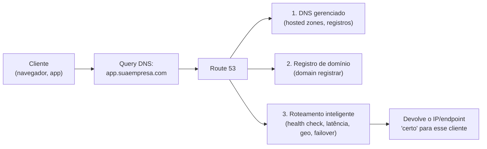
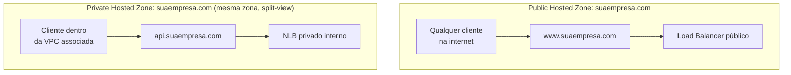
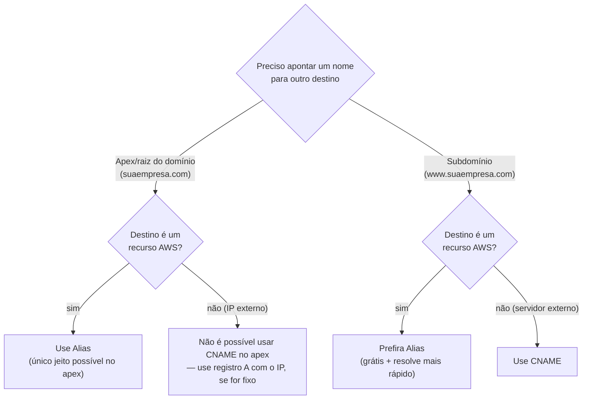
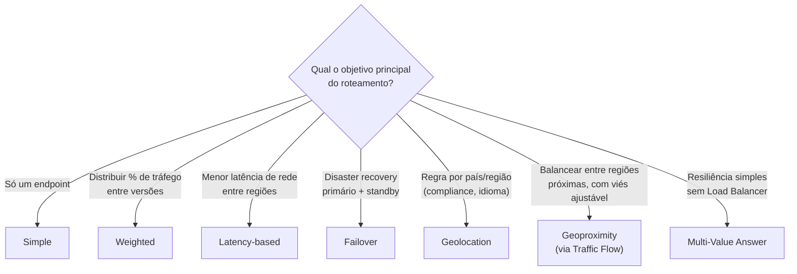
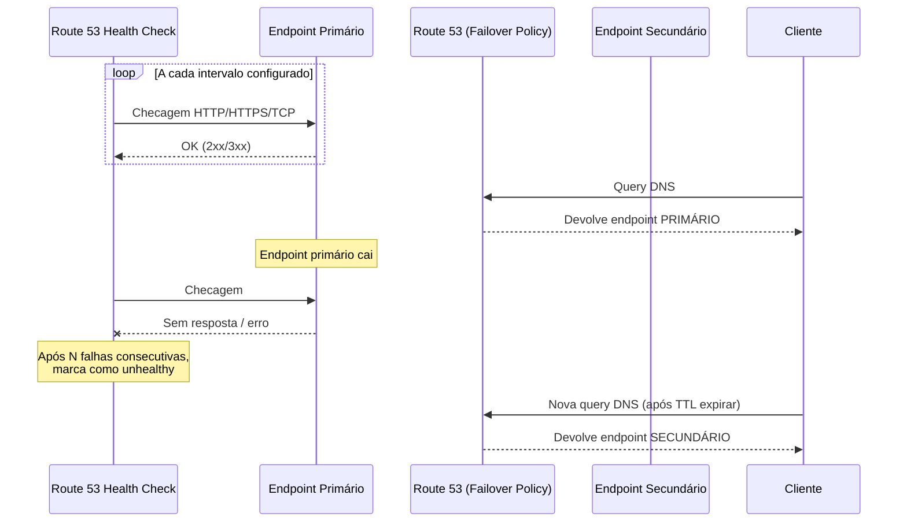
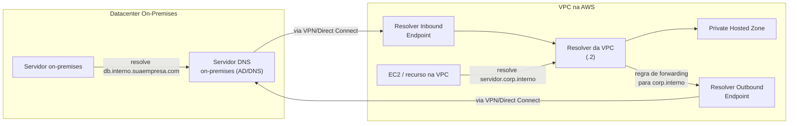
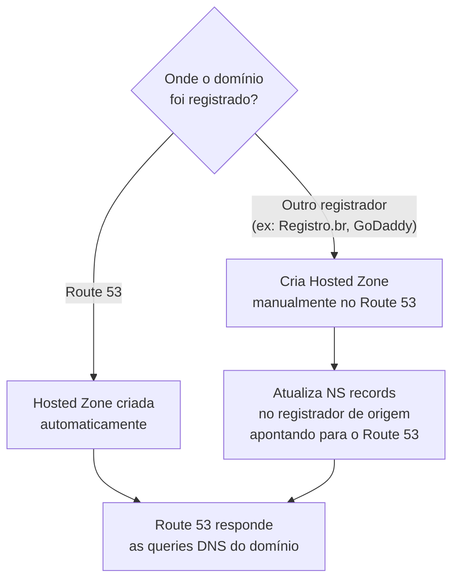
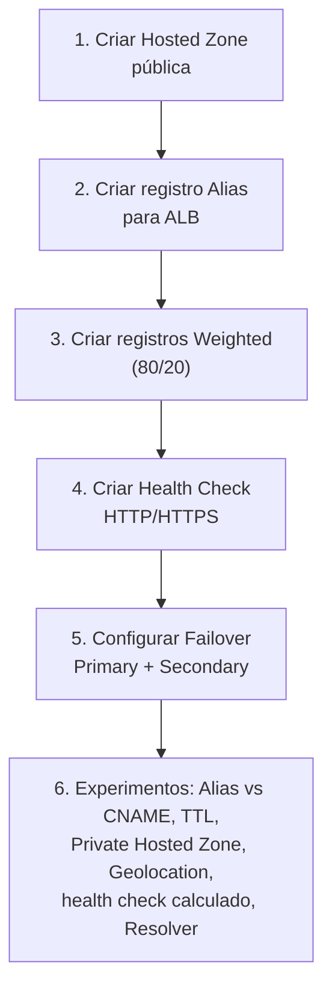

# Route 53 — Guia Completo (Teoria + Prática + Dia a Dia)

## 0. O que é o Route 53 e por que ele existe

Todo sistema na internet, no fim das contas, é acessado por endereço IP. Só que IP é difícil de lembrar e, pior, pode mudar (uma instância cai, um Load Balancer muda de IP, você troca de provedor). O DNS (Domain Name System) resolve isso: traduz nomes legíveis (`app.suaempresa.com`) para endereços IP, funcionando como a "agenda telefônica" da internet.

O **Route 53** é o serviço de DNS gerenciado da AWS. O nome "53" é uma referência direta à porta TCP/UDP 53, que é a porta padrão usada por protocolos DNS — um dos poucos casos na AWS em que o nome do serviço é literalmente técnico.

Mas o Route 53 não é "só DNS". Ele acumula três responsabilidades bem distintas que a prova cobra separadamente:

1. **DNS gerenciado** — hospedar zonas DNS e responder queries de resolução de nome.
2. **Registro de domínio** (domain registrar) — comprar/registrar domínios (`.com`, `.com.br`, etc.).
3. **Health checking e roteamento inteligente** — decidir *qual* resposta dar dependendo de saúde do endpoint, latência, localização geográfica do usuário, e outras políticas.

É esse terceiro ponto que separa o Route 53 de um DNS comum: ele não só resolve nomes, ele resolve nomes **de forma inteligente**, o que o torna uma peça central em qualquer arquitetura de alta disponibilidade e disaster recovery.


*As três responsabilidades do Route 53: hospedar DNS, registrar domínios, e decidir qual resposta dar de forma inteligente.*

---

## 1. Hosted Zones — pública vs privada

Uma **Hosted Zone** é um contêiner que guarda os registros DNS de um domínio (e seus subdomínios). É onde você realmente cadastra "esse nome aponta para esse IP/endpoint".

Existem dois tipos, e a diferença é sobre **quem consegue perguntar** e receber resposta:

### Public Hosted Zone
Responde queries vindas da internet pública. É o cenário padrão: você registra `suaempresa.com`, cria uma Public Hosted Zone, e qualquer pessoa no mundo que digitar `www.suaempresa.com` no navegador recebe a resposta.

### Private Hosted Zone
Só responde queries vindas de dentro de uma ou mais **VPCs específicas** que você associa a ela. A mesma zona (o mesmo nome de domínio) pode até existir como pública e privada ao mesmo tempo, com registros diferentes — isso é chamado de **split-view DNS** (ou split-horizon DNS).

**Uso real do split-view DNS:** você tem `api.suaempresa.com`. Na zona pública, ela aponta para o Load Balancer público, exposto à internet. Na zona privada (associada às VPCs internas), o mesmo nome aponta para um endpoint interno (ex: um NLB privado), evitando que tráfego interno saia para a internet e volte — o que reduz latência, custo de transferência de dados, e superfície de exposição.

**O que muita gente erra na prova:** achar que Private Hosted Zone é "igual à pública, mas com um firewall na frente". Não é isso — ela literalmente não existe do ponto de vista de fora da VPC. Uma query DNS pública nunca vai nem tentar consultar uma Private Hosted Zone; ela é resolvida através do resolver interno da VPC (o `.2` da VPC, ver seção 5), que só é acessível de dentro dela.


*Split-view DNS: o mesmo nome de domínio pode ter registros diferentes na zona pública e na zona privada associada às VPCs internas.*

**Detalhe técnico importante:** uma Private Hosted Zone pode ser associada a múltiplas VPCs, inclusive em contas AWS diferentes (usando uma autorização explícita via `create-vpc-association-authorization`). Isso é comum em arquiteturas multi-conta, onde uma conta central de rede hospeda a zona e outras contas de aplicação associam suas VPCs a ela.

---

## 2. Tipos de registro DNS

Um registro DNS é uma entrada dentro da hosted zone dizendo "esse nome resolve para esse valor, desse tipo". Os principais tipos cobrados na prova:

| Tipo | Para que serve | Exemplo |
|---|---|---|
| **A** | Mapeia um nome para um endereço **IPv4** | `app.suaempresa.com` → `54.10.20.30` |
| **AAAA** | Mapeia um nome para um endereço **IPv6** | `app.suaempresa.com` → `2600:1f18::1` |
| **CNAME** | Mapeia um nome para **outro nome** (não para IP direto) | `www.suaempresa.com` → `suaempresa.com` |
| **MX** | Define os servidores de e-mail do domínio | `suaempresa.com` → servidor de e-mail |
| **TXT** | Texto livre, muito usado para verificação de domínio (ex: SPF, DKIM, validação do ACM) | `suaempresa.com` → string de validação |
| **NS** | Define os servidores de nome autoritativos da zona | delegação da zona |
| **SOA** | Metadados administrativos da zona (criado automaticamente) | — |
| **Alias** (exclusivo AWS) | Mapeia um nome para um **recurso AWS**, funcionando como A/AAAA "turbinado" | `suaempresa.com` → ALB, CloudFront, S3, etc. |

### Alias Record vs CNAME — a distinção clássica de prova

Esse é, sem exagero, um dos pontos mais cobrados em qualquer prova SAA. A pegadinha existe porque, na superfície, Alias e CNAME parecem resolver o mesmo problema: "apontar meu nome para outro nome, em vez de um IP fixo".

O problema que motiva a existência do Alias é este: recursos AWS gerenciados (ALB, CloudFront, S3 website, API Gateway, outro registro do Route 53) **não têm IP fixo** — a AWS pode trocar o IP por trás deles a qualquer momento (escalonamento, failover interno, manutenção). Então você precisaria de um CNAME apontando pro nome DNS desses recursos (ex: `meu-alb-123456.us-east-1.elb.amazonaws.com`). Só que o protocolo DNS **proíbe CNAME no apex/raiz da zona** (`suaempresa.com`, sem subdomínio) — só é permitido em subdomínios (`www.suaempresa.com`). Isso é regra do RFC do DNS, não uma limitação da AWS.

O Alias record é a solução própria da AWS para esse problema:

| Característica | Alias | CNAME |
|---|---|---|
| Funciona no **apex/raiz** do domínio (`suaempresa.com`) | ✅ | ❌ — proibido pelo padrão DNS |
| Funciona em subdomínio (`www.suaempresa.com`) | ✅ | ✅ |
| Aponta para IP diretamente | ❌ — só para recursos AWS | ❌ — só para outro nome |
| Aponta para recurso AWS (ALB, CloudFront, S3, API Gateway, outro registro Route 53) | ✅ | tecnicamente sim, mas não recomendado |
| Aponta para IP externo ou servidor fora da AWS | ❌ | ✅ |
| **Cobrança de query** quando o destino é um recurso AWS | Grátis | Cobrado normalmente |
| Resolução | Acontece na **camada da AWS** — o Route 53 já devolve o IP atual do recurso, numa única resposta | Resolução em duas etapas: o cliente pergunta o CNAME, recebe um nome, e tem que perguntar de novo por esse nome |
| Latência de resolução | Menor (uma consulta) | Levemente maior (duas consultas, uma delas fora da AWS) |
| Suporta registro do tipo **A e AAAA** simultaneamente | ✅ (Alias é um "atributo" aplicado sobre A/AAAA) | N/A |

**Por que o Alias resolve na camada da AWS:** tecnicamente, um Alias não é um novo tipo de registro DNS no sentido do protocolo — é um recurso proprietário do Route 53 que se comporta como um A ou AAAA record, mas com um comportamento especial: quando alguém consulta, o Route 53 já resolve internamente qual é o IP atual do recurso-alvo (ex: consultando o estado interno do ALB) e devolve isso diretamente, numa resposta só. Isso também é o motivo de ser grátis: a consulta nunca "sai" para fora da infraestrutura da AWS.

**O que muita gente erra na prova:** a pergunta clássica é "você precisa apontar o domínio raiz (`suaempresa.com`, sem `www`) para um Application Load Balancer — que tipo de registro usar?" A resposta certa é sempre **Alias**, nunca CNAME — porque CNAME no apex é proibido pelo protocolo, ponto final, independente de ser AWS ou não.


*Árvore de decisão: Alias é obrigatório no apex quando o destino é um recurso AWS; em subdomínio, Alias ainda é preferível por ser grátis e mais rápido, mas CNAME é tecnicamente permitido.*

---

## 3. Políticas de roteamento

Toda hosted zone pode ter múltiplos registros com o **mesmo nome**, cada um com uma **política de roteamento** diferente, que decide qual resposta o Route 53 devolve quando há mais de uma opção. É aqui que o Route 53 deixa de ser "DNS burro" e vira uma ferramenta de arquitetura de alta disponibilidade.

### Simple
Um registro, um valor (ou vários valores retornados juntos, mas sem lógica nenhuma — o cliente escolhe qual usar, geralmente o primeiro). Não tem health check associado nesse modo básico. É o "modo padrão", usado quando você não precisa de nenhuma inteligência: um único servidor, um único endpoint.

### Weighted (ponderado)
Você distribui o tráfego entre múltiplos registros de acordo com um **peso** (0 a 255) atribuído a cada um. Ex: 90% do tráfego para a versão estável, 10% para uma versão nova.

**Uso real:** testes A/B, canary release de infraestrutura (não confundir com canary do API Gateway, mas o conceito é o mesmo), migração gradual entre duas versões de uma aplicação, ou entre duas regiões.

### Latency-based (baseado em latência)
O Route 53 mantém uma tabela de latência entre as regiões AWS e diversas localizações de rede, e direciona o cliente para a região que historicamente oferece **menor latência de rede** para ele — não necessariamente a mais próxima geograficamente (latência de rede e distância física nem sempre são a mesma coisa).

**Uso real:** aplicação multi-região onde a prioridade é performance de rede para o usuário final.

### Failover
Tem um registro **primário** e um **secundário**. O Route 53 monitora o primário via **health check**. Enquanto ele está saudável, todo tráfego vai para ele. Se o health check falha, o tráfego automaticamente passa a ser respondido pelo secundário.

**Uso real:** disaster recovery — site primário na região A, site de standby (pilot light, warm standby, etc.) na região B, e o failover de DNS é o gatilho que redireciona o tráfego automaticamente quando a região A cai.

### Geolocation
Direciona o tráfego com base na **localização geográfica do usuário que está perguntando** (país, continente, ou até estado dos EUA) — não tem relação com latência, é uma regra geográfica/administrativa pura.

**Uso real:** compliance regulatório (ex: "usuários da União Europeia só podem ser servidos por servidores na Europa", por causa de leis de residência de dados), ou conteúdo localizado por idioma/região (servir uma versão em português para o Brasil, em espanhol para a Argentina).

**Detalhe importante:** você pode (e normalmente deve) configurar um registro "default" para cobrir localizações não mapeadas explicitamente — sem isso, usuários de países não cadastrados recebem `NXDOMAIN` (erro de resolução).

### Geoproximity (com Traffic Flow)
Parecido com Geolocation, mas mais sofisticado: direciona o tráfego com base na localização geográfica real (não regras administrativas fixas de país) e permite ajustar um **bias** (viés) para expandir ou reduzir artificialmente a "área de cobertura" de um recurso — por exemplo, fazendo uma região atrair mais tráfego mesmo de usuários um pouco mais distantes dela, útil para balancear carga entre regiões geograficamente próximas.

**Requer o Traffic Flow**, uma ferramenta visual do Route 53 (editor gráfico de políticas de roteamento) — Geoproximity só está disponível através dele, diferente das outras políticas que podem ser configuradas diretamente por registro.

**Uso real:** balancear tráfego entre duas regiões próximas (ex: us-east-1 e us-east-2) de forma mais fina do que Geolocation permite, sem depender só de latência pura.

### Multi-Value Answer
O Route 53 devolve **até 8 registros saudáveis** (que passaram no health check) numa mesma resposta de query, e o cliente escolhe um (geralmente o primeiro, ou aleatoriamente, dependendo do resolver do cliente). Não é um Load Balancer de verdade — é uma forma simples e barata de dar alguma resiliência e distribuição de tráfego via DNS puro, sem custo de um Load Balancer.

**O que muita gente erra na prova:** confundir Multi-Value Answer com um substituto completo de Load Balancer. Não é — não tem lógica de saúde de conexão em tempo real, nem balanceamento fino de carga; é distribuição simples entre endpoints saudáveis. Para balanceamento real de carga na camada de aplicação/transporte, o correto continua sendo ALB/NLB.

### Tabela: quando usar cada política

| Política | Quando usar |
|---|---|
| **Simple** | Um único endpoint, sem necessidade de failover ou distribuição |
| **Weighted** | Testes A/B, canary release, migração gradual de tráfego entre versões/ambientes |
| **Latency-based** | Múltiplas regiões, prioridade é a menor latência de rede possível para o usuário |
| **Failover** | Disaster recovery: site primário + standby, com failover automático via health check |
| **Geolocation** | Compliance/residência de dados, ou conteúdo localizado por país/idioma |
| **Geoproximity (Traffic Flow)** | Balancear tráfego entre regiões geograficamente próximas, com controle fino via bias |
| **Multi-Value Answer** | Resiliência simples e barata via DNS, sem justificar o custo de um Load Balancer completo |


*Árvore de decisão entre as sete políticas de roteamento do Route 53.*

---

## 4. Health Checks e failover de DNS

O Route 53 pode monitorar a saúde de um endpoint de três formas:

1. **Health check de endpoint** — o Route 53 manda requisições periódicas (HTTP, HTTPS ou TCP) diretamente para um IP/domínio e considera saudável se receber resposta dentro do esperado (ex: status 2xx/3xx).
2. **Health check baseado em CloudWatch Alarm** — útil para monitorar recursos que não têm IP público checável diretamente (ex: um recurso dentro de uma VPC privada, ou uma métrica de aplicação como fila do SQS crescendo demais).
3. **Health check calculado (calculated health check)** — combina o resultado de outros health checks com lógica **AND/OR/NOT** (ex: "considere saudável só se pelo menos 2 de 3 health checks dos meus servidores web estiverem OK").

**Como isso vira failover de DNS:** ao usar a política **Failover**, você associa o health check ao registro primário. Enquanto ele reporta saudável, todo tráfego vai para lá. No momento em que falha (após o número configurado de checagens consecutivas com falha), o Route 53 para de devolver o registro primário e passa a devolver o secundário — tudo isso automaticamente, sem intervenção manual.

**O que muita gente erra na prova:** achar que o failover do Route 53 é instantâneo como um failover de Load Balancer. Não é — existe um atraso inerente porque (a) o health check tem um intervalo entre checagens, e frequentemente exige múltiplas falhas consecutivas antes de considerar o endpoint "down"; e (b) o **TTL (Time To Live)** do registro DNS faz com que resolvers e clientes possam manter a resposta antiga em cache por um tempo, mesmo depois do Route 53 já ter mudado a resposta. Por isso, em cenários de disaster recovery crítico, é comum configurar TTLs baixos (ex: 60 segundos) nos registros com failover, aceitando o trade-off de mais queries DNS (mais custo) em troca de failover mais rápido.


*Failover de DNS: o health check detecta a falha, e a próxima query (após o TTL expirar) já recebe o endpoint secundário.*

---

## 5. Route 53 Resolver — DNS híbrido on-premises/AWS

Esse é um recurso menos conhecido, mas muito cobrado em cenários de **arquitetura híbrida** (datacenter on-premises conectado à AWS via VPN ou Direct Connect).

**O problema que ele resolve:** por padrão, uma VPC resolve nomes usando o resolver interno da AWS (o endereço `.2` da faixa de IP da VPC, ex: `10.0.0.2`) — mas esse resolver só enxerga zonas públicas da internet e as Private Hosted Zones associadas àquela VPC. Ele **não sabe nada** sobre os nomes DNS internos do seu datacenter on-premises (ex: `servidor.corp.interno`). Da mesma forma, os servidores DNS do seu datacenter não sabem resolver nomes internos da AWS (ex: registros de uma Private Hosted Zone).

O **Route 53 Resolver** cria uma ponte bidirecional entre os dois mundos, através de dois tipos de endpoint:

### Resolver Inbound Endpoint
Permite que consultas DNS **originadas fora da VPC** (ex: do seu datacenter on-premises, via VPN/Direct Connect) cheguem até o resolver da VPC e consigam resolver nomes internos da AWS (Private Hosted Zones, nomes internos de recursos).

**Uso real:** um servidor no datacenter precisa resolver `db.interno.suaempresa.com`, que é um registro de uma Private Hosted Zone na AWS. Sem o Inbound Endpoint, isso seria impossível a partir de fora da VPC.

### Resolver Outbound Endpoint
Permite o caminho inverso: recursos **dentro da VPC** conseguem enviar consultas DNS para servidores DNS **fora da AWS** (ex: o Active Directory/DNS do datacenter on-premises), usando **regras de encaminhamento (forwarding rules)** que dizem "para esse domínio específico, encaminhe a consulta para esse IP on-premises".

**Uso real:** uma aplicação rodando numa EC2 precisa resolver `servidor.corp.interno`, um nome que só existe no DNS do datacenter. O Outbound Endpoint, com uma regra de forwarding para o domínio `corp.interno`, redireciona a consulta para o DNS do datacenter via VPN/Direct Connect.

**Detalhe técnico importante:** os endpoints (inbound e outbound) são implantados com **ENIs em pelo menos duas subnets/AZs diferentes** para alta disponibilidade — a AWS recomenda no mínimo dois IPs por endpoint.


*Inbound Endpoint permite consultas de fora da VPC resolverem nomes internos da AWS; Outbound Endpoint permite recursos da VPC resolverem nomes do DNS on-premises via regras de forwarding.*

**Conexão com os domínios da prova:** esse recurso é puramente de **Resiliência/arquitetura híbrida**, mas também toca **Segurança** — as regras de forwarding e os endpoints residem dentro de Security Groups e podem ser controlados via Resource Access Manager (RAM) para compartilhamento entre contas numa AWS Organization.

---

## 6. Registro de domínio

O Route 53 também funciona como **registrador de domínio (domain registrar)** — você pode comprar um domínio novo (`.com`, `.com.br`, `.net`, centenas de TLDs) diretamente por ele, sem precisar de um registrador terceirizado (GoDaddy, Registro.br, etc.).

**Como o fluxo funciona:**
1. Você registra/compra o domínio no Route 53 (ou em qualquer outro registrador).
2. O Route 53 (se foi ele quem registrou) cria automaticamente uma Public Hosted Zone para esse domínio, com os registros **NS** apontando para os servidores de nome da AWS.
3. Se o domínio foi comprado em **outro registrador** (ex: Registro.br), você ainda pode usar o Route 53 como DNS — basta criar a Hosted Zone manualmente no Route 53 e depois **atualizar os NS records no registrador de origem** para apontar para os servidores de nome do Route 53.

**O que muita gente erra na prova:** confundir "registrar um domínio" com "hospedar o DNS dele". São coisas desacopladas — você pode registrar um domínio na Registro.br e hospedar o DNS inteiro no Route 53 (é inclusive um cenário comum, já que nem todo TLD é suportado diretamente pelo Route 53 como registrador, ex: `.com.br` historicamente tinha suporte limitado).


*Registro de domínio e hospedagem de DNS são desacoplados: dá para registrar em um lugar e hospedar o DNS em outro.*

---

# 🧪 Laboratório prático (para executar na AWS)

## Objetivo
Registrar/usar um domínio (ou subdomínio de teste), criar uma Hosted Zone, configurar registros A/Alias, e simular um failover com health check.

> Se você não quiser comprar um domínio de verdade, pode usar uma Hosted Zone pública de um domínio que já possui, ou testar tudo com uma Private Hosted Zone associada a uma VPC de laboratório, sem custo de registro.

### Passo 1 — Criar a Hosted Zone
Console → Route 53 → **Hosted zones** → **Create hosted zone**
- Domain name: `labsaa.exemplo.com` (ou seu domínio real)
- Type: **Public hosted zone**

### Passo 2 — Criar um registro Alias apontando para um recurso AWS
- Crie (ou reaproveite) um Application Load Balancer simples.
- **Create record** na Hosted Zone:
  - Record name: vazio (apex) ou `app`
  - Record type: **A**
  - Marque **Alias**: Sim
  - Route traffic to: **Alias to Application and Classic Load Balancer**, selecione o ALB

### Passo 3 — Criar um segundo registro com Weighted Routing
- Crie outro recurso simples (ex: outro ALB, ou um bucket S3 estático).
- Crie dois registros com o **mesmo nome** (ex: `app.labsaa.exemplo.com`), política **Weighted**, um com peso 80 e outro com peso 20.
- Rode `dig` várias vezes e observe a distribuição.

### Passo 4 — Criar um Health Check
Console → Route 53 → **Health checks** → **Create health check**
- Tipo: **HTTP** ou **HTTPS**
- Endpoint: o IP/domínio de um dos seus recursos
- Configure o intervalo de checagem e o número de falhas consecutivas antes de marcar como unhealthy

### Passo 5 — Configurar Failover
- Crie dois registros com o mesmo nome, política **Failover**: um marcado como **Primary** (associado ao Health Check do Passo 4) e outro como **Secondary**.
- Derrube o recurso primário (ex: pare a instância/desregistre do target group) e observe, após o TTL expirar, a resposta do `dig` mudar para o secundário.

### Passo 6 — Experimentos para fixar cada conceito
1. **Alias vs CNAME:** tente criar um registro CNAME no apex (`labsaa.exemplo.com`, sem subdomínio) e observe o erro do console explicando por que isso não é permitido — depois refaça como Alias e veja funcionar.
2. **TTL e velocidade de failover:** reduza o TTL do registro de failover para 30 segundos, force uma falha no primário, e cronometre quanto tempo leva até o `dig` retornar o secundário. Depois repita com um TTL de 300 segundos e compare.
3. **Private Hosted Zone:** crie uma segunda Hosted Zone privada com o mesmo nome de domínio, associe a uma VPC, crie um registro diferente do público, e teste resolvendo de dentro de uma EC2 na VPC vs de fora (split-view DNS).
4. **Geolocation:** crie um registro com política Geolocation para "Brazil" e outro "Default", aponte para recursos diferentes, e use uma VPN/proxy de outro país para ver a resposta mudar.
5. **Health check calculado:** crie dois health checks simples e um terceiro do tipo "Calculated Health Check" combinando os dois com lógica OR, derrube só um dos dois endpoints e observe o resultado do calculado.
6. **Route 53 Resolver (se tiver VPN/Direct Connect simulado com um ambiente de lab):** crie um Outbound Endpoint com uma forwarding rule para um domínio fictício e observe o comportamento nas configurações (mesmo sem um DNS on-premises real para validar ponta a ponta).


*Sequência dos passos do laboratório prático.*

---

## Comandos AWS CLI úteis

```bash
# Criar uma hosted zone pública
aws route53 create-hosted-zone --name labsaa.exemplo.com --caller-reference "$(date +%s)"

# Listar hosted zones
aws route53 list-hosted-zones

# Criar/alterar um registro A (Alias) apontando para um ALB
aws route53 change-resource-record-sets --hosted-zone-id Z123EXAMPLE --change-batch '{
  "Changes": [{
    "Action": "UPSERT",
    "ResourceRecordSet": {
      "Name": "app.labsaa.exemplo.com",
      "Type": "A",
      "AliasTarget": {
        "HostedZoneId": "Z35SXDOTRQ7X7K",
        "DNSName": "meu-alb-123456.us-east-1.elb.amazonaws.com",
        "EvaluateTargetHealth": true
      }
    }
  }]
}'

# Criar um health check HTTP
aws route53 create-health-check --caller-reference "$(date +%s)" --health-check-config '{
  "IPAddress": "54.10.20.30",
  "Port": 80,
  "Type": "HTTP",
  "ResourcePath": "/health",
  "RequestInterval": 30,
  "FailureThreshold": 3
}'

# Listar registros de uma hosted zone
aws route53 list-resource-record-sets --hosted-zone-id Z123EXAMPLE

# Testar resolução DNS (fora da CLI da AWS, mas essencial no dia a dia)
dig app.labsaa.exemplo.com
nslookup app.labsaa.exemplo.com
```

---

## Tabela de decisão rápida (prova + dia a dia)

| Cenário | Resposta provável |
|---|---|
| Apontar domínio raiz (`suaempresa.com`) para ALB/CloudFront/S3 | Registro **Alias** (CNAME é proibido no apex) |
| Apontar subdomínio para um servidor externo (não AWS) | **CNAME** |
| Apontar subdomínio para recurso AWS, minimizando custo/latência | **Alias** (grátis + mais rápido que CNAME) |
| Disaster recovery com site primário e standby | Política **Failover** + Health Check |
| Distribuir tráfego por % entre versões/ambientes | Política **Weighted** |
| Priorizar menor latência de rede entre regiões | Política **Latency-based** |
| Restringir acesso por país (compliance/residência de dados) | Política **Geolocation** |
| Balancear tráfego entre regiões próximas com controle fino | **Geoproximity** via Traffic Flow |
| Resiliência simples via DNS sem custo de Load Balancer | **Multi-Value Answer** |
| DNS resolvido só dentro da VPC, nunca exposto à internet | **Private Hosted Zone** |
| Mesmo domínio com respostas diferentes para interno/externo | **Split-view DNS** (zona pública + privada) |
| Servidor on-premises precisa resolver nomes internos da AWS | **Resolver Inbound Endpoint** |
| Recurso na VPC precisa resolver nomes do DNS on-premises | **Resolver Outbound Endpoint** + forwarding rule |
| Domínio registrado em outro provedor, DNS gerenciado pela AWS | Criar Hosted Zone no Route 53 + atualizar **NS records** no registrador de origem |
