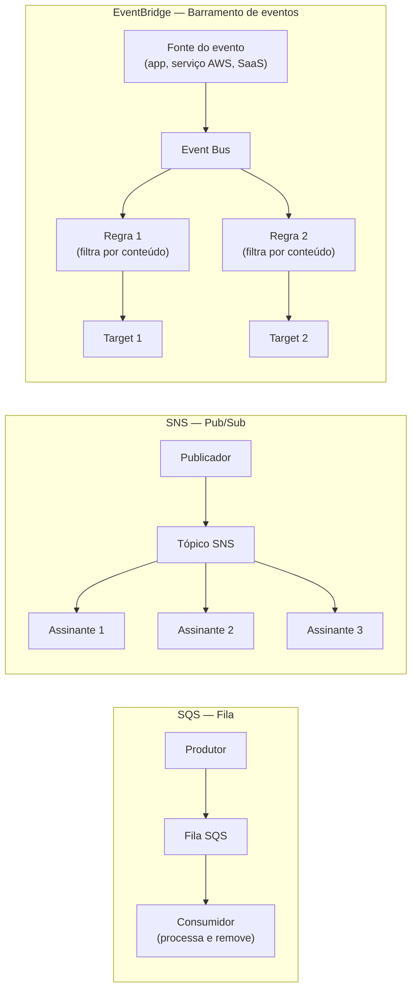
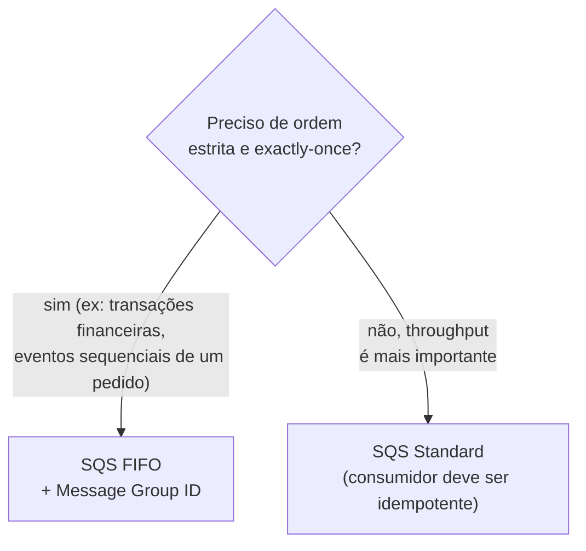
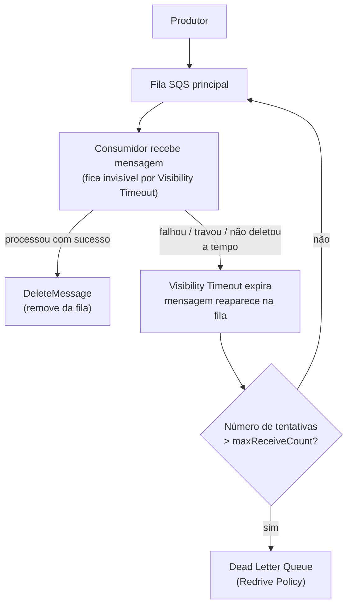
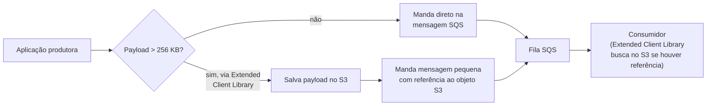
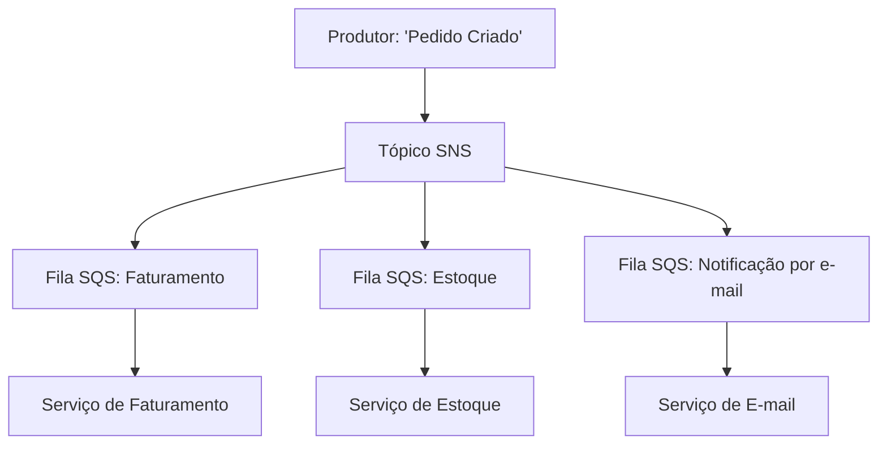
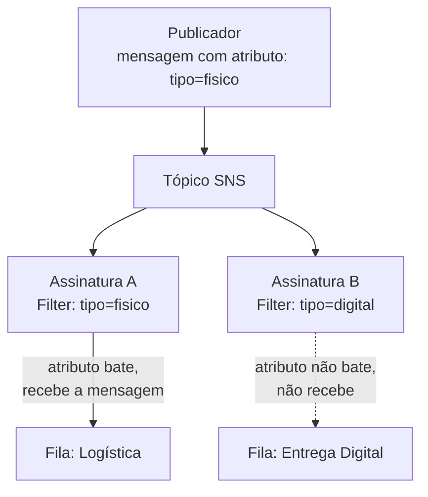
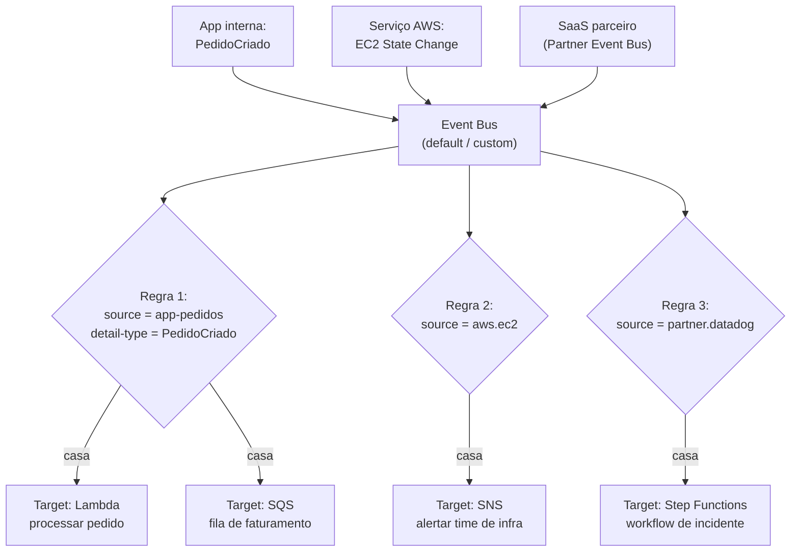
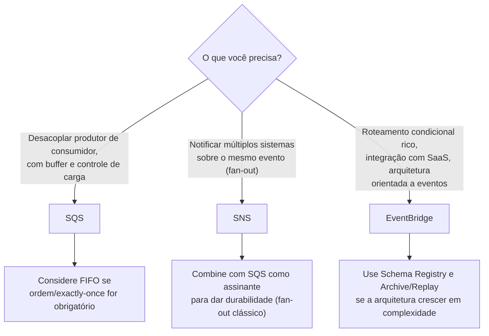
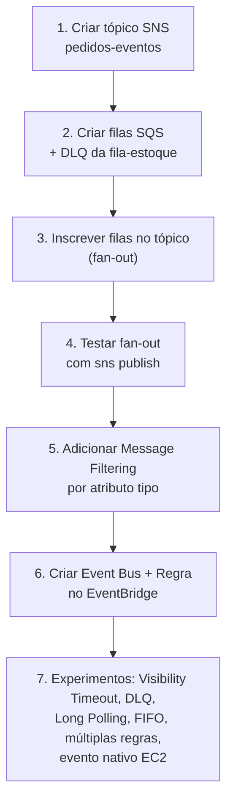

# SQS, SNS e EventBridge — Guia Completo (Teoria + Prática + Dia a Dia)

## 0. O problema que esses três serviços resolvem

Imagine um sistema de e-commerce: quando um pedido é criado, várias coisas precisam acontecer — cobrar o cartão, atualizar estoque, notificar o time de logística, mandar e-mail de confirmação, atualizar um dashboard de métricas. Se você escrever tudo isso como chamadas síncronas diretas (`serviçoPedido` chama `serviçoEstoque` chama `serviçoEmail`...), você cria um sistema **fortemente acoplado**: se o serviço de e-mail cair, o pedido inteiro falha; se um deles ficar lento, todos ficam lentos; e adicionar um novo consumidor (ex: "agora também quero notificar via SMS") exige alterar o código do serviço de pedido.

**Mensageria assíncrona** resolve isso: em vez de um serviço chamar o outro diretamente, ele publica uma mensagem/evento em algum lugar, e quem quiser reagir a isso, reage — sem o produtor precisar saber quem são os consumidores, nem esperar eles responderem.

A AWS tem três serviços centrais para isso, e a pergunta mais comum tanto na prova quanto no trabalho é "qual dos três eu uso aqui?":

- **SQS (Simple Queue Service)** — uma **fila**. Mensagens ficam guardadas até alguém processar. Modelo *um produtor, um (ou vários) consumidor(es) competindo pela mesma mensagem*.
- **SNS (Simple Notification Service)** — **pub/sub**. Um publicador manda uma mensagem, e ela é entregue para **todos** os inscritos (fan-out), simultaneamente.
- **EventBridge** — um **barramento de eventos** mais sofisticado, com roteamento baseado em conteúdo/schema do evento, múltiplas fontes (inclusive SaaS de terceiros), e regras de filtragem muito mais ricas que o SNS.


*Os três modelos: fila (um consome), pub/sub (todos os assinantes recebem), e barramento de eventos com roteamento por conteúdo.*

---

## 1. SQS — Standard vs FIFO

O SQS é uma fila totalmente gerenciada: você manda mensagens para ela, e consumidores fazem *polling* (perguntam "tem mensagem nova?") para pegar e processar. A fila existe justamente para **desacoplar velocidade de produção da velocidade de consumo** — se o produtor gera mensagens mais rápido do que o consumidor processa, elas simplesmente esperam na fila, em vez de se perder ou derrubar o consumidor.

### SQS Standard
- **At-least-once delivery** — cada mensagem é entregue **pelo menos uma vez**, mas em situações raras (geralmente ligadas a como o SQS replica mensagens internamente entre múltiplos servidores para alta disponibilidade) uma mensagem pode ser entregue **mais de uma vez**. Isso significa que seu consumidor precisa ser **idempotente** (processar a mesma mensagem duas vezes não pode causar efeito colateral duplicado, ex: cobrar o cliente duas vezes).
- **Ordem não garantida** — as mensagens podem chegar fora da ordem em que foram enviadas. Isso é consequência direta de como a Standard Queue distribui mensagens entre múltiplos servidores internamente para alcançar throughput altíssimo.
- **Throughput praticamente ilimitado** — suporta um volume muito alto de transações por segundo, sem necessidade de configuração especial.

### SQS FIFO (First-In-First-Out)
- **Exactly-once processing** — dentro de uma janela de deduplicação (5 minutos por padrão), o SQS garante que uma mensagem duplicada não seja processada duas vezes.
- **Ordem garantida** — mensagens são entregues na exata ordem em que foram enviadas, **dentro do mesmo Message Group ID** (ver abaixo).
- **Throughput limitado** — sem batching, hoje suporta até 300 mensagens/segundo por fila (ou até 3.000/s usando batching de até 10 mensagens por chamada); é uma ordem de grandeza menor que a Standard, porque garantir ordem exige processamento sequencial internamente.
- **Nome da fila deve terminar em `.fifo`** — é assim que a AWS identifica o tipo no momento da criação.

**Message Group ID:** dentro de uma fila FIFO, mensagens são agrupadas por um `MessageGroupId`. A ordem só é garantida **dentro do mesmo grupo** — mensagens de grupos diferentes podem ser processadas em paralelo por consumidores diferentes, o que é a forma de ganhar algum paralelismo numa fila FIFO sem perder a garantia de ordem onde ela importa (ex: todas as mensagens de um mesmo `pedidoId` no mesmo grupo, para garantir que os eventos daquele pedido específico sejam processados em ordem, enquanto pedidos diferentes são processados em paralelo).

**Deduplicação:** pode ser feita de duas formas — enviando explicitamente um `MessageDeduplicationId`, ou habilitando **content-based deduplication**, onde o SQS gera um hash SHA-256 do corpo da mensagem automaticamente. Se duas mensagens com o mesmo ID/hash chegarem dentro da janela de 5 minutos, a segunda é descartada silenciosamente (do ponto de vista de quem consome).

| Característica | Standard | FIFO |
|---|---|---|
| Ordem de entrega | Não garantida (best-effort) | Garantida dentro do mesmo Message Group ID |
| Garantia de entrega | At-least-once (pode duplicar raramente) | Exactly-once (dentro da janela de dedup) |
| Throughput | Praticamente ilimitado | Limitado (até 300/s sem batching, 3.000/s com batching) |
| Nome da fila | Livre | Precisa terminar em `.fifo` |
| Deduplicação | Não existe nativamente | Nativa (por ID explícito ou content-based) |
| Uso típico | Alto volume, ordem não importa, idempotência no consumidor | Processamento sequencial obrigatório (ex: eventos de um mesmo pedido, transações financeiras) |

**O que muita gente erra na prova:** achar que "at-least-once" é um bug ou algo raro de acontecer na prática — é uma característica de design conhecida e documentada, decorrência direta de como a Standard Queue alcança throughput altíssimo replicando mensagens entre múltiplos servidores internos. A conclusão certa da prova é sempre "portanto, o consumidor precisa ser idempotente", não "a Standard Queue é não confiável".


*Critério principal de decisão entre Standard e FIFO: necessidade de ordem/exactly-once vs necessidade de throughput.*

---

## 2. Visibility Timeout, Dead Letter Queue e Redrive Policy

### Visibility Timeout
Quando um consumidor **pega** (faz `ReceiveMessage`) uma mensagem da fila, ela **não é removida** imediatamente — ela fica "invisível" para outros consumidores por um período chamado **visibility timeout** (padrão 30 segundos). A ideia é dar tempo do consumidor processar a mensagem e, só então, **deletar explicitamente** (`DeleteMessage`) quando terminar com sucesso.

**O que acontece se o consumidor não deletar a tempo:** se o visibility timeout expira antes do `DeleteMessage`, a mensagem **volta a ficar visível** na fila, e outro consumidor (ou o mesmo) pode pegá-la de novo. Isso é o mecanismo de auto-recuperação do SQS: se um consumidor trava ou cai no meio do processamento, a mensagem não se perde, ela simplesmente reaparece depois de um tempo.

**No dia a dia:** se o processamento típico de uma mensagem demora mais que o visibility timeout padrão, você precisa aumentar esse valor (ou usar `ChangeMessageVisibility` para estender dinamicamente durante o processamento) — senão você tem o efeito colateral de processar a mesma mensagem várias vezes em paralelo sem necessidade, mesmo estando tudo funcionando corretamente.

### Dead Letter Queue (DLQ) e Redrive Policy
Uma mensagem "com problema" — que falha repetidamente no processamento — não deveria ficar reaparecendo infinitamente na fila principal (isso é chamado de **poison pill**, e pode travar todo o processamento se seus consumidores ficarem presos tentando processar sempre a mesma mensagem quebrada).

A **Redrive Policy** resolve isso: você configura um número máximo de tentativas (`maxReceiveCount`). Depois que uma mensagem é recebida (mas não deletada) mais vezes que esse número, o SQS automaticamente a move para uma **Dead Letter Queue** — uma fila separada, configurada especificamente para acumular essas mensagens problemáticas, para investigação manual posterior (ou reprocessamento depois de corrigir o bug que causava a falha).

**Detalhe importante:** a DLQ **precisa ser do mesmo tipo** da fila de origem (Standard com Standard, FIFO com FIFO), e precisa estar na mesma conta/região.

**No dia a dia:** é considerado quase obrigatório configurar DLQ em qualquer fila de produção — sem ela, uma mensagem com bug fica reprocessando para sempre (consumindo recursos, gerando ruído em logs) ou, pior, você nem percebe que existe um problema recorrente até tarde demais.


*Visibility Timeout permite reprocessamento automático em caso de falha; a Redrive Policy evita loop infinito movendo mensagens problemáticas para a DLQ após N tentativas.*

---

## 3. Long Polling vs Short Polling, tamanho de mensagem, Extended Client Library

### Short Polling (padrão histórico)
Quando o consumidor chama `ReceiveMessage`, o SQS responde **imediatamente**, mesmo que não tenha mensagem nenhuma disponível naquele momento (ou consultando só um subconjunto dos servidores internos). Isso desperdiça chamadas de API (mais custo) quando a fila está vazia com frequência, e pode até "perder" mensagens temporariamente da resposta, já que nem todos os servidores internos são consultados numa única chamada.

### Long Polling (recomendado)
O consumidor pede pra esperar (`WaitTimeSeconds`, até 20 segundos) por uma mensagem, caso não tenha nenhuma disponível no momento exato da chamada. Se uma mensagem chegar durante essa janela de espera, ela é entregue imediatamente; se não chegar nenhuma, a chamada retorna vazia só depois do tempo máximo.

**Por que isso é melhor no dia a dia:** reduz drasticamente o número de chamadas de API vazias (menor custo), reduz a latência percebida entre "mensagem chegou" e "consumidor pegou ela" (comparado a fazer short polling em loop rápido), e consulta todos os servidores internos do SQS, evitando respostas "falso vazio".

**Como configurar:** `WaitTimeSeconds` > 0 na chamada de `ReceiveMessage`, ou definido como padrão na fila inteira via `ReceiveMessageWaitTimeSeconds`.

### Tamanho máximo de mensagem
Uma mensagem SQS suporta até **256 KB** de texto. Isso é pequeno para muitos casos reais (ex: um payload de imagem, um documento grande, um JSON complexo com muitos dados).

### Amazon SQS Extended Client Library
Para superar o limite de 256 KB **sem precisar redesenhar a arquitetura**, existe a **Extended Client Library** (biblioteca Java/outras linguagens oficial da AWS): em vez de mandar o payload grande direto na mensagem, ela automaticamente **guarda o payload no S3** e manda na fila SQS apenas uma **mensagem pequena com uma referência/ponteiro** para o objeto no S3. O consumidor, usando a mesma biblioteca do lado dele, detecta essa referência e busca o payload real no S3 automaticamente — tudo de forma transparente para o código de negócio.

**Uso real:** processamento de imagens/vídeos, pipelines de dados que trafegam JSONs grandes, qualquer fila que ocasionalmente precisa carregar payloads maiores que 256 KB sem trocar de arquitetura de mensageria.


*A Extended Client Library contorna o limite de 256 KB armazenando o payload real no S3 e trafegando só uma referência na fila.*

---

## 4. SNS — Pub/Sub, Fan-out e Message Filtering

O SNS funciona em torno de **tópicos**: um publicador manda uma mensagem para um tópico, e o SNS entrega essa mensagem para **todos os assinantes (subscribers)** daquele tópico, em paralelo. Os assinantes podem ser de vários tipos: SQS, Lambda, HTTP/HTTPS endpoint, e-mail, SMS, aplicativos mobile (push notification).

### Fan-out pattern (SNS → múltiplas SQS)
Esse é um dos padrões de arquitetura mais usados e mais cobrados na prova. O problema: você quer que **múltiplos sistemas independentes** reajam ao mesmo evento (ex: "pedido criado"), cada um no seu próprio ritmo, sem que um sistema lento afete os outros, e sem perder mensagens se um consumidor estiver temporariamente indisponível.

A solução: o produtor publica **uma única vez** num tópico SNS. Esse tópico tem **múltiplas filas SQS inscritas** como assinantes. O SNS entrega uma cópia da mensagem para cada fila. Cada fila é consumida de forma independente pelo seu respectivo serviço.

**Por que usar SQS como assinante em vez de, por exemplo, o consumidor assinar o SNS diretamente via HTTP:** a fila SQS dá **durabilidade e buffer** — se o consumidor daquele serviço específico estiver fora do ar, a mensagem fica esperando na fila dele até ele voltar, em vez de ser perdida (o que aconteceria com uma assinatura HTTP direta que falha).


*Fan-out: uma única publicação no SNS chega a múltiplas filas SQS independentes, cada uma consumida no seu próprio ritmo.*

### Message Filtering por atributo
Sem filtro, todo assinante recebe **toda** mensagem publicada no tópico. Isso nem sempre é o que você quer — ex: você tem um único tópico `PedidosEventos`, mas o serviço de logística só se importa com pedidos do tipo "físico" (não "digital").

O SNS permite anexar uma **filter policy** a cada assinatura, baseada em **atributos da mensagem** (não no corpo dela). Só mensagens cujos atributos batem com a política configurada chegam àquele assinante específico — os outros assinantes do mesmo tópico continuam recebendo normalmente conforme suas próprias políticas (ou tudo, se não tiverem filtro).

**Uso real:** um único tópico central de eventos de pedido, com dezenas de assinantes diferentes, cada um só recebendo o subconjunto relevante (por tipo de produto, por região, por status), sem precisar criar um tópico separado para cada combinação.


*Message filtering permite que assinantes do mesmo tópico recebam apenas o subconjunto de mensagens relevante, baseado em atributos.*

---

## 5. EventBridge — barramento de eventos com roteamento rico

O EventBridge resolve um problema mais amplo que o SNS: em vez de "publicador manda pra um tópico e todo mundo inscrito recebe", o EventBridge é um **barramento de eventos** onde o roteamento é decidido por **regras baseadas no conteúdo/schema do evento em si** — muito mais parecido com "se esse evento tiver essa forma/esses campos, mande para esse destino" do que "quem está inscrito nesse canal".

### Event Bus
É o "cano" por onde os eventos passam. Existem três tipos:
- **Default event bus** — recebe automaticamente eventos de mais de 200 serviços AWS (ex: uma instância EC2 muda de estado, um objeto é criado no S3).
- **Custom event bus** — criado por você, para eventos da sua própria aplicação (ex: seu sistema publica `PedidoCriado`, `PedidoCancelado`).
- **Partner event bus** — recebe eventos diretamente de aplicações **SaaS de terceiros** integradas oficialmente com o EventBridge (ex: Zendesk, Datadog, PagerDuty, Shopify) — sem você precisar construir nenhuma integração/webhook customizado, o parceiro publica direto nesse bus dedicado à sua conta.

### Rules (regras)
Cada regra tem um **event pattern** — uma estrutura JSON que descreve quais campos/valores do evento fazem ela "casar" — e um ou mais **targets** (mais de 20 tipos diferentes de destino: Lambda, SQS, SNS, Step Functions, Kinesis, endpoints HTTP via API destination, e mais). Um único evento pode disparar **múltiplas regras diferentes**, cada uma mandando para targets diferentes — algo que o SNS não faz da mesma forma (no SNS, o "roteamento" acontece na assinatura via filter policy simples sobre atributos; no EventBridge, é uma regra rica que pode inspecionar toda a estrutura do payload JSON do evento).

### Schema Registry
O EventBridge pode **descobrir automaticamente o formato (schema)** dos eventos que passam por um event bus, e manter um registro desses schemas. Isso permite, inclusive, **gerar código (bindings)** para várias linguagens direto no seu IDE, já tipado de acordo com o schema do evento — reduzindo erro de integração ("esqueci que esse campo era string, não number").

### Integração com SaaS de terceiros
Esse é um diferencial que o SNS simplesmente não tem: através do **Partner Event Bus**, ferramentas SaaS externas (com integração oficial) publicam eventos diretamente na sua conta AWS, sem você ter que expor um webhook público, gerenciar autenticação de entrada, ou fazer polling na API deles. Você só assina o bus e cria regras normalmente.

### A diferença fundamental entre SNS e EventBridge

| Aspecto | SNS | EventBridge |
|---|---|---|
| Modelo de roteamento | Pub/Sub simples — assinante recebe tudo do tópico, opcionalmente filtrado por **atributos** | Roteamento rico baseado em **conteúdo/schema do evento inteiro** (event pattern sobre o JSON) |
| Número de regras por evento | N/A — é por assinatura | Um evento pode casar com **múltiplas regras**, cada uma independente |
| Schema Registry / descoberta de schema | Não existe | Sim — inclusive geração de código tipado |
| Integração nativa com SaaS de terceiros | Não | Sim — via Partner Event Bus |
| Latência | Muito baixa, entrega quase instantânea | Levemente maior que SNS (processamento de regra mais complexo), mas ainda da ordem de milissegundos |
| Retenção/replay de eventos | Não (é fire-and-forget) | Sim, com **Archive and Replay** — pode arquivar eventos e reprocessá-los depois |
| Tipos de destino suportados | SQS, Lambda, HTTP/S, e-mail, SMS, push mobile | Mais de 20 tipos, incluindo Step Functions, Kinesis, API destinations, e todos que o SNS suporta via target |
| Caso de uso típico | Fan-out simples de notificação para múltiplos sistemas | Arquitetura orientada a eventos complexa, integração com SaaS, roteamento condicional refinado |

**No dia a dia:** uma regra prática (não é 100% absoluta, mas ajuda a decidir rápido): se você só precisa "notificar N sistemas sobre a mesma coisa", SNS resolve com menos complexidade. Se você precisa de **roteamento condicional baseado no conteúdo do evento**, **integração com SaaS externo**, ou está construindo uma arquitetura orientada a eventos mais ampla (múltiplos microsserviços publicando e reagindo a eventos de domínio), o EventBridge é a ferramenta certa.


*EventBridge: um evento pode casar com múltiplas regras simultaneamente, cada uma com seus próprios targets, incluindo fontes de SaaS parceiro.*

---

## 6. Tabela comparativa final: SQS vs SNS vs EventBridge

| Critério | SQS | SNS | EventBridge |
|---|---|---|---|
| Modelo | Fila (pull, um consumidor processa e remove) | Pub/Sub (push, todos os assinantes recebem) | Barramento de eventos (push, roteamento por regra/conteúdo) |
| Quem processa a mensagem | Um consumidor por mensagem (ou grupo, no FIFO) | Todos os assinantes do tópico | Todos os targets das regras que casaram |
| Durabilidade da mensagem não processada | Fica na fila até ser processada ou expirar (retenção configurável, até 14 dias) | Não retém — se o assinante estiver fora, a entrega falha (mitigado com retry e DLQ na própria assinatura) | Não retém por padrão — mas suporta Archive/Replay explícito |
| Ordenação garantida | Só no FIFO | Não | Não (roteamento não é sequencial) |
| Roteamento condicional rico | Não aplicável (é uma fila simples) | Filtro simples por atributo | Event pattern completo sobre o JSON do evento |
| Integração com SaaS de terceiros | Não | Não | Sim (Partner Event Bus) |
| Uso típico | Buffer/desacoplamento entre produtor e consumidor, controle de carga | Fan-out de notificação para múltiplos sistemas | Arquitetura orientada a eventos, integração ampla, roteamento condicional |
| Combinação comum | Alvo de fan-out do SNS ou target do EventBridge | Publica para múltiplas SQS (fan-out) | Pode ter SQS/SNS como targets das suas regras |


*Árvore de decisão final entre os três serviços, com as combinações mais comuns na prática.*

---

## 7. Conectando com os domínios da prova SAA-C03

- **Resiliência:** os três serviços são peças centrais de arquiteturas **desacopladas e tolerantes a falha** — filas absorvem picos de carga sem derrubar consumidores, DLQs evitam perda silenciosa de mensagens com problema, e fan-out garante que a falha de um consumidor não afete os outros.
- **Performance/Escalabilidade:** SQS Standard e SNS escalam de forma praticamente transparente para volumes altíssimos de mensagens; EventBridge processa eventos de forma assíncrona sem bloquear o produtor.
- **Segurança:** todos os três suportam **encryption at rest** (KMS) e **em trânsito** (TLS), além de políticas baseadas em recursos (Queue Policy, Topic Policy, Resource Policy no EventBridge) e integração com IAM para controlar quem pode publicar/consumir.
- **Custo:** cobrança é por requisição/mensagem processada nos três — em geral bem barato em volume moderado, mas em altíssimo volume vale comparar: SQS FIFO tem menor throughput por segundo (pode exigir mais filas paralelas via Message Group ID para escalar), e EventBridge tem um custo por evento levemente maior que SNS/SQS puros, compensado pela riqueza de roteamento que evita construir lógica de filtro customizada em outro lugar.

---

# 🧪 Laboratório prático (para executar na AWS)

## Objetivo
Montar um fan-out SNS → múltiplas SQS, configurar DLQ numa das filas, e criar uma regra EventBridge reagindo a um evento nativo da AWS.

### Passo 1 — Criar o tópico SNS
Console → SNS → **Create topic**
- Type: Standard
- Nome: `pedidos-eventos`

### Passo 2 — Criar as filas SQS (fan-out)
Console → SQS → **Create queue** (repita para cada uma)
- `fila-faturamento` (Standard)
- `fila-estoque` (Standard)
- `fila-dlq-estoque` (Standard, será a DLQ da fila de estoque)

Configure na `fila-estoque`, em **Dead-letter queue**, aponte para `fila-dlq-estoque` com `Maximum receives = 3`.

### Passo 3 — Inscrever as filas no tópico SNS (fan-out)
Em cada fila SQS → **Send messages** → aba **Subscribe to Amazon SNS topic**, ou via SNS → **Create subscription**:
- Protocol: **Amazon SQS**
- Endpoint: ARN da fila
- Repita para `fila-faturamento` e `fila-estoque`

Não esqueça de garantir que a **Access Policy** da fila SQS permite o SNS publicar nela (o console geralmente oferece configurar isso automaticamente).

### Passo 4 — Testar o fan-out
```bash
aws sns publish --topic-arn arn:aws:sns:us-east-1:123456789012:pedidos-eventos \
  --message '{"pedidoId": "123", "tipo": "fisico"}'
```
Verifique que a mensagem chegou em **ambas** as filas.

### Passo 5 — Adicionar Message Filtering
Edite a assinatura de `fila-estoque` e adicione uma **filter policy**:
```json
{ "tipo": ["fisico"] }
```
Publique uma mensagem com atributo `tipo=digital` e confirme que só `fila-faturamento` recebe (se ela não tiver filtro) e `fila-estoque` não recebe.

### Passo 6 — Criar um Event Bus customizado e uma regra no EventBridge
Console → EventBridge → **Event buses** → **Create event bus**
- Nome: `bus-pedidos`

Console → EventBridge → **Rules** → **Create rule**
- Event bus: `bus-pedidos`
- Event pattern customizado:
```json
{
  "source": ["app.pedidos"],
  "detail-type": ["PedidoCriado"],
  "detail": { "tipo": ["fisico"] }
}
```
- Target: uma das filas SQS criadas antes, ou uma Lambda simples de teste.

Publique um evento de teste:
```bash
aws events put-events --entries '[{
  "Source": "app.pedidos",
  "DetailType": "PedidoCriado",
  "Detail": "{\"pedidoId\": \"456\", \"tipo\": \"fisico\"}",
  "EventBusName": "bus-pedidos"
}]'
```

### Passo 7 — Experimentos para fixar cada conceito
1. **Visibility Timeout:** receba uma mensagem da `fila-estoque` via console (sem deletar) e observe ela sumir da contagem de "Messages available" e reaparecer depois do timeout configurado.
2. **DLQ na prática:** simule falha de processamento recebendo a mesma mensagem 3+ vezes sem deletar (respeitando o `Maximum receives`) e confirme que ela aparece na `fila-dlq-estoque`.
3. **Long Polling:** compare, via CLI, uma chamada `receive-message` com `--wait-time-seconds 0` (short polling) vs `--wait-time-seconds 20` (long polling) numa fila vazia, e observe o tempo de resposta.
4. **FIFO:** crie uma fila `pedidos.fifo`, mande várias mensagens com o mesmo `MessageGroupId` em sequência rápida, e confirme que chegam na ordem exata ao consumir.
5. **EventBridge com múltiplas regras:** adicione uma segunda regra no mesmo bus reagindo ao mesmo `detail-type` mas sem o filtro de `tipo`, mande um evento com `tipo=digital`, e confirme que só a segunda regra dispara.
6. **EventBridge nativo AWS:** crie uma regra no **default event bus** reagindo a `EC2 Instance State-change Notification`, inicie/pare uma instância EC2 de teste, e observe o evento sendo capturado (ex: enviando para uma fila SQS de teste).


*Sequência dos passos do laboratório prático.*

---

## Comandos AWS CLI úteis

```bash
# --- SQS ---

# Criar fila Standard
aws sqs create-queue --queue-name fila-teste

# Criar fila FIFO
aws sqs create-queue --queue-name fila-teste.fifo --attributes FifoQueue=true,ContentBasedDeduplication=true

# Enviar mensagem
aws sqs send-message --queue-url https://sqs.us-east-1.amazonaws.com/123456789012/fila-teste \
  --message-body '{"pedidoId": "123"}'

# Enviar mensagem em fila FIFO (com Message Group ID)
aws sqs send-message --queue-url https://sqs.us-east-1.amazonaws.com/123456789012/fila-teste.fifo \
  --message-body '{"pedidoId": "123"}' --message-group-id "pedido-123"

# Receber mensagem com long polling
aws sqs receive-message --queue-url https://sqs.us-east-1.amazonaws.com/123456789012/fila-teste \
  --wait-time-seconds 20 --max-number-of-messages 5

# Configurar redrive policy (DLQ) numa fila existente
aws sqs set-queue-attributes --queue-url https://sqs.us-east-1.amazonaws.com/123456789012/fila-teste \
  --attributes '{"RedrivePolicy": "{\"deadLetterTargetArn\":\"arn:aws:sqs:us-east-1:123456789012:fila-dlq\",\"maxReceiveCount\":\"3\"}"}'

# --- SNS ---

# Criar tópico
aws sns create-topic --name pedidos-eventos

# Inscrever uma fila SQS no tópico
aws sns subscribe --topic-arn arn:aws:sns:us-east-1:123456789012:pedidos-eventos \
  --protocol sqs --notification-endpoint arn:aws:sqs:us-east-1:123456789012:fila-faturamento

# Publicar mensagem com atributo (para filtering)
aws sns publish --topic-arn arn:aws:sns:us-east-1:123456789012:pedidos-eventos \
  --message '{"pedidoId": "123"}' \
  --message-attributes '{"tipo": {"DataType": "String", "StringValue": "fisico"}}'

# --- EventBridge ---

# Criar event bus customizado
aws events create-event-bus --name bus-pedidos

# Criar regra
aws events put-rule --name regra-pedido-fisico --event-bus-name bus-pedidos \
  --event-pattern '{"source":["app.pedidos"],"detail-type":["PedidoCriado"],"detail":{"tipo":["fisico"]}}'

# Associar target (SQS) à regra
aws events put-targets --rule regra-pedido-fisico --event-bus-name bus-pedidos \
  --targets "Id"="1","Arn"="arn:aws:sqs:us-east-1:123456789012:fila-estoque"

# Publicar um evento customizado
aws events put-events --entries '[{
  "Source": "app.pedidos",
  "DetailType": "PedidoCriado",
  "Detail": "{\"pedidoId\": \"456\", \"tipo\": \"fisico\"}",
  "EventBusName": "bus-pedidos"
}]'
```

---

## Tabela de decisão rápida (prova + dia a dia)

| Cenário | Resposta provável |
|---|---|
| Desacoplar produtor e consumidor com buffer de carga | SQS |
| Ordem estrita e exactly-once obrigatórios (ex: transações financeiras) | SQS FIFO |
| Alto throughput, ordem não importa, consumidor idempotente | SQS Standard |
| Evitar loop infinito de mensagem com erro | Redrive Policy + Dead Letter Queue |
| Reduzir custo de chamadas de API em fila com pouco tráfego | Long Polling (`WaitTimeSeconds`) |
| Payload maior que 256 KB numa fila SQS | Extended Client Library (payload no S3, referência na fila) |
| Notificar múltiplos sistemas independentes sobre o mesmo evento | SNS (fan-out) |
| Fan-out com garantia de durabilidade por consumidor | SNS → múltiplas filas SQS |
| Filtrar quais assinantes recebem quais mensagens por atributo simples | SNS Message Filtering |
| Roteamento condicional baseado no conteúdo/schema completo do evento | EventBridge |
| Integrar eventos de uma ferramenta SaaS externa (Datadog, Zendesk, etc.) | EventBridge (Partner Event Bus) |
| Reagir a eventos nativos de outros serviços AWS (ex: EC2 State Change) | EventBridge (default event bus) |
| Precisa reprocessar eventos antigos depois (replay) | EventBridge (Archive and Replay) |
