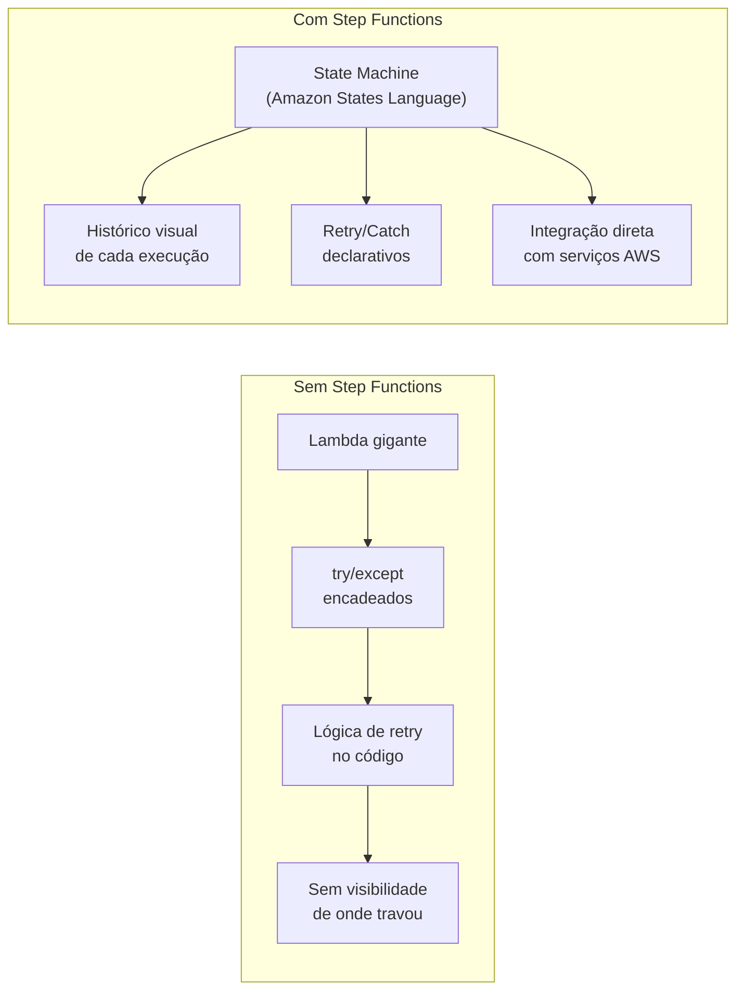
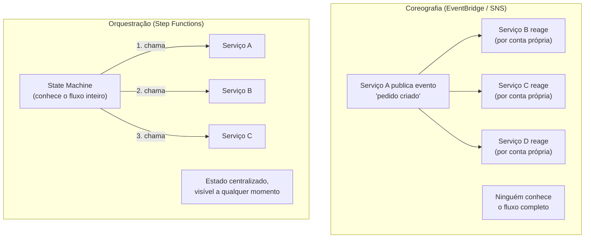
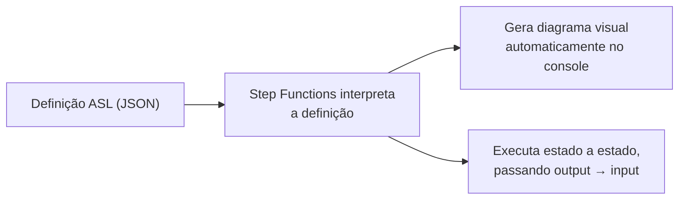
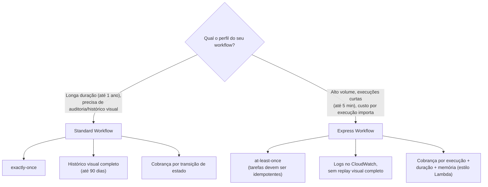
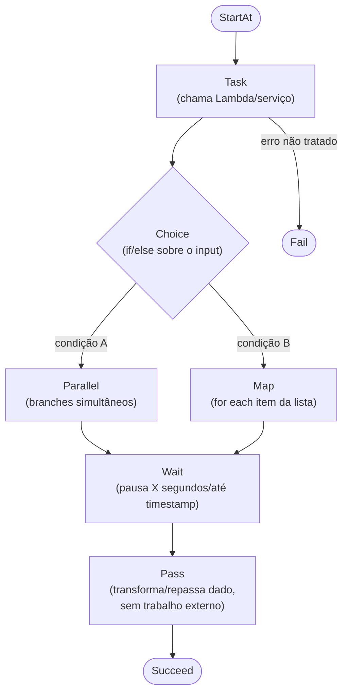
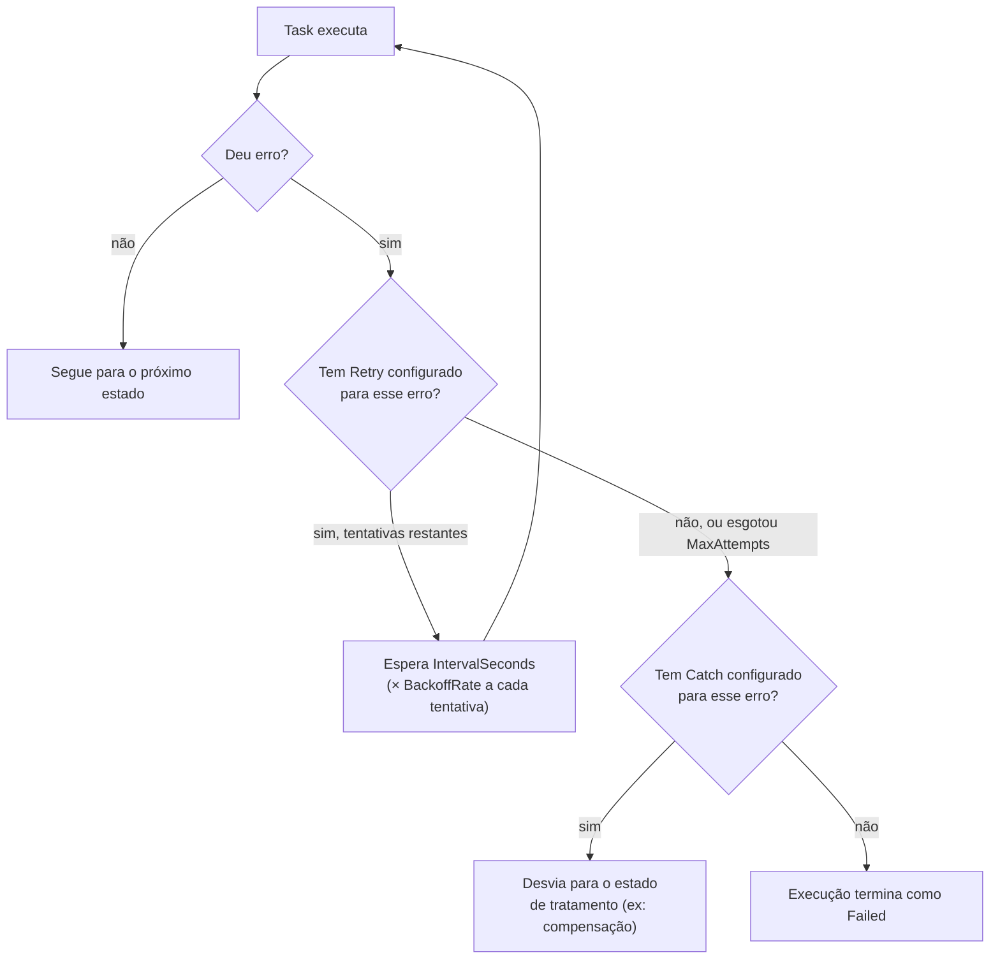
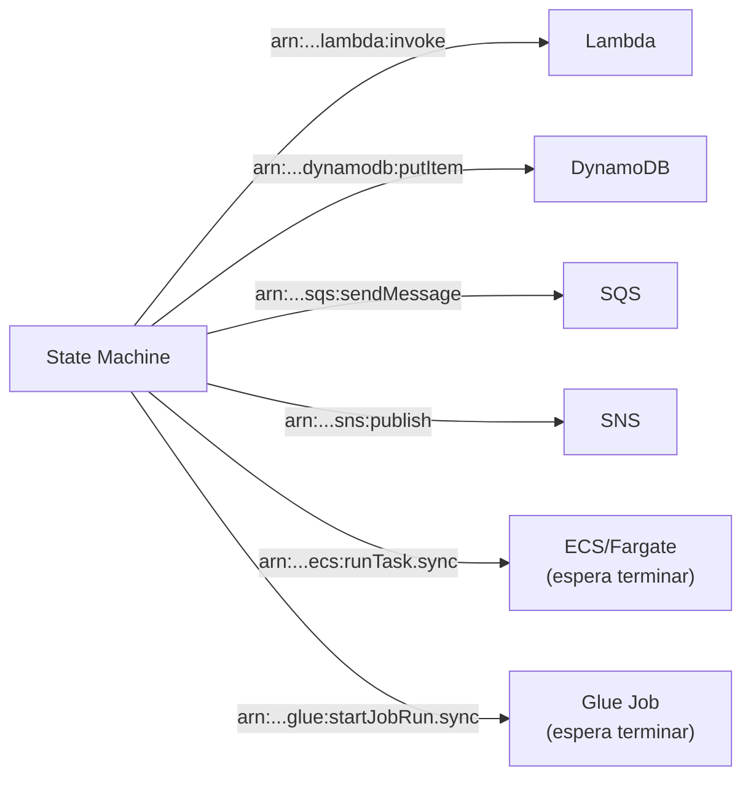
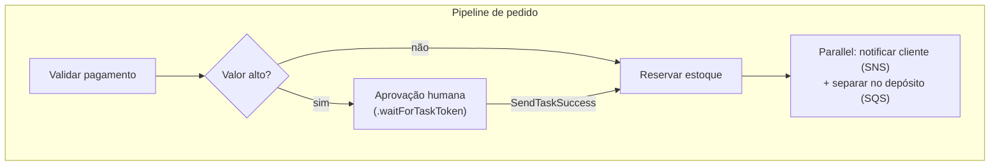
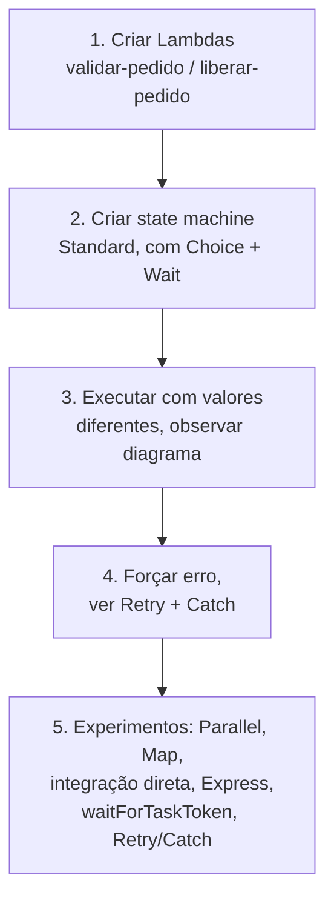

# Step Functions — Guia Completo (Teoria + Prática + Dia a Dia)

## 0. O problema que o Step Functions resolve

Imagine um pipeline de processamento de pedido: validar pagamento, reservar estoque, chamar um serviço de fraude, esperar aprovação humana se o valor for alto, notificar o cliente, e só então liberar o envio. Se cada uma dessas etapas é uma Lambda, alguém precisa decidir *quem chama quem*, *o que acontece se uma etapa falhar*, *como tentar de novo*, e *como saber em que ponto do processo um pedido específico está agora*.

A abordagem ingênua é colocar tudo dentro de uma única Lambda gigante, com `try/except` encadeados chamando a próxima etapa. Isso funciona até o dia em que você precisa saber "por que o pedido #4821 travou ontem às 15h", ou até o dia em que uma etapa demora 40 minutos (mais que o timeout máximo de 15 minutos da Lambda), ou até você precisar que um humano aprove manualmente no meio do fluxo.

O **Step Functions** resolve isso tirando a lógica de orquestração *de dentro do código* e colocando ela numa **definição declarativa** (a state machine). Cada etapa (Lambda, chamada a outro serviço AWS, espera, decisão condicional) vira um **estado** nomeado, com transições explícitas entre eles. O serviço mantém o **histórico completo de execução** — você abre o console e vê visualmente exatamente por onde aquela execução passou, quanto tempo cada etapa levou, e onde exatamente falhou.


*Orquestração declarativa tira a lógica de "quem chama quem" e "o que fazer se falhar" de dentro do código.*

---

## 1. Orquestração vs Coreografia — a diferença fundamental

Essa é a distinção mais cobrada na prova quando o assunto é Step Functions, e também a que mais importa no dia a dia para decidir a arquitetura certa.

**Coreografia** (o padrão usado por EventBridge, SNS, SQS): cada componente do sistema **reage a eventos** de forma independente, sem que exista um "maestro" central. O serviço A publica um evento ("pedido criado"), e os serviços B, C e D que estão interessados nesse evento reagem cada um por conta própria. Ninguém sabe o fluxo completo — o conhecimento do processo está **espalhado** entre os componentes.

**Orquestração** (o padrão do Step Functions): existe um **componente central** (a state machine) que conhece o fluxo inteiro, do início ao fim, e **comanda** explicitamente cada etapa: "agora chama o serviço A, espera a resposta, se der certo chama B, se der erro chama C". O conhecimento do processo está **centralizado** num único lugar.

**Por que isso importa na prática:** coreografia é mais desacoplada (os serviços nem sabem uns dos outros) e escala bem para sistemas orientados a eventos com muitos consumidores independentes — mas fica difícil responder "qual é o estado atual do pedido #4821?" porque não existe um lugar único que sabe isso. Orquestração te dá visibilidade e controle centralizados — fica trivial responder essa pergunta — mas cria um ponto de acoplamento maior (a state machine precisa conhecer todos os passos).

**No dia a dia:** as duas abordagens convivem no mesmo sistema, não são mutuamente exclusivas. É comum, por exemplo, a state machine do Step Functions ao final do seu fluxo publicar um evento no EventBridge para que outros times/sistemas desacoplados reajam — orquestração *dentro* do processo de negócio, coreografia *entre* sistemas diferentes.


*Coreografia distribui o conhecimento do processo; orquestração o centraliza numa state machine.*

**O que muita gente erra na prova:** achar que orquestração é sempre "melhor" ou sempre "pior" que coreografia. A prova costuma testar se você sabe identificar qual padrão se encaixa no cenário descrito — fluxo de negócio complexo com múltiplas etapas dependentes e necessidade de rastreabilidade → orquestração (Step Functions); sistema de notificação desacoplado, fan-out para múltiplos consumidores independentes → coreografia (SNS/EventBridge).

---

## 2. State Machines e Amazon States Language (ASL)

Uma state machine é definida em **JSON**, seguindo a especificação **Amazon States Language (ASL)**. Cada "bloco" da definição é um **estado**, com um nome único, um `Type`, e regras de transição (`Next`, ou `End: true` quando é o último estado).

Estrutura mínima de uma definição:

```json
{
  "Comment": "Pipeline de processamento de pedido",
  "StartAt": "ValidarPagamento",
  "States": {
    "ValidarPagamento": {
      "Type": "Task",
      "Resource": "arn:aws:lambda:us-east-1:123456789012:function:validar-pagamento",
      "Next": "ReservarEstoque"
    },
    "ReservarEstoque": {
      "Type": "Task",
      "Resource": "arn:aws:lambda:us-east-1:123456789012:function:reservar-estoque",
      "End": true
    }
  }
}
```

Pontos-chave da definição:
- `StartAt` diz qual estado executa primeiro.
- Cada estado tem um `Type` (Task, Choice, Parallel, Map, Wait, Pass, Succeed, Fail — ver seção 4).
- O **input** de um estado é o output do estado anterior (a menos que você use `InputPath`/`OutputPath`/`ResultPath` para filtrar/combinar o que passa adiante) — isso é o "encadeamento de dados" que substitui você ter que salvar e recuperar contexto manualmente entre chamadas.
- A definição inteira é versionada e você pode ver, no console, o **diagrama visual gerado automaticamente** a partir dela — é literalmente o mesmo JSON virando um fluxograma clicável.


*A mesma definição JSON alimenta tanto a execução quanto a visualização gráfica no console.*

**No dia a dia:** você raramente escreve o JSON inteiro à mão do zero — o **Workflow Studio** (editor visual no console) monta a definição arrastando e soltando estados, e você ajusta detalhes finos no JSON depois. Ainda assim, entender a estrutura do ASL é essencial para debugar e para revisar em pull requests, já que a definição normalmente vive versionada num template de CloudFormation/CDK/Terraform.

---

## 3. Standard Workflows vs Express Workflows

O Step Functions oferece dois "tipos" de workflow, otimizados para cenários bem diferentes. Escolher o errado é um erro comum tanto de prova quanto de arquitetura real.

### Standard Workflows
É o modelo original, pensado para processos de **longa duração** (até 1 ano de execução) e onde **correção e auditabilidade** importam mais que volume/custo por execução.

- Garantia **exactly-once**: cada etapa executa exatamente uma vez (não duplica execução em cenários de retry interno do serviço).
- Mantém o **histórico visual completo** de cada execução por até 90 dias — você abre qualquer execução passada e vê o caminho exato que ela percorreu, estado por estado, com input/output de cada um.
- Cobrança **por transição de estado** (cada passagem de um estado para o próximo conta).

**Uso real:** fluxos de aprovação, orquestração de pipelines de dados/ETL, processos de negócio de longa duração (ex: um pedido que espera confirmação de pagamento assíncrona por horas), qualquer cenário onde você vai precisar *auditar* exatamente o que aconteceu depois.

### Express Workflows
Criado depois, para resolver o caso de **alta taxa de eventos** processados rapidamente (até 5 minutos de duração) — pense em milhares/milhões de execuções por segundo, cada uma curta.

- Garantia **at-least-once**: em cenários de falha/retry internos, uma etapa *pode* executar mais de uma vez — por isso as tarefas idealmente devem ser **idempotentes** quando usadas em Express Workflows.
- **Não mantém o histórico visual completo** da mesma forma — os logs vão para o CloudWatch Logs (você configura o nível de log: `ALL`, `ERROR`, `FATAL`, `OFF`), mas não existe aquele "replay visual" estado a estado como no Standard.
- Muito mais **barato** por execução, porque a cobrança é baseada em número de execuções + duração + memória consumida (parecido com o modelo de cobrança da Lambda), não por transição de estado.
- Dois submodos: **Synchronous** (quem chama espera a resposta final, útil quando outro serviço precisa do resultado imediatamente) e **Asynchronous** (dispara e não espera, parecido com o Standard).

**Uso real:** processamento de eventos de IoT em alto volume, transformação de dados em streaming, backend de microsserviço que processa requisições rápidas em grande escala.


*Standard prioriza correção e auditabilidade; Express prioriza volume e custo por execução.*

### Tabela comparativa

| Característica | Standard Workflow | Express Workflow |
|---|---|---|
| Duração máxima de execução | Até 1 ano | Até 5 minutos |
| Garantia de execução | Exactly-once | At-least-once (idempotência recomendada) |
| Histórico visual de execução | Completo, até 90 dias, no console | Não — logs vão para CloudWatch Logs |
| Modelo de cobrança | Por transição de estado | Por execução + duração + memória |
| Taxa de eventos suportada | Moderada | Alta (milhares/milhões por segundo) |
| Modo síncrono disponível | Não (sempre assíncrono) | Sim (Synchronous e Asynchronous) |
| Uso típico | Aprovação humana, ETL, pedidos de e-commerce | IoT em alta escala, streaming, backends de alto volume |

**Pegadinha clássica de prova:** a prova costuma descrever um cenário de "milhões de eventos por segundo, processamento rápido, custo é fator crítico" e espera que você reconheça **Express**, mesmo que o texto não use a palavra "express" — e o oposto para cenários de "fluxo de negócio de longa duração com aprovação humana" apontando para **Standard**.

---

## 4. Tipos de estado

Cada estado na ASL tem um `Type`. Esses são os principais:

| Tipo | O que faz |
|---|---|
| **Task** | Executa um trabalho — chama uma Lambda, um serviço AWS integrado diretamente, ou uma atividade (worker externo). É o "verbo" da state machine. |
| **Choice** | Ramifica o fluxo com base em condições sobre o input (ex: `if valor > 1000 then AprovacaoManual else LiberarAutomatico`). É o `if/else` da state machine. |
| **Parallel** | Executa múltiplos ramos (branches) **em paralelo**, dentro da própria definição — cada branch é uma sub-state-machine completa. Só avança quando todos os branches terminam. |
| **Map** | Aplica o mesmo conjunto de estados a **cada item de uma lista** — como um `for each`. Pode rodar os itens em paralelo (com um limite de concorrência configurável) ou sequencialmente. Desde o lançamento do **Distributed Map**, suporta processar milhões de itens (ex: cada linha de um arquivo gigante no S3) com concorrência massiva. |
| **Wait** | Pausa a execução por um tempo fixo (`Seconds`) ou até um timestamp específico (`Timestamp`) antes de seguir para o próximo estado. |
| **Pass** | Não faz trabalho nenhum — só passa o input adiante (opcionalmente transformando ou injetando dados fixos). Útil para testar/montar a estrutura do fluxo antes de plugar a lógica real, ou para transformar o payload sem chamar nenhum serviço externo. |
| **Succeed** | Termina a execução com sucesso imediatamente (estado terminal). |
| **Fail** | Termina a execução com falha imediatamente, com um `Error` e `Cause` customizados (estado terminal). |


*Os oito tipos de estado e como eles costumam se encadear num fluxo real.*

**No dia a dia:** `Map` com Distributed Map é extremamente usado em pipelines de dados — por exemplo, processar cada arquivo dentro de um bucket S3 com milhares de objetos, disparando uma Lambda por arquivo com controle de concorrência, sem você ter que escrever nenhuma lógica de loop/fila manual.

---

## 5. Tratamento de erro: Retry e Catch

Um dos maiores motivos para usar Step Functions em vez de código customizado é que **retry e tratamento de erro são declarativos**, direto na definição do estado — você não escreve loop de `try/except` com backoff manual.

### Retry
Um estado `Task` (ou `Parallel`/`Map`) pode ter um bloco `Retry` listando quais erros tentar de novo, quantas vezes, e com qual backoff:

```json
"ValidarPagamento": {
  "Type": "Task",
  "Resource": "arn:aws:lambda:us-east-1:123456789012:function:validar-pagamento",
  "Retry": [
    {
      "ErrorEquals": ["States.TaskFailed"],
      "IntervalSeconds": 2,
      "MaxAttempts": 3,
      "BackoffRate": 2.0
    }
  ],
  "Catch": [
    {
      "ErrorEquals": ["States.ALL"],
      "Next": "NotificarFalhaPagamento"
    }
  ],
  "Next": "ReservarEstoque"
}
```

- `IntervalSeconds`: espera inicial antes da primeira nova tentativa.
- `MaxAttempts`: quantas vezes tenta de novo antes de desistir e propagar o erro.
- `BackoffRate`: multiplicador exponencial do intervalo a cada tentativa (2.0 = dobra o tempo de espera a cada retry — exponential backoff embutido, sem você escrever essa lógica).

### Catch
Se o erro esgotar todas as tentativas de `Retry` (ou não houver `Retry` configurado), o `Catch` captura o erro e desvia o fluxo para outro estado — em vez de a execução inteira falhar, você pode rotear para um estado de compensação/notificação (`NotificarFalhaPagamento` no exemplo acima), implementando o padrão **Saga** de compensação em transações distribuídas.

`ErrorEquals` aceita tanto erros predefinidos do Step Functions (`States.ALL`, `States.Timeout`, `States.TaskFailed`, etc) quanto erros customizados lançados pela própria Lambda/serviço integrado.


*Retry tenta de novo antes de desistir; Catch desvia o fluxo em vez de deixar a execução inteira falhar.*

**No dia a dia:** é comum ter um `Retry` genérico para erros transitórios (throttling, timeout de rede) e um `Catch` com `States.ALL` no final como "rede de segurança", levando para um estado que registra o erro (ex: grava num DynamoDB de auditoria ou publica num tópico SNS de alerta) antes de finalizar como `Fail`.

---

## 6. Integração direta com serviços AWS (sem Lambda no meio)

Assim como o API Gateway pode chamar serviços AWS diretamente sem Lambda, o Step Functions tem o mesmo conceito, chamado de **AWS SDK Service Integrations** (ou "service integrations" de forma mais ampla). Um estado `Task` pode apontar direto para a API de outro serviço — `Resource` vira algo como `arn:aws:states:::dynamodb:putItem` ou `arn:aws:states:::sqs:sendMessage` — em vez de apontar para uma Lambda que só repassaria a chamada.

Serviços com integração direta amplamente suportada:
- **Lambda** — `arn:aws:states:::lambda:invoke`
- **ECS/Fargate** — rodar uma task e, com `.sync`, esperar ela terminar antes de seguir
- **SQS** — enviar mensagem para uma fila
- **SNS** — publicar numa fila/tópico
- **DynamoDB** — `putItem`, `getItem`, `updateItem`, etc, direto
- **Glue** — disparar um job de ETL e, com `.sync`, esperar o job terminar

O sufixo **`.sync`** no ARN do recurso é um detalhe importante: em vez de só disparar a chamada e seguir para o próximo estado imediatamente (fire-and-forget), o Step Functions **espera o serviço terminar o trabalho** (ex: esperar a task do ECS ou o job do Glue finalizar) antes de avançar — sem você precisar implementar polling manual.

**Por que isso é poderoso no dia a dia:** elimina Lambdas que só existiam para fazer "ponte" — ex: uma Lambda cujo único trabalho era `dynamodb.put_item()`. Isso reduz custo, reduz um ponto de falha a menos, e reduz latência (menos um salto de invocação). É o mesmo racional do "Lambda-less" mencionado no contexto do API Gateway, aplicado à orquestração.


*Integração direta elimina a necessidade de uma Lambda "ponte" só para chamar outro serviço AWS.*

---

## 7. Casos de uso reais

### Pipeline de processamento de pedido (e-commerce)
`ValidarPagamento` (Task/Lambda) → `Choice` (valor alto? vai para aprovação manual) → `AprovacaoHumana` (Task com `.waitForTaskToken`, pausa até alguém aprovar via um link/console externo) → `ReservarEstoque` (Task direto no DynamoDB) → `Parallel` (notificar cliente por e-mail via SNS **e** disparar separação no depósito via SQS, simultaneamente) → `Succeed`.

### Orquestração de ETL
`Choice` decide qual pipeline rodar → `Map` (Distributed Map) processa cada arquivo bruto no S3 em paralelo, chamando um Glue Job por arquivo com `.sync` → `Task` consolida o resultado → `Task` atualiza um catálogo/tabela final → notificação de conclusão.

### Aprovação humana no meio do fluxo
Esse padrão usa o recurso **`.waitForTaskToken`**: o Step Functions chama um serviço (por exemplo, publica numa fila SQS ou manda um e-mail via SNS com um link) e **pausa a execução indefinidamente**, guardando um *token* de callback. A execução só continua quando algum sistema externo (ex: uma Lambda acionada por um clique num link de aprovação, ou uma API chamada por um humano no console de aprovação) chama de volta `SendTaskSuccess`/`SendTaskFailure` com aquele token. Isso resolve exatamente o problema de "preciso esperar um humano decidir algo, e isso pode levar horas ou dias" — sem manter nenhum processo rodando e cobrando enquanto espera.


*Aprovação humana usa `.waitForTaskToken` — a execução pausa sem custo até o callback externo chegar.*

**No dia a dia:** `.waitForTaskToken` é o mecanismo-chave para qualquer fluxo que dependa de algo fora do controle imediato do sistema — não só aprovação humana, mas também esperar o resultado de um processo batch de terceiros, ou uma etapa que só um outro time consegue confirmar manualmente.

---

## 8. Conexão com os domínios da prova

- **Resiliência:** Step Functions é o serviço central para orquestrar workflows tolerantes a falha — Retry/Catch nativos, garantias exactly-once/at-least-once, e histórico de execução para auditoria e recuperação de incidentes.
- **Segurança:** cada state machine assume uma **IAM Role** própria, que precisa ter permissão explícita para invocar cada Lambda/serviço integrado (least privilege) — é comum errar isso no dia a dia esquecendo de dar permissão pra um novo serviço integrado.
- **Performance:** Express Workflows existem justamente para cenários de altíssima taxa de eventos onde performance/custo por execução é crítico; Distributed Map processa milhões de itens com concorrência controlada.
- **Custo:** Standard cobra por transição de estado (fica caro em fluxos com muitas transições e alto volume); Express cobra por execução+duração+memória (mais barato em alto volume, mas cada execução precisa ser curta).

---

# 🧪 Laboratório prático (para executar na AWS)

## Objetivo
Criar uma Standard Workflow simples que valida um pedido, decide entre aprovação automática ou manual, e testar as duas execuções.

### Passo 1 — Criar as Lambdas de apoio
Console → Lambda → **Create function**, duas funções simples:

```python
# validar-pedido
def lambda_handler(event, context):
    valor = event.get("valor", 0)
    return {"valor": valor, "valido": True}
```

```python
# liberar-pedido
def lambda_handler(event, context):
    return {"status": "liberado", "valor": event.get("valor")}
```

### Passo 2 — Criar a state machine
Console → Step Functions → **Create state machine** → Workflow Studio (Blank template) → Type: **Standard**

Defina no editor de código (ASL):

```json
{
  "Comment": "Pipeline de pedido - lab",
  "StartAt": "ValidarPedido",
  "States": {
    "ValidarPedido": {
      "Type": "Task",
      "Resource": "arn:aws:lambda:us-east-1:{account-id}:function:validar-pedido",
      "Retry": [
        { "ErrorEquals": ["States.TaskFailed"], "IntervalSeconds": 2, "MaxAttempts": 2, "BackoffRate": 2.0 }
      ],
      "Next": "ValorAlto"
    },
    "ValorAlto": {
      "Type": "Choice",
      "Choices": [
        { "Variable": "$.valor", "NumericGreaterThan": 1000, "Next": "AprovacaoManual" }
      ],
      "Default": "LiberarPedido"
    },
    "AprovacaoManual": {
      "Type": "Wait",
      "Seconds": 10,
      "Next": "LiberarPedido"
    },
    "LiberarPedido": {
      "Type": "Task",
      "Resource": "arn:aws:lambda:us-east-1:{account-id}:function:liberar-pedido",
      "End": true
    }
  }
}
```

- Role de execução: deixe o console criar uma role nova (ele já inclui permissão de invocar as Lambdas referenciadas).

### Passo 3 — Executar e observar
**Start execution**, com input:
```json
{ "valor": 1500 }
```
Observe no console o **diagrama visual** iluminando cada estado percorrido, e o passo `AprovacaoManual` (Wait) sendo atingido por causa do valor alto.

Rode de novo com `{ "valor": 100 }` e compare o caminho percorrido.

### Passo 4 — Forçar um erro e ver o Catch
Adicione um `Catch` no estado `ValidarPedido` apontando para um novo estado `Fail` do tipo `Fail`, altere a Lambda para lançar uma exceção proposital, e rode de novo — observe no histórico o `Retry` acontecendo antes do `Catch` desviar o fluxo.

### Passo 5 — Experimentos para fixar cada conceito
1. **Parallel:** adicione um estado `Parallel` depois de `LiberarPedido` com dois branches (ex: "notificar" e "registrar log"), e veja os dois branches rodando simultaneamente no diagrama.
2. **Map:** troque o input para uma lista de pedidos (`{"pedidos": [{"valor": 100}, {"valor": 2000}]}`) e adicione um estado `Map` que itera sobre `$.pedidos`, aplicando o mesmo sub-fluxo a cada item.
3. **Integração direta sem Lambda:** troque `LiberarPedido` para gravar direto no DynamoDB (`arn:aws:states:::dynamodb:putItem`) em vez de chamar a Lambda, e compare a definição.
4. **Express Workflow:** crie uma segunda state machine idêntica, mas do tipo **Express**, dispare 20 execuções em sequência via CLI, e compare no CloudWatch Logs (não vai ter o histórico visual completo como no Standard).
5. **`.waitForTaskToken`:** troque `AprovacaoManual` para um estado `Task` apontando pra uma fila SQS com `.waitForTaskToken`, e manualmente chame `send-task-success` via CLI para liberar a execução — sinta a diferença de "espera indefinida sem custo rodando" comparado ao `Wait` fixo.
6. **Retry/Catch:** ajuste `MaxAttempts` e `BackoffRate` no estado `ValidarPedido`, force falha, e observe no histórico o tempo entre cada tentativa dobrando.


*Sequência dos passos do laboratório prático.*

---

## Comandos AWS CLI úteis

```bash
# Criar a state machine a partir de um arquivo JSON local
aws stepfunctions create-state-machine \
  --name "pipeline-pedido-cli" \
  --definition file://definicao.json \
  --role-arn arn:aws:iam::{account-id}:role/StepFunctionsExecutionRole \
  --type STANDARD

# Iniciar uma execução
aws stepfunctions start-execution \
  --state-machine-arn arn:aws:states:us-east-1:{account-id}:stateMachine:pipeline-pedido-cli \
  --input '{"valor": 1500}'

# Ver o histórico de uma execução específica
aws stepfunctions get-execution-history \
  --execution-arn arn:aws:states:us-east-1:{account-id}:execution:pipeline-pedido-cli:{execution-id}

# Listar execuções por status
aws stepfunctions list-executions \
  --state-machine-arn arn:aws:states:us-east-1:{account-id}:stateMachine:pipeline-pedido-cli \
  --status-filter FAILED

# Liberar uma execução pausada em .waitForTaskToken
aws stepfunctions send-task-success \
  --task-token "{token}" \
  --task-output '{"aprovado": true}'
```

---

## Tabela de decisão rápida (prova + dia a dia)

| Cenário | Resposta provável |
|---|---|
| Fluxo de negócio de longa duração, precisa de auditoria detalhada | Standard Workflow |
| Milhões de eventos curtos por segundo, custo por execução crítico | Express Workflow |
| Processo precisa esperar aprovação humana por horas/dias | `.waitForTaskToken` (Standard) |
| Aplicar mesma lógica a cada item de uma lista grande | Estado `Map` (Distributed Map para milhões de itens) |
| Executar múltiplas etapas independentes ao mesmo tempo | Estado `Parallel` |
| Chamar SQS/DynamoDB/SNS sem precisar de Lambda no meio | AWS SDK Service Integration direta |
| Sistema desacoplado, múltiplos consumidores reagindo a um evento | Coreografia (EventBridge/SNS), não Step Functions |
| Processo com "quem sabe o fluxo inteiro" centralizado e rastreável | Orquestração (Step Functions) |
| Tentar de novo automaticamente em erro transitório, com backoff | `Retry` no estado |
| Desviar fluxo para compensação quando um erro não é recuperável | `Catch` no estado |
