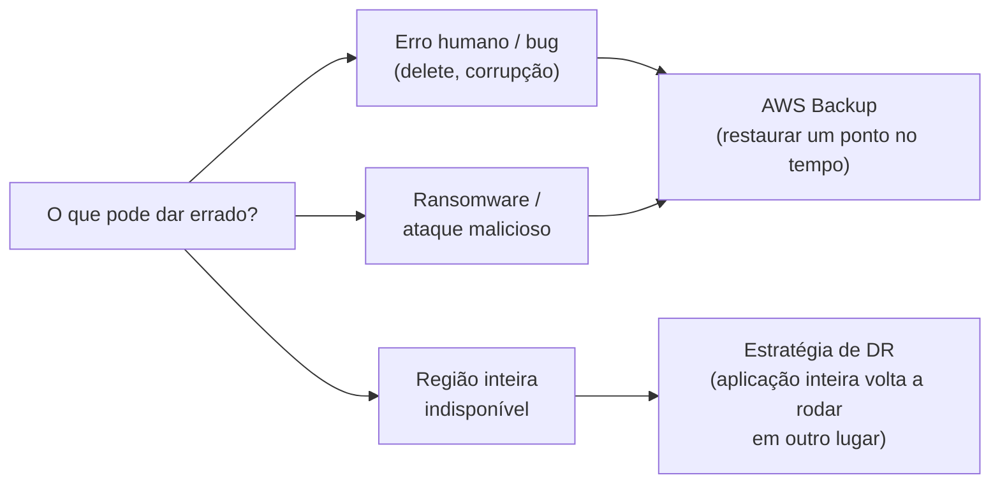
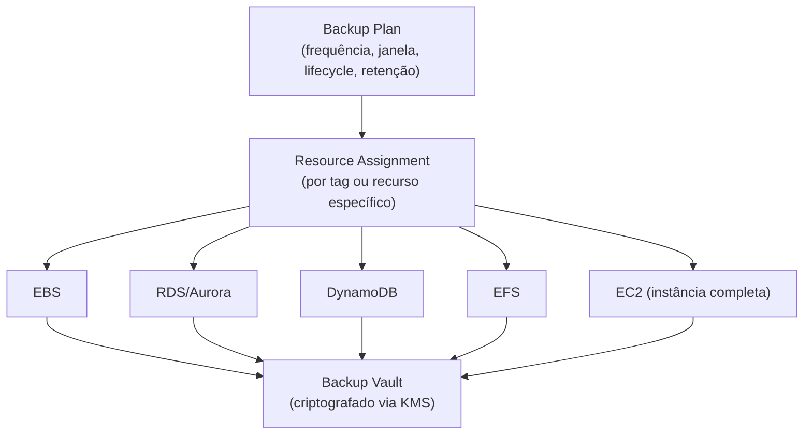
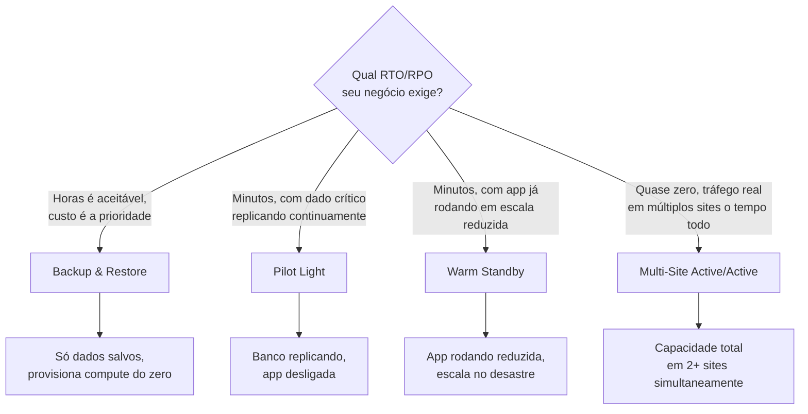
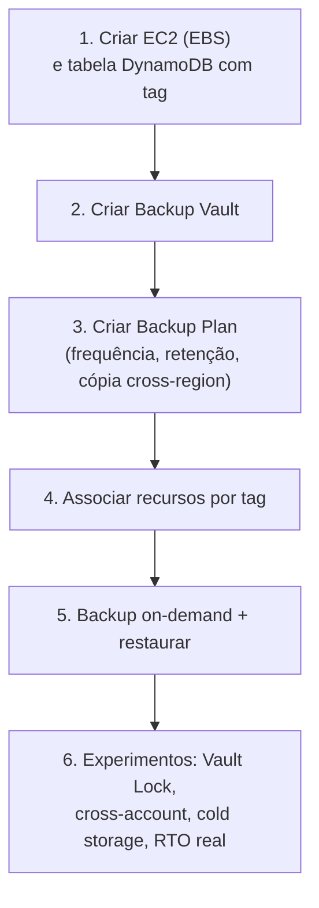

# Backup e Estratégias de Disaster Recovery — Guia Completo (Teoria + Prática + Dia a Dia)

## 0. O problema que backup e DR resolvem

Alta disponibilidade (Multi-AZ, Auto Scaling, load balancer) protege contra a falha de **um componente** — uma instância morre, outra assume. Mas isso não te protege contra: alguém deletar a tabela errada por engano, um bug corromper dados silenciosamente por semanas até alguém notar, ransomware criptografando seus discos, ou a **região inteira** da AWS ficando indisponível (raro, mas já aconteceu).

Para esses cenários você precisa de duas coisas diferentes, que a prova adora confundir:
- **Backup:** uma cópia dos dados em um ponto no tempo, guardada separadamente, para você conseguir **restaurar** algo que foi perdido ou corrompido.
- **Disaster Recovery (DR):** um plano de como sua **aplicação inteira** volta a funcionar se a região/datacenter principal cair — não é só sobre dados, é sobre ter capacidade de computação pronta (ou quase pronta) em outro lugar.

Backup é sobre **o que** você recupera. DR é sobre **quão rápido** e **com que perda** você volta a operar. Os dois se conectam, mas resolvem perguntas diferentes.


*Backup resolve "recuperar dados perdidos/corrompidos"; DR resolve "aplicação inteira volta a funcionar em outra região".*

---

## 1. AWS Backup — backup centralizado multi-serviço

Antes do AWS Backup existir, cada serviço tinha seu próprio mecanismo de backup isolado: snapshot de EBS, snapshot de RDS, backup do DynamoDB, backup do EFS — cada um configurado, agendado e monitorado separadamente. Em uma arquitetura real com dezenas de recursos espalhados, isso vira um pesadelo operacional: não existe um lugar único para saber "está tudo com backup em dia?".

O **AWS Backup** centraliza isso: um serviço só, com **políticas declarativas** (backup plans), que cobre múltiplos serviços AWS de uma vez:

| Serviço coberto | Observação |
|---|---|
| EBS (volumes) | Snapshot incremental, igual ao mecanismo nativo, mas orquestrado centralmente |
| RDS (e Aurora) | Inclui bancos com criptografia |
| DynamoDB | Backup completo da tabela, sem impacto de performance na tabela em produção |
| EFS | Backup incremental dos arquivos |
| FSx | Windows File Server, Lustre, etc |
| EC2 (instância inteira, não só volume) | Backup de todos os volumes anexados de forma consistente |
| Storage Gateway | Volumes de gateway |
| S3 | Backup contínuo com point-in-time recovery |

### Conceitos centrais

**Backup Plan:** a política que diz *o quê*, *quando* e *por quanto tempo* fazer backup — frequência (ex: diário às 5h), janela de execução, regras de lifecycle (quando mover para armazenamento mais frio) e regras de retenção (quando expirar).

**Backup Vault:** o "cofre" lógico onde os backups ficam armazenados, com suas próprias políticas de acesso (via IAM e Vault Lock — ver seção 1.3) e criptografia (KMS).

**Resource assignment (tags):** em vez de selecionar recursos um a um, você associa um backup plan a **tags** (ex: tudo com a tag `Backup: daily`) — qualquer recurso novo que já nasça com essa tag entra automaticamente no plano, sem trabalho manual.


*Um backup plan aplicado por tag cobre múltiplos serviços automaticamente, centralizando tudo num vault.*

### 1.1 Cópia cross-region e cross-account

Um backup plan pode incluir uma regra de **cópia automática** para outra região (proteção contra desastre regional) ou outra conta AWS (proteção contra comprometimento da conta — se um atacante ganha acesso à conta de produção e apaga tudo, incluindo backups locais, uma cópia numa conta separada, com permissões distintas, sobrevive).

**No dia a dia:** cross-account é considerado uma prática de segurança madura — times de segurança recomendam que a conta que guarda backups **não seja a mesma conta** onde os recursos de produção vivem, justamente para reduzir o "raio de explosão" de uma conta comprometida ou de um erro de permissão em cascata.

### 1.2 Lifecycle para cold storage

Assim como o S3 tem tiers de armazenamento, o AWS Backup permite mover backups automaticamente para uma camada mais barata e "fria" (**cold storage**) depois de um tempo — por exemplo, "manter 30 dias em armazenamento normal, depois mover para cold storage até completar 1 ano de retenção total". Restaurar de cold storage é possível, mas mais lento — é a mesma lógica de trade-off custo x velocidade de recuperação que aparece no S3 Glacier.

**Detalhe técnico importante:** cada tipo de recurso tem um tempo mínimo antes de poder ir para cold storage (geralmente na casa de dias) — você não move um backup recém-criado direto pro frio.

### 1.3 Vault Lock — imutabilidade contra ransomware

O **AWS Backup Vault Lock** aplica uma política **WORM (Write Once, Read Many)** no vault — uma vez travado, nem o administrador da conta consegue deletar ou reduzir o período de retenção dos backups ali dentro, nem a própria AWS (em modo *compliance*, que é irreversível). Isso é a defesa real contra ransomware que tenta apagar seus backups depois de criptografar seus dados — se o vault está travado, o backup sobrevive mesmo que o atacante tenha credenciais de admin.


*Vault Lock em modo compliance é irreversível — nem a AWS consegue reverter, protegendo contra deleção maliciosa mesmo com credenciais de admin comprometidas.*

---

## 2. RTO e RPO — as duas métricas que definem toda estratégia de DR

Antes de escolher qualquer estratégia de DR, você precisa responder duas perguntas de negócio (não técnicas) — e é isso que RTO e RPO representam.

**RPO (Recovery Point Objective):** quanto de dado você pode se dar ao luxo de **perder**, medido em tempo. Se seu último backup/replicação foi há 1 hora e o desastre acontece agora, você perde os dados dessa última hora — então seu RPO é 1 hora. RPO responde: "até quando no passado eu consigo voltar?"

**RTO (Recovery Time Objective):** quanto tempo sua aplicação pode ficar **fora do ar** até voltar a funcionar. RTO responde: "quanto tempo leva até eu estar operando de novo?"

**Exemplo numérico para fixar:** um e-commerce faz backup do banco de dados a cada 6 horas e, em caso de desastre, leva 4 horas para provisionar tudo do zero em outra região e restaurar o backup mais recente.
- RPO = 6 horas (na pior hipótese, o desastre acontece 1 segundo antes do próximo backup, e você perde até 6h de pedidos).
- RTO = 4 horas (tempo entre o desastre acontecer e o site voltar a aceitar pedidos).

Reduzir RPO exige backups/replicação **mais frequentes**. Reduzir RTO exige capacidade **já pronta** (ou quase pronta) esperando no destino — as duas coisas custam dinheiro, e é exatamente esse trade-off que define as quatro estratégias da próxima seção.


*RPO olha para trás (quanto dado se perde); RTO olha para frente (quanto tempo até voltar a funcionar).*

---

## 3. As quatro estratégias clássicas de DR

Essas quatro estratégias formam um espectro: quanto mais rápido e menos você quer perder, mais caro fica, porque significa manter mais infraestrutura **ociosa** (ou ativa) esperando no site de destino.

### Backup & Restore
A estratégia mais simples e barata: você só mantém **backups** (dados) no destino (ou replicados para lá) — nenhuma infraestrutura de computação rodando ou provisionada de antemão. Se o desastre acontece, você provisiona tudo do zero (infraestrutura como código ajuda muito aqui — ver o próximo arquivo sobre CloudFormation) e restaura os backups.

- **RTO:** horas (provisionar do zero leva tempo).
- **RPO:** depende da frequência do backup — geralmente o pior dos quatro (horas).
- **Custo:** o mais baixo — você só paga por armazenamento de backup, não por computação ociosa.

### Pilot Light
Você mantém um **núcleo mínimo** da infraestrutura crítica já rodando no destino (tipicamente o banco de dados, replicando dados continuamente) mas **sem** os servidores de aplicação rodando — é como a chama piloto de um aquecedor: pequena, consumindo pouco, mas pronta para "acender" o resto rapidamente. Quando o desastre acontece, você escala a infraestrutura de aplicação (que já está definida, só não rodando) rapidamente.

- **RTO:** minutos a poucas horas (só falta subir os servidores de aplicação, o dado já está lá).
- **RPO:** minutos (o banco replica continuamente).
- **Custo:** baixo-médio — paga por réplica de banco + armazenamento, mas quase nada de computação.

### Warm Standby
Uma versão **reduzida, mas totalmente funcional**, do ambiente de produção já rodando no destino — menos instâncias, tamanhos menores, mas capaz de atender tráfego real imediatamente (com performance reduzida) enquanto escala para o tamanho completo. Diferente do Pilot Light, aqui a camada de aplicação **já está rodando**, só que "em escala reduzida".

- **RTO:** minutos.
- **RPO:** segundos a minutos.
- **Custo:** médio-alto — paga por infraestrutura de aplicação rodando o tempo todo, mesmo que reduzida.

### Multi-Site Active/Active
Ambos os sites (ou mais) rodam em **capacidade total simultaneamente**, atendendo tráfego real o tempo todo (ex: via Route 53 com roteamento por latência/geolocalização, ou uma arquitetura ativa-ativa de verdade com escrita nos dois lados). Se um site cai, o tráfego simplesmente é redirecionado para o(s) outro(s), que já estavam prontos e em uso.

- **RTO:** próximo de zero (segundos — é só redirecionar tráfego).
- **RPO:** próximo de zero (dados já estão sincronizados/replicados em tempo real, ou cada site já é fonte de verdade para sua fatia).
- **Custo:** o mais alto — você paga capacidade completa rodando em múltiplos lugares o tempo todo.


*Espectro de decisão: quanto menor o RTO/RPO exigido, mais infraestrutura precisa estar pronta (e paga) de antemão.*

### Tabela comparativa

| Estratégia | Custo | RTO | RPO | Complexidade |
|---|---|---|---|---|
| **Backup & Restore** | Baixo | Horas | Horas (depende da frequência do backup) | Baixa |
| **Pilot Light** | Baixo-médio | Minutos a poucas horas | Minutos | Média |
| **Warm Standby** | Médio-alto | Minutos | Segundos a minutos | Média-alta |
| **Multi-Site Active/Active** | Alto | Próximo de zero (segundos) | Próximo de zero | Alta |

**O que muita gente erra na prova:** achar que existe uma resposta "certa" universal. A resposta certa é sempre **a que atende o RTO/RPO exigido pelo negócio ao menor custo possível** — a prova costuma dar um cenário com números de RTO/RPO explícitos (ou implícitos, tipo "não pode perder mais que alguns segundos de dado") e espera que você calcule qual das quatro estratégias é a mínima suficiente, não a mais robusta possível.

### Diagrama: espectro custo vs velocidade de recuperação


*Quanto mais à direita, mais rápida a recuperação (RTO/RPO menores) e mais caro fica manter a infraestrutura pronta o tempo todo.*

---

## 4. Conexão com os domínios da prova

- **Resiliência:** este é o tópico central do domínio — RTO/RPO e as quatro estratégias aparecem quase garantidamente na prova, muitas vezes como cenário com números específicos para você calcular a estratégia mínima necessária.
- **Segurança:** Vault Lock (imutabilidade WORM) e cópias cross-account de backup são medidas diretas de defesa contra ransomware e comprometimento de conta — um tema recorrente em cenários de segurança da prova.
- **Performance:** estratégias mais "quentes" (Warm Standby, Active/Active) também melhoram performance percebida pelo usuário em operação normal (ex: roteamento por latência do Route 53 já distribuindo carga), não só em desastre.
- **Custo:** todo o desenho dessa seção é fundamentalmente uma decisão de custo — pagar mais por menos risco de downtime/perda de dado é uma escolha de negócio, não só técnica.

---

# 🧪 Laboratório prático (para executar na AWS)

## Objetivo
Configurar um backup plan centralizado no AWS Backup cobrindo um volume EBS e uma tabela DynamoDB, com cópia cross-region, e simular uma restauração.

### Passo 1 — Criar recursos de teste
Console → EC2 → crie uma instância pequena (gera um volume EBS automaticamente) com a tag `Backup: lab-diario`.
Console → DynamoDB → crie uma tabela `pedidos-lab` com a mesma tag `Backup: lab-diario`.

### Passo 2 — Criar um Backup Vault
Console → AWS Backup → **Backup vaults** → **Create Backup vault**
- Nome: `vault-lab-principal`
- Encryption key: use a chave KMS padrão (ou crie uma própria)

### Passo 3 — Criar o Backup Plan
Console → AWS Backup → **Backup plans** → **Create Backup plan** → Build a new plan
- Nome: `plano-lab-diario`
- Regra: frequência diária, janela de início às 05:00, retenção de 35 dias
- **Copy to another Region:** habilite, escolha uma região secundária (ex: `us-west-2` se seu principal for `us-east-1`)

### Passo 4 — Associar recursos por tag
Na seção **Resource assignments** do plano, selecione **Tags** → `Backup = lab-diario`. Isso cobre automaticamente o EBS e a tabela DynamoDB criados no Passo 1, sem selecioná-los manualmente.

### Passo 5 — Disparar um backup on-demand e restaurar
Console → AWS Backup → **Protected resources** → selecione o volume EBS → **Create on-demand backup**.
Depois de concluído, vá em **Backup vaults** → localize o recovery point → **Restore** → escolha criar um novo volume a partir dele.

### Passo 6 — Experimentos para fixar cada conceito
1. **Vault Lock:** aplique uma política de Vault Lock em modo *governance* (reversível, para não travar o lab permanentemente) no `vault-lab-principal` e tente deletar um recovery point antes do prazo de retenção — veja o bloqueio.
2. **Cross-account:** se você tiver uma segunda conta de teste, configure uma regra de cópia cross-account no backup plan e confirme o recovery point aparecendo na conta destino.
3. **Cold storage / lifecycle:** ajuste a regra de lifecycle para mover recovery points para cold storage após alguns dias e observe a mudança de custo estimado no console.
4. **RTO/RPO na prática:** cronometre quanto tempo leva desde clicar em "Restore" até o novo volume/tabela estar disponível — isso é o seu RTO real de restauração via AWS Backup para esse tipo de recurso.
5. **Comparar estratégias de DR:** desenhe (no papel ou em um diagrama) como o mesmo ambiente ficaria em Pilot Light vs Warm Standby — quais recursos ficariam ligados 24/7 em cada caso.


*Sequência dos passos do laboratório prático.*

---

## Comandos AWS CLI úteis

```bash
# Criar um backup vault
aws backup create-backup-vault --backup-vault-name vault-lab-principal

# Criar um backup plan a partir de um arquivo JSON
aws backup create-backup-plan --backup-plan file://backup-plan.json

# Associar recursos ao plano por tag
aws backup create-backup-selection \
  --backup-plan-id {plan-id} \
  --backup-selection '{
    "SelectionName": "selecao-por-tag",
    "IamRoleArn": "arn:aws:iam::{account-id}:role/AWSBackupDefaultServiceRole",
    "ListOfTags": [{"ConditionType": "STRINGEQUALS", "ConditionKey": "Backup", "ConditionValue": "lab-diario"}]
  }'

# Disparar um backup on-demand
aws backup start-backup-job \
  --resource-arn arn:aws:ec2:us-east-1:{account-id}:volume/{volume-id} \
  --iam-role-arn arn:aws:iam::{account-id}:role/AWSBackupDefaultServiceRole \
  --backup-vault-name vault-lab-principal

# Listar recovery points de um vault
aws backup list-recovery-points-by-backup-vault --backup-vault-name vault-lab-principal

# Restaurar um recovery point
aws backup start-restore-job \
  --recovery-point-arn arn:aws:ec2:us-east-1:{account-id}:recovery-point/{recovery-point-id} \
  --iam-role-arn arn:aws:iam::{account-id}:role/AWSBackupDefaultServiceRole \
  --metadata file://restore-metadata.json
```

---

## Tabela de decisão rápida (prova + dia a dia)

| Cenário | Resposta provável |
|---|---|
| Só precisa recuperar dados perdidos/corrompidos pontualmente, sem urgência de app inteira | Backup & Restore |
| Banco precisa estar sempre replicado, mas app pode demorar minutos/horas para subir | Pilot Light |
| App precisa voltar em minutos, mesmo que reduzida no início | Warm Standby |
| Zero tolerância a downtime, tráfego real distribuído entre regiões o tempo todo | Multi-Site Active/Active |
| Proteção contra ransomware que tenta apagar backups mesmo com credenciais de admin | AWS Backup Vault Lock (modo compliance) |
| Proteção contra comprometimento total da conta de produção | Cópia de backup cross-account |
| Cenário descreve "não pode perder mais que X minutos de dado" | Isso é o RPO — escolha a estratégia mínima que atinge esse RPO |
| Cenário descreve "sistema precisa voltar em até X minutos" | Isso é o RTO — escolha a estratégia mínima que atinge esse RTO |
| Backup centralizado cobrindo múltiplos serviços (EBS, RDS, DynamoDB, EFS) numa política só | AWS Backup (backup plan por tag) |
| Reduzir custo de armazenamento de backups antigos sem perder a capacidade de restaurar | Lifecycle para cold storage no backup plan |
