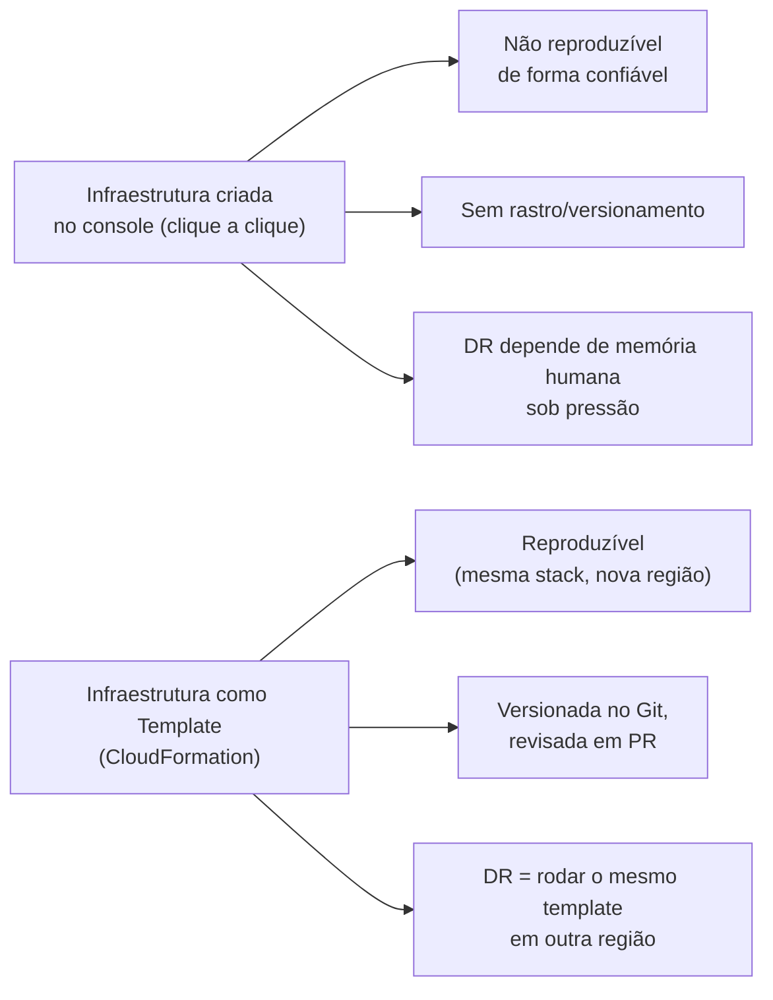
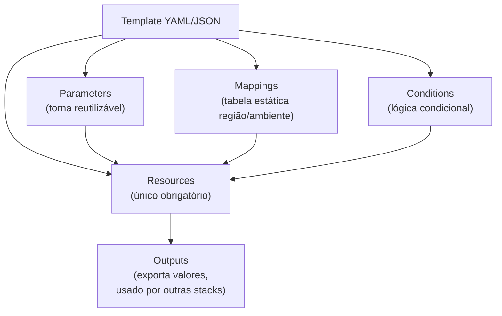
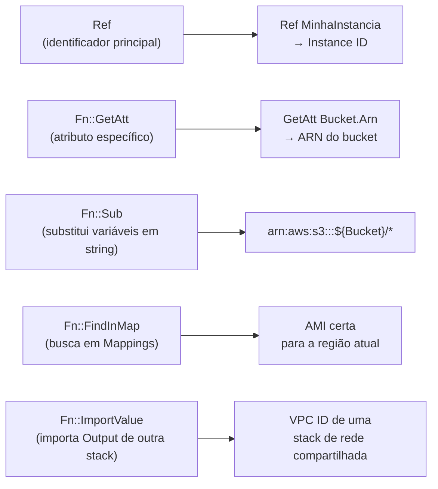
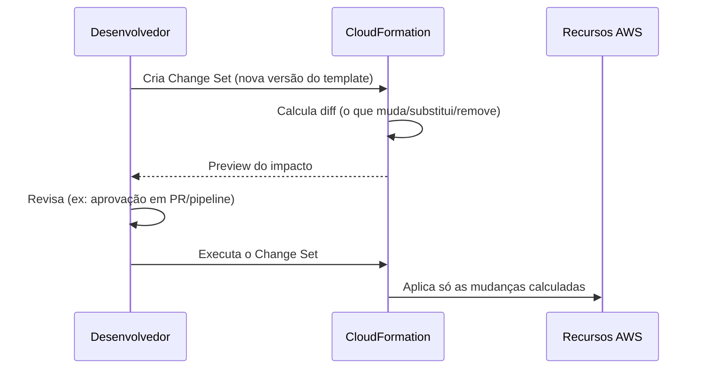
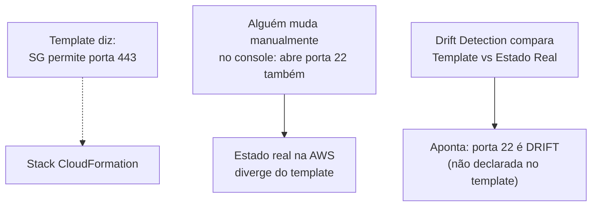
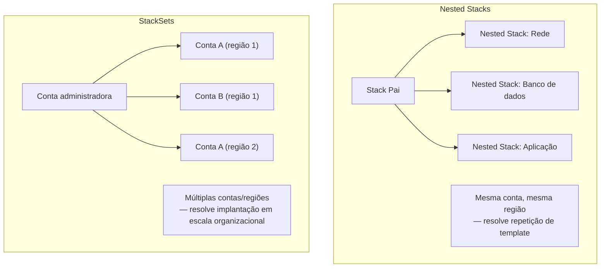
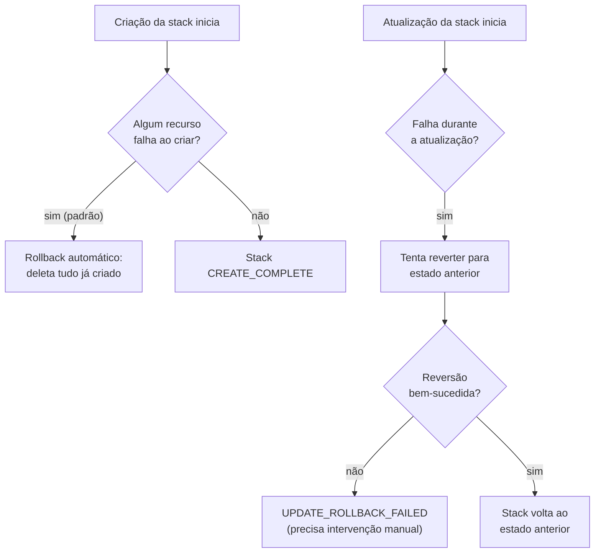
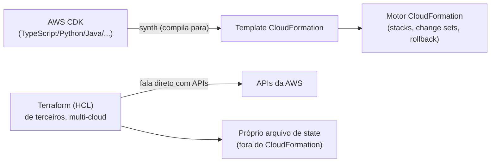
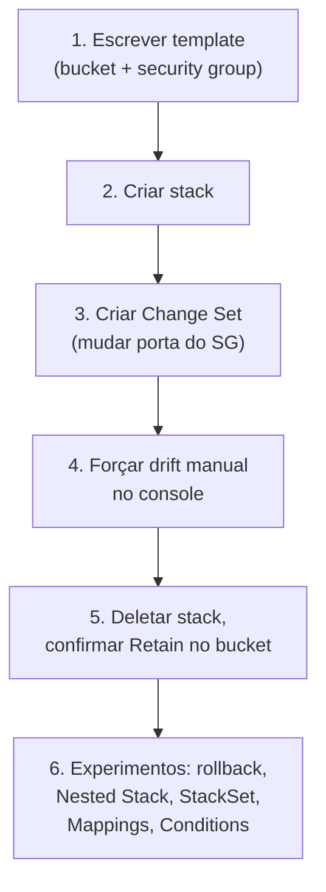

# CloudFormation — Guia Completo (Teoria + Prática + Dia a Dia)

## 0. O problema que Infrastructure as Code resolve

Imagine que você montou toda sua infraestrutura clicando no console: VPC, subnets, security groups, instâncias, load balancer, banco RDS. Funciona. Mas aí acontecem as perguntas inevitáveis: "como reproduzimos exatamente isso em outra região para DR?", "como garantimos que o ambiente de staging é *idêntico* ao de produção?", "quem mudou essa regra de security group semana passada e por quê?".

Clicar no console não deixa **rastro auditável**, não é **reproduzível** de forma confiável (é fácil esquecer um clique, uma configuração), e não tem **versionamento** — você não consegue "dar um `git diff`" na sua infraestrutura.

**Infrastructure as Code (IaC)** resolve isso descrevendo sua infraestrutura inteira como **texto** (JSON/YAML), que você versiona no Git como qualquer código, revisa em pull request, e aplica de forma automatizada e repetível. O **AWS CloudFormation** é o serviço nativo da AWS para isso: você escreve um **template**, a AWS lê o template e provisiona (ou atualiza, ou remove) exatamente os recursos descritos, na ordem certa, respeitando as dependências entre eles.

**Por que isso importa especificamente para resiliência:** reproduzibilidade é o que torna estratégias de DR (Pilot Light, Warm Standby — ver arquivo anterior) *praticáveis* na prática. Se sua infraestrutura de produção é um template CloudFormation, "provisionar tudo do zero em outra região em caso de desastre" vira `aws cloudformation create-stack` numa região diferente, em minutos — em vez de um humano tentando lembrar e recriar manualmente dezenas de recursos sob pressão, no meio de um incidente real.


*IaC transforma "recriar infraestrutura" de um processo manual e arriscado em um comando reproduzível.*

---

## 1. Templates — a estrutura básica

Um template CloudFormation pode ser escrito em **JSON** ou **YAML** (YAML é o mais usado no dia a dia por ser mais legível e permitir comentários). Ele tem seções bem definidas:

```yaml
AWSTemplateFormatVersion: "2010-09-09"
Description: "Template de exemplo - EC2 com security group"

Parameters:
  InstanceTypeParam:
    Type: String
    Default: t3.micro
    AllowedValues: [t3.micro, t3.small, t3.medium]

Mappings:
  RegionMap:
    us-east-1:
      AMI: ami-0abcdef1234567890
    us-west-2:
      AMI: ami-0fedcba0987654321

Conditions:
  IsProducao: !Equals [!Ref "AWS::StackName", "producao"]

Resources:
  MeuSecurityGroup:
    Type: AWS::EC2::SecurityGroup
    Properties:
      GroupDescription: "Libera SSH"
      SecurityGroupIngress:
        - IpProtocol: tcp
          FromPort: 22
          ToPort: 22
          CidrIp: 10.0.0.0/16

  MinhaInstancia:
    Type: AWS::EC2::Instance
    Properties:
      InstanceType: !Ref InstanceTypeParam
      ImageId: !FindInMap [RegionMap, !Ref "AWS::Region", AMI]
      SecurityGroupIds:
        - !GetAtt MeuSecurityGroup.GroupId

Outputs:
  InstanceId:
    Description: "ID da instância criada"
    Value: !Ref MinhaInstancia
```

### Parameters
Entradas que tornam o template **reutilizável** — em vez de hardcodar `t3.micro`, você define um parâmetro e quem for lançar a stack escolhe o valor (com validação via `AllowedValues`, `MinLength`, etc). É o que permite o *mesmo* template servir para dev, staging e produção, só mudando os parâmetros.

### Resources
A única seção **obrigatória** — é a lista de recursos AWS que o CloudFormation vai criar/gerenciar. Cada recurso tem um `Type` (ex: `AWS::EC2::Instance`, `AWS::S3::Bucket`, `AWS::RDS::DBInstance`) e `Properties` específicas daquele tipo de recurso.

### Outputs
Valores que a stack "exporta" depois de criada — úteis para exibir informação (ex: a URL do load balancer criado) ou para outra stack **importar** esse valor via `Fn::ImportValue`, permitindo compor infraestrutura entre stacks diferentes.

### Mappings
Uma tabela de consulta estática (chave → valor), útil para lidar com diferenças entre regiões/ambientes sem precisar de lógica condicional complexa — o exemplo acima usa `Mappings` para escolher a AMI certa dependendo da região onde a stack está sendo lançada, o que é essencial quando seu template precisa funcionar em múltiplas regiões (DR!).

### Conditions
Lógica condicional para decidir **se** um recurso é criado, ou qual valor uma propriedade recebe, dependendo de um parâmetro/contexto (ex: só criar um recurso de monitoramento extra se `IsProducao` for verdadeiro). Isso evita ter templates separados para cada ambiente.


*As seções do template trabalham juntas para tornar a definição reutilizável entre ambientes/regiões.*

---

## 2. Intrinsic Functions — visão geral

O CloudFormation tem um conjunto de **funções embutidas** (intrinsic functions) que resolvem valores dinamicamente durante a criação/atualização da stack, já usadas nos exemplos acima:

| Função | O que faz |
|---|---|
| **`Ref`** | Retorna o valor de um Parameter, ou o identificador "principal" de um Resource (varia por tipo — ex: para um `AWS::EC2::Instance`, `Ref` retorna o Instance ID). |
| **`Fn::GetAtt`** | Retorna um **atributo específico** de um recurso (diferente do `Ref`, que só dá o identificador principal) — ex: `!GetAtt MeuSecurityGroup.GroupId` pega o ID do security group, ou `!GetAtt MeuBucket.Arn` pega o ARN do bucket. |
| **`Fn::Sub`** | Substitui variáveis dentro de uma string — muito usado para montar ARNs ou nomes dinamicamente, ex: `!Sub "arn:aws:s3:::${MeuBucket}/*"`. |
| **`Fn::Join`** | Concatena uma lista de valores com um delimitador — útil antes do `Fn::Sub` existir, ainda usado quando você já tem uma lista dinâmica. |
| **`Fn::FindInMap`** | Busca um valor dentro de um `Mappings`, como no exemplo da AMI por região. |
| **`Fn::If` / `Fn::Equals` / `Fn::Not` / `Fn::And` / `Fn::Or`** | Lógica condicional, usada junto com a seção `Conditions`. |
| **`Fn::ImportValue`** | Importa um valor exportado (`Export`) por outra stack — a forma de compartilhar dados entre stacks independentes. |
| **`Fn::GetAZs`** | Retorna a lista de Availability Zones disponíveis numa região — muito usado para distribuir subnets automaticamente entre AZs sem hardcodar nomes. |

**No dia a dia:** `Ref` e `Fn::GetAtt` são de longe as mais usadas — praticamente todo template tem dezenas delas, conectando a saída de um recurso à entrada de outro (ex: o Security Group ID de um recurso vai como propriedade de outro). `Fn::Sub` é preferida sobre `Fn::Join` em templates modernos por ser mais legível.


*As intrinsic functions mais usadas no dia a dia e o que cada uma resolve.*

---

## 3. Stacks, Change Sets e Drift Detection

### Stacks
Uma **stack** é a unidade de gerenciamento — o conjunto de recursos criados a partir de um template, tratado como uma coisa só. Você cria, atualiza e deleta a stack inteira; o CloudFormation calcula sozinho a **ordem correta** de criação/deleção respeitando as dependências entre recursos (ex: cria o Security Group antes da instância que o referencia).

### Change Sets — preview antes de aplicar
Quando você quer **atualizar** uma stack existente, aplicar a mudança direto é arriscado — você pode não perceber que uma alteração vai **substituir** um recurso (deletar e recriar, com possível perda de dado, ex: mudar certas propriedades de um RDS força recriação) em vez de só atualizar em lugar.

Um **Change Set** resolve isso: você gera um preview de exatamente **o que vai mudar** — quais recursos serão modificados, quais serão substituídos (`Replacement: True`), quais serão removidos — **antes** de aplicar de fato. Só depois de revisar (e idealmente aprovar em pipeline de CI/CD) você executa o change set.


*Change Sets mostram o impacto exato antes de qualquer mudança real ser aplicada — evita surpresas como recriação não intencional de um banco de dados.*

### Drift Detection
Alguém entra no console e muda manualmente uma propriedade de um recurso gerenciado pelo CloudFormation (ex: altera uma regra de security group direto no console, sem passar pelo template). Isso é um **drift** — o estado real na AWS "saiu do trilho" em relação ao que o template declara.

O **Drift Detection** compara o estado atual real de cada recurso da stack com o que o template diz que deveria ser, e aponta exatamente onde há divergência. É essencial para confiar que "o template é a verdade" — sem isso, times perdem a confiança de que atualizar a stack vai se comportar como esperado, porque não sabem o que foi alterado manualmente por fora.

**No dia a dia:** drift é considerado um sinal de processo quebrado — a prática recomendada é **nunca alterar manualmente** um recurso gerenciado por CloudFormation; toda mudança deveria passar pelo template. Drift Detection é a ferramenta para *auditar* se essa disciplina está sendo seguida.


*Drift Detection audita se o estado real dos recursos ainda bate com o que o template declara.*

---

## 4. Nested Stacks vs StackSets

Esses dois conceitos resolvem problemas de escala diferentes, e é comum confundir um com o outro na prova.

### Nested Stacks
Uma stack **dentro** de outra — o template "pai" referencia outros templates como recursos (`AWS::CloudFormation::Stack`), formando uma composição. Isso resolve o problema de **templates gigantes e repetitivos**: em vez de copiar e colar a mesma definição de "uma VPC padrão com subnets" em dez templates diferentes, você isola isso num template reutilizável e cada stack "pai" o referencia como um nested stack.

**Uso real:** decompor uma arquitetura complexa em módulos (rede, banco de dados, aplicação) que podem ser desenvolvidos e testados de forma mais isolada, mas ainda são lançados/atualizados como parte de uma única stack "pai" — tudo dentro da **mesma conta e região**.

### StackSets
Resolve um problema completamente diferente: implantar **a mesma stack em múltiplas contas e/ou múltiplas regiões** de uma vez, a partir de um administrador central — tipicamente integrado com **AWS Organizations**, aplicando automaticamente a recursos novos que entram na organização (ex: toda conta nova que entra numa OU específica já recebe automaticamente as stacks de guardrails de segurança padrão).

**Uso real:** aplicar uma baseline de segurança (ex: CloudTrail habilitado, um Config Rule padrão, um IAM role de auditoria) em **todas as contas** de uma organização com uma única operação, e manter isso sincronizado conforme contas são adicionadas/removidas.


*Nested Stacks compõem templates dentro de uma stack; StackSets replicam uma stack inteira por várias contas/regiões.*

### Tabela comparativa

| Aspecto | Nested Stacks | StackSets |
|---|---|---|
| Escopo | Uma conta, uma região | Múltiplas contas e/ou regiões |
| Problema que resolve | Reuso/modularização de templates | Implantação centralizada em escala |
| Integração comum | — | AWS Organizations |
| Uso típico | Decompor arquitetura complexa em módulos | Baseline de segurança/compliance em toda a organização |

---

## 5. Deletion Policies e comportamento de rollback

### Deletion Policy
Por padrão, quando você **remove** um recurso do template (ou deleta a stack inteira), o CloudFormation **deleta o recurso real na AWS** junto. Isso é perigoso para recursos com dado importante (um banco de dados, um bucket S3 com arquivos). O atributo `DeletionPolicy` controla esse comportamento por recurso:

| Deletion Policy | Comportamento |
|---|---|
| **Delete** (padrão) | Remove o recurso real da AWS junto com a stack/atualização. |
| **Retain** | Mantém o recurso real na AWS, mesmo que ele seja removido da stack — o CloudFormation só "solta a mão" dele, o recurso continua existindo independente. |
| **Snapshot** | Antes de deletar, tira um snapshot final do recurso (suportado por recursos com estado, como RDS, EBS, ElastiCache, Redshift, Aurora) — você perde o recurso, mas fica com um ponto de recuperação. |

**No dia a dia:** é prática comum (e recomendada) configurar `DeletionPolicy: Retain` ou `Snapshot` em qualquer recurso com dado importante (banco de dados, bucket de produção) — isso evita o cenário clássico de "alguém rodou `delete-stack` sem perceber que aquilo incluía o RDS de produção, e perdeu tudo".

### Comportamento de rollback em falha
Se uma **criação** de stack falha no meio do processo (algum recurso não pôde ser criado), o comportamento padrão do CloudFormation é fazer **rollback automático** — ele desfaz e deleta tudo que já havia sido criado até aquele ponto, deixando a conta limpa (sem recursos "meio criados" órfãos). Isso pode ser desabilitado (`--disable-rollback` / `--on-failure DO_NOTHING`) para fins de debug, quando você quer investigar o estado parcial antes de limpar.

Se uma **atualização** de stack falha no meio, o CloudFormation tenta reverter os recursos já alterados de volta ao estado anterior — nem sempre é uma reversão trivial, e em alguns casos a stack pode ficar em um estado `UPDATE_ROLLBACK_FAILED`, exigindo intervenção manual (geralmente via `continue-update-rollback` pulando o recurso problemático).


*Rollback automático protege contra recursos órfãos, mas atualizações complexas às vezes exigem intervenção manual.*

---

## 6. CDK e Terraform — camadas alternativas

**AWS CDK (Cloud Development Kit):** permite escrever a definição de infraestrutura em **linguagens de programação de verdade** (TypeScript, Python, Java, C#, Go) em vez de YAML/JSON puro — com loops, funções, classes reutilizáveis, testes unitários sobre a infraestrutura. Por baixo dos panos, o CDK **compila (`synth`) para um template CloudFormation** — ele não é um serviço concorrente, é uma **camada de abstração em cima** do CloudFormation. Você ganha expressividade de linguagem de programação; a execução real continua sendo o motor do CloudFormation (com stacks, change sets, rollback, tudo igual).

**Terraform:** é uma alternativa de **terceiros** (HashiCorp), multi-cloud (funciona com AWS, Azure, GCP, e dezenas de outros provedores no mesmo código) usando sua própria linguagem declarativa (HCL). Diferente do CDK, Terraform não usa o motor do CloudFormation por baixo — ele fala diretamente com as APIs da AWS e mantém seu próprio arquivo de **state** para rastrear o que foi criado.

**No dia a dia:** a escolha entre CloudFormation/CDK (nativo AWS) e Terraform (multi-cloud, adotado amplamente na indústria) geralmente depende de contexto organizacional — empresas 100% AWS costumam preferir CDK pela integração nativa e suporte de primeira classe da AWS; empresas multi-cloud ou que já têm um time de plataforma usando Terraform tendem a manter Terraform por consistência entre provedores.


*CDK é uma camada de abstração sobre o CloudFormation; Terraform é um motor totalmente independente e multi-cloud.*

---

## 7. Conexão com os domínios da prova

- **Resiliência:** IaC é o que torna DR reproduzível na prática — recriar ambientes inteiros em outra região via template é a base de estratégias como Pilot Light e Warm Standby (ver arquivo anterior). StackSets permitem padronizar guardrails de resiliência em toda a organização.
- **Segurança:** `DeletionPolicy: Retain/Snapshot` evita perda acidental de dado sensível; StackSets aplicam baselines de segurança (ex: CloudTrail, Config Rules) automaticamente a contas novas via Organizations.
- **Performance:** templates reutilizáveis com `Mappings`/`Conditions` garantem que ambientes de diferentes regiões usem os recursos certos (AMI, tipo de instância) sem intervenção manual, reduzindo erro humano que impactaria performance.
- **Custo:** Change Sets evitam substituições acidentais e caras de recursos (ex: recriar um RDS gera downtime e possível perda de configuração); templates versionados facilitam auditoria de "quem criou o quê" para controle de custo.

---

# 🧪 Laboratório prático (para executar na AWS)

## Objetivo
Criar uma stack simples com um bucket S3 e uma instância EC2, praticar um Change Set, forçar um drift, e testar Deletion Policy.

### Passo 1 — Escrever o template
Salve como `template-lab.yaml`:

```yaml
AWSTemplateFormatVersion: "2010-09-09"
Description: "Lab de CloudFormation"

Parameters:
  NomeAmbiente:
    Type: String
    Default: lab

Resources:
  MeuBucket:
    Type: AWS::S3::Bucket
    DeletionPolicy: Retain
    Properties:
      BucketName: !Sub "meu-bucket-lab-${NomeAmbiente}-${AWS::AccountId}"

  MeuSecurityGroup:
    Type: AWS::EC2::SecurityGroup
    Properties:
      GroupDescription: "SG do lab"
      SecurityGroupIngress:
        - IpProtocol: tcp
          FromPort: 22
          ToPort: 22
          CidrIp: 0.0.0.0/0

Outputs:
  NomeDoBucket:
    Value: !Ref MeuBucket
  SecurityGroupId:
    Value: !GetAtt MeuSecurityGroup.GroupId
```

### Passo 2 — Criar a stack
Console → CloudFormation → **Create stack** → Upload do `template-lab.yaml` → nome `stack-lab`.

### Passo 3 — Criar um Change Set
Altere a porta do Security Group de 22 para 3389 no template, salve, e no console escolha **Update stack → Create change set for current stack** (em vez de aplicar direto). Revise o preview mostrando a modificação antes de executar.

### Passo 4 — Forçar um drift
No console EC2, edite manualmente a regra do Security Group criado, adicionando a porta 443. Volte ao CloudFormation → selecione a stack → **Stack actions → Detect drift** → observe a divergência sendo apontada.

### Passo 5 — Testar Deletion Policy
Delete a stack inteira (**Delete stack**). Confira no S3 que o bucket **continua existindo** (por causa do `DeletionPolicy: Retain`), mesmo com a stack removida — depois apague o bucket manualmente para limpar o ambiente.

### Passo 6 — Experimentos para fixar cada conceito
1. **Rollback automático:** adicione um recurso com uma propriedade inválida propositalmente (ex: um tipo de instância que não existe), tente criar a stack e observe o rollback automático deletando o que já tinha sido criado.
2. **Nested Stack:** separe o Security Group para um segundo template (`sg-template.yaml`), suba-o para o S3, e referencie-o na stack principal via `AWS::CloudFormation::Stack`.
3. **StackSet:** se você tiver mais de uma conta/região disponível para teste, crie um StackSet simples (ex: um bucket S3 padrão) e implante em duas regiões diferentes de uma vez.
4. **Mappings:** adicione uma seção `Mappings` para escolher um `InstanceType` diferente dependendo da região, e use `Fn::FindInMap` na definição do recurso.
5. **Conditions:** crie um parâmetro `Ambiente` (dev/producao) e uma `Condition` que só cria um segundo bucket de logs quando `Ambiente = producao`.


*Sequência dos passos do laboratório prático.*

---

## Comandos AWS CLI úteis

```bash
# Criar uma stack a partir de um template local
aws cloudformation create-stack \
  --stack-name stack-lab \
  --template-body file://template-lab.yaml \
  --parameters ParameterKey=NomeAmbiente,ParameterValue=dev

# Criar um change set (preview antes de aplicar)
aws cloudformation create-change-set \
  --stack-name stack-lab \
  --template-body file://template-lab.yaml \
  --change-set-name minha-mudanca

# Ver o que o change set vai alterar
aws cloudformation describe-change-set \
  --stack-name stack-lab \
  --change-set-name minha-mudanca

# Executar o change set depois de revisado
aws cloudformation execute-change-set \
  --stack-name stack-lab \
  --change-set-name minha-mudanca

# Detectar drift na stack
aws cloudformation detect-stack-drift --stack-name stack-lab

# Ver o resultado da detecção de drift
aws cloudformation describe-stack-resource-drifts --stack-name stack-lab

# Deletar a stack
aws cloudformation delete-stack --stack-name stack-lab

# Criar um StackSet multi-conta/multi-região
aws cloudformation create-stack-set \
  --stack-set-name baseline-seguranca \
  --template-body file://baseline.yaml \
  --permission-model SERVICE_MANAGED \
  --auto-deployment Enabled=true
```

---

## Tabela de decisão rápida (prova + dia a dia)

| Cenário | Resposta provável |
|---|---|
| Reproduzir infraestrutura de forma idêntica em outra região para DR | Template CloudFormation (IaC) |
| Ver o impacto de uma mudança antes de aplicá-la (evitar recriar recurso à toa) | Change Set |
| Descobrir se alguém mudou algo manualmente por fora do template | Drift Detection |
| Evitar que deletar a stack apague o banco de dados/bucket junto | `DeletionPolicy: Retain` ou `Snapshot` |
| Reutilizar a mesma definição de VPC/rede em vários templates | Nested Stacks |
| Aplicar a mesma stack em todas as contas de uma AWS Organization | StackSets |
| Escolher AMI/tipo de recurso diferente dependendo da região | `Mappings` + `Fn::FindInMap` |
| Criar um recurso só em determinado ambiente (ex: só em produção) | `Conditions` |
| Referenciar o ARN/atributo específico de outro recurso no template | `Fn::GetAtt` |
| Montar uma string dinâmica (ex: ARN) usando valores do template | `Fn::Sub` |
| Compartilhar um valor entre stacks diferentes | `Outputs` + `Fn::ImportValue` |
| Escrever infraestrutura com lógica de programação real (loops, testes) | AWS CDK (compila para CloudFormation) |
| Ambiente multi-cloud, precisa do mesmo código para AWS/Azure/GCP | Terraform |
