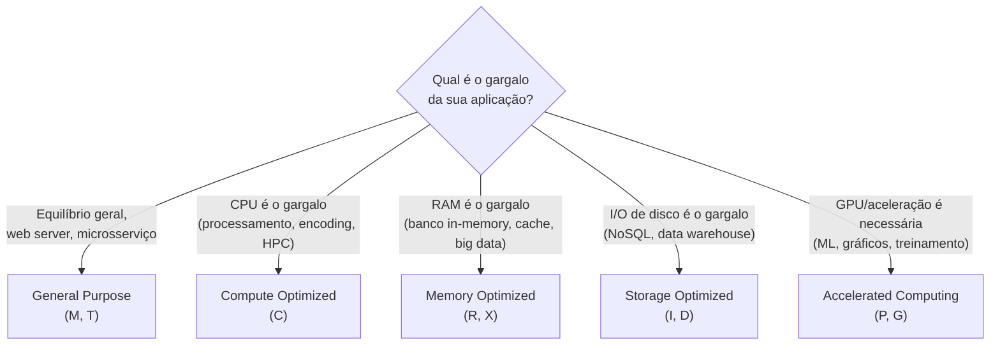
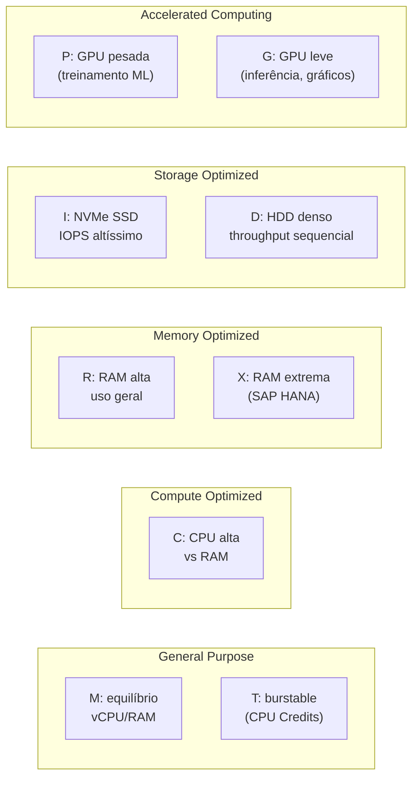
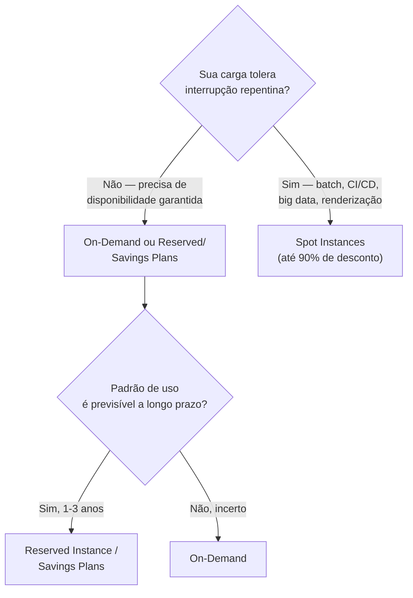
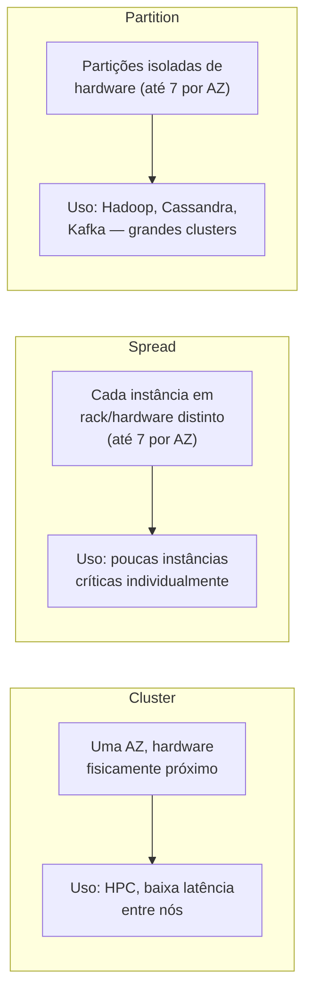
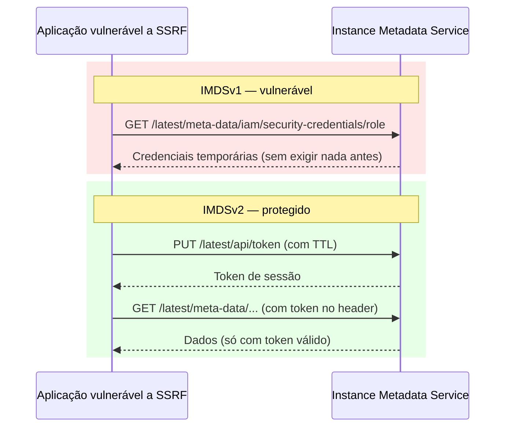
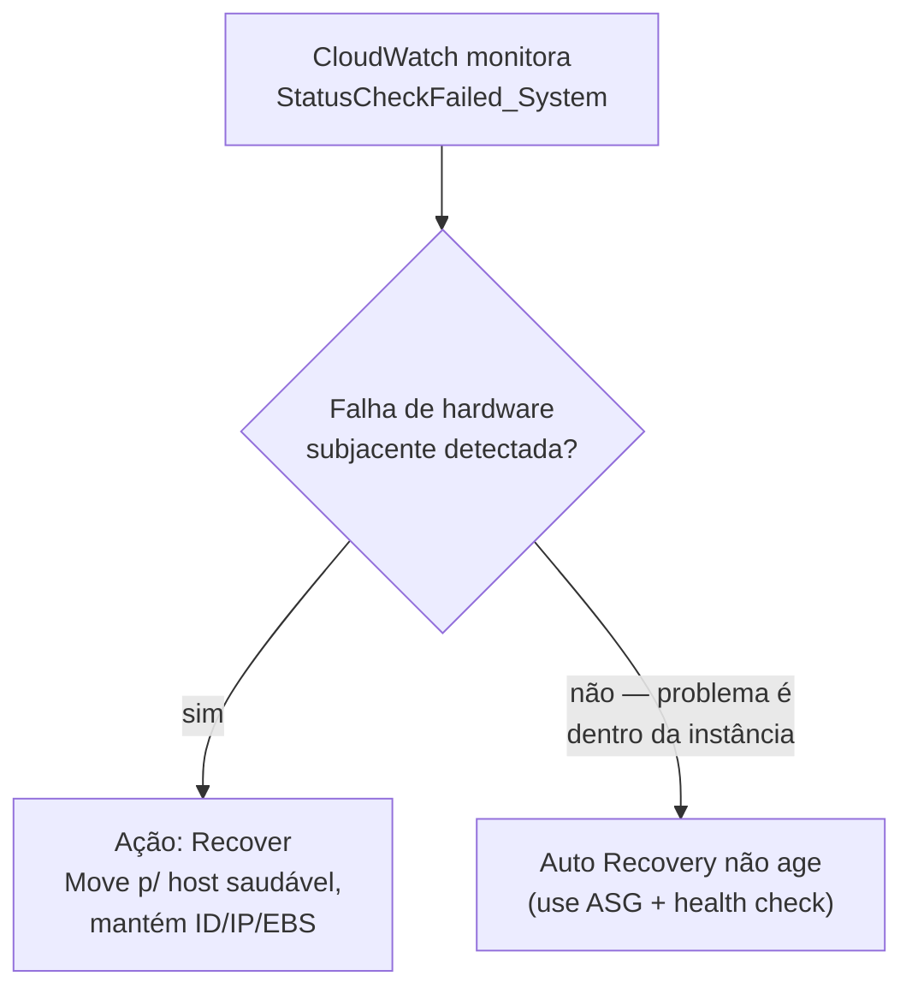
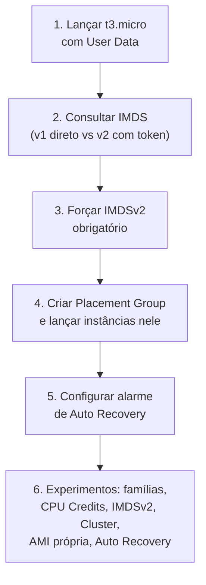

# EC2 — Fundamentos e Tipos de Instância — Guia Completo (Teoria + Prática + Dia a Dia)

## 0. O que é o EC2 e por que a escolha do tipo de instância importa

EC2 (Elastic Compute Cloud) é o serviço de máquinas virtuais da AWS. Parece simples — "aluguel de servidor" — mas boa parte do domínio de Performance na prova SAA-C03, e boa parte do trabalho real de um arquiteto, gira em torno de uma pergunta que parece banal e não é: **qual tipo de instância eu escolho, e como eu pago por ela?**

Errar essa escolha custa dinheiro real (instância memory-optimized rodando uma carga que só precisa de CPU) ou performance real (instância burstable rodando uma carga de CPU constante, tomando throttling de CPU credits o dia inteiro). A prova adora cenários do tipo "aplicação X com característica Y, qual família de instância você escolheria" — e a resposta certa depende de você entender o *padrão de consumo de recursos* da carga, não decorar uma tabela.

Pense na escolha do tipo de instância como escolher o carro certo pro trabalho: uma van de carga (storage optimized) não é melhor nem pior que um carro de corrida (compute optimized) — são otimizados para coisas diferentes, e usar o errado é caro ou ineficiente.


*Ponto de partida para escolher a família de instância: identifique o recurso que é o gargalo real da sua carga de trabalho.*

---

## 1. Famílias de instância — o que cada uma resolve

### General Purpose (M e T)

É a família "meio-termo" — equilíbrio entre CPU, memória e rede. Não é a melhor em nada, mas é boa o suficiente para a maioria das aplicações.

- **Família M** (ex: `m6i`, `m7g`): proporção fixa e balanceada de vCPU/RAM, entrega performance constante e previsível. É a escolha padrão quando você não tem certeza de qual família usar, ou quando a carga é genérica — servidor de aplicação, backend de API, a maioria dos microsserviços.
- **Família T** (ex: `t3`, `t4g`): instâncias **burstable** — mais baratas, mas operam com um sistema de **CPU Credits**. Cada instância acumula créditos quando está ociosa (usando menos CPU que sua baseline) e gasta créditos quando precisa de um pico de CPU acima da baseline.

**Como funciona o CPU Credit na prática:** imagine uma `t3.micro` com baseline de 10% de CPU. Se ela fica em 2% de uso a maior parte do tempo, acumula créditos. Quando chega um pico de tráfego e ela precisa de 80% de CPU por alguns minutos, ela "gasta" os créditos acumulados para sustentar esse pico. Se os créditos acabarem, a instância entra em **throttling** — ela é limitada de volta à baseline, mesmo que a carga ainda precise de mais CPU.

**Modo Unlimited vs Standard:** no modo Standard, quando os créditos acabam, a performance cai pra baseline e ponto. No modo **Unlimited** (padrão em instâncias mais novas), a instância pode continuar acima da baseline mesmo sem créditos — só que você paga uma taxa extra por isso. É uma proteção contra throttling inesperado, mas pode gerar custo surpresa se a carga for consistentemente alta (nesse caso, o certo é migrar pra família M, não pagar o extra do Unlimited pra sempre).

**O que muita gente erra na prova:** achar que família T serve pra qualquer carga barata. Ela é ótima para cargas com picos esporádicos (servidor de dev/teste, microsserviço com tráfego intermitente, site de baixo tráfego constante) — mas é a escolha **errada** para cargas de CPU sustentada e alta (ex: processamento em lote contínuo), porque ali o throttling vai derrubar a performance repetidamente.

### Compute Optimized (C)

Proporção de vCPU alta em relação à RAM — o processador é o recurso "premium" aqui. Exemplos: `c6i`, `c7g`.

**Uso real:** processamento em lote intensivo em CPU, servidores de jogos (tick rate alto), encoding/transcoding de vídeo, machine learning inference (quando não precisa de GPU), HPC (High Performance Computing), servidores de modelagem científica, gateways de alta performance.

### Memory Optimized (R e X)

Proporção de RAM alta em relação à vCPU — otimizada para cargas que processam grandes datasets na memória.

- **Família R** (ex: `r6i`, `r7g`): uso geral com alta RAM — bancos de dados relacionais grandes, cache in-memory (Redis/Memcached self-managed), processamento de big data em memória (Spark).
- **Família X** (ex: `x2iedn`): leva isso ao extremo — proporção de memória ainda maior, usada para bancos de dados enterprise in-memory de grande porte (SAP HANA é o exemplo clássico citado pela AWS), processamento de big data que precisa segurar datasets inteiros em RAM.

**No dia a dia:** se você está rodando um banco relacional com working set grande (o conjunto de dados "quente" que fica sendo consultado o tempo todo não cabe em cache pequeno), memory optimized evita que o banco fique fazendo swap ou I/O de disco constante para servir consultas.

### Storage Optimized (I e D)

Otimizada para I/O de disco local muito alto e/ou throughput sequencial muito alto — o disco físico local (não o EBS) é o diferencial.

- **Família I** (ex: `i3`, `i4i`): NVMe SSD local com IOPS altíssimo e baixíssima latência. Uso real: bancos NoSQL que gerenciam sua própria replicação/durabilidade (Cassandra, MongoDB, ScyllaDB), data warehousing que precisa de I/O local rápido, aplicações transacionais de altíssimo throughput.
- **Família D** (ex: `d3`): otimizada para throughput sequencial denso em HDD, com maior capacidade de armazenamento local por dólar. Uso real: data warehouse tradicional em larga escala (ex: nós de um cluster Hadoop/HDFS), sistemas de arquivos distribuídos, processamento MapReduce.

**Detalhe técnico importante:** o armazenamento dessas famílias normalmente é **Instance Store** (disco físico local do host) — veja o arquivo `02-EBS-e-Instance-Store.md` para entender por que isso é efêmero e como isso muda a arquitetura (você precisa de replicação na camada de aplicação, porque o disco não sobrevive a um stop/terminate).

### Accelerated Computing (P e G)

Instâncias com hardware de aceleração — GPU (a maioria dos casos) ou, em alguns modelos, FPGA/chips de inferência dedicados (Inferentia/Trainium).

- **Família P** (ex: `p4d`, `p5`): GPUs de altíssima performance voltadas para treinamento de modelos de machine learning em larga escala, HPC científico pesado.
- **Família G** (ex: `g5`): GPUs voltadas para inferência de ML, renderização gráfica, workstations gráficas remotas, encoding de vídeo acelerado por hardware, jogos em nuvem (cloud gaming).

**No dia a dia:** treinar um modelo de deep learning do zero costuma pedir família P (mais GPU, mais VRAM); rodar inferência de um modelo já treinado, ou fazer streaming gráfico, costuma bastar família G — mais barata.


*Visão geral das cinco famílias de instância e suas subdivisões internas.*

---

## 2. Opções de compra — otimizando custo pelo padrão de uso

Essa é uma das áreas mais cobradas na prova, porque a AWS quer que você saiba **casar o padrão de uso da carga com o modelo de compra certo** — é puramente uma questão de trade-off entre flexibilidade e desconto.

### On-Demand

Você paga por hora/segundo de uso, sem compromisso. É o modelo mais caro por hora, mas o mais flexível — sem contrato, sem penalidade para desligar.

**Uso real:** cargas novas ainda não previsíveis, picos de curto prazo, desenvolvimento/teste, qualquer coisa onde você não tem confiança suficiente no padrão de uso para se comprometer com um desconto.

### Reserved Instances (RI)

Você se compromete com um tipo de instância específico por um período (1 ou 3 anos) em troca de desconto significativo (pode passar de 70% comparado a On-Demand, dependendo do termo e pagamento).

**Standard vs Convertible:**

| Característica | Standard RI | Convertible RI |
|---|---|---|
| Desconto | Maior | Menor (você paga pela flexibilidade) |
| Pode trocar família/tipo de instância durante o contrato | ❌ | ✅ — pode converter para outra configuração de igual ou maior valor |
| Pode vender no Reserved Instance Marketplace | ✅ | ❌ |
| Uso real | Carga estável, você tem certeza que vai usar aquele tipo exato por 1-3 anos | Carga que pode evoluir (ex: você espera migrar de família em algum momento, ou não tem 100% de certeza do tipo ideal) |

**1 ano vs 3 anos:** 3 anos dá desconto maior (mais comprometimento = mais desconto), mas menos flexibilidade — você trava o compromisso por mais tempo.

**Opções de pagamento (afetam o desconto):**
- **All Upfront:** paga tudo adiantado, maior desconto.
- **Partial Upfront:** paga uma parte adiantada, resto mensal, desconto intermediário.
- **No Upfront:** paga só mensalmente, menor desconto (mas ainda menor que On-Demand).

**O que muita gente erra na prova:** achar que RI reserva capacidade física — ela reserva **desconto de preço** aplicado automaticamente ao uso que casa com os parâmetros da reserva (tipo de instância, região, tenancy, plataforma), não é uma instância "ligada" esperando por você (a menos que você compre com **capacity reservation** explícita, que é um recurso separado combinável com RI).

### Savings Plans

Modelo mais moderno e flexível que RI: você se compromete com um **valor de gasto por hora** (ex: "$10/hora em compute"), não com um tipo de instância específico. Em troca, ganha desconto parecido com o de RI.

- **Compute Savings Plans:** mais flexível — o compromisso de gasto se aplica independente de família de instância, tamanho, região, ou até se é EC2, Fargate ou Lambda.
- **EC2 Instance Savings Plans:** desconto maior, mas trava numa família de instância específica numa região — você ainda pode variar tamanho, SO e tenancy dentro daquela família.

**No dia a dia:** Savings Plans praticamente substituiu a recomendação padrão para a maioria dos casos que antes usavam RI — é mais simples de gerenciar (não precisa acompanhar "reservei o tipo certo?") e cobre arquiteturas modernas que misturam EC2, containers e serverless.

### Spot Instances

Você usa capacidade **ociosa** da AWS com desconto que pode passar de 90% em relação a On-Demand. A contrapartida: a AWS pode **interromper sua instância a qualquer momento**, com um aviso de interrupção de curtíssimo prazo (historicamente cerca de 2 minutos), quando ela precisa da capacidade de volta ou o preço Spot ultrapassa seu limite.

**Spot Fleet / EC2 Fleet:** ao invés de pedir um tipo específico de instância Spot, você define um conjunto de tipos/tamanhos/AZs aceitáveis, e a AWS monta e mantém a frota automaticamente, substituindo instâncias interrompidas com o tipo disponível mais barato dentro dos critérios que você definiu — reduz a chance de "ficar sem capacidade nenhuma" porque não depende de um único tipo de instância.

**Casos de uso tolerantes a falha (o critério real para usar Spot):** processamento em batch, renderização, jobs de CI/CD, análise de big data distribuída (Hadoop/Spark com checkpointing), simulações científicas, treinamento de ML com checkpoint automático — qualquer carga que consegue **pausar e retomar** ou que roda em um cluster onde perder um nó não é catastrófico.

**O que muita gente erra na prova:** usar Spot para qualquer coisa que precise de disponibilidade garantida contínua (ex: banco de dados de produção, servidor web sem redundância) — isso é o cenário clássico de "resposta errada" nas questões, porque Spot pode sumir a qualquer momento.


*Árvore de decisão simplificada entre os principais modelos de compra do EC2.*

### Dedicated Hosts vs Dedicated Instances

Ambos rodam sua instância em hardware físico **não compartilhado com outras contas AWS** — a diferença é o nível de controle e o motivo de uso.

| Característica | Dedicated Host | Dedicated Instance |
|---|---|---|
| Visibilidade do servidor físico | Você vê o host inteiro (sockets, cores físicos) | Você não vê o host, só sabe que é isolado |
| Controle de posicionamento de instâncias no host | ✅ — você escolhe onde cada instância roda | ❌ |
| Licenciamento por socket/core físico (BYOL) | ✅ — é o motivo principal de existir (ex: licenças Windows Server, SQL Server, Oracle que cobram por core físico) | Parcial, menos controle |
| Custo | Mais caro, cobrado pelo host inteiro | Cobrado por instância, com taxa adicional sobre On-Demand |
| Uso real | Compliance regulatório que exige hardware dedicado auditável + BYOL de licenças com restrição de core físico | Compliance que só exige "não compartilhar hardware com outros clientes", sem necessidade de controlar o posicionamento |

**No dia a dia:** Dedicated Host é a resposta quando a pergunta envolve "trazer minha própria licença" (BYOL) de um software que cobra por núcleo físico de CPU — é praticamente a única forma legal de rastrear exatamente quantos cores físicos estão em uso.

---

## 3. Placement Groups — controlando onde suas instâncias ficam fisicamente

Por padrão, a AWS decide onde fisicamente colocar suas instâncias — você não tem controle nem visibilidade sobre isso. Placement Groups existem para os casos em que **o posicionamento físico importa** para latência ou para resiliência.

### Cluster

Agrupa instâncias fisicamente próximas, dentro de uma **única AZ**, para conseguir a menor latência de rede possível entre elas (e throughput de rede mais alto).

**Uso real:** HPC, processamento distribuído que troca muita informação entre nós (ex: um cluster de treinamento de ML distribuído entre múltiplas instâncias, simulações científicas paralelas).

**Trade-off:** por estar tudo numa AZ só e fisicamente perto, o risco de falha correlacionada é maior — se o hardware/rack tiver problema, pode afetar várias instâncias do grupo ao mesmo tempo.

### Spread

Espalha instâncias em hardware físico **distinto** — cada instância fica em um rack diferente, com fonte de energia e rede independentes. Limite de 7 instâncias por AZ por grupo Spread.

**Uso real:** aplicações pequenas onde cada instância é crítica individualmente e você quer minimizar o risco de múltiplas instâncias caírem pela mesma falha de hardware simultaneamente — exemplo clássico: um pequeno conjunto de servidores que compõem o quorum de um sistema distribuído (ex: nós de um cluster de banco de dados com poucos nós, onde perder mais de um ao mesmo tempo quebra o quorum).

### Partition

Divide as instâncias em **partições lógicas**, cada uma com seu próprio conjunto de racks/hardware, isolada das outras partições. Uma falha de hardware afeta no máximo uma partição, não o cluster inteiro. Suporta até 7 partições por AZ, com centenas de instâncias por grupo — bem mais escalável que Spread.

**Uso real:** aplicações distribuídas de grande escala que já têm consciência de partições/réplicas na própria arquitetura — o exemplo mais citado é **Hadoop, Cassandra, Kafka**: você mapeia cada partição do Placement Group para uma partição lógica da aplicação, garantindo que a réplica de um dado nunca esteja na mesma partição física do dado original.


*As três estratégias de Placement Group e o motivo de cada uma existir.*

**Pegadinha clássica de prova:** Cluster otimiza para **latência** (aceitando risco de falha correlacionada); Spread e Partition otimizam para **resiliência a falha de hardware** (aceitando não ter a menor latência possível). A prova gosta de inverter isso — "quero a menor latência possível entre os nós" é sempre Cluster, "quero minimizar o impacto de uma falha de hardware" é Spread (poucas instâncias) ou Partition (muitas instâncias, cluster distribuído).

---

## 4. Enhanced Networking (ENA) e o Nitro System

### Enhanced Networking

Usa virtualização de hardware (SR-IOV) para dar às instâncias throughput de rede mais alto, menor latência e menor variabilidade (jitter) do que a virtualização de rede tradicional por software. Na prática, isso é feito através do driver **ENA (Elastic Network Adapter)**, presente por padrão nos tipos de instância mais modernos.

**No dia a dia:** você raramente precisa "ativar" isso manualmente hoje em dia — instâncias atuais já vêm com ENA nativamente. É mais relevante saber que esse é o mecanismo por trás de números de throughput de rede mais altos anunciados em instâncias modernas (até dezenas ou centenas de Gbps em tipos maiores).

### Nitro System

É a arquitetura de virtualização por trás de praticamente todas as instâncias EC2 modernas. Antes do Nitro, o hypervisor (Xen) rodava boa parte da lógica de virtualização em software, na própria CPU do host, consumindo recursos que poderiam ir para as instâncias dos clientes.

O Nitro move essas funções (rede, storage, gerenciamento de segurança) para **hardware dedicado** (chips e placas especializadas), deixando praticamente 100% dos recursos físicos do host disponíveis para as instâncias dos clientes.

**O que isso habilita na prática (o que a prova costuma cobrar):**
- Performance quase "bare metal" (existe inclusive a opção de instâncias `.metal`, sem hypervisor nenhum entre você e o hardware).
- Segurança mais forte: o **Nitro Security Chip** isola o hypervisor até de operadores da própria AWS, e criptografia de dados em trânsito entre instância e storage é feita por padrão em hardware.
- Suporte a EBS com performance mais alta e mais consistente.
- Base para features modernas como instâncias com Enhanced Networking nativo e maior densidade de recursos.

**No dia a dia:** você não "escolhe" usar Nitro — praticamente todo tipo de instância lançado nos últimos anos já roda sobre Nitro. É mais uma peça de contexto para entender *por que* as instâncias modernas performam e isolam melhor do que as antigas gerações baseadas em Xen.

---

## 5. AMI, User Data e Instance Metadata

### AMI (Amazon Machine Image)

É o "molde" a partir do qual uma instância é criada — contém o sistema operacional, configurações e, opcionalmente, aplicações e dados já instalados. Você pode usar AMIs fornecidas pela AWS/parceiros (Marketplace), a comunidade, ou criar as suas próprias a partir de uma instância já configurada (isso é abordado com mais detalhe em `02-EBS-e-Instance-Store.md`, já que criar uma AMI geralmente parte de um snapshot de EBS).

**No dia a dia:** manter uma AMI "dourada" (golden AMI) já com dependências, patches de segurança e configurações da empresa pré-instaladas acelera drasticamente o boot de novas instâncias em Auto Scaling — em vez de instalar tudo via User Data toda vez que uma instância nasce, ela já nasce pronta.

### User Data

Script (shell, cloud-init, etc.) executado **automaticamente na primeira inicialização** da instância (por padrão) — usado para bootstrap: instalar pacotes, baixar configuração, registrar a instância em algum serviço, etc.

```bash
#!/bin/bash
yum update -y
yum install -y httpd
systemctl start httpd
systemctl enable httpd
echo "<h1>Instância inicializada via User Data</h1>" > /var/www/html/index.html
```

**Detalhe importante:** User Data roda com privilégios de root/administrador por padrão, e por padrão só executa na primeira inicialização (a menos que você configure para rodar em todo boot).

### Instance Metadata (IMDS)

É um serviço interno, acessível **só de dentro da instância**, que expõe informações sobre a própria instância (ID, tipo, IP, AMI, credenciais temporárias da IAM Role anexada, etc.) através do endereço especial `169.254.169.254` — um endereço link-local que não sai da instância.

```bash
# IMDSv1 (não recomendado)
curl http://169.254.169.254/latest/meta-data/instance-id

# IMDSv2 (recomendado) — exige token primeiro
TOKEN=$(curl -X PUT "http://169.254.169.254/latest/api/token" -H "X-aws-ec2-metadata-token-ttl-seconds: 21600")
curl -H "X-aws-ec2-metadata-token: $TOKEN" http://169.254.169.254/latest/meta-data/instance-id
```

**Por que IMDSv2 é mais seguro que IMDSv1 — o porquê real:**

IMDSv1 é uma simples requisição GET, sem estado (session-oriented) nenhum. Isso a torna vulnerável a ataques de **SSRF (Server-Side Request Forgery)**: se sua aplicação tem uma vulnerabilidade que permite a um atacante fazer a própria aplicação disparar uma requisição HTTP arbitrária (ex: um endpoint que busca uma URL fornecida pelo usuário sem validação), o atacante pode fazer a aplicação buscar `http://169.254.169.254/latest/meta-data/iam/security-credentials/{role}` e roubar as credenciais temporárias da IAM Role da instância — sem nunca ter acesso direto ao servidor.

IMDSv2 exige uma requisição **PUT** primeiro para obter um token (com TTL configurável), e toda consulta subsequente precisa desse token no header. Isso quebra a maioria dos ataques SSRF simples porque:
1. A maior parte das vulnerabilidades de SSRF só permite forjar requisições GET simples, não PUT com headers customizados.
2. O token tem TTL limitado e não atravessa redirecionamentos HTTP simples, dificultando ainda mais a exploração via proxies mal configurados.

**O que muita gente erra na prova:** achar que "desabilitar o IMDS" é a resposta para reduzir risco de SSRF — a resposta correta na maioria dos cenários modernos é **forçar IMDSv2** (via `--http-tokens required` no `modify-instance-metadata-options`), não desabilitar o metadata inteiro, porque muita automação legítima (agentes de monitoramento, scripts de bootstrap) depende dele para funcionar.


*IMDSv2 exige um token via PUT antes de qualquer consulta, dificultando ataques SSRF simples que só conseguem forjar GET.*

---

## 6. EC2 Auto Recovery

Recurso do CloudWatch integrado ao EC2 que monitora a instância e, se detectar uma falha de **hardware subjacente** (não falha da aplicação/SO), recupera a instância automaticamente — mantendo o mesmo ID de instância, IPs privados, IPs elásticos associados, metadados e volumes EBS anexados.

**Como funciona:** um alarme do CloudWatch monitora a métrica `StatusCheckFailed_System` (checagem de status do sistema, que reflete problemas de infraestrutura da AWS — hardware do host, rede, etc — diferente de `StatusCheckFailed_Instance`, que reflete problemas dentro do SO/instância). Quando esse alarme dispara, a ação configurada é **Recover**, que move a instância para um host físico saudável e a reinicia lá.

**O que muita gente erra na prova:** achar que Auto Recovery resolve qualquer tipo de falha. Ele só age em falhas de **infraestrutura subjacente** — se o problema é dentro da própria instância (aplicação travada, SO corrompido, kernel panic por bug da aplicação), Auto Recovery não ajuda, porque `StatusCheckFailed_Instance` não é o gatilho dele. Para esse cenário, a resposta certa geralmente envolve Auto Scaling Group com health check + substituição da instância, não Auto Recovery.


*Auto Recovery só reage a falhas de hardware do host físico, não a problemas internos da instância.*

---

# 🧪 Laboratório prático (para executar na AWS)

## Objetivo
Lançar instâncias de diferentes famílias, testar User Data, comparar IMDSv1 vs IMDSv2, e criar um Placement Group.

### Passo 1 — Lançar uma instância General Purpose com User Data
Console → EC2 → **Launch Instance**
- Nome: `lab-general-purpose`
- AMI: Amazon Linux 2023
- Tipo de instância: `t3.micro`
- User Data:
```bash
#!/bin/bash
yum update -y
yum install -y httpd
systemctl start httpd
systemctl enable httpd
echo "<h1>Servidor lab EC2</h1>" > /var/www/html/index.html
```

### Passo 2 — Consultar o Instance Metadata via SSH
Conecte via **Session Manager** (ou SSH) e teste:
```bash
# Tentar IMDSv1 direto
curl http://169.254.169.254/latest/meta-data/instance-type

# Fluxo correto IMDSv2
TOKEN=$(curl -X PUT "http://169.254.169.254/latest/api/token" -H "X-aws-ec2-metadata-token-ttl-seconds: 21600")
curl -H "X-aws-ec2-metadata-token: $TOKEN" http://169.254.169.254/latest/meta-data/instance-type
```

### Passo 3 — Forçar IMDSv2 obrigatório na instância
```bash
aws ec2 modify-instance-metadata-options \
  --instance-id {instance-id} \
  --http-tokens required \
  --http-endpoint enabled
```
Repita o `curl` do IMDSv1 sem token — observe que agora falha.

### Passo 4 — Criar um Placement Group e lançar instâncias nele
```bash
aws ec2 create-placement-group --group-name lab-spread-group --strategy spread
```
Lance 2-3 instâncias `t3.micro` adicionais especificando `--placement GroupName=lab-spread-group`.

### Passo 5 — Simular Auto Recovery
Console → EC2 → selecione a instância → **Actions → Monitor and troubleshoot → Manage CloudWatch alarms** → crie um alarme de recuperação baseado em `StatusCheckFailed_System`.

### Passo 6 — Experimentos para fixar cada conceito
1. **Comparar famílias:** lance uma `c6i.large` (compute) e uma `r6i.large` (memory) lado a lado, rode `stress-ng --cpu 2` numa e `stress-ng --vm 2 --vm-bytes 1G` na outra, e compare o comportamento no CloudWatch (CPUUtilization vs uso de memória, lembrando que memória não é métrica nativa do CloudWatch sem o agente instalado).
2. **CPU Credits:** na `t3.micro`, rode um loop de CPU sustentado (`yes > /dev/null &` por alguns processos) por vários minutos e observe a métrica `CPUCreditBalance` cair no CloudWatch até o throttling aparecer.
3. **IMDSv2 forçado:** depois do Passo 3, tente rodar uma ferramenta/agente antigo que só suporta IMDSv1 e observe a falha — isso simula o motivo pelo qual essa mudança exige planejamento em ambientes legados.
4. **Placement Group Cluster:** crie um segundo Placement Group com `--strategy cluster`, lance duas instâncias nele na mesma AZ, e compare a latência de rede entre elas (`ping` ou `iperf3`) com duas instâncias fora do grupo.
5. **AMI própria:** depois de configurar a instância do Passo 1, crie uma AMI a partir dela (`create-image`), lance uma nova instância dessa AMI e confirme que o Apache já sobe sem rodar o User Data de novo.
6. **Auto Recovery vs falha de aplicação:** derrube o processo do Apache dentro da instância (`systemctl stop httpd`) e observe que isso **não** aciona o alarme de `StatusCheckFailed_System` — reforça que Auto Recovery não cobre falha de aplicação.


*Sequência dos passos do laboratório prático.*

---

## Comandos AWS CLI úteis

```bash
# Lançar instância com tipo e AMI específicos
aws ec2 run-instances --image-id ami-0abcdef1234567890 \
  --instance-type t3.micro --key-name minha-chave \
  --user-data file://user-data.sh

# Listar tipos de instância disponíveis por família
aws ec2 describe-instance-types --filters "Name=instance-type,Values=c6i.*"

# Criar Placement Group
aws ec2 create-placement-group --group-name meu-cluster --strategy cluster

# Forçar IMDSv2 em instância existente
aws ec2 modify-instance-metadata-options --instance-id i-0123456789abcdef0 \
  --http-tokens required --http-put-response-hop-limit 1

# Forçar IMDSv2 já no lançamento
aws ec2 run-instances --image-id ami-0abcdef1234567890 --instance-type t3.micro \
  --metadata-options "HttpTokens=required,HttpEndpoint=enabled"

# Criar AMI a partir de uma instância
aws ec2 create-image --instance-id i-0123456789abcdef0 --name "minha-ami-dourada" --no-reboot

# Comprar uma Reserved Instance (exemplo Standard, 1 ano, No Upfront)
aws ec2 describe-reserved-instances-offerings --instance-type m6i.large \
  --offering-type "No Upfront" --product-description "Linux/UNIX"

# Solicitar Spot Instance
aws ec2 request-spot-instances --instance-count 1 \
  --launch-specification file://spot-spec.json
```

---

## Tabela de decisão rápida (prova + dia a dia)

| Cenário | Resposta provável |
|---|---|
| Carga genérica, servidor de aplicação, sem gargalo claro | General Purpose (M) |
| Tráfego intermitente/esporádico, custo baixo prioritário | General Purpose (T, burstable) |
| Processamento intensivo de CPU sustentado | Compute Optimized (C) |
| Banco de dados/cache com dataset grande em memória | Memory Optimized (R/X) |
| NoSQL, data warehouse, precisa de IOPS local altíssimo | Storage Optimized (I/D) |
| Treinamento de ML, HPC com GPU | Accelerated Computing (P) |
| Inferência de ML, gráficos, cloud gaming | Accelerated Computing (G) |
| Carga estável e previsível por 1-3 anos | Reserved Instance ou Savings Plans |
| Compromisso de gasto flexível entre EC2/Fargate/Lambda | Compute Savings Plans |
| Carga tolerante a interrupção, custo mínimo | Spot Instances (+ Spot Fleet) |
| Compliance exige hardware não compartilhado + licenciamento por core físico | Dedicated Host |
| Compliance exige só isolamento de hardware, sem controle de posicionamento | Dedicated Instance |
| Menor latência de rede entre nós de um cluster HPC | Placement Group — Cluster |
| Poucas instâncias críticas, minimizar falha de hardware correlacionada | Placement Group — Spread |
| Cluster grande distribuído (Hadoop/Kafka/Cassandra) | Placement Group — Partition |
| Reduzir risco de roubo de credenciais via SSRF | Forçar IMDSv2 (`http-tokens required`) |
| Instância parou de responder por falha de host físico | EC2 Auto Recovery (StatusCheckFailed_System) |
