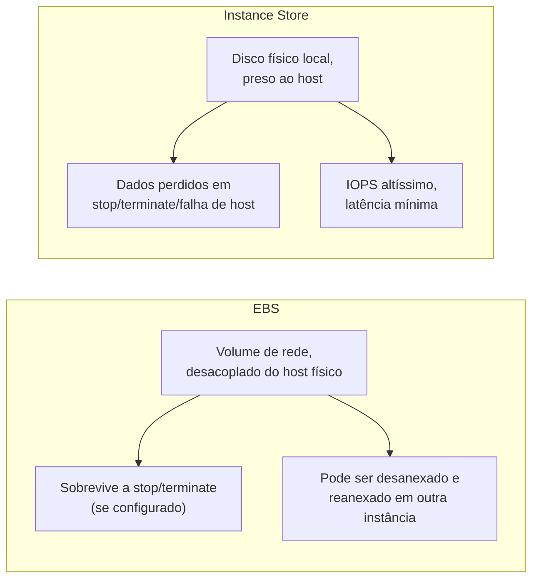
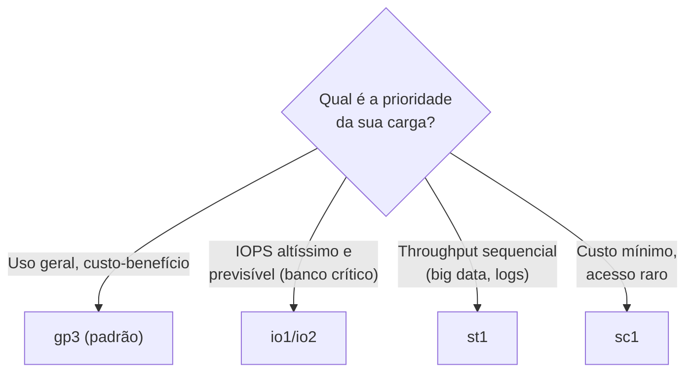
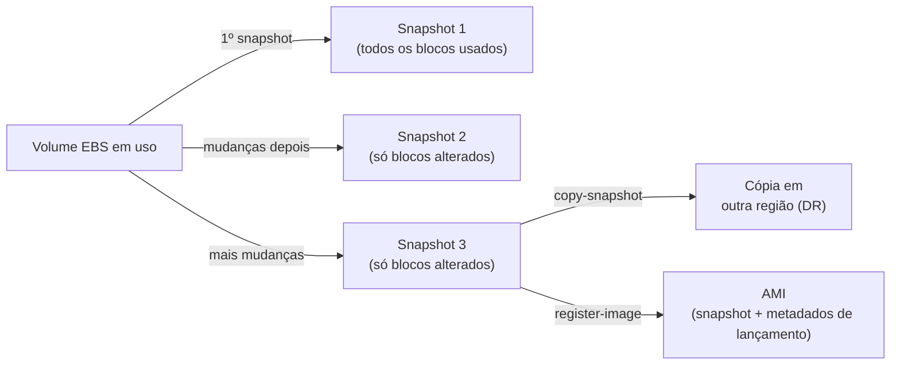
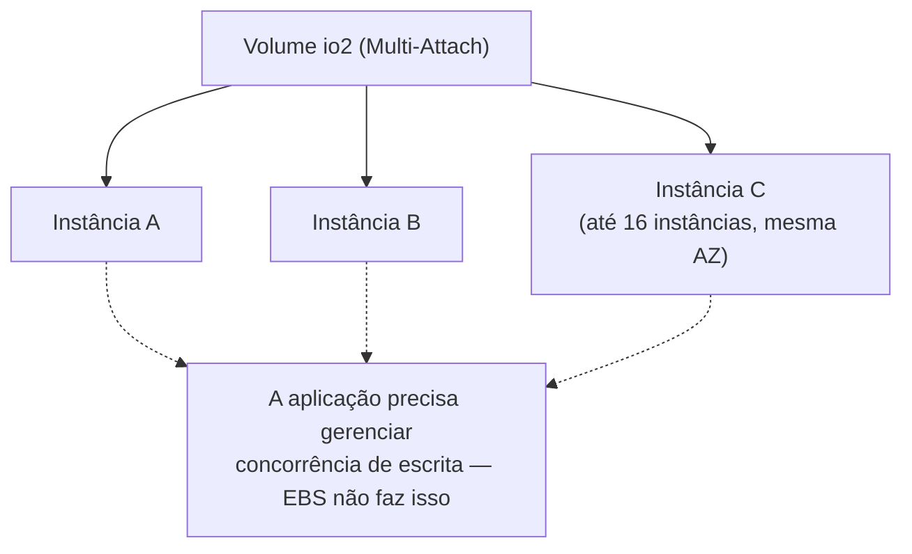
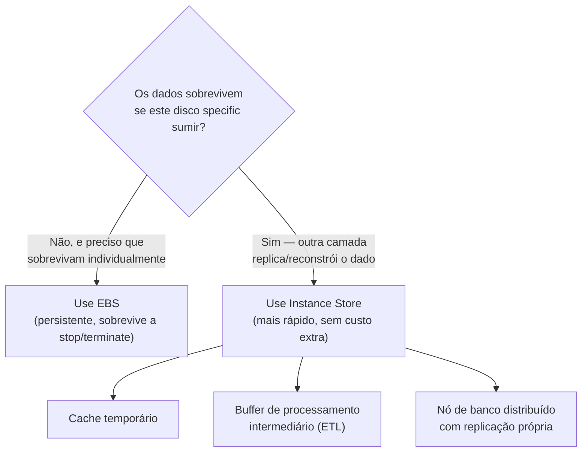
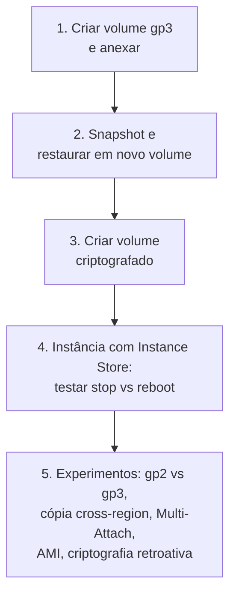

# EBS e Instance Store — Guia Completo (Teoria + Prática + Dia a Dia)

## 0. O problema que armazenamento em nuvem precisa resolver

Uma instância EC2, por padrão, é uma máquina virtual "descartável" — ela pode ser interrompida, reiniciada em outro host físico, ou terminada. Se os seus dados vivessem só no disco físico daquele host específico, você perderia tudo sempre que a instância mudasse de hardware — o que acontece o tempo todo em nuvem (manutenção da AWS, recuperação de falha, Auto Scaling substituindo instâncias).

A AWS resolve isso com duas abordagens bem diferentes, e a prova adora testar se você sabe quando usar cada uma:

- **EBS (Elastic Block Store):** armazenamento em bloco **de rede**, desacoplado fisicamente da instância — sobrevive independente do que acontece com o host.
- **Instance Store:** disco físico **local**, fisicamente preso ao host onde a instância está rodando — rápido, mas efêmero.

Pense assim: EBS é como um HD externo que você pode desconectar de um computador e conectar em outro sem perder nada. Instance Store é como o SSD soldado na placa-mãe de um notebook específico — rapidíssimo porque está ali do lado, mas some se você trocar de notebook.


*EBS troca latência mínima por durabilidade e flexibilidade; Instance Store troca durabilidade por performance bruta.*

---

## 1. Tipos de volume EBS

Todo volume EBS é replicado automaticamente **dentro da sua AZ** para proteção contra falha de hardware — isso já é embutido no serviço, diferente de Instance Store. A escolha do tipo de volume é sobre performance e custo, não sobre durabilidade básica.

### gp3 / gp2 — SSD de uso geral

É a escolha padrão para a grande maioria das cargas — sistema operacional, a maioria dos bancos de dados de porte pequeno/médio, servidores de aplicação.

- **gp2:** performance (IOPS) é atrelada ao **tamanho do volume** — você ganha 3 IOPS por GB provisionado, com um baseline mínimo e a possibilidade de rajadas (burst) usando um sistema de créditos parecido com o das instâncias `t`. Ou seja: se você quer mais IOPS num gp2, a única forma é aumentar o volume, mesmo que não precise do espaço extra.
- **gp3:** desacopla IOPS e throughput do tamanho do volume — você provisiona os três de forma independente (tamanho, IOPS, throughput), e ainda sai mais barato por GB que gp2 no baseline. É a recomendação padrão hoje em dia, porque você paga só pelo que realmente precisa em cada dimensão.

**No dia a dia:** migrar de gp2 para gp3 é quase sempre uma vitória de custo, a menos que sua carga já dependesse fortemente do burst do gp2 sem perceber — vale revisar o padrão real de uso antes de migrar workloads sensíveis.

### io1 / io2 — IOPS provisionado

Para cargas que precisam de **IOPS alto, consistente e previsível** — você provisiona exatamente a quantidade de IOPS que precisa, independente do tamanho do volume (dentro de um limite de proporção IOPS:GB).

- **io1:** geração original, IOPS provisionado.
- **io2:** mesma proposta, mas com **durabilidade maior** (a AWS anuncia uma taxa de erro de durabilidade bem menor que io1/gp2/gp3) e IOPS máximo mais alto por volume — geração recomendada hoje sobre io1.
- **io2 Block Express:** variante de io2 para o patamar mais alto de performance (sub-milissegundo de latência, IOPS e throughput ainda maiores) — usado em bancos de missão crítica de porte grande.

**Uso real:** bancos de dados relacionais críticos de produção (Oracle, SQL Server, PostgreSQL/MySQL de alta transação), qualquer carga onde uma queda de IOPS causaria impacto direto e mensurável no negócio (ex: sistema transacional financeiro).

### st1 — HDD otimizado para throughput

HDD (não SSD), otimizado para **throughput sequencial alto**, não para IOPS por operação individual. Mais barato por GB que os SSDs, mas péssimo para acesso aleatório/pequenas operações.

**Uso real:** big data, data warehouses, processamento de log em lote, qualquer carga que **lê/escreve sequencialmente grandes blocos de dados** — o padrão clássico de leitura de um cluster Hadoop/Spark lendo arquivos grandes do início ao fim.

### sc1 — HDD frio (cold), menor custo

HDD ainda mais barato que st1, com throughput mais baixo — feito para dados acessados **infrequentemente**, onde o custo por GB é a prioridade e a performance é secundária.

**Uso real:** dados de arquivo acessados raramente, mas que ainda precisam estar em bloco (não em objeto) — por exemplo, um volume de backup secundário que raramente é lido, mas precisa estar pronto para montar rapidamente se necessário.

### Tabela comparativa

| Tipo | Mídia | Métrica otimizada | IOPS/Throughput relativo | Custo relativo | Caso de uso típico |
|---|---|---|---|---|---|
| **gp3** | SSD | Uso geral balanceado | IOPS e throughput provisionados independentemente do tamanho | Baixo/médio | SO, apps, bancos pequenos/médios — escolha padrão |
| **gp2** | SSD | Uso geral balanceado | IOPS atrelado ao tamanho (3 IOPS/GB) + burst | Baixo/médio (um pouco acima de gp3) | Legado — cargas antigas ainda não migradas |
| **io2 / io2 Block Express** | SSD | IOPS provisionado, alta durabilidade | Altíssimo, consistente e previsível | Alto | Bancos de dados críticos de produção |
| **io1** | SSD | IOPS provisionado | Alto, consistente | Alto | Legado — prefira io2 em projetos novos |
| **st1** | HDD | Throughput sequencial | Alto throughput, baixo IOPS aleatório | Médio-baixo | Big data, data warehouse, logs em lote |
| **sc1** | HDD | Custo mínimo | Baixo throughput e IOPS | Mínimo | Dados frios, acesso infrequente |


*Árvore de decisão simplificada entre os tipos de volume EBS.*

---

## 2. Snapshots — backup incremental e portabilidade

Um snapshot é uma cópia point-in-time de um volume EBS, armazenada no S3 (de forma gerenciada — você não vê o bucket, mas por baixo dos panos é lá que fica).

**Incrementais por padrão — o porquê disso importa:** o primeiro snapshot de um volume copia todos os blocos usados. Todo snapshot seguinte copia **só os blocos que mudaram** desde o snapshot anterior. Isso significa que snapshots são rápidos e baratos de fazer com frequência — mas também significa que, se você deletar um snapshot "do meio" da cadeia, a AWS automaticamente garante que os dados necessários para restaurar os outros snapshots continuem íntegros (ela gerencia essa dependência internamente, você nunca perde a capacidade de restaurar um snapshot mais recente por ter apagado um mais antigo).

**Cópia cross-region:** snapshots podem ser copiados para outra região — é a base de estratégias de **Disaster Recovery** (você mantém uma cópia dos dados numa região secundária, pronta para recriar volumes lá se a região primária tiver um problema) e também de conformidade regulatória (alguns cenários exigem que uma cópia dos dados exista fisicamente em determinada geografia).

**Criação de AMI a partir de snapshot:** uma AMI, no fundo, referencia um ou mais snapshots (o volume raiz do sistema operacional, e volumes adicionais se houver) mais metadados de lançamento (tipo de virtualização, mapeamento de dispositivos de bloco). É por isso que criar uma AMI "dourada" de uma instância já configurada, na prática, é: tirar um snapshot do(s) volume(s) dela e empacotar isso com metadados de lançamento.


*Snapshots incrementais, cópia cross-region e o caminho até virar uma AMI.*

**No dia a dia:** automatizar snapshots via **Data Lifecycle Manager (DLM)** ou via políticas do **AWS Backup** é praticamente obrigatório em qualquer ambiente de produção — snapshot manual "quando lembrar" não é uma estratégia de backup confiável.

---

## 3. Multi-Attach (io2) — quando um volume precisa de múltiplas instâncias

Por padrão, um volume EBS só pode ser anexado a **uma instância por vez**. O Multi-Attach, disponível para volumes **io1/io2**, permite anexar o mesmo volume a **múltiplas instâncias EC2 simultaneamente**, dentro da mesma AZ.

**Detalhe técnico importante:** o EBS não faz nenhum controle de concorrência de escrita entre as instâncias — isso é responsabilidade da sua aplicação/sistema de arquivos. Se você anexar um volume Multi-Attach com um sistema de arquivos comum (ext4, xfs) sem coordenação, múltiplas instâncias escrevendo ao mesmo tempo vão corromper os dados. Por isso, Multi-Attach só faz sentido com aplicações que já sabem gerenciar acesso concorrente a um storage compartilhado — o exemplo clássico é um **cluster de banco de dados com clustering em nível de aplicação** (ex: alguns clusters de banco que implementam seu próprio locking distribuído sobre o storage compartilhado).

**Uso real:** clusters de aplicação de alta disponibilidade que precisam de um storage compartilhado de baixa latência entre nós ativos, onde a própria aplicação já gerencia locking/coordenação — não é uma solução genérica de "storage compartilhado para qualquer app".


*Multi-Attach compartilha o mesmo volume entre várias instâncias — o controle de concorrência é responsabilidade da aplicação.*

---

## 4. Criptografia de EBS

Volumes EBS criptografados usam uma **chave do KMS** (AWS Key Management Service) para criptografar: os dados em repouso no volume, todo o tráfego entre a instância e o volume (dados em trânsito), e todos os snapshots gerados a partir desse volume.

**Como funciona na prática:** quando você cria um volume criptografado, o EBS usa uma **data key** derivada da chave KMS escolhida (a chave gerenciada pela AWS padrão `aws/ebs`, ou uma **chave gerenciada pelo cliente (CMK)** se você precisa de controle mais granular — ex: revogar acesso, auditar uso via CloudTrail, ou rotação customizada). A criptografia/descriptografia acontece de forma transparente para o sistema operacional e a aplicação — não exige mudança de código, e o overhead de performance é mínimo (acelerado por hardware nas instâncias modernas baseadas em Nitro).

**Regras importantes:**
- Um snapshot de um volume criptografado é **sempre criptografado**.
- Um volume criado a partir de um snapshot criptografado é **sempre criptografado**.
- Você pode criptografar um volume não criptografado indiretamente: tire um snapshot dele, copie o snapshot habilitando criptografia (ou crie uma cópia criptografada), e crie um novo volume a partir desse snapshot criptografado.
- Dá para configurar a conta/região para que **todo volume novo seja criptografado por padrão** — uma boa prática de segurança recomendada para qualquer ambiente de produção.

**Conexão com o domínio de Segurança:** esse é um dos pontos onde Performance e Segurança se cruzam na prova — criptografia de EBS não tem trade-off de performance relevante hoje em dia (graças ao Nitro), então "não uso criptografia para ganhar performance" é quase sempre uma resposta errada em cenários modernos.


*Caminho para criptografar um volume EBS que nasceu sem criptografia, e a propagação automática para snapshots subsequentes.*

---

## 5. EBS vs Instance Store — a comparação que a prova mais cobra

### Instance Store

É armazenamento em disco físico **fisicamente anexado ao host** onde sua instância está rodando (não é oferecido em todo tipo de instância — famílias como I, D e algumas variantes de outras famílias têm Instance Store; outras não têm nenhum).

**Por que ele é efêmero:** os dados vivem no disco físico do host específico. Se a instância for **parada (stop)**, **terminada**, ou se o **host físico falhar**, os dados do Instance Store são perdidos — porque quando a instância volta (ou é recriada), ela pode (e provavelmente vai) subir num host físico diferente, que tem seu próprio disco físico, vazio. Um simples **reboot** (reinicialização, sem trocar de host) não perde os dados — a distinção entre "reboot" e "stop/terminate" é justamente o que determina se os dados sobrevivem ou não.

**Por que ele é tão rápido:** não há rede envolvida — o disco está fisicamente ali, conectado diretamente ao barramento do host. Isso elimina a latência de rede que todo volume EBS tem (mesmo que pequena), resultando em IOPS mais alto e latência mais baixa e mais previsível que qualquer volume EBS.

### Comparação direta

| Característica | EBS | Instance Store |
|---|---|---|
| Persistência | Sobrevive a stop/terminate (se `DeleteOnTermination=false`) | Perdido em stop/terminate/falha de host |
| Sobrevive a reboot | ✅ | ✅ (só stop/terminate/falha de host perdem os dados) |
| Localização física | Storage de rede, desacoplado do host | Disco físico preso ao host |
| Pode desanexar e mover para outra instância | ✅ | ❌ — fisicamente impossível, está preso ao host |
| Snapshot nativo | ✅ | ❌ — não existe snapshot de Instance Store |
| Latência | Baixa, mas com overhead de rede | Mínima — sem rede envolvida |
| IOPS máximo | Alto (io2 Block Express chega bem perto de Instance Store) | Mais alto, principalmente em famílias otimizadas para storage (I) |
| Replicação/redundância nativa dentro da AZ | ✅ (gerenciada pela AWS) | ❌ — nenhuma, é um disco físico simples |
| Custo | Cobrado separadamente por GB/IOPS/throughput provisionado | Incluído no preço da instância (quando o tipo de instância o oferece) |

**Quando faz sentido usar Instance Store:**
- **Cache temporário:** dados que podem ser reconstruídos a qualquer momento a partir de outra fonte (ex: cache de aplicação, arquivos temporários de processamento).
- **Buffer de processamento intermediário:** um job de ETL que baixa dados brutos, processa localmente, e envia o resultado final para outro storage durável (S3, outro banco) — o dado intermediário não precisa sobreviver a uma falha, porque se o host cair, você simplesmente reprocessa o job.
- **Dados replicados por outra camada:** bancos NoSQL distribuídos (Cassandra, MongoDB com replica sets) que já replicam os dados entre múltiplos nós na camada da própria aplicação — se um nó (e seu Instance Store) morrer, os outros nós têm cópias dos dados, e o nó perdido é substituído e "ressincronizado" a partir dos demais.

**O que muita gente erra na prova:** achar que Instance Store nunca deve ser usado por ser "arriscado". A resposta certa depende de saber se a **durabilidade dos dados já está garantida em outra camada** (replicação de aplicação, dado reconstruível, dado transitório) — quando está, Instance Store é uma escolha excelente porque ganha performance sem custo extra e sem risco real, já que a aplicação já cobre a durabilidade.


*O critério real para escolher Instance Store: a durabilidade dos dados já está garantida em outro lugar?*

---

# 🧪 Laboratório prático (para executar na AWS)

## Objetivo
Criar e comparar volumes EBS de diferentes tipos, testar snapshot/restore, criptografia, e observar a perda de dados do Instance Store.

### Passo 1 — Criar um volume gp3 e anexar a uma instância
Console → EC2 → Volumes → **Create Volume**
- Tipo: gp3, Tamanho: 8 GiB, IOPS: 3000 (baseline), Throughput: 125 MiB/s
- Anexe à instância criada no laboratório de EC2 (`01-EC2-Fundamentos-e-Tipos-de-Instancia.md`), como `/dev/sdf`

```bash
# Dentro da instância, formatar e montar
sudo mkfs -t xfs /dev/xvdf
sudo mkdir /dados-lab
sudo mount /dev/xvdf /dados-lab
echo "conteúdo de teste" | sudo tee /dados-lab/arquivo.txt
```

### Passo 2 — Tirar um snapshot e restaurar em novo volume
```bash
aws ec2 create-snapshot --volume-id vol-0123456789abcdef0 --description "lab-snapshot-1"
```
Depois de completar, crie um novo volume a partir do snapshot e anexe numa segunda instância para confirmar que o conteúdo veio junto.

### Passo 3 — Criar um volume criptografado
```bash
aws ec2 create-volume --availability-zone us-east-1a --size 8 \
  --volume-type gp3 --encrypted
```
Confirme no console que o campo **Encrypted** está `true`, e que um snapshot tirado dele também aparece criptografado.

### Passo 4 — Lançar uma instância com Instance Store (ex: `m5d.large`) e testar a efemeridade
```bash
aws ec2 run-instances --image-id ami-0abcdef1234567890 \
  --instance-type m5d.large --key-name minha-chave
```
Dentro da instância, verifique o disco de Instance Store (geralmente já montado ou disponível como `/dev/nvme1n1`), escreva um arquivo de teste nele, **pare a instância (stop)**, inicie de novo (start), e confirme que o arquivo sumiu — enquanto o mesmo teste com um **reboot** (sem stop) preserva o arquivo.

### Passo 5 — Experimentos para fixar cada conceito
1. **gp2 vs gp3:** crie um volume gp2 de 10 GiB e um gp3 de 10 GiB, rode um benchmark simples (`fio` ou `dd`) em cada, e compare IOPS/throughput obtidos.
2. **Cópia cross-region de snapshot:** copie o snapshot do Passo 2 para outra região (`aws ec2 copy-snapshot --source-region ... --destination-region ...`) e crie um volume lá.
3. **Multi-Attach:** crie um volume io2 com `--multi-attach-enabled`, anexe em duas instâncias na mesma AZ, e observe (sem escrever nada concorrente, só para visualizar) que ambas enxergam o volume simultaneamente.
4. **AMI a partir de snapshot:** crie uma AMI a partir da instância do Passo 1 (`create-image`) e confirme, olhando os detalhes da AMI, que ela referencia o snapshot do volume raiz.
5. **stop vs reboot no Instance Store:** repita o Passo 4, mas dessa vez com um `reboot-instances` em vez de `stop-instances` + `start-instances`, e confirme que o arquivo sobrevive — fixando a diferença entre os dois tipos de operação.
6. **Criptografar volume existente não criptografado:** pegue um volume sem criptografia, tire snapshot, copie o snapshot com `--encrypted`, crie um volume novo a partir dele, e confirme que agora está criptografado.


*Sequência dos passos do laboratório prático.*

---

## Comandos AWS CLI úteis

```bash
# Criar volume gp3 com IOPS e throughput customizados
aws ec2 create-volume --availability-zone us-east-1a --size 100 \
  --volume-type gp3 --iops 4000 --throughput 250

# Criar volume io2 com Multi-Attach
aws ec2 create-volume --availability-zone us-east-1a --size 50 \
  --volume-type io2 --iops 10000 --multi-attach-enabled

# Anexar volume a uma instância
aws ec2 attach-volume --volume-id vol-0123456789abcdef0 \
  --instance-id i-0123456789abcdef0 --device /dev/sdf

# Criar snapshot
aws ec2 create-snapshot --volume-id vol-0123456789abcdef0 --description "backup-manual"

# Copiar snapshot para outra região com criptografia habilitada
aws ec2 copy-snapshot --source-region us-east-1 --region us-west-2 \
  --source-snapshot-id snap-0123456789abcdef0 --encrypted

# Criar volume a partir de snapshot
aws ec2 create-volume --availability-zone us-east-1a \
  --snapshot-id snap-0123456789abcdef0 --volume-type gp3

# Modificar tipo/tamanho/IOPS de um volume existente (sem downtime)
aws ec2 modify-volume --volume-id vol-0123456789abcdef0 \
  --volume-type gp3 --size 200 --iops 6000

# Criar AMI a partir de instância
aws ec2 create-image --instance-id i-0123456789abcdef0 \
  --name "minha-ami-lab" --no-reboot

# Habilitar criptografia EBS por padrão na região
aws ec2 enable-ebs-encryption-by-default --region us-east-1
```

---

## Tabela de decisão rápida (prova + dia a dia)

| Cenário | Resposta provável |
|---|---|
| Volume de SO, aplicação genérica, custo-benefício | gp3 |
| Banco de dados de produção crítico, IOPS previsível | io2 |
| Big data / data warehouse, leitura sequencial de blocos grandes | st1 |
| Dados acessados raramente, custo mínimo | sc1 |
| Storage compartilhado entre nós de um cluster com locking próprio | io2 com Multi-Attach |
| Backup de volume + portabilidade entre regiões | Snapshot + cópia cross-region |
| Criar imagem reutilizável de uma instância configurada | AMI (a partir de snapshot) |
| Exigência de criptografia em repouso e em trânsito no storage | EBS criptografado (KMS) |
| Cache/buffer temporário que pode ser reconstruído | Instance Store |
| Nó de banco NoSQL com replicação própria entre nós | Instance Store (durabilidade já garantida pela aplicação) |
| Dado crítico que precisa sobreviver a stop/terminate individualmente | EBS (nunca Instance Store) |
| Instância vai parar e depois iniciar de novo (stop/start) | Dados de Instance Store serão perdidos — planeje de acordo |
