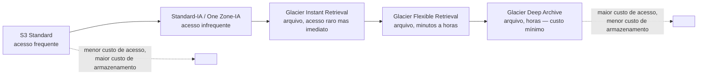
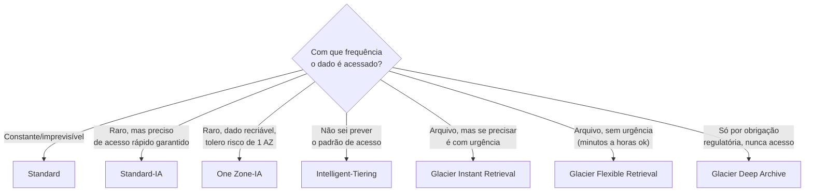
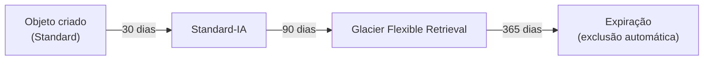
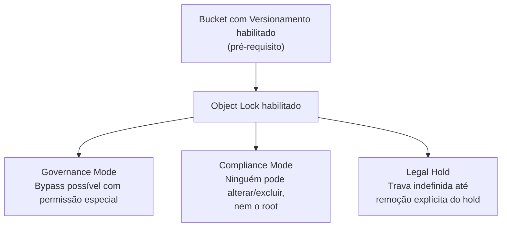
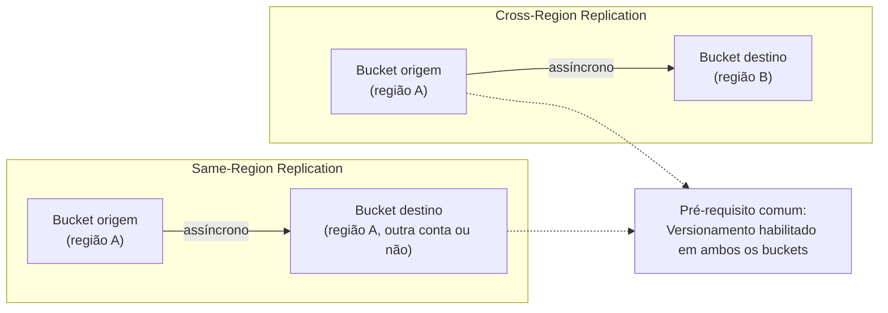
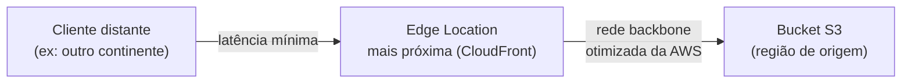
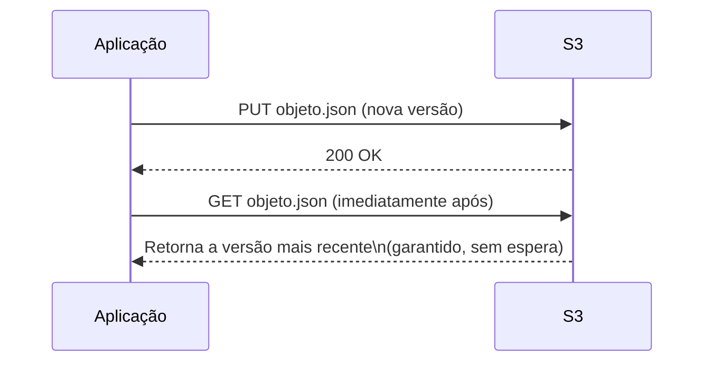
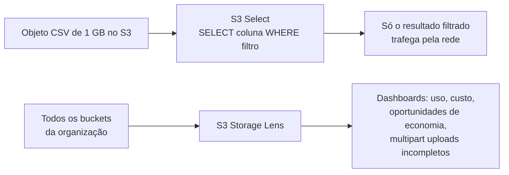
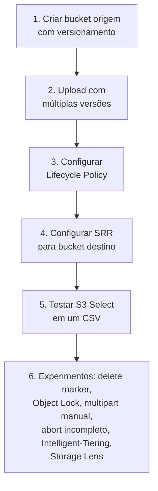

# S3 — Storage Classes e Performance — Guia Completo (Teoria + Prática + Dia a Dia)

## 0. O problema por trás das storage classes

S3 (Simple Storage Service) é armazenamento de objeto — você guarda arquivos inteiros (não blocos como no EBS), acessados via API HTTP, com durabilidade extremamente alta (a AWS anuncia 11 noves de durabilidade) porque cada objeto é replicado automaticamente entre múltiplos dispositivos, em múltiplas instalações, dentro de uma região.

O problema que as storage classes resolvem é puramente econômico: nem todo dado precisa do mesmo nível de "prontidão". Um log de acesso de 5 anos atrás quase nunca é lido, mas uma imagem de produto do seu e-commerce é lida o tempo todo. Cobrar o mesmo preço por GB para os dois seria desperdício de dinheiro para o cliente — então a AWS criou um espectro de classes, cada uma trocando **velocidade de acesso** e **disponibilidade** por **custo por GB armazenado**.

Pense nisso como guardar coisas em casa: o que você usa todo dia fica na gaveta (Standard); o que usa raramente vai pro armário do quarto de hóspedes (IA); o que praticamente nunca usa vai pro depósito alugado do outro lado da cidade, que demora para buscar mas custa quase nada por mês (Glacier).


*O espectro de storage classes do S3: da esquerda (rápido, caro por GB) para a direita (lento, barato por GB).*

---

## 1. As storage classes em detalhe

### S3 Standard

A classe padrão — alta disponibilidade, baixa latência, sem taxa de recuperação, replicado entre múltiplas AZs dentro da região. É a escolha default para qualquer dado ativamente usado.

**Uso real:** sites, aplicações web, distribuição de conteúdo, data lakes ativos, qualquer dado consultado com frequência imprevisível.

### S3 Standard-IA (Infrequent Access)

Mesma durabilidade e mesma **latência de milissegundos** que Standard (o dado ainda está "quente" no sentido de acesso imediato), mas custo de armazenamento por GB menor, em troca de: uma **taxa de recuperação por GB** ao acessar o dado, e um custo mínimo de armazenamento por objeto (objetos pequenos são cobrados como se tivessem um tamanho mínimo).

**Uso real:** backups, dados de recuperação de desastre, dados que você precisa manter acessíveis rapidamente se precisar, mas que na prática são acessados raramente (ex: uma vez por mês ou menos).

### S3 One Zone-IA

Igual ao Standard-IA, mas replicado em **uma única AZ**, não em múltiplas — por isso custa ainda menos. A contrapartida é óbvia: se aquela AZ específica tiver um problema físico grave, você perde o dado (a AWS não garante recuperação nesse cenário, diferente das classes multi-AZ).

**Uso real:** dados facilmente recriáveis (ex: thumbnails gerados a partir de uma imagem original que já está guardada em Standard/IA em outro lugar), cópias secundárias de dados que já têm uma cópia primária durável em outro lugar, dados não críticos onde o custo menor compensa o risco.

### S3 Intelligent-Tiering

Resolve um problema específico: **e quando você não sabe (ou não consegue prever) o padrão de acesso de um dado?** Ao invés de você decidir manualmente a classe, o Intelligent-Tiering monitora o padrão de acesso de cada objeto automaticamente e move o objeto entre camadas internas conforme o uso muda, sem taxa de recuperação e sem impacto de performance.

**Como funciona o monitoramento automático:** o serviço mantém camadas internas — uma de acesso frequente, uma de acesso infrequente (movida automaticamente após 30 dias sem acesso), uma de acesso raro (após 90 dias sem acesso), e, se você habilitar, camadas de arquivamento ainda mais baratas (equivalentes a Glacier Flexible Retrieval após ~90 dias adicionais, e Glacier Deep Archive após ~180 dias adicionais sem acesso) — tudo isso automaticamente, sem você precisar escrever uma lifecycle policy manual. Assim que um objeto na camada infrequente é acessado de novo, ele volta automaticamente para a camada frequente.

**No dia a dia:** é a escolha certa quando o padrão de acesso é **imprevisível ou muda ao longo do tempo** — por exemplo, um data lake onde alguns arquivos ficam "quentes" por semanas e depois esfriam, sem um padrão fixo. Existe uma pequena taxa de monitoramento por objeto, então para volumes gigantescos de objetos muito pequenos isso pode não compensar comparado a definir a classe manualmente.

### Glacier Instant Retrieval

Arquivamento com custo de armazenamento próximo ao Glacier tradicional, mas com **recuperação instantânea** (milissegundos, igual Standard) — diferente das outras classes Glacier, que têm delay de recuperação.

**Uso real:** dados de arquivo que raramente são acessados (uma vez por trimestre ou menos é o padrão citado pela AWS), mas que, quando alguém precisa, precisa **na hora** — ex: imagens médicas antigas de pacientes, registros que raramente são consultados mas que, se forem, alguém está esperando na tela.

### Glacier Flexible Retrieval

Arquivamento tradicional, com opções de velocidade de recuperação configuráveis:
- **Expedited:** minutos (mais caro).
- **Standard:** algumas horas.
- **Bulk:** até 12h, mais barato — usado para restaurar grandes volumes de dados de uma vez.

**Uso real:** arquivos que você precisa manter por razões regulatórias/compliance, mas que raramente (ou nunca) espera precisar recuperar com urgência — backups de longo prazo, dados históricos.

### Glacier Deep Archive

A classe mais barata de todas por GB armazenado, com o maior tempo de recuperação (tipicamente 12 horas em modo Standard). É o "fundo do poço" — literalmente pensada para dados que quase certamente nunca serão acessados, mas que você é **obrigado a guardar**.

**Uso real:** retenção de dados por exigência regulatória de longo prazo (7, 10+ anos), arquivo morto de compliance, dados que existem "só por precaução legal".

### Tabela comparativa

| Classe | Disponibilidade | Tempo de recuperação | Custo relativo (armazenamento) | Caso de uso típico |
|---|---|---|---|---|
| **Standard** | Muito alta (multi-AZ) | Imediato (ms) | Mais alto | Dado ativo, acesso frequente |
| **Standard-IA** | Alta (multi-AZ) | Imediato (ms) | Médio | Backup, DR, acesso raro mas urgente quando precisa |
| **One Zone-IA** | Menor (uma única AZ) | Imediato (ms) | Médio-baixo | Dado recriável, cópia secundária não crítica |
| **Intelligent-Tiering** | Igual à camada em que está | Imediato (ms) nas camadas frequentes/infrequentes | Variável, auto-otimizado | Padrão de acesso imprevisível/mutável |
| **Glacier Instant Retrieval** | Alta (multi-AZ) | Imediato (ms) | Baixo | Arquivo raramente acessado, mas urgente quando precisa |
| **Glacier Flexible Retrieval** | Alta (multi-AZ) | Minutos a horas (Expedited/Standard/Bulk) | Muito baixo | Arquivo de longo prazo, sem urgência |
| **Glacier Deep Archive** | Alta (multi-AZ) | Horas (tipicamente ~12h) | Mínimo | Retenção regulatória de longuíssimo prazo |


*Árvore de decisão entre as storage classes, baseada em previsibilidade e urgência de acesso.*

---

## 2. Lifecycle Policies — automatizando a transição entre classes

Uma Lifecycle Policy automatiza duas coisas: **transição** de objetos entre storage classes conforme a idade do objeto, e **expiração** (exclusão automática) de objetos após um período.

**Exemplo de regra comum no dia a dia:**
1. Objeto nasce em Standard.
2. Após 30 dias sem necessidade de acesso rápido constante, transiciona para Standard-IA.
3. Após 90 dias, transiciona para Glacier Flexible Retrieval.
4. Após 365 dias (ou o período exigido por regulação), expira (é excluído).

Você pode aplicar regras a um bucket inteiro ou filtrar por **prefixo** e/ou **tags** dos objetos — por exemplo, uma regra só para objetos com prefixo `logs/` ou com a tag `tipo=backup`.

**O que muita gente erra na prova:** esquecer que existe um custo mínimo de tempo de permanência em algumas classes (ex: Standard-IA e One Zone-IA têm mínimo de 30 dias; Glacier Flexible Retrieval tem mínimo de 90 dias; Deep Archive tem mínimo de 180 dias) — se a lifecycle policy tentar transicionar ou excluir um objeto antes desse mínimo, você é cobrado pelo tempo mínimo mesmo assim. Uma regra mal configurada que transiciona objetos "cedo demais e com frequência" pode acabar custando **mais** do que simplesmente deixar em Standard, por causa dessas taxas mínimas e das taxas de transição por objeto.


*Fluxo típico de uma Lifecycle Policy: transições programadas seguidas de expiração final.*

---

## 3. Versionamento, Lifecycle e Object Lock

### Versionamento

Quando habilitado num bucket, toda vez que um objeto com a mesma key é sobrescrito ou excluído, o S3 mantém a versão anterior em vez de descartá-la. Uma exclusão "normal" (sem especificar versão) na verdade só adiciona um **delete marker** — o objeto "some" da listagem padrão, mas as versões anteriores continuam existindo e podem ser restauradas.

**Como interage com Lifecycle:** com versionamento habilitado, você pode ter regras de lifecycle separadas para a **versão atual** e para **versões não-atuais** (`NoncurrentVersionTransition` / `NoncurrentVersionExpiration`) — por exemplo, manter a versão atual em Standard indefinidamente, mas mover versões antigas para Glacier após 30 dias e expirá-las de vez após 1 ano. Isso evita que um bucket versionado cresça sem controle, já que toda sobrescrita gera uma nova versão.

### Object Lock (WORM/compliance)

Implementa o modelo **WORM (Write Once, Read Many)** — uma vez gravado, o objeto não pode ser sobrescrito ou excluído durante o período de retenção, nem mesmo por um usuário root da conta. **Exige que o versionamento esteja habilitado** no bucket (é um pré-requisito técnico, não opcional).

Dois modos de retenção:
- **Governance mode:** usuários com uma permissão IAM especial (`s3:BypassGovernanceRetention`) ainda podem sobrescrever/excluir o objeto antes do fim da retenção — útil para casos internos que precisam de uma "válvula de escape" controlada.
- **Compliance mode:** **ninguém** pode alterar ou excluir o objeto antes do fim da retenção — nem o root da conta, nem a própria AWS. É a garantia mais forte, usada quando a exigência regulatória não permite nenhuma exceção.

Existe também **Legal Hold**, independente do período de retenção — trava o objeto indefinidamente até alguém remover o hold explicitamente (sem data de expiração automática), usado tipicamente durante litígios/investigações.

**Uso real:** setor financeiro (registros que a SEC/reguladores exigem que não possam ser alterados, ex: SEC Rule 17a-4), setor de saúde, qualquer cenário de compliance onde a imutabilidade do dado precisa ser **auditável e comprovável**, não apenas uma política interna de boas intenções.


*Object Lock exige versionamento e oferece três mecanismos de imutabilidade com garantias diferentes.*

---

## 4. Replicação — CRR vs SRR

Replicação copia objetos automaticamente de um bucket de origem para um bucket de destino, de forma assíncrona, assim que um objeto é criado (ou, com Batch Replication, retroativamente para objetos já existentes).

- **CRR (Cross-Region Replication):** replica para um bucket em **outra região**. Usado para Disaster Recovery geográfico, atender requisitos de latência para usuários em outra região (uma cópia local dos dados mais perto deles), ou requisitos de compliance que exigem uma cópia dos dados numa geografia específica.
- **SRR (Same-Region Replication):** replica para um bucket na **mesma região**. Usado para agregar logs de múltiplos buckets num bucket central, manter uma cópia em outra conta AWS (isolamento de segurança/organizacional), ou atender exigências de compliance que pedem redundância entre contas sem exigir geografia diferente.

**Pré-requisitos (comuns aos dois):**
- **Versionamento precisa estar habilitado** tanto no bucket de origem quanto no de destino.
- Uma role do IAM com permissão para o S3 replicar em seu nome.
- Por padrão, a replicação **não é retroativa** — só objetos criados/modificados **depois** de a regra ser habilitada são replicados (para replicar objetos já existentes, é preciso usar **S3 Batch Replication** explicitamente).
- Por padrão, a replicação **não é encadeada** — se o bucket de destino é também origem de outra regra de replicação, isso não acontece automaticamente a menos que configurado explicitamente (evita loops acidentais).


*CRR replica entre regiões (DR, latência, compliance geográfico); SRR replica dentro da mesma região (agregação de logs, isolamento entre contas).*

---

## 5. Performance — prefixos, multipart upload e Transfer Acceleration

### Request rate e prefixos

Historicamente, era prática comum "distribuir" prefixos de key para evitar gargalo de performance em alto volume de requisições. Hoje, o S3 **escala automaticamente** a taxa de requisições suportada por prefixo — não existe mais a necessidade de desenhar keys com hash aleatório no início só para "espalhar" a carga manualmente como era recomendado no passado.

**Números de referência (por prefixo, escalando automaticamente conforme o tráfego aumenta):** o S3 suporta uma taxa alta de requisições GET/HEAD e de requisições PUT/COPY/POST/DELETE por prefixo, e múltiplos prefixos multiplicam esse limite de forma independente — ou seja, se seu tráfego é distribuído entre muitos prefixos diferentes, o throughput agregado do bucket escala proporcionalmente, sem limite prático baixo.

**No dia a dia:** você ainda se beneficia de usar múltiplos prefixos quando espera tráfego **extremamente alto e concentrado** (ex: um evento com pico repentino de milhões de requisições por segundo em um único bucket) — nesse caso, distribuir entre prefixos ajuda o S3 a escalar mais rápido internamente, já que o auto-scaling de cada prefixo não é instantâneo, leva um tempo de "aquecimento".

### Multipart Upload

Divide um único objeto em múltiplas partes, enviadas **em paralelo**, remontadas pelo S3 no destino. É obrigatório para objetos acima de 5 GB, e **recomendado pela AWS a partir de ~100 MB**.

**Por que usar mesmo abaixo do limite obrigatório:**
- **Paralelismo:** múltiplas partes sobem ao mesmo tempo, usando melhor a largura de banda disponível — um upload de arquivo grande via uma única conexão TCP fica limitado pela latência/throughput daquela conexão específica; várias conexões paralelas juntas atingem throughput agregado maior.
- **Resiliência:** se uma parte falhar durante o upload, você reenvia só aquela parte, não o arquivo inteiro — importante em conexões instáveis ou uploads muito grandes onde recomeçar do zero seria caro em tempo e banda.
- **Pausar e retomar:** um upload multipart pode ser pausado e retomado depois (dentro da janela em que o upload não foi abortado/expirado).

### S3 Transfer Acceleration

Usa a rede global de **edge locations do CloudFront** para acelerar uploads/downloads de/para o S3, especialmente para usuários geograficamente distantes da região do bucket.

**Como funciona:** o cliente envia os dados para o edge location mais próximo dele (baixa latência nessa primeira perna), e a partir dali os dados trafegam pela **rede backbone otimizada da AWS** até o bucket na região de origem, em vez de trafegar pela internet pública o caminho inteiro. É essencialmente o mesmo princípio do endpoint Edge-Optimized do API Gateway (que também usa CloudFront) — só que aqui é para transferência de objetos, não para chamadas de API.

**No dia a dia:** útil quando você tem usuários/parceiros fazendo upload de arquivos grandes para o seu bucket a partir de localizações geograficamente distantes da região do bucket (ex: usuários no Brasil fazendo upload para um bucket em `us-east-1`, ou o inverso). A AWS disponibiliza uma ferramenta de comparação de velocidade (Speed Comparison Tool) para você testar se vale a pena para o seu caso — em transferências dentro da mesma região ou já com boa rota de rede, o ganho pode ser pequeno ou nenhum, e você paga um custo adicional por GB transferido com aceleração.


*S3 Transfer Acceleration usa a rede de edge locations do CloudFront para reduzir a distância "ruim" (internet pública) do trajeto.*

---

## 6. Modelo de consistência do S3

O S3 oferece **forte consistência de leitura após escrita (strong read-after-write consistency)** para todas as operações — GETs, PUTs e LISTs refletem a última escrita bem-sucedida imediatamente, para operações novas e para sobrescritas/exclusões de objetos existentes.

**Por que isso é relevante para arquitetura:** antigamente (antes dessa garantia se tornar padrão em todas as regiões), existia consistência eventual para sobrescritas/exclusões, e arquitetos precisavam desenhar em torno disso (ex: evitar ler um objeto imediatamente após sobrescrevê-lo, usar um identificador de versão para garantir que estava lendo o dado certo). Hoje isso não é mais necessário — você pode escrever um objeto e ler imediatamente em seguida, com garantia de ver o dado mais recente, sem lógica extra de retry ou espera.

**Pegadinha clássica de prova (para materiais mais antigos):** provas e materiais desatualizados ainda podem cobrar "S3 tem consistência eventual" como regra geral — isso deixou de ser verdade para o modelo atual do S3. Vale sempre considerar o contexto/data do material.


*Consistência forte: uma leitura imediatamente após uma escrita bem-sucedida sempre retorna o dado mais recente.*

---

## 7. S3 Select e S3 Storage Lens

### S3 Select

Permite executar uma consulta SQL simples (`SELECT ... WHERE ...`) diretamente sobre o **conteúdo** de um objeto (CSV, JSON, Parquet), retornando só o subconjunto de dados que interessa — em vez de baixar o objeto inteiro para filtrar no seu código depois.

**Por que isso importa para performance e custo:** imagine um arquivo CSV de 1 GB onde você só precisa de uma coluna e algumas linhas que batem com um filtro. Sem S3 Select, você baixa o 1 GB inteiro e filtra localmente — desperdiçando banda, tempo e, dependendo da carga, memória/CPU do lado do cliente. Com S3 Select, o filtro roda **do lado do S3**, e só o resultado filtrado trafega pela rede — a AWS relata reduções de custo e tempo de recuperação de dados significativas para esse tipo de padrão de acesso.

**Uso real:** análise ad-hoc de logs em CSV/JSON armazenados no S3, pipelines que processam só uma fração de arquivos grandes repetidamente.

### S3 Storage Lens

Ferramenta de análise e visibilidade em nível de **organização** — agrega métricas de uso e atividade de todos os buckets (inclusive entre múltiplas contas, se usado com AWS Organizations), com dashboards prontos e a possibilidade de exportar métricas detalhadas.

**Uso real:** identificar buckets/prefixos com dados que deveriam estar em uma storage class mais barata mas não estão (oportunidade de economia), detectar buckets com crescimento anômalo, encontrar uploads incompletos de multipart que estão sendo cobrados sem necessidade (um erro comum: um multipart upload abortado no meio do caminho continua sendo cobrado até ser explicitamente limpo — Storage Lens ajuda a identificar isso, e uma lifecycle rule de `AbortIncompleteMultipartUpload` resolve automaticamente).


*S3 Select filtra no servidor para reduzir dados trafegados; Storage Lens dá visibilidade agregada para otimização de custo.*

---

## 8. Conectando com os outros domínios da prova

- **Segurança:** Object Lock/Compliance mode, criptografia (SSE-S3/SSE-KMS/SSE-C), Bucket Policies e Block Public Access são pilares que costumam aparecer junto com storage classes em cenários de compliance.
- **Resiliência:** CRR é uma peça central de estratégias de Disaster Recovery multi-região; versionamento protege contra exclusão/sobrescrita acidental.
- **Custo:** é literalmente o eixo central deste arquivo — storage classes, lifecycle policies e Intelligent-Tiering existem primariamente para otimizar custo sem sacrificar durabilidade.

---

# 🧪 Laboratório prático (para executar na AWS)

## Objetivo
Criar um bucket versionado, configurar lifecycle, testar replicação SRR, e rodar uma consulta com S3 Select.

### Passo 1 — Criar o bucket de origem com versionamento
```bash
aws s3api create-bucket --bucket meu-bucket-lab-origem-12345 --region us-east-1
aws s3api put-bucket-versioning --bucket meu-bucket-lab-origem-12345 \
  --versioning-configuration Status=Enabled
```

### Passo 2 — Fazer upload de objetos de teste
```bash
echo "conteúdo v1" > arquivo.txt
aws s3 cp arquivo.txt s3://meu-bucket-lab-origem-12345/dados/arquivo.txt

echo "conteúdo v2" > arquivo.txt
aws s3 cp arquivo.txt s3://meu-bucket-lab-origem-12345/dados/arquivo.txt
```
Liste as versões:
```bash
aws s3api list-object-versions --bucket meu-bucket-lab-origem-12345
```

### Passo 3 — Configurar Lifecycle Policy
Crie um arquivo `lifecycle.json`:
```json
{
  "Rules": [
    {
      "ID": "transicao-lab",
      "Filter": {"Prefix": "dados/"},
      "Status": "Enabled",
      "Transitions": [
        {"Days": 30, "StorageClass": "STANDARD_IA"},
        {"Days": 90, "StorageClass": "GLACIER"}
      ],
      "NoncurrentVersionTransitions": [
        {"NoncurrentDays": 30, "StorageClass": "GLACIER"}
      ]
    }
  ]
}
```
```bash
aws s3api put-bucket-lifecycle-configuration \
  --bucket meu-bucket-lab-origem-12345 --lifecycle-configuration file://lifecycle.json
```

### Passo 4 — Configurar Same-Region Replication (SRR)
```bash
aws s3api create-bucket --bucket meu-bucket-lab-destino-12345 --region us-east-1
aws s3api put-bucket-versioning --bucket meu-bucket-lab-destino-12345 \
  --versioning-configuration Status=Enabled
```
Crie a role IAM de replicação e a regra (via console é mais direto para o lab: **Bucket → Management → Replication rules → Create replication rule**, apontando para `meu-bucket-lab-destino-12345`).

### Passo 5 — Testar S3 Select
```bash
aws s3 cp dados.csv s3://meu-bucket-lab-origem-12345/dados.csv

aws s3api select-object-content \
  --bucket meu-bucket-lab-origem-12345 \
  --key dados.csv \
  --expression "SELECT * FROM s3object s WHERE s._2 = 'ativo'" \
  --expression-type SQL \
  --input-serialization '{"CSV": {"FileHeaderInfo": "NONE"}}' \
  --output-serialization '{"CSV": {}}' \
  output.csv
```

### Passo 6 — Experimentos para fixar cada conceito
1. **Versionamento + delete marker:** exclua o objeto `dados/arquivo.txt` sem especificar versão, confirme que ele some da listagem padrão, depois liste com `list-object-versions` e restaure removendo o delete marker.
2. **Object Lock:** crie um novo bucket com Object Lock habilitado na criação (`--object-lock-enabled-for-bucket`), suba um objeto com retenção de alguns dias em Governance mode, e tente excluí-lo antes do prazo (deve falhar sem o bypass).
3. **Multipart upload manual:** use `aws s3api create-multipart-upload`, `upload-part` (em pelo menos 2 partes) e `complete-multipart-upload` num arquivo de teste maior, para ver o fluxo completo sem o `aws s3 cp` abstrair isso.
4. **Lifecycle para multipart incompleto:** adicione uma regra `AbortIncompleteMultipartUpload` com `DaysAfterInitiation: 1` e explique por que isso evita custo de uploads abandonados.
5. **Intelligent-Tiering:** faça upload de um objeto com `--storage-class INTELLIGENT_TIERING` e explore, no console, as configurações de camadas de arquivamento opcionais (Archive Access / Deep Archive Access).
6. **Storage Lens:** abra o dashboard padrão do S3 Storage Lens no console e identifique, para a conta usada no lab, quais buckets têm mais objetos fora da classe Standard.


*Sequência dos passos do laboratório prático.*

---

## Comandos AWS CLI úteis

```bash
# Criar bucket e habilitar versionamento
aws s3api create-bucket --bucket meu-bucket --region us-east-1
aws s3api put-bucket-versioning --bucket meu-bucket --versioning-configuration Status=Enabled

# Upload especificando storage class
aws s3 cp arquivo.txt s3://meu-bucket/arquivo.txt --storage-class STANDARD_IA

# Aplicar lifecycle policy
aws s3api put-bucket-lifecycle-configuration --bucket meu-bucket --lifecycle-configuration file://lifecycle.json

# Habilitar Object Lock num bucket novo
aws s3api create-bucket --bucket meu-bucket-lock --object-lock-enabled-for-bucket

# Colocar retenção em um objeto (Object Lock)
aws s3api put-object-retention --bucket meu-bucket-lock --key arquivo.txt \
  --retention '{"Mode":"GOVERNANCE","RetainUntilDate":"2027-01-01T00:00:00Z"}'

# Configurar replicação (referenciando um JSON de configuração)
aws s3api put-bucket-replication --bucket meu-bucket --replication-configuration file://replication.json

# Restaurar objeto do Glacier Flexible Retrieval
aws s3api restore-object --bucket meu-bucket --key arquivo-arquivado.zip \
  --restore-request '{"Days":7,"GlacierJobParameters":{"Tier":"Standard"}}'

# Listar todas as versões de objetos (incluindo delete markers)
aws s3api list-object-versions --bucket meu-bucket

# Habilitar Transfer Acceleration
aws s3api put-bucket-accelerate-configuration --bucket meu-bucket --accelerate-configuration Status=Enabled

# Consultar métricas de Storage Lens (via console é mais comum, mas dá para configurar via CLI)
aws s3control get-storage-lens-configuration --account-id 123456789012 --config-id default-account-dashboard
```

---

## Tabela de decisão rápida (prova + dia a dia)

| Cenário | Resposta provável |
|---|---|
| Dado acessado com frequência, sem padrão previsível | S3 Standard |
| Backup/DR acessado raramente, mas precisa ser rápido quando acessar | S3 Standard-IA |
| Dado recriável, custo mínimo, tolera perda por falha de 1 AZ | S3 One Zone-IA |
| Padrão de acesso imprevisível ou que muda ao longo do tempo | S3 Intelligent-Tiering |
| Arquivo raramente acessado, mas urgente quando precisa | Glacier Instant Retrieval |
| Arquivo de longo prazo, recuperação em minutos/horas é aceitável | Glacier Flexible Retrieval |
| Retenção regulatória de longuíssimo prazo, praticamente nunca acessado | Glacier Deep Archive |
| Exigência legal de imutabilidade (WORM), sem exceções nem para o root | Object Lock — Compliance mode |
| Imutabilidade com válvula de escape interna controlada | Object Lock — Governance mode |
| Objeto travado indefinidamente por litígio/investigação | Legal Hold |
| Cópia de dados em outra região para DR/compliance geográfico | CRR |
| Agregação de logs / isolamento entre contas na mesma região | SRR |
| Upload de arquivo grande (> 100 MB) | Multipart Upload |
| Usuários distantes geograficamente fazendo upload para um bucket fixo | S3 Transfer Acceleration |
| Preciso ler só uma parte de um CSV/JSON grande sem baixar tudo | S3 Select |
| Visibilidade agregada de custo/uso entre buckets e contas | S3 Storage Lens |
| "Ler logo após escrever pode retornar dado antigo?" | Não — S3 tem consistência forte read-after-write |
