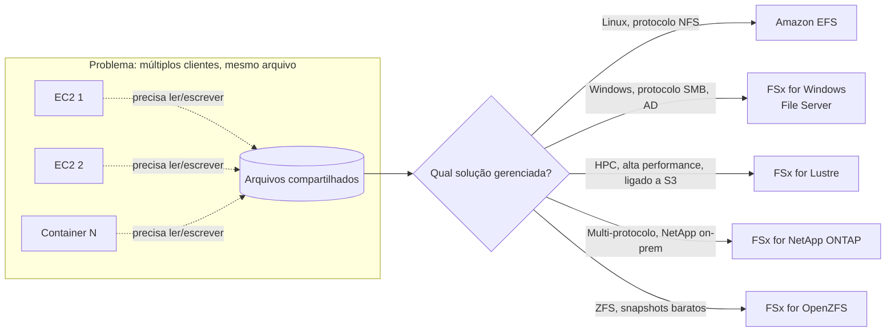
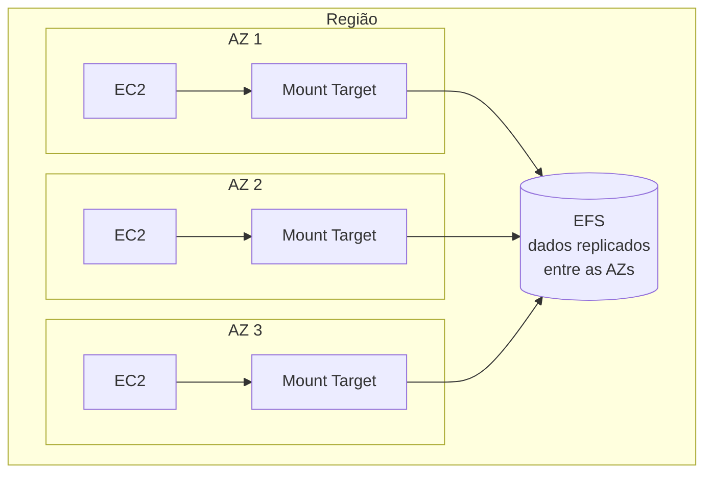
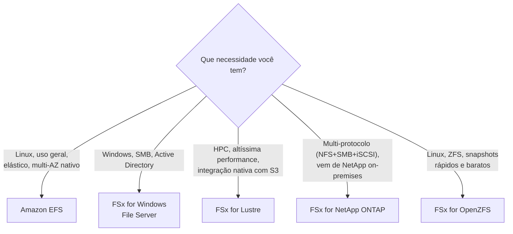
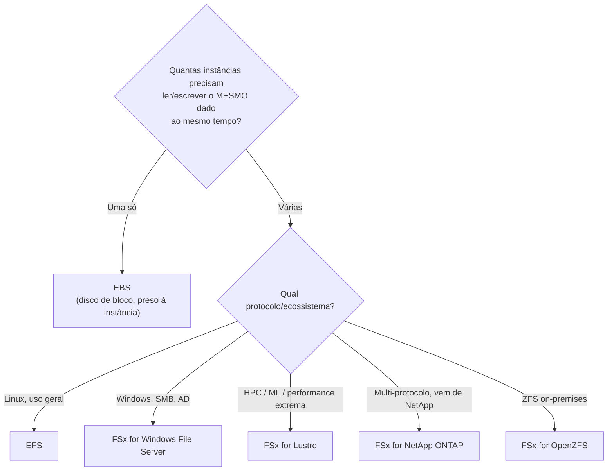
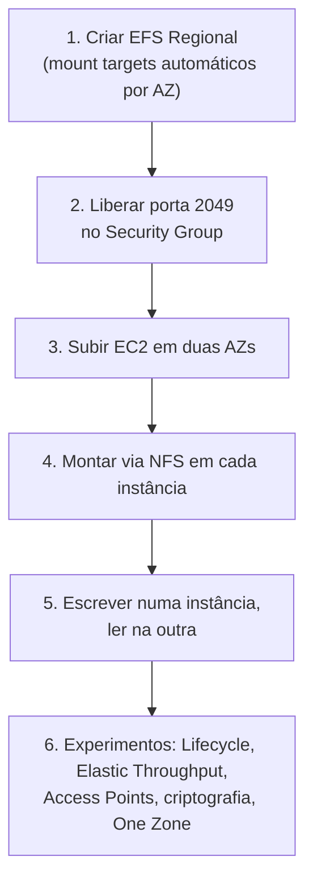

# EFS e FSx — Guia Completo (Teoria + Prática + Dia a Dia)

## 0. O problema que sistemas de arquivos gerenciados resolvem

Antes de entrar nos serviços, vale entender por que eles existem.

Um volume **EBS** é preso a **uma única instância EC2 por vez** (mesmo o Multi-Attach tem limitações fortes: só alguns tipos de volume, só Linux, sem sistema de arquivo com lock coordenado nativo para a maioria dos casos). Isso é ótimo para o disco de boot de um servidor, mas quebra na hora que você precisa de **vários servidores lendo e escrevendo no mesmo conjunto de arquivos ao mesmo tempo** — um cluster de servidores web servindo os mesmos assets, uma fazenda de renderização, um cluster de análise de dados, ou um monte de containers que precisam compartilhar arquivos de configuração/upload.

Historicamente, no on-premises, isso é resolvido com um **file server dedicado** (NFS no Linux, um servidor Windows com compartilhamento SMB) — um servidor central que expõe uma pasta pela rede, e todo mundo monta essa pasta. O problema é que você mesmo precisa: provisionar o servidor, dimensionar o disco, cuidar de HA, fazer backup, aplicar patch.

O **EFS** e a família **FSx** são a versão gerenciada disso: um "servidor de arquivos" pela rede, sem você precisar rodar o servidor. A diferença entre eles está em **qual protocolo, qual sistema operacional cliente, e qual caso de uso de performance** cada um resolve melhor.


*EBS resolve "um disco, uma instância". EFS/FSx resolvem "um sistema de arquivos, muitos clientes ao mesmo tempo".*

---

## 1. Amazon EFS — arquitetura e elasticidade

O EFS é um sistema de arquivos **NFS (Network File System) totalmente gerenciado**, pensado para clientes **Linux** (EC2, containers ECS/EKS, Lambda até certo ponto, on-premises via Direct Connect/VPN).

### Elástico de verdade — sem provisionar tamanho

Diferente de um volume EBS, onde você escolhe um tamanho fixo (e paga por ele mesmo vazio), o EFS **cresce e encolhe automaticamente** conforme você adiciona ou remove arquivos. Você não escolhe "quantos GB quero" — você só usa, e paga pelo que está armazenado naquele momento. Não existe operação de "resize" porque não existe um tamanho fixo para redimensionar.

**No dia a dia:** isso é o motivo pelo qual EFS é tão usado para diretórios de upload de usuário, diretórios `/home` compartilhados, ou volumes de configuração que crescem de forma imprevisível — você nunca vai ficar sem espaço por ter dimensionado errado, e nunca paga por espaço alocado e não usado.

### Multi-AZ por padrão

Ao criar um EFS **Regional** (o tipo padrão e recomendado), a AWS automaticamente armazena os dados **redundantemente em múltiplas AZs** da região, e você monta o sistema de arquivos através de um **mount target por AZ** (uma ENI dentro de cada subnet onde você quer acesso). Isso significa que o EFS já nasce com alta disponibilidade e durabilidade multi-AZ **sem você configurar réplica nenhuma** — é fundamentalmente diferente do EBS, que vive numa AZ só e precisa de snapshot/réplica manual para se tornar multi-AZ.

Existe também o modo **One Zone**, mais barato, que vive numa AZ só — trade-off claro de custo vs resiliência, usado quando o dado é reconstruível ou não crítico (ex: dado de processamento intermediário, ambiente de dev/teste).


*Um mount target por AZ, todos apontando para o mesmo sistema de arquivos replicado — cada instância monta o mount target da sua própria AZ para menor latência.*

**O que muita gente erra na prova:** achar que precisa criar um EFS por AZ. Não — é **um único sistema de arquivos regional**, e você só cria mount targets nas subnets/AZs onde tem instâncias que precisam acessá-lo. O ideal é sempre montar usando o mount target da própria AZ da instância (menor latência, sem custo de tráfego cross-AZ).

### Performance Modes

Definidos na criação do sistema de arquivos, **não podem ser alterados depois** (só recriando o EFS):

| Performance Mode | Comportamento | Quando usar |
|---|---|---|
| **General Purpose** (padrão) | Menor latência por operação | Praticamente todo caso de uso — web servers, CMS, diretórios home, pipelines de CI/CD |
| **Max I/O** | Latência um pouco maior por operação, mas escala para **throughput e IOPS agregados muito mais altos** entre milhares de clientes simultâneos | Cargas altamente paralelas com **milhares de clientes** acessando ao mesmo tempo (ex: big data, processamento científico distribuído em larga escala) |

**Pegadinha clássica de prova:** Max I/O parece "melhor" pelo nome, mas na verdade é pior em latência individual — só compensa quando você tem paralelismo massivo. A resposta padrão em 95% dos cenários de prova é **General Purpose**.

### Throughput Modes

Controla **quanto throughput agregado** (MB/s) o sistema de arquivos consegue entregar — isso é independente do Performance Mode.

| Throughput Mode | Como funciona | Quando usar |
|---|---|---|
| **Bursting** (padrão) | Throughput é atrelado ao **tamanho armazenado** — quanto mais dado guardado, maior o throughput baseline permitido. Acumula "créditos de burst" nos períodos de baixo uso para picos depois | Cargas de uso geral, onde o throughput necessário cresce proporcionalmente ao tamanho dos dados |
| **Provisioned** | Você define um throughput fixo em MB/s, **independente do tamanho armazenado** | Sistema de arquivos pequeno em tamanho mas que precisa de throughput alto (ex: poucos GB de dados, mas muitas operações de I/O) |
| **Elastic** (recomendado atualmente) | O EFS **ajusta o throughput automaticamente** para cima e para baixo conforme a demanda real da aplicação, sem você precisar prever nada | Cargas com padrão de tráfego imprevisível/variável — é a opção "não pensar mais nisso", e é o modo recomendado pela AWS para a maioria dos casos novos |

**No dia a dia:** o modo **Bursting** é famoso por um problema prático — sistemas de arquivos pequenos (poucos GB) esgotam os créditos de burst rápido e o throughput despenca justamente quando você mais precisa. É o cenário clássico de "meu EFS estava rápido e agora ficou lento do nada" — a causa costuma ser esgotamento de burst credits com throughput baseline baixo por causa do tamanho pequeno armazenado. O **Elastic** resolve exatamente esse problema e, hoje em dia, é a recomendação padrão da AWS para a maioria das cargas nem sempre previsíveis.


*Escolha do Throughput Mode: se o padrão de uso é imprevisível, Elastic tende a ser a resposta certa hoje em dia.*

### Storage Classes — otimizando custo

O EFS tem um recurso de **Lifecycle Management** que move arquivos automaticamente entre classes de armazenamento com base em quando foram acessados pela última vez — sem você mexer em nada depois de configurar a política.

| Storage Class | Custo | Latência de acesso | Quando o arquivo migra para cá |
|---|---|---|---|
| **EFS Standard** | Mais caro | Baixíssima (milissegundos) | Dado acessado frequentemente |
| **EFS Standard-IA** (Infrequent Access) | ~mais barato que Standard | Levemente maior no primeiro acesso | Não acessado há N dias (ex: 30, configurável) |
| **EFS Archive** | O mais barato dos três | Maior ainda no acesso | Não acessado há um período bem mais longo (dados "frios" de retenção) |

Também existem as variantes **One Zone-IA** e **One Zone-Archive** para o modo One Zone.

**Uso real:** você configura a política de lifecycle (ex: "mover para IA depois de 30 dias sem acesso") uma vez, e o EFS cuida da movimentação sozinho — o mesmo arquivo, se for acessado de novo, pode voltar automaticamente para Standard dependendo da política configurada. Isso é extremamente parecido em espírito com o S3 Lifecycle/Intelligent-Tiering, só que para um sistema de arquivos POSIX.


*Lifecycle Management move arquivos entre classes automaticamente com base no padrão de acesso.*

### Modos de acesso: EFS Access Points

**Access Points** são "portas de entrada" alternativas para o mesmo sistema de arquivos, cada uma podendo forçar um diretório raiz diferente e um usuário/grupo POSIX diferente. Isso é muito usado com **containers (ECS/EKS)** e **Lambda**, onde cada aplicação/container deve enxergar só o seu próprio subdiretório dentro do EFS, com permissões isoladas, sem precisar de lógica de path no código da aplicação.

**No dia a dia:** é a forma recomendada de dar acesso multi-tenant a um único EFS — cada cliente/aplicação recebe um Access Point apontando para seu próprio diretório, com enforcement de permissão feito pelo próprio EFS, não pela aplicação.

---

## 2. A família FSx

Enquanto o EFS resolve bem o caso "Linux + NFS + uso geral", a família FSx existe para casos onde você precisa de um **protocolo diferente**, de **integração com um ecossistema específico**, ou de **performance extrema** que o EFS não é desenhado para entregar.

### FSx for Windows File Server

Sistema de arquivos Windows nativo, falando **SMB** (o protocolo de compartilhamento de arquivos do Windows), com suporte completo a **NTFS**, **Active Directory** (integração com AD Self-Managed ou AWS Managed Microsoft AD), **listas de controle de acesso (ACLs)** no nível de arquivo, e **cotas de usuário/grupo**.

**Uso real:** migração de aplicações Windows legadas que dependem de compartilhamento de rede (`\\servidor\pasta`), servidores de arquivo corporativos, perfis de usuário móveis (roaming profiles), aplicações .NET que esperam um file share SMB tradicional. É basicamente o "substituto gerenciado" de um Windows File Server on-premises.

**Detalhe importante:** ele se integra nativamente com o **Active Directory** para autenticação e permissões — isso é algo que o EFS simplesmente não tem, porque EFS usa permissões POSIX (Linux), não ACLs do Windows.

### FSx for Lustre

**Lustre** é um sistema de arquivos open-source desenhado para **HPC (High Performance Computing)** — o tipo de carga que precisa de throughput altíssimo e latência baixíssima com acesso paralelo massivo: simulação científica, machine learning em larga escala, processamento de imagem/vídeo, modelagem financeira, genômica.

**A integração com S3 é o grande diferencial dele:** você pode criar um FSx for Lustre **linkado a um bucket S3**, e ele "importa" os objetos do S3 como se fossem arquivos, sob demanda (lazy loading) — seus jobs de computação leem/escrevem no FSx com a performance de um sistema de arquivos POSIX de altíssima performance, e você pode exportar os resultados de volta pro S3 depois. Isso resolve um problema real: rodar um cluster de treinamento de ML lendo direto do S3 via API é mais lento e mais complexo de programar do que ler de um sistema de arquivos POSIX local montado.

**No dia a dia:** o padrão típico é "sobe um cluster de computação (ex: EC2 com GPU, ou um cluster gerenciado por AWS ParallelCluster), monta o FSx for Lustre linkado ao bucket de dados de treinamento no S3, processa em alta velocidade, exporta o resultado de volta pro S3, desliga o cluster". É um padrão efêmero — muita gente cria o FSx for Lustre só durante a janela do job.


*FSx for Lustre como camada de alta performance entre o dataset persistido no S3 e o cluster de computação.*

### FSx for NetApp ONTAP

Sistema de arquivos gerenciado rodando o software **ONTAP** da NetApp — muito usado por empresas que já têm infraestrutura NetApp on-premises e querem uma extensão/migração para a nuvem sem reescrever nada.

**Grande diferencial: multi-protocolo.** O mesmo volume pode ser acessado simultaneamente via **NFS** (Linux), **SMB** (Windows) e **iSCSI** (bloco) — algo que nenhum outro serviço dessa lista faz sozinho. Também traz features avançadas do ONTAP como **snapshots eficientes em espaço**, **deduplicação e compressão inline**, e **clonagem instantânea de volumes** (útil para criar cópias de ambiente de teste sem duplicar o dado fisicamente).

**Uso real:** empresas migrando workloads NetApp on-premises para a AWS mantendo as mesmas ferramentas de gestão de storage, ou cenários híbridos onde parte do ambiente é Linux e parte é Windows acessando o mesmo dado.

### FSx for OpenZFS

Sistema de arquivos gerenciado rodando o sistema de arquivos **ZFS** open-source, para clientes **Linux/NFS**. Se destaca por **performance muito alta em baixa latência** (bom para bancos de dados e cargas sensíveis a latência) e por snapshots extremamente rápidos e baratos em espaço (ZFS é conhecido por isso, usando copy-on-write).

**Uso real:** migração de workloads que já rodavam em ZFS on-premises, ou cargas Linux que precisam de performance de storage muito alta com clonagem/snapshot barato (ex: ambientes de dev que clonam produção repetidamente para testes).


*Árvore de decisão entre EFS e as quatro variantes de FSx, com base no protocolo/ecossistema necessário.*

---

## 3. EFS vs EBS vs FSx — tabela comparativa e quando escolher cada um

| Característica | EBS | EFS | FSx for Windows | FSx for Lustre |
|---|---|---|---|---|
| **Protocolo** | Bloco (device), não é "arquivo" | NFS | SMB | Lustre (POSIX de alta performance) |
| **Multi-instância simultânea (read/write)** | Não, na prática (Multi-Attach tem restrições fortes) | Sim, nativo — esse é o motivo dele existir | Sim, nativo | Sim, nativo |
| **SO compatível** | Linux e Windows (mas 1 instância por vez) | Linux (NFS) | Windows (nativo); Linux com cliente NFS parcial | Linux |
| **Escala de tamanho** | Fixo, você escolhe e faz resize manual | Elástico automático, sem tamanho fixo | Provisionado, com resize manual | Provisionado, com resize manual |
| **Multi-AZ nativo** | Não (uma AZ só; replica via snapshot) | Sim, por padrão (modo Regional) | Sim, no modo Multi-AZ | Não é o foco (geralmente single-AZ para performance) |
| **Caso de uso típico** | Disco de boot, banco de dados de alta IOPS de uma única instância | Diretório compartilhado Linux, uploads, configs, CMS, `/home` | Migração de file server Windows, apps .NET, AD | HPC, ML, processamento científico, integração S3 |

**Como pensar na hora da prova:** a pergunta-chave é sempre "**quantas instâncias precisam acessar o mesmo dado ao mesmo tempo, com read/write?**". Se a resposta é "uma só" → EBS. Se é "várias, Linux, uso geral" → EFS. Se é "várias, precisa de SMB/AD" → FSx for Windows. Se é "várias, preciso de desempenho extremo tipo HPC" → FSx for Lustre. Se aparecer "NetApp" ou "multi-protocolo" no enunciado → FSx for ONTAP. Se aparecer "ZFS" → FSx for OpenZFS.


*Fluxo de decisão rápido: número de clientes simultâneos primeiro, depois protocolo/ecossistema.*

---

## 4. Segurança, Resiliência, Performance e Custo — conectando aos 4 domínios da prova

- **Segurança:** EFS e FSx suportam **criptografia em repouso (KMS)** e **em trânsito**. O controle de acesso à rede é feito por **Security Groups** nos mount targets/ENIs, e o EFS ainda soma **permissões POSIX** (usuário/grupo) e **Access Points** para isolamento multi-tenant; FSx for Windows soma **ACLs do Active Directory**.
- **Resiliência:** EFS é multi-AZ nativo por padrão (modo Regional); FSx for Windows tem modo Multi-AZ opcional; FSx for Lustre normalmente prioriza performance (single-AZ) mas pode ser reconstruído a partir do S3 linkado — é comum tratá-lo como recurso "efêmero e reconstruível" em vez de fonte de verdade duradoura.
- **Performance:** cada storage class/mode existe justamente para balancear performance — Performance Mode e Throughput Mode no EFS, e a própria existência do FSx for Lustre como "EFS para HPC".
- **Custo:** EFS com Lifecycle Management movendo dado frio para IA/Archive é a alavanca de custo mais usada; no FSx, o padrão "sobe o Lustre, processa, desliga" evita pagar por capacidade computacional-adjacente ociosa.

---

# 🧪 Laboratório prático (para executar na AWS)

## Objetivo
Criar um sistema de arquivos EFS, montá-lo em duas instâncias EC2 em AZs diferentes, e comprovar o compartilhamento de arquivos entre elas.

### Passo 1 — Criar o EFS
Console → EFS → **Create file system**
- Nome: `meu-efs-lab`
- VPC: sua VPC padrão
- Deixe **Regional**, **Bursting** throughput mode, **General Purpose** performance mode (padrões)
- Confirme que os **mount targets** foram criados automaticamente em cada AZ da VPC

### Passo 2 — Ajustar o Security Group do mount target
- Edite o Security Group associado aos mount targets do EFS
- Permita entrada na porta **2049 (NFS)** a partir do Security Group das suas instâncias EC2

### Passo 3 — Subir duas instâncias EC2 em AZs diferentes
- `ec2-a` na AZ 1, `ec2-b` na AZ 2, ambas com o cliente NFS instalado (`amazon-linux-extras install -y epel && yum install -y nfs-utils` ou equivalente)

### Passo 4 — Montar o EFS nas duas instâncias
```bash
sudo mkdir /mnt/efs
sudo mount -t nfs4 -o nfsvers=4.1 {file-system-id}.efs.{regiao}.amazonaws.com:/ /mnt/efs
```

### Passo 5 — Testar o compartilhamento
```bash
# na ec2-a
echo "escrito pela instancia A" | sudo tee /mnt/efs/teste.txt

# na ec2-b
cat /mnt/efs/teste.txt
```
Se aparecer o texto escrito pela instância A, o compartilhamento multi-AZ está funcionando.

### Passo 6 — Experimentos para fixar cada conceito
1. **Lifecycle Management:** ative a política de mover para **Standard-IA** após 30 dias, e leia a documentação do console sobre como simular/verificar isso sem esperar 30 dias de fato.
2. **Throughput Mode:** troque de Bursting para **Elastic** e observe no console que não há mais necessidade de acompanhar "créditos de burst".
3. **Access Points:** crie um Access Point apontando para `/dados-app1` com um usuário POSIX customizado, monte usando esse Access Point, e confirme que os arquivos criados já nascem com o dono/grupo configurado.
4. **Criptografia:** tente criar um EFS sem criptografia em repouso e note que, dependendo da configuração da conta (Default Encryption), isso pode já vir bloqueado — reforça a boa prática de sempre criptografar.
5. **One Zone:** crie um segundo EFS no modo **One Zone** e compare o custo estimado exibido no console com o do modo Regional.


*Sequência do laboratório: criar, liberar rede, montar em múltiplas AZs, provar o compartilhamento.*

---

## Comandos AWS CLI úteis

```bash
# Criar um sistema de arquivos EFS (modo Regional, criptografado)
aws efs create-file-system \
  --performance-mode generalPurpose \
  --throughput-mode elastic \
  --encrypted \
  --tags Key=Name,Value=meu-efs-lab

# Criar um mount target numa subnet específica
aws efs create-mount-target \
  --file-system-id fs-xxxxxxxx \
  --subnet-id subnet-xxxxxxxx \
  --security-groups sg-xxxxxxxx

# Listar sistemas de arquivos
aws efs describe-file-systems

# Criar uma política de lifecycle (mover para IA após 30 dias sem acesso)
aws efs put-lifecycle-configuration \
  --file-system-id fs-xxxxxxxx \
  --lifecycle-policies TransitionToIA=AFTER_30_DAYS

# Criar um FSx for Windows File Server
aws fsx create-file-system \
  --file-system-type WINDOWS \
  --storage-capacity 300 \
  --subnet-ids subnet-xxxxxxxx \
  --windows-configuration ActiveDirectoryId=d-xxxxxxxxxx,ThroughputCapacity=32

# Criar um FSx for Lustre linkado a um bucket S3
aws fsx create-file-system \
  --file-system-type LUSTRE \
  --storage-capacity 1200 \
  --subnet-ids subnet-xxxxxxxx \
  --lustre-configuration DataRepositoryConfiguration="{ImportPath=s3://meu-bucket-dataset}"
```

---

## Tabela de decisão rápida (prova + dia a dia)

| Cenário | Resposta provável |
|---|---|
| Vários EC2 Linux precisam ler/escrever o mesmo diretório | Amazon EFS |
| Migração de file server Windows com Active Directory | FSx for Windows File Server |
| Cluster de HPC/ML lendo dataset gigante do S3 com alta performance | FSx for Lustre |
| Empresa já usa NetApp on-premises, precisa de NFS + SMB no mesmo volume | FSx for NetApp ONTAP |
| Workload que já roda em ZFS, precisa de snapshots baratos | FSx for OpenZFS |
| Disco de boot ou banco de dados de uma única instância EC2 | EBS |
| Sistema de arquivos que precisa crescer sem redimensionamento manual | EFS (elástico por natureza) |
| Reduzir custo de arquivos antigos sem apagar nada | EFS Lifecycle Management (IA/Archive) |
| Padrão de tráfego imprevisível no EFS | Throughput Mode Elastic |
| Milhares de clientes simultâneos acessando o mesmo EFS | Performance Mode Max I/O |
