# RDS e Aurora — Guia Completo (Teoria + Prática + Dia a Dia)

## 0. O problema que o RDS resolve

Rodar um banco de dados relacional você mesmo (numa EC2 "crua") significa cuidar de: instalação e patch do engine, configuração de replicação, monitoramento de disco/CPU/memória, backup, failover manual em caso de queda, upgrade de versão sem downtime, tuning de parâmetros... isso é trabalho operacional constante que não é a lógica de negócio da sua aplicação.

O **RDS (Relational Database Service)** é a versão gerenciada disso: você escolhe o engine, o tamanho da instância, e a AWS cuida de provisionamento, patch (em janelas de manutenção configuráveis), backup automático, e oferece opções prontas de alta disponibilidade (Multi-AZ) e escala de leitura (Read Replicas) com poucos cliques.

O **Aurora** é um passo além: um engine de banco relacional **próprio da AWS**, compatível com o protocolo/driver de MySQL ou PostgreSQL, mas com uma arquitetura de armazenamento completamente redesenhada para nuvem — mais rápido, mais resiliente, e mais elástico do que o MySQL/PostgreSQL "padrão" rodando no RDS convencional.

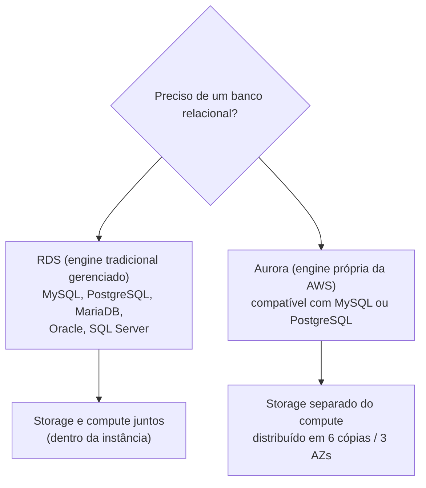
*RDS gerencia engines tradicionais; Aurora é uma reengenharia da camada de storage para ser nativa de nuvem.*

---

## 1. RDS — engines suportados

O RDS suporta seis engines: **MySQL**, **PostgreSQL**, **MariaDB**, **Oracle**, **SQL Server**, e o próprio **Aurora** (tecnicamente o Aurora "vive" dentro do console/API do RDS, mas com arquitetura interna diferente, coberta na seção 2).

**No dia a dia:** a escolha do engine normalmente não é uma decisão técnica livre — é ditada pelo que a aplicação já usa (ex: uma aplicação .NET legada que depende de features específicas do SQL Server, um sistema que já roda em Oracle por causa de licenciamento antigo) ou pela preferência de equipe (MySQL/PostgreSQL são as escolhas mais comuns para projetos novos, com PostgreSQL ganhando popularidade por ter mais recursos avançados nativos: JSON, extensões como PostGIS, etc).

---

## 2. Multi-AZ vs Read Replicas — a diferença de propósito que a prova mais cobra

Essa é provavelmente a distinção mais testada de todo o domínio de bancos de dados na SAA-C03, e o erro mais comum é achar que os dois servem para "melhorar performance". **Não é bem assim.**

### Multi-AZ — propósito é alta disponibilidade, não performance

Quando você habilita Multi-AZ, o RDS cria automaticamente uma **instância standby** numa AZ diferente, e mantém os dados sincronizados através de **replicação síncrona**: toda escrita só é confirmada ao cliente depois de ser gravada tanto na instância primária quanto na standby.

**Por que síncrona:** porque o objetivo é garantir que, se a AZ primária cair agora, a standby tenha exatamente os mesmos dados, sem perda. Isso tem um custo: cada escrita espera a confirmação da réplica antes de responder ao cliente, o que adiciona latência de escrita. É uma troca deliberada — você aceita uma latência um pouco maior em troca de zero perda de dados em caso de falha.

**Failover automático:** se a instância primária falhar (falha de hardware, falha de AZ, ou até durante uma manutenção/patch programado), o RDS detecta e promove automaticamente a standby a primária, atualizando o **DNS endpoint** (o mesmo endpoint que sua aplicação já usa) para apontar para a nova primária. Sua aplicação não precisa saber o IP novo — ela só precisa reconectar (o driver de conexão, ao perder a conexão, reconecta no mesmo hostname, que agora resolve para a nova primária).

**Detalhe importante:** a standby **não pode ser lida diretamente** no RDS tradicional (não-Aurora) — ela existe exclusivamente para failover, não para servir tráfego de leitura. Isso é diferente do Aurora, onde o modelo de storage compartilhado muda esse comportamento (ver seção 3).

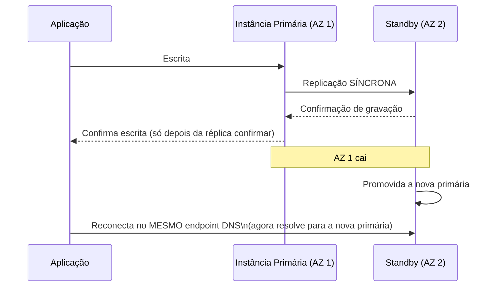
*Replicação síncrona garante zero perda de dados no failover; o custo é latência extra em cada escrita.*

### Read Replicas — propósito é escalar leitura, não HA

Uma Read Replica é uma **cópia adicional do banco**, atualizada via **replicação assíncrona** a partir da instância de origem. Diferente da standby do Multi-AZ, uma Read Replica **pode e deve ser usada para servir tráfego de leitura** — sua aplicação aponta consultas `SELECT` para o endpoint da réplica, tirando essa carga da instância principal.

**Por que assíncrona:** porque o objetivo aqui não é garantir zero perda de dado em failover — é escalar leitura sem impactar a performance de escrita da origem. Se a réplica tivesse que confirmar cada escrita antes da origem responder (síncrono), você teria o mesmo custo de latência do Multi-AZ, e a origem ficaria refém da velocidade da réplica. Com replicação assíncrona, a origem não espera a réplica — ela só propaga a mudança "depois", o que introduz **lag de replicação** (a réplica pode estar alguns segundos atrasada em relação à origem).

**Read Replicas podem ser cross-region:** diferente do Multi-AZ (que é sempre dentro da mesma região, em AZs diferentes), você pode criar uma Read Replica em **outra região inteira** — útil para servir usuários de outra parte do mundo com leitura de baixa latência local, ou como base para uma estratégia de disaster recovery cross-region (você pode promover uma Read Replica a instância standalone gravável em caso de desastre na região de origem).

**Podem ser promovidas a instância independente:** uma Read Replica pode se "desconectar" da origem e virar um banco standalone completo (com capacidade de escrita) — isso é usado tanto para DR (promover a réplica de outra região se a região de origem cair) quanto para dividir carga de trabalho (ex: promover uma réplica para virar a base de um ambiente de staging/relatórios pesados, independente da produção).

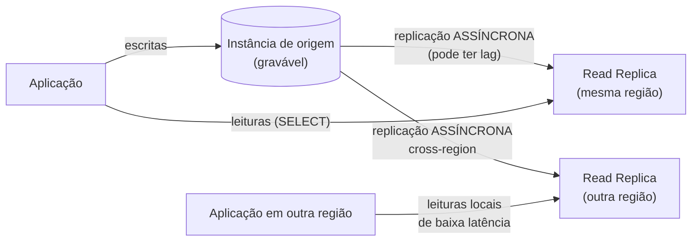
*Read Replicas descarregam leitura da origem e podem viver em outra região — diferente da standby do Multi-AZ, elas servem tráfego de verdade.*

### Tabela comparativa — a diferença que a prova cobra

| Aspecto | Multi-AZ | Read Replica |
|---|---|---|
| **Propósito principal** | Alta disponibilidade (HA) / disaster recovery local | Escalar leitura / performance |
| **Tipo de replicação** | Síncrona | Assíncrona |
| **A cópia pode ser lida diretamente?** | Não, no RDS tradicional (só existe para failover) | Sim — esse é o objetivo dela |
| **Failover automático** | Sim, automático | Não — precisa ser promovida manualmente (ou via automação própria) |
| **Cross-region?** | Não (mesma região, AZ diferente) | Sim, suportado |
| **Impacto de latência na origem** | Adiciona latência de escrita (espera confirmação síncrona) | Não impacta a origem (assíncrono, não bloqueante) |
| **Quantas você pode ter** | Uma standby | Múltiplas (várias réplicas de leitura) |
| **Pode virar instância standalone?** | Não é o modelo (a standby só existe atrelada ao par Multi-AZ) | Sim, promovível a instância independente |

**Combinação comum no dia a dia:** você pode (e frequentemente deve) usar **os dois ao mesmo tempo** — a instância primária com Multi-AZ habilitado (para HA) **e** uma ou mais Read Replicas (para escalar leitura). Não é "ou um ou outro", são ferramentas para problemas diferentes que se somam.

**Pegadinha clássica de prova:** um enunciado descreve "preciso melhorar a performance de leitura do meu banco" e a alternativa errada mais tentadora é "habilite Multi-AZ" — errado, porque a standby do Multi-AZ tradicional não serve leitura. A resposta certa é Read Replica.

---

## 3. Arquitetura da Aurora — o que muda de verdade por baixo dos panos

O Aurora não é "MySQL/PostgreSQL com um nome diferente" — a camada de **storage é completamente redesenhada**, e essa é a fonte de praticamente todas as vantagens dele.

### Storage separado da computação, distribuído em 6 cópias em 3 AZs

No RDS tradicional, o disco (EBS) está atrelado à instância de computação — se a instância cai, o acesso ao dado depende de reanexar o disco em outra instância. No Aurora, o **storage é um serviço distribuído próprio**, desacoplado das instâncias de computação. Cada volume de dado do Aurora é automaticamente replicado em **6 cópias, espalhadas em 3 Availability Zones (2 cópias por AZ)** — isso acontece sempre, é parte fundamental da arquitetura, não uma opção que você liga.

**Por que 6 cópias em 3 AZs, e não menos:** o design garante que o Aurora consiga continuar operando (escrevendo) mesmo perdendo uma AZ inteira e ainda tolerando a perda de mais uma cópia adicional, e consiga continuar servindo leitura mesmo com falhas maiores. É uma engenharia de quorum: escritas exigem confirmação de 4 das 6 cópias, leituras exigem 3 das 6 — o que permite tolerar a perda de uma AZ inteira sem impacto de disponibilidade.

**Auto-healing de storage:** o Aurora monitora continuamente blocos de dado em busca de corrupção/erro de disco, e **repara automaticamente** usando as outras cópias saudáveis, sem intervenção sua e tipicamente sem impacto perceptível na aplicação. Isso é bem diferente de um EBS tradicional, onde uma corrupção de disco é um evento que você precisa detectar e recuperar via backup/snapshot manualmente.

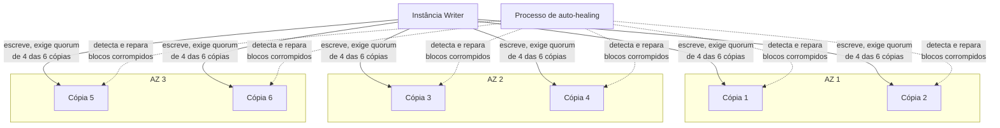
*6 cópias em 3 AZs com quorum de escrita/leitura — o storage sobrevive à perda de uma AZ inteira sem downtime.*

### Até 15 Aurora Replicas com lag baixíssimo

Como todas as instâncias de computação do Aurora (a **Writer** e as **Aurora Replicas**) compartilham o **mesmo volume de storage distribuído** (não é uma cópia separada dos dados como numa Read Replica de RDS tradicional), o lag de replicação entre Writer e Replicas é **tipicamente muito baixo** (ordem de dezenas de milissegundos), porque o que precisa "propagar" não é o dado inteiro, é só o estado de cache/redo aplicado.

Você pode ter **até 15 Aurora Replicas** (contra tipicamente um número bem menor de Read Replicas no RDS tradicional), e qualquer uma delas pode ser promovida a Writer em caso de failover — o failover do Aurora é tipicamente muito mais rápido que o do RDS Multi-AZ tradicional justamente porque não precisa "recriar" nenhum dado, só redirecionar o papel de escrita para uma instância que já enxerga o mesmo storage.

**No dia a dia:** essa arquitetura é o motivo de o Aurora ser recomendado sempre que a leitura precisa escalar bastante — você pode distribuir a carga de leitura entre várias das 15 réplicas, todas com dado praticamente em tempo real.

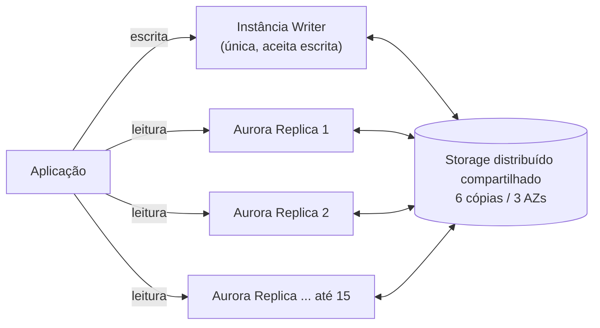
*Writer e até 15 Aurora Replicas compartilham o mesmo storage — por isso o lag de replicação é tão baixo.*

### Aurora Endpoints

O Aurora expõe endpoints diferentes para simplificar o roteamento de tráfego:
- **Cluster Endpoint (Writer):** sempre aponta para a instância Writer atual — use para todas as escritas.
- **Reader Endpoint:** faz *load balancing* automático entre todas as Aurora Replicas disponíveis — use para leituras, sem sua aplicação precisar saber quantas réplicas existem.
- **Custom Endpoints / Instance Endpoints:** para casos onde você quer rotear para um subconjunto específico de instâncias (ex: réplicas dedicadas para relatórios pesados).

---

## 4. Aurora Serverless v2

O Aurora Serverless v2 resolve o problema de **capacidade fixa em cargas variáveis ou imprevisíveis**: em vez de escolher um tamanho de instância fixo (ex: `db.r6g.xlarge`) e pagar por ele 24/7 mesmo em horários de baixíssimo uso, o Serverless v2 **escala a capacidade de computação automaticamente** (para cima e para baixo) em incrementos finos de **ACUs (Aurora Capacity Units)**, em resposta à carga real, em questão de segundos.

**Quando usar no dia a dia:**
- Aplicações com carga **imprevisível ou muito variável** (ex: um SaaS B2B onde o uso pica só em horário comercial de cada cliente, um app novo sem histórico de tráfego para dimensionar corretamente).
- Ambientes de **dev/teste** que ficam ociosos boa parte do tempo — evita pagar por uma instância grande ligada 24/7 quando só é usada em horário de trabalho.
- Arquiteturas **multi-tenant** onde cada tenant tem seu próprio banco Aurora Serverless, e a maioria fica praticamente ociosa a maior parte do tempo.
- Cargas de trabalho novas onde você **não sabe ainda qual vai ser o tamanho de instância ideal** — o Serverless v2 tira essa decisão de você.

**O que muda em relação ao Serverless v1:** o v2 escala em segundos e de forma muito mais granular (fração de ACU), suporta praticamente todas as features do Aurora provisionado (Multi-AZ, Read Replicas, Global Database), e pode ser misturado no mesmo cluster com instâncias provisionadas tradicionais — algo que o v1 não permitia bem. Na prova, se aparecer "escala em segundos, sem downtime de scaling, granular" a resposta é Serverless v2.

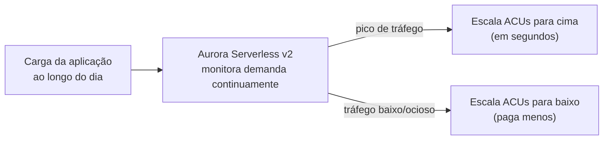
*Aurora Serverless v2 ajusta capacidade continuamente conforme a demanda real, sem intervenção manual.*

---

## 5. Aurora Global Database

Resolve o problema de **disaster recovery e leitura de baixa latência em escala global**: um cluster Aurora primário numa região, replicando para **até várias regiões secundárias**, com **lag tipicamente sub-segundo** — muito mais rápido que uma Read Replica cross-region do RDS tradicional (que usa replicação assíncrona "genérica" do engine), porque o Aurora Global Database replica no nível do **log de storage**, não no nível lógico do SQL.

**Casos de uso no dia a dia:**
- **Disaster recovery global:** se a região inteira onde está o cluster primário sofrer uma indisponibilidade, você promove a região secundária a primária (RTO tipicamente na casa de minutos).
- **Leitura de baixa latência para usuários globais:** um app com usuários no Japão e nos EUA pode ter uma região secundária no Japão servindo leituras locais rapidíssimas, enquanto as escritas continuam indo para a região primária.

**Detalhe técnico importante:** as regiões secundárias do Global Database são **somente leitura** — você não escreve nelas diretamente (isso é diferente de um cenário multi-master). Se precisar promover uma região secundária a gravável (failover de DR), isso é uma operação deliberada, não automática por padrão.

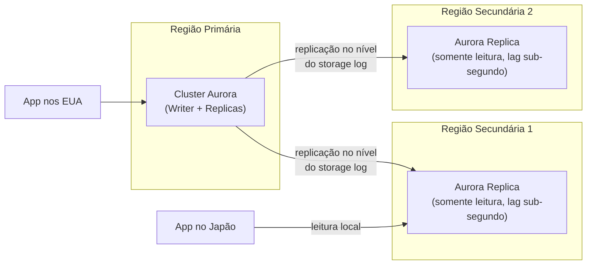
*Replicação no nível do storage log é o que permite lag sub-segundo entre regiões, algo que replicação lógica tradicional não entrega.*

---

## 6. RDS Proxy

Resolve um problema muito específico e muito comum com **Lambda** (e outras arquiteturas altamente concorrentes/serverless): cada invocação de Lambda pode abrir sua própria conexão com o banco, e como o Lambda escala **horizontalmente e rapidamente** (centenas/milhares de execuções concorrentes), isso pode **esgotar o limite de conexões do banco** rapidinho — bancos relacionais tradicionais não foram desenhados para lidar com milhares de conexões simultâneas de curta duração.

O **RDS Proxy** fica entre a aplicação e o banco, mantendo um **pool de conexões já abertas e "quentes"** com o banco de dados real, e multiplexando as conexões efêmeras da aplicação (ex: de cada invocação de Lambda) sobre esse pool menor de conexões reais — sua aplicação/Lambda "acha" que abriu uma conexão nova, mas na prática está reaproveitando uma conexão física já existente.

**Outros benefícios importantes:**
- **Failover mais rápido e transparente:** o RDS Proxy sabe fazer failover para a instância standby (Multi-AZ) mais rápido do que esperar a resolução de DNS tradicional, porque ele mesmo gerencia a rota para a instância correta.
- **IAM Authentication:** permite autenticar no banco usando credenciais IAM temporárias em vez de usuário/senha fixos armazenados na aplicação.
- **Suporte a Secrets Manager:** integração nativa para rotação de credenciais sem precisar reiniciar a aplicação.

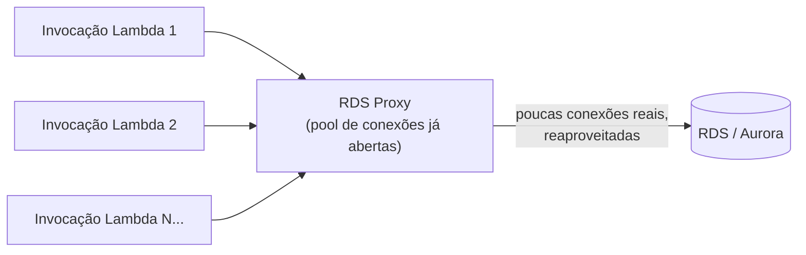
*RDS Proxy multiplexa muitas conexões efêmeras da aplicação sobre um pool pequeno de conexões reais com o banco.*

**No dia a dia:** sempre que aparecer "Lambda + RDS + erro de 'too many connections'" — seja num cenário de prova ou num incidente real de produção — a resposta é RDS Proxy.

---

## 7. Backups automáticos, snapshots manuais e Point-in-Time Recovery

### Backups automáticos
O RDS faz backup automático diário (um snapshot completo) mais o **registro contínuo dos transaction logs**, dentro de uma **janela de retenção configurável (1 a 35 dias)**. Isso é o que habilita o **Point-in-Time Recovery (PITR)** — a capacidade de restaurar o banco para **qualquer segundo específico** dentro do período de retenção, não só para o momento exato de um snapshot diário.

**Como isso funciona na prática:** o RDS restaura o snapshot diário mais próximo e depois "reaplica" os transaction logs registrados até o segundo exato que você pediu. É por isso que PITR é tão poderoso para recuperação de erro humano — "alguém rodou um `DELETE` sem `WHERE` às 14:32:07" é resolvido restaurando para 14:32:06.

**Detalhe importante:** restaurar (seja de snapshot ou de PITR) sempre cria uma **instância nova**, com um endpoint novo — você não restaura "por cima" da instância existente. Isso é intencional (evita perder o estado atual acidentalmente), mas também é uma pegadinha de prova: depois de restaurar, é preciso repontar a aplicação para o novo endpoint (ou fazer alguma forma de troca de DNS/nome).

### Snapshots manuais
Diferente dos backups automáticos (que são apagados quando você desliga/deleta a instância, a menos que configure retenção final), **snapshots manuais persistem indefinidamente** até você apagar explicitamente. São usados para retenção de longo prazo (ex: snapshot antes de uma migração grande, arquivamento para compliance) e podem ser **copiados entre regiões**.

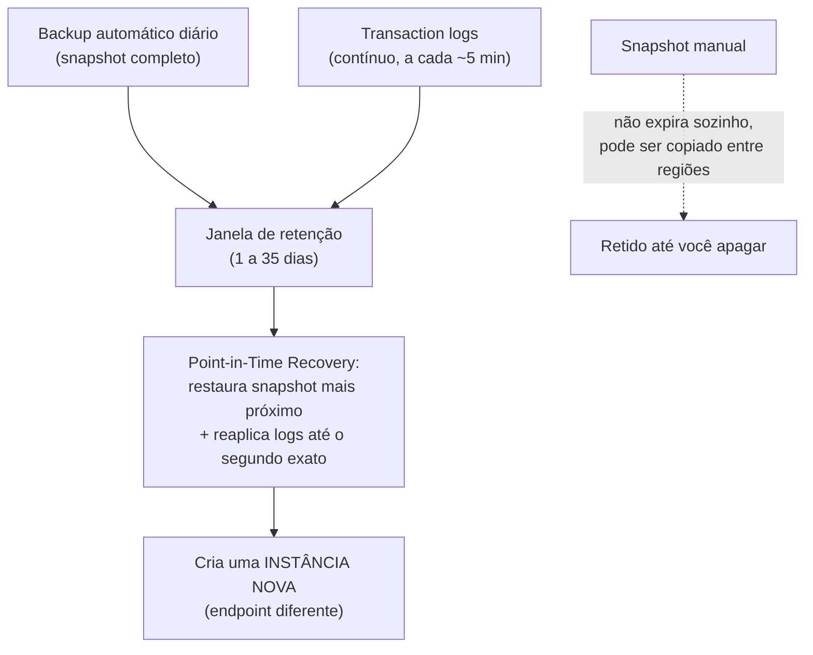
*Backup automático + transaction logs habilitam restaurar para qualquer segundo — sempre criando uma instância nova.*

---

## 8. Parameter Groups vs Option Groups

Duas formas diferentes de customizar o comportamento do engine, frequentemente confundidas:

| Aspecto | Parameter Group | Option Group |
|---|---|---|
| **O que controla** | Parâmetros de configuração do **motor do banco** (ex: `max_connections`, tamanho de buffer, timeout) | **Features/módulos adicionais** que o engine oferece, mas não vêm ativados por padrão |
| **Exemplo prático** | Ajustar `max_connections` do PostgreSQL, `innodb_buffer_pool_size` do MySQL | Ativar o **Oracle Statspack**, o **SQL Server Transparent Data Encryption (TDE)**, o módulo de auditoria do Oracle |
| **Aplica a quais engines** | Todos | Principalmente Oracle e SQL Server (MySQL/PostgreSQL raramente usam Option Groups) |
| **Precisa de reboot para aplicar?** | Depende do parâmetro — alguns são "dynamic" (aplicam na hora), outros exigem reboot | Depende da opção |

**No dia a dia:** você sempre cria seu próprio Parameter Group customizado em vez de editar o `default` (que é somente leitura na maioria dos casos) — assim você consegue versionar e reaplicar a mesma configuração em outras instâncias.

---

## 9. Performance Insights

Ferramenta de monitoramento de performance de banco de dados **incluída no RDS e Aurora**, focada em responder a pergunta "**o que exatamente está deixando meu banco lento agora**" — algo que métricas genéricas de CPU/memória do CloudWatch não respondem sozinhas.

O Performance Insights mostra a métrica de **carga do banco (DB Load)**, decomposta por **espera (wait events)**, por **SQL específico**, por **usuário**, e por **host** — isso permite identificar, por exemplo, que 80% da carga atual vem de um único `SELECT` mal otimizado sem índice, ou que o banco está gargalado esperando I/O de disco (não CPU).

**No dia a dia:** é a primeira ferramenta a abrir quando alguém reporta "o banco está lento" — em segundos você vê se é uma query específica, contenção de lock, ou falta de recursos de infraestrutura, sem precisar instrumentar nada manualmente na aplicação.

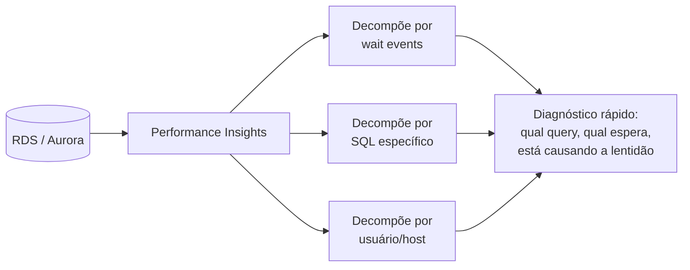
*Performance Insights decompõe a carga do banco para apontar a causa raiz da lentidão rapidamente.*

---

## 10. Conectando aos 4 domínios da prova

- **Segurança:** criptografia em repouso via KMS (não pode ser ativada depois de criada a instância sem migração), criptografia em trânsito via TLS/SSL, IAM Database Authentication, Secrets Manager para rotação de credenciais, Security Groups controlando acesso de rede.
- **Resiliência:** Multi-AZ (RDS e Aurora), Aurora com 6 cópias em 3 AZs nativamente, Aurora Global Database para DR cross-region, backups automáticos + PITR.
- **Performance:** Read Replicas para escalar leitura, Aurora Replicas com lag baixíssimo, RDS Proxy para não gargalar em conexões, Performance Insights para diagnóstico.
- **Custo:** Aurora Serverless v2 para cargas variáveis (evita pagar por capacidade ociosa), Reserved Instances para cargas previsíveis de longo prazo, escolha certa de storage (gp3 vs io2) impacta custo/performance.

---

# 🧪 Laboratório prático (para executar na AWS)

## Objetivo
Criar um cluster Aurora MySQL com uma réplica de leitura, testar failover, e configurar backup com PITR.

### Passo 1 — Criar o cluster Aurora
Console → RDS → **Create database**
- Engine: **Amazon Aurora (MySQL Compatible)**
- Templates: **Dev/Test** (para não gerar custo alto no lab)
- DB cluster identifier: `aurora-lab-cluster`
- Instância: a menor classe disponível (ex: `db.t3.medium` ou equivalente serverless)
- Marque **Create an Aurora Replica or Reader node** para já subir com uma segunda instância

### Passo 2 — Conectar e popular dados
```bash
mysql -h {cluster-endpoint} -u admin -p
```
```sql
CREATE DATABASE labdb;
USE labdb;
CREATE TABLE teste (id INT PRIMARY KEY, valor VARCHAR(50));
INSERT INTO teste VALUES (1, 'antes do failover');
```

### Passo 3 — Testar o Reader Endpoint
```bash
mysql -h {reader-endpoint} -u admin -p -e "SELECT * FROM labdb.teste;"
```
Confirme que o dado inserido na Writer já aparece na leitura via Reader Endpoint (lag baixíssimo).

### Passo 4 — Forçar failover
Console → RDS → selecione o cluster → **Actions → Failover**
- Observe no console qual instância vira a nova Writer
- Rode `SHOW GLOBAL VARIABLES LIKE 'server_id';` antes/depois para confirmar a troca

### Passo 5 — Configurar PITR e testar restauração
Console → RDS → selecione o cluster → **Actions → Restore to point in time**
- Escolha um timestamp após o `INSERT` do Passo 2
- Confirme que a instância restaurada (nova, endpoint diferente) contém o dado esperado

### Passo 6 — Experimentos para fixar cada conceito
1. **Multi-AZ em RDS tradicional (não-Aurora):** crie uma instância RDS MySQL simples com Multi-AZ habilitado, e compare o comportamento de failover com o do Aurora (mais lento, pois recria conexão para a standby em vez de redirecionar sobre storage compartilhado).
2. **RDS Proxy:** crie um RDS Proxy na frente do cluster Aurora, aponte uma função Lambda simples para ele em vez de direto no banco, e dispare várias invocações concorrentes observando o número de conexões reais no banco (`SHOW PROCESSLIST;`).
3. **Aurora Serverless v2:** crie um segundo cluster com capacidade Serverless v2 (ex: 0.5 a 4 ACUs), gere carga com um script simples, e observe a escala de ACU no console em tempo real.
4. **Parameter Group customizado:** crie um Parameter Group próprio, altere `max_connections`, aplique ao cluster, e confirme a mudança com `SHOW VARIABLES LIKE 'max_connections';`.
5. **Performance Insights:** habilite, rode uma query proposital sem índice numa tabela grande, e observe ela aparecer como "Top SQL" consumindo DB Load.

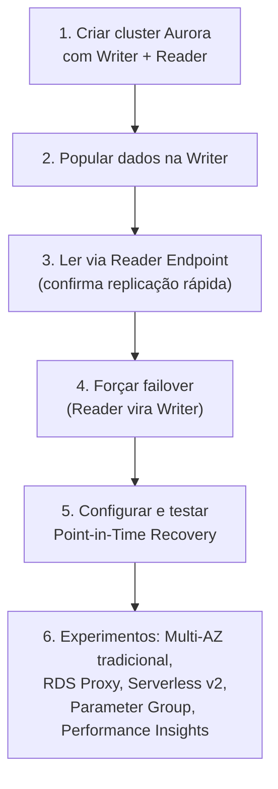
*Sequência do laboratório: criar cluster, validar replicação, testar failover, validar backup/PITR.*

---

## Comandos AWS CLI úteis

```bash
# Criar um cluster Aurora MySQL
aws rds create-db-cluster \
  --db-cluster-identifier aurora-lab-cluster \
  --engine aurora-mysql \
  --master-username admin \
  --master-user-password 'SenhaForte123!' \
  --vpc-security-group-ids sg-xxxxxxxx

# Criar a instância Writer dentro do cluster
aws rds create-db-instance \
  --db-instance-identifier aurora-lab-writer \
  --db-cluster-identifier aurora-lab-cluster \
  --engine aurora-mysql \
  --db-instance-class db.t3.medium

# Criar uma Read Replica de uma instância RDS tradicional
aws rds create-db-instance-read-replica \
  --db-instance-identifier meu-banco-replica \
  --source-db-instance-identifier meu-banco-origem

# Habilitar Multi-AZ numa instância existente
aws rds modify-db-instance \
  --db-instance-identifier meu-banco \
  --multi-az \
  --apply-immediately

# Forçar failover num cluster Aurora
aws rds failover-db-cluster --db-cluster-identifier aurora-lab-cluster

# Restaurar para um ponto no tempo específico
aws rds restore-db-instance-to-point-in-time \
  --source-db-instance-identifier meu-banco \
  --target-db-instance-identifier meu-banco-restaurado \
  --restore-time 2026-08-15T14:32:06Z

# Criar um snapshot manual
aws rds create-db-snapshot \
  --db-instance-identifier meu-banco \
  --db-snapshot-identifier snapshot-antes-migracao

# Criar um RDS Proxy
aws rds create-db-proxy \
  --db-proxy-name meu-proxy \
  --engine-family MYSQL \
  --auth '[{"AuthScheme":"SECRETS","SecretArn":"arn:aws:secretsmanager:...","IAMAuth":"REQUIRED"}]' \
  --role-arn arn:aws:iam::123456789012:role/rds-proxy-role \
  --vpc-subnet-ids subnet-xxxxxxxx subnet-yyyyyyyy
```

---

## Tabela de decisão rápida (prova + dia a dia)

| Cenário | Resposta provável |
|---|---|
| Preciso de alta disponibilidade com failover automático | Multi-AZ |
| Preciso escalar leitura / tirar carga da instância principal | Read Replica (ou Aurora Replica) |
| Preciso de DR cross-region com lag baixíssimo | Aurora Global Database |
| Carga de trabalho muito variável/imprevisível | Aurora Serverless v2 |
| Lambda gerando "too many connections" no banco | RDS Proxy |
| Recuperar de um `DELETE`/`UPDATE` acidental de minutos atrás | Point-in-Time Recovery |
| Preciso reter um snapshot indefinidamente para compliance | Snapshot manual |
| Ajustar `max_connections` ou buffers do engine | Parameter Group |
| Ativar TDE no SQL Server ou Statspack no Oracle | Option Group |
| Descobrir qual query específica está deixando o banco lento | Performance Insights |
| "Melhorar performance de leitura" (pegadinha comum) | Read Replica, NÃO Multi-AZ |
| Banco relacional nativo de nuvem, alta performance e resiliência | Aurora, em vez de RDS tradicional |
