# DynamoDB — Guia Completo (Teoria + Prática + Dia a Dia)

## 0. O problema que o DynamoDB resolve

Um banco relacional (RDS/Aurora) é ótimo quando seu modelo de dados é bem definido, com relações complexas entre tabelas, e você precisa de `JOIN`s flexíveis e transações fortes entre várias entidades. Mas isso tem um custo: **escalar um banco relacional horizontalmente é difícil** — o modelo relacional foi desenhado décadas atrás, pensando em um servidor único cada vez mais forte (scale-up), não em distribuir dados entre centenas de máquinas.

O **DynamoDB** é um banco **NoSQL de chave-valor e documentos**, **totalmente gerenciado e serverless**, desenhado desde o início para **escalar horizontalmente de forma praticamente ilimitada**, com latência de milissegundos de dígito único, **independente do tamanho da tabela**. Você não provisiona servidor, não faz patch, não gerencia replicação — só define a tabela e as chaves, e o DynamoDB cuida do resto (particionamento, replicação entre AZs, durabilidade).

O trade-off: você abre mão da flexibilidade de consulta livre (`JOIN`s, `WHERE` em qualquer coluna) em troca de performance previsível em escala. Isso significa que, no DynamoDB, **o modelo de dados é desenhado em função dos padrões de acesso** (como você vai consultar) — o oposto do modelo relacional, onde você desenha o schema primeiro e escreve as queries depois.

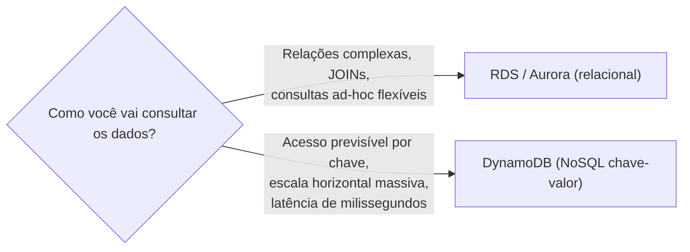
*A escolha entre relacional e DynamoDB começa por como você vai consultar os dados, não pela estrutura deles.*

---

## 1. Partition Key, Sort Key e como o particionamento físico funciona

### Chave primária simples (só Partition Key)

Toda tabela do DynamoDB precisa de uma **chave primária**. No modelo mais simples, ela é composta só pela **Partition Key (PK)** — um atributo cujo valor identifica unicamente cada item na tabela. O DynamoDB usa uma **função de hash** sobre o valor da Partition Key para decidir **em qual partição física** (um pedaço de storage/capacidade, internamente distribuído em múltiplos servidores) aquele item vai morar.

### Chave primária composta (Partition Key + Sort Key)

Quando você adiciona uma **Sort Key (SK)**, a chave primária passa a ser a combinação dos dois: **vários itens podem compartilhar a mesma Partition Key**, desde que cada um tenha uma Sort Key diferente. Todos os itens com a mesma Partition Key ficam **fisicamente agrupados e ordenados pela Sort Key** dentro da mesma partição — isso é o que permite consultas eficientes tipo "me dê todos os pedidos do cliente X, ordenados por data" (PK = `clienteId`, SK = `data`).

**No dia a dia:** a Partition Key responde "qual é o grupo/dono do dado" (ex: `usuarioId`, `clienteId`, `dispositivoId`), e a Sort Key responde "como esse dado se organiza dentro do grupo" (ex: `timestamp`, `pedidoId`, `categoria#produtoId`). Esse padrão de compor a Sort Key com múltiplos valores concatenados (`categoria#produtoId`) é muito comum e é a base de queries mais ricas usando `begins_with`.

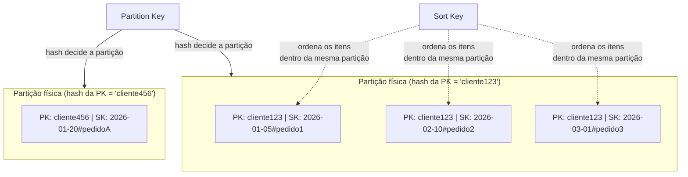
*Itens com a mesma Partition Key ficam agrupados e ordenados pela Sort Key na mesma partição física.*

### Como o particionamento acontece por baixo dos panos

O DynamoDB divide os dados em **partições físicas**, cada uma com um limite de armazenamento (algo em torno de 10 GB) e de capacidade de throughput. Conforme a tabela cresce em tamanho ou em capacidade solicitada, o DynamoDB **automaticamente divide (split) partições** para distribuir a carga — isso é totalmente transparente para você, você nunca "vê" as partições diretamente no console de forma gerenciável.

**Por que isso importa para o design da chave:** a distribuição de carga entre partições depende diretamente de quão bem distribuídos são os **valores da Partition Key**. Se muitos itens/requisições se concentram numa mesma PK (ou num conjunto pequeno de PKs), você cria um **hot partition** (seção 9) — o resto da tabela pode ter capacidade sobrando enquanto essa partição específica fica sobrecarregada, porque a capacidade é distribuída proporcionalmente entre as partições, não compartilhada livremente.

---

## 2. GSI vs LSI — diferenças que a prova adora cobrar

Como o DynamoDB só permite consultas eficientes pela chave primária (PK, ou PK+SK), você precisa de um **índice secundário** sempre que quiser consultar eficientemente por outro atributo. Existem dois tipos.

### Local Secondary Index (LSI)

Um LSI usa **a mesma Partition Key da tabela original**, mas permite uma **Sort Key alternativa**. Ou seja: você continua consultando "dentro do mesmo grupo" (mesma PK), só que ordenado/filtrado por outro atributo.

**Restrições importantes do LSI:**
- Só pode ser criado **no momento da criação da tabela** — não dá para adicionar um LSI depois numa tabela já existente. Isso é uma das pegadinhas mais cobradas: se você esqueceu de criar o LSI na hora certa, a única saída é recriar a tabela inteira.
- Máximo de **5 LSIs por tabela**.
- Compartilha a **capacidade de leitura/escrita provisionada da tabela base** (não tem capacidade própria).
- Suporta tanto **consistência eventual quanto consistência forte** na leitura (mesma flexibilidade da tabela base).
- Limite de **10 GB de dados por valor de Partition Key**, somando tabela base + todos os LSIs — porque LSI vive fisicamente na mesma partição da tabela base.

### Global Secondary Index (GSI)

Um GSI permite definir uma **Partition Key completamente diferente** (e opcionalmente uma Sort Key diferente também) — é "global" porque não fica restrito a consultar dentro do mesmo grupo da tabela original, pode reorganizar os dados por qualquer outro atributo.

**Características do GSI:**
- Pode ser criado **a qualquer momento** — na criação da tabela ou depois, adicionando a qualquer momento sobre uma tabela existente.
- Tem sua **própria capacidade provisionada** (Read/Write Capacity Units separadas da tabela base) — o que significa que um GSI mal dimensionado pode sofrer throttling mesmo que a tabela base tenha capacidade sobrando.
- Suporta **apenas consistência eventual** — nunca consistência forte, porque o GSI é atualizado de forma assíncrona em relação à tabela base.
- Não tem o limite de 10GB por partition key que o LSI tem, porque vive numa estrutura de armazenamento própria.
- Você pode ter **até 20 GSIs por tabela** (limite alto, mas cada um tem custo próprio de capacidade e armazenamento).

### Tabela comparativa

| Aspecto | LSI (Local) | GSI (Global) |
|---|---|---|
| **Partition Key** | Igual à da tabela base | Pode ser diferente |
| **Sort Key** | Diferente da tabela base (esse é o ponto dele) | Pode ser diferente ou nem existir |
| **Quando pode ser criado** | Somente na criação da tabela | A qualquer momento |
| **Capacidade (RCU/WCU)** | Compartilha da tabela base | Capacidade própria |
| **Consistência de leitura** | Eventual ou forte (escolha) | Somente eventual |
| **Limite de tamanho** | 10 GB por valor de partition key (tabela + LSIs juntos) | Sem esse limite |
| **Quantidade máxima** | 5 por tabela | 20 por tabela |

**No dia a dia:** por causa da rigidez do LSI (só na criação, atrelado ao mesmo PK), a maioria dos designs modernos de DynamoDB **prefere GSI** — é mais flexível, pode ser adicionado depois, e não tem o limite de 10GB. LSI ainda é relevante quando você precisa de **consistência forte** numa consulta por atributo alternativo, já que GSI nunca oferece isso.

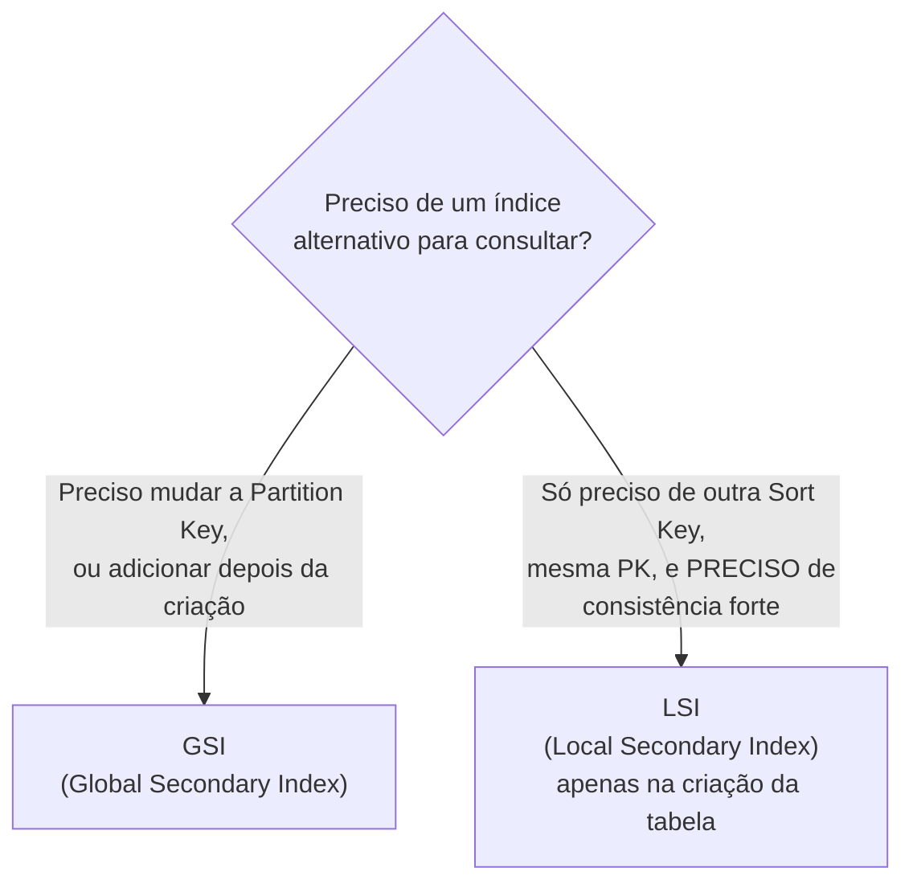
*Na dúvida, GSI é a escolha mais flexível — LSI só faz sentido quando consistência forte é um requisito real e você já sabe disso na criação da tabela.*

---

## 3. Capacity Modes — Provisioned vs On-Demand

### Provisioned (com Auto Scaling)

Você define explicitamente quantas **Read Capacity Units (RCU)** e **Write Capacity Units (WCU)** a tabela (e cada GSI) deve suportar. Se o tráfego ultrapassar o provisionado, requisições são **throttled** (erro `ProvisionedThroughputExceededException`) — a menos que você tenha habilitado **Auto Scaling**, que ajusta a capacidade provisionada para cima/baixo automaticamente com base numa meta de utilização (ex: manter 70% de uso), dentro de limites mínimo/máximo que você configura.

**Quando usar no dia a dia:** cargas de trabalho **previsíveis e relativamente estáveis**, onde você consegue prever o padrão de tráfego (ex: sistema interno corporativo com uso concentrado em horário comercial) — o modo Provisioned tende a ser **mais barato** que On-Demand quando a utilização é consistente e você consegue dimensionar bem.

### On-Demand

Você não define capacidade nenhuma — o DynamoDB escala automaticamente para atender o tráfego real, cobrando **por requisição de leitura/escrita realizada**, sem necessidade de planejar capacidade. Não existe throttling por falta de capacidade provisionada (o DynamoDB escala para acompanhar, respeitando limites internos de crescimento).

**Quando usar no dia a dia:**
- Aplicações **novas**, sem histórico de tráfego para embasar uma previsão de capacidade.
- Cargas **altamente imprevisíveis ou muito espaçadas** (picos raros e súbitos, ex: um evento de vendas sazonal, uma campanha de marketing viral).
- Quando o custo operacional de **gerenciar Auto Scaling** não compensa a economia potencial do modo Provisioned.

**Trade-off de custo:** On-Demand cobra um preço por requisição significativamente mais alto que o custo equivalente por RCU/WCU do modo Provisioned — então para uma carga **estável e bem dimensionada**, Provisioned com Auto Scaling tende a sair mais barato. Para uma carga **espinhosa/imprevisível**, On-Demand evita tanto o throttling (Provisioned mal dimensionado) quanto o desperdício de pagar capacidade ociosa reservada demais.

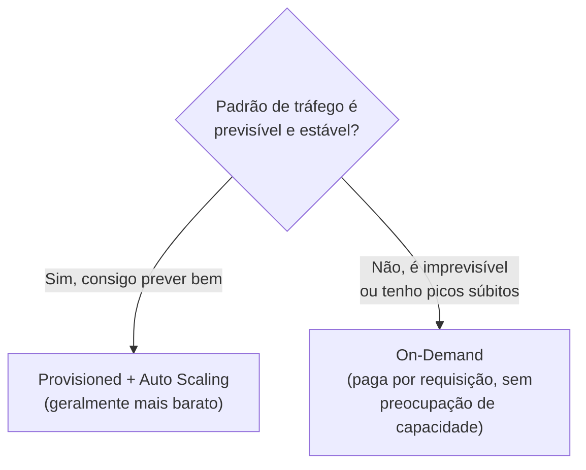
*A previsibilidade do tráfego é o critério central para escolher entre Provisioned e On-Demand.*

---

## 4. DynamoDB Accelerator (DAX)

O DAX é um **cache in-memory totalmente gerenciado**, especializado para o DynamoDB, que fica na frente da tabela e reduz o tempo de resposta de leitura de **milissegundos de dígito único para microssegundos**.

**Que problema ele resolve:** o DynamoDB já é rápido, mas para aplicações com carga de leitura **extremamente alta e repetitiva** (muitas leituras do mesmo item, ex: um catálogo de produto muito acessado, um perfil de usuário consultado em quase toda requisição), cada leitura ainda consome capacidade (RCU) e tem uma latência de rede real, mesmo que pequena. O DAX resolve isso servindo leituras repetidas diretamente da memória, sem nem chegar a consultar a tabela.

**Detalhes importantes:**
- O DAX é compatível com a **API do DynamoDB** — você troca o endpoint do SDK, e a maior parte do código da aplicação não muda.
- Funciona bem para padrões de leitura com **muita repetição do mesmo item/query** (cache hit alto). Se cada leitura é de um item diferente e único, o DAX não ajuda muito (cache miss constante).
- **Não substitui a necessidade de bom design de chave** — ele acelera leituras repetidas, não corrige um modelo de dados ruim.
- Suporta apenas **consistência eventual** nas leituras cacheadas (não é adequado para casos que exigem sempre o dado mais recente garantido).

**No dia a dia:** o cenário clássico é "tenho um sistema com pico de leitura muito alto no mesmo conjunto pequeno de itens (ex: catálogo de produtos em Black Friday) e quero tirar carga da tabela e reduzir latência" — DAX resolve isso sem reescrever a lógica de acesso a dados da aplicação.

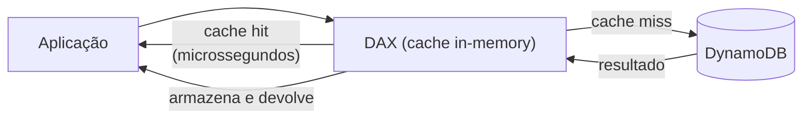
*DAX intercepta leituras: se o item está no cache, responde em microssegundos sem tocar na tabela.*

---

## 5. DynamoDB Streams

Um **Stream** captura, em ordem, toda mudança feita nos itens de uma tabela (`INSERT`, `UPDATE`, `DELETE`), guardando essas mudanças por **24 horas** numa estrutura parecida com um log ordenado por partição. Cada registro do stream pode conter, dependendo da configuração: só a chave do item modificado, a imagem antiga do item, a imagem nova, ou ambas (`OLD_IMAGE`, `NEW_IMAGE`, `NEW_AND_OLD_IMAGES`, `KEYS_ONLY`).

**A integração mais comum é com Lambda:** você associa uma função Lambda ao Stream, e toda mudança na tabela dispara automaticamente essa função — sem polling, sem você escrever lógica de detecção de mudança.

**Casos de uso reais no dia a dia:**
- **Replicação/sincronização:** propagar mudanças para outro sistema (ex: indexar no Elasticsearch/OpenSearch a cada mudança, para permitir busca full-text que o DynamoDB nativamente não oferece).
- **Auditoria:** gravar um histórico de todas as mudanças feitas num item, para compliance.
- **Agregações em tempo real:** recalcular um contador ou soma toda vez que um item relacionado muda (ex: atualizar o total de um carrinho de compras cada vez que um item é adicionado/removido).
- **Global Tables:** os Streams são, por baixo dos panos, o mecanismo que sustenta a replicação multi-região do recurso de Global Tables (seção 6).

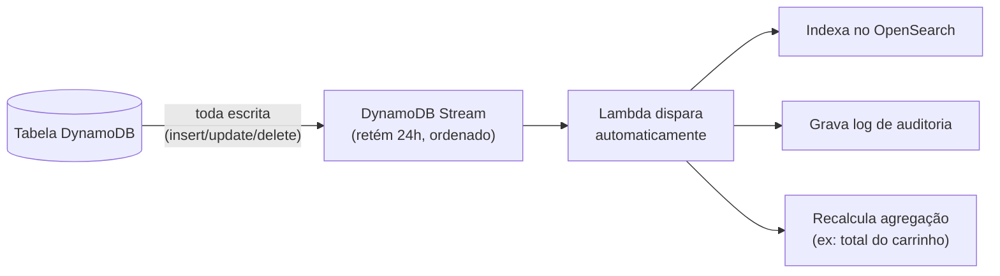
*DynamoDB Streams captura cada mudança em ordem e dispara processamento reativo, tipicamente via Lambda.*

---

## 6. Global Tables — replicação multi-região multi-master

Global Tables replica uma tabela **automaticamente entre múltiplas regiões AWS**, no modelo **multi-master (ativo-ativo)**: diferente do Aurora Global Database (onde só a região primária aceita escrita), em Global Tables **cada região pode aceitar leitura E escrita**, e as mudanças se propagam para as outras regiões automaticamente (usando o mecanismo de Streams por baixo dos panos).

**Por que isso importa:** permite que uma aplicação com usuários globais escreva **localmente**, na região mais próxima do usuário, sem precisar rotear toda escrita para uma única região "primária" do outro lado do mundo — reduzindo drasticamente a latência de escrita percebida.

**Resolução de conflitos:** como é multi-master, é possível que o mesmo item seja modificado quase simultaneamente em duas regiões diferentes. O DynamoDB resolve isso com uma política de **"last writer wins"** baseada em timestamp — a escrita mais recente (por um relógio interno de resolução de conflito) prevalece, e a tabela converge para o mesmo estado em todas as regiões eventualmente.

**No dia a dia:** usado em aplicações verdadeiramente globais (ex: um jogo multiplayer com jogadores em várias regiões, um app de e-commerce internacional) onde tanto leitura quanto escrita precisam ser rápidas localmente em cada região, e uma eventual perda de uma escrita "perdedora" num conflito raro é aceitável (a maioria das aplicações não tem conflito de escrita real no mesmo item ao mesmo tempo).

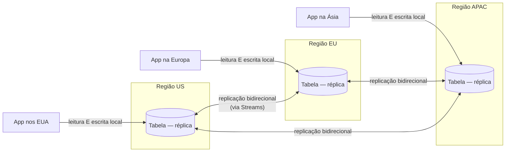
*Todas as regiões aceitam leitura e escrita — conflitos raros são resolvidos por "last writer wins".*

---

## 7. Consistência eventual vs consistência forte na leitura

O DynamoDB replica dados **entre múltiplas AZs dentro da região** automaticamente (durabilidade e disponibilidade nativas, sem você configurar nada), e isso cria a mesma decisão clássica de sistemas distribuídos: **ler da réplica mais rápida disponível (eventual) ou garantir que está lendo o dado mais recente possível (forte)**.

| Tipo de leitura | Comportamento | Custo em RCU | Quando usar |
|---|---|---|---|
| **Eventually Consistent Read** (padrão) | Pode retornar dado ligeiramente desatualizado se a leitura acontecer imediatamente após uma escrita muito recente (janela tipicamente de milissegundos) | Consome metade do RCU de uma leitura forte | Padrão para a maioria dos casos — feeds, listagens, catálogos, onde milissegundos de atraso não importam |
| **Strongly Consistent Read** | Sempre retorna o valor mais recente confirmado, refletindo todas as escritas bem-sucedidas anteriores | Consome o dobro do RCU (mais caro) | Quando a aplicação depende de ler exatamente o que acabou de escrever — ex: sistema de reserva/estoque onde uma leitura desatualizada causaria overbooking |

**Pegadinha clássica de prova:** GSIs **nunca** suportam Strongly Consistent Read (mencionado na seção 2) — se o enunciado descreve uma consulta via GSI que precisa de consistência forte, a resposta é que **isso não é possível** nessa configuração, e você precisaria repensar o design (ex: usar a tabela base ou um LSI).

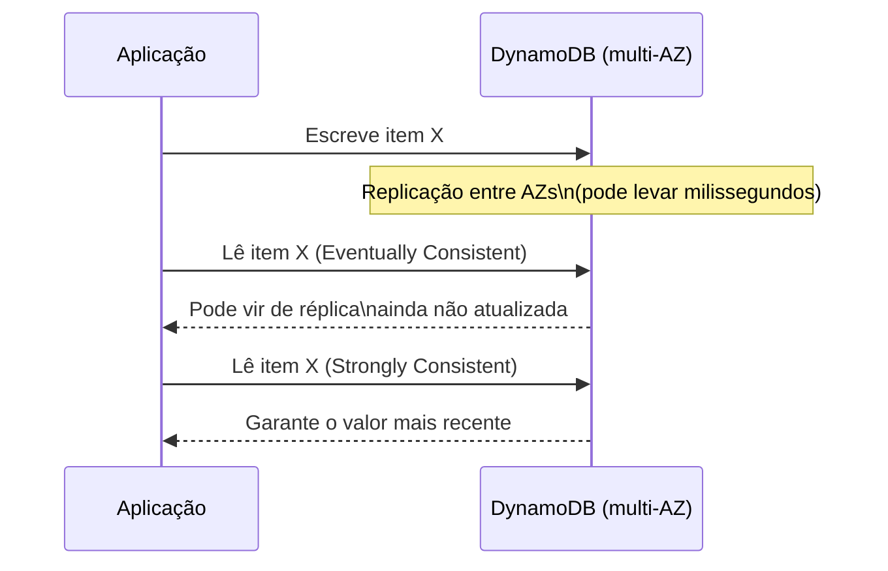
*A janela de replicação entre AZs é a razão de existir a diferença entre leitura eventual e forte.*

---

## 8. Transactions — ACID entre múltiplos itens/tabelas

Por padrão, operações no DynamoDB são atômicas **apenas no nível de um único item**. O recurso de **Transactions** (`TransactWriteItems` / `TransactGetItems`) permite agrupar **até 100 ações** (em múltiplos itens, inclusive em tabelas diferentes) numa única operação **tudo-ou-nada**, com garantias **ACID** completas: ou todas as operações do grupo são aplicadas, ou nenhuma é.

**Caso de uso clássico:** transferência entre contas — debitar de um item (`conta A`) e creditar em outro (`conta B`) precisam acontecer juntos, nunca só um dos dois. Outro exemplo comum: um sistema de e-commerce que precisa, na mesma operação, **decrementar o estoque** de um produto e **criar o registro do pedido** — se uma das duas falhar, nenhuma deve persistir.

**Trade-off:** transactions custam mais em capacidade consumida (aproximadamente o dobro do custo de operações individuais equivalentes) e têm throughput um pouco menor que operações simples, porque exigem coordenação extra para garantir a atomicidade. Use quando a integridade entre itens é realmente um requisito de negócio, não como padrão default para toda escrita.

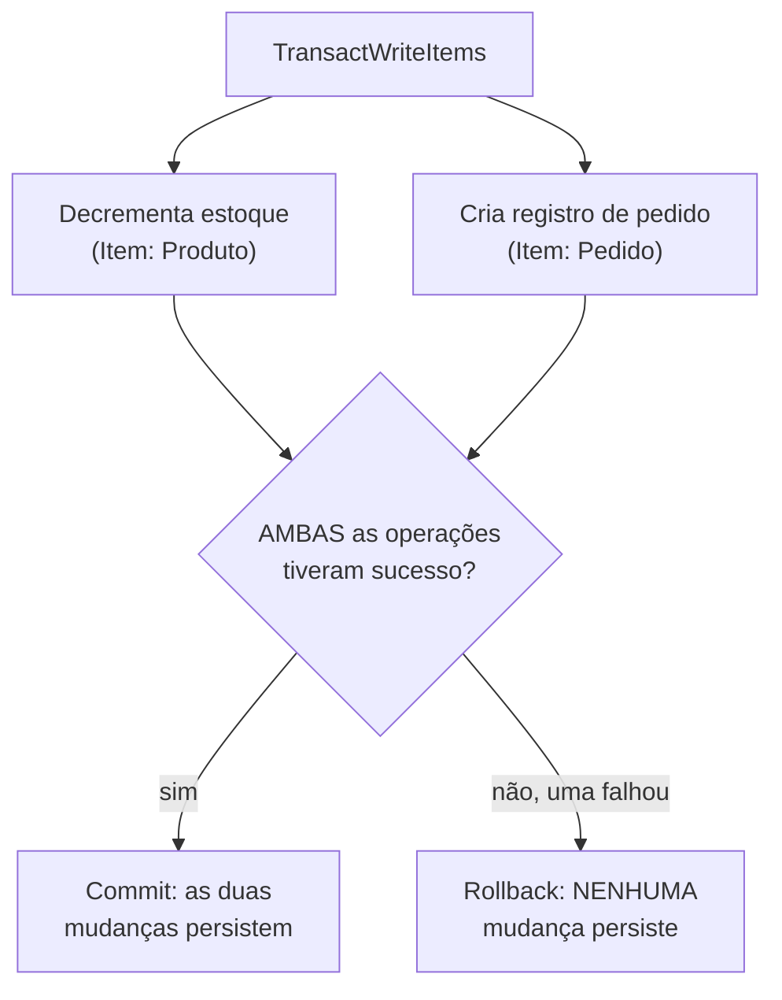
*Transactions garantem atomicidade tudo-ou-nada entre múltiplos itens/tabelas, ao custo de mais capacidade consumida.*

---

## 9. TTL — expiração automática de item

O **Time to Live (TTL)** permite marcar um atributo numérico (timestamp Unix em segundos) num item para indicar quando ele deve **expirar e ser removido automaticamente** pelo DynamoDB — sem você precisar rodar um job de limpeza manual.

**Detalhe técnico importante:** a exclusão não acontece no exato segundo do timestamp — o processo de limpeza do TTL roda em background e normalmente remove o item dentro de até 48 horas após a expiração. Itens expirados mas ainda não fisicamente removidos **não aparecem em `Query`/`Scan` comuns** (são filtrados), mas ainda existem fisicamente até a limpeza acontecer — isso pode confundir quem espera exclusão instantânea.

**Casos de uso reais:** sessões de usuário com expiração, dados de cache/temporários, logs com retenção limitada, registros de tokens/OTP que devem sumir depois de um tempo. É comum combinar TTL com **DynamoDB Streams** — capturar a exclusão automática via stream e disparar uma ação (ex: mover o item para "arquivo frio" no S3 antes dele sumir de vez, ou notificar outro sistema).

**Vantagem de custo:** a exclusão via TTL **não consome WCU** — é uma forma gratuita (em termos de capacidade) de limpar dados antigos, ao contrário de você mesmo rodar `DeleteItem` em massa.

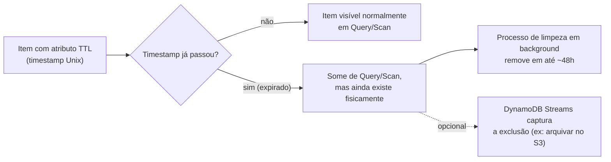
*TTL marca quando o item deve sumir, mas a remoção física acontece de forma assíncrona em background.*

---

## 10. Hot Partition — o problema e como o design da chave evita ele

Como cada partição física tem um limite de throughput, se o tráfego de leitura/escrita se concentra desproporcionalmente numa única Partition Key (ou num conjunto pequeno delas), essa partição específica pode ser **throttled** mesmo que a tabela como um todo tenha capacidade sobrando — isso é o problema de **hot partition**.

**Exemplos clássicos de design que causam hot partition:**
- Usar a **data do dia** como Partition Key (ex: `2026-08-15`) para registrar eventos — todo evento do dia inteiro cai na mesma partição, criando um gargalo enorme justamente no dia corrente.
- Usar um **status** de pouca cardinalidade como PK (ex: `status = "ATIVO"`) — a maioria dos itens tende a ter o mesmo valor, concentrando tudo numa partição.
- Um item **"celebridade"** — ex: um produto virou viral e recebe volume de leitura desproporcional em relação a todos os outros produtos da tabela.

### Como evitar

- **Escolher uma Partition Key de alta cardinalidade** — muitos valores possíveis, distribuídos de forma razoavelmente uniforme (ex: `usuarioId`, `dispositivoId`, um UUID).
- **Write sharding:** quando a PK naturalmente tem baixa cardinalidade (ex: precisa mesmo ser algo como "data do evento"), você adiciona um **sufixo aleatório ou calculado** (ex: `2026-08-15#3`, onde o número é um shard de 0 a N escolhido aleatoriamente ou por hash de outro atributo) — isso espalha artificialmente a carga entre várias partições, e na leitura você consulta todos os shards e agrega os resultados na aplicação.
- Para o problema de "item celebridade" especificamente, o **DAX** (seção 4) é frequentemente a solução mais prática — como o problema é leitura repetida de um item específico, cachear esse item resolve sem precisar redesenhar a chave.

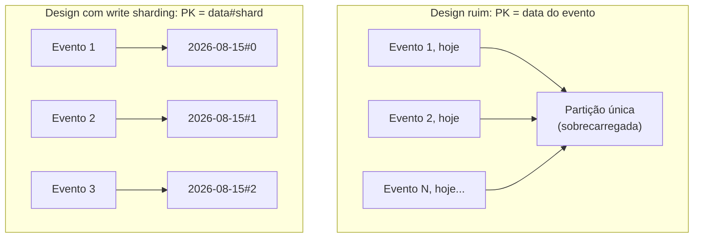
*Sem sharding, todos os eventos do dia caem na mesma partição; com um sufixo de shard, a carga se distribui.*

---

## 11. Single-table design — menção breve

Em bancos relacionais, é natural ter uma tabela por entidade (`usuarios`, `pedidos`, `produtos`) e usar `JOIN` para combinar. No DynamoDB, como não existe `JOIN` eficiente, uma prática avançada comum (especialmente em times com alta maturidade em DynamoDB) é o **single-table design**: modelar **múltiplos tipos de entidade dentro de uma única tabela física**, usando prefixos na Partition Key e Sort Key para diferenciar os tipos (ex: `PK = USER#123`, `SK = USER#123` para o perfil do usuário; `PK = USER#123`, `SK = ORDER#456` para um pedido desse usuário) — permitindo buscar, numa única `Query`, tanto o usuário quanto todos os seus pedidos relacionados, porque tudo compartilha a mesma Partition Key.

**Vantagem:** reduz o número de requisições necessárias para montar uma "visão" completa de um domínio (equivalente ao que um `JOIN` faria), o que importa muito em escala, já que cada requisição adicional é uma chamada de rede separada no DynamoDB.

**Trade-off real:** o design fica bem mais difícil de entender e evoluir — você precisa mapear **todos os padrões de acesso da aplicação antes** de desenhar as chaves, porque mudar o padrão de acesso depois costuma exigir redesenhar a chave inteira (e migrar dados). É uma técnica poderosa, mas não é "a forma certa" universal — muitos sistemas reais e até bem desenhados usam **múltiplas tabelas** quando isso é mais simples de manter e os padrões de acesso não se beneficiam tanto de agrupar tudo junto.

**No dia a dia:** vale conhecer o conceito para a prova e para entender arquiteturas que você for encontrar por aí, mas não é uma exigência de todo desenho de DynamoDB — comece simples (multi-table) e migre para single-table só se o ganho de performance/custo justificar a complexidade adicional.

---

## 12. Conectando aos 4 domínios da prova

- **Segurança:** criptografia em repouso por padrão (KMS), controle de acesso granular via **IAM Policies com condições em nível de item/atributo** (`dynamodb:LeadingKeys` para restringir cada usuário a só acessar seus próprios itens), VPC Endpoints para acesso privado sem sair para a internet.
- **Resiliência:** replicação nativa entre AZs dentro da região (sem configuração), Global Tables para DR/multi-região ativo-ativo, backups sob demanda e **Point-in-Time Recovery** (restaura para qualquer segundo nos últimos 35 dias, análogo ao PITR do RDS).
- **Performance:** design correto de PK/SK evita hot partitions, DAX para leituras repetidas em microssegundos, On-Demand absorve picos sem throttling.
- **Custo:** On-Demand vs Provisioned é a decisão de custo mais direta; TTL limpa dados antigos sem custo de WCU; Standard-IA (classe de tabela de acesso infrequente) reduz custo de armazenamento para tabelas com dados raramente lidos.

---

# 🧪 Laboratório prático (para executar na AWS)

## Objetivo
Criar uma tabela DynamoDB com PK+SK, um GSI, habilitar Streams com Lambda, e testar TTL.

### Passo 1 — Criar a tabela
Console → DynamoDB → **Create table**
- Nome: `PedidosLab`
- Partition Key: `clienteId` (String)
- Sort Key: `pedidoId` (String)
- Capacity mode: **On-Demand**

### Passo 2 — Inserir itens de teste
```bash
aws dynamodb put-item --table-name PedidosLab --item '{
  "clienteId": {"S": "cliente123"},
  "pedidoId": {"S": "2026-08-15#pedidoA"},
  "status": {"S": "PENDENTE"},
  "valor": {"N": "150.00"}
}'
```

### Passo 3 — Criar um GSI por status
Console → DynamoDB → tabela `PedidosLab` → **Indexes → Create index**
- Partition Key do GSI: `status`
- Sort Key do GSI: `pedidoId`
- Nome: `status-index`

Teste consultando todos os pedidos `PENDENTE` sem precisar saber o `clienteId`:
```bash
aws dynamodb query --table-name PedidosLab --index-name status-index \
  --key-condition-expression "status = :s" \
  --expression-attribute-values '{":s":{"S":"PENDENTE"}}'
```

### Passo 4 — Habilitar Streams e conectar a uma Lambda
- Console → tabela → **Exports and streams → Enable** (View type: `New and old images`)
- Crie uma Lambda simples que só faz `print(event)` e associe como trigger do Stream
- Insira/atualize um item e confirme no CloudWatch Logs que a Lambda foi disparada

### Passo 5 — Configurar TTL
- Adicione um atributo `expiraEm` (Number, timestamp Unix) num item, com valor no passado
- Console → tabela → **Additional settings → Time to Live → habilite apontando para `expiraEm`**
- Aguarde e confirme que o item some de uma `Scan` (a remoção física pode demorar até 48h, mas some da visibilidade lógica antes)

### Passo 6 — Experimentos para fixar cada conceito
1. **Consistência:** faça uma escrita seguida imediatamente de uma leitura `GetItem` com `ConsistentRead=false` e depois `true`, e compare (na prática, em condições normais, a diferença raramente é visível, mas o parâmetro existe e vale entender o RCU cobrado).
2. **Transactions:** use `TransactWriteItems` para debitar de um item "conta A" e creditar em "conta B" atomicamente; force uma falha proposital numa das operações e confirme que nenhuma mudança persiste.
3. **Hot Partition (write sharding):** crie uma tabela de teste com PK = data fixa, insira muitos itens rapidamente, e compare com uma versão usando `data#shard` como PK.
4. **DAX:** crie um cluster DAX na frente da tabela, aponte o SDK para o endpoint do DAX, e compare a latência de leituras repetidas do mesmo item com e sem DAX.
5. **Global Tables:** habilite replicação para uma segunda região, escreva um item numa região e confirme que aparece na outra em poucos segundos.

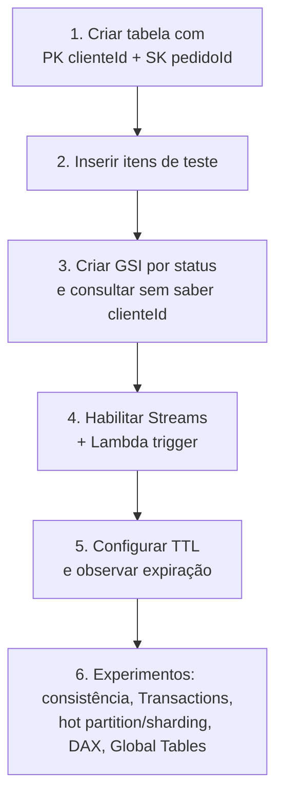
*Sequência do laboratório: criar tabela com chave composta, indexar, reagir a mudanças, expirar dados.*

---

## Comandos AWS CLI úteis

```bash
# Criar tabela com PK + SK, modo On-Demand
aws dynamodb create-table \
  --table-name PedidosLab \
  --attribute-definitions AttributeName=clienteId,AttributeType=S AttributeName=pedidoId,AttributeType=S \
  --key-schema AttributeName=clienteId,KeyType=HASH AttributeName=pedidoId,KeyType=RANGE \
  --billing-mode PAY_PER_REQUEST

# Inserir item
aws dynamodb put-item --table-name PedidosLab --item '{"clienteId":{"S":"cliente123"},"pedidoId":{"S":"2026-08-15#pedidoA"}}'

# Query pela chave primária (PK obrigatória, SK opcional)
aws dynamodb query --table-name PedidosLab \
  --key-condition-expression "clienteId = :c" \
  --expression-attribute-values '{":c":{"S":"cliente123"}}'

# Adicionar um GSI a uma tabela já existente
aws dynamodb update-table --table-name PedidosLab \
  --attribute-definitions AttributeName=status,AttributeType=S \
  --global-secondary-index-updates '[{"Create":{"IndexName":"status-index","KeySchema":[{"AttributeName":"status","KeyType":"HASH"}],"Projection":{"ProjectionType":"ALL"}}}]'

# Habilitar Streams numa tabela
aws dynamodb update-table --table-name PedidosLab \
  --stream-specification StreamEnabled=true,StreamViewType=NEW_AND_OLD_IMAGES

# Habilitar TTL
aws dynamodb update-time-to-live --table-name PedidosLab \
  --time-to-live-specification "Enabled=true, AttributeName=expiraEm"

# Habilitar Point-in-Time Recovery
aws dynamodb update-continuous-backups --table-name PedidosLab \
  --point-in-time-recovery-specification PointInTimeRecoveryEnabled=true

# Criar uma Global Table (adicionar réplica em outra região)
aws dynamodb update-table --table-name PedidosLab \
  --replica-updates '[{"Create":{"RegionName":"eu-west-1"}}]'

# Escrita transacional
aws dynamodb transact-write-items --transact-items '[
  {"Update":{"TableName":"Contas","Key":{"contaId":{"S":"A"}},"UpdateExpression":"SET saldo = saldo - :v","ExpressionAttributeValues":{":v":{"N":"100"}}}},
  {"Update":{"TableName":"Contas","Key":{"contaId":{"S":"B"}},"UpdateExpression":"SET saldo = saldo + :v","ExpressionAttributeValues":{":v":{"N":"100"}}}}
]'
```

---

## Tabela de decisão rápida (prova + dia a dia)

| Cenário | Resposta provável |
|---|---|
| Preciso consultar por um atributo diferente da PK, tabela já existe | GSI (LSI não pode ser adicionado depois) |
| Preciso de consistência forte numa consulta por atributo alternativo | LSI (GSI nunca oferece consistência forte) |
| Tráfego super imprevisível, aplicação nova sem histórico | Capacity mode On-Demand |
| Tráfego estável e previsível, quero o menor custo | Provisioned + Auto Scaling |
| Leituras repetidas em altíssimo volume no mesmo item | DAX |
| Preciso reagir em tempo real a toda mudança na tabela | DynamoDB Streams + Lambda |
| Aplicação global, escrita local rápida em várias regiões | Global Tables |
| Preciso garantir que várias operações aconteçam juntas ou nenhuma | Transactions (`TransactWriteItems`) |
| Preciso expirar/limpar itens antigos automaticamente, sem custo de WCU | TTL |
| Uma partição específica está sendo throttled mesmo com capacidade sobrando na tabela | Hot partition — redesenhar PK ou aplicar write sharding |
| PK com baixa cardinalidade (ex: data, status) causando concentração de carga | Adicionar sufixo de shard à PK |
| Quero reduzir número de requisições para montar uma "visão" de domínio relacionado | Considerar single-table design |
| "Melhorar performance de leitura sem redesenhar nada" (pegadinha comum) | DAX, não necessariamente redesenho de chave |
