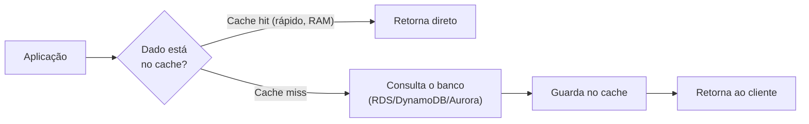
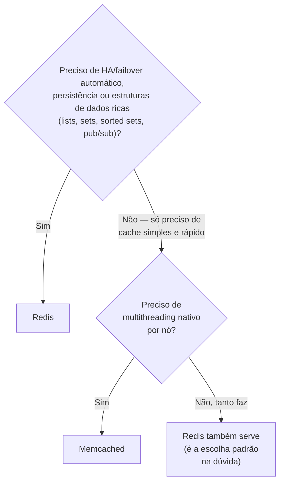
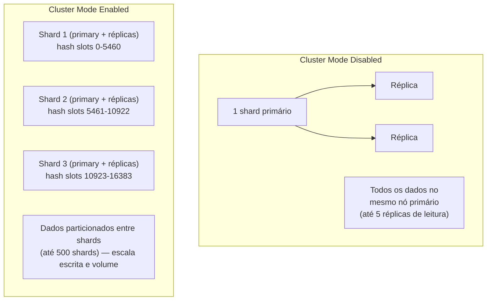
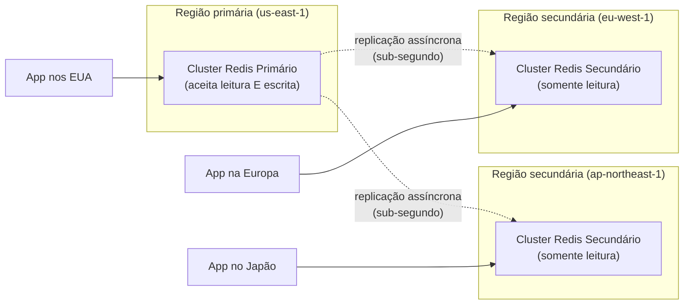
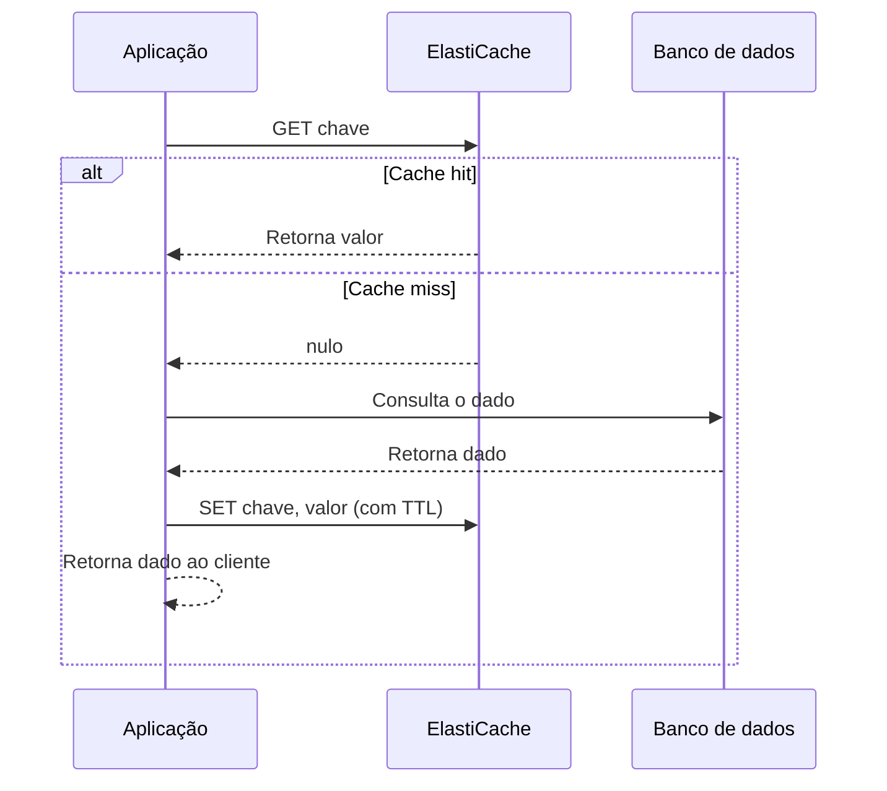
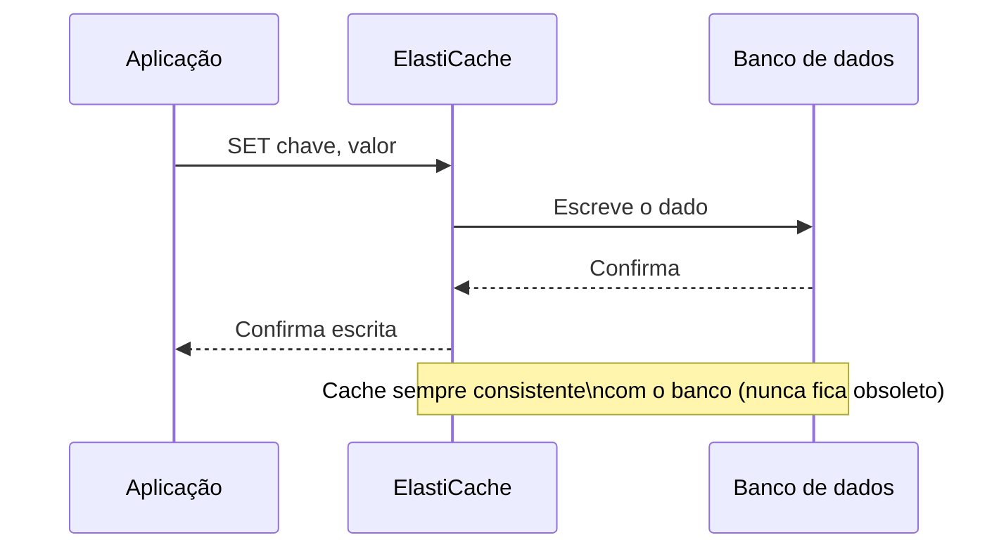
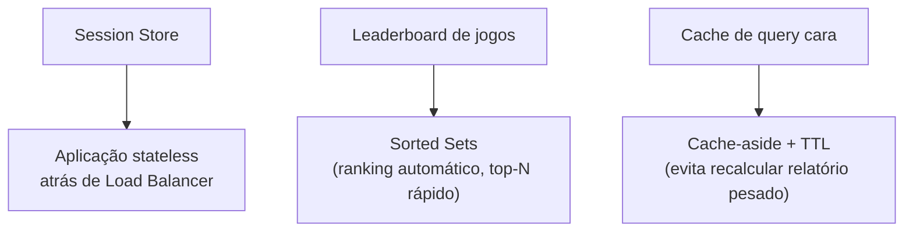
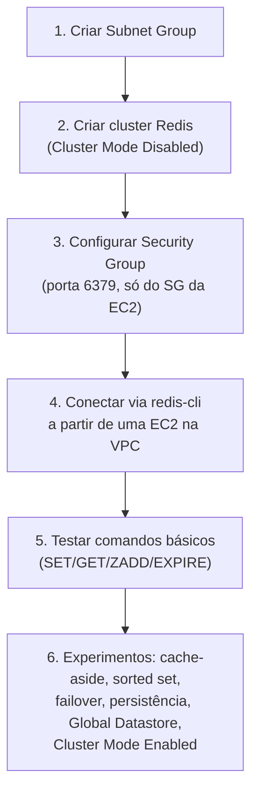

# ElastiCache — Guia Completo (Teoria + Prática + Dia a Dia)

## 0. O que é o ElastiCache e por que ele existe

Toda aplicação que cresce chega num ponto em que o banco de dados vira o gargalo. Não porque o banco é ruim, mas porque ele foi desenhado para **durabilidade e consistência**, não para responder em microssegundos sob milhares de requisições por segundo. Ler o mesmo registro do banco 10 mil vezes por segundo é desperdício: o dado não mudou, mas você paga o custo de disco, de rede, de lock, de I/O toda vez.

O **ElastiCache** é um serviço gerenciado de banco de dados **em memória** (in-memory), compatível com dois motores open-source: **Redis** e **Memcached**. Ele existe para resolver exatamente esse problema — tirar carga repetitiva do banco principal (RDS, DynamoDB, Aurora...) guardando em RAM os dados que são lidos com muita frequência e mudam pouco.

Pense nele como a "memória de curto prazo" da sua aplicação: rápido de acessar (latência sub-milissegundo, porque é RAM, não disco), mas menos duradouro e mais caro por GB do que o banco principal.


*O ElastiCache absorve leituras repetidas, protegendo o banco principal de carga desnecessária.*

**Por que "gerenciado" importa aqui:** rodar Redis/Memcached você mesmo em EC2 significa cuidar de patch, failover, backup, monitoramento de memória, scaling de cluster manualmente. O ElastiCache tira isso das suas costas — você escolhe o motor, o tamanho do nó, e a AWS cuida da operação (com bastante configuração fina disponível quando você precisa).

---

## 1. Redis vs Memcached — a decisão mais cobrada na prova

Essa é a comparação fundamental do serviço. Muita gente decora "Redis é mais completo" sem entender o porquê — e a prova gosta de testar justamente os detalhes técnicos por trás disso.

### Persistência
**Memcached não tem persistência nenhuma.** É puramente RAM — se o processo reinicia ou o nó cai, os dados somem, ponto final. Ele foi desenhado para ser um cache "descartável": se perder tudo, você reconstrói a partir do banco de origem.

**Redis suporta persistência em disco** via snapshots (RDB) e/ou log de escrita (AOF — Append Only File), permitindo restaurar o estado depois de um restart. Isso muda completamente o que você pode usar o Redis para fazer: não é só cache, pode ser uma fonte de dados "quase primária" para certos casos.

### Replicação e alta disponibilidade
**Memcached não tem replicação nativa.** Cada nó é independente — o "cluster" do Memcached é só uma forma de **particionar (shard)** os dados entre nós via hashing no lado do cliente, não de replicar para HA. Se um nó cai, você perde os dados daquele nó, sem failover automático.

**Redis tem replicação nativa** com nós primário (primary/master) e réplicas (read replicas), e suporta **Multi-AZ com failover automático** — se o nó primário falhar, uma réplica é promovida automaticamente, sem intervenção manual.

### Estruturas de dados
**Memcached** é estritamente **chave-valor simples** — string em, string fora. Ótimo para o caso de uso clássico "cachear o resultado de uma query" ou "cachear uma sessão HTTP como blob".

**Redis** suporta estruturas de dados ricas: **strings, lists, sets, sorted sets (zsets), hashes, streams, bitmaps, HyperLogLog**, e ainda tem **Pub/Sub** nativo (mensageria simples entre publishers e subscribers). Isso abre um leque de casos de uso que vão muito além de "cache" — leaderboards (sorted sets), filas simples (lists), contadores de visitantes únicos (HyperLogLog), feed de eventos em tempo real (Pub/Sub).

### Modelo de threading
**Memcached é multithreaded** — consegue usar múltiplos núcleos de CPU numa única instância nativamente, o que ajuda em cargas de trabalho simples e muito paralelas.

**Redis é tradicionalmente single-threaded** para o processamento de comandos (isso garante atomicidade sem precisar de locks complexos — cada comando executa do início ao fim sem ser interrompido por outro). Isso significa que uma única instância Redis usa efetivamente **um núcleo de CPU** para os comandos, então para escalar CPU horizontalmente você usa **Cluster Mode** (sharding entre múltiplos nós), não uma instância maior. Vale registrar que versões modernas do Redis introduziram threads auxiliares para I/O de rede, mas a execução dos comandos em si permanece single-threaded — o detalhe que a prova cobra é esse.

### Escalabilidade horizontal
Ambos permitem particionar dados entre múltiplos nós, mas de formas diferentes:
- **Memcached:** particionamento é feito **no lado do cliente** (o SDK decide, via hashing, em qual nó cada chave vive). A AWS não gerencia isso — é sua aplicação que decide.
- **Redis (Cluster Mode Enabled):** o particionamento é gerenciado pelo próprio serviço, com até milhares de **shards**, cada um com seu próprio primary + réplicas.

### Tabela comparativa completa

| Característica | Redis | Memcached |
|---|---|---|
| **Persistência em disco** | ✅ (RDB snapshots e/ou AOF) | ❌ — puramente em memória |
| **Replicação nativa / Multi-AZ com failover automático** | ✅ | ❌ |
| **Estruturas de dados ricas** (lists, sets, sorted sets, hashes, streams) | ✅ | ❌ — só chave-valor (string) |
| **Pub/Sub nativo** | ✅ | ❌ |
| **Transações** (execução atômica de múltiplos comandos) | ✅ (`MULTI`/`EXEC`) | ❌ |
| **Modelo de threading para comandos** | Single-threaded (por shard) | Multithreaded |
| **Particionamento (sharding)** | Gerenciado pelo serviço (Cluster Mode) | No lado do cliente |
| **Snapshots / backup gerenciado** | ✅ | ❌ |
| **Encriptação em trânsito e em repouso** | ✅ | ✅ (mais limitado) |
| **Autenticação** (Redis AUTH / ACLs) | ✅ | ❌ (mais básico) |
| **Global Datastore (replicação cross-region)** | ✅ | ❌ |
| **Tamanho máximo de item** | Até 512 MB por valor | Até 1 MB por valor |
| **Complexidade operacional** | Maior (mais features = mais para configurar) | Menor — é "cache burro e rápido" |
| **Caso de uso típico** | Session store, leaderboard, cache com necessidade de HA/persistência, filas simples | Cache simples e efêmero, alta taxa de throughput com objetos pequenos, multithread nativo |


*Árvore de decisão: na dúvida, Redis é a escolha padrão — Memcached só vence quando você quer simplicidade extrema ou multithreading nativo por nó.*

**O que muita gente erra na prova:** achar que "Memcached é mais rápido que Redis" de forma geral. Não é uma regra simples assim — depende muito da carga de trabalho. A diferença real que a prova quer que você saiba é **funcionalidade** (persistência, replicação, HA, estruturas de dados), não "quem é mais rápido".

---

## 2. Cluster Mode Enabled vs Disabled (Redis)

Esse é outro ponto que confunde muita gente porque o nome "Cluster Mode" soa como "ativa alta disponibilidade" — não é bem isso. HA (via réplicas) existe nos dois modos. A diferença real é sobre **particionamento (sharding) de dados**.

### Cluster Mode Disabled
Existe **um único shard primário**, com até 5 réplicas de leitura. Todos os dados vivem no mesmo nó primário — as réplicas só existem para leitura e para failover, não para dividir o volume de dados.

**Limitação real:** o tamanho máximo dos seus dados fica limitado à memória de **um único nó**. Se seu dataset é maior do que cabe numa instância, esse modo não resolve.

### Cluster Mode Enabled
Os dados são **particionados (sharded)** entre até **500 shards**, cada shard com seu próprio nó primário e até 5 réplicas. Isso permite:
- **Escalar a capacidade de escrita horizontalmente** (cada shard processa suas próprias escritas — lembra que Redis é single-threaded por shard, então mais shards = mais paralelismo real de escrita).
- **Guardar datasets muito maiores** do que caberia num único nó, porque o total é a soma da memória de todos os shards.

**Detalhe técnico importante:** no Cluster Mode Enabled, cada chave é mapeada para um **hash slot** (16.384 slots no total), e cada slot pertence a um shard específico. O cliente Redis "cluster-aware" sabe consultar o shard certo diretamente. Isso também significa que operações que envolvem múltiplas chaves (como transações multi-chave) só funcionam de forma simples se as chaves estiverem no mesmo slot/shard.


*Cluster Mode Disabled tem um único shard com réplicas para HA/leitura; Cluster Mode Enabled particiona os dados entre múltiplos shards para escalar escrita e volume total de dados.*

**No dia a dia:** você começa com Cluster Mode Disabled na maioria dos projetos (mais simples de operar, aplicação não precisa ser "cluster-aware"). Migra para Cluster Mode Enabled quando o dataset ultrapassa a memória de um único tipo de nó, ou quando o throughput de escrita satura um único shard.

**Pegadinha clássica de prova:** "Cluster Mode Enabled" não é sinônimo de "mais alta disponibilidade" — HA existe nos dois modos via réplicas + Multi-AZ failover. O que Cluster Mode Enabled resolve é **escala de dados e de escrita**, não disponibilidade.

---

## 3. Global Datastore — replicação cross-region

O **Global Datastore** replica dados do Redis de forma assíncrona entre clusters em **regiões AWS diferentes**, com latência de replicação tipicamente sub-segundo.

**Por que isso existe:** duas necessidades reais de arquitetura global —
1. **Leitura de baixa latência para usuários globais:** uma aplicação com usuários no Japão e nos EUA pode ler de uma réplica secundária local em cada região, em vez de todo mundo bater na região primária.
2. **Disaster Recovery (DR):** se a região primária cair inteira, você promove a região secundária a primária e a aplicação continua funcionando com um RPO (Recovery Point Objective) pequeno, graças à replicação contínua.

**Como funciona na prática:** você tem um cluster **primário** numa região, e até 2 clusters **secundários** (read-only) em outras regiões. Escritas só acontecem no cluster primário; as regiões secundárias recebem a réplica automaticamente.


*Cluster primário aceita escritas; clusters secundários em outras regiões servem leitura local e atuam como plano de DR.*

**No dia a dia / DR:** se a região primária ficar indisponível, você promove manualmente uma região secundária a primária (failover é uma operação que você dispara, não é 100% automático entre regiões — diferente do failover Multi-AZ dentro da mesma região, que é automático).

**Exclusivo de Redis** — Memcached não tem Global Datastore, coerente com o fato de não ter replicação nativa nenhuma.

---

## 4. Padrões de cache: Cache-Aside (Lazy Loading) vs Write-Through

Como você usa o cache importa tanto quanto qual motor você escolhe. Os dois padrões clássicos resolvem trade-offs diferentes.

### Cache-Aside (Lazy Loading)
A aplicação é responsável por gerenciar o cache manualmente:
1. Aplicação pede o dado ao cache.
2. **Cache hit:** retorna direto.
3. **Cache miss:** aplicação consulta o banco, guarda o resultado no cache, e retorna.


*Cache-aside: a aplicação só popula o cache quando o dado é efetivamente pedido (lazy).*

**Vantagens:** só guarda em cache o que é realmente consultado (uso de memória eficiente), e é resiliente a falhas do cache — se o cache cair, a aplicação ainda funciona (mais lenta) consultando o banco direto.

**Desvantagem clássica:** em um cache miss, há uma penalidade de latência (a chamada extra ao banco). E se você não invalidar o cache corretamente após um `UPDATE` no banco, ele fica com **dado obsolete (stale)** até o TTL expirar.

**Uso real:** é o padrão mais usado no mercado, de longe. Praticamente todo cache-aside em produção usa TTL como rede de segurança contra dado obsoleto.

### Write-Through
Toda escrita passa **pelo cache primeiro**, que então escreve no banco (ou escreve nos dois de forma sincronizada) — o cache está sempre atualizado, nunca fica obsoleto.


*Write-through: toda escrita atualiza o cache e o banco juntos, mantendo os dois sempre sincronizados.*

**Vantagem:** dado no cache nunca fica obsoleto — toda leitura subsequente já pega o valor mais atual.

**Desvantagens:**
- **Latência de escrita maior** (toda escrita agora passa por duas camadas).
- **Desperdício de memória:** dados que são escritos mas nunca lidos ficam ocupando cache à toa. Por isso, write-through costuma ser combinado com TTL, ou combinado com cache-aside para as leituras que raramente acontecem.
- Se o cache cai logo após uma escrita e antes de sincronizar, existe risco de inconsistência (mitigado normalmente escrevendo primeiro no banco, depois no cache, ou usando alguma forma de transação).

### Comparativo

| Aspecto | Cache-Aside (Lazy Loading) | Write-Through |
|---|---|---|
| Quando o cache é populado | Só no primeiro cache miss (sob demanda) | A cada escrita |
| Dado obsoleto (stale) | Possível até o TTL expirar | Praticamente eliminado |
| Penalidade de latência | No cache miss (leitura) | Em toda escrita |
| Uso de memória | Eficiente (só guarda o que é lido) | Pode desperdiçar (guarda tudo que é escrito, mesmo sem leitura) |
| Resiliência a cache indisponível | Alta — app cai para o banco | Depende da implementação |
| Combinação comum | Sempre com TTL | Combinado com cache-aside e/ou TTL |

**No dia a dia:** a maioria dos sistemas usa **cache-aside com TTL** como padrão default, e adiciona write-through (ou invalidação ativa no `UPDATE`) apenas em pontos específicos onde a leitura de dado atualizado é crítica (ex: saldo de conta, estoque em tempo real).

---

## 5. Casos de uso reais

### Session Store
Guardar sessão de usuário logado (token, carrinho de compras, preferências) em Redis em vez de na memória local do servidor de aplicação. Isso é o que permite que sua aplicação seja **stateless** e escale horizontalmente atrás de um Load Balancer — qualquer instância pode atender qualquer requisição, porque a sessão não está presa a um servidor específico.

**Por que Redis e não Memcached aqui:** sessão geralmente precisa sobreviver a um restart do nó de cache sem deslogar todo mundo — a persistência e a replicação com failover do Redis fazem muita diferença nesse cenário.

### Leaderboard de jogos
Usa a estrutura de dados **Sorted Set** do Redis — cada jogador é um membro com uma pontuação (score). O Redis mantém a ordenação automaticamente, e comandos como "pegar o top 10" ou "qual a posição do jogador X" são extremamente rápidos (operações logarítmicas), mesmo com milhões de jogadores.

Isso seria muito mais lento e complexo de implementar em um banco relacional tradicional fazendo `ORDER BY` toda vez, ou impossível de fazer eficientemente no Memcached, que nem tem esse conceito de estrutura ordenada.

### Cache de resultado de query cara
O clássico: uma query analítica pesada, um agregado de relatório, um join complexo que demora segundos no banco. Em vez de recalcular a cada requisição, você guarda o resultado no cache com um TTL (ex: 5 minutos), e todas as requisições nesse intervalo pegam o resultado pronto instantaneamente.

**Uso real comum:** dashboards, páginas de "produtos mais vendidos", contagens agregadas em e-commerce — qualquer coisa que não precisa ser 100% real-time e é cara de calcular.


*Três casos de uso clássicos do ElastiCache e a feature do Redis que resolve cada um.*

---

## 6. Conectando aos 4 domínios da prova

- **Performance:** é o propósito central do serviço — reduzir latência de leitura tirando carga do banco.
- **Resiliência:** Multi-AZ com failover automático (Redis), réplicas de leitura, Global Datastore para DR cross-region.
- **Segurança:** encriptação em trânsito e em repouso, Redis AUTH/ACLs, e o cluster vive dentro de uma VPC — normalmente em subnets privadas, acessível só pelos Security Groups da aplicação.
- **Custo:** cache reduz custo indireto (menos carga no banco = pode usar instância de banco menor), mas o cache em si tem custo próprio por hora — cachear dados que raramente são lidos de novo é desperdício.

---

# 🧪 Laboratório prático (para executar na AWS)

## Objetivo
Criar um cluster Redis (Cluster Mode Disabled) no ElastiCache, conectar de uma instância EC2, e experimentar os padrões descritos acima.

### Passo 1 — Criar a VPC e Subnet Group
Console → ElastiCache → **Subnet Groups** → Create
- Nome: `meu-subnet-group`
- Selecione ao menos 2 subnets privadas em AZs diferentes da sua VPC.

### Passo 2 — Criar o cluster Redis
Console → ElastiCache → **Redis clusters** → Create
- Cluster mode: **Disabled**
- Nome: `meu-cache-redis`
- Node type: `cache.t3.micro` (tier gratuito/menor custo para teste)
- Number of replicas: 1
- Subnet group: `meu-subnet-group`
- Encryption at-rest e in-transit: habilite para praticar (exige AUTH token se in-transit ligado)

### Passo 3 — Configurar o Security Group
Crie/edite um Security Group permitindo a porta **6379** (Redis) apenas a partir do Security Group da sua instância EC2 — nunca abra 0.0.0.0/0.

### Passo 4 — Conectar de uma instância EC2 na mesma VPC
```bash
sudo yum install -y gcc jemalloc-devel openssl-devel tcl
# instalar redis-cli (via redis stable source ou pacote redis6)
redis-cli -h meu-cache-redis.xxxxx.cache.amazonaws.com -p 6379 --tls
```

### Passo 5 — Testar comandos básicos
```bash
SET usuario:123 "Alex"
GET usuario:123
EXPIRE usuario:123 60
TTL usuario:123
ZADD leaderboard 1500 "jogador1"
ZADD leaderboard 2300 "jogador2"
ZREVRANGE leaderboard 0 9 WITHSCORES
```

### Passo 6 — Experimentos para fixar cada conceito
1. **Cache-aside na prática:** escreva um script Python simples (`redis-py` + `boto3`/`psycopg2`) que implementa o fluxo completo: consulta o Redis, se `miss` consulta um banco (pode simular com um dicionário/sleep), grava no Redis com TTL de 30s, e mede a diferença de latência entre hit e miss.
2. **Sorted Set para leaderboard:** popule um `ZADD` com 20 jogadores fictícios e pratique `ZRANK`, `ZREVRANGE`, `ZINCRBY` para simular pontuação subindo em tempo real.
3. **Failover Multi-AZ:** no console, force um failover manual da réplica (Actions → Failover primary) e observe o tempo de reconexão do cliente.
4. **Persistência:** compare criando um cluster com backup automático habilitado vs desabilitado, e veja as opções de snapshot manual disponíveis.
5. **Global Datastore:** (se seu orçamento permitir testar) crie um Global Datastore replicando para uma segunda região e meça o lag de replicação observando a mesma chave nas duas regiões.
6. **Cluster Mode Enabled:** crie um segundo cluster com Cluster Mode Enabled e 2 shards, insira chaves, e use `CLUSTER KEYSLOT chave` para ver a qual shard cada chave é mapeada.


*Sequência dos passos do laboratório prático.*

---

## Comandos AWS CLI úteis

```bash
# Criar um Subnet Group
aws elasticache create-cache-subnet-group \
  --cache-subnet-group-name meu-subnet-group \
  --cache-subnet-group-description "Subnet group para cache Redis" \
  --subnet-ids subnet-aaaa subnet-bbbb

# Criar um cluster Redis (replication group = suporta réplicas/HA)
aws elasticache create-replication-group \
  --replication-group-id meu-cache-redis \
  --replication-group-description "Cache Redis para sessao" \
  --engine redis \
  --cache-node-type cache.t3.micro \
  --num-cache-clusters 2 \
  --cache-subnet-group-name meu-subnet-group \
  --automatic-failover-enabled \
  --at-rest-encryption-enabled \
  --transit-encryption-enabled

# Descrever o cluster e pegar o endpoint
aws elasticache describe-replication-groups --replication-group-id meu-cache-redis

# Forçar failover manual (testar HA)
aws elasticache test-failover \
  --replication-group-id meu-cache-redis \
  --node-group-id 0001

# Criar snapshot manual
aws elasticache create-snapshot \
  --replication-group-id meu-cache-redis \
  --snapshot-name backup-manual-01

# Criar um Global Datastore (cross-region)
aws elasticache create-global-replication-group \
  --global-replication-group-id-suffix meu-global-cache \
  --primary-replication-group-id meu-cache-redis
```

---

## Tabela de decisão rápida (prova + dia a dia)

| Cenário | Resposta provável |
|---|---|
| Precisa de HA com failover automático | Redis (Multi-AZ) |
| Precisa de estruturas de dados ricas (ranking, filas, pub/sub) | Redis |
| Cache simples, efêmero, sem necessidade de persistência | Memcached |
| Precisa de multithreading nativo por nó | Memcached |
| Dataset maior do que cabe em uma instância única | Redis com Cluster Mode Enabled |
| Precisa de leitura de baixa latência para usuários em múltiplas regiões | Redis com Global Datastore |
| Session store para aplicação stateless | Redis |
| Leaderboard de jogo com ranking em tempo real | Redis (Sorted Sets) |
| Cache sempre deve refletir o dado mais atual do banco | Write-through |
| Cache só precisa ser populado sob demanda, tolera TTL curto | Cache-aside (Lazy Loading) |
| Precisa de transações atômicas simples no cache | Redis (`MULTI`/`EXEC`) |
