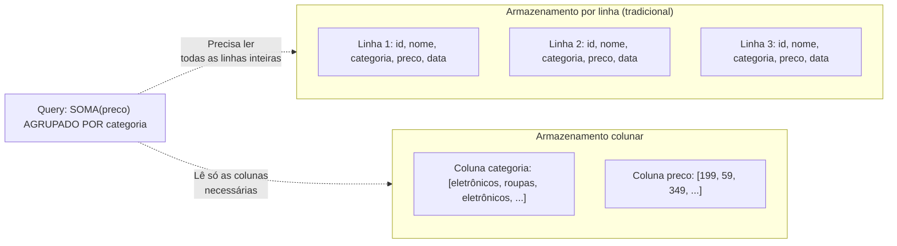
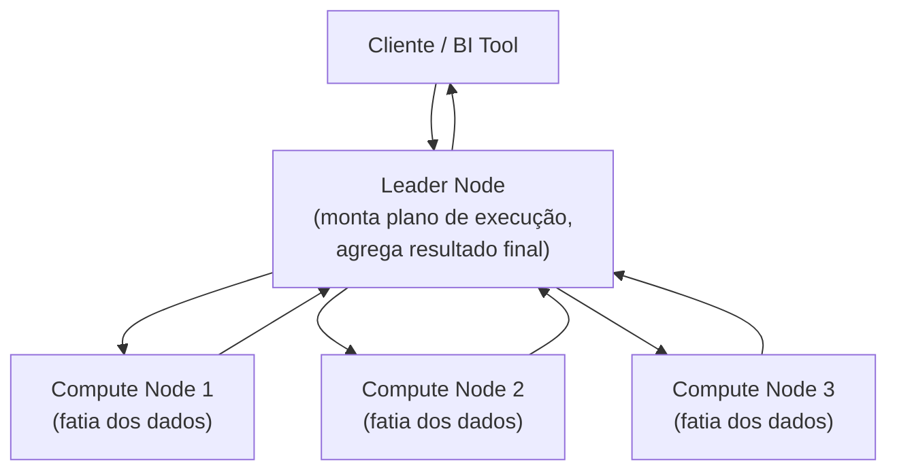
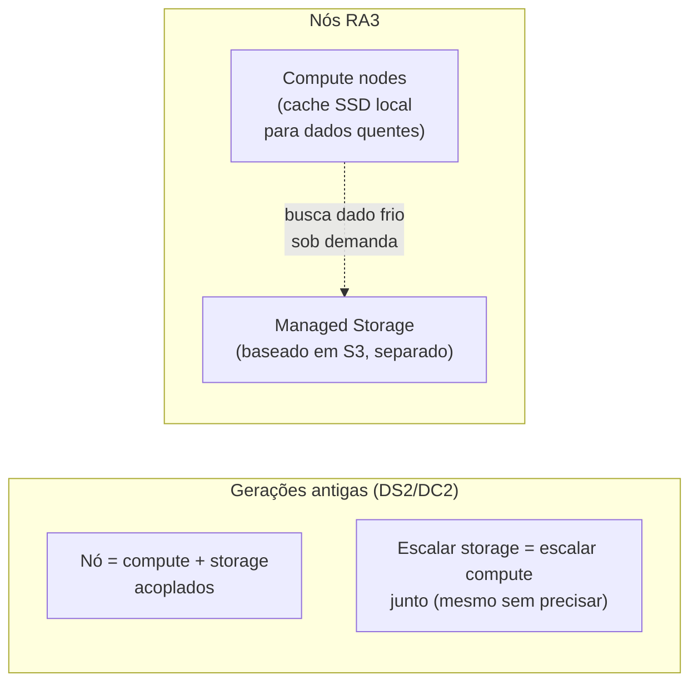
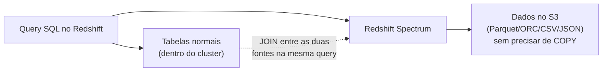
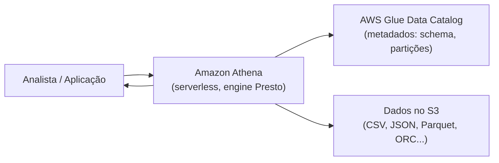
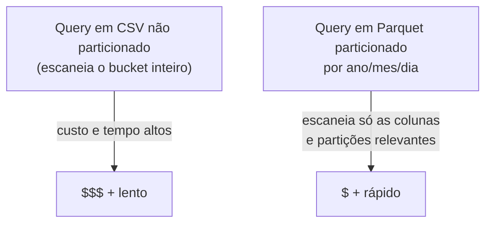
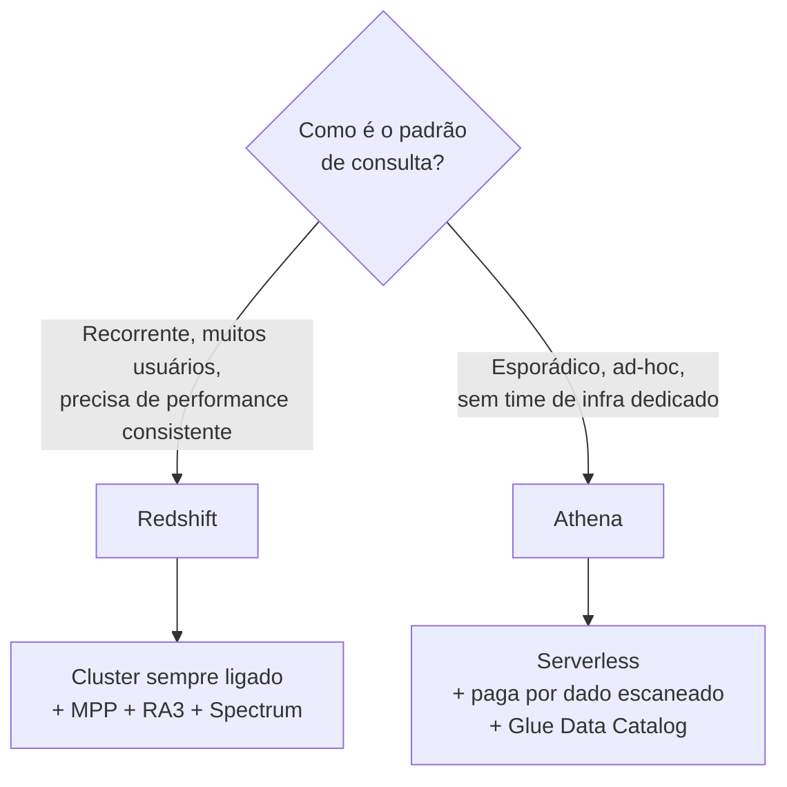
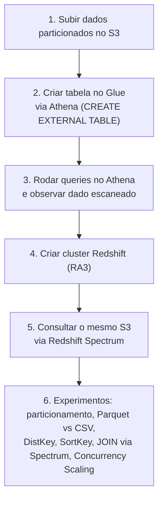

# Redshift e Athena — Guia Completo (Teoria + Prática + Dia a Dia)

## 0. O problema que os dois resolvem: analytics em cima de muito dado

Bancos de dados transacionais (RDS, DynamoDB) são ótimos para "buscar o pedido #4521" ou "atualizar o saldo do usuário X" — operações que tocam **poucas linhas** de cada vez (OLTP — Online Transaction Processing). Eles são péssimos para perguntas do tipo "qual foi a receita total por categoria de produto nos últimos 3 anos, agrupado por região" — isso exige varrer **milhões ou bilhões de linhas**, agregando colunas específicas (OLAP — Online Analytical Processing).

Tentar rodar esse tipo de query pesada direto no banco transacional de produção é uma receita clássica de desastre: a query analítica consome CPU/IO e derruba a performance do sistema que está atendendo clientes em tempo real.

**Redshift** e **Athena** resolvem esse problema de formas bem diferentes, mas com a mesma ideia central: **armazenamento colunar** — guardar os dados organizados por coluna, não por linha, o que faz uma diferença enorme quando você lê poucas colunas de muitas linhas (o padrão típico de uma query analítica).


*Armazenamento colunar lê só as colunas envolvidas na query, ignorando o resto — muito mais eficiente para agregações analíticas.*

---

## 1. Amazon Redshift

### O que é
O Redshift é um **data warehouse totalmente gerenciado**, feito para workloads analíticos recorrentes em larga escala — o tipo de sistema que roda dashboards de BI, relatórios diários, pipelines de ETL/ELT, todos os dias, com necessidade de performance previsível.

### Armazenamento colunar + compressão
Além de ler só as colunas necessárias, o formato colunar permite **compressão muito mais eficiente**, porque valores dentro de uma mesma coluna tendem a ser parecidos entre si (ex: uma coluna de "categoria" tem poucos valores distintos repetidos milhões de vezes). Isso reduz o volume de I/O necessário e, por consequência, acelera a query.

### MPP — Massively Parallel Processing
Esse é o coração da performance do Redshift. Um cluster Redshift é composto por:
- **Leader node:** recebe a query, monta o plano de execução, distribui o trabalho, e agrega os resultados finais.
- **Compute nodes:** cada um guarda uma fatia dos dados e executa sua parte da query **em paralelo** com os outros nós.

Quando você roda uma query, ela é dividida em pedaços que rodam **simultaneamente** em todos os compute nodes, cada um trabalhando só na fatia de dados que ele guarda localmente. Isso é fundamentalmente diferente de um banco tradicional, onde uma única query roda serialmente numa única máquina.


*MPP: a query é dividida e executada em paralelo entre os compute nodes, cada um processando sua fatia dos dados.*

**Distribution Style:** como os dados são distribuídos entre os compute nodes afeta diretamente a performance — se dados que precisam ser "juntados" (`JOIN`) numa query vivem em nós diferentes, o cluster precisa mover dados entre nós pela rede (redistribution), o que é caro. Escolher bem a **distribution key** (a coluna usada para decidir em qual nó cada linha vai) é uma das otimizações mais importantes de um cluster Redshift bem desenhado.

**Sort Key:** define a ordem física em que os dados são gravados em disco dentro de cada nó, permitindo que o Redshift pule blocos inteiros de dados que não são relevantes para uma query com filtro (`WHERE`) na coluna de sort key — parecido com o conceito de particionamento, mas dentro do próprio armazenamento.

### Nós RA3 — managed storage separado de compute
Nas gerações mais antigas (DS2, DC2), armazenamento e compute eram acoplados: para ganhar mais espaço em disco, você precisava adicionar mais nós (mesmo que não precisasse de mais poder de processamento), e vice-versa.

Os nós **RA3** desacoplam isso: o armazenamento fica em **managed storage** (baseado em S3, por baixo dos panos), separado da capacidade de compute dos nós. Isso significa:
- Você escala **compute** (adicionando/removendo/redimensionando nós) independentemente da quantidade de dados armazenados.
- Os nós RA3 usam cache local em SSD de alta performance para os dados "quentes" (mais acessados), e buscam do managed storage (S3) o resto sob demanda — de forma transparente para quem faz a query.
- Você paga o armazenamento pelo volume real usado, não pela capacidade de disco fixa amarrada ao tipo de nó.

**Por que isso importa na prova:** é a resposta padrão quando a questão menciona "separar armazenamento de compute no Redshift" ou "otimizar custo de um cluster que cresce em dados mas não em processamento".


*RA3 desacopla compute de armazenamento — você escala cada um de forma independente.*

### Redshift Spectrum
Permite rodar queries SQL **direto em dados no S3**, sem precisar carregar (fazer `COPY`) esses dados para dentro do cluster primeiro. O Redshift usa uma camada externa de compute (gerenciada pela AWS, fora dos seus compute nodes normais) para escanear os arquivos no S3 (Parquet, ORC, CSV, JSON, etc), e você faz `JOIN` entre tabelas "externas" (no S3) e tabelas normais dentro do cluster, tudo na mesma query.

**Por que isso é poderoso no dia a dia:** você não precisa duplicar dados frios/históricos dentro do cluster (que custa caro em managed storage) só para consultá-los raramente. Deixa no S3 (muito mais barato) e consulta via Spectrum quando precisar, mantendo no cluster só o que é consultado com frequência.


*Redshift Spectrum consulta dados direto no S3 sem carregá-los para o cluster, permitindo JOIN com tabelas internas.*

### Concurrency Scaling
Quando muitos usuários disparam queries simultaneamente (ex: horário de pico de um dashboard corporativo), o cluster pode ficar sobrecarregado e as queries começam a fazer fila. O **Concurrency Scaling** adiciona **clusters transitórios adicionais automaticamente** em segundos, para absorver esse pico de queries de leitura, e desliga esses clusters extras assim que a demanda cai — tudo de forma transparente para o usuário/aplicação (que continua se conectando no mesmo endpoint).

**No dia a dia:** resolve o cenário clássico "dashboard fica lento toda segunda de manhã quando todo mundo abre o relatório ao mesmo tempo", sem você precisar deixar o cluster permanentemente maior (e mais caro) só para aguentar esses picos pontuais.

---

## 2. Amazon Athena

### O que é
O Athena é um serviço de **query serverless** que roda SQL **direto em cima de arquivos no S3**, usando um motor baseado no **Presto/Trino** (engine open-source de query distribuída). Você não provisiona nada, não gerencia cluster, não escolhe tipo de instância — só aponta para onde os dados estão no S3, define o schema (ou deixa o Glue descobrir), e roda a query.


*Athena consulta dados direto no S3, usando o Glue Data Catalog como fonte de metadados de schema e partições.*

### Modelo de cobrança: paga por dado escaneado
Diferente do Redshift (que você paga por cluster ligado, independente de rodar query ou não), o Athena cobra **por volume de dados efetivamente escaneado** em cada query. Isso muda completamente a lógica de otimização: no Athena, **reduzir quantos bytes a query precisa ler é literalmente reduzir custo direto**, não só performance.

### Integração com AWS Glue Data Catalog
O Glue Data Catalog funciona como o "dicionário de metadados" compartilhado — ele guarda a definição de schema (quais colunas, tipos, localização no S3, informação de partição) das suas tabelas. O Athena consulta esse catálogo para saber como interpretar os arquivos no S3. O mesmo Data Catalog também é usado por outros serviços (Redshift Spectrum, EMR, Glue ETL Jobs) — ou seja, você define o schema uma vez e reutiliza em vários serviços.

### Dicas de performance (e de custo, já que são a mesma coisa aqui)

**Particionamento:** organizar os arquivos no S3 em uma estrutura de pastas que reflete colunas comumente filtradas (ex: `s3://bucket/vendas/ano=2026/mes=08/dia=15/arquivo.parquet`). Quando a query tem um `WHERE ano=2026 AND mes=08`, o Athena consegue **pular inteiramente** as pastas de outros anos/meses, sem nem abrir esses arquivos — reduzindo drasticamente os bytes escaneados (e o custo).

**Formatos colunares (Parquet/ORC):** guardar os dados em formato colunar comprimido em vez de CSV/JSON de texto puro reduz o volume de dados escaneado por duas razões: (1) o Athena só precisa ler as colunas envolvidas na query, não a linha inteira, e (2) a compressão nativa desses formatos reduz o tamanho físico dos arquivos. Na prática, essa combinação (particionamento + Parquet) costuma reduzir custo e tempo de query em uma ordem de grandeza — é uma das otimizações de maior impacto que existe no ecossistema de analytics da AWS.

**Compactar arquivos pequenos:** muitos arquivos pequenos no S3 (em vez de poucos arquivos grandes) prejudicam a performance porque o motor gasta overhead abrindo cada arquivo individualmente. Consolidar arquivos pequenos em arquivos maiores (via um job do Glue, por exemplo) ajuda bastante.


*Particionamento + formato colunar é a combinação de maior impacto para reduzir custo e tempo no Athena.*

---

## 3. Quando usar Redshift vs quando usar Athena

A pergunta certa não é "qual é melhor" — é "qual o padrão de uso do meu workload".

### Use Redshift quando:
- O workload analítico é **recorrente e previsível** — dashboards de BI acessados o dia inteiro, relatórios diários pesados, muitos usuários concorrentes fazendo join complexo com frequência.
- Você precisa de **performance consistente e previsível**, já que o cluster está sempre ligado e "aquecido" (cache local, dados já carregados/otimizados).
- Você já tem (ou está construindo) um data warehouse estruturado, com modelagem dimensional, ETL recorrente carregando dados novos.
- Concorrência alta de usuários simultâneos é esperada (com Concurrency Scaling absorvendo picos).

### Use Athena quando:
- As queries são **esporádicas, ad-hoc, exploratórias** — um analista quer investigar um dataset pontualmente, sem justificar manter infraestrutura ligada o tempo todo.
- Você **não quer gerenciar nenhuma infraestrutura** — zero cluster, zero patch, zero decisão de sizing.
- O dado já está no S3 (data lake) e você só precisa consultá-lo de vez em quando, sem duplicar/mover para dentro de um warehouse.
- O padrão de custo "pague só pelo que consultar" é mais vantajoso do que manter um cluster ligado 24/7 quando o uso é baixo/imprevisível.


*Critério de decisão: previsibilidade e volume de uso recorrente aponta para Redshift; uso esporádico e sem infraestrutura dedicada aponta para Athena.*

**No dia a dia, os dois convivem:** é comum um data lake no S3 servir tanto o Athena (para exploração ad-hoc e times de dados menores) quanto o Redshift (via Spectrum, consultando o mesmo S3 sem duplicar dados) para os relatórios corporativos recorrentes — a mesma fonte de dados, atendendo dois padrões de consumo diferentes.

---

## 4. Conectando aos 4 domínios da prova

- **Performance:** MPP, formato colunar, RA3 com cache local, Concurrency Scaling (Redshift); particionamento e formatos colunares reduzindo bytes escaneados (Athena).
- **Resiliência:** Redshift replica dados automaticamente dentro do cluster e suporta snapshots automáticos para restauração; Athena, sendo serverless sobre S3, herda a durabilidade altíssima do S3 (11 noves) sem você gerenciar nada.
- **Segurança:** ambos suportam encriptação em repouso (KMS) e em trânsito, integração com IAM para controle de acesso, e Lake Formation para controle de acesso refinado (a nível de coluna/linha) sobre o Data Catalog compartilhado.
- **Custo:** é o domínio mais decisivo nessa comparação — Redshift cobra por cluster ligado (previsível, mas fixo mesmo sem uso); Athena cobra por dado escaneado (variável, ótimo para uso esporádico, mas pode surpirender se as queries não forem otimizadas em datasets enormes sem partição).

---

# 🧪 Laboratório prático (para executar na AWS)

## Objetivo
Subir um bucket S3 com dados particionados, consultar via Athena, e depois consultar o mesmo S3 via Redshift Spectrum a partir de um cluster Redshift.

### Passo 1 — Preparar dados no S3
```bash
aws s3 mb s3://meu-data-lake-saa-lab
# Estrutura particionada, ex:
# s3://meu-data-lake-saa-lab/vendas/ano=2025/mes=01/vendas.parquet
# s3://meu-data-lake-saa-lab/vendas/ano=2025/mes=02/vendas.parquet
aws s3 cp vendas-jan.parquet s3://meu-data-lake-saa-lab/vendas/ano=2025/mes=01/vendas.parquet
aws s3 cp vendas-fev.parquet s3://meu-data-lake-saa-lab/vendas/ano=2025/mes=02/vendas.parquet
```

### Passo 2 — Criar a tabela no Glue Data Catalog via Athena
Console → Athena → Query editor
```sql
CREATE EXTERNAL TABLE vendas (
  id_venda INT,
  produto STRING,
  categoria STRING,
  valor DECIMAL(10,2)
)
PARTITIONED BY (ano STRING, mes STRING)
STORED AS PARQUET
LOCATION 's3://meu-data-lake-saa-lab/vendas/';

MSCK REPAIR TABLE vendas;  -- descobre as partições existentes
```

### Passo 3 — Rodar queries no Athena e observar dados escaneados
```sql
SELECT categoria, SUM(valor) AS total
FROM vendas
WHERE ano = '2025' AND mes = '02'
GROUP BY categoria;
```
Observe no console o campo **"Data scanned"** no resultado — compare rodando a mesma query sem o filtro de partição.

### Passo 4 — Criar um cluster Redshift pequeno
Console → Redshift → Create cluster
- Node type: `ra3.xlplus` (menor RA3 disponível) ou `dc2.large` para teste mais barato
- Habilite acesso a S3 via IAM Role associada ao cluster

### Passo 5 — Consultar o mesmo S3 via Redshift Spectrum
```sql
CREATE EXTERNAL SCHEMA spectrum_schema
FROM DATA CATALOG
DATABASE 'default'
IAM_ROLE 'arn:aws:iam::{account-id}:role/MeuRoleRedshiftSpectrum'
REGION 'us-east-1';

SELECT categoria, SUM(valor) AS total
FROM spectrum_schema.vendas
WHERE ano = '2025'
GROUP BY categoria;
```

### Passo 6 — Experimentos para fixar cada conceito
1. **Particionamento:** rode a mesma query com e sem filtro de partição no Athena e compare o "Data scanned" e o tempo de execução.
2. **Formato colunar:** converta os mesmos dados para CSV e compare bytes escaneados/tempo entre CSV e Parquet na mesma query.
3. **Distribution Key no Redshift:** crie duas versões da mesma tabela com `DISTSTYLE` diferentes (`EVEN` vs `KEY`) e compare o plano de execução (`EXPLAIN`) de um `JOIN` pesado.
4. **Sort Key:** adicione uma `SORTKEY` na coluna de data e compare a performance de uma query filtrando por intervalo de datas.
5. **Redshift Spectrum:** faça um `JOIN` entre uma tabela normal do cluster e a tabela externa do Spectrum na mesma query.
6. **Concurrency Scaling:** dispare várias queries simultâneas de diferentes sessões e observe (via console/CloudWatch) o Concurrency Scaling entrando em ação.


*Sequência dos passos do laboratório prático.*

---

## Comandos AWS CLI úteis

```bash
# Athena: rodar uma query
aws athena start-query-execution \
  --query-string "SELECT categoria, SUM(valor) FROM vendas WHERE ano='2025' GROUP BY categoria" \
  --query-execution-context Database=default \
  --result-configuration OutputLocation=s3://meu-data-lake-saa-lab/resultados/

# Athena: ver resultado da query
aws athena get-query-results --query-execution-id {execution-id}

# Glue: descobrir/atualizar partições automaticamente (crawler)
aws glue start-crawler --name meu-crawler-vendas

# Redshift: criar cluster
aws redshift create-cluster \
  --cluster-identifier meu-cluster-redshift \
  --node-type ra3.xlplus \
  --number-of-nodes 2 \
  --master-username admin \
  --master-user-password 'SenhaForte123!' \
  --db-name meudw

# Redshift: descrever cluster (pegar endpoint)
aws redshift describe-clusters --cluster-identifier meu-cluster-redshift

# Redshift: criar snapshot manual
aws redshift create-cluster-snapshot \
  --cluster-identifier meu-cluster-redshift \
  --snapshot-identifier backup-manual-01
```

---

## Tabela de decisão rápida (prova + dia a dia)

| Cenário | Resposta provável |
|---|---|
| Dashboard de BI acessado o dia todo por muitos usuários | Redshift |
| Consulta pontual, exploratória, time pequeno de dados | Athena |
| Não quer gerenciar nenhuma infraestrutura de query | Athena |
| Precisa de performance consistente e previsível | Redshift |
| Consultar dados no S3 sem duplicar/carregar para um warehouse | Athena, ou Redshift Spectrum (se já tem cluster) |
| Reduzir custo por otimização de armazenamento (particionamento + Parquet) | Athena (impacto direto no custo por byte escaneado) |
| Escalar armazenamento sem escalar compute | Redshift com nós RA3 (managed storage) |
| Absorver picos de usuários concorrentes sem manter cluster maior o tempo todo | Redshift com Concurrency Scaling |
| Workload transacional (OLTP) — buscar/atualizar poucos registros | Nenhum dos dois — use RDS/Aurora/DynamoDB |
