# Lambda e Serverless — Guia Completo (Teoria + Prática + Dia a Dia)

## 0. O que é o Lambda e por que ele existe

Antes do Lambda, "rodar código" significava provisionar um servidor (EC2), mantê-lo ligado 24/7, aplicar patch, dimensionar para o pico de tráfego (mesmo que 90% do tempo ele fique ocioso), e pagar por esse tempo ocioso. Para uma boa parte das cargas de trabalho reais — processar um evento, responder uma requisição HTTP, transformar um arquivo que acabou de chegar num bucket — isso é desperdício estrutural: você paga por capacidade "por via das dúvidas", não por trabalho realizado.

O **AWS Lambda** é um serviço de computação **serverless** (você não gerencia servidor nenhum, nem mesmo escolhe o tipo de instância) que executa o seu código **em resposta a eventos**, escala automaticamente de zero a milhares de execuções concorrentes, e cobra **por tempo de execução e memória alocada**, não por tempo ligado. Se ninguém chama sua função, você não paga nada (fora custos de armazenamento do código).

Pense no Lambda como "cole seu código aqui e a AWS decide quando, onde e quantas cópias rodar" — você não pensa em servidor, só em função.

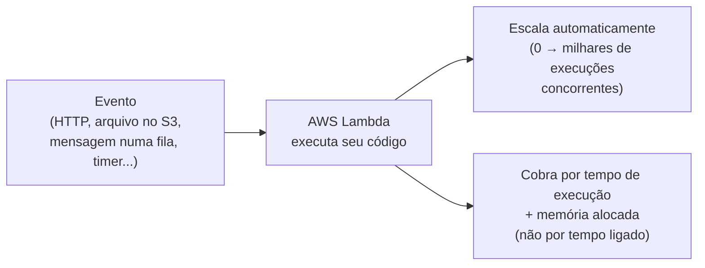
*O modelo fundamental do Lambda: código reativo a eventos, escala automática, cobrança por uso real.*

Esse arquivo cobre o **modelo de execução, limites, integração com outros serviços e as diferenças mais cobradas na prova**. A integração específica com API Gateway (Lambda Proxy vs Custom Integration) já foi coberta em profundidade em `Seçao18:Application_Integration/API_GATEWAY.md` — aqui tratamos o Lambda como serviço de compute em si, sem repetir aquele conteúdo.

---

## 1. Modelo de execução: cold start e warm start

### O que acontece por trás de uma invocação

Quando o Lambda precisa executar sua função e não há nenhum ambiente de execução disponível já "pronto" para aquele código, ele precisa:
1. Provisionar um ambiente de execução isolado (micro-VM via **Firecracker**, a tecnologia de virtualização leve criada pela AWS especificamente para isso).
2. Baixar o código da sua função (do S3, onde o pacote de deployment fica armazenado internamente).
3. Iniciar o runtime (Node.js, Python, Java, etc).
4. Executar qualquer código de inicialização que você tenha **fora do handler** (imports, conexões de banco, carregamento de configuração).
5. Só então chamar o handler com o evento.

Todo esse processo de setup (passos 1 a 4) é o que chamamos de **cold start**. Ele adiciona latência extra à primeira invocação.

Depois que esse ambiente é criado, o Lambda **mantém o ambiente "quente" por um tempo** (não documentado oficialmente como um número fixo — a AWS não garante quanto tempo, e varia). Se uma nova invocação chega enquanto esse ambiente ainda está disponível, ele é **reaproveitado** — pula direto para o handler, sem repetir o setup. Isso é o **warm start**, muito mais rápido.

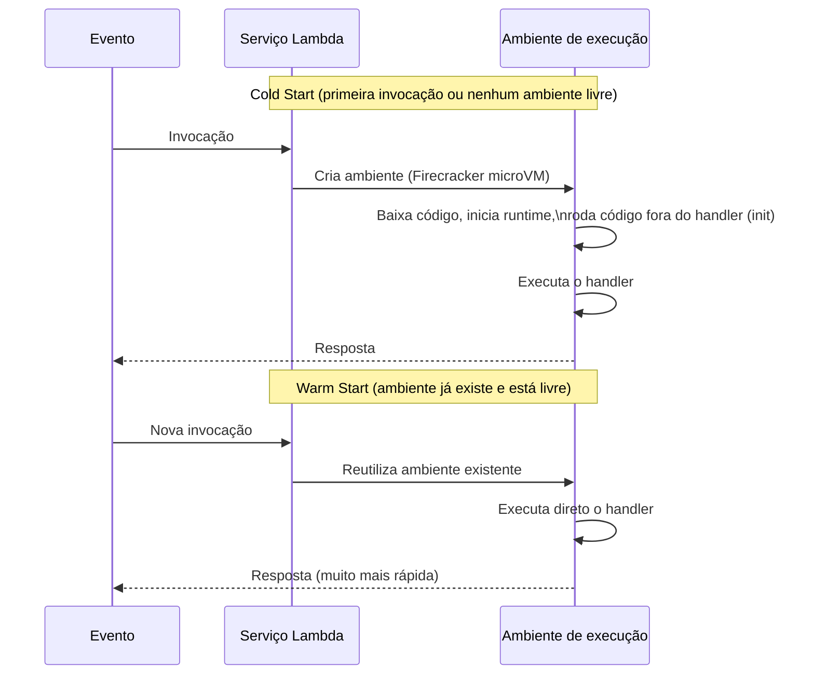
*Cold start paga o custo de criar o ambiente do zero; warm start reaproveita um ambiente já pronto.*

### O que causa/agrava o cold start
- **Runtime mais pesado:** runtimes como Java e .NET historicamente têm cold start maior que Node.js/Python, porque a JVM/CLR tem overhead de inicialização próprio, além do runtime da própria Lambda.
- **Pacote de deployment grande:** mais código para baixar e carregar na memória antes de começar.
- **Código de inicialização pesado fora do handler:** SDKs grandes sendo importados, conexões sendo abertas, configuração sendo carregada — tudo isso roda a cada cold start.
- **Lambda dentro de VPC** (historicamente — ver seção 5, isso mudou bastante com Hyperplane ENIs).
- **Memória baixa:** menos memória também significa menos CPU proporcional (seção 2), o que torna o processo de inicialização mais lento.

### Como mitigar
- **Provisioned Concurrency** (seção seguinte) — elimina cold start para uma quantidade garantida de execuções, mantendo ambientes sempre quentes e prontos.
- **Reduzir o tamanho do pacote de deployment** — importar só o que precisa, evitar SDKs inteiros quando só usa uma parte.
- **Mover inicialização pesada para fora do handler, mas de forma consciente** — código fora do handler roda uma vez por cold start e é reaproveitado nos warm starts seguintes (ex: abrir conexão de banco fora do handler é uma boa prática, porque a conexão é reutilizada entre invocações no mesmo ambiente).
- **Escolher runtime mais leve quando cold start for crítico** (Node.js/Python tendem a ter cold start menor que Java/.NET, embora otimizações como SnapStart — específico para Java — tenham reduzido bastante essa diferença).
- **Aumentar a memória alocada**, já que isso também aumenta CPU (ajuda tanto no cold start quanto na execução em si).

**No dia a dia:** cold start importa muito para APIs síncronas de baixa latência (usuário esperando resposta na tela). Para processamento assíncrono em background (ex: processar um arquivo que chegou no S3), alguns milissegundos ou até segundos extras de cold start raramente importam.

---

## 2. Concorrência: Reserved Concurrency vs Provisioned Concurrency

Essa é uma das distinções mais cobradas e mais confundidas da prova — os nomes parecem sinônimos, mas resolvem problemas completamente diferentes.

### Reserved Concurrency (Concorrência Reservada)
Define um **limite máximo (e garantido) de execuções concorrentes** que uma função específica pode ter. Duas coisas acontecem ao configurar isso:
1. Essa quantidade é **subtraída do pool de concorrência não reservada** da conta (a conta tem um limite total de concorrência compartilhado entre todas as funções, salvo aumento de limite via suporte).
2. A função **nunca vai além** desse número — se o limite é atingido, novas invocações são **throttled** (erro `429 TooManyRequestsException` em invocação síncrona, ou retry/DLQ em invocação assíncrona).

**Por que usar isso:**
- **Proteger um recurso downstream limitado** — ex: sua função Lambda escreve num banco relacional que só aguenta 50 conexões simultâneas. Sem limite, um pico de tráfego poderia gerar milhares de execuções concorrentes e derrubar o banco. Reserved Concurrency garante um teto.
- **Garantir que uma função crítica sempre tenha capacidade disponível**, isolando-a de outras funções da conta que poderiam consumir toda a concorrência compartilhada.
- Também pode ser usado para **impedir totalmente** uma função de executar, setando o valor como 0 (útil para desativar uma função temporariamente sem apagá-la).

### Provisioned Concurrency (Concorrência Provisionada)
Mantém um número de ambientes de execução **já inicializados e "quentes"**, prontos para responder **sem cold start**, o tempo todo (ou num schedule que você configura, via Application Auto Scaling).

**Por que usar isso:** é a resposta direta para "minha API precisa de latência baixa e previsível, e cold start está causando picos de latência inaceitáveis" — normalmente em APIs síncronas voltadas a usuário final, onde alguns segundos de cold start ocasional prejudicam a experiência.

**Custo:** você paga pelos ambientes provisionados **mesmo que não estejam sendo usados no momento** — é literalmente "pagar para deixar aquecido", parecido com manter um servidor ligado. Isso é o trade-off central: você troca o benefício do modelo serverless "pague só pelo uso" por latência previsível.

### A diferença central, resumida
- **Reserved Concurrency** limita **quantas execuções simultâneas** uma função pode ter — é sobre **controle/isolamento de capacidade**, não sobre latência.
- **Provisioned Concurrency** mantém ambientes **pré-aquecidos** — é sobre **eliminar cold start**, não sobre limitar quantidade.

Você pode (e frequentemente deve) usar os dois juntos: reservar um teto de concorrência para proteger o downstream, e dentro desse teto, provisionar uma fatia sempre quente para as invocações que precisam de latência baixa.

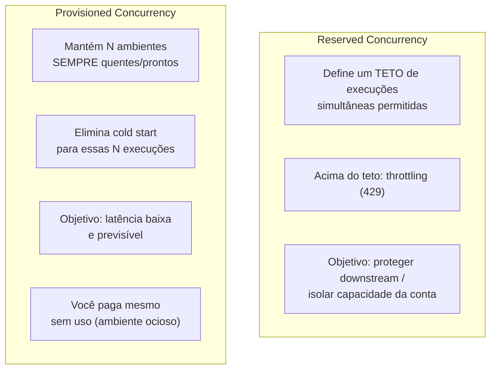
*Reserved Concurrency controla quantidade máxima; Provisioned Concurrency controla latência mantendo ambientes quentes.*

**Pegadinha clássica de prova:** a questão descreve "minha API tem picos de latência quando recebe tráfego repentino" e apresenta as duas opções como se fossem intercambiáveis. A resposta certa é sempre **Provisioned Concurrency**, porque o problema é cold start/latência, não excesso de concorrência. Já quando a questão descreve "minha função está sobrecarregando meu banco de dados downstream", a resposta é **Reserved Concurrency**.

---

## 3. Relação memória-CPU

No Lambda, você configura apenas a **quantidade de memória** (de 128 MB até 10.240 MB). O que muita gente não percebe: a **CPU alocada é proporcional à memória configurada** — você não escolhe CPU diretamente, ela vem "de brinde" junto com a memória.

Isso significa que uma função com gargalo de CPU (processamento pesado, compressão, cálculo intensivo) pode ficar **mais rápida ao aumentar a memória**, mesmo que ela não use toda aquela memória — porque o ganho real vem do aumento proporcional de CPU, não do espaço em RAM em si.

**Implicação de custo interessante:** às vezes aumentar a memória **reduz o custo total**, porque a função termina de executar tão mais rápido (mais CPU) que o custo por (tempo × memória) acaba sendo menor do que rodar mais devagar com menos memória por mais tempo. Isso é contraintuitivo — "gastar mais por segundo, mas por muito menos tempo, resulta em conta menor no total". Vale sempre testar/medir com ferramentas como o **AWS Lambda Power Tuning** (ferramenta open-source baseada em Step Functions) para achar o ponto ótimo de memória para uma função específica.

Em um nível de memória alto o suficiente (a partir de um certo ponto), a função Lambda passa a ter acesso a **múltiplos vCPUs** — útil para cargas de trabalho que se beneficiam de paralelismo dentro da própria execução (ex: multithreading no código).

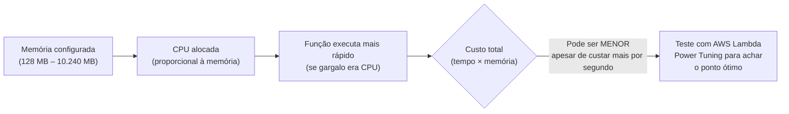
*Aumentar memória aumenta CPU proporcionalmente — em funções CPU-bound, isso pode reduzir tempo de execução (e às vezes até o custo total).*

**No dia a dia:** nunca assuma o valor de memória "padrão" (128 MB) como adequado sem testar. Funções com processamento de imagem, compressão, parsing pesado, ou qualquer coisa CPU-intensive quase sempre se beneficiam de mais memória, mesmo sem precisar do espaço em RAM.

---

## 4. Limites do Lambda

| Limite | Valor |
|---|---|
| **Timeout máximo de execução** | 15 minutos (900 segundos) |
| **Memória** | 128 MB até 10.240 MB (em incrementos de 1 MB) |
| **Payload de invocação síncrona** (request + response) | 6 MB |
| **Payload de invocação assíncrona** | 256 KB |
| **Tamanho do pacote de deployment (zip, upload direto)** | 50 MB (comprimido) |
| **Tamanho do pacote de deployment (descomprimido, incluindo layers)** | 250 MB |
| **Tamanho de imagem de container** | 10 GB |
| **`/tmp` (armazenamento efêmero)** | 512 MB até 10.240 MB (configurável) |
| **Variáveis de ambiente** | 4 KB no total |
| **Execuções concorrentes por conta (padrão, soft limit)** | 1.000 (pode solicitar aumento) |

**Por que o timeout máximo (15 min) importa na prova:** é o critério clássico para decidir "isso pode ser Lambda ou preciso de outra coisa" — processamento que pode ultrapassar 15 minutos de forma legítima (ex: processamento de vídeo longo, ETL pesado) não cabe no Lambda puro; a resposta esperada normalmente envolve **Step Functions orquestrando múltiplas invocações**, **Fargate**, ou dividir o trabalho em partes menores.

**Por que o limite de pacote de deployment importa:** quando seu código + dependências ultrapassam 250 MB descomprimido, as opções são: usar **imagens de container** (até 10 GB, ver Lambda com container images) ou repensar as dependências (algumas bibliotecas de ML/dados são pesadas o suficiente para estourar esse limite facilmente).

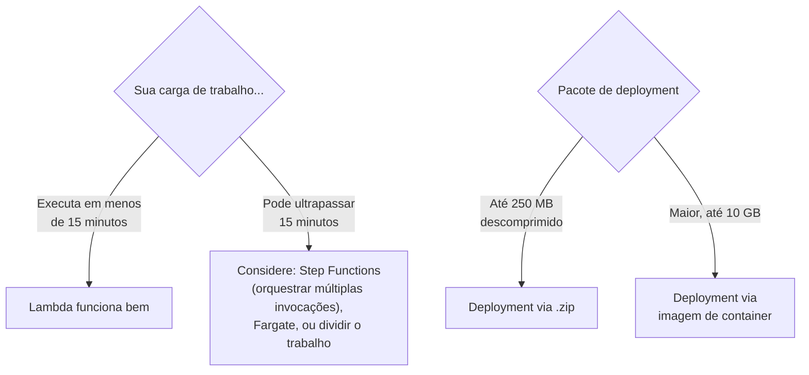
*Timeout de 15 minutos e tamanho de pacote são os dois limites mais cobrados como "gatilho" para considerar outra solução.*

---

## 5. Layers

**Layers** são pacotes de código/bibliotecas/dependências que podem ser **compartilhados entre múltiplas funções Lambda**, sem precisar duplicar esse código no pacote de deployment de cada função.

**Por que isso importa no dia a dia:**
- Se você tem 10 funções que usam a mesma biblioteca pesada (ex: um SDK de terceiros, um conjunto de utilitários internos da empresa), em vez de empacotar essa dependência 10 vezes (uma em cada função), você publica **um Layer** com ela, e cada função referencia esse Layer.
- Isso reduz o tamanho de cada pacote de deployment individual, e centraliza a manutenção — atualizar a dependência significa publicar uma nova versão do Layer, não redeployar cada função.
- Uma função pode usar até **5 Layers simultaneamente**, e o tamanho total (função + todos os Layers, descomprimido) ainda precisa respeitar o limite de 250 MB.

**Uso real comum:** bibliotecas internas de logging/observabilidade padronizadas da empresa, o SDK do **AWS X-Ray**, código nativo compilado que é caro de rebuildar toda vez, ou até o **AWS Lambda Powertools** (biblioteca open-source da AWS para logging estruturado, tracing e métricas, distribuída como Layer).

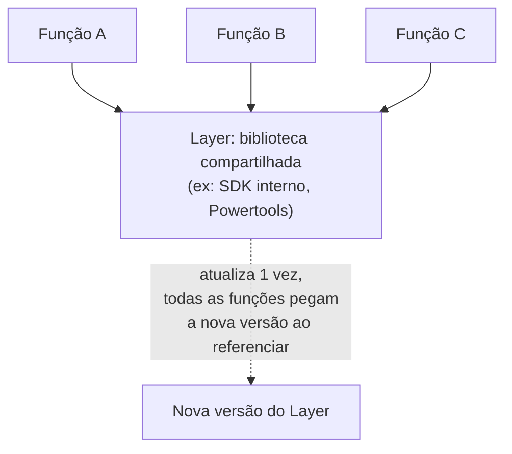
*Layers evitam duplicar dependências entre funções e centralizam a manutenção de código compartilhado.*

---

## 6. Lambda em VPC

### Por que precisa de ENI
Por padrão, uma função Lambda roda numa infraestrutura de rede **gerenciada pela AWS**, fora da sua VPC — ela tem acesso à internet e a outros serviços AWS publicamente, mas **não tem rota de rede para dentro da sua VPC** (ex: não alcança um RDS numa subnet privada, ou um Redis do ElastiCache).

Para a função conseguir "entrar" na sua VPC, o Lambda precisa criar uma **ENI (Elastic Network Interface)** dentro de uma subnet da sua VPC — essa ENI é o que dá à função um IP dentro da sua rede, permitindo alcançar recursos privados.

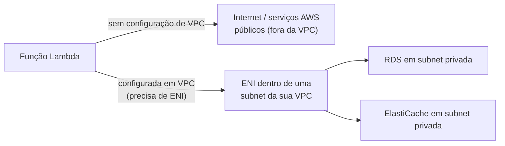
*Sem configuração de VPC, o Lambda não alcança recursos dentro de subnets privadas — precisa de uma ENI para "entrar" na rede.*

### Implicação histórica no cold start
Antigamente, cada função Lambda configurada em VPC precisava que uma ENI fosse **criada (ou reaproveitada) na hora da invocação**, e criar uma ENI é uma operação de rede relativamente lenta (podia levar dezenas de segundos). Isso tornava o cold start de funções em VPC significativamente pior do que funções fora de VPC — era um dos motivos clássicos citados como desvantagem de colocar Lambda dentro de VPC.

### A melhoria: Hyperplane ENIs
A AWS mudou a arquitetura interna para usar **Hyperplane ENIs** — em vez de criar uma ENI nova a cada cold start, um conjunto de ENIs compartilhadas é criado **uma vez** por combinação de subnet + security group, e reutilizado entre múltiplas funções e invocações. O provisionamento de rede deixou de ser o gargalo de cold start que era antes.

**Resultado prático:** hoje, colocar uma Lambda em VPC **não tem mais o penalty de cold start que tinha há alguns anos** — a diferença de latência entre função em VPC e fora de VPC é bem menor do que era. Isso é relevante para a prova porque materiais mais antigos ainda tratam "Lambda em VPC = cold start ruim" como regra fixa; hoje isso é bem mais um detalhe histórico do que uma limitação prática atual.

**No dia a dia, ainda assim:** só coloque a Lambda em VPC se ela **realmente precisa** acessar algo privado na rede (RDS, ElastiCache, um serviço interno). Se a função só precisa falar com serviços AWS públicos (S3, DynamoDB, SQS via endpoint público), deixá-la fora da VPC é mais simples e evita complexidade de configuração de rota/NAT desnecessária.

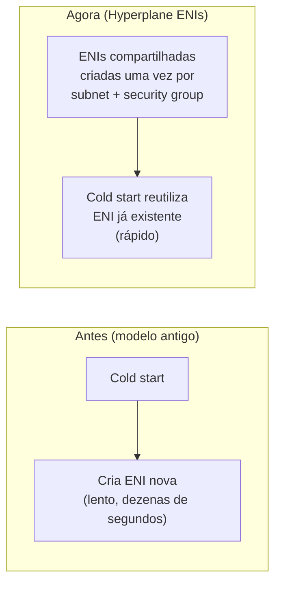
*Hyperplane ENIs eliminaram o penalty histórico de cold start para funções Lambda configuradas em VPC.*

---

## 7. Event Source Mappings: Poll-based vs Push-based

Essa é uma das distinções mais cobradas na prova, porque muda completamente **como você configura throttling, retry e escalonamento** de uma integração.

### Push-based (invocação direta pelo serviço)
O serviço de origem **invoca o Lambda diretamente** assim que o evento acontece — não existe polling, o Lambda é acionado de forma reativa e imediata.

**Serviços clássicos:** S3 (evento de novo objeto), SNS (mensagem publicada), API Gateway (requisição HTTP), CloudWatch Events/EventBridge (regra disparada), Cognito (trigger de autenticação).

Nesse modelo, cada evento gera (em geral) uma invocação — a escala é conduzida pelo volume de eventos que o serviço de origem está gerando, e a concorrência do Lambda escala rapidamente para acompanhar.

### Poll-based (o Lambda faz polling da fonte)
O serviço de origem **não invoca nada diretamente** — o próprio serviço Lambda (por trás dos panos, via um processo interno de polling gerenciado) **fica consultando a fonte** periodicamente, pega um lote de registros disponíveis, e invoca sua função com esse lote.

**Serviços clássicos:** **SQS**, **Kinesis Data Streams**, **DynamoDB Streams**, e também Amazon MQ e Kafka (MSK).

**Diferenças práticas importantes desse modelo:**
- O Lambda **controla o ritmo do polling e do batching** — você configura `batch size` (quantos registros por invocação) e, para streams (Kinesis/DynamoDB), o **paralelismo por shard**.
- Para **Kinesis Data Streams e DynamoDB Streams**: o processamento é **ordenado por shard** — o Lambda processa os registros de um shard sequencialmente (importante para casos onde ordem importa), e o paralelismo máximo é limitado pelo número de shards (a menos que você use processamento paralelo por shard, um recurso mais avançado que divide um shard em múltiplos "sub-grupos" lógicos).
- Para **SQS**: o Lambda faz polling da fila e escala a concorrência de acordo com a profundidade da fila (mais mensagens acumuladas = mais concorrência, respeitando os limites configurados). Erros de processamento podem levar a mensagem de volta à fila (via visibility timeout) até esgotar as tentativas e ir para uma **Dead Letter Queue (DLQ)** ou fila de mensagens não processadas (redrive policy), se configurada.
- Falhas em lote (batch) podem ser configuradas para **reportar itens específicos que falharam** (`ReportBatchItemFailures`), evitando reprocessar o lote inteiro por causa de um único item com erro — um detalhe fino, mas comum em cenários de prova mais avançados.

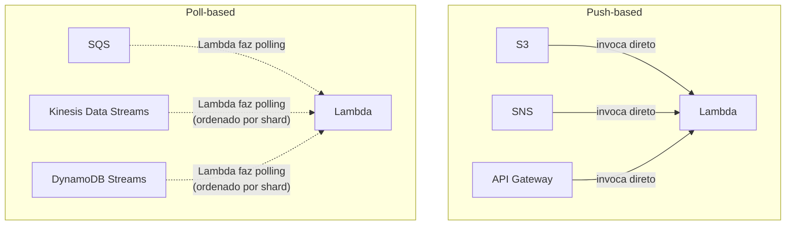
*Push-based: o serviço de origem invoca o Lambda diretamente. Poll-based: o Lambda consulta a fonte periodicamente e processa em lotes.*

**Pegadinha clássica de prova:** a questão pergunta "por que sua função Lambda ligada a uma fila SQS não escala tão rápido quanto esperado sob um pico repentino de mensagens" — a resposta envolve entender que o polling do SQS **aumenta a concorrência gradualmente**, não instantaneamente, diferente de um evento push-based onde cada evento pode gerar uma invocação quase imediata.

**Detalhe técnico importante:** o **Event Source Mapping** é o recurso que você configura para conectar uma fonte poll-based ao Lambda (é literalmente um objeto/configuração no Lambda, com `UUID` próprio, que você pode listar/pausar via CLI). Fontes push-based não usam Event Source Mapping — a permissão de invocação é dada via **resource-based policy** na própria função (ex: `aws lambda add-permission` autorizando o S3 a chamar a função).

---

## 8. Lambda Destinations

**Destinations** permitem enviar o **resultado de uma invocação assíncrona** (sucesso ou falha) para outro serviço, **sem precisar escrever código dentro da função para isso**.

Antes das Destinations, se você queria "fazer algo quando a função falha" (ex: notificar, registrar, disparar outra ação), você tinha que implementar isso manualmente dentro do código (try/catch, chamar outro serviço). Destinations move essa responsabilidade **para fora do código**, como configuração declarativa.

Você configura até 2 caminhos:
- **On Success:** para onde mandar o resultado quando a invocação assíncrona **termina com sucesso**.
- **On Failure:** para onde mandar quando **todas as tentativas de retry se esgotam e a invocação falha definitivamente**.

**Destinos suportados:** SNS, SQS, outra função Lambda, ou EventBridge (barramento de eventos, permitindo rotear a falha/sucesso para múltiplos consumidores via regras).

**Importante:** isso é específico de **invocação assíncrona** (ex: S3 → Lambda, SNS → Lambda, EventBridge → Lambda). Invocações síncronas (ex: API Gateway → Lambda) não usam Destinations da mesma forma, porque quem chamou já recebe a resposta (ou erro) diretamente na resposta HTTP.

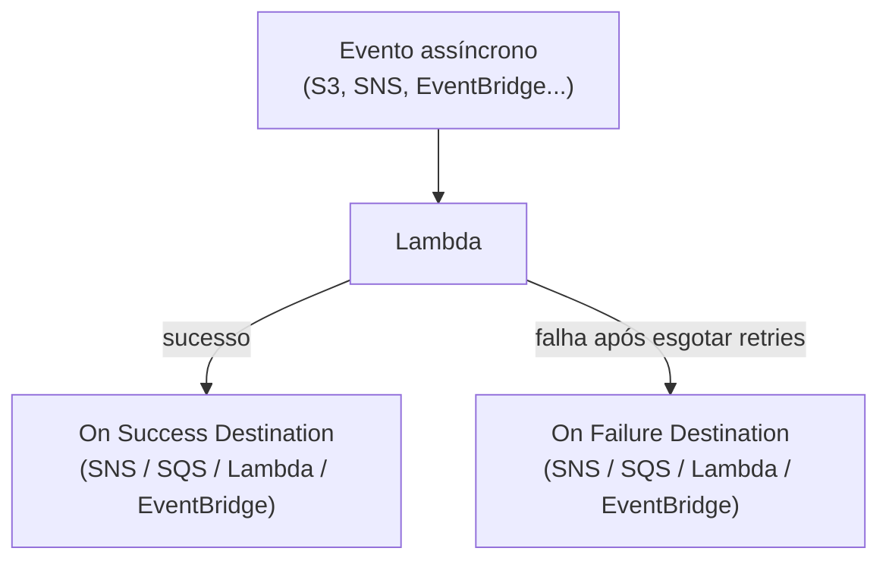
*Destinations roteiam o resultado da invocação assíncrona sem precisar de código extra na função.*

**Destinations vs DLQ (Dead Letter Queue) — diferença que a prova gosta de cobrar:** DLQ (recurso mais antigo) só captura o **evento original** em caso de falha, e só suporta SQS ou SNS como destino. Destinations, além de mais moderno e flexível (4 tipos de destino, incluindo Lambda e EventBridge), também **inclui informações adicionais sobre a execução** (contexto da invocação, número de tentativas, etc.), não só o payload bruto do evento. E Destinations também cobre o caminho de **sucesso**, algo que DLQ nunca fez (DLQ é só para falha).

---

## 9. Lambda@Edge vs CloudFront Functions

Ambos executam código "na borda" (edge) da rede da CloudFront, mais perto do usuário final, mas são serviços com propósitos e capacidades bem diferentes.

### Lambda@Edge
É uma extensão do Lambda tradicional, distribuída para rodar nos edge locations da CloudFront. Suporta **Node.js e Python**, tem acesso a mais poder computacional (memória configurável, timeout maior), e pode:
- Fazer chamadas de rede para fora (ex: consultar outro serviço, validar algo contra uma API externa).
- Executar em até 4 pontos do ciclo de vida da requisição CloudFront: **Viewer Request, Origin Request, Origin Response, Viewer Response**.
- Ter mais tempo de execução (até dezenas de segundos, dependendo do ponto de execução) e mais memória.

**Uso real:** lógica mais complexa na borda — ex: autenticação/autorização sofisticada antes de servir conteúdo, reescrever requisições complexas para múltiplas origens, A/B testing com lógica de negócio, manipulação de imagem simples.

### CloudFront Functions
Um runtime **muito mais leve e restrito**, criado especificamente para casos de uso simples que precisam de **latência extremamente baixa** (submilissegundos) e altíssima escala. Suporta apenas um **subconjunto de JavaScript (ES 5.1)**, sem acesso a rede, sem sistema de arquivos, com limite de execução muito curto (milissegundos) e menos memória disponível.

Executa apenas em 2 pontos do ciclo de vida: **Viewer Request e Viewer Response** (não tem acesso aos pontos de Origin, porque isso exigiria lógica mais pesada).

**Uso real:** manipulação simples de headers, redirecionamentos baseados em regras simples, normalização de URL, validação básica de token/cookie antes de servir do cache — qualquer coisa que precise ser **extremamente rápida e simples**.

### Tabela comparativa

| Aspecto | Lambda@Edge | CloudFront Functions |
|---|---|---|
| **Linguagem** | Node.js, Python | Subconjunto de JavaScript (ES 5.1) |
| **Pontos de execução no ciclo CloudFront** | Viewer Request, Origin Request, Origin Response, Viewer Response (4 pontos) | Viewer Request, Viewer Response (2 pontos) |
| **Acesso à rede externa** | ✅ | ❌ |
| **Tempo de execução máximo** | Segundos a dezenas de segundos (varia pelo ponto de execução) | Milissegundos (ordem de 1 ms) |
| **Memória/poder computacional** | Configurável, mais robusto (até 10 GB conforme o gatilho) | Muito limitado, fixo |
| **Escala/latência** | Boa, mas não tão extrema quanto CloudFront Functions | Extremamente baixa latência, feito para altíssima escala |
| **Custo** | Mais caro por execução | Muito mais barato — feito para volume altíssimo |
| **Casos de uso** | Lógica complexa: auth avançada, manipulação de origem, chamadas externas | Lógica simples: manipular headers, redirects, normalizar URL/cookie |

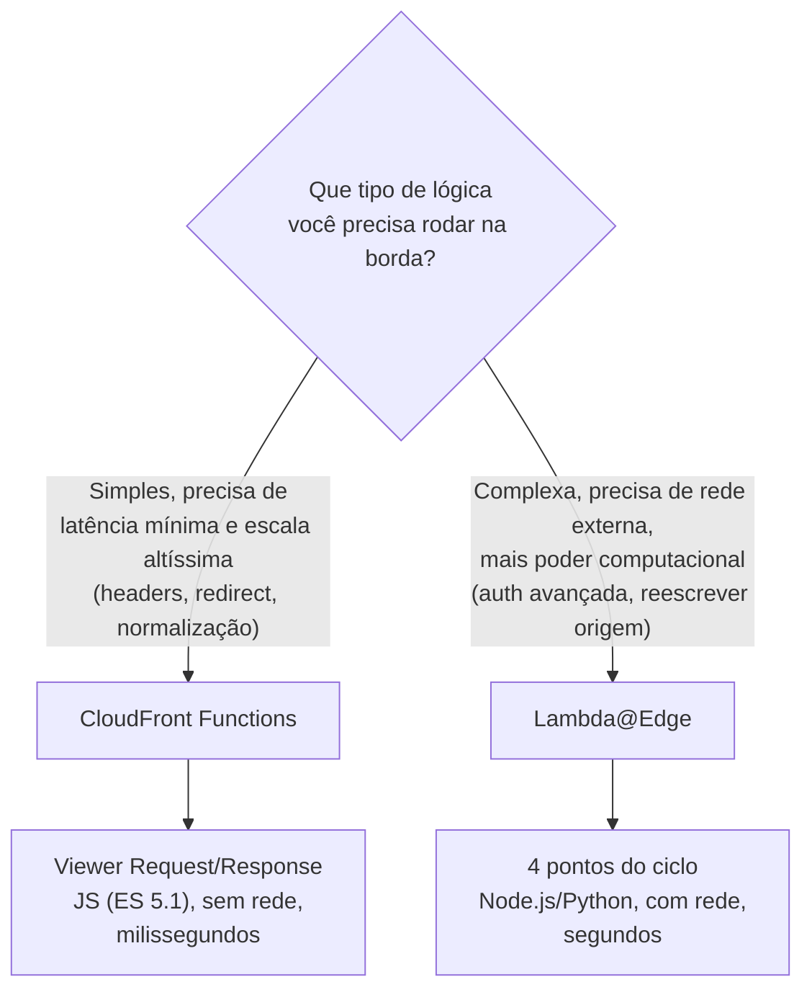
*Critério de decisão: complexidade da lógica e necessidade de acesso à rede apontam para Lambda@Edge; simplicidade e latência mínima apontam para CloudFront Functions.*

**Pegadinha clássica de prova:** a questão descreve "preciso fazer uma chamada a uma API externa para validar um token antes de servir o conteúdo" — isso **exige Lambda@Edge**, porque CloudFront Functions não tem acesso à rede externa. Já "preciso só reescrever um header ou redirecionar com base numa condição simples de URL, com o menor custo/latência possível" aponta para **CloudFront Functions**.

---

## 10. Conectando aos 4 domínios da prova

- **Performance:** relação memória-CPU, Provisioned Concurrency para eliminar cold start, event source mappings otimizados (batch size, paralelismo por shard), Lambda@Edge/CloudFront Functions reduzindo latência ao processar mais perto do usuário.
- **Resiliência:** retries automáticos em invocação assíncrona, DLQ e Destinations para capturar falhas, Event Source Mapping com redrive policy para SQS, execução multi-AZ transparente (você não escolhe AZ, a AWS distribui).
- **Segurança:** cada função roda com uma **execution role IAM** própria (least privilege por função), Lambda em VPC para acessar recursos privados, variáveis de ambiente podem ser encriptadas via KMS, resource-based policies controlando quem pode invocar.
- **Custo:** cobrança por uso real (sem servidor ocioso) é a vantagem estrutural do serverless; mas Provisioned Concurrency reintroduz custo fixo, e memória mal dimensionada (alta demais sem necessidade) desperdiça dinheiro — vale usar Power Tuning para calibrar.

---

# 🧪 Laboratório prático (para executar na AWS)

## Objetivo
Criar uma função Lambda, testar cold start vs warm start, configurar Provisioned Concurrency, conectar a uma fila SQS (poll-based) e configurar Destinations.

### Passo 1 — Criar a função base
Console → Lambda → **Create function**
- Nome: `minha-funcao-lab`
- Runtime: Python 3.12
- Memória inicial: 128 MB

```python
import time
import json

def lambda_handler(event, context):
    inicio = time.time()
    # Simula algum processamento
    total = sum(i * i for i in range(1_000_000))
    duracao = time.time() - inicio
    return {
        "statusCode": 200,
        "body": json.dumps({"resultado": total, "duracao_segundos": duracao})
    }
```

### Passo 2 — Medir cold start vs warm start
Invoque a função duas vezes seguidas via CLI e compare o campo `Init Duration` (só aparece no cold start) nos logs do CloudWatch.

```bash
aws lambda invoke --function-name minha-funcao-lab --log-type Tail out1.json
aws lambda invoke --function-name minha-funcao-lab --log-type Tail out2.json
```

### Passo 3 — Testar a relação memória-CPU
Altere a memória da função para 1024 MB e depois para 3008 MB, reinvocando e comparando `duracao_segundos` no resultado a cada mudança.

```bash
aws lambda update-function-configuration --function-name minha-funcao-lab --memory-size 1024
```

### Passo 4 — Configurar Provisioned Concurrency
Publique uma versão da função e configure Provisioned Concurrency nela.

```bash
aws lambda publish-version --function-name minha-funcao-lab
aws lambda put-provisioned-concurrency-config \
  --function-name minha-funcao-lab \
  --qualifier 1 \
  --provisioned-concurrent-executions 2
```

### Passo 5 — Conectar a uma fila SQS (poll-based)
```bash
aws sqs create-queue --queue-name minha-fila-lab
aws lambda create-event-source-mapping \
  --function-name minha-funcao-lab \
  --event-source-arn arn:aws:sqs:us-east-1:{account-id}:minha-fila-lab \
  --batch-size 5
```

### Passo 6 — Configurar Lambda Destinations (assíncrono)
```bash
aws sns create-topic --name minha-funcao-sucesso
aws sns create-topic --name minha-funcao-falha

aws lambda put-function-event-invoke-config \
  --function-name minha-funcao-lab \
  --destination-config '{
    "OnSuccess": {"Destination": "arn:aws:sns:us-east-1:{account-id}:minha-funcao-sucesso"},
    "OnFailure": {"Destination": "arn:aws:sns:us-east-1:{account-id}:minha-funcao-falha"}
  }'
```

### Passo 7 — Experimentos para fixar cada conceito
1. **Cold start real:** force um cold start deliberadamente (mude uma variável de ambiente, o que recicla o ambiente) e compare `Init Duration` antes/depois.
2. **Reserved Concurrency:** configure `--reserved-concurrent-executions 2` na função e dispare 10 invocações simultâneas via script, observando o erro `429 TooManyRequestsException` nas que excedem o limite.
3. **Provisioned vs sob demanda:** compare a latência da primeira invocação de uma versão com Provisioned Concurrency ativo vs uma sem, logo após um período ocioso.
4. **Poll-based na prática:** publique várias mensagens de uma vez na fila SQS do Passo 5 e observe no CloudWatch como a concorrência do Lambda cresce gradualmente, não instantaneamente.
5. **Destinations:** force uma falha proposital na função (`raise Exception`) numa invocação assíncrona (via `aws lambda invoke --invocation-type Event`) e confirme que a mensagem chega no tópico SNS de falha.
6. **Layers:** empacote uma biblioteca simples (ex: `requests`) como Layer, publique, e associe a uma nova função, comparando o tamanho do pacote de deployment com e sem o Layer.
7. **Lambda em VPC:** configure a função para rodar dentro de uma VPC (associando subnets e security group) e teste conectividade com um recurso privado (ex: um RDS), medindo se há diferença perceptível de cold start comparado à função fora de VPC.

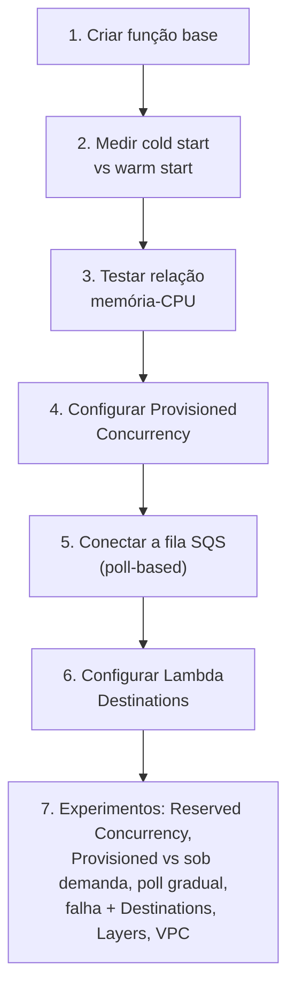
*Sequência dos passos do laboratório prático.*

---

## Comandos AWS CLI úteis

```bash
# Criar função a partir de um zip local
aws lambda create-function \
  --function-name minha-funcao-lab \
  --runtime python3.12 \
  --role arn:aws:iam::{account-id}:role/minha-role-lambda \
  --handler lambda_function.lambda_handler \
  --zip-file fileb://funcao.zip \
  --memory-size 128 \
  --timeout 10

# Invocar função e ver logs (Init Duration aparece em cold start)
aws lambda invoke --function-name minha-funcao-lab --log-type Tail response.json \
  --query 'LogResult' --output text | base64 --decode

# Atualizar memória
aws lambda update-function-configuration --function-name minha-funcao-lab --memory-size 1024

# Configurar Reserved Concurrency
aws lambda put-function-concurrency \
  --function-name minha-funcao-lab \
  --reserved-concurrent-executions 5

# Remover Reserved Concurrency
aws lambda delete-function-concurrency --function-name minha-funcao-lab

# Publicar uma versão e configurar Provisioned Concurrency
aws lambda publish-version --function-name minha-funcao-lab
aws lambda put-provisioned-concurrency-config \
  --function-name minha-funcao-lab --qualifier 1 --provisioned-concurrent-executions 2

# Criar/listar Layer
aws lambda publish-layer-version \
  --layer-name minha-layer-requests \
  --zip-file fileb://layer.zip \
  --compatible-runtimes python3.12

aws lambda list-layer-versions --layer-name minha-layer-requests

# Criar Event Source Mapping com SQS
aws lambda create-event-source-mapping \
  --function-name minha-funcao-lab \
  --event-source-arn arn:aws:sqs:us-east-1:{account-id}:minha-fila-lab \
  --batch-size 10

# Listar event source mappings
aws lambda list-event-source-mappings --function-name minha-funcao-lab

# Configurar Destinations
aws lambda put-function-event-invoke-config \
  --function-name minha-funcao-lab \
  --maximum-retry-attempts 2 \
  --destination-config '{"OnFailure":{"Destination":"arn:aws:sns:us-east-1:{account-id}:minha-funcao-falha"}}'
```

---

## Tabela de decisão rápida (prova + dia a dia)

| Cenário | Resposta provável |
|---|---|
| API precisa de latência baixa e previsível, sem picos de cold start | Provisioned Concurrency |
| Função está sobrecarregando um banco/recurso downstream limitado | Reserved Concurrency |
| Função CPU-bound está lenta | Aumentar memória (aumenta CPU proporcionalmente) |
| Múltiplas funções compartilham a mesma dependência pesada | Layers |
| Processamento pode ultrapassar 15 minutos | Step Functions, Fargate, ou dividir o trabalho |
| Precisa acessar RDS/ElastiCache em subnet privada | Lambda configurada em VPC |
| Fonte do evento é S3, SNS, API Gateway | Push-based (serviço invoca direto) |
| Fonte do evento é SQS, Kinesis Data Streams, DynamoDB Streams | Poll-based (Lambda faz polling, Event Source Mapping) |
| Precisa reagir a sucesso/falha de invocação assíncrona sem código extra | Lambda Destinations |
| Precisa só capturar o evento original em caso de falha (legado) | Dead Letter Queue (DLQ) |
| Lógica simples na borda (redirect, header) com latência mínima | CloudFront Functions |
| Lógica complexa na borda, precisa de chamada de rede externa | Lambda@Edge |
| Pacote de deployment ultrapassa 250 MB descomprimido | Deployment via imagem de container (até 10 GB) |
