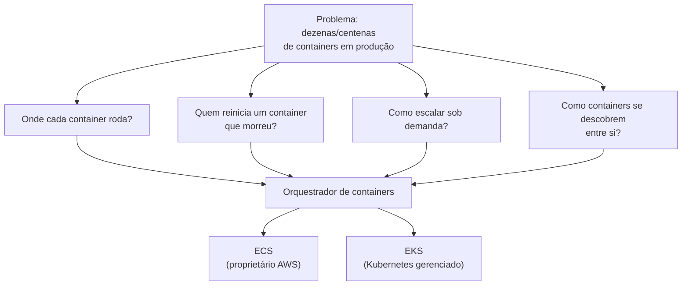
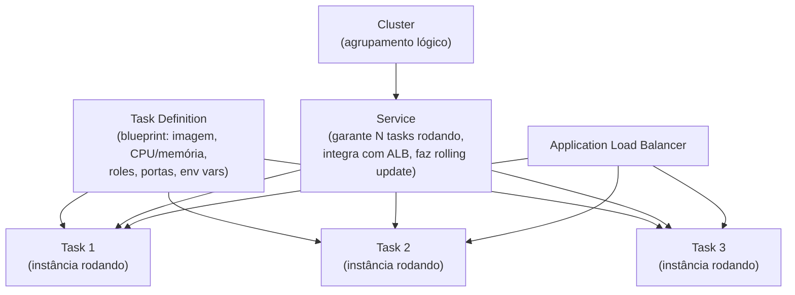
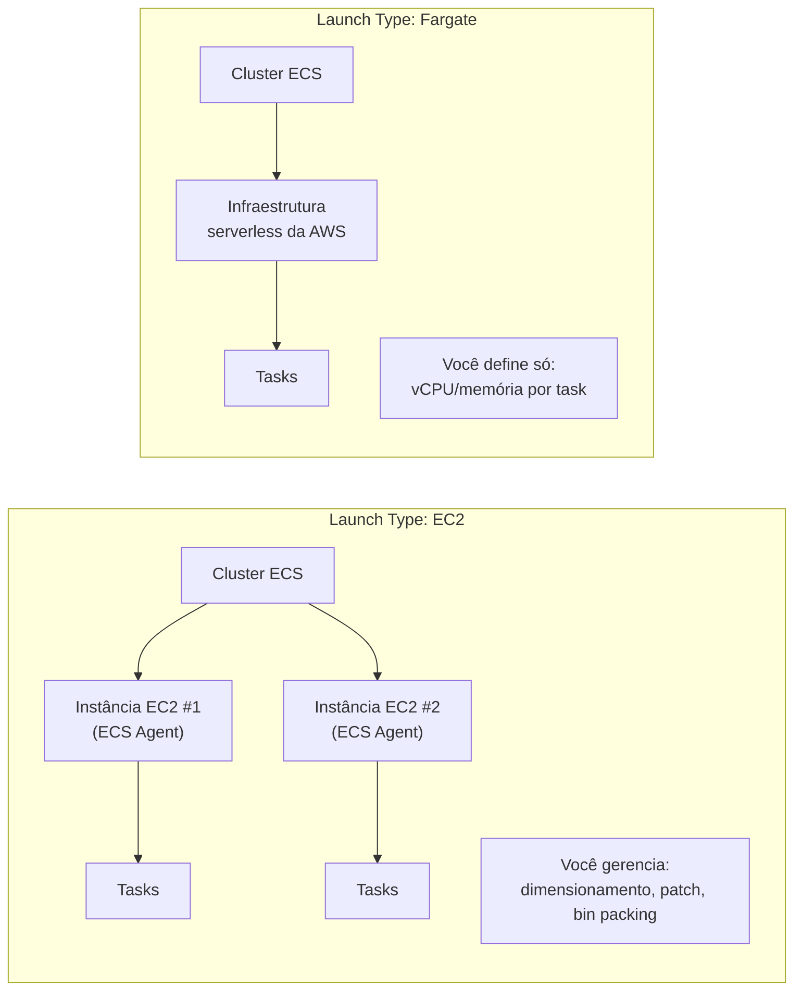
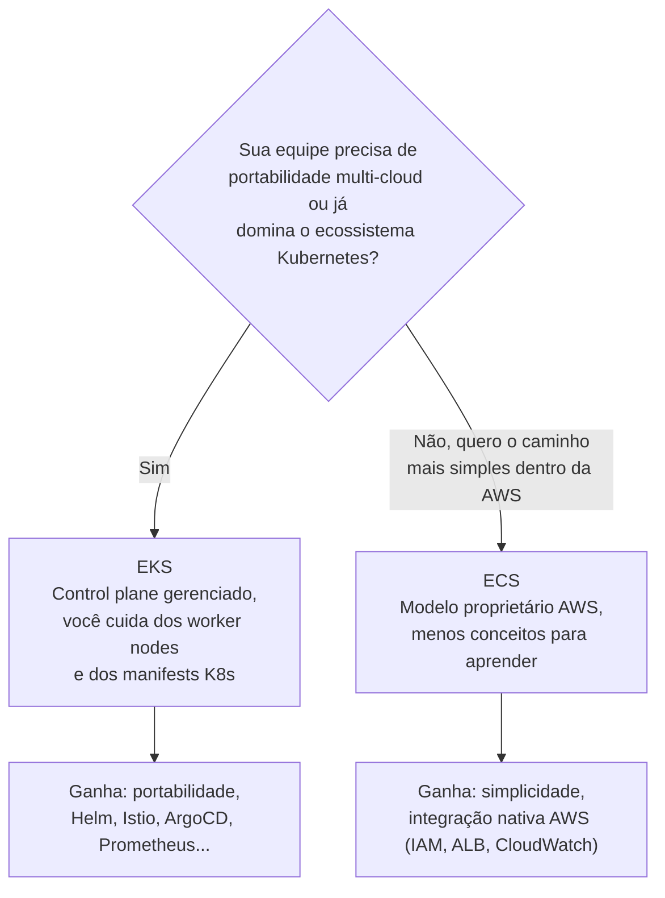
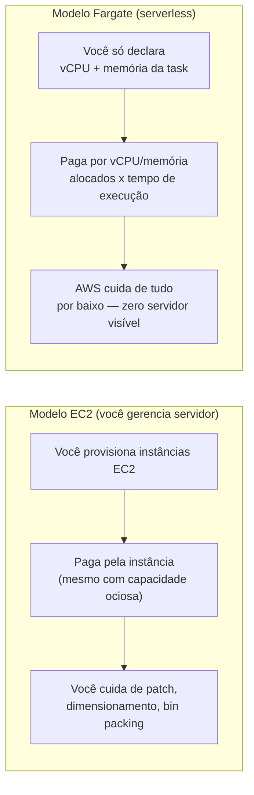
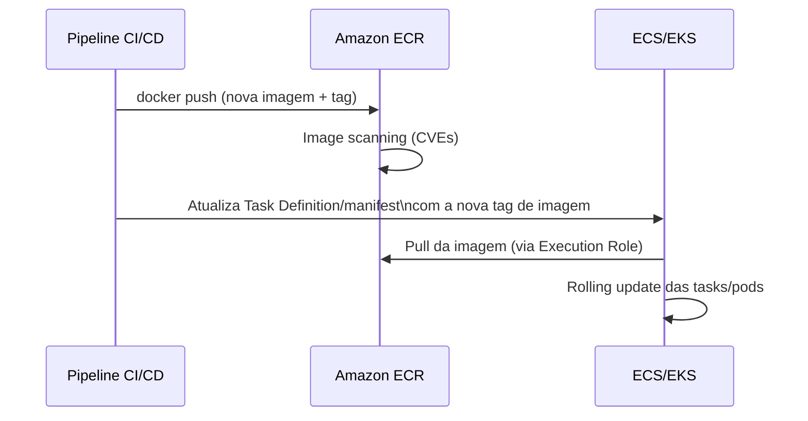
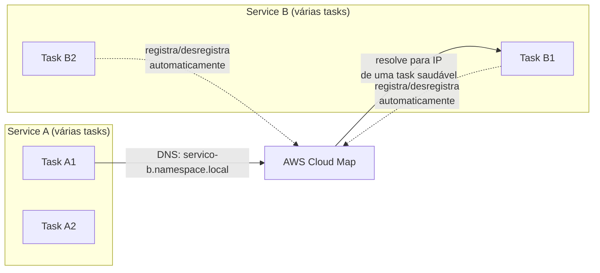
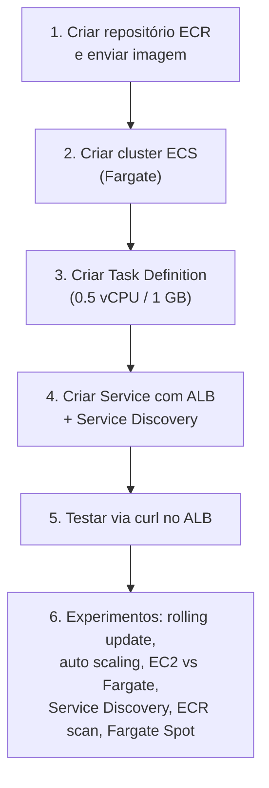

# ECS, EKS e Fargate — Guia Completo (Teoria + Prática + Dia a Dia)

## 0. O problema que containers em produção resolvem

Antes de falar de ECS/EKS/Fargate, vale entender o problema por trás.

Containers (Docker) resolvem o problema de "funciona na minha máquina" — você empacota a aplicação junto com todas as suas dependências (bibliotecas, runtime, variáveis de ambiente) numa imagem, e essa imagem roda igual em qualquer lugar. Até aí, tranquilo — o problema aparece quando você tem **dezenas ou centenas de containers em produção** e precisa responder perguntas como:

- Em qual servidor cada container deve rodar?
- O que acontece se um container morrer — quem reinicia ele?
- Como eu escalo de 3 para 30 containers durante um pico de tráfego?
- Como um container descobre o endereço de outro container (que pode estar em um IP diferente a cada deploy)?
- Como eu faço rolling update sem downtime?

Rodar `docker run` manualmente em uma única EC2 não resolve nada disso em escala. Você precisa de um **orquestrador de containers** — um serviço que decide onde cada container roda, monitora saúde, reinicia o que morreu, escala automaticamente e gerencia rede/descoberta entre eles. Na AWS, os dois orquestradores gerenciados são o **ECS (Elastic Container Service)**, proprietário da AWS, e o **EKS (Elastic Kubernetes Service)**, a versão gerenciada do Kubernetes. Por cima dos dois, existe o **Fargate**, que remove a necessidade de você gerenciar as instâncias EC2 por baixo.


*O problema de orquestração que tanto ECS quanto EKS resolvem — a diferença está em qual "motor" cuida disso por baixo.*

---

## 1. ECS — Elastic Container Service

### Os três blocos fundamentais

**Task Definition:** é o "blueprint" — um arquivo JSON que descreve como seu container deve rodar: qual imagem (geralmente do ECR), quanta CPU/memória, quais portas expor, variáveis de ambiente, volumes, a role IAM que o container assume (**Task Role**), e a role que a infraestrutura usa para buscar a imagem e mandar logs (**Task Execution Role**). É versionada — cada mudança gera uma nova **revision**, o que facilita rollback (voltar pra revision anterior).

**Task:** é uma **instância em execução** de uma Task Definition — o container (ou grupo de containers, se a task definition tiver mais de um) realmente rodando.

**Service:** garante que um número desejado de tasks fique sempre rodando (ex: "sempre 4 tasks da task definition X"). Se uma task morre, o Service sobe outra automaticamente. O Service também integra com um **Load Balancer** (ALB/NLB) para distribuir tráfego entre as tasks, e é o Service quem faz o **rolling update** quando você faz deploy de uma nova revision (sobe tasks novas, espera ficarem saudáveis, derruba as antigas gradualmente).

**Cluster:** o agrupamento lógico onde os Services/Tasks rodam. Não é um servidor físico — é uma "fronteira" administrativa e de billing/isolamento dentro da sua conta/região.


*Hierarquia do ECS: Task Definition é o molde, Task é a instância rodando, Service garante quantidade e faz deploy, Cluster agrupa tudo.*

**O que muita gente erra na prova:** achar que "Cluster" é um servidor. Não é — é só uma fronteira lógica. Quem realmente hospeda os containers são as instâncias EC2 (no launch type EC2) ou a infraestrutura serverless por trás do Fargate (no launch type Fargate).

### Launch Types: EC2 vs Fargate

**EC2 Launch Type:** você provisiona e gerencia as instâncias EC2 que compõem o cluster (o "Container Instance"). O ECS Agent, rodando em cada instância, coordena com o control plane do ECS para decidir onde colocar cada task, respeitando CPU/memória disponível. Você é responsável por: dimensionar o cluster (quantas instâncias, quais tipos), fazer patch do SO, garantir capacidade suficiente para as tasks (inclusive lidar com **bin packing** — encaixar várias tasks pequenas em poucas instâncias grandes para não desperdiçar capacidade).

**Vantagem real:** você pode aproveitar **Reserved Instances/Savings Plans/Spot** nas instâncias subjacentes para reduzir custo em cargas previsíveis e grandes, e tem controle total sobre o tipo de instância (ex: instâncias com GPU para workloads de ML).

**Fargate Launch Type:** detalhado na seção 3.


*No EC2 launch type você gerencia as instâncias por baixo; no Fargate a AWS cuida disso e você só descreve a task.*

---

## 2. EKS — Elastic Kubernetes Service

Kubernetes é o orquestrador de containers open-source mais adotado do mercado, criado originalmente pelo Google. O **EKS** é a versão do Kubernetes **gerenciada pela AWS** — a AWS cuida do **control plane** (os componentes que decidem o que roda onde: `etcd`, API server, scheduler, controller manager), garantindo alta disponibilidade e patch dessas peças, para que você só precise se preocupar com os **worker nodes** (onde os pods realmente rodam) e com os manifests Kubernetes da sua aplicação.

**Por que escolher EKS em vez do ECS (o modelo proprietário)?** A resposta certa não é "EKS é melhor" — é sobre **trade-offs**:

- **Portabilidade:** se você (ou sua empresa) já usa Kubernetes em outro provedor de nuvem, on-premises, ou quer manter a opção de migrar de nuvem no futuro sem reescrever toda a definição de infraestrutura de containers, Kubernetes é **padrão de mercado, não proprietário de um provedor**. Uma Task Definition do ECS só funciona no ECS; um manifest YAML do Kubernetes roda (com poucos ajustes) em EKS, GKE (Google), AKS (Azure) ou num cluster on-premises.
- **Ecossistema:** Kubernetes tem um ecossistema gigantesco de ferramentas (Helm para packaging, Istio/Linkerd para service mesh, ArgoCD/Flux para GitOps, Prometheus/Grafana para observabilidade) que muitas equipes já dominam e querem reaproveitar. Se sua equipe já tem esse know-how, EKS aproveita esse conhecimento; ECS exigiria reaprendizado do zero.
- **Times que já vêm de Kubernetes:** se a equipe de plataforma/DevOps já opera Kubernetes em outro contexto, EKS reduz a curva de aprendizado (mesma API, `kubectl`, mesmos conceitos de pods/deployments/services).

**Quando o ECS é a escolha mais simples:** se você está começando do zero, não tem exigência de portabilidade multi-cloud, e quer o caminho de menor complexidade operacional — ECS é mais simples de aprender e operar porque é 100% integrado ao ecossistema AWS (IAM, CloudWatch, ALB) sem a camada extra de abstração do Kubernetes. Muita gente subestima a curva de aprendizado de operar Kubernetes bem (mesmo gerenciado) — você ainda precisa entender pods, deployments, services, ingress controllers, RBAC do Kubernetes, etc.

**No dia a dia:** startups e times pequenos, sem exigência de portabilidade, tendem a preferir ECS pela simplicidade. Empresas maiores, com times de plataforma dedicados, workloads multi-cloud, ou que já padronizaram em Kubernetes corporativamente, tendem a preferir EKS.


*A escolha entre ECS e EKS gira em torno de portabilidade/ecossistema Kubernetes vs simplicidade operacional dentro da AWS.*

**Pegadinha clássica de prova:** "EKS é mais caro e mais complexo operacionalmente que ECS" — isso é verdade na maioria dos cenários (existe uma cobrança fixa por hora do control plane do EKS, além da complexidade extra de gerenciar conceitos Kubernetes), então se a pergunta não menciona nenhuma exigência de portabilidade/Kubernetes, a resposta esperada tende a ser **ECS**, não EKS.

---

## 3. Fargate — containers verdadeiramente serverless

**O problema que o Fargate resolve:** mesmo usando ECS ou EKS, no launch type EC2 (ou nos worker nodes tradicionais do EKS) você ainda precisa gerenciar as instâncias EC2 por baixo — decidir o tipo, dimensionar a quantidade, fazer patch do SO, lidar com capacidade ociosa (pagando por instâncias que não estão 100% utilizadas por causa do bin packing imperfeito).

O Fargate remove essa camada inteira: você **nunca vê ou gerencia uma instância EC2**. Você só descreve, na Task Definition, quanto de **vCPU e memória** aquela task precisa, e a AWS provisiona a capacidade necessária, roda o container isolado, e desprovisiona quando a task termina.

**Como muda o modelo de billing:** no launch type EC2, você paga pelas instâncias EC2 que estão rodando, estejam elas 100% utilizadas ou não (se você superdimensionou o cluster "para garantir capacidade", paga por capacidade ociosa). No **Fargate, você paga por vCPU e memória alocados por task, pelo tempo que a task roda** (billing por segundo, com mínimo). Isso é mais caro por unidade de computação comparado a uma EC2 bem otimizada e com alta taxa de utilização, mas elimina completamente o desperdício de capacidade ociosa e o trabalho operacional de dimensionar/corrigir/atualizar servidor.

**No dia a dia:** Fargate é a escolha natural para workloads com tráfego variável, times pequenos sem capacidade de operar infraestrutura EC2, cargas de trabalho batch/esporádicas, ou quando o objetivo é minimizar overhead operacional. EC2 launch type ainda faz mais sentido quando você tem **carga alta e previsível, tempo de sobra para otimizar bin packing, e quer aproveitar Reserved Instances/Savings Plans/Spot** para reduzir o custo por unidade de computação.

**Fargate Spot:** existe também uma variante Spot do Fargate, com desconto significativo em relação ao Fargate on-demand, para workloads tolerantes a interrupção (o mesmo conceito de EC2 Spot, aplicado ao Fargate).

O Fargate funciona tanto como launch type do **ECS** quanto como opção de execução no **EKS** (nesse caso, os pods rodam sem worker nodes EC2 visíveis).


*A diferença central de billing: EC2 cobra pela instância provisionada; Fargate cobra pelo que a task efetivamente declarou usar.*

**O que muita gente erra na prova:** achar que Fargate é "sempre mais barato". Não é uma verdade universal — para cargas grandes e estáveis, EC2 com Reserved Instances/Savings Plans normalmente sai mais barato por unidade de computação. Fargate ganha em **economia operacional** (menos trabalho de gerenciar infraestrutura) e em cenários de carga variável/pequena, não necessariamente em custo bruto de computação.

---

## 4. ECR — Elastic Container Registry

Antes de uma task rodar (em ECS ou EKS, EC2 ou Fargate), a imagem do container precisa vir de algum lugar. O **ECR** é o registro de imagens de container **gerenciado pela AWS**, equivalente privado ao Docker Hub.

Principais pontos:
- **Repositórios privados por padrão** — controlados por IAM/resource policy, quem pode fazer push/pull.
- **Integração nativa com IAM:** a Task Execution Role do ECS (ou o Service Account do EKS via IRSA) precisa de permissão `ecr:GetDownloadUrlForLayer`, `ecr:BatchGetImage`, etc, para conseguir puxar a imagem.
- **Image scanning:** o ECR pode escanear imagens automaticamente em busca de vulnerabilidades conhecidas (CVEs) no momento do push (scan básico) ou continuamente (scan avançado, baseado em Amazon Inspector).
- **Lifecycle policies:** regras automáticas para expirar imagens antigas/não usadas e não deixar o repositório crescer indefinidamente (e gerar custo de storage à toa).
- **Replicação cross-region/cross-account:** útil para distribuir a mesma imagem para múltiplas regiões (reduz latência de pull e dependência de uma única região) ou compartilhar com outras contas.

**No dia a dia:** o fluxo típico de CI/CD é: build da imagem → `docker push` para o ECR → o Service do ECS (ou o Deployment do EKS) referencia essa imagem na nova revision/manifest → rolling update puxa a nova imagem.


*Fluxo típico: build → push no ECR → scan de vulnerabilidades → atualização da task/manifest → pull e rolling update.*

---

## 5. Service Discovery com AWS Cloud Map

**O problema:** em uma arquitetura de microsserviços, o serviço A precisa chamar o serviço B. Mas em containers, os endereços IP mudam a cada deploy/restart (tasks são efêmeras). Como o serviço A "encontra" o endereço atual do serviço B sem hardcode?

O **AWS Cloud Map** resolve isso funcionando como um "catálogo de serviços dinâmico": quando você habilita **Service Discovery** em um ECS Service, cada task registrada é automaticamente adicionada/removida do Cloud Map conforme sobe/desce. O Cloud Map expõe isso via **DNS** (ex: `meu-servico.meu-namespace.local`) ou via API, e o serviço chamador resolve esse nome para pegar o(s) IP(s) atuais das tasks saudáveis.

**Diferença de um Load Balancer tradicional:** o ALB é ótimo para tráfego **externo** (internet → aplicação) ou entre camadas bem definidas. Service Discovery via Cloud Map é mais comum para comunicação **service-to-service interna**, especialmente quando você quer resolução via DNS simples sem o custo/latência extra de passar tudo por um Load Balancer.


*Cloud Map mantém um catálogo dinâmico das tasks vivas, resolvido via DNS para comunicação service-to-service.*

**No dia a dia:** muito usado em arquiteturas de microsserviços internas onde não faz sentido colocar um ALB entre cada par de serviços — o overhead de gerenciar dezenas de load balancers internos seria desnecessário. O EKS tem seu próprio mecanismo nativo de service discovery via `kube-dns`/CoreDNS (parte do próprio Kubernetes), então Cloud Map é mais associado ao mundo ECS.

---

## 6. Tabela comparativa: ECS+EC2 vs ECS+Fargate vs EKS+EC2 vs EKS+Fargate

| Critério | ECS + EC2 | ECS + Fargate | EKS + EC2 (worker nodes) | EKS + Fargate |
|---|---|---|---|---|
| **Quem gerencia o control plane** | AWS (proprietário ECS) | AWS (proprietário ECS) | AWS (control plane Kubernetes) | AWS (control plane Kubernetes) |
| **Quem gerencia servidor/instância** | Você (patch, dimensionamento) | AWS — nenhuma instância visível | Você (patch, dimensionamento dos nodes) | AWS — nenhum node visível |
| **Portabilidade para outra nuvem** | Baixa (proprietário AWS) | Baixa (proprietário AWS) | Alta (padrão Kubernetes) | Alta (padrão Kubernetes) |
| **Curva de aprendizado** | Baixa/média | Baixa | Alta (conceitos K8s) | Alta (conceitos K8s) |
| **Billing** | Por instância EC2 provisionada | Por vCPU/memória da task, por tempo | Por instância EC2 provisionada + taxa do control plane EKS | Por vCPU/memória do pod, por tempo + taxa do control plane EKS |
| **Controle de tipo de instância (GPU, etc)** | Total | Limitado (perfis padrão do Fargate) | Total | Limitado |
| **Uso de Spot para reduzir custo** | Sim (EC2 Spot) | Sim (Fargate Spot) | Sim (EC2 Spot) | Sim (Fargate Spot) |
| **Overhead operacional** | Maior | Menor | Maior (EC2 + K8s) | Menor, mas ainda tem complexidade do K8s |
| **Melhor cenário de uso** | Carga alta/previsível, quer otimizar custo com RI/Spot | Carga variável, time pequeno, quer zero gestão de servidor | Já usa/precisa de K8s e quer controle fino de infraestrutura | Já usa/precisa de K8s e quer zero gestão de servidor |

---

## 7. Conectando aos 4 domínios da prova

- **Segurança:** Task Role (IAM) dá permissões granulares por task, evitando compartilhar uma role ampla entre containers diferentes; ECR com scanning reduz risco de rodar imagens vulneráveis; Security Groups controlam tráfego de rede das tasks (em modo `awsvpc`, cada task tem sua própria ENI).
- **Resiliência:** Services do ECS (e ReplicaSets/Deployments do Kubernetes) garantem número desejado de réplicas, reiniciando automaticamente o que falhar; distribuir tasks/pods entre múltiplas AZs evita indisponibilidade por falha de uma zona.
- **Performance:** Fargate elimina o tempo gasto provisionando/corrigindo servidor, permitindo escalar mais rápido; Auto Scaling de Service (baseado em CPU/memória/métricas customizadas) ajusta a quantidade de tasks à demanda.
- **Custo:** a escolha entre EC2 e Fargate é primariamente uma decisão de custo — capacidade ociosa em EC2 vs preço por unidade mais alto no Fargate, mais o custo operacional (tempo de engenharia) de cada modelo.

---

# 🧪 Laboratório prático (para executar na AWS)

## Objetivo
Criar um cluster ECS com Fargate, rodando um container simples exposto via ALB, e explorar Service Discovery.

### Passo 1 — Criar um repositório no ECR e enviar uma imagem
```bash
aws ecr create-repository --repository-name minha-app-web

# Autenticar o Docker no ECR
aws ecr get-login-password --region us-east-1 | docker login --username AWS --password-stdin {account-id}.dkr.ecr.us-east-1.amazonaws.com

docker build -t minha-app-web .
docker tag minha-app-web:latest {account-id}.dkr.ecr.us-east-1.amazonaws.com/minha-app-web:latest
docker push {account-id}.dkr.ecr.us-east-1.amazonaws.com/minha-app-web:latest
```

### Passo 2 — Criar o cluster ECS (Fargate)
Console → ECS → **Create Cluster**
- Nome: `cluster-fargate-lab`
- Infraestrutura: **AWS Fargate (serverless)**

### Passo 3 — Criar a Task Definition
Console → ECS → **Task Definitions → Create new Task Definition**
- Launch type: **Fargate**
- vCPU: 0.5, Memória: 1 GB
- Container: imagem do ECR criada no Passo 1, porta 80
- Task Role e Task Execution Role: criar/usar roles com permissão mínima necessária (ECR pull + CloudWatch Logs)

### Passo 4 — Criar o Service com Load Balancer
Console → ECS → cluster `cluster-fargate-lab` → **Create Service**
- Launch type: Fargate
- Task Definition criada no Passo 3
- Desired tasks: 2
- Load balancer: criar/associar um **Application Load Balancer**
- Habilitar **Service Discovery** (namespace Cloud Map, ex: `lab.local`)

### Passo 5 — Testar
```bash
curl http://{dns-do-alb}
```

### Passo 6 — Experimentos para fixar cada conceito
1. **Rolling update:** publique uma nova imagem no ECR com uma tag diferente, atualize a Task Definition (nova revision) e force um novo deploy no Service — observe o ECS subindo tasks novas e derrubando as antigas gradualmente, sem downtime.
2. **Auto Scaling:** configure Service Auto Scaling baseado em CPU (ex: target 50%) e gere carga artificial para ver o número de tasks aumentar.
3. **EC2 vs Fargate:** crie um segundo cluster com launch type EC2 (Auto Scaling Group de instâncias), rode a mesma Task Definition adaptada, e compare o tempo até a task ficar `RUNNING` em cada modelo.
4. **Service Discovery:** suba uma segunda task simples em outro Service no mesmo namespace Cloud Map, e a partir de dentro de um container faça `curl` no nome DNS interno (`outro-servico.lab.local`) para ver a resolução funcionando.
5. **ECR scanning:** habilite scan automático no repositório, envie uma imagem base propositalmente desatualizada, e veja o relatório de vulnerabilidades gerado.
6. **Fargate Spot:** altere a capacity provider strategy do Service para usar Fargate Spot e observe o desconto na estimativa de custo.


*Sequência dos passos do laboratório prático.*

---

## Comandos AWS CLI úteis

```bash
# Criar cluster ECS
aws ecs create-cluster --cluster-name cluster-fargate-lab

# Registrar uma task definition (a partir de um JSON local)
aws ecs register-task-definition --cli-input-json file://task-def.json

# Criar um service com Fargate
aws ecs create-service \
  --cluster cluster-fargate-lab \
  --service-name servico-web \
  --task-definition minha-app-web \
  --desired-count 2 \
  --launch-type FARGATE \
  --network-configuration "awsvpcConfiguration={subnets=[subnet-abc],securityGroups=[sg-abc],assignPublicIp=ENABLED}"

# Atualizar o service (forçar novo deploy, ex: nova imagem)
aws ecs update-service --cluster cluster-fargate-lab --service servico-web --force-new-deployment

# Listar tasks rodando
aws ecs list-tasks --cluster cluster-fargate-lab

# Criar repositório ECR
aws ecr create-repository --repository-name minha-app-web

# Criar namespace de Service Discovery (Cloud Map)
aws servicediscovery create-private-dns-namespace --name lab.local --vpc vpc-abc
```

---

## Tabela de decisão rápida (prova + dia a dia)

| Cenário | Resposta provável |
|---|---|
| Quer zero gerenciamento de servidor, carga variável | Fargate (ECS ou EKS) |
| Carga alta e previsível, quer otimizar custo com RI/Savings Plans | ECS/EKS com EC2 launch type |
| Precisa de portabilidade multi-cloud ou já domina Kubernetes | EKS |
| Quer o caminho mais simples dentro do ecossistema AWS | ECS |
| Comunicação interna entre microsserviços sem passar por Load Balancer | Service Discovery (Cloud Map) |
| Registro/versionamento de imagens de container privado | ECR |
| Workload tolerante a interrupção, quer reduzir custo do Fargate | Fargate Spot |
| Precisa de GPU ou tipo de instância muito específico | Launch type EC2 (não Fargate) |
