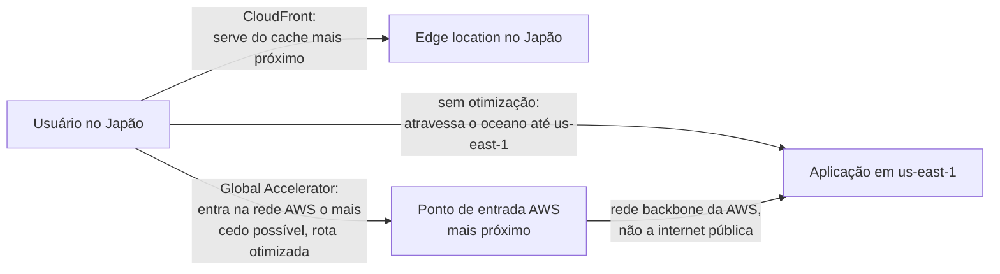
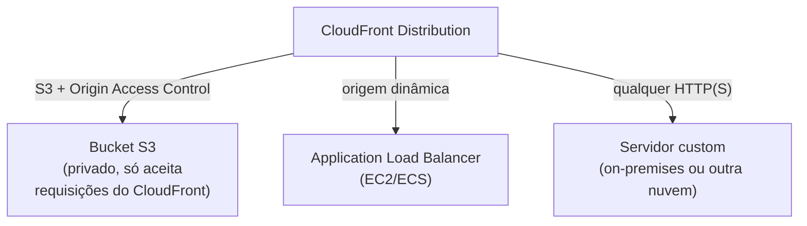
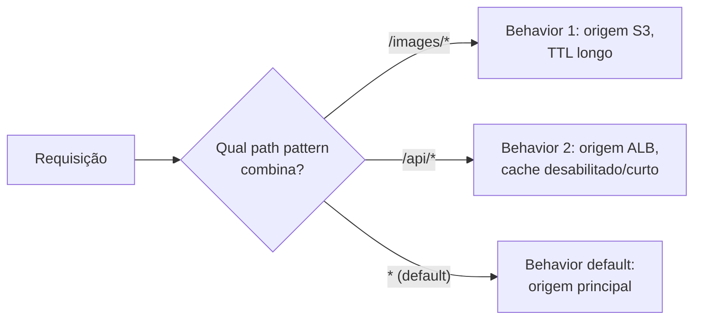
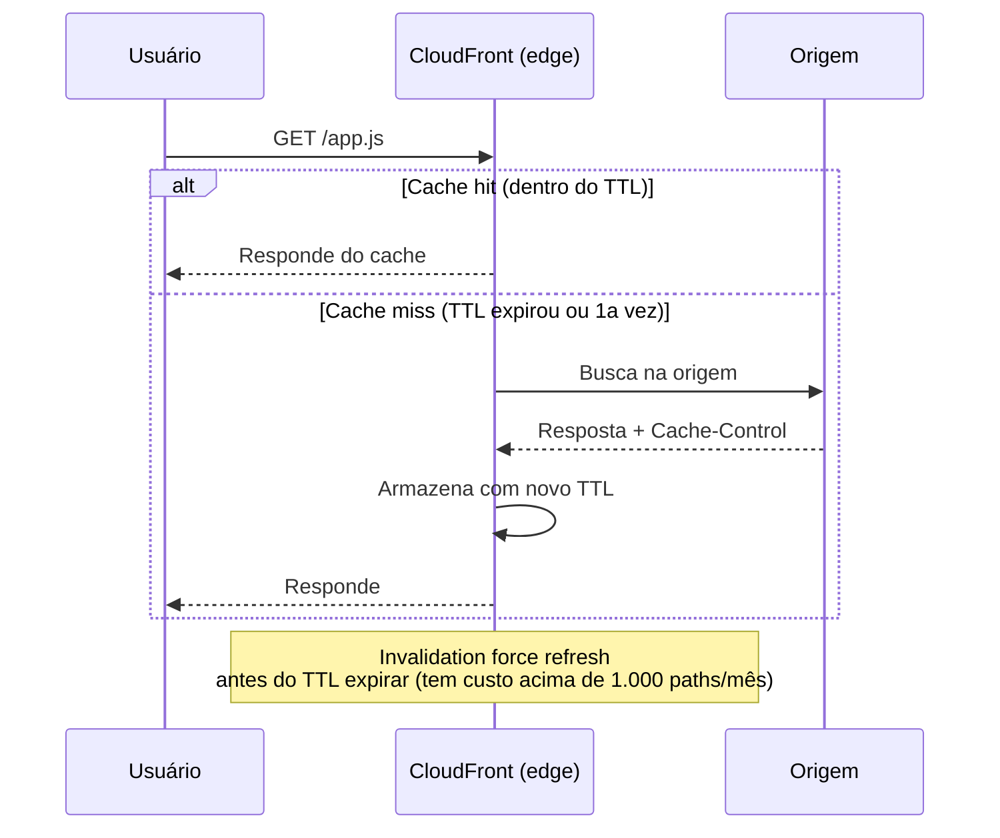
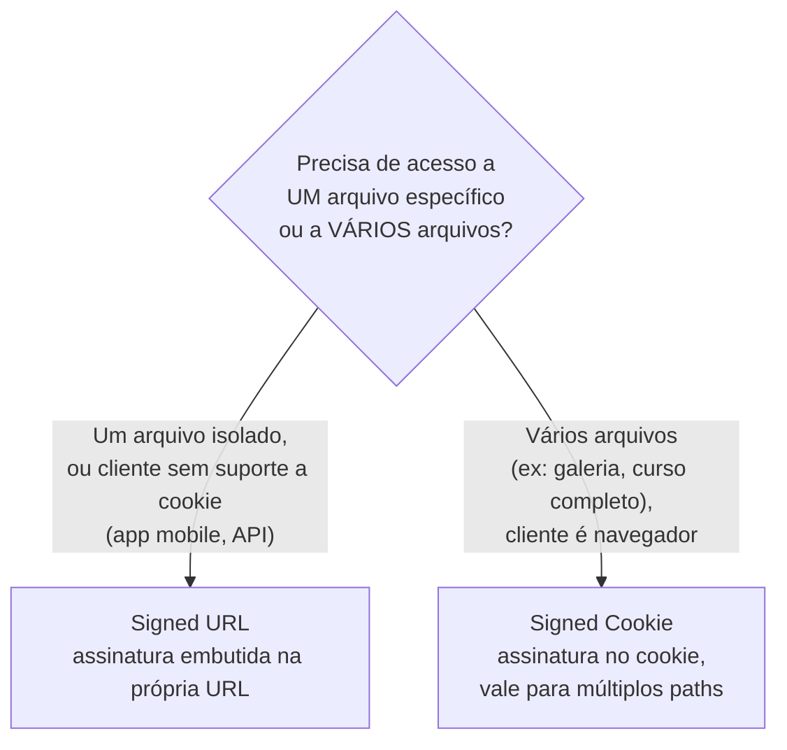
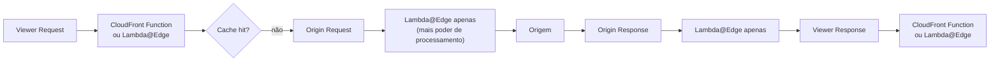
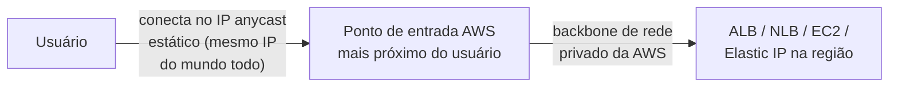
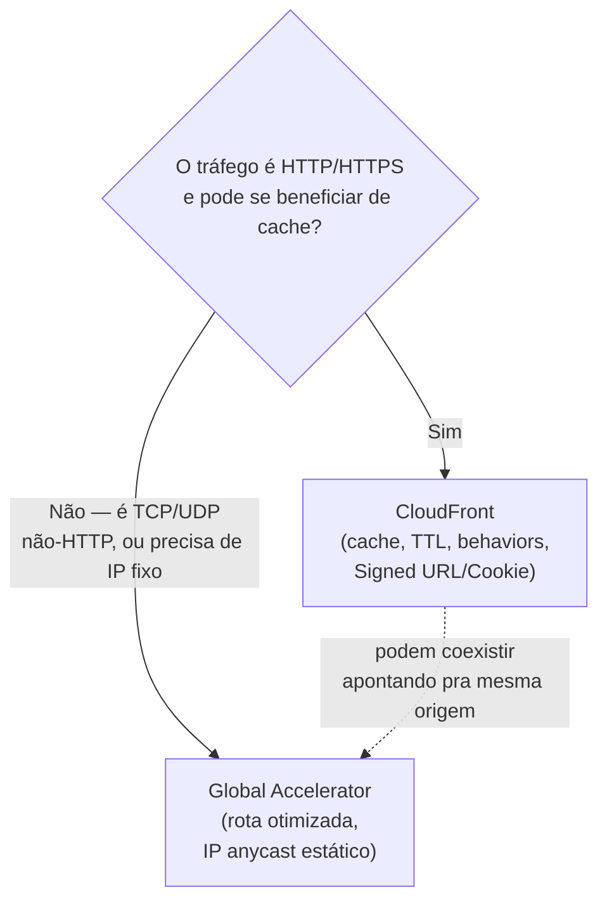
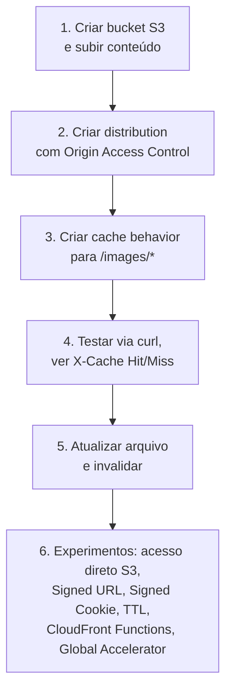

# CloudFront e Global Accelerator — Guia Completo (Teoria + Prática + Dia a Dia)

## 0. O problema de distância física na internet

Antes de entrar nos detalhes, vale entender o problema que ambos os serviços resolvem, cada um à sua maneira: **latência causada pela distância física** entre o usuário e onde sua aplicação/dados realmente estão.

Se sua aplicação roda inteira em `us-east-1` (Norte da Virgínia) e um usuário acessa do Japão, cada requisição precisa atravessar o oceano — isso custa dezenas ou centenas de milissegundos, não importa o quão rápido seu backend processe a requisição. Existem duas estratégias complementares para atacar isso:

1. **Cachear o conteúdo mais perto do usuário**, para que a requisição nem precise viajar até a origem na maioria das vezes — isso é o **CloudFront**.
2. **Otimizar a rota de rede** entre o usuário e sua aplicação (mesmo quando o conteúdo não pode ser cacheado, como tráfego dinâmico ou não-HTTP) — isso é o **Global Accelerator**.


*Duas estratégias diferentes para o mesmo problema de distância: cache (CloudFront) vs otimização de rota de rede (Global Accelerator).*

---

## 1. CloudFront — a CDN da AWS

CloudFront é uma **rede de distribuição de conteúdo (CDN)** com centenas de **edge locations** (pontos de presença) espalhados pelo mundo. Ele guarda cópias do seu conteúdo (arquivos estáticos, mas também respostas de API dinâmicas configuráveis) nesses pontos, de forma que a requisição do usuário seja respondida pelo ponto mais próximo dele, sem precisar viajar até a origem toda vez.

### Origins — de onde o conteúdo vem

Uma **distribution** do CloudFront aponta para uma ou mais **origins**, que são de onde o conteúdo "de verdade" vem quando não está em cache:

**S3 com Origin Access Control (OAC):** o padrão atual recomendado para servir conteúdo estático (site, imagens, vídeos) de um bucket S3. O OAC garante que o bucket S3 **só aceite requisições vindas do CloudFront**, e não diretamente da internet — mesmo que alguém descubra a URL direta do S3, o acesso é bloqueado pela bucket policy, que só libera para o serviço CloudFront com a distribution específica assinada. Isso evita o cenário comum de "esqueci o bucket público e vazou dado".

**Detalhe técnico importante:** o OAC substitui o mecanismo mais antigo chamado **OAI (Origin Access Identity)**. O OAI ainda funciona (compatibilidade retroativa) mas é considerado legado — o OAC suporta mais casos (ex: SSE-KMS no bucket, todos os métodos HTTP) e é o que a AWS recomenda para qualquer distribution nova. Se você ver "OAI" numa questão de prova mais antiga, é o antecessor do OAC.

**ALB (Application Load Balancer):** usado quando a origem é uma aplicação dinâmica rodando em EC2/ECS atrás de um ALB — CloudFront pode cachear seletivamente as respostas (ex: assets estáticos servidos pela mesma aplicação) e passar direto o tráfego dinâmico.

**Servidor custom (qualquer origem HTTP):** CloudFront também aceita qualquer endpoint HTTP/HTTPS como origem — incluindo um servidor on-premises ou de outro provedor de nuvem. Isso é útil para acelerar/proteger uma aplicação que nem está hospedada na AWS.


*As três origens mais comuns de uma distribution CloudFront.*

### Cache Behaviors — roteamento por path pattern

Uma distribution não precisa tratar todo o tráfego da mesma forma. Você define **cache behaviors** por **path pattern** (ex: `/images/*`, `/api/*`, padrão default `*`), e cada behavior pode apontar para uma origem diferente, com uma política de cache diferente.

**Exemplo real:** `/images/*` e `/static/*` apontam para o bucket S3 (cacheados agressivamente, TTL longo, pois assets estáticos raramente mudam), enquanto `/api/*` aponta para o ALB (cache desabilitado ou TTL bem curto, pois é conteúdo dinâmico). Tudo isso numa única distribution, um único domínio (`www.suaempresa.com`), evitando problemas de CORS entre subdomínios diferentes.


*Cache behaviors roteiam por path pattern, permitindo múltiplas origens numa única distribution.*

### TTL e invalidação

O **TTL (Time To Live)** controla por quanto tempo o CloudFront serve uma resposta do cache antes de checar a origem de novo. Você pode configurar `Minimum TTL`, `Default TTL` e `Maximum TTL`, e a origem pode influenciar isso via headers `Cache-Control`/`Expires` (dependendo da política de cache escolhida).

**Invalidação:** quando você precisa forçar o CloudFront a buscar conteúdo novo antes do TTL expirar (ex: publicou uma correção urgente), você cria uma **invalidation** especificando os paths a limpar (`/index.html`, ou `/*` para tudo). **Detalhe de custo:** as primeiras 1.000 invalidações de path por mês não têm custo adicional; acima disso, cada path invalidado é cobrado — invalidar `/*` repetidamente em produção é um anti-padrão caro. A alternativa recomendada no dia a dia é **versionar os nomes dos arquivos** (ex: `app.v2.js` em vez de `app.js`) para nunca precisar invalidar — o arquivo antigo simplesmente para de ser referenciado.

**No dia a dia:** pipelines de deploy de frontend frequentemente combinam as duas estratégias — arquivos com hash no nome (que nunca precisam de invalidação) para JS/CSS/imagens, e uma invalidação pontual só do `index.html` (que referencia os hashes novos) a cada deploy.


*Fluxo de cache hit/miss e onde a invalidação entra para forçar atualização antecipada.*

---

## 2. Signed URLs vs Signed Cookies — controlando acesso a conteúdo privado

**O problema:** você quer distribuir conteúdo privado via CloudFront (ex: vídeos de um curso pago, PDFs licenciados) — só usuários autorizados e autenticados devem conseguir acessar, e só por um tempo limitado.

Ambos os mecanismos usam o mesmo princípio: uma política assinada digitalmente (usando um par de chaves de um **CloudFront Key Group** ou de uma conta trusted signer) que define quais recursos, até quando, e sob quais condições (ex: restrição de IP) o acesso é válido. O CloudFront valida a assinatura antes de servir o conteúdo.

**Signed URL:** a autorização vai embutida na própria URL (query string com assinatura, expiração, etc). Cada URL dá acesso a **um único arquivo** (ou um padrão bem específico definido na política).

**Quando usar:** quando você precisa dar acesso a **arquivos individuais isolados** — ex: um link de download único para um PDF específico, sem precisar dar acesso a mais nada do site. Também é a única opção se o cliente que vai acessar **não é um navegador que mantém cookies** (ex: um app mobile nativo, um player de vídeo standalone, uma chamada de API feita por outro backend).

**Signed Cookie:** a autorização vai num cookie, setado uma vez após o login/autorização do usuário. Enquanto o cookie for válido, o usuário pode acessar **múltiplos arquivos** que casem com o path definido na política — sem precisar gerar uma URL assinada para cada arquivo individualmente.

**Quando usar:** quando você quer dar acesso a **um conjunto inteiro de arquivos** (ex: todos os vídeos de um curso, todas as imagens de uma galeria privada) sem reescrever cada ``/`<video src>` da página com uma URL assinada diferente — o navegador simplesmente manda o cookie em toda requisição subsequente para aquele domínio, de forma transparente pro frontend.


*Signed URL para acesso pontual a um recurso ou clientes sem cookie; Signed Cookie para acesso amplo via navegador.*

**Detalhe técnico importante:** em ambos os casos, o CloudFront não sabe "quem é o usuário" no sentido de autenticação de aplicação — ele só valida se a assinatura criptográfica é válida e se a política (expiração, IP, recurso) é respeitada. A lógica de "esse usuário pode ver esse conteúdo" fica no seu backend, que é quem decide gerar (ou não) a Signed URL/Cookie para aquele usuário.

**Pegadinha clássica de prova:** confundir Signed URL/Cookie do CloudFront com Signed URL do S3 (`aws s3 presign`). São mecanismos parecidos conceitualmente, mas separados — a Signed URL do S3 dá acesso direto ao objeto no S3 (sem passar pelo CloudFront), enquanto a do CloudFront controla acesso à distribution. Se você tem OAC configurado (bucket privado, só acessível via CloudFront), uma presigned URL do S3 direto no bucket normalmente não funciona/não deve ser o caminho usado.

---

## 3. Lambda@Edge vs CloudFront Functions

O CloudFront permite executar código customizado nas edge locations para modificar requisições/respostas em trânsito (ex: reescrever headers, redirecionar, personalizar conteúdo por região). Existem dois mecanismos para isso — **Lambda@Edge** e **CloudFront Functions** — com diferenças relevantes de runtime, latência, custo e pontos de execução no ciclo de vida da requisição.

Este arquivo não repete o detalhamento completo desses dois mecanismos — a comparação completa (linguagens suportadas, limites de execução, os 4 pontos do ciclo de vida onde cada um pode atuar, custo relativo) está no arquivo **`09-Lambda-e-Serverless.md`**, já que ambos são, na essência, variações do modelo de execução serverless da Lambda aplicadas à borda da rede. Vale só reforçar aqui a regra prática de escolha: **CloudFront Functions** para lógica leve e de altíssima performance (reescrita simples de header, redirecionamento, manipulação de cache key) executada em **viewer request/response**; **Lambda@Edge** quando você precisa de mais poder computacional, mais tempo de execução, acesso a bibliotecas externas, ou precisa atuar também em **origin request/response** (ex: chamar outro serviço antes de bater na origem).


*Os 4 pontos do ciclo de vida da requisição no CloudFront — CloudFront Functions só atua nos dois pontos "viewer"; detalhe completo em `09-Lambda-e-Serverless.md`.*

---

## 4. AWS Global Accelerator

Diferente do CloudFront, o Global Accelerator **não faz cache de conteúdo nenhum**. Ele resolve um problema diferente: otimizar a **rota de rede** entre o usuário e sua aplicação, e fornecer **endereços IP estáticos e anycast** como ponto de entrada fixo.

### Como funciona

Você recebe **dois endereços IP estáticos anycast** (o mesmo IP é anunciado a partir de múltiplas localizações da AWS ao redor do mundo — "anycast" significa que o roteamento de internet naturalmente leva o usuário ao ponto mais próximo geograficamente, sem qualquer configuração de DNS especial do seu lado). Assim que o tráfego entra na rede AWS (o mais cedo possível, geralmente no ponto mais próximo do usuário), ele percorre o **backbone de rede privado da AWS** até o seu recurso de destino (ALB, NLB, instância EC2, Elastic IP), em vez de trafegar pela internet pública o caminho todo. A rede backbone da AWS é mais estável e previsível que a internet pública, reduzindo jitter e variação de latência.

**Diferente do CloudFront, que otimiza a entrega fazendo cache de conteúdo perto do usuário (funciona muito bem para HTTP/HTTPS), o Global Accelerator otimiza a rota de rede em si — funciona para qualquer protocolo TCP/UDP, não só HTTP.**


*O tráfego entra na rede AWS o mais cedo possível e percorre o backbone privado, não a internet pública, até a aplicação.*

### Quando o Global Accelerator é a escolha certa

- **Tráfego não-HTTP:** protocolos como gaming (UDP), VoIP, IoT, ou qualquer aplicação TCP/UDP customizada que não seja HTTP/HTTPS — CloudFront não serve esses casos porque é uma CDN de conteúdo web.
- **Necessidade de IP estático fixo:** se seus clientes precisam de whitelist de IP fixo (ex: parceiros B2B que só liberam firewall para IPs específicos), o Global Accelerator resolve isso nativamente. O CloudFront não oferece IP fixo previsível da mesma forma (os IPs dos edges podem variar).
- **Failover rápido entre regiões:** o Global Accelerator monitora a saúde dos endpoints e redireciona o tráfego automaticamente para uma região saudável em caso de falha, mantendo o mesmo IP de entrada — útil para arquiteturas multi-região ativo/ativo ou ativo/passivo, sem depender de propagação de DNS (que tem atraso por causa de TTL/cache de resolvers).
- **Aplicações sensíveis a variação de latência (jitter):** por rodar majoritariamente na rede backbone da AWS em vez da internet pública, tende a ter latência mais previsível.

**No dia a dia:** casos de uso comuns são jogos multiplayer (UDP), aplicações de voz/vídeo em tempo real, arquiteturas multi-região que exigem failover rápido com IP fixo, e integrações B2B que exigem whitelist de IP.

---

## 5. CloudFront vs Global Accelerator — comparação e uso conjunto

| Critério | CloudFront | Global Accelerator |
|---|---|---|
| **Faz cache de conteúdo** | Sim — essa é a função principal | Não — apenas otimiza a rota de rede |
| **Camada de atuação** | Camada de aplicação (HTTP/HTTPS), com regras de cache/behavior | Camada de rede (TCP/UDP), sem entender o conteúdo |
| **Protocolos suportados** | HTTP/HTTPS (e WebSocket sobre HTTP) | Qualquer TCP/UDP — inclui HTTP mas não se limita a ele |
| **IP estático fixo** | Não é a proposta — os IPs de edge podem variar | Sim — dois IPs anycast estáticos garantidos |
| **Reduz carga na origem** | Sim, fortemente (respostas cacheadas nunca chegam à origem) | Não reduz carga — todo tráfego ainda chega à origem, só chega mais rápido |
| **Failover entre regiões** | Possível via origem com failover configurado, mas não é o foco | Ponto forte — failover de saúde rápido, mesmo IP mantido |
| **Melhor para** | Sites, APIs, streaming de vídeo, distribuição de conteúdo estático/dinâmico | Gaming, VoIP, IoT, IPs fixos para whitelist, multi-região com failover rápido |

**Podem ser usados juntos?** Sim — não são mutuamente exclusivos, e resolvem problemas diferentes. Um cenário real comum: uma aplicação com tráfego HTTP (se beneficia de CloudFront para cache/CDN) e também tráfego de outro protocolo (ex: um componente de gaming em UDP, que precisa do Global Accelerator). Nesse caso, você usaria CloudFront para a parte web e Global Accelerator para a parte de rede não-HTTP, apontando ambos para a mesma infraestrutura de origem quando fizer sentido.


*Árvore de decisão simplificada — e lembrete de que os dois serviços podem coexistir na mesma arquitetura.*

---

## 6. Conectando aos 4 domínios da prova

- **Segurança:** CloudFront com OAC protege buckets S3 de acesso direto; Signed URL/Cookie controla acesso granular a conteúdo privado; CloudFront integra nativamente com **AWS WAF** para proteção na borda (bloqueando ataques antes de chegarem à origem); Global Accelerator também suporta integração com Shield para proteção DDoS na borda.
- **Resiliência:** Global Accelerator com failover automático entre regiões mantendo IP fixo; CloudFront com múltiplas origens e failover de origem reduz impacto de falha regional; ambos reduzem a superfície de exposição direta da origem à internet.
- **Performance:** é o tema central deste arquivo — CloudFront via cache na borda, Global Accelerator via otimização de rota de rede no backbone AWS.
- **Custo:** CloudFront reduz custo de transferência de dados da origem (menos requisições chegam até ela) e pode reduzir custo de infraestrutura de origem (menos carga = menos necessidade de escalar); invalidações em excesso geram custo evitável; Global Accelerator tem custo fixo por hora mais custo por tráfego processado, adicional ao custo normal de transferência de dados.

---

# 🧪 Laboratório prático (para executar na AWS)

## Objetivo
Criar uma distribution CloudFront servindo um bucket S3 privado via Origin Access Control, com cache behavior customizado, e testar invalidação.

### Passo 1 — Criar o bucket S3 e subir conteúdo
```bash
aws s3 mb s3://meu-site-privado-lab
aws s3 cp index.html s3://meu-site-privado-lab/index.html
aws s3 cp logo.png s3://meu-site-privado-lab/images/logo.png
```
Deixe o bucket **totalmente privado** (bloqueio de acesso público habilitado) — o acesso só vai acontecer via CloudFront.

### Passo 2 — Criar a distribution CloudFront
Console → CloudFront → **Create Distribution**
- Origin domain: selecione o bucket `meu-site-privado-lab`
- Origin access: **Origin access control settings (recommended)** → criar um novo OAC
- A AWS vai gerar a bucket policy necessária — copie e aplique no bucket (ou deixe o console aplicar automaticamente)
- Default cache behavior: Viewer protocol policy = **Redirect HTTP to HTTPS**

### Passo 3 — Adicionar um cache behavior por path
Na distribution criada → **Behaviors → Create behavior**
- Path pattern: `/images/*`
- TTL: mínimo/padrão/máximo bem maiores que o comportamento default (ex: 1 dia)

### Passo 4 — Testar
```bash
curl -I https://{distribution-id}.cloudfront.net/index.html
curl -I https://{distribution-id}.cloudfront.net/images/logo.png
```
Verifique o header `X-Cache: Miss from cloudfront` na primeira chamada e `Hit from cloudfront` nas seguintes.

### Passo 5 — Testar invalidação
```bash
aws s3 cp index-v2.html s3://meu-site-privado-lab/index.html
aws cloudfront create-invalidation --distribution-id {distribution-id} --paths "/index.html"
```

### Passo 6 — Experimentos para fixar cada conceito
1. **Tentativa de acesso direto ao S3:** tente acessar a URL do S3 diretamente (`https://meu-site-privado-lab.s3.amazonaws.com/index.html`) e confirme que recebe `403 Forbidden` — só o CloudFront tem acesso, graças ao OAC.
2. **Signed URL:** crie um CloudFront Key Group, gere uma Signed URL com expiração de 5 minutos para um arquivo privado, teste o acesso, espere expirar e teste de novo (deve falhar).
3. **Signed Cookie:** configure uma política de Signed Cookie para o path `/videos/*`, simule a geração do cookie via um pequeno backend, e observe múltiplos arquivos sendo liberados com o mesmo cookie.
4. **TTL vs invalidação:** suba um novo arquivo sem invalidar e observe que o conteúdo antigo continua sendo servido até o TTL expirar — depois compare com o uso de invalidação explícita.
5. **CloudFront Functions:** crie uma função simples de viewer request que adiciona um header customizado, associe ao behavior default, e confirme o header na resposta.
6. **Global Accelerator (opcional, custo adicional):** crie um accelerator apontando para um ALB existente, anote os dois IPs estáticos, e compare a latência de acesso via esses IPs vs o DNS direto do ALB de uma região distante.


*Sequência dos passos do laboratório prático.*

---

## Comandos AWS CLI úteis

```bash
# Criar uma distribution CloudFront (via arquivo de configuração JSON)
aws cloudfront create-distribution --distribution-config file://distribution-config.json

# Listar distributions
aws cloudfront list-distributions

# Criar uma invalidação
aws cloudfront create-invalidation --distribution-id EDFDVBD6EXAMPLE --paths "/index.html" "/images/*"

# Ver status de uma invalidação
aws cloudfront get-invalidation --distribution-id EDFDVBD6EXAMPLE --id IDFDVBD6EXAMPLE

# Gerar chave para Signed URL/Cookie (par de chaves para o Key Group) — feito fora da CLI AWS,
# normalmente com openssl, e a chave pública é importada:
aws cloudfront create-public-key --public-key-config file://public-key-config.json
aws cloudfront create-key-group --key-group-config file://key-group-config.json

# Criar um Global Accelerator
aws globalaccelerator create-accelerator --name meu-accelerator --ip-address-type IPV4

# Adicionar um listener e endpoint group ao accelerator
aws globalaccelerator create-listener --accelerator-arn {arn} --protocol TCP --port-ranges FromPort=80,ToPort=80
aws globalaccelerator create-endpoint-group --listener-arn {listener-arn} --endpoint-group-region us-east-1 \
  --endpoint-configurations EndpointId={alb-arn},Weight=100
```

---

## Tabela de decisão rápida (prova + dia a dia)

| Cenário | Resposta provável |
|---|---|
| Distribuir conteúdo estático globalmente com baixa latência | CloudFront |
| Bucket S3 acessível só via CDN, nunca diretamente | CloudFront com Origin Access Control |
| Link de download único para um arquivo específico | Signed URL |
| Acesso a múltiplos arquivos/curso completo via navegador autenticado | Signed Cookie |
| Lógica leve e rápida na borda (redirect, reescrever header) | CloudFront Functions |
| Lógica mais pesada na borda, ou atuar em origin request/response | Lambda@Edge |
| Aplicação de jogo/voz/IoT usando UDP/TCP não-HTTP | Global Accelerator |
| Precisa de IP estático fixo para whitelist de parceiro | Global Accelerator |
| Failover rápido entre regiões mantendo o mesmo IP de entrada | Global Accelerator |
| Reduzir carga na origem cacheando respostas repetidas | CloudFront |
| Cenário com HTTP (cache) e UDP (jogo) na mesma arquitetura | Usar CloudFront e Global Accelerator juntos |
