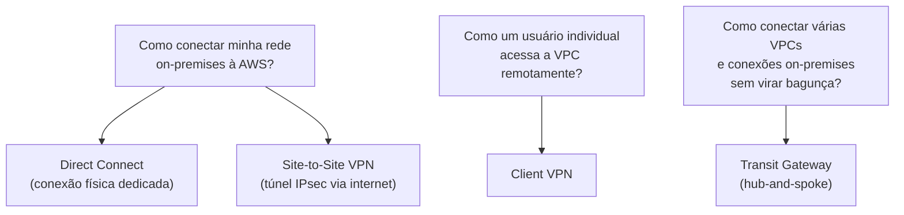
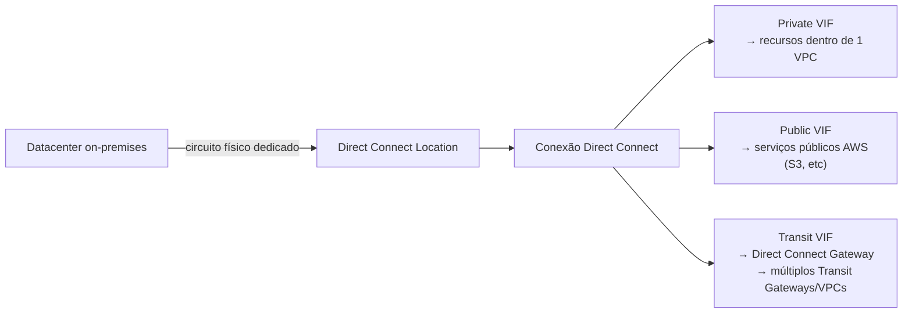
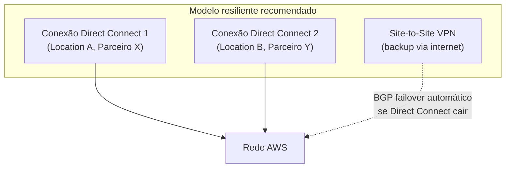
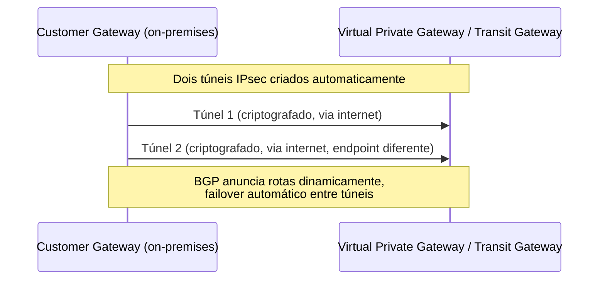
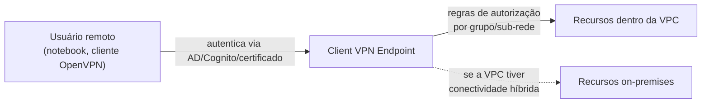
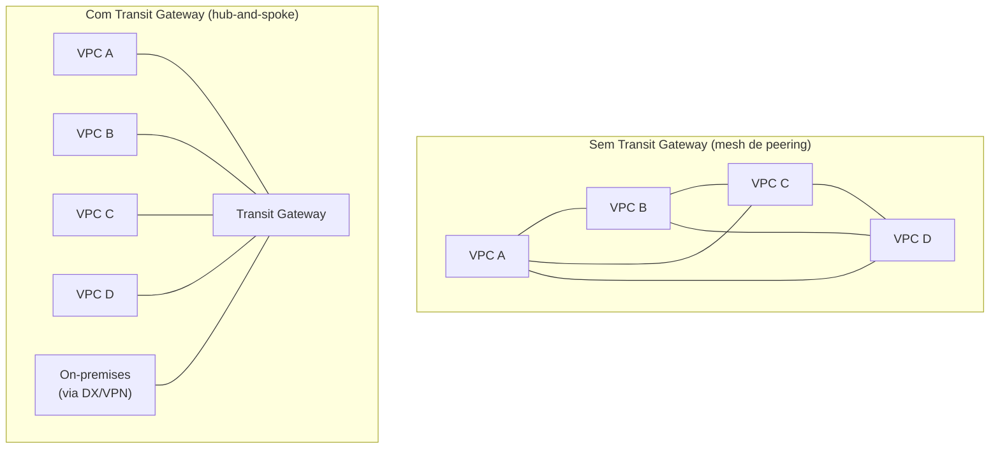
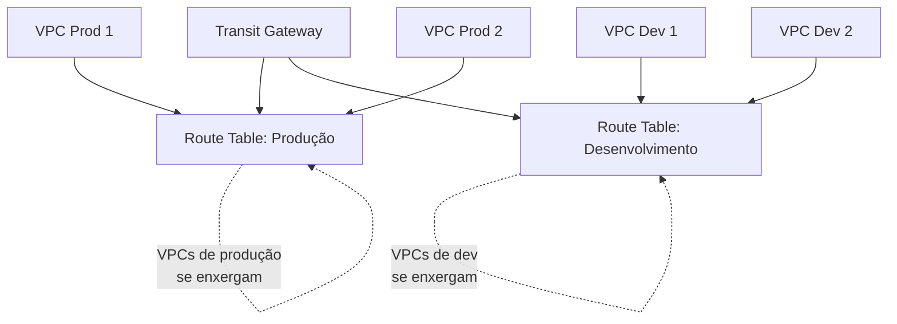
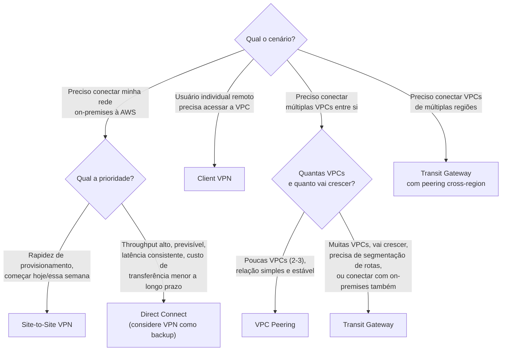
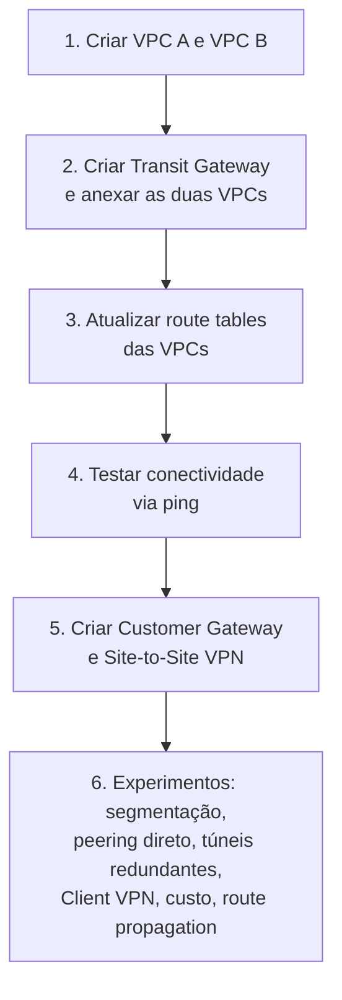

# Direct Connect, VPN e Transit Gateway — Guia Completo (Teoria + Prática + Dia a Dia)

## 0. O problema de conectar redes diferentes

A maioria das empresas não migra 100% da infraestrutura para a nuvem de uma vez — existe um período (às vezes permanente, num modelo híbrido) em que parte dos sistemas continua **on-premises** (datacenter próprio) enquanto outra parte já está na AWS. Além disso, mesmo dentro da AWS, é comum ter **múltiplas VPCs** (por ambiente, por time, por aplicação) que precisam se comunicar entre si.

Isso gera duas perguntas centrais:
1. **Como conectar minha rede on-premises à AWS** de forma segura e com performance adequada?
2. **Como conectar múltiplas VPCs entre si (e com on-premises)** sem que isso vire uma bagunça de conexões ponto-a-ponto?

Este arquivo cobre os quatro serviços que respondem essas perguntas: **Direct Connect** e **Site-to-Site VPN** (conexão com on-premises), **Client VPN** (acesso remoto individual), e **Transit Gateway** (hub para conectar tudo isso, incluindo múltiplas VPCs, de forma escalável).


*Os quatro problemas de conectividade cobertos neste arquivo e o serviço que resolve cada um.*

---

## 1. AWS Direct Connect

### O que é e por que existe

O Direct Connect é uma **conexão de rede física dedicada** entre o seu datacenter (ou um ponto de colocation) e a AWS, que **não passa pela internet pública**. Fisicamente, você (ou um parceiro autorizado da AWS) contrata um circuito de fibra até um **AWS Direct Connect location** (um datacenter de parceiro onde a AWS tem presença), e de lá até a rede da AWS.

**Por que isso importa:** a internet pública é, por natureza, imprevisível — a rota que seu pacote toma pode mudar, a latência varia, e não há garantia de banda. Para empresas com necessidade de **throughput alto, consistente e previsível** (ex: replicação de banco de dados grande, backup contínuo, aplicações sensíveis a latência), isso é um problema real. O Direct Connect resolve isso oferecendo uma conexão **dedicada, com banda garantida e latência mais previsível**, além de reduzir custo de transferência de dados (o preço de data transfer via Direct Connect tende a ser mais barato que via internet).

**Detalhe técnico importante:** o tráfego via Direct Connect não é criptografado por padrão (diferente da VPN) — porque é um circuito físico dedicado, não a internet pública, muita gente considera isso "seguro o suficiente" por natureza. Se você precisa de criptografia mesmo assim (ex: exigência de compliance), pode rodar uma VPN **por cima** do Direct Connect (chamado de **VPN over Direct Connect**, usando uma Public VIF), combinando a performance do circuito dedicado com criptografia.

### Virtual Interfaces (VIF)

Uma conexão física de Direct Connect por si só não tem tráfego — você precisa criar uma ou mais **Virtual Interfaces (VIF)** sobre ela, que são interfaces lógicas (usando VLANs 802.1Q) definindo o que aquele circuito acessa:

**Private VIF:** conecta a recursos **dentro de uma VPC** (via um Virtual Private Gateway ou um Direct Connect Gateway) — usada para acessar recursos privados como instâncias EC2, bancos RDS, etc, usando endereços IP privados.

**Public VIF:** conecta a **serviços públicos da AWS** (S3, DynamoDB, endpoints públicos de qualquer serviço) usando os IPs públicos desses serviços, mas ainda trafegando pelo circuito dedicado em vez da internet pública. Útil quando você quer, por exemplo, acessar um bucket S3 público sem esse tráfego competir com sua internet corporativa normal.

**Transit VIF:** conecta a um **Direct Connect Gateway** que por sua vez se conecta a um ou mais **Transit Gateways** — usada quando você precisa alcançar múltiplas VPCs organizadas atrás de um Transit Gateway (ver seção 4).


*Uma conexão física pode ter múltiplas VIFs, cada uma dando acesso a um tipo diferente de destino.*

### Direct Connect Gateway

Resolve o problema de "eu tenho uma conexão Direct Connect em uma região, mas preciso acessar VPCs em **múltiplas regiões e múltiplas contas**". Sem ele, uma Private VIF só alcançaria uma VPC por vez (via Virtual Private Gateway). O Direct Connect Gateway atua como um "roteador global" que permite associar a mesma conexão física a múltiplas VPCs, inclusive em regiões diferentes (exceto China), sem precisar de circuitos físicos separados para cada uma.

### Resiliência

Uma única conexão Direct Connect é um **ponto único de falha** — se o circuito cair (manutenção, corte de fibra, problema no location), você perde a conectividade dedicada. Para evitar isso, a AWS recomenda modelos de resiliência com **múltiplas conexões**, idealmente:
- Em **Direct Connect locations diferentes** (não só conexões redundantes no mesmo local físico, que ainda compartilham o mesmo ponto de falha do prédio/local).
- Contratadas com **parceiros diferentes**, quando o requisito de resiliência é máximo (evita depender de um único parceiro de última milha).

**No dia a dia:** é comum ver arquiteturas com **Direct Connect como caminho principal + Site-to-Site VPN como backup automático** — se o Direct Connect cair, o roteamento (via BGP, que ambos usam) falha automaticamente para o túnel VPN, mantendo conectividade (com throughput/latência pior, mas sem ficar totalmente offline).


*Resiliência real combina múltiplas conexões físicas em locations/parceiros diferentes, com VPN como camada de backup adicional.*

---

## 2. Site-to-Site VPN

O Site-to-Site VPN cria **túneis IPsec criptografados sobre a internet pública** conectando seu datacenter (via um **Customer Gateway**, que representa seu roteador/firewall on-premises) a uma VPC (via um **Virtual Private Gateway** ou, mais moderno, um **Transit Gateway**).

**Vantagem principal sobre Direct Connect: velocidade de provisionamento.** Um Direct Connect pode levar semanas a meses para ser fisicamente instalado (depende de infraestrutura de telecom real). Um Site-to-Site VPN pode ser criado em **minutos**, porque roda inteiramente sobre a internet já existente — não exige nenhuma instalação física nova.

**No dia a dia**, Site-to-Site VPN é usado em dois cenários principais:
1. **Backup de um Direct Connect** — conforme mencionado na seção anterior, garantindo continuidade se o circuito dedicado falhar.
2. **Standalone, para começar rápido** — quando a empresa precisa de conectividade híbrida imediatamente (ex: um projeto começando essa semana) e não pode esperar o Direct Connect ser instalado. É comum uma empresa começar com VPN e, meses depois, migrar para Direct Connect (ou adicionar Direct Connect mantendo a VPN como backup) quando o volume de tráfego justificar o investimento.

**Trade-off real:** por rodar sobre a internet pública, o Site-to-Site VPN tem **throughput limitado por túnel** (bem menor que um circuito Direct Connect) e **latência menos previsível** (sujeita às mesmas variações da internet pública). Para alta disponibilidade, cada conexão VPN provisiona automaticamente **dois túneis** (em dois endpoints diferentes do lado da AWS), e você deve configurar seu Customer Gateway para usar ambos.


*Cada conexão Site-to-Site VPN provisiona dois túneis redundantes para alta disponibilidade.*

---

## 3. Client VPN

Diferente do Site-to-Site VPN (que conecta **redes inteiras** entre si), o **AWS Client VPN** resolve o problema de dar a um **usuário individual** (um funcionário remoto, por exemplo, no notebook dele) acesso à rede da VPC (e, por extensão, a recursos on-premises se a VPC tiver conectividade híbrida configurada), como se ele estivesse fisicamente dentro da rede corporativa.

É um serviço **gerenciado, elástico** (escala conforme o número de conexões simultâneas) baseado em **OpenVPN**. O usuário instala um cliente VPN no dispositivo dele, autentica (via Active Directory, Cognito, ou certificados mútuos), e recebe um IP dentro de um range configurado para a VPN, com acesso às redes que você autorizar via **regras de autorização** (não é tudo-ou-nada — você controla exatamente quais sub-redes/recursos cada grupo de usuários pode alcançar).

**No dia a dia:** típico para o cenário de "trabalho remoto com acesso a sistemas internos" — substitui soluções tradicionais de VPN client corporativa (Cisco AnyConnect e similares) por uma opção nativa da AWS, elástica, sem precisar manter servidores VPN próprios.


*Client VPN dá acesso individual e controlado à rede da VPC, diferente do Site-to-Site VPN que conecta redes inteiras.*

---

## 4. AWS Transit Gateway

### O problema: VPC Peering não é transitivo

O **VPC Peering** conecta duas VPCs diretamente, mas tem uma limitação estrutural importante: **não é transitivo**. Se a VPC A está peered com a VPC B, e a VPC B está peered com a VPC C, isso **não** significa que A consegue alcançar C através de B — você precisaria criar um peering direto entre A e C também.

Em uma arquitetura com poucas VPCs isso é gerenciável. Mas conforme o número de VPCs cresce (o que é comum — times diferentes, ambientes diferentes, produtos diferentes, cada um com sua VPC), o número de conexões de peering necessárias cresce de forma **combinatória** (para N VPCs totalmente conectadas, você precisaria de N×(N-1)/2 conexões de peering) — isso vira uma "malha" (mesh) difícil de gerenciar, com rotas espalhadas em dezenas de route tables.

### A solução: hub-and-spoke

O **Transit Gateway** resolve isso atuando como um **hub central** — cada VPC (e cada conexão on-premises via Direct Connect/VPN) se conecta **uma vez** ao Transit Gateway, e o Transit Gateway cuida do roteamento entre todos eles. Isso transforma o modelo de "malha" (mesh, N×N conexões) em "estrela" (hub-and-spoke, N conexões).


*O mesh de peering cresce combinatoriamente; o Transit Gateway simplifica para uma conexão por VPC/rede.*

### Route Tables do Transit Gateway

O Transit Gateway tem suas próprias **route tables**, separadas das route tables normais de VPC/subnet. Isso permite um controle fino: você pode ter, por exemplo, uma route table que permite que VPCs de "produção" se comuniquem entre si mas **não** com VPCs de "desenvolvimento" — mesmo todas estando conectadas ao mesmo Transit Gateway. Cada anexo (attachment) de VPC/VPN/Direct Connect é associado a uma route table específica, e você controla quais rotas são propagadas para onde.

**No dia a dia, esse controle é usado para:**
- **Segmentação por ambiente** (produção isolada de desenvolvimento, mesmo compartilhando o mesmo Transit Gateway).
- **Segmentação por unidade de negócio/conta**, em arquiteturas multi-conta com AWS Organizations.
- **Isolar uma VPC compartilhada** (ex: uma VPC só com serviços de segurança/inspeção de tráfego) que todas as outras alcançam, mas que não alcançam as outras diretamente.


*Route tables separadas dentro do mesmo Transit Gateway permitem segmentar tráfego mesmo com todos os anexos no mesmo hub.*

### Peering cross-region de Transit Gateways

Você também pode fazer **peering entre Transit Gateways de regiões diferentes** — isso conecta as VPCs anexadas a um Transit Gateway em `us-east-1` com as VPCs anexadas a um Transit Gateway em `eu-west-1`, sem precisar de peering direto VPC-a-VPC entre regiões. O tráfego entre os Transit Gateways trafega pelo backbone privado da AWS (não pela internet pública), com criptografia.

**Detalhe técnico importante:** o peering entre Transit Gateways, assim como o VPC Peering tradicional, **também não é transitivo por padrão** através de mais de um salto — cada peering é uma conexão direta e o roteamento precisa ser explicitamente configurado em cada Transit Gateway envolvido.

---

## 5. Árvore de decisão: VPN vs Direct Connect vs Transit Gateway vs VPC Peering


*Árvore de decisão consolidada para os quatro cenários de conectividade cobertos neste arquivo.*

---

## 6. Conectando aos 4 domínios da prova

- **Segurança:** Site-to-Site VPN e Client VPN criptografam o tráfego nativamente (IPsec/TLS); Direct Connect não é criptografado por padrão (avaliar VPN over Direct Connect se exigido); route tables do Transit Gateway permitem segmentação de rede como controle de segurança; Client VPN integra com autenticação corporativa (AD, Cognito, certificados).
- **Resiliência:** múltiplas conexões Direct Connect em locations/parceiros diferentes evitam ponto único de falha; VPN como backup automático via BGP; Transit Gateway simplifica manutenção de conectividade em arquiteturas com muitas VPCs, reduzindo risco operacional de gerenciar dezenas de peerings manualmente.
- **Performance:** Direct Connect oferece throughput e latência mais previsíveis que VPN via internet pública; Transit Gateway não adiciona cache/otimização em si, mas centraliza e simplifica o roteamento, reduzindo saltos desnecessários.
- **Custo:** VPN tem custo de entrada baixo (cobrança por hora + dados); Direct Connect tem custo de setup mais alto (circuito físico, porta dedicada) mas custo de transferência de dados por GB mais barato em volumes grandes — o breakeven depende do volume de tráfego; Transit Gateway cobra por anexo (attachment) e por dados processados, o que precisa ser considerado quando o número de VPCs conectadas é grande.

---

# 🧪 Laboratório prático (para executar na AWS)

## Objetivo
Simular conectividade híbrida com Site-to-Site VPN (sem custo de circuito físico real de Direct Connect) e conectar duas VPCs via Transit Gateway.

### Passo 1 — Criar duas VPCs
```bash
aws ec2 create-vpc --cidr-block 10.0.0.0/16 --tag-specifications 'ResourceType=vpc,Tags=[{Key=Name,Value=vpc-a}]'
aws ec2 create-vpc --cidr-block 10.1.0.0/16 --tag-specifications 'ResourceType=vpc,Tags=[{Key=Name,Value=vpc-b}]'
```

### Passo 2 — Criar o Transit Gateway e anexar as duas VPCs
```bash
aws ec2 create-transit-gateway --description "tgw-lab"

aws ec2 create-transit-gateway-vpc-attachment --transit-gateway-id {tgw-id} --vpc-id {vpc-a-id} --subnet-ids {subnet-a-id}
aws ec2 create-transit-gateway-vpc-attachment --transit-gateway-id {tgw-id} --vpc-id {vpc-b-id} --subnet-ids {subnet-b-id}
```

### Passo 3 — Atualizar as route tables das VPCs
Em cada VPC, adicione uma rota na route table apontando o CIDR da outra VPC para o Transit Gateway:
```bash
aws ec2 create-route --route-table-id {rtb-vpc-a} --destination-cidr-block 10.1.0.0/16 --transit-gateway-id {tgw-id}
aws ec2 create-route --route-table-id {rtb-vpc-b} --destination-cidr-block 10.0.0.0/16 --transit-gateway-id {tgw-id}
```

### Passo 4 — Testar conectividade
Suba uma instância EC2 em cada VPC (com Security Group liberando ICMP entre os CIDRs) e teste:
```bash
ping 10.1.0.X   # da instância na VPC A para a instância na VPC B
```

### Passo 5 — Criar um Customer Gateway e uma Site-to-Site VPN simulada
```bash
aws ec2 create-customer-gateway --type ipsec.1 --public-ip {seu-ip-publico-simulado} --bgp-asn 65000

aws ec2 create-vpn-gateway --type ipsec.1
aws ec2 attach-vpn-gateway --vpn-gateway-id {vgw-id} --vpc-id {vpc-a-id}

aws ec2 create-vpn-connection --type ipsec.1 --customer-gateway-id {cgw-id} --vpn-gateway-id {vgw-id}
```

### Passo 6 — Experimentos para fixar cada conceito
1. **Segmentação de route table:** crie uma terceira VPC "isolada", anexe ao mesmo Transit Gateway mas numa route table separada, e confirme que ela não alcança as VPCs A/B.
2. **VPC Peering direto vs Transit Gateway:** crie um VPC Peering direto entre A e B (sem Transit Gateway) e compare a complexidade de configuração de rota com o modelo hub-and-spoke.
3. **Túneis redundantes:** inspecione a conexão VPN criada no Passo 5 e observe os dois túneis IPsec provisionados automaticamente com endpoints diferentes.
4. **Client VPN:** crie um Client VPN Endpoint associado à VPC A, gere certificados de cliente, e teste a conexão de um notebook simulando um usuário remoto.
5. **Custo:** use a AWS Pricing Calculator para comparar o custo estimado de Direct Connect (1 Gbps, uso constante) vs Site-to-Site VPN para um volume de tráfego hipotético, e identifique o breakeven.
6. **Route propagation:** desabilite a propagação automática de rotas numa das route tables do Transit Gateway e adicione uma rota estática manualmente, para entender a diferença entre propagação automática e rota estática.


*Sequência dos passos do laboratório prático.*

---

## Comandos AWS CLI úteis

```bash
# Direct Connect: listar conexões existentes
aws directconnect describe-connections

# Direct Connect: criar uma Private VIF
aws directconnect create-private-virtual-interface --connection-id {dxcon-id} --new-private-virtual-interface file://vif-config.json

# Direct Connect Gateway: criar e associar a uma VPC (via Virtual Private Gateway)
aws directconnect create-direct-connect-gateway --direct-connect-gateway-name meu-dxgw
aws directconnect create-direct-connect-gateway-association --direct-connect-gateway-id {dxgw-id} --virtual-gateway-id {vgw-id}

# Site-to-Site VPN
aws ec2 create-customer-gateway --type ipsec.1 --public-ip {ip} --bgp-asn 65000
aws ec2 create-vpn-connection --type ipsec.1 --customer-gateway-id {cgw-id} --transit-gateway-id {tgw-id}
aws ec2 describe-vpn-connections

# Client VPN
aws ec2 create-client-vpn-endpoint --client-cidr-block 10.99.0.0/22 --server-certificate-arn {acm-arn} \
  --authentication-options Type=certificate-authentication,MutualAuthentication={ClientRootCertificateChainArn={acm-arn}} \
  --connection-log-options Enabled=false

# Transit Gateway
aws ec2 create-transit-gateway --description "tgw-producao"
aws ec2 create-transit-gateway-vpc-attachment --transit-gateway-id {tgw-id} --vpc-id {vpc-id} --subnet-ids {subnet-id}
aws ec2 describe-transit-gateway-route-tables
aws ec2 create-transit-gateway-peering-attachment --transit-gateway-id {tgw-id-regiao-1} \
  --peer-transit-gateway-id {tgw-id-regiao-2} --peer-region eu-west-1 --peer-account-id {account-id}
```

---

## Tabela de decisão rápida (prova + dia a dia)

| Cenário | Resposta provável |
|---|---|
| Preciso de conectividade híbrida rápida, essa semana | Site-to-Site VPN |
| Preciso de throughput alto e previsível para on-premises | Direct Connect |
| Quero um backup automático caso o Direct Connect falhe | Site-to-Site VPN sobre o mesmo Customer Gateway/BGP |
| Preciso de criptografia mesmo usando Direct Connect | VPN over Direct Connect (Public VIF) |
| Um funcionário remoto precisa acessar recursos da VPC | Client VPN |
| Poucas VPCs (2-3), relação simples | VPC Peering |
| Muitas VPCs, crescimento esperado, precisa de segmentação | Transit Gateway |
| Conectar VPCs de regiões diferentes de forma escalável | Transit Gateway com peering cross-region |
| Acessar múltiplas VPCs em múltiplas contas/regiões via Direct Connect | Direct Connect Gateway (ou Transit VIF + Transit Gateway) |
| Isolar tráfego de produção do de desenvolvimento no mesmo hub | Route tables separadas no Transit Gateway |
