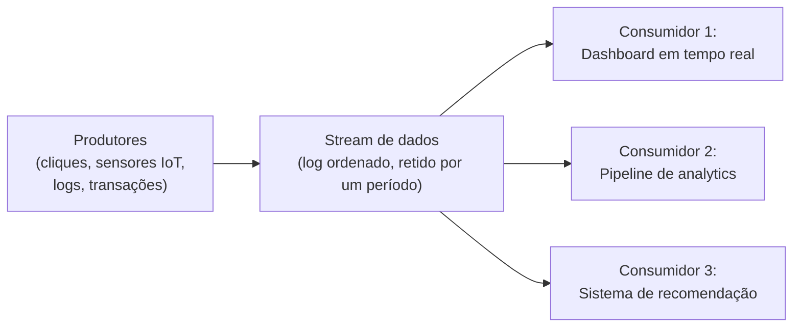
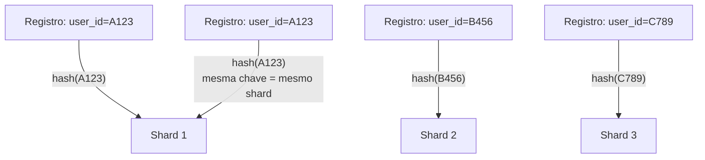
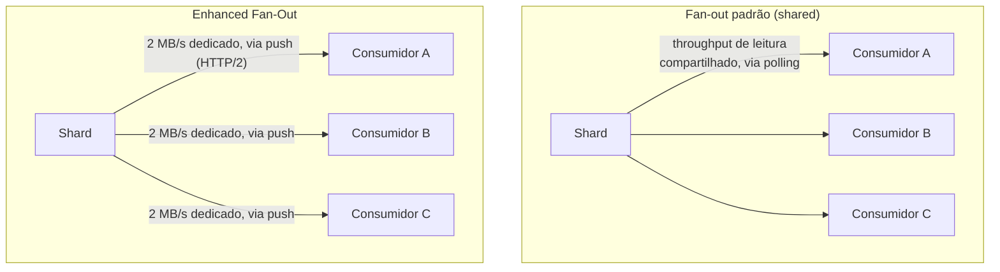
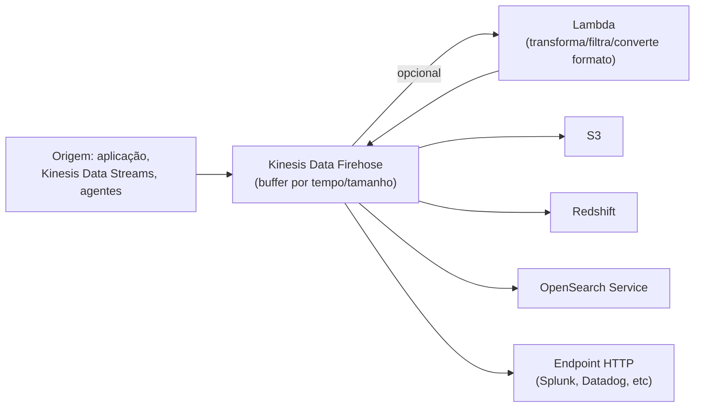
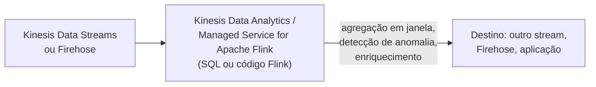
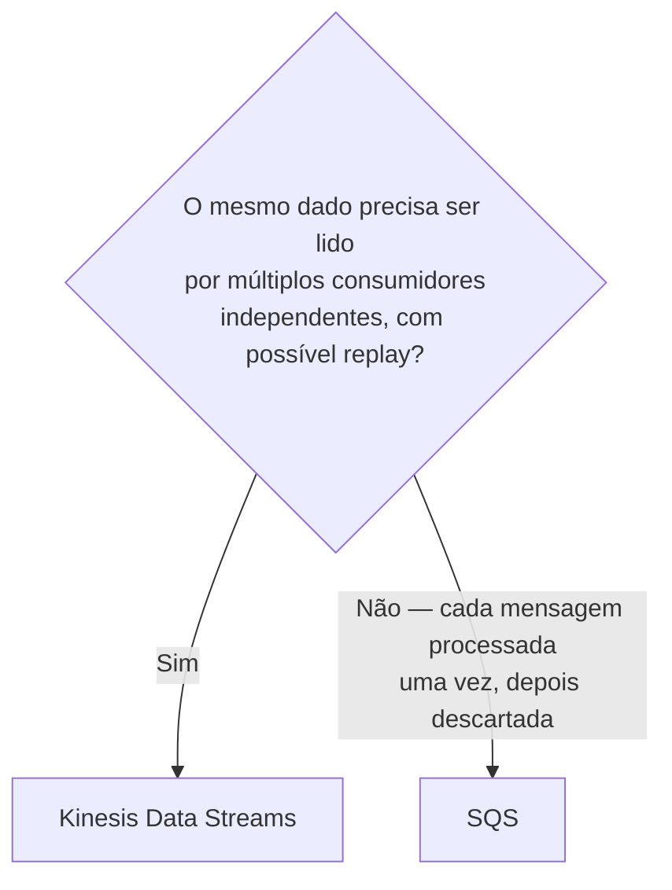
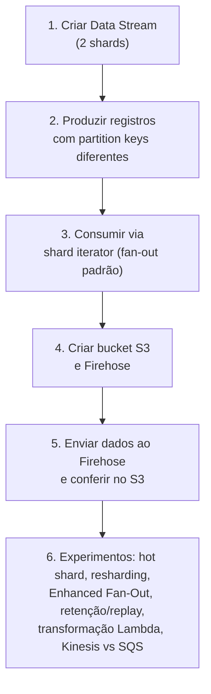

# Kinesis e Data Streaming — Guia Completo (Teoria + Prática + Dia a Dia)

## 0. O problema que streaming de dados resolve

Muitos sistemas trabalham bem com processamento em lote (batch) — você acumula dados durante um período (uma hora, um dia) e processa tudo de uma vez. Mas existe uma classe de problemas onde **esperar não é uma opção**: cliques em um site em tempo real para um dashboard ao vivo, leituras de sensores IoT que precisam disparar um alerta imediatamente, logs de aplicação que precisam ser analisados assim que chegam para detectar um problema em produção, transações financeiras que precisam ser avaliadas contra fraude no momento em que acontecem.

Além da urgência, existe outro problema: em muitos desses casos, **o mesmo dado precisa ser consumido por múltiplos sistemas diferentes, de forma independente** — o mesmo clique do usuário pode alimentar um dashboard em tempo real, um pipeline de analytics, E um sistema de recomendação, todos ao mesmo tempo, cada um no seu próprio ritmo. Uma fila tradicional (onde uma mensagem é consumida e removida) não resolve bem esse padrão — é aqui que entra o conceito de **streaming**: um log de eventos ordenado e duravelmente armazenado, que múltiplos consumidores independentes podem ler (cada um mantendo sua própria posição de leitura), inclusive **reprocessando dados antigos** dentro da janela de retenção.


*O padrão central do streaming: múltiplos consumidores independentes lendo o mesmo fluxo de dados, cada um em seu próprio ritmo.*

A família **Kinesis** é a solução da AWS para esse problema, com serviços especializados em cada etapa: **Kinesis Data Streams** (a base — capturar e reter o stream), **Kinesis Data Firehose** (entregar o stream para um destino de armazenamento/análise) e **Kinesis Data Analytics / Managed Service for Apache Flink** (processar/transformar o stream em trânsito).

---

## 1. Kinesis Data Streams

### Shards — a unidade de throughput

Um **Kinesis Data Stream** é dividido em **shards**. Cada shard é a unidade fundamental de capacidade: ele garante um throughput fixo de **escrita** (registros por segundo e um limite de bytes/segundo) e um throughput fixo de **leitura** (compartilhado entre consumidores, no modo padrão — ver adiante). Se você precisa de mais throughput total, você **aumenta o número de shards** (operação chamada de *resharding*, que pode ser feita dividindo shards existentes ou mesclando shards, sem downtime do stream).

**Por que isso importa na prática:** dimensionar shards de menos é a causa mais comum de `ProvisionedThroughputExceededException` — o stream começa a rejeitar/atrasar escritas porque a capacidade agregada dos shards não aguenta o volume real de dados chegando.

### Partition Keys — como os dados se distribuem entre shards

Cada registro enviado ao stream carrega uma **partition key**, escolhida por quem produz o dado (ex: o ID do usuário, o ID do dispositivo). O Kinesis aplica um hash sobre essa chave para decidir **em qual shard** aquele registro vai parar.

**Por que isso é importante além de só "distribuir":** registros com a **mesma partition key sempre vão para o mesmo shard**, o que **preserva a ordem** dos registros daquela chave (dentro do mesmo shard, a ordem de chegada é garantida). Isso é essencial quando a ordem importa — ex: eventos do mesmo usuário (login → ação → logout) precisam ser processados na ordem correta, então usar o ID do usuário como partition key garante isso.

**Pegadinha clássica de prova:** escolher uma partition key de baixa cardinalidade (ex: sempre a mesma string, ou algo como "regiao" quando só existem 3 regiões possíveis) cria um **hot shard** — um shard recebendo desproporcionalmente mais tráfego que os outros, enquanto os demais ficam ociosos. A escolha da partition key é a decisão de design mais importante para evitar isso — ela precisa ter cardinalidade alta o suficiente para distribuir bem, mas ainda assim agrupar o que precisa ficar ordenado junto.


*Partition key determina o shard via hash — mesma chave sempre cai no mesmo shard, preservando ordem por chave.*

### Retenção configurável

Por padrão, os dados ficam disponíveis no stream por um período padrão relativamente curto, mas isso é **configurável para um período bem mais longo** (até um limite máximo de vários dias, dependendo do tier de retenção contratado). Isso é o que permite o **replay** — um novo consumidor pode começar a ler do início da janela de retenção, ou um consumidor existente pode "voltar no tempo" para reprocessar dados após corrigir um bug, algo que uma fila tradicional (onde a mensagem some após ser consumida) não permite.

**No dia a dia:** aumentar a retenção tem custo adicional — vale a pena quando você realmente precisa da capacidade de reprocessamento (ex: corrigir um bug de processamento e reprocessar as últimas 24h de dados) ou quando novos consumidores são adicionados com frequência e precisam "pegar o histórico recente".

### Consumidores: fan-out compartilhado (padrão) vs enhanced fan-out

**Fan-out padrão (shared/classic):** todos os consumidores de um shard **dividem o throughput de leitura** daquele shard entre si (usando a API `GetRecords` via polling). Se você tem 3 consumidores lendo o mesmo shard no modo padrão, eles competem pela mesma capacidade de leitura do shard — mais consumidores, menos throughput disponível para cada um, e maior é a latência para todos, porque o polling é sequencial entre eles.

**Enhanced Fan-Out (EFO):** cada consumidor registrado com Enhanced Fan-Out recebe seu **próprio throughput dedicado de 2 MB/s por shard**, entregue via **push** (usando HTTP/2, o Kinesis empurra os dados para o consumidor, em vez do consumidor fazer polling) — isso reduz a latência (tipicamente para dezenas de milissegundos) e elimina a competição por throughput entre consumidores.

**Quando usar cada um:**
- **Fan-out padrão:** poucos consumidores (1-2), onde throughput compartilhado e uma latência um pouco maior (segundos) são aceitáveis, e você quer evitar custo adicional.
- **Enhanced Fan-Out:** múltiplos consumidores que precisam de throughput garantido e baixa latência de forma independente uns dos outros — o caso clássico é quando você tem vários times/aplicações lendo o mesmo stream para propósitos diferentes e nenhum deve ser prejudicado pelo volume de leitura dos outros.


*No modo padrão os consumidores competem pelo mesmo throughput; no Enhanced Fan-Out cada um tem 2 MB/s dedicado.*

**No dia a dia:** o **Kinesis Client Library (KCL)** é a biblioteca oficial usada para escrever consumidores, cuidando de detalhes como checkpoint de progresso (para saber onde parou em caso de restart) e balanceamento de shards entre múltiplas instâncias do consumidor.

---

## 2. Kinesis Data Firehose

**O problema que resolve:** com Kinesis Data Streams, você precisa escrever e operar o código do **consumidor** (uma aplicação que lê do stream e grava no destino final). Na maioria dos casos de uso de "só quero que esses dados cheguem no S3/Redshift/OpenSearch quase em tempo real", escrever e manter esse consumidor é trabalho repetitivo desnecessário.

O **Kinesis Data Firehose** é **totalmente gerenciado** — você aponta a origem dos dados e o destino, e a AWS cuida de tudo entre os dois. **Você não gerencia shards** — o Firehose escala automaticamente a capacidade conforme o volume de dados.

**Diferença central com Data Streams:** Firehose não é para tempo real estrito — ele faz *buffering* dos dados (por tempo ou por tamanho de buffer, o que ocorrer primeiro) antes de entregar ao destino, então a entrega é **quase em tempo real** (near real-time, tipicamente na casa de dezenas de segundos até poucos minutos), não instantânea como um consumidor de Data Streams bem otimizado pode ser.

**Destinos suportados:** S3, Redshift, OpenSearch Service, e endpoints HTTP de terceiros (splunk, datadog, e outros parceiros), além de poder usar o próprio Kinesis Data Streams como origem.

**Transformação opcional via Lambda:** no meio do caminho, o Firehose pode invocar uma função **Lambda** para transformar cada registro antes da entrega (ex: converter formato, enriquecer dados, filtrar registros indesejados, converter para Parquet/ORC para otimizar consultas no destino). Registros que falham na transformação podem ser enviados para um bucket S3 de erro, para investigação.


*Firehose é totalmente gerenciado — sem shards para operar — e entrega quase em tempo real, com transformação opcional via Lambda.*

**No dia a dia:** o caso de uso mais comum é um **data lake** — logs de aplicação, cliques, eventos de IoT chegando via Firehose e sendo depositados em S3 particionado por data/hora, prontos para serem consultados depois via Athena/Redshift Spectrum. Você não precisa de replay/múltiplos consumidores independentes nesse caso — só quer que o dado chegue no destino de forma confiável e gerenciada.

---

## 3. Kinesis Data Analytics / Managed Service for Apache Flink

Resolve o problema de **processar/transformar dados enquanto eles ainda estão em movimento** no stream — antes de chegar a um destino final — usando **SQL** ou código (Apache Flink, um framework de processamento de stream) diretamente sobre um Kinesis Data Stream ou Firehose.

**Casos de uso típicos:** agregações em janelas de tempo (ex: "quantos cliques por minuto nos últimos 5 minutos"), detecção de anomalias em tempo real, enriquecimento de eventos combinando múltiplas fontes, filtragem/roteamento condicional de eventos antes de entregar ao destino final.

**No dia a dia:** essa camada é usada quando a transformação necessária é **mais complexa do que uma função Lambda simples consegue fazer de forma eficiente** — especialmente quando envolve estado ao longo do tempo (ex: agregações de janela deslizante, correlação entre eventos que chegam em momentos diferentes), algo que o modelo de execução stateless de uma Lambda não foi desenhado para fazer bem.


*Processamento com estado (agregações, janelas de tempo) diretamente sobre o stream, antes da entrega final.*

---

## 4. Kinesis Data Streams vs SQS

Essa comparação aparece com frequência na prova porque, à primeira vista, os dois parecem resolver "mandar mensagens de um lugar para outro" — mas o modelo de consumo é fundamentalmente diferente.

| Critério | Kinesis Data Streams | SQS |
|---|---|---|
| **Modelo de consumo** | Múltiplos consumidores independentes leem o mesmo dado (pub/sub sobre um log) | Uma mensagem é processada por um consumidor e então removida da fila (ponto-a-ponto) |
| **Ordem** | Garantida dentro de um shard (por partition key) | FIFO garante ordem por grupo de mensagem; Standard não garante ordem |
| **Replay de dados antigos** | Sim, dentro da janela de retenção configurável | Não — mensagem consumida e deletada não existe mais (exceto DLQ para falhas) |
| **Escala/throughput** | Você dimensiona shards explicitamente | Escala automaticamente, sem necessidade de gerenciar unidades de capacidade |
| **Retenção de mensagem processada** | Continua no stream até expirar o período de retenção, mesmo após lida | Removida assim que processada com sucesso (ack) |
| **Uso típico** | Streaming de eventos para múltiplos consumidores, analytics em tempo real, replay para reprocessamento | Desacoplar produtor/consumidor, filas de trabalho, processamento assíncrono ponto-a-ponto |
| **Ordenação em alta escala com múltiplos "grupos"** | Natural via partition key, sem necessidade de filas separadas | Precisa de FIFO com Message Group ID, ou múltiplas filas |

**Resumindo a decisão prática:** se a pergunta é "vários sistemas diferentes precisam ler o mesmo evento, de forma independente, possivelmente reprocessando depois" → **Kinesis**. Se a pergunta é "preciso desacoplar um produtor de um consumidor de trabalho, cada mensagem processada uma vez e descartada" → **SQS**.


*A pergunta central para decidir entre Kinesis Data Streams e SQS.*

---

## 5. Amazon MSK (Managed Streaming for Apache Kafka) — alternativa breve

Para equipes que **já usam o ecossistema Apache Kafka** (seja por padronização corporativa, por já terem investido em ferramentas/conhecimento do ecossistema Kafka, ou por precisarem de compatibilidade total com a API do Kafka para portabilidade), a AWS oferece o **Amazon MSK** — uma versão gerenciada do Kafka, cuidando da operação dos brokers e do ZooKeeper/KRaft por baixo, mas mantendo compatibilidade total com a API e o ecossistema padrão do Kafka (Kafka Connect, Kafka Streams, ferramentas de terceiros já existentes).

**Quando escolher MSK em vez de Kinesis:** quando já existe investimento (código, conhecimento da equipe, ferramentas) no ecossistema Kafka, ou quando é necessária portabilidade entre nuvens/on-premises usando um padrão aberto, similar à lógica de escolher EKS em vez de ECS por portabilidade. Se o time está começando do zero dentro da AWS sem esse investimento prévio, o Kinesis tende a ser mais simples de operar por ser mais integrado nativamente ao ecossistema de serviços gerenciados da AWS.

---

## 6. Conectando aos 4 domínios da prova

- **Segurança:** streams podem ser criptografados em repouso (KMS) e em trânsito (TLS); IAM controla granularmente quem pode escrever (`PutRecord`) ou ler (`GetRecords`) de um stream específico; VPC endpoints permitem acesso privado ao Kinesis sem passar pela internet pública.
- **Resiliência:** os dados em um shard são replicados automaticamente entre múltiplas AZs dentro da região pela AWS; a arquitetura de múltiplos consumidores independentes com checkpoint (KCL) permite que um consumidor falhe e retome de onde parou sem perder dados, dentro da janela de retenção.
- **Performance:** é o tema central deste arquivo — shards dimensionam throughput, Enhanced Fan-Out garante throughput dedicado por consumidor, Firehose e Data Analytics processam dados quase em tempo real sem you gerenciar infraestrutura.
- **Custo:** Kinesis Data Streams cobra por shard-hora provisionado (modo provisioned) ou por throughput consumido (modo on-demand, mais simples mas potencialmente mais caro em alto volume constante); Firehose cobra por volume de dados ingerido, sem custo de shard ocioso; aumentar retenção além do padrão tem custo adicional.

---

# 🧪 Laboratório prático (para executar na AWS)

## Objetivo
Criar um Kinesis Data Stream, produzir e consumir registros, e configurar um Firehose entregando para S3.

### Passo 1 — Criar o Data Stream
```bash
aws kinesis create-stream --stream-name stream-lab --shard-count 2
aws kinesis describe-stream-summary --stream-name stream-lab
```

### Passo 2 — Produzir registros
```bash
aws kinesis put-record --stream-name stream-lab --partition-key "user-123" --data "$(echo -n '{"evento":"clique","usuario":"123"}' | base64)"
aws kinesis put-record --stream-name stream-lab --partition-key "user-456" --data "$(echo -n '{"evento":"clique","usuario":"456"}' | base64)"
```

### Passo 3 — Consumir registros manualmente (fan-out padrão)
```bash
SHARD_ITERATOR=$(aws kinesis get-shard-iterator --stream-name stream-lab --shard-id shardId-000000000000 --shard-iterator-type TRIM_HORIZON --query 'ShardIterator' --output text)
aws kinesis get-records --shard-iterator $SHARD_ITERATOR
```

### Passo 4 — Criar um bucket S3 e um Firehose entregando para ele
```bash
aws s3 mb s3://kinesis-firehose-lab-destino

aws firehose create-delivery-stream \
  --delivery-stream-name firehose-lab \
  --delivery-stream-type DirectPut \
  --s3-destination-configuration RoleARN={role-arn},BucketARN=arn:aws:s3:::kinesis-firehose-lab-destino
```

### Passo 5 — Enviar dados para o Firehose e conferir no S3
```bash
aws firehose put-record --delivery-stream-name firehose-lab --record '{"Data":"eyJldmVudG8iOiJjbGlxdWUifQ=="}'
aws s3 ls s3://kinesis-firehose-lab-destino/ --recursive
```

### Passo 6 — Experimentos para fixar cada conceito
1. **Hot shard:** produza uma rajada de registros usando sempre a mesma partition key e compare a distribuição entre shards com uma rajada usando partition keys variadas (ex: UUID por registro).
2. **Resharding:** aumente o número de shards do stream (`update-shard-count`) e observe o tempo que leva para o stream ficar `ACTIVE` de novo, e como o hash de partition key se redistribui.
3. **Enhanced Fan-Out:** registre um consumidor com `register-stream-consumer` e compare a latência de leitura via `SubscribeToShard` (push) com o polling padrão do Passo 3.
4. **Retenção e replay:** aumente a retenção do stream (`increase-stream-retention-period`), produza registros, espere alguns minutos, e leia de novo desde `TRIM_HORIZON` para confirmar que os dados antigos ainda estão lá.
5. **Transformação com Lambda no Firehose:** associe uma função Lambda simples ao Firehose para adicionar um campo `processed_at` a cada registro antes da entrega no S3.
6. **Kinesis vs SQS:** crie uma fila SQS Standard, mande a mesma mensagem, consuma uma vez, e tente consumir de novo para confirmar que a mensagem já não existe mais — compare com o comportamento de replay do Kinesis no experimento 4.


*Sequência dos passos do laboratório prático.*

---

## Comandos AWS CLI úteis

```bash
# Criar um stream
aws kinesis create-stream --stream-name stream-lab --shard-count 2

# Aumentar/diminuir o número de shards
aws kinesis update-shard-count --stream-name stream-lab --target-shard-count 4 --scaling-type UNIFORM_SCALING

# Aumentar a retenção (em horas, acima do padrão)
aws kinesis increase-stream-retention-period --stream-name stream-lab --retention-period-hours 168

# Registrar um consumidor com Enhanced Fan-Out
aws kinesis register-stream-consumer --stream-arn {stream-arn} --consumer-name meu-consumidor-efo

# Colocar um registro no stream
aws kinesis put-record --stream-name stream-lab --partition-key "chave" --data "dados-base64"

# Descrever o stream (shards, status, retenção)
aws kinesis describe-stream-summary --stream-name stream-lab

# Criar um delivery stream do Firehose para S3
aws firehose create-delivery-stream --delivery-stream-name firehose-lab --s3-destination-configuration file://s3-config.json

# Listar aplicações do Managed Service for Apache Flink
aws kinesisanalyticsv2 list-applications
```

---

## Tabela de decisão rápida (prova + dia a dia)

| Cenário | Resposta provável |
|---|---|
| Múltiplos consumidores independentes lendo o mesmo evento, com possível replay | Kinesis Data Streams |
| Só quero que os dados cheguem no S3/Redshift/OpenSearch, sem gerenciar consumidor | Kinesis Data Firehose |
| Preciso agregar/analisar dados com SQL enquanto ainda estão em movimento | Kinesis Data Analytics / Managed Service for Apache Flink |
| Preciso garantir ordem de eventos do mesmo usuário/entidade | Partition key = ID do usuário/entidade no Kinesis |
| Um shard está recebendo tráfego desproporcional (hot shard) | Revisar cardinalidade da partition key |
| Múltiplos consumidores competindo por throughput e prejudicando latência entre si | Enhanced Fan-Out |
| Desacoplar produtor de um worker, mensagem processada uma vez | SQS, não Kinesis |
| Equipe já usa Apache Kafka e precisa de portabilidade/compatibilidade total | Amazon MSK |
| Transformar/filtrar registros antes de gravar no S3 sem gerenciar infraestrutura | Firehose com transformação via Lambda |
| Precisa reprocessar dados das últimas 24-48h após corrigir um bug | Kinesis Data Streams com retenção estendida (replay) |
