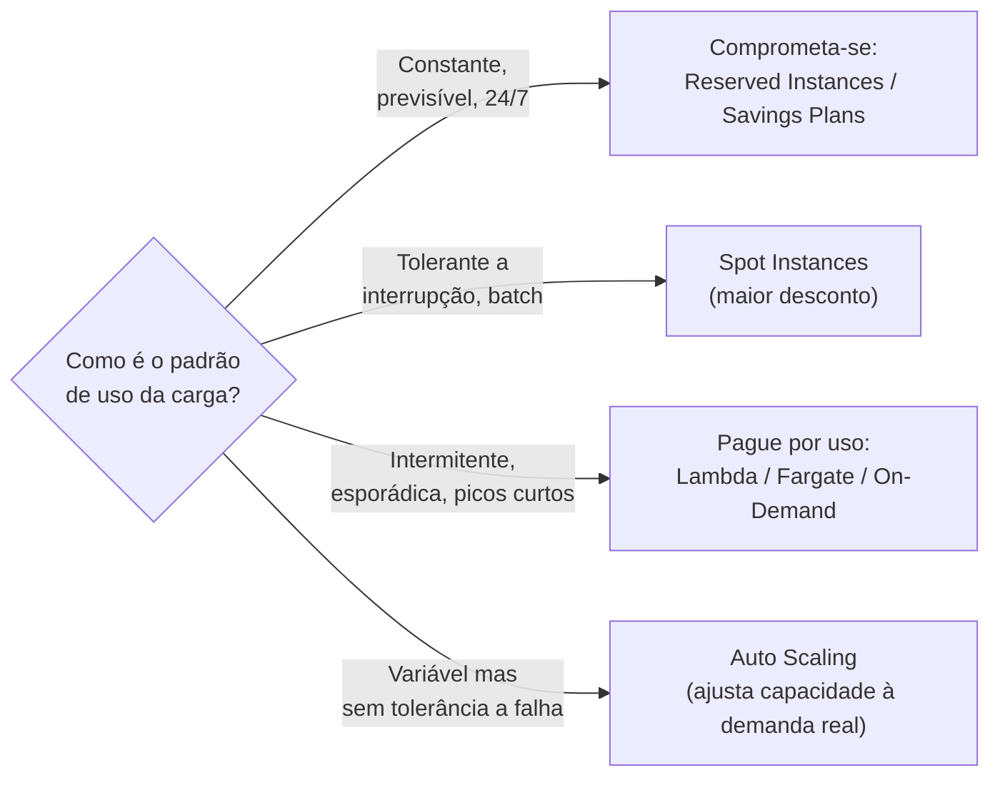
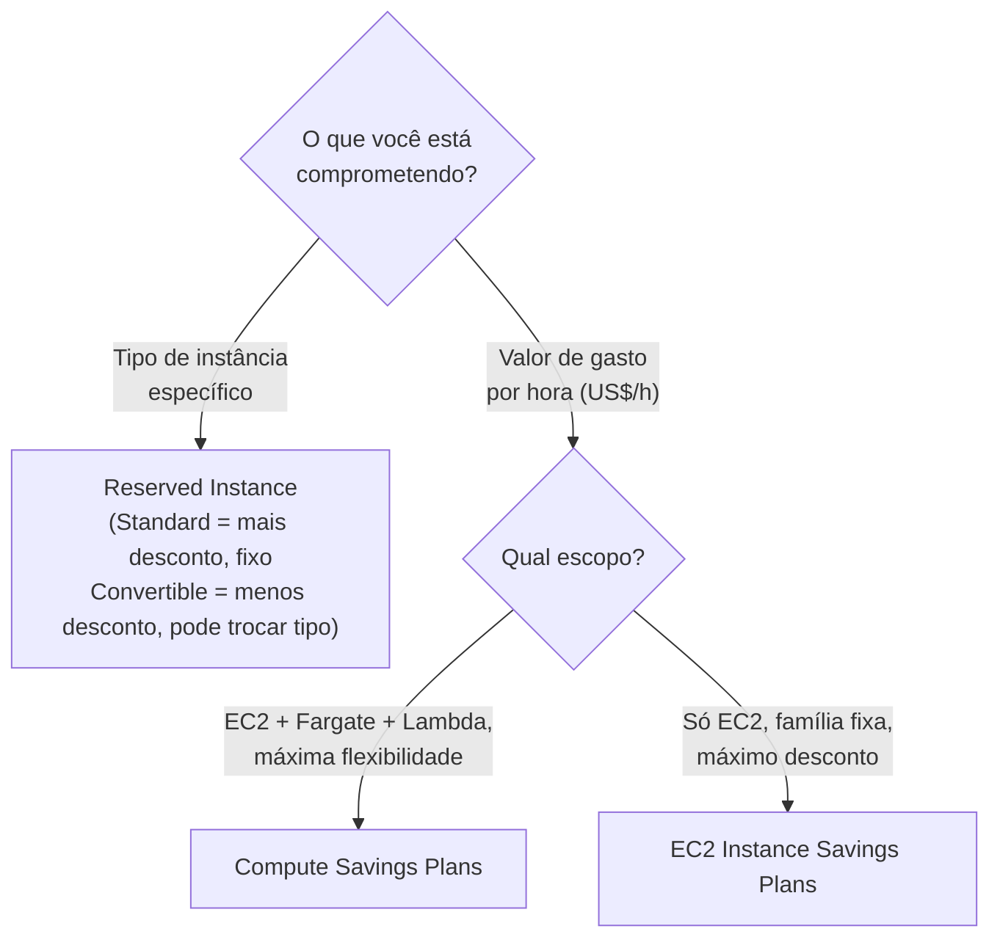
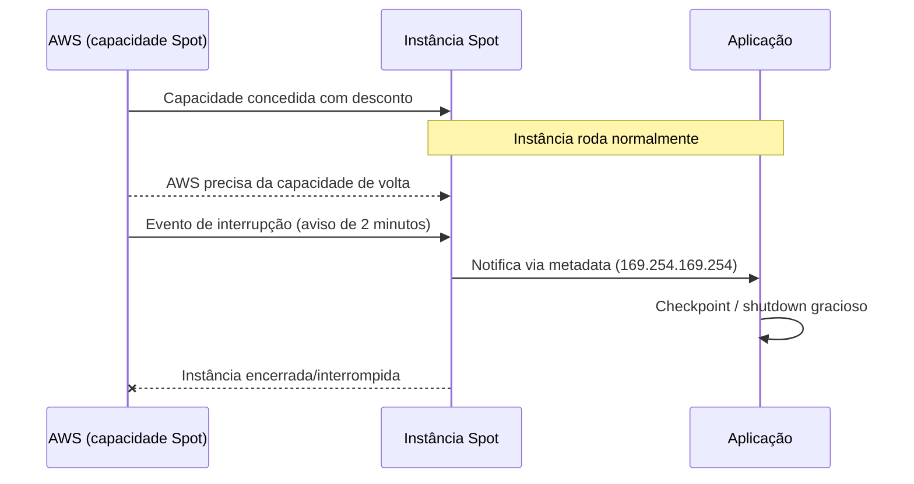
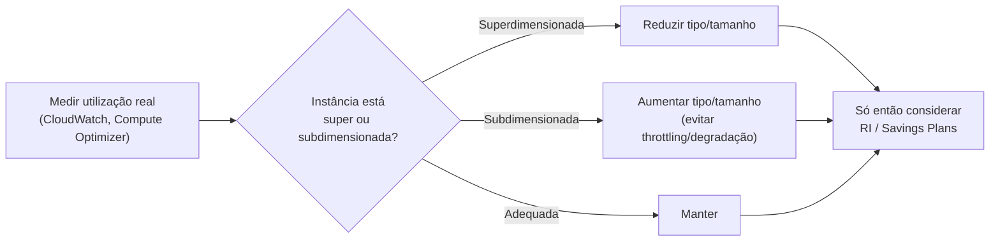
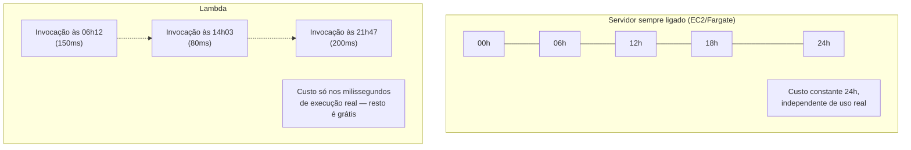
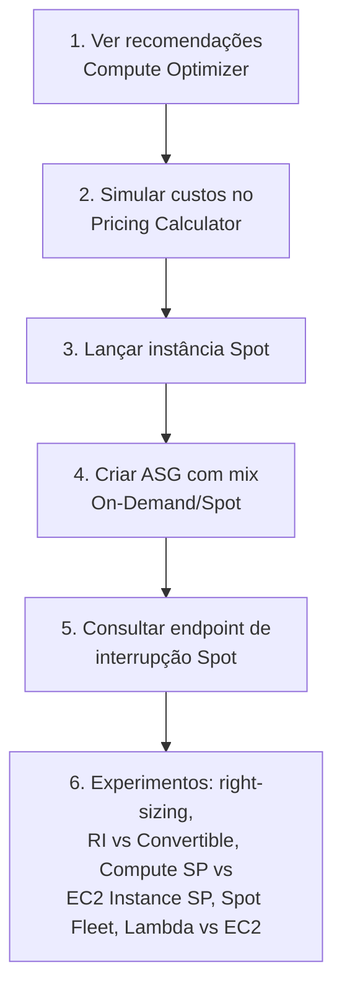

# Estratégias de Custo em Compute (EC2, Fargate, Lambda) — Guia Completo (Teoria + Prática + Dia a Dia)

## 0. Por que "custo de compute" é um domínio inteiro da prova

Compute (EC2, containers, Lambda) costuma ser a maior linha da fatura AWS de qualquer empresa que roda carga própria (não é serverless-first). Diferente de segurança ou resiliência, que são "faça certo e pronto", custo é um **espectro contínuo de trade-offs**: você troca flexibilidade por desconto, ou paga mais para não gerenciar nada.

Este arquivo não repete a teoria de "o que é uma instância EC2" ou "como o Lambda executa código" — isso já está coberto nos arquivos de fundamentos de cada serviço. Aqui o foco é: **dado que você já sabe usar o serviço, qual modelo de compra/configuração minimiza custo para o padrão de carga que você tem**, e por que a prova cobra isso tão pesado (é literalmente um dos 4 domínios oficiais do SAA-C03).

A ideia central que guia tudo neste arquivo: **quanto mais previsível e constante é a sua carga, mais desconto você consegue comprometendo-se com antecedência. Quanto mais imprevisível/intermitente, mais vale pagar por uso.**


*A pergunta central de otimização de custo em compute: o quanto sua carga tolera compromisso ou interrupção define o modelo de compra ideal.*

---

## 1. On-Demand — o ponto de partida (e o "preço de tabela")

On-Demand é pagar pelo que você usa, por segundo (com mínimo de 60s), sem nenhum compromisso. É o mais caro por hora, mas o mais flexível — sem multa, sem prazo, liga e desliga quando quiser.

**Papel dele na estratégia de custo:** não é "o modelo ruim que você deve evitar sempre". Ele é o baseline correto para:
- Cargas novas/incertas, onde você ainda não sabe o padrão de uso real (não comprometa capacidade antes de entender o comportamento da carga).
- Picos de curto prazo em cima de uma capacidade baseline já coberta por RI/Savings Plans.
- Ambientes de teste/experimentação de vida curta.

**O que muita gente erra na prova:** achar que "a resposta certa de custo é sempre RI ou Spot". Não é — a resposta certa depende do padrão de carga descrito no enunciado. Se a questão descreve uma carga **nova e ainda sem histórico**, On-Demand é a resposta certa até você ter dados suficientes para se comprometer com segurança.

---

## 2. Reserved Instances (RI) — comprometendo-se com capacidade previsível

RI é um desconto que você recebe (até ~72% comparado a On-Demand, variando por tipo/região) em troca de se comprometer com o uso de um tipo específico de instância por um período fixo. Importante: **RI não é uma instância física reservada** (com exceção do modo "capacity reservation" combinado) — é primariamente um **desconto de faturamento** aplicado automaticamente a instâncias em execução que casam com o atributo da reserva.

### Standard RI vs Convertible RI

| Atributo | Standard RI | Convertible RI |
|---|---|---|
| Desconto | Maior | Menor (mas ainda relevante) |
| Pode trocar família/tipo de instância durante o termo | ❌ — fixo no tipo comprado | ✅ — pode trocar para outra configuração de instância (ex: mudar de `m5` para `m6i`), desde que o valor da nova reserva seja igual ou maior |
| Pode vender no Reserved Instance Marketplace | ✅ | ❌ |
| Quando usar | Carga estável, você tem certeza que vai usar esse tipo exato por todo o termo | Carga estável mas você espera mudar de geração/tipo de instância ao longo do tempo (ex: aproveitar instâncias mais novas e eficientes) |

### Termo: 1 ano vs 3 anos
Quanto maior o compromisso de tempo, maior o desconto. 3 anos dá desconto substancialmente maior que 1 ano, mas trava você por mais tempo — se a carga mudar de perfil (ex: a aplicação for descontinuada, ou migrar para outra família de instância), você fica com uma reserva subutilizada.

### Opções de pagamento: All Upfront, Partial Upfront, No Upfront

| Opção | Como funciona | Desconto relativo |
|---|---|---|
| **All Upfront** | Paga o valor total do termo de uma vez, no início | Maior desconto |
| **Partial Upfront** | Paga uma parte no início, o resto em parcelas mensais menores durante o termo | Desconto intermediário |
| **No Upfront** | Não paga nada adiantado, só as parcelas mensais (menores que On-Demand) | Menor desconto (dos três), mas preserva caixa |

**No dia a dia:** empresas com caixa apertado ou que preferem OPEX previsível mensal escolhem No Upfront ou Partial Upfront, mesmo desconto sendo menor — é uma decisão financeira, não técnica. Empresas maduras com orçamento de CAPEX definido tendem a ir de All Upfront para maximizar desconto.

---

## 3. Savings Plans — o sucessor mais flexível das RIs

Savings Plans resolve a maior dor das RIs: o compromisso é de **valor gasto por hora** (ex: "US$ 10/hora de compute"), não de um tipo de instância específico. Isso significa que o desconto se aplica automaticamente conforme você consome, não importa qual instância/família você está rodando — muito mais flexível do que RI Standard.

### Compute Savings Plans vs EC2 Instance Savings Plans

| Atributo | Compute Savings Plans | EC2 Instance Savings Plans |
|---|---|---|
| Flexibilidade | Máxima — aplica desconto a **EC2 (qualquer família/tamanho/OS/região), Fargate e Lambda** | Menor — aplica desconto só a EC2, dentro de uma **família de instância específica em uma região específica** (ex: `m5` em `us-east-1`), mas o tamanho/OS dentro dessa família pode variar livremente |
| Desconto | Menor (dos dois) | Maior (dos dois) — troca flexibilidade por desconto adicional |
| Cobre Fargate/Lambda | ✅ | ❌ — só EC2 |
| Quando usar | Você usa múltiplos serviços de compute (EC2 + containers + serverless) e quer flexibilidade máxima para migrar entre eles sem perder desconto | Você tem certeza que vai continuar usando uma família de instância específica naquela região pelo termo todo, e quer o desconto máximo |

**No dia a dia:** Compute Savings Plans é geralmente a escolha "segura" e mais popular hoje, porque **desacopla o compromisso financeiro da decisão de arquitetura** — você pode migrar de EC2 para Fargate ou mudar de família de instância no meio do termo sem perder o desconto contratado. É um dos motivos pelos quais RIs foram perdendo espaço para Savings Plans nos últimos anos.


*Reserved Instances comprometem um tipo de recurso; Savings Plans comprometem um valor de gasto — por isso são mais flexíveis.*

---

## 4. Spot Instances — o maior desconto, com o maior risco

Spot Instances usam **capacidade ociosa** da AWS, oferecida com desconto grande (frequentemente 70-90% abaixo do On-Demand, variando por tipo/região/momento) em troca de um risco real: a AWS pode **retomar essa capacidade a qualquer momento**, avisando com **2 minutos de antecedência** (via evento de interrupção que pode ser capturado pela sua aplicação para fazer um shutdown gracioso).

**Por que a AWS oferece esse desconto:** capacidade ociosa não gera receita nenhuma parada. Vender com desconto grande, mesmo com risco de interrupção, é melhor para a AWS do que deixar servidores livres sem uso. Para você, é a AWS repassando parte desse ganho mútuo.

### Spot Fleet / Auto Scaling com Spot
Ao invés de depender de uma única instância Spot (alto risco de ficar sem capacidade nenhuma quando ela é interrompida), você define um **Spot Fleet** (ou um Auto Scaling Group com múltiplos tipos de instância elegíveis) — um conjunto diversificado de tipos/tamanhos/AZs de instância que a AWS pode usar para atingir a capacidade-alvo. Isso reduz drasticamente a chance de "ficar sem nenhuma capacidade disponível", porque a chance de *todos* os tipos serem interrompidos ao mesmo tempo é muito menor do que depender de um tipo só.

**No dia a dia:** arquiteturas maduras com Spot quase nunca usam um tipo de instância fixo — usam um **pool diversificado** (várias famílias/tamanhos compatíveis) justamente para mitigar o risco de interrupção correlacionada.

### Casos de uso ideais para Spot
- **Processamento batch** (ETL, renderização, processamento de imagem/vídeo em lote) — se uma tarefa for interrompida, ela é retomada depois, sem perda de resultado final.
- **Cargas tolerantes a falha** — qualquer workload distribuído e stateless que pode perder um nó e continuar (ex: workers de fila SQS, nós de processamento distribuído tipo Hadoop/Spark/EMR).
- **CI/CD** (build/test de pipelines) — se um build for interrompido, ele simplesmente roda de novo; não há SLA de disponibilidade contínua para um runner individual.
- **Cargas com Auto Scaling e checkpoint** — workloads que salvam progresso periodicamente e conseguem retomar de onde pararam.

**O que muita gente erra na prova:** achar que Spot serve para qualquer coisa "não crítica". O critério real não é "criticidade do negócio", é **tolerância técnica à interrupção repentina com pouco aviso**. Um site com baixo tráfego mas que precisa estar sempre no ar não é candidato a Spot só porque "não é tão importante" — se ele não tolera ficar fora do ar por minutos, Spot é a escolha errada independente de criticidade de negócio.


*O ciclo de vida de uma interrupção Spot: 2 minutos entre o aviso e a retomada da capacidade pela AWS.*

---

## 5. Fargate Spot

Mesma lógica de desconto e risco das EC2 Spot Instances, mas aplicada a **tasks do ECS/EKS rodando em Fargate** (sem gerenciar instância nenhuma — o modelo de fundamentos de Fargate já está coberto no arquivo de containers, aqui o foco é só o ângulo de custo).

Com Fargate Spot, você paga um preço reduzido pela capacidade de computação da task, com o mesmo risco de interrupção (a AWS pode recuperar a capacidade). Diferente de EC2 Spot, você não gerencia Spot Fleet manualmente — você define, na configuração do serviço ECS, a **estratégia de capacidade** (`capacityProviderStrategy`) misturando Fargate (On-Demand) e Fargate Spot, com pesos (ex: 20% Fargate normal como baseline garantido + 80% Fargate Spot para o restante).

**No dia a dia:** essa mistura ponderada é o padrão mais comum — garante uma fatia mínima de capacidade estável (Fargate normal) e usa Spot para a maior parte do volume, reduzindo custo agregado sem depender 100% de capacidade que pode sumir.

---

## 6. Right-sizing — a otimização mais básica (e mais esquecida)

Antes de qualquer modelo de compra, existe uma pergunta mais fundamental: **o tipo/tamanho de instância que você está usando corresponde à carga real que ela recebe?** É extremamente comum encontrar instâncias superdimensionadas (CPU/memória ociosa a maior parte do tempo) porque foram provisionadas "por segurança" e nunca revisadas depois.

Right-sizing é o processo de **medir a utilização real** (CPU, memória, rede, IOPS — via CloudWatch e, para memória, um agente/plugin adicional já que o CloudWatch básico não mede memória de EC2 nativamente) e ajustar o tipo de instância para o menor que ainda atende a carga com folga de segurança.

**Ferramentas que ajudam nisso:**
- **AWS Compute Optimizer** — analisa métricas históricas de utilização e recomenda automaticamente o tipo de instância ideal (inclusive para EBS e Lambda).
- **Trusted Advisor** (nos planos Business/Enterprise) — sinaliza instâncias com baixa utilização.
- **Cost Explorer com recomendações de Rightsizing** — mostra economia estimada trocando tipos de instância.

**No dia a dia:** right-sizing deveria ser um processo **recorrente**, não um projeto único. Cargas mudam com o tempo (aplicação evolui, tráfego cresce ou diminui), então uma instância "certa" há 1 ano pode estar superdimensionada hoje. Times maduros de FinOps revisam isso trimestralmente.

**Pegadinha clássica de prova:** right-sizing é frequentemente citado como "o primeiro passo" antes de comprar RIs/Savings Plans — não faz sentido se comprometer por 1-3 anos com um tipo de instância que já está superdimensionado. A ordem lógica correta é: **primeiro right-size, depois comprometa-se (RI/SP)**.


*Right-sizing deve vir antes de qualquer compromisso de compra de longo prazo.*

---

## 7. Auto Scaling como ferramenta de custo (não só de performance/resiliência)

Auto Scaling é normalmente ensinado sob a ótica de disponibilidade/performance (garantir capacidade suficiente sob carga variável, tema já coberto no domínio de resiliência). Mas ele também é uma das ferramentas de **otimização de custo mais poderosas**, pelo motivo oposto: ele **remove capacidade que você não está usando**, evitando pagar por servidores ociosos fora do horário de pico.

Sem Auto Scaling, a prática comum (e cara) é provisionar para o **pico** e deixar essa capacidade ligada 24/7, mesmo que o pico só aconteça algumas horas por dia. Com Auto Scaling (baseado em métricas como CPU, requisições por target, ou schedules), a capacidade acompanha a demanda real — você paga só pelo que precisa, quando precisa.

**Duas estratégias complementares:**
- **Dynamic scaling** (target tracking, step scaling) — reage a métricas em tempo real.
- **Scheduled scaling** — reduz capacidade em horários previsíveis de baixa demanda (ex: madrugada, fins de semana para sistemas corporativos internos).

**No dia a dia:** combinar Auto Scaling com Spot Instances (via Auto Scaling Group com múltiplos tipos de instância e uma mistura On-Demand/Spot configurável) é uma das arquiteturas mais eficientes em custo para cargas que toleram interrupção — você escala com o desconto do Spot e ainda reduz a quantidade total de capacidade ligada em horários de baixa demanda.

---

## 8. Lambda — o modelo de custo por invocação + duração

O Lambda tem um modelo de precificação fundamentalmente diferente de EC2/Fargate: você paga por **número de invocações** + **duração da execução em milissegundos** (arredondada, multiplicada pela memória alocada — mais memória também aumenta proporcionalmente a CPU disponível). Não existe "servidor ligado" custando dinheiro entre uma invocação e outra.

**Por que isso pode ser muito mais barato que um servidor sempre ligado:** para cargas **intermitentes** — uma API interna chamada esporadicamente, um processamento disparado por evento algumas vezes por hora, um cron job que roda por segundos uma vez por dia — uma instância EC2/Fargate rodando 24/7 está sendo cobrada mesmo nos 99% do tempo em que não está fazendo nada. O Lambda cobra **zero** nesse tempo ocioso, porque não existe "tempo ocioso" faturável — só existe tempo de execução real.


*Para cargas intermitentes, o custo do Lambda acompanha o uso real; o custo de um servidor sempre ligado é constante independente do tráfego.*

**Onde a conta vira ao contrário (Lambda fica mais caro):** cargas de **alto volume e sustentadas**, rodando quase o tempo todo, tendem a favorecer EC2/Fargate com Reserved Instances/Savings Plans — porque nesse regime o "desconto por compromisso" supera a vantagem de "não pagar tempo ocioso" (já que praticamente não há tempo ocioso). A regra prática: **quanto mais constante e alto o volume, mais EC2/Fargate reservado tende a vencer; quanto mais esporádico/imprevisível, mais Lambda tende a vencer.**

**Detalhe que pesa na conta real:** duração da execução importa tanto quanto quantidade de chamadas. Uma função lenta (ex: 3 segundos por invocação) custa proporcionalmente mais que uma função otimizada (ex: 300ms) para o mesmo volume de chamadas — por isso otimizar código/dependências de uma Lambda de alto volume tem impacto direto e mensurável na fatura, diferente de EC2 onde o custo é fixo por hora independente de quão eficiente é o código.

**No dia a dia:** ajustar a memória alocada da Lambda também é uma forma de otimização de custo — mais memória custa mais por ms, mas também dá mais CPU, o que pode reduzir a duração total o suficiente para que o custo final **caia**, não suba. O **AWS Lambda Power Tuning** (ferramenta open-source baseada em Step Functions) testa várias configurações de memória automaticamente e recomenda o ponto ótimo de custo/performance.

---

## 9. Tabela comparativa completa — desconto, flexibilidade e risco

| Modelo | Desconto vs On-Demand | Flexibilidade | Risco de interrupção | Melhor para |
|---|---|---|---|---|
| **On-Demand** | Nenhum (base) | Máxima — liga/desliga quando quiser | Nenhum | Carga nova/incerta, picos de curto prazo |
| **Reserved Instance — Standard** | Alto | Baixa — tipo de instância fixo | Nenhum (mas subutilização é risco financeiro) | Carga estável, tipo de instância já validado |
| **Reserved Instance — Convertible** | Médio-alto | Média — pode trocar tipo de instância | Nenhum | Carga estável, mas espera mudar de família/geração |
| **Compute Savings Plans** | Médio-alto | Alta — cobre EC2, Fargate e Lambda, qualquer família/região | Nenhum | Ambientes híbridos (EC2 + containers + serverless) com carga previsível em valor |
| **EC2 Instance Savings Plans** | Alto | Média — família de instância fixa, região fixa | Nenhum | Carga estável em uma família/região específica, quer desconto máximo dentro do EC2 |
| **Spot Instances** | Muito alto | Alta em custo, mas capacidade não garantida | Alto — interrupção com aviso de 2 minutos | Batch, workloads tolerantes a falha, CI/CD |
| **Fargate Spot** | Muito alto | Alta em custo | Alto — mesma lógica do Spot | Tasks de container tolerantes a interrupção |
| **Lambda** | Não aplicável (pague-por-uso) | Máxima — sem compromisso, escala a zero | Nenhum (mas tem cold start e limites de duração) | Cargas intermitentes/imprevisíveis, baixo volume sustentado |

---

## 10. Conectando com os outros domínios da prova

- **Resiliência:** Auto Scaling e Spot Fleet com múltiplos tipos de instância também aumentam disponibilidade (não dependem de um único ponto de falha de capacidade) — o mesmo mecanismo serve os dois domínios.
- **Performance:** right-sizing e escolha de tipo de instância também são decisões de performance — uma instância subdimensionada por economia excessiva pode virar gargalo. O equilíbrio certo é o tema central deste arquivo.
- **Segurança:** modelo de compra não muda postura de segurança diretamente, mas Spot/Fargate exigem que a aplicação seja projetada para lidar com encerramento abrupto de forma segura (ex: não perder transações em andamento, encerrar conexões graciosamente).

---

# 🧪 Laboratório prático (para executar na AWS)

## Objetivo
Comparar na prática o custo estimado de diferentes modelos de compra para uma mesma carga, e observar o comportamento de Spot e Auto Scaling.

### Passo 1 — Analisar recomendações de Compute Optimizer
Console → **Compute Optimizer** → habilite o serviço (se ainda não estiver) → aguarde a análise (pode levar horas nas primeiras vezes) → veja as recomendações de right-sizing para instâncias EC2 existentes na conta.

### Passo 2 — Simular custo no Pricing Calculator
Acesse o **AWS Pricing Calculator** (calculator.aws) e monte três cenários para a mesma instância (ex: `m5.large`, us-east-1, 24/7):
1. On-Demand
2. Reserved Instance Standard, 1 ano, No Upfront
3. Compute Savings Plans, 1 ano, No Upfront

Compare os valores mensais/anuais estimados.

### Passo 3 — Lançar uma instância Spot
Console → EC2 → **Launch Instance** → em **Advanced Details**, mude **Purchasing option** para **Spot** → observe o campo de preço máximo (deixe como "preço Spot atual" para simplificar) → lance a instância.

### Passo 4 — Criar um Auto Scaling Group com mix On-Demand/Spot
Console → EC2 → **Auto Scaling Groups** → Create → configure um **launch template** com múltiplos tipos de instância compatíveis → em **Instance purchase options**, defina uma base On-Demand (ex: 20%) e o restante como Spot.

### Passo 5 — Simular uma interrupção Spot (observação)
Dentro da instância Spot lançada no Passo 3, consulte o endpoint de metadados para checar o status de interrupção (normalmente vazio até haver aviso real):
```bash
curl http://169.254.169.254/latest/meta-data/spot/instance-action
```
Em produção, um script/daemon ficaria monitorando esse endpoint continuamente para reagir ao aviso de 2 minutos.

### Passo 6 — Experimentos para fixar cada conceito
1. **Right-sizing:** compare a recomendação do Compute Optimizer para uma instância subutilizada com o tipo atualmente em uso — calcule a economia mensal estimada.
2. **RI Standard vs Convertible:** no Pricing Calculator, compare o desconto de uma Standard RI de 3 anos All Upfront contra uma Convertible RI de 3 anos All Upfront para a mesma instância.
3. **Compute Savings Plans vs EC2 Instance Savings Plans:** simule os dois para a mesma carga e observe a diferença de desconto — depois pense em um cenário onde você trocaria de família de instância no meio do termo (nesse caso só a Compute SP preservaria o desconto).
4. **Spot Fleet diversificado:** no Auto Scaling Group do Passo 4, adicione 3-4 tipos de instância compatíveis (ex: `m5.large`, `m5a.large`, `m6i.large`) e observe como isso reduz a dependência de um único pool de capacidade Spot.
5. **Lambda vs servidor sempre ligado:** estime o custo mensal de uma Lambda chamada 10.000 vezes/mês com 200ms de duração média e 256MB de memória, e compare com o custo de uma instância `t3.micro` rodando 24/7 — observe a diferença de ordem de grandeza para cargas de baixo volume.


*Sequência dos passos do laboratório prático.*

---

## Comandos AWS CLI úteis

```bash
# Ver o preço histórico de Spot para um tipo de instância
aws ec2 describe-spot-price-history \
  --instance-types m5.large \
  --product-descriptions "Linux/UNIX" \
  --start-time $(date -u -d '-1 day' +%Y-%m-%dT%H:%M:%S)

# Solicitar uma Spot Instance diretamente
aws ec2 request-spot-instances \
  --instance-count 1 \
  --type "one-time" \
  --launch-specification file://spot-spec.json

# Listar recomendações de right-sizing do Compute Optimizer
aws compute-optimizer get-ec2-instance-recommendations

# Ver Reserved Instances ativas na conta
aws ec2 describe-reserved-instances

# Ver Savings Plans ativos na conta
aws savingsplans describe-savings-plans

# Ver relatório de utilização/cobertura de Savings Plans (via Cost Explorer)
aws ce get-savings-plans-utilization \
  --time-period Start=2026-07-01,End=2026-08-01

# Configurar scheduled scaling num Auto Scaling Group (reduzir capacidade à noite)
aws autoscaling put-scheduled-update-group-action \
  --auto-scaling-group-name meu-asg \
  --scheduled-action-name reduzir-noite \
  --recurrence "0 22 * * *" \
  --min-size 0 --max-size 2 --desired-capacity 0
```

---

## Tabela de decisão rápida (prova + dia a dia)

| Cenário | Resposta provável |
|---|---|
| Carga constante e previsível 24/7, tipo de instância já validado | Reserved Instance Standard (maior desconto) |
| Carga constante, mas planeja trocar de família de instância no termo | Reserved Instance Convertible ou Compute Savings Plans |
| Ambiente com EC2 + Fargate + Lambda, quer desconto unificado e flexível | Compute Savings Plans |
| Carga estável só em EC2, numa família fixa, quer o desconto máximo | EC2 Instance Savings Plans |
| Processamento batch, CI/CD, workload tolerante a falha | Spot Instances / Fargate Spot |
| Carga nova, ainda sem histórico de uso | On-Demand até ter dados suficientes |
| API/evento esporádico, baixo volume sustentado | Lambda (paga só pela execução real) |
| Alto volume sustentado, quase sem ociosidade | EC2/Fargate com Reserved Instance/Savings Plans (mais barato que Lambda nesse regime) |
| Instância com CPU/memória sempre ociosa | Right-sizing antes de qualquer compromisso de compra |
| Reduzir custo de capacidade fora do horário comercial | Scheduled Auto Scaling |
