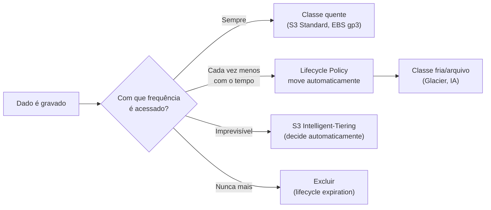
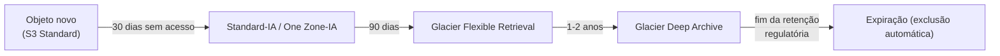
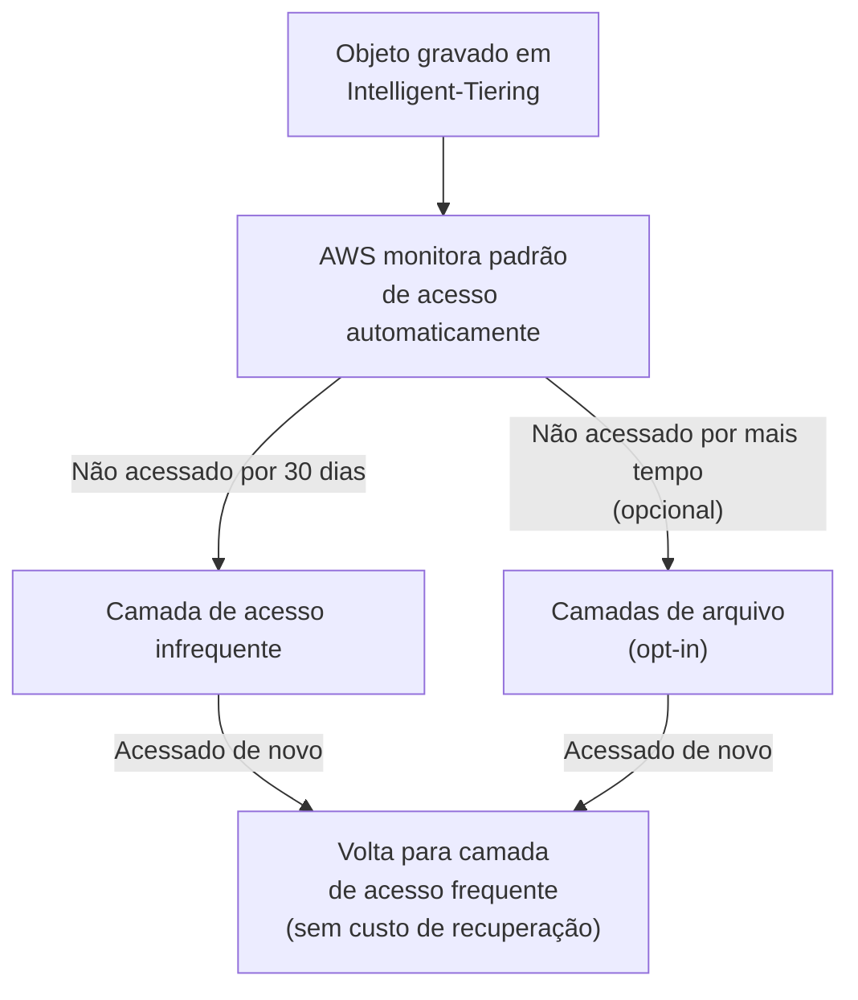
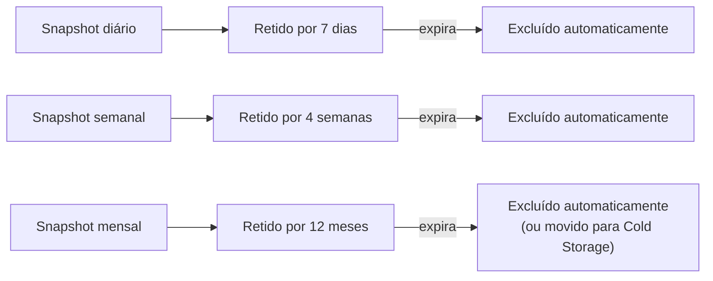
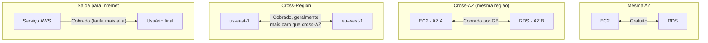
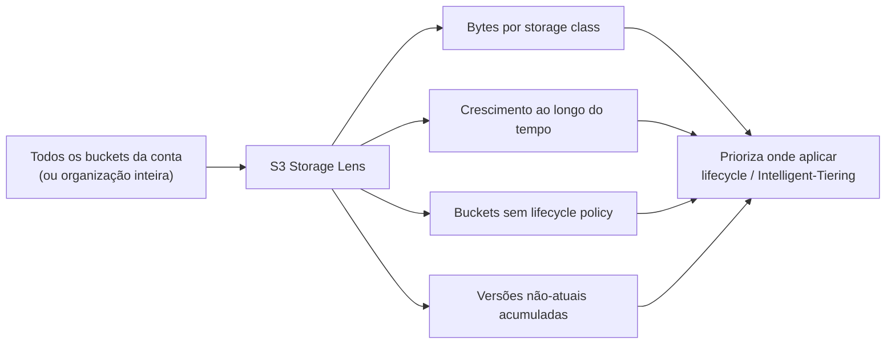
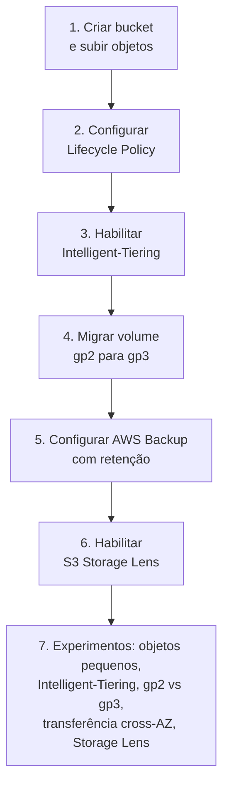

# Estratégias de Custo em Storage (S3, EBS, Transferência de Dados) — Guia Completo (Teoria + Prática + Dia a Dia)

## 0. Por que storage é um dos itens mais "invisíveis" da fatura

Diferente de compute, onde o custo é óbvio (você vê a instância ligada), storage tende a **crescer silenciosamente**: dados se acumulam, snapshots antigos nunca são apagados, objetos ficam parados na classe mais cara do S3 por anos sem ninguém revisar. É comum uma empresa descobrir, ao auditar a fatura, que uma fração enorme do custo de storage é dado "morto" — logs antigos, backups de backups, snapshots órfãos de instâncias já deletadas.

Este arquivo assume que você já conhece a mecânica técnica de S3, EBS e snapshots (esse detalhe está nos arquivos de fundamentos, e em especial `Dominio3-Performance/03-S3-Storage-Classes-e-Performance.md` para o detalhe técnico completo das classes de storage do S3). Aqui o foco é: **como usar essas mesmas features como ferramenta deliberada de redução de custo**, e um ponto que costuma pesar mais do que as pessoas esperam — o custo de **transferência de dados**.


*A pergunta central de custo em storage: o padrão de acesso ao dado ao longo do tempo determina onde ele deveria estar armazenado.*

---

## 1. S3 Storage Class + Lifecycle Policy como ferramenta de custo

A escolha de storage class é, na essência, uma troca entre **custo de armazenamento por GB** e **custo/latência de acesso** — S3 Standard é a mais cara para guardar, mas a mais barata/rápida para acessar; classes de arquivo (Glacier em suas variações) invertem essa equação: armazenamento muito mais barato, mas acesso mais lento e/ou com custo de recuperação. O detalhe técnico de cada classe (durabilidade, disponibilidade, latência de recuperação, mínimo de retenção) está em `Dominio3-Performance/03-S3-Storage-Classes-e-Performance.md` — aqui o ponto é como transformar isso em economia real.

**Lifecycle Policies** automatizam a transição de objetos entre classes (e a expiração/exclusão) com base na **idade do objeto**, sem intervenção manual. Um padrão extremamente comum:

1. Objeto é gravado em **S3 Standard** (acesso frequente logo após a criação — ex: logs recentes, uploads recentes de usuários).
2. Após 30 dias sem necessidade de acesso frequente, transiciona para **S3 Standard-IA** ou **S3 One Zone-IA** (se a perda de uma AZ for aceitável para esse dado, ex: cópias secundárias).
3. Após 90 dias, transiciona para **S3 Glacier Flexible Retrieval** (dados de compliance/auditoria raramente acessados).
4. Após 1-2 anos, transiciona para **S3 Glacier Deep Archive** (o mais barato, para retenção legal de longo prazo).
5. Após o período de retenção definido (ex: 7 anos, por exigência regulatória), o objeto é **expirado** (excluído automaticamente).

**O que muita gente erra na prova e no trabalho:** aplicar lifecycle policy em buckets com objetos **pequenos** sem considerar o custo mínimo de armazenamento por objeto que algumas classes de arquivo impõem (existe uma cobrança mínima equivalente a um tamanho mínimo por objeto nas classes Glacier) — para muitos objetos pequenos, isso pode anular o benefício da transição. Nesses casos, agregar objetos pequenos antes de arquivar (ex: compactar em um `.zip`/`.tar` maior) costuma ser mais econômico do que transicionar cada objeto individualmente.


*Fluxo típico de lifecycle policy: cada transição é configurada por regra, baseada na idade do objeto desde a criação (ou desde a última transição).*

---

## 2. S3 Intelligent-Tiering — otimização automática, sem esforço manual

Lifecycle policies exigem que você **saiba de antemão** o padrão de acesso dos seus dados (ex: "depois de 30 dias, ninguém mais acessa"). Isso funciona bem para dados previsíveis (logs, backups), mas falha para dados com **padrão de acesso imprevisível** — onde às vezes um objeto antigo volta a ser acessado sem aviso (ex: um documento de cliente que fica meses parado e de repente é reaberto).

O **S3 Intelligent-Tiering** resolve isso monitorando o padrão de acesso de **cada objeto individualmente** e movendo-o automaticamente entre camadas de acesso (frequente, infrequente, e opcionalmente arquivo) conforme o comportamento real — sem você precisar prever nada, e **sem custo de recuperação** quando um objeto "frio" volta a ser acessado (diferente de Glacier, onde recuperação antecipada tem custo).

**O trade-off:** existe uma **pequena taxa de monitoramento por objeto/mês** cobrada pelo Intelligent-Tiering, independente de haver ou não transição de camada. Para poucos objetos grandes, essa taxa é irrelevante perto da economia gerada. Para **muitos objetos pequenos**, a taxa de monitoramento por objeto pode comer a economia — o mesmo problema de objetos pequenos citado na seção anterior, mas aqui é uma taxa fixa por objeto monitorado, não um mínimo de tamanho cobrado.

**No dia a dia:** Intelligent-Tiering é a escolha padrão quando você **não tem certeza** do padrão de acesso, ou quando ele varia demais para confiar numa regra fixa de lifecycle — é literalmente "otimização de custo no piloto automático". Quando você **tem certeza** do padrão de acesso (ex: "isso é log de auditoria, ninguém acessa depois de 90 dias, ponto final"), uma lifecycle policy manual tende a ser mais barata, porque evita pagar a taxa de monitoramento por um comportamento que você já conhece.


*Intelligent-Tiering move objetos automaticamente com base no comportamento real, sem custo de recuperação ao "esquentar" de novo — em troca de uma pequena taxa de monitoramento por objeto.*

---

## 3. EBS — escolha do tipo de volume por custo

Além das diferenças de performance entre tipos de volume EBS (já cobertas nos fundamentos), existe um ângulo puramente de custo que vale destacar: **gp3 é, no caso geral, mais barato que gp2 para o mesmo nível de desempenho**.

O motivo é estrutural: no gp2, IOPS é **atrelado ao tamanho do volume** (você ganha mais IOPS só aumentando o volume, mesmo que não precise do espaço extra). No gp3, IOPS e throughput são **configuráveis independentemente do tamanho**, com uma baseline incluída no preço (geralmente 3.000 IOPS e 125 MB/s) e a opção de comprar mais IOPS/throughput separadamente, sem precisar pagar por espaço que você não vai usar.

**Na prática:** se você tem um volume gp2 de 500GB só porque precisava de mais IOPS (não porque precisava dos 500GB de espaço), migrar para gp3 permite manter a IOPS necessária com um volume do tamanho real que você precisa — reduzindo custo em duas frentes ao mesmo tempo (preço por GB do gp3 já é menor, e você não paga por espaço desnecessário).

**No dia a dia:** a migração de gp2 para gp3 pode ser feita **sem downtime**, via modificação do volume (`modify-volume`), o que faz dela uma das otimizações de custo mais "de graça" que existem — baixo risco, sem necessidade de janela de manutenção, ganho quase imediato.

### Lifecycle de snapshots

Snapshots do EBS são incrementais (só armazenam blocos alterados desde o último snapshot), mas isso não impede que eles se acumulem indefinidamente e virem uma fonte de custo esquecida — principalmente snapshots automáticos criados por rotinas antigas que ninguém revisa.

**Boas práticas de custo:**
- **Excluir snapshots antigos e órfãos** — snapshots de volumes/instâncias que já não existem mais, mas cujo snapshot nunca foi limpo.
- Usar o **AWS Backup** com uma **política de retenção definida** (ex: manter diários por 7 dias, semanais por 4 semanas, mensais por 12 meses, depois excluir) — em vez de scripts caseiros de snapshot que "esquecem" de limpar.
- Considerar mover snapshots pouco acessados para **níveis de armazenamento de arquivo do próprio AWS Backup** (Cold Storage), quando o requisito é só retenção para compliance, não recuperação rápida.


*Política de retenção típica no AWS Backup — snapshots são excluídos automaticamente ao expirar, evitando acúmulo indefinido.*

---

## 4. Custo de transferência de dados — o item que pega todo mundo de surpresa

Esse é um dos pontos mais subestimados no desenho de arquitetura: **onde** os dados trafegam importa tanto quanto **quanto** dado trafega. A AWS cobra de forma bem diferente dependendo da "distância" lógica entre origem e destino.

| Tipo de transferência | Custo |
|---|---|
| **Dentro da mesma AZ** (ex: EC2 → RDS na mesma AZ, usando IP privado) | Gratuito |
| **Entre AZs diferentes, mesma região** (cross-AZ) | Cobrado (por GB, nos dois sentidos — saída de uma AZ e entrada na outra) |
| **Entre regiões diferentes** (cross-region) | Cobrado, e geralmente mais caro que cross-AZ |
| **Saída para a internet** (egress) | Cobrado, com a tarifa mais alta entre as opções (varia por volume, com desconto em faixas maiores) |
| **Entrada da internet** (ingress) | Gratuito, na grande maioria dos casos |

**Por que isso importa tanto no desenho de arquitetura:** arquiteturas que distribuem componentes "por segurança" ou "por resiliência" entre múltiplas AZs — o que é uma prática correta e recomendada — geram tráfego cross-AZ constante entre camadas que se comunicam bastante (ex: aplicação em uma AZ conversando o tempo todo com banco de dados em outra). Isso é um trade-off real: mais resiliência geralmente significa mais tráfego cross-AZ, que tem custo. A resposta não é "evite multi-AZ para economizar" (isso sacrificaria disponibilidade por pouca economia, raramente vale a pena) — é **estar ciente do custo** e, quando fizer sentido, desenhar para reduzir tráfego desnecessário entre AZs/regiões (ex: cache local, réplicas de leitura na mesma AZ do consumidor, processamento feito o mais perto possível do dado).

**Egress para a internet** é tipicamente o item mais caro da tabela, e o motivo pelo qual arquiteturas que servem muito conteúdo para usuários finais colocam **CloudFront** na frente — não só por performance/latência, mas porque o preço de saída de dados via CloudFront costuma ser mais vantajoso do que saída direta de EC2/S3 para a internet, especialmente em volume alto.

**Pegadinha clássica de prova:** transferência de dados **de dentro de uma VPC para um serviço AWS via VPC Endpoint** (Gateway ou Interface) evita o tráfego passar pela internet, e em vários casos reduz ou elimina custo de NAT Gateway/egress que existiria se o tráfego saísse via NAT Gateway para acessar o serviço AWS publicamente. Esse é um motivo de custo (além do motivo de segurança) para usar VPC Endpoints com serviços como S3 e DynamoDB.


*Custo de transferência cresce com a "distância" lógica: grátis dentro da AZ, cobrado entre AZs, mais cobrado entre regiões, mais caro ainda na saída para a internet.*

---

## 5. S3 Storage Lens — visibilidade de custo de armazenamento

Um problema recorrente em contas com muitos buckets/times é a falta de visibilidade: ninguém sabe exatamente **onde** o volume de dados está crescendo, quais buckets têm objetos antigos parados na classe errada, ou quais times estão gerando mais custo de storage.

O **S3 Storage Lens** resolve isso agregando métricas de uso e atividade de todos os buckets da conta (ou de uma organização inteira, via AWS Organizations) num dashboard único, com métricas como: total de bytes armazenados por classe de storage, contagem de objetos, tendência de crescimento ao longo do tempo, buckets sem lifecycle policy configurada, versões não-atuais acumuladas (um caso clássico de custo escondido: versionamento de bucket ligado sem lifecycle limpando versões antigas).

**No dia a dia:** o Storage Lens é frequentemente o primeiro passo de uma auditoria de custo de storage — ele aponta rapidamente "esses 5 buckets concentram 80% do crescimento e nenhum deles tem lifecycle policy", o que direciona onde aplicar as otimizações das seções anteriores (lifecycle, Intelligent-Tiering) com maior impacto por esforço.


*Storage Lens agrega visibilidade entre buckets/contas para direcionar onde otimizar primeiro.*

---

## 6. Conectando com os outros domínios da prova

- **Performance:** a escolha de storage class e tipo de EBS também é uma decisão de performance (latência de acesso, IOPS disponível) — o detalhe técnico completo está em `Dominio3-Performance/03-S3-Storage-Classes-e-Performance.md`. Este arquivo foca só no ângulo de custo da mesma decisão.
- **Resiliência:** classes One Zone (S3 One Zone-IA) e volumes EBS sem snapshot trocam resiliência por custo menor — vale só para dados que você pode perder ou recriar sem impacto sério.
- **Segurança:** VPC Endpoints, além de reduzirem custo de transferência, também reduzem exposição de tráfego à internet pública — a mesma decisão serve dois domínios ao mesmo tempo.

---

# 🧪 Laboratório prático (para executar na AWS)

## Objetivo
Configurar lifecycle policy e Intelligent-Tiering num bucket S3, migrar um volume gp2 para gp3, e visualizar métricas de custo com Storage Lens.

### Passo 1 — Criar um bucket de teste e subir objetos
```bash
aws s3 mb s3://meu-bucket-custo-lab
aws s3 cp arquivo-teste.txt s3://meu-bucket-custo-lab/logs/arquivo-teste.txt
```

### Passo 2 — Configurar uma Lifecycle Policy
Console → S3 → bucket → **Management** → **Create lifecycle rule**
- Nome: `arquivar-logs-antigos`
- Escopo: prefixo `logs/`
- Transição: para **Standard-IA** após 30 dias, para **Glacier Flexible Retrieval** após 90 dias
- Expiração: excluir após 365 dias

### Passo 3 — Habilitar Intelligent-Tiering num novo prefixo
Console → S3 → bucket → **Management** → **Create lifecycle rule** → **Transition current versions of objects between storage classes** → destino **Intelligent-Tiering**, aplicado a um prefixo `dados-imprevisiveis/`.

### Passo 4 — Migrar um volume EBS de gp2 para gp3
```bash
aws ec2 modify-volume --volume-id vol-XXXXXXXX --volume-type gp3
aws ec2 describe-volumes-modifications --volume-ids vol-XXXXXXXX
```

### Passo 5 — Configurar AWS Backup com política de retenção
Console → AWS Backup → **Create backup plan** → defina uma regra diária com retenção de 7 dias e uma regra mensal com retenção de 12 meses, associada ao volume/instância de teste.

### Passo 6 — Habilitar S3 Storage Lens
Console → S3 → **Storage Lens** → **Create dashboard** → escopo: conta inteira → habilite métricas avançadas (opcional, tem custo adicional) → aguarde a primeira geração de métricas (leva até 24h) e explore o dashboard.

### Passo 7 — Experimentos para fixar cada conceito
1. **Lifecycle com objetos pequenos:** suba 100 objetos pequenos (poucos KB cada) e compare o custo estimado de transicioná-los para Glacier contra o custo de compactá-los antes e transicionar um único arquivo maior.
2. **Intelligent-Tiering na prática:** suba um objeto, aguarde (ou simule) 30+ dias sem acesso, veja a mudança de camada no console, depois acesse o objeto de novo e confirme que não houve custo de recuperação.
3. **gp2 vs gp3:** compare o preço estimado no Pricing Calculator de um volume de 500GB gp2 (para atingir uma IOPS-alvo) contra um volume gp3 menor com a mesma IOPS configurada manualmente.
4. **Transferência cross-AZ:** lance duas instâncias EC2 em AZs diferentes na mesma VPC, transfira um arquivo grande entre elas via `scp`, e observe a cobrança de transferência de dados na fatura (via Cost Explorer, filtrando por "Data Transfer").
5. **Storage Lens:** identifique, no dashboard, qual prefixo/bucket concentra mais bytes sem lifecycle policy configurada.


*Sequência dos passos do laboratório prático.*

---

## Comandos AWS CLI úteis

```bash
# Criar/atualizar uma lifecycle policy a partir de um JSON
aws s3api put-bucket-lifecycle-configuration \
  --bucket meu-bucket-custo-lab \
  --lifecycle-configuration file://lifecycle.json

# Ver a lifecycle policy configurada num bucket
aws s3api get-bucket-lifecycle-configuration --bucket meu-bucket-custo-lab

# Migrar um volume EBS de gp2 para gp3 (sem downtime)
aws ec2 modify-volume --volume-id vol-XXXXXXXX --volume-type gp3 --iops 3000 --throughput 125

# Listar snapshots órfãos (volume de origem já não existe) exige cruzar duas listagens:
aws ec2 describe-snapshots --owner-ids self --query 'Snapshots[*].[SnapshotId,VolumeId]'
aws ec2 describe-volumes --query 'Volumes[*].VolumeId'

# Criar um backup plan no AWS Backup com política de retenção
aws backup create-backup-plan --backup-plan file://backup-plan.json

# Gerar/exportar um relatório do S3 Storage Lens (via console é mais comum; CLI para configuração)
aws s3control get-storage-lens-configuration \
  --account-id 111122223333 \
  --config-id default-dashboard

# Ver custo de transferência de dados no Cost Explorer, filtrado por serviço
aws ce get-cost-and-usage \
  --time-period Start=2026-07-01,End=2026-08-01 \
  --granularity MONTHLY \
  --metrics "UnblendedCost" \
  --filter '{"Dimensions":{"Key":"USAGE_TYPE_GROUP","Values":["EC2: Data Transfer"]}}'
```

---

## Tabela de decisão rápida (prova + dia a dia)

| Cenário | Resposta provável |
|---|---|
| Padrão de acesso a objetos é previsível e conhecido (ex: logs, backups) | Lifecycle Policy manual |
| Padrão de acesso a objetos é imprevisível/variável | S3 Intelligent-Tiering |
| Muitos objetos pequenos a arquivar | Compactar antes de transicionar (evita custo mínimo/taxa por objeto) |
| Volume EBS gp2 dimensionado só por causa de IOPS, não por espaço | Migrar para gp3 (mesma IOPS configurável, volume menor, mais barato) |
| Snapshots antigos se acumulando sem controle | AWS Backup com política de retenção definida |
| Comunicação constante entre camadas em AZs diferentes | Ciente do custo cross-AZ; considerar redesenho se o volume for alto |
| Servir muito conteúdo estático para usuários finais | CloudFront na frente (reduz custo de egress direto) |
| Acesso de dentro da VPC a S3/DynamoDB | VPC Endpoint (reduz custo de NAT Gateway/egress) |
| Falta de visibilidade sobre onde o storage está crescendo | S3 Storage Lens |
| Bucket com versionamento ligado e custo de storage crescendo sem explicação aparente | Verificar lifecycle de versões não-atuais (causa comum e esquecida) |
