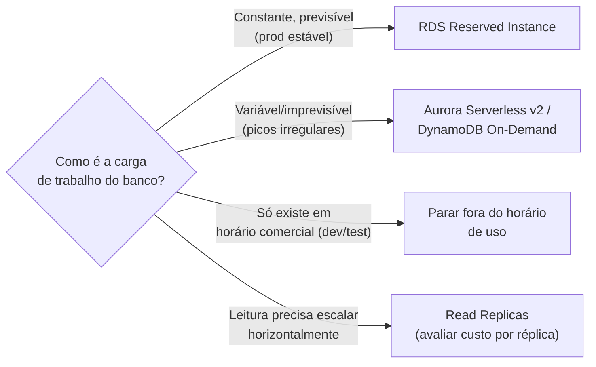
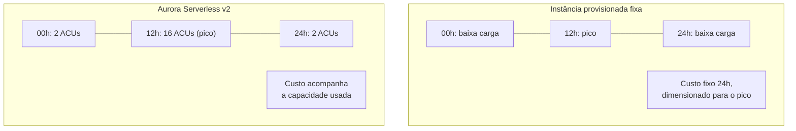
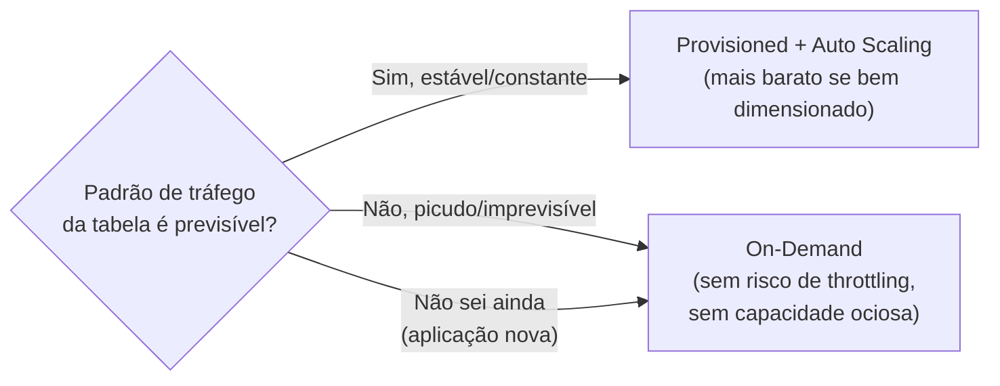
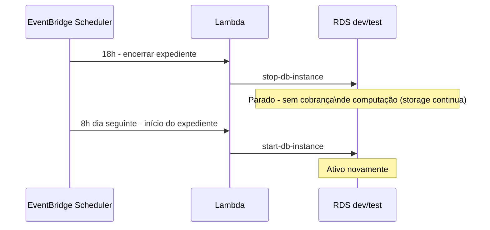
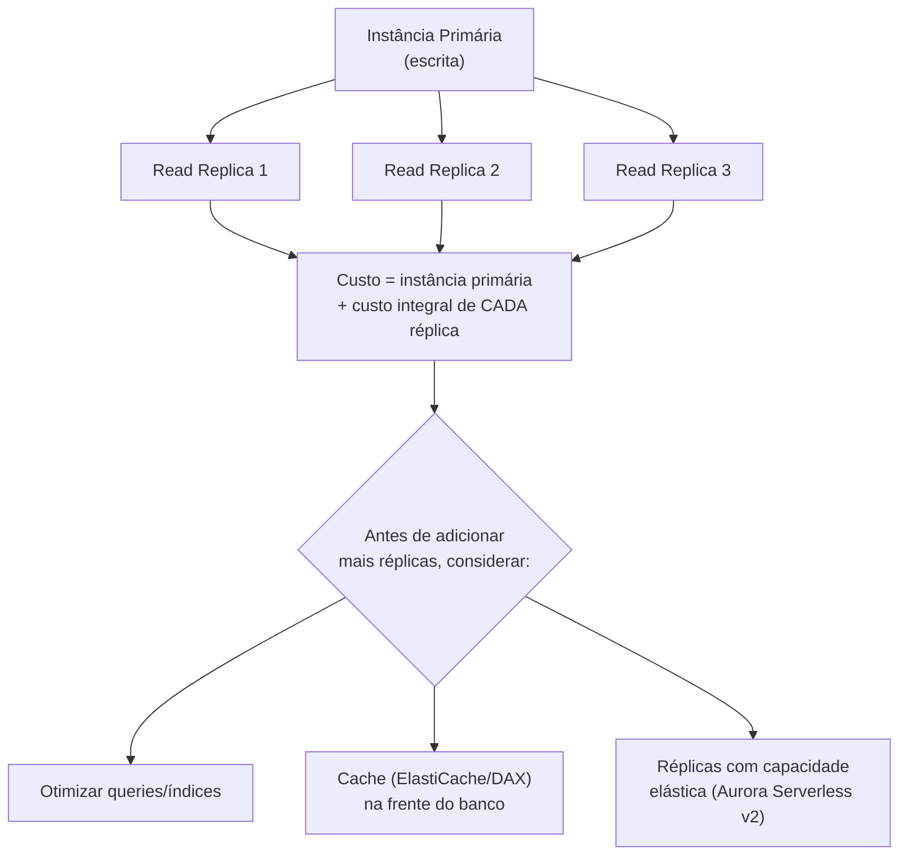
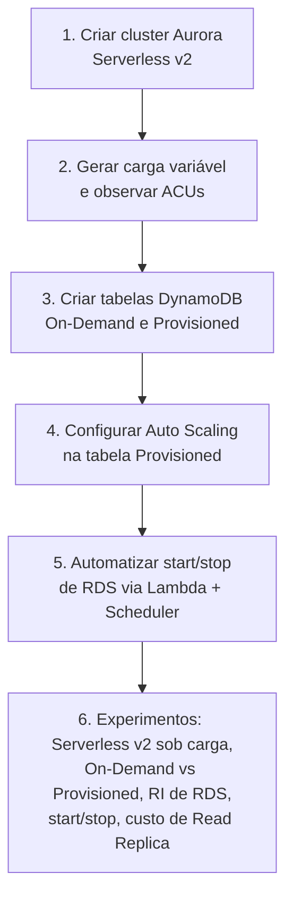

# Estratégias de Custo em Banco de Dados (RDS, Aurora, DynamoDB) — Guia Completo (Teoria + Prática + Dia a Dia)

## 0. Por que banco de dados costuma ser subestimado na conta de custo

Instâncias de banco de dados tendem a rodar 24/7 mesmo quando a carga de trabalho ao redor delas é variável — diferente de servidores de aplicação, que muitas vezes já têm Auto Scaling reduzindo capacidade fora de pico, o banco costuma ficar "do jeito que foi provisionado" indefinidamente, porque desligar ou redimensionar um banco dá mais medo (risco de indisponibilidade, de perda de dado, de impacto em produção). Esse medo é legítimo, mas também é exatamente o motivo pelo qual bancos de dados acumulam desperdício de custo com mais facilidade que outras camadas.

Este arquivo assume que você já conhece a mecânica de RDS, Aurora e DynamoDB (fundamentos técnicos cobertos em outros arquivos do repositório) — aqui o foco é: **quais decisões de configuração e modelo de compra reduzem essa fatura sem comprometer a operação**.


*A pergunta central de custo em banco de dados: previsibilidade da carga determina se vale mais comprometer-se (RI) ou pagar por uso (Serverless/On-Demand).*

---

## 1. RDS Reserved Instances

Mesma lógica das Reserved Instances de EC2 (cobertas em `Dominio4-Custo/01-Estrategias-de-Custo-Compute.md`): você se compromete com um tipo de instância de banco de dados específico por um termo (1 ou 3 anos), com opções de pagamento (All/Partial/No Upfront), em troca de um desconto substancial (geralmente na faixa de até ~60-70% comparado a On-Demand, variando por engine/região/termo).

**Diferenças relevantes em relação a RI de EC2:**
- RI de RDS é específica por **engine de banco de dados** (MySQL, PostgreSQL, Aurora, etc.) — você não pode comprar uma RI de RDS MySQL e aplicar o desconto a uma instância PostgreSQL.
- O desconto do RI cobre **a instância de computação do banco**, não o storage nem I/O — esses continuam sendo cobrados à parte, independente do modelo de compra da instância.
- Não existe um equivalente direto de "Convertible RI" tão flexível quanto em EC2 para todos os cenários — a troca de tipo de instância dentro do termo é mais limitada.

**No dia a dia:** RI de RDS faz sentido para o banco de **produção estável** — aquele que você sabe que vai continuar rodando com o mesmo perfil de instância pelos próximos 1-3 anos. Para bancos de dev/test/staging, que idealmente nem ficam ligados o tempo todo (ver seção 4), RI não faz sentido — você estaria se comprometendo com um recurso que nem deveria estar ligado na maior parte do tempo.

---

## 2. Aurora Serverless v2 — pagando só pela capacidade usada

Aurora Serverless v2 resolve o problema de bancos com carga **variável ou imprevisível**, onde provisionar para o pico significa pagar por capacidade ociosa na maior parte do tempo, e provisionar para a média significa risco de degradação nos picos.

Ao invés de escolher um tipo de instância fixo, você define um **intervalo de capacidade** (em ACUs — Aurora Capacity Units, unidade que combina CPU e memória), e o Aurora ajusta a capacidade automaticamente dentro desse intervalo, em segundos, conforme a demanda real — sem downtime, sem intervenção manual, e você paga pela capacidade efetivamente consumida, não por um tipo de instância fixo ligado 24/7.

**Onde isso realmente compensa:**
- Aplicações com tráfego **imprevisível** ou com picos esporádicos difíceis de prever com Auto Scaling tradicional de banco (que, diferente de EC2, é mais limitado).
- Ambientes de **desenvolvimento/teste** com uso intermitente, onde não vale a pena manter uma instância de tamanho fixo ligada o tempo todo.
- Aplicações **multi-tenant** ou SaaS onde cada cliente tem um padrão de uso diferente e picos em horários distintos.
- Cargas novas, onde você **ainda não sabe** qual vai ser o padrão de uso real (evita superdimensionar "por segurança" logo de início).

**Trade-off a considerar:** para uma carga **constante e alta**, uma instância provisionada tradicional com Reserved Instance tende a ser mais barata que Aurora Serverless v2 — o mesmo princípio já visto em compute: pague por uso quando a carga é variável, comprometa-se quando a carga é constante.


*Instância fixa é dimensionada para o pico e cobra isso o tempo todo; Aurora Serverless v2 escala a capacidade (e o custo) junto com a demanda real.*

---

## 3. DynamoDB — On-Demand vs Provisioned com Auto Scaling

O DynamoDB tem dois modelos de capacidade com uma lógica de custo bem diferente entre si — vale entender o trade-off (o mecanismo técnico de cada modo já está coberto nos fundamentos do DynamoDB).

| Modelo | Como cobra | Melhor para |
|---|---|---|
| **On-Demand** | Por requisição de leitura/escrita real, sem capacidade pré-definida | Carga imprevisível, picos difíceis de antecipar, aplicações novas sem histórico de uso |
| **Provisioned com Auto Scaling** | Por capacidade reservada (RCU/WCU), com Auto Scaling ajustando dentro de limites min/max configurados | Carga com padrão relativamente previsível, onde capacidade provisionada + desconto por compromisso (Reserved Capacity) reduz custo abaixo do On-Demand |

**A lógica de custo em detalhe:** On-Demand tem preço por requisição mais alto (comparado ao custo equivalente por requisição do modo Provisioned), mas você não paga nada por capacidade ociosa — é **custo por uso puro**. Provisioned é mais barato por requisição *se* a capacidade contratada for de fato utilizada — o risco é pagar por capacidade provisionada que fica ociosa em horários de baixa demanda, motivo pelo qual Auto Scaling é praticamente obrigatório em Provisioned (sem ele, você volta a ter o problema clássico de "provisionar para o pico e pagar isso 24/7").

**No dia a dia:** a decisão segue o mesmo padrão dos outros serviços deste arquivo — **previsibilidade de custo vs custo por uso**:
- Tabelas com tráfego **estável e conhecido** (ex: uma tabela de configuração acessada em volume constante) → Provisioned com Auto Scaling costuma sair mais barato.
- Tabelas com tráfego **picudo, sazonal ou imprevisível** (ex: uma tabela que recebe tráfego de campanhas de marketing esporádicas) → On-Demand evita tanto o desperdício de capacidade ociosa quanto o risco de throttling em picos não previstos pelo Auto Scaling (que reage com um atraso, não é instantâneo).
- Aplicações **novas**, sem histórico de tráfego → comece em On-Demand, migre para Provisioned depois de entender o padrão real (mesmo raciocínio do right-sizing em compute: não se comprometa antes de ter dados).

**Detalhe técnico que pesa na decisão:** Auto Scaling do DynamoDB Provisioned reage a métricas do CloudWatch com um **atraso** (não é instantâneo como a elasticidade do On-Demand) — em picos muito abruptos e rápidos, isso pode gerar throttling temporário antes do Auto Scaling reagir. On-Demand escala essencialmente de forma instantânea para absorver esse tipo de pico, na maioria dos cenários.


*Escolha entre On-Demand e Provisioned segue a mesma lógica de "pague por uso vs comprometa-se" vista em compute.*

---

## 4. Parar instâncias RDS não-produtivas fora do horário de uso

Um dos desperdícios mais comuns e mais fáceis de resolver: bancos de **dev/test/homologação** rodando 24/7, mesmo sendo usados só em horário comercial (ex: 8h-18h, dias úteis) — pagando por ~16h/dia + fim de semana inteiro de tempo em que ninguém está usando.

O RDS permite **parar** uma instância (`stop-db-instance`), o que interrompe a cobrança da instância de computação (o storage continua sendo cobrado enquanto a instância existe, parada ou não — só a computação para de ser cobrada). Uma instância parada volta automaticamente após 7 dias (a AWS reinicia automaticamente por segurança, para evitar drift de patch/backup acumulado por tempo demais) — então essa estratégia funciona bem combinada com automação (Lambda + EventBridge Scheduler, ou simplesmente um schedule reaplicado) que para e inicia a instância nos horários certos, todo dia útil.

**No dia a dia:** essa é tipicamente uma das primeiras recomendações em qualquer auditoria de FinOps — "por que o RDS de dev está ligado às 3h de domingo?" quase sempre não tem boa resposta, e a correção é barata de implementar (uma automação simples de start/stop agendado).


*Automação de start/stop agendado para bancos não-produtivos, evitando pagar computação em horários sem uso.*

---

## 5. Custo de Read Replicas — cada réplica é uma instância cobrada à parte

Read Replicas são a estratégia padrão para escalar **leitura** horizontalmente (distribuindo queries de leitura entre várias réplicas, liberando a instância primária para escrita) — mecanismo já coberto nos fundamentos de RDS/Aurora. O ponto de custo que costuma passar despercebido: **cada réplica é uma instância de banco de dados completa, cobrada integralmente**, como se fosse uma instância independente (mesmo tipo/tamanho da primária, na maioria dos casos, embora você possa escolher um tipo menor).

Isso significa que "só adicionar mais réplicas" para resolver um gargalo de leitura tem um custo que **escala linearmente** com o número de réplicas — 3 réplicas do mesmo tipo da primária significam, grosso modo, o custo de 4 instâncias rodando (1 primária + 3 réplicas), não uma fração pequena adicional.

**Antes de escalar horizontalmente com mais réplicas, vale considerar:**
- **Right-sizing e otimização de query** primeiro — um gargalo de leitura às vezes é causado por queries mal otimizadas ou falta de índice, não por falta de capacidade real. Adicionar réplicas sem resolver isso multiplica o custo do problema em vez de resolvê-lo.
- **Cache na frente do banco** (ElastiCache/DAX) — para leituras repetitivas do mesmo dado, um cache pode absorver uma fração grande do tráfego de leitura a um custo bem menor que uma réplica completa de banco.
- **Aurora Serverless v2 nas réplicas** — em vez de réplicas com tamanho fixo, réplicas Aurora também podem escalar com a demanda, evitando pagar por capacidade de leitura ociosa em horários de baixo tráfego.

**No dia a dia:** é comum ver arquiteturas que foram adicionando réplicas ao longo do tempo para "resolver lentidão", sem nunca revisar se as réplicas antigas ainda são necessárias — outra fonte clássica de desperdício silencioso, parecida com snapshots esquecidos em storage.


*Cada Read Replica é uma instância cobrada integralmente — o custo escala linearmente com o número de réplicas.*

---

## 6. Conectando com os outros domínios da prova

- **Resiliência:** Read Replicas e Multi-AZ também são mecanismos de alta disponibilidade — a decisão de quantas réplicas manter é sempre uma tensão entre resiliência/performance de leitura e custo, não uma decisão puramente técnica.
- **Performance:** Aurora Serverless v2 e DynamoDB On-Demand também evitam degradação de performance em picos não previstos (diferente de capacidade fixa subdimensionada) — o mesmo mecanismo serve custo e performance ao mesmo tempo.
- **Segurança:** parar instâncias não-produtivas fora do horário de uso também reduz a superfície de ataque disponível (menos tempo com o banco acessível), um benefício de segurança colateral a uma decisão primariamente de custo.

---

# 🧪 Laboratório prático (para executar na AWS)

## Objetivo
Configurar Aurora Serverless v2, comparar DynamoDB On-Demand vs Provisioned, e automatizar start/stop de uma instância RDS de teste.

### Passo 1 — Criar um cluster Aurora Serverless v2
Console → RDS → **Create database** → Engine: **Aurora (MySQL ou PostgreSQL compatible)** → Capacity type: **Serverless v2** → defina o intervalo de ACUs (ex: mínimo 0.5, máximo 4) → crie o cluster.

### Passo 2 — Gerar carga variável e observar o ajuste de capacidade
Rode um script simples de queries repetidas contra o cluster (ex: via `mysql`/`psql` em loop) e observe no console RDS/CloudWatch a métrica `ServerlessDatabaseCapacity` subindo durante a carga e descendo depois.

### Passo 3 — Criar uma tabela DynamoDB em On-Demand e outra em Provisioned
```bash
aws dynamodb create-table \
  --table-name tabela-on-demand \
  --attribute-definitions AttributeName=id,AttributeType=S \
  --key-schema AttributeName=id,KeyType=HASH \
  --billing-mode PAY_PER_REQUEST

aws dynamodb create-table \
  --table-name tabela-provisioned \
  --attribute-definitions AttributeName=id,AttributeType=S \
  --key-schema AttributeName=id,KeyType=HASH \
  --billing-mode PROVISIONED \
  --provisioned-throughput ReadCapacityUnits=5,WriteCapacityUnits=5
```

### Passo 4 — Configurar Auto Scaling na tabela Provisioned
Console → DynamoDB → tabela `tabela-provisioned` → **Additional settings** → Auto Scaling → defina min/max de RCU/WCU e o alvo de utilização (ex: 70%).

### Passo 5 — Automatizar start/stop de uma instância RDS de teste
Crie uma função Lambda simples que chama `stop-db-instance`/`start-db-instance`, e agende via **EventBridge Scheduler** (ex: parar às 20h, iniciar às 7h, dias úteis).

```python
import boto3

def lambda_handler(event, context):
    rds = boto3.client("rds")
    acao = event.get("acao")  # "start" ou "stop"
    if acao == "stop":
        rds.stop_db_instance(DBInstanceIdentifier="meu-banco-dev")
    elif acao == "start":
        rds.start_db_instance(DBInstanceIdentifier="meu-banco-dev")
```

### Passo 6 — Experimentos para fixar cada conceito
1. **Aurora Serverless v2 sob carga:** gere um pico artificial de queries e meça em quanto tempo a capacidade (ACUs) se ajusta, comparando com o comportamento (mais lento) do Auto Scaling do DynamoDB Provisioned.
2. **On-Demand vs Provisioned no Pricing Calculator:** simule o custo mensal das duas tabelas do Passo 3 para um volume fixo de requisições, e depois para um volume picudo — observe em qual cenário cada modelo vence.
3. **RI de RDS:** no Pricing Calculator, compare o custo de uma instância RDS On-Demand rodando 24/7 por 1 ano contra uma Reserved Instance de 1 ano No Upfront para a mesma instância.
4. **Start/stop automatizado:** confirme que a instância parada no Passo 5 realmente para de gerar custo de computação no Cost Explorer (filtrando por dia), e observe o retorno automático da AWS após 7 dias parada, caso a automação não a reinicie antes.
5. **Custo de Read Replica:** adicione uma read replica a um banco de teste e compare, no Cost Explorer, o custo antes e depois — confirme que é aproximadamente o custo de uma instância inteira adicional.


*Sequência dos passos do laboratório prático.*

---

## Comandos AWS CLI úteis

```bash
# Parar e iniciar uma instância RDS (não-produtiva)
aws rds stop-db-instance --db-instance-identifier meu-banco-dev
aws rds start-db-instance --db-instance-identifier meu-banco-dev

# Ver Reserved Instances de RDS ativas na conta
aws rds describe-reserved-db-instances

# Comprar uma Reserved Instance de RDS a partir de uma oferta
aws rds purchase-reserved-db-instances-offering \
  --reserved-db-instances-offering-id XXXXXXXX-XXXX-XXXX-XXXX-XXXXXXXXXXXX \
  --db-instance-count 1

# Criar/alterar cluster Aurora para Serverless v2
aws rds modify-db-cluster \
  --db-cluster-identifier meu-cluster-aurora \
  --serverless-v2-scaling-configuration MinCapacity=0.5,MaxCapacity=8

# Alterar o billing mode de uma tabela DynamoDB existente
aws dynamodb update-table \
  --table-name minha-tabela \
  --billing-mode PAY_PER_REQUEST

# Configurar Auto Scaling numa tabela DynamoDB Provisioned
aws application-autoscaling register-scalable-target \
  --service-namespace dynamodb \
  --resource-id "table/tabela-provisioned" \
  --scalable-dimension "dynamodb:table:ReadCapacityUnits" \
  --min-capacity 5 --max-capacity 100

# Criar uma read replica de uma instância RDS
aws rds create-db-instance-read-replica \
  --db-instance-identifier meu-banco-replica-1 \
  --source-db-instance-identifier meu-banco-prod

# Ver custo de RDS por instância no Cost Explorer
aws ce get-cost-and-usage \
  --time-period Start=2026-07-01,End=2026-08-01 \
  --granularity MONTHLY \
  --metrics "UnblendedCost" \
  --filter '{"Dimensions":{"Key":"SERVICE","Values":["Amazon Relational Database Service"]}}' \
  --group-by Type=DIMENSION,Key=USAGE_TYPE
```

---

## Tabela de decisão rápida (prova + dia a dia)

| Cenário | Resposta provável |
|---|---|
| Banco de produção com carga estável e previsível por 1-3 anos | RDS Reserved Instance |
| Carga de banco variável/imprevisível, picos difíceis de antecipar | Aurora Serverless v2 |
| Tabela DynamoDB com tráfego picudo/sazonal ou aplicação nova | DynamoDB On-Demand |
| Tabela DynamoDB com tráfego estável e conhecido | DynamoDB Provisioned + Auto Scaling |
| Banco de dev/test/homologação usado só em horário comercial | Parar fora do horário (automação start/stop) |
| Gargalo de leitura, antes de adicionar mais réplicas | Revisar queries/índices, considerar cache (ElastiCache/DAX) primeiro |
| Precisa mesmo escalar leitura horizontalmente | Read Replicas, cientes de que cada uma é cobrada como instância completa |
| Pico de tráfego muito abrupto e rápido em DynamoDB | On-Demand (Auto Scaling do Provisioned reage com atraso) |
| Réplicas de leitura com padrão de uso variável | Réplicas Aurora com capacidade elástica (Serverless v2) em vez de tamanho fixo |
