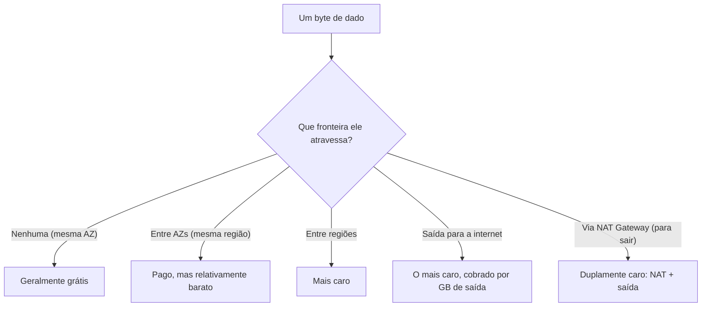
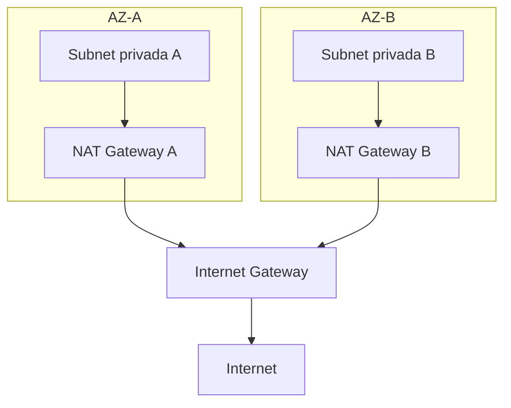
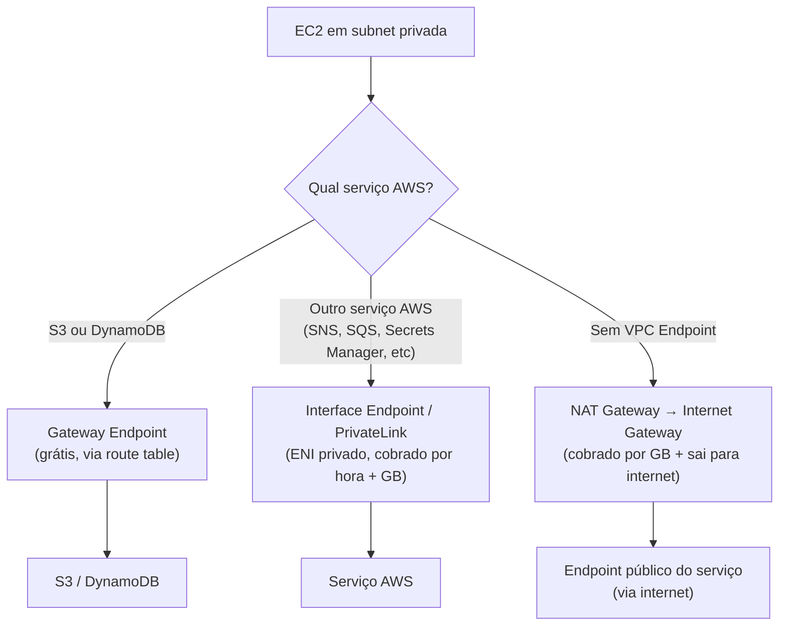
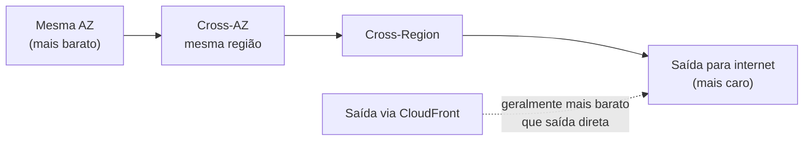
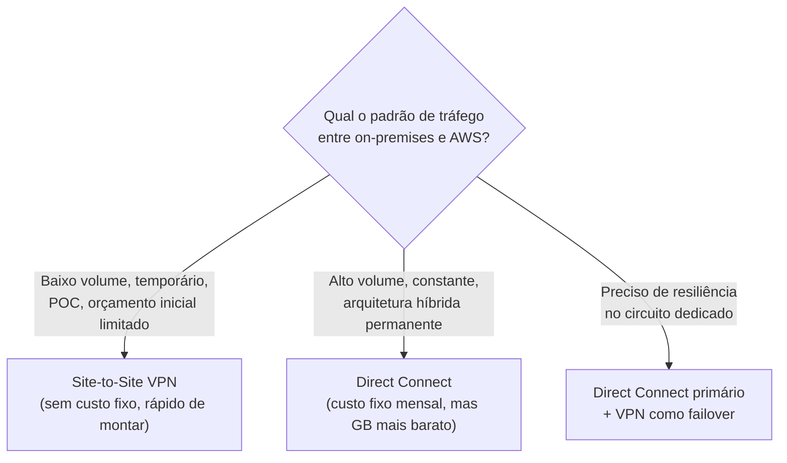
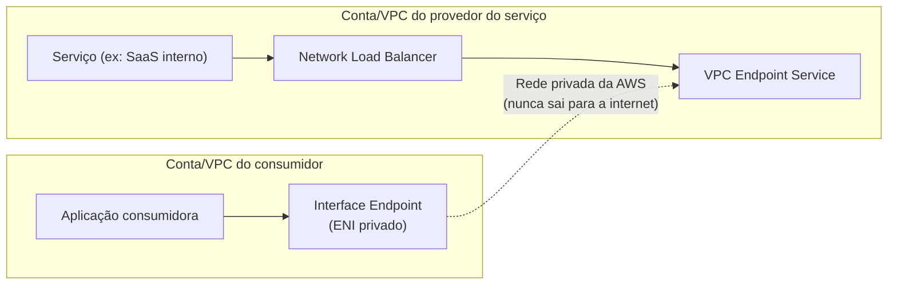
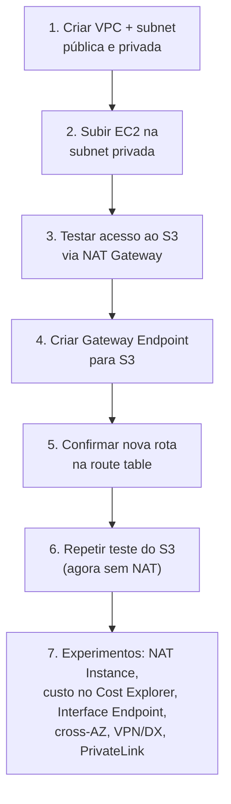

# Estratégias de Custo de Rede — Guia Completo (Teoria + Prática + Dia a Dia)

## 0. Por que rede é um dos maiores vilões silenciosos da fatura AWS

Quando alguém pensa em "reduzir custo na AWS", o primeiro instinto é olhar para o tamanho da instância EC2 ou o tipo de storage. Rede raramente é a primeira suspeita — e é exatamente por isso que ela costuma ser a maior surpresa negativa no fim do mês.

O motivo é estrutural: computação e storage você **vê** — está ali, um recurso com nome, visível no console. Transferência de dados é **invisível** — ninguém "cria" uma transferência de dados, ela só acontece como consequência de outras coisas acontecendo (uma Lambda chamando um S3, um EC2 replicando para outra AZ, uma resposta HTTP saindo para a internet). Ela não aparece no seu diagrama de arquitetura a menos que você desenhe especificamente pensando nisso.

Pense assim: cada vez que um byte atravessa uma fronteira — de uma AZ para outra, de uma região para outra, ou de dentro da AWS para a internet pública — existe uma chance de custo. Dentro da mesma fronteira (mesma AZ, mesmo serviço), geralmente é grátis ou muito barato. Quanto mais fronteiras o byte atravessa, mais caro fica.


*Quanto mais fronteiras um byte atravessa, maior a chance — e o custo — de cobrança de transferência de dados.*

O restante deste arquivo cobre as principais alavancas de custo de rede que aparecem tanto na prova quanto em arquiteturas reais: NAT Gateway vs NAT Instance, VPC Endpoints, o "mapa de preços relativos" de transferência de dados, Direct Connect vs VPN, e PrivateLink.

---

## 1. NAT Gateway vs NAT Instance — o trade-off clássico

### O problema que o NAT resolve

Uma instância numa **subnet privada** não tem IP público — por isso ela não consegue, por padrão, iniciar conexões para a internet (ex: baixar um pacote do sistema operacional, chamar uma API externa). Mas ela também não deveria ser alcançável **a partir** da internet — é assim que uma subnet privada garante segurança.

O NAT (Network Address Translation) resolve exatamente esse meio-termo: permite que a instância privada **inicie** conexões de saída para a internet (usando o IP público do próprio NAT como "disfarce"), mas ninguém de fora consegue iniciar uma conexão de entrada na direção da instância privada.

### NAT Gateway (gerenciado pela AWS)

É um recurso **totalmente gerenciado** — você não administra servidor nenhum, a AWS cuida de disponibilidade (dentro da AZ onde ele está) e escala automaticamente a banda conforme a demanda.

**Modelo de cobrança — e aqui está a pegadinha de custo mais importante da seção:**
- Cobrança **por hora** que o NAT Gateway está provisionado (independente de uso).
- Cobrança **por GB processado** que passa por ele — em ambas as direções (dado saindo e dado entrando de volta como resposta).

Isso significa que um NAT Gateway processando um volume alto e constante de tráfego pode ficar caro rapidamente — não é incomum ver o NAT Gateway como uma das maiores linhas da fatura em arquiteturas que fazem muita chamada de saída (ex: muitas instâncias baixando atualizações, chamando APIs externas, ou pior: usando o NAT para acessar S3/DynamoDB sem VPC Endpoint, como veremos na seção 2).

### NAT Instance (uma EC2 comum fazendo o papel de NAT)

É literalmente uma instância EC2 configurada para rotear tráfego (com **source/destination check desabilitado**), rodando uma AMI otimizada para isso (ou uma instância comum com `iptables`/`ip forwarding` configurado).

**Vantagem de custo:** você paga só o preço da instância EC2 (que pode ser pequena, ou até Spot para reduzir ainda mais) — sem cobrança adicional por GB processado. Para volumes de tráfego baixos e prováveis, isso pode sair **bem mais barato** que um NAT Gateway.

**O que você perde (e por que isso raramente compensa em produção séria):**
- **Você** é responsável por patchear, escalar (trocar para um tipo de instância maior manualmente ou configurar Auto Scaling) e garantir alta disponibilidade (colocar em múltiplas AZs, configurar failover).
- Se a instância cair, todo o tráfego de saída das subnets privadas que dependem dela para — até você substituir ou o Auto Scaling provisionar outra.
- É um único ponto de falha por padrão, a menos que você monte a arquitetura de HA manualmente (script de failover trocando a rota da route table).

### Quando cada um compensa, na prática

| Critério | NAT Gateway | NAT Instance |
|---|---|---|
| Gerenciamento | Totalmente gerenciado pela AWS | Você administra (patch, HA, escala) |
| Disponibilidade | Alta dentro da AZ (recomenda-se 1 por AZ) | Depende de você configurar HA |
| Escala de banda | Automática, até dezenas de Gbps | Limitada ao tipo de instância escolhido |
| Cobrança | Por hora + por GB processado | Só o custo da instância EC2 (+ Spot se quiser reduzir mais) |
| Melhor para | Produção, tráfego alto/imprevisível, times pequenos sem tempo para operar infra de rede | Ambientes de dev/teste, tráfego baixo e previsível, labs, times com tolerância a operar a própria infra |
| Suporta ser "bastion"/proxy customizado | Não — é uma caixa-preta gerenciada | Sim — você pode instalar software extra nela |

**O que muita gente erra na prova:** achar que NAT Instance está "obsoleto" ou "errado" como resposta. Não está — em cenários de **baixo custo e baixo tráfego** (ex: ambiente de estudo, dev, POC), a resposta esperada pode ser justamente NAT Instance, porque o enunciado geralmente destaca "menor custo possível" e "baixo volume de tráfego". A pegadinha oposta também existe: em cenário de **produção crítica com alta disponibilidade exigida**, a resposta certa é NAT Gateway (um por AZ), mesmo sendo mais caro — a prova está testando se você entende o trade-off, não só decorando "NAT Gateway é sempre melhor".

**No dia a dia:** a prática mais comum em produção séria é um **NAT Gateway por AZ** (não compartilhar um único NAT Gateway entre AZs) — isso evita que a subnet privada de uma AZ inteira fique sem saída para a internet se aquela AZ específica tiver problema, e também evita custo de transferência cross-AZ (ver seção 3) para chegar até o NAT.


*Um NAT Gateway por AZ evita ponto único de falha e evita custo extra de transferência cross-AZ até o NAT.*

---

## 2. VPC Endpoints — evitando pagar NAT/internet para falar com serviços AWS

### O problema

Sem um VPC Endpoint, uma instância numa subnet privada que precisa chamar o **S3** ou o **DynamoDB** (por exemplo) tem só um caminho: sair pela subnet privada → NAT Gateway → Internet Gateway → internet pública → (de volta) até o endpoint público do S3/DynamoDB. Isso significa:
- Pagar o custo **por GB processado** pelo NAT Gateway.
- O tráfego tecnicamente sai para a internet pública (mesmo indo para um serviço AWS), o que também pode ser um problema de **compliance/segurança**, não só de custo.

Um **VPC Endpoint** cria um caminho **privado** dentro da própria rede da AWS entre a sua VPC e o serviço AWS, sem passar pelo NAT Gateway nem pela internet pública. Isso resolve custo e segurança ao mesmo tempo.

### Gateway Endpoint

Existe hoje para dois serviços: **S3** e **DynamoDB**. Funciona adicionando uma **entrada na route table** da subnet apontando o tráfego destinado àquele serviço para o endpoint, em vez de para o NAT/Internet Gateway.

**Custo:** não tem cobrança adicional por hora nem por GB processado — é gratuito de usar. Essa é uma das razões pelas quais, sempre que o cenário envolve S3 ou DynamoDB acessado de dentro de uma VPC, a resposta de "melhor custo" quase sempre passa por Gateway Endpoint.

### Interface Endpoint (via PrivateLink)

Para a grande maioria dos outros serviços AWS (SNS, SQS, Secrets Manager, CloudWatch, Kinesis, ECS API, entre dezenas de outros). Funciona criando um **ENI (Elastic Network Interface) com IP privado** dentro da sua subnet, que "projeta" o serviço para dentro da sua VPC. Você aponta suas chamadas para esse endpoint privado (geralmente via DNS privado, que a AWS resolve automaticamente se você habilitar essa opção).

**Custo:** diferente do Gateway Endpoint, o Interface Endpoint **é cobrado** — por hora que está provisionado, por AZ, mais por GB processado. Ou seja: ele evita o custo do NAT Gateway, mas introduz o próprio custo. A vantagem de custo aparece quando o volume de tráfego é alto o suficiente para que o custo do NAT Gateway (por GB) supere o custo fixo + variável do Interface Endpoint — e mesmo quando o custo líquido é parecido, o ganho de segurança (tráfego nunca sai para a internet pública) geralmente já justifica o uso em produção.

### Comparando os dois tipos

| Característica | Gateway Endpoint | Interface Endpoint (PrivateLink) |
|---|---|---|
| Serviços suportados | Apenas S3 e DynamoDB | A maioria dos outros serviços AWS (e serviços de terceiros/próprios via PrivateLink) |
| Como funciona | Entrada na route table | ENI com IP privado na subnet |
| Custo | Gratuito | Cobrado por hora + por GB processado |
| Acesso via on-premises (VPN/Direct Connect) | Não | Sim |
| Resource Policy para restringir acesso | Sim | Sim |


*Sempre que possível, prefira Gateway Endpoint (grátis) ou Interface Endpoint em vez de deixar o tráfego sair pelo NAT Gateway.*

**Pegadinha clássica de prova:** um cenário descreve "reduzir custo de transferência de dados de instâncias EC2 privadas acessando S3" — a resposta certa quase sempre é **Gateway Endpoint para S3**, não Interface Endpoint, porque para S3 especificamente o Gateway Endpoint é gratuito e suficiente. Interface Endpoint só entra em jogo quando o serviço não é S3/DynamoDB, ou quando você precisa acessar o serviço a partir de fora da VPC (on-premises via Direct Connect/VPN).

**No dia a dia:** times maduros habilitam Gateway Endpoint para S3 e DynamoDB **por padrão** em toda VPC nova — é uma configuração de custo zero e ganho garantido (nunca existe motivo real para não usar, a menos que você especificamente precise que o tráfego passe pela internet por algum motivo incomum).

---

## 3. Tabela de custo relativo de transferência de dados

Não é possível (nem seguro) citar valores exatos de US$/GB aqui, porque eles mudam por região e ao longo do tempo. O que importa memorizar — para prova e para desenho de arquitetura — é a **ordem relativa de custo**, do mais barato para o mais caro:

| Tipo de transferência | Custo relativo | Observação |
|---|---|---|
| Dentro da mesma AZ (via IP privado) | Grátis (geralmente) | O cenário mais barato possível — por isso agrupar recursos que conversam muito na mesma AZ é uma otimização real |
| Entre AZs, mesma região | Baixo, mas cobrado (ida e volta) | É o custo "escondido" mais comum em arquiteturas multi-AZ — replicação de banco, chamadas entre serviços em AZs diferentes |
| Entre regiões diferentes | Mais alto que cross-AZ | Replicação cross-region (DR, S3 Cross-Region Replication) sempre carrega esse custo |
| Saída para a internet (Data Transfer OUT) | O mais caro por GB, e cresce por faixas (mais barato conforme o volume aumenta) | Entrada (dados entrando na AWS vindos da internet) costuma ser gratuita — só a saída é cobrada pesado |
| Saída via CloudFront (comparado a saída direta) | Geralmente mais barato que saída direta do serviço de origem (ex: direto do S3/EC2) para a internet | O CloudFront tem preços de saída próprios, mas historicamente mais vantajosos, além de reduzir a carga (e portanto o tráfego cobrado) na origem, já que respostas ficam em cache nos edge locations |


*Ordem relativa de custo de transferência — memorize a ordem, não valores exatos.*

**O que muita gente erra na prova:** achar que tráfego **de entrada** (upload/ingestão de dados vindos da internet para a AWS) é cobrado da mesma forma que saída. Não é — entrada é gratuita na esmagadora maioria dos casos; o modelo de cobrança de transferência de dados da AWS é fundamentalmente assimétrico, penalizando dados **saindo**.

**No dia a dia:** ao desenhar uma arquitetura multi-AZ para alta disponibilidade, é normal aceitar o custo de cross-AZ como parte do preço da resiliência — mas vale revisar se serviços que trocam volume muito alto de dados entre si (ex: um cluster de processamento distribuído) podem ser reorganizados para reduzir esse tráfego cross-AZ desnecessário, sem comprometer a disponibilidade.

---

## 4. Direct Connect vs VPN — custo fixo alto e previsível vs custo baixo de entrada

### O problema

Empresas que têm infraestrutura on-premises (datacenter próprio) e também usam a AWS frequentemente precisam de uma conexão de rede confiável e privada entre os dois ambientes — para migração de dados, arquiteturas híbridas, replicação, ou simplesmente porque parte do sistema ainda vive on-premises.

Existem duas formas principais de fazer essa conexão: **Site-to-Site VPN** e **Direct Connect**.

### Site-to-Site VPN

Cria um túnel **criptografado (IPsec) sobre a internet pública** entre o seu datacenter e a sua VPC. Não exige nenhum contrato especial com a AWS além de configurar o próprio recurso — você sobe um Virtual Private Gateway (ou Transit Gateway) do lado da AWS e um Customer Gateway do lado on-premises, e em minutos/horas o túnel está funcionando.

**Custo:** modelo simples de "pay-as-you-go" — cobrado por hora de conexão ativa (mais um custo pequeno de transferência de dados). **Não existe custo fixo de instalação nem contrato de longo prazo** — é o caminho de entrada mais barato e rápido para conectividade híbrida.

**Trade-off:** como viaja pela internet pública (mesmo criptografado), a **latência é variável e imprevisível**, e a banda é limitada (tipicamente até ~1.25 Gbps por túnel).

### Direct Connect

Uma conexão de rede **física e dedicada** entre o seu datacenter (ou um datacenter de parceiro/colocation) e a AWS, através de um provedor de Direct Connect — não passa pela internet pública em nenhum momento.

**Custo:** modelo oposto ao da VPN — existe um **custo fixo mensal** pela própria conexão dedicada (independente de uso) **mais** custo por transferência de dados (mas o custo por GB de transferência via Direct Connect tende a ser mais baixo do que a saída padrão para internet). Além disso, tipicamente há custo de setup inicial e possivelmente contratos com o provedor de colocation.

**Vantagem:** latência baixa e **consistente**, banda garantida e alta (de dezenas de Mbps até 100 Gbps dependendo do plano), sem competir com o tráfego da internet pública.

### Onde está o trade-off de custo, de fato

- Para volume de tráfego **baixo, esporádico ou fase inicial de migração**: VPN vence em custo, porque você não paga nada fixo além da hora de uso — não faz sentido pagar um circuito dedicado caro para um volume pequeno.
- Para volume de tráfego **alto e constante** (ex: replicação contínua de terabytes, arquitetura híbrida permanente com tráfego pesado todo santo dia): Direct Connect tende a compensar, porque o custo fixo mensal se dilui e o custo por GB transferido é mais baixo — a partir de um certo volume, a VPN (cobrando cheio por GB de saída padrão) fica mais cara que o Direct Connect.

| Critério | Site-to-Site VPN | Direct Connect |
|---|---|---|
| Caminho de rede | Internet pública (criptografado via IPsec) | Circuito físico dedicado, fora da internet pública |
| Custo inicial | Nenhum (ou mínimo) | Alto — custo fixo mensal do circuito + possível setup |
| Custo por uso | Por hora de conexão + transferência | Custo fixo + transferência (tarifa por GB mais baixa) |
| Tempo de provisionamento | Minutos a horas | Semanas a meses (depende do provedor) |
| Latência/banda | Variável, sujeita à internet pública | Consistente, garantida, alta |
| Melhor para | Baixo volume, POC, conectividade temporária, backup de um Direct Connect existente | Alto volume, arquitetura híbrida permanente, cargas sensíveis a latência |

**Uso real combinado:** uma prática comum é usar **Direct Connect como conexão primária e VPN como failover/backup** — se o circuito dedicado cair, o tráfego automaticamente pode seguir por um túnel VPN até o circuito voltar. Isso combina o melhor dos dois: performance/custo otimizados no dia a dia, resiliência quando algo falha.


*Volume e constância de tráfego decidem entre custo fixo alto (Direct Connect) e custo de entrada baixo (VPN).*

**O que muita gente erra na prova:** achar que Direct Connect é "sempre melhor" porque tem mais banda e menos latência. A prova frequentemente testa justamente o contrário: um cenário com orçamento limitado, prazo curto ou volume baixo tem VPN como resposta certa — Direct Connect é mais rápido e consistente, mas caro de montar e demorado de provisionar (o circuito físico pode levar semanas).

---

## 5. PrivateLink — reduzindo custo ao consumir serviços entre VPCs/contas

### O problema

Imagine que sua empresa tem múltiplas contas AWS (comum em arquiteturas com AWS Organizations) ou múltiplas VPCs, e um serviço rodando numa VPC/conta precisa ser consumido por outra. As opções "ingênuas" seriam:
- **VPC Peering** — funciona, mas expõe toda a rede de uma VPC para a outra (menos controle granular) e não resolve sozinho o problema de custo de transferência (ainda existe custo de transferência cross-VPC/cross-account, geralmente equivalente a cross-AZ ou cross-region dependendo do caso).
- Expor o serviço **publicamente na internet** e consumir de fora — funciona, mas tem o pior custo possível (saída para internet, a mais cara da tabela da seção 3) e o pior perfil de segurança.

O **AWS PrivateLink** resolve isso criando uma conexão privada, ponto a ponto, entre um consumidor (em uma VPC/conta) e um serviço (em outra VPC/conta) — usando exatamente o mesmo mecanismo do **Interface Endpoint** (seção 2), mas agora apontando para um **serviço customizado** (seu ou de um parceiro/SaaS) em vez de um serviço nativo da AWS.

### Como funciona, por cima

1. O provedor do serviço cria um **NLB (Network Load Balancer)** na frente do seu serviço, dentro da própria VPC.
2. O provedor cria um **VPC Endpoint Service** associado a esse NLB.
3. O consumidor cria um **Interface Endpoint** na própria VPC apontando para esse serviço (usando o nome do serviço ou um alias de DNS).
4. O tráfego entre consumidor e provedor passa **inteiramente pela rede interna da AWS**, nunca pela internet pública, mesmo que estejam em contas AWS completamente diferentes.

### Onde entra a economia de custo

- Evita o custo de **saída para internet** (o mais caro da tabela) que existiria se o consumo fosse feito via endpoint público.
- Evita depender de um NAT Gateway processando esse tráfego (custo por GB do NAT).
- O tráfego via PrivateLink é cobrado de forma mais parecida com transferência de dados dentro da rede AWS (mais barata) do que com saída para internet — o custo real que você paga é o do próprio Interface Endpoint (por hora + por GB), mas isso substitui um custo ainda maior (NAT + saída para internet) que existiria na alternativa.
- Como bônus de segurança que também vira economia indireta: como o serviço nunca precisa de IP público nem de exposição à internet, reduz a superfície de ataque — menos WAF/Shield Advanced necessário para proteger algo que nunca ficou exposto.


*PrivateLink conecta consumidor e provedor de serviço entre VPCs/contas diferentes sem passar pela internet pública.*

**No dia a dia:** essa é a mesma tecnologia por trás de praticamente todo serviço AWS que oferece "Interface Endpoint" — o PrivateLink é a infraestrutura, o Interface Endpoint é a forma como você o consome quando o "outro lado" é um serviço nativo da AWS. Quando o "outro lado" é seu próprio serviço (ou de um parceiro SaaS terceiro, como Datadog, Snowflake etc.), você está usando PrivateLink "puro" — muitos SaaS B2B oferecem justamente uma opção de "conectar via PrivateLink" para clientes enterprise que não querem tráfego saindo para a internet pública.

**O que muita gente erra na prova:** confundir PrivateLink com VPC Peering. PrivateLink é **unidirecional** (o consumidor acessa o serviço do provedor, não o contrário) e **não expõe a rede inteira** — só o serviço específico publicado, através de um único ENI. VPC Peering conecta as duas redes inteiras bidirecionalmente. Quando o cenário da prova menciona "expor apenas um serviço específico para outra conta, sem dar acesso à rede inteira, evitando sobreposição de CIDR", a resposta é PrivateLink, não Peering (Peering, inclusive, exige que os CIDRs das VPCs não se sobreponham, o que é outra limitação real que o PrivateLink não tem).

---

# 🧪 Laboratório prático (para executar na AWS)

## Objetivo
Construir uma VPC com subnet privada, comparar o caminho de saída via NAT Gateway com o caminho via Gateway Endpoint para S3, e observar a diferença.

### Passo 1 — Criar a VPC e as subnets
Console → VPC → **Create VPC** (use o assistente "VPC and more" para já gerar subnets públicas/privadas)
- Nome: `vpc-custo-rede`
- 1 subnet pública (`subnet-publica`) e 1 subnet privada (`subnet-privada`), mesma AZ
- Marque para criar automaticamente um NAT Gateway na subnet pública

### Passo 2 — Subir uma instância na subnet privada
Console → EC2 → **Launch Instance**
- Nome: `ec2-privada-teste`
- Subnet: `subnet-privada`, sem IP público
- Security Group: permitir SSH apenas de dentro da VPC (para acessar via Session Manager/bastion)

### Passo 3 — Testar acesso ao S3 via NAT Gateway (caminho caro)
Conecte na instância (via Session Manager, se configurado com a role IAM correta) e rode:
```bash
aws s3 ls
```
Isso funciona, mas o tráfego está saindo pela subnet privada → NAT Gateway → Internet Gateway → endpoint público do S3.

### Passo 4 — Criar o Gateway Endpoint para S3
Console → VPC → **Endpoints** → **Create Endpoint**
- Service category: **AWS services**
- Service: `com.amazonaws.{region}.s3` (tipo **Gateway**)
- VPC: `vpc-custo-rede`
- Route table: selecione a route table associada à `subnet-privada`

### Passo 5 — Confirmar a mudança de rota
```bash
aws ec2 describe-route-tables --filters "Name=vpc-id,Values={vpc-id}"
```
Observe a nova entrada na route table apontando o tráfego para `pl-xxxxxxxx` (prefix list do S3) através do endpoint, em vez de passar pelo NAT Gateway.

### Passo 6 — Repetir o teste do S3
```bash
aws s3 ls
```
O comando funciona igual, mas agora o tráfego nunca sai pelo NAT Gateway — vai direto pelo Gateway Endpoint.

### Passo 7 — Experimentos para fixar cada conceito
1. **NAT Gateway vs NAT Instance:** suba manualmente uma EC2 pequena configurada como NAT Instance (desabilitando "Source/destination check"), aponte a route table da subnet privada para ela, e compare a complexidade de configuração com o NAT Gateway gerenciado.
2. **Custo do NAT Gateway:** no Cost Explorer, filtre por `NatGateway-Bytes` e `NatGateway-Hours` para ver os dois componentes de cobrança separadamente (hora provisionada vs GB processado).
3. **Interface Endpoint:** crie um Interface Endpoint para o **Secrets Manager** (`com.amazonaws.{region}.secretsmanager`), associe à subnet privada, habilite "Private DNS", e chame `aws secretsmanager list-secrets` de dentro da instância — observe que o DNS já resolve para o IP privado automaticamente.
4. **Transferência cross-AZ:** crie uma segunda instância numa AZ diferente e rode um teste simples de transferência (ex: `scp` de um arquivo grande) entre as duas AZs; depois repita entre duas instâncias na mesma AZ, e compare no Cost Explorer o aparecimento da linha de "Data Transfer" cross-AZ.
5. **VPN vs Direct Connect (conceitual):** sem provisionar de fato (Direct Connect tem custo real de setup), revise no console o processo de criação de um **Site-to-Site VPN** (Customer Gateway + Virtual Private Gateway) e compare o tempo/passos com a documentação de criação de uma conexão Direct Connect — note a diferença de complexidade e tempo de provisionamento.
6. **PrivateLink:** se tiver duas contas de teste disponíveis, publique um NLB simples como VPC Endpoint Service numa conta e consuma via Interface Endpoint na outra, para ver o fluxo completo de ponta a ponta.


*Sequência dos passos do laboratório prático.*

---

## Comandos AWS CLI úteis

```bash
# Criar um NAT Gateway numa subnet pública (precisa de um Elastic IP)
aws ec2 allocate-address --domain vpc
aws ec2 create-nat-gateway --subnet-id subnet-publica-id --allocation-id eipalloc-xxxxxxxx

# Listar NAT Gateways e seu estado
aws ec2 describe-nat-gateways

# Criar um Gateway Endpoint para S3
aws ec2 create-vpc-endpoint \
  --vpc-id vpc-xxxxxxxx \
  --service-name com.amazonaws.us-east-1.s3 \
  --route-table-ids rtb-xxxxxxxx \
  --vpc-endpoint-type Gateway

# Criar um Interface Endpoint (ex: Secrets Manager)
aws ec2 create-vpc-endpoint \
  --vpc-id vpc-xxxxxxxx \
  --service-name com.amazonaws.us-east-1.secretsmanager \
  --vpc-endpoint-type Interface \
  --subnet-ids subnet-privada-id \
  --security-group-ids sg-xxxxxxxx \
  --private-dns-enabled

# Criar um Customer Gateway (lado on-premises) para Site-to-Site VPN
aws ec2 create-customer-gateway --type ipsec.1 --public-ip {ip-do-roteador-on-premises} --bgp-asn 65000

# Criar uma conexão Site-to-Site VPN
aws ec2 create-vpn-connection \
  --type ipsec.1 \
  --customer-gateway-id cgw-xxxxxxxx \
  --vpn-gateway-id vgw-xxxxxxxx

# Ver relatório de custo detalhado de transferência de dados (via Cost Explorer API)
aws ce get-cost-and-usage \
  --time-period Start=2026-07-01,End=2026-08-01 \
  --granularity MONTHLY \
  --metrics "UnblendedCost" \
  --filter '{"Dimensions":{"Key":"USAGE_TYPE_GROUP","Values":["EC2: Data Transfer"]}}'
```

---

## Tabela de decisão rápida (prova + dia a dia)

| Cenário | Resposta provável |
|---|---|
| Ambiente de produção, alta disponibilidade, sem querer gerenciar infra | NAT Gateway (um por AZ) |
| Ambiente de dev/teste, tráfego baixo, foco em economia máxima | NAT Instance |
| Reduzir custo de EC2 privada acessando S3/DynamoDB | Gateway Endpoint (grátis) |
| Reduzir custo/expor menos tráfego ao acessar outros serviços AWS (SNS, SQS, Secrets Manager, etc) | Interface Endpoint |
| Minimizar custo de transferência entre recursos que conversam muito | Colocar na mesma AZ quando possível |
| Distribuir conteúdo estático globalmente com menor custo de saída | CloudFront na frente da origem |
| Conectividade híbrida rápida, barata, volume baixo/temporário | Site-to-Site VPN |
| Conectividade híbrida de alto volume, constante, latência consistente | Direct Connect |
| Resiliência para o circuito Direct Connect | Direct Connect primário + VPN como failover |
| Consumir um serviço específico de outra conta/VPC sem expor a rede inteira | PrivateLink (Interface Endpoint) |
| Conectar redes inteiras entre VPCs, bidirecionalmente | VPC Peering (não PrivateLink) |
