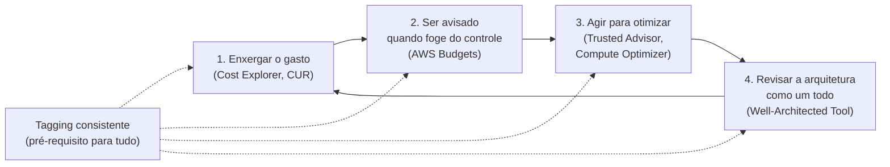
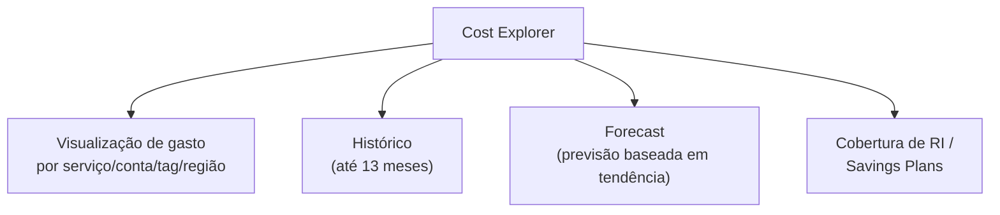
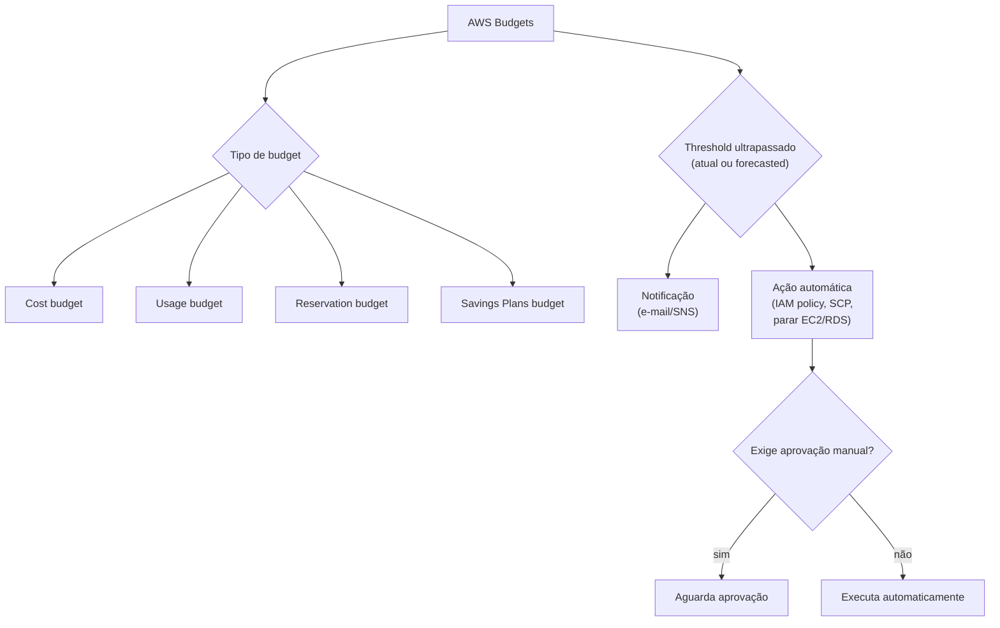
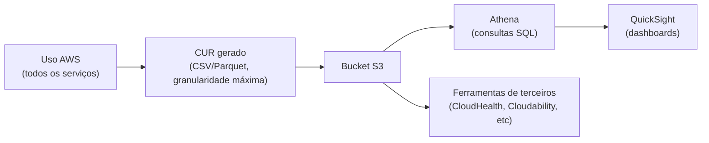
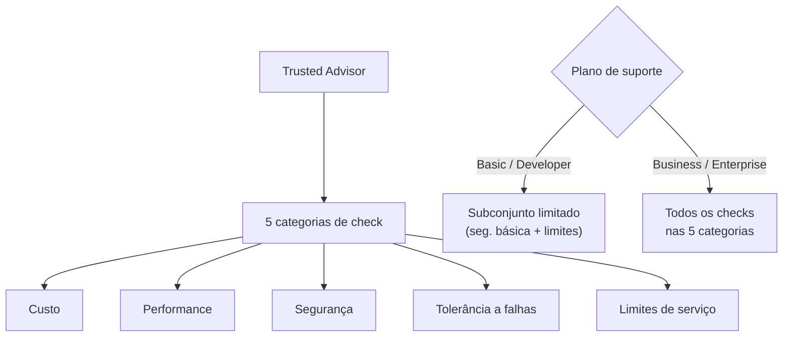
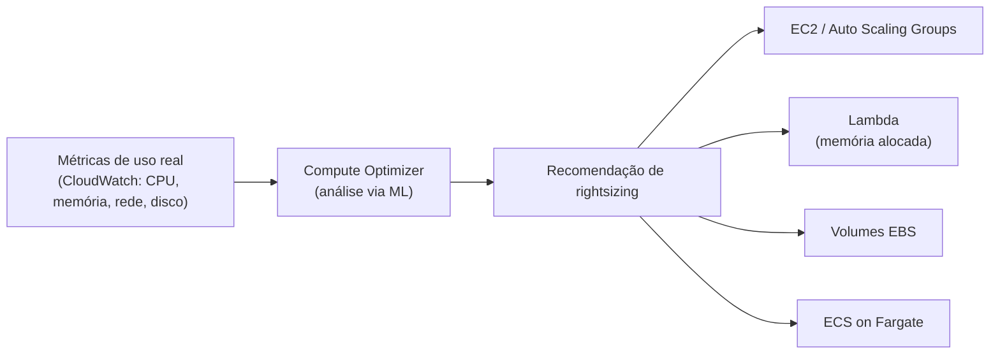
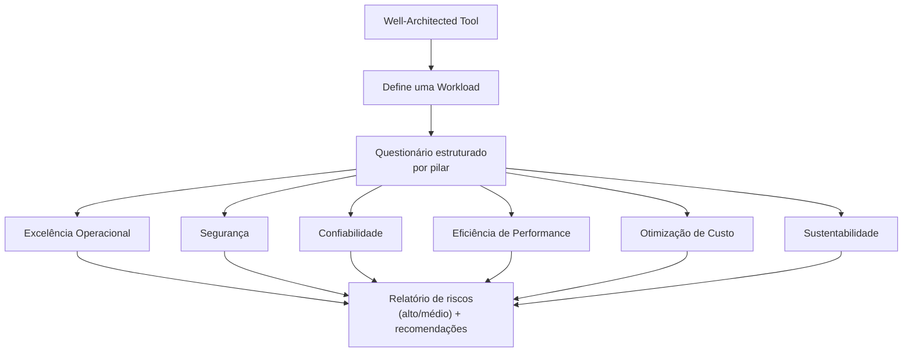
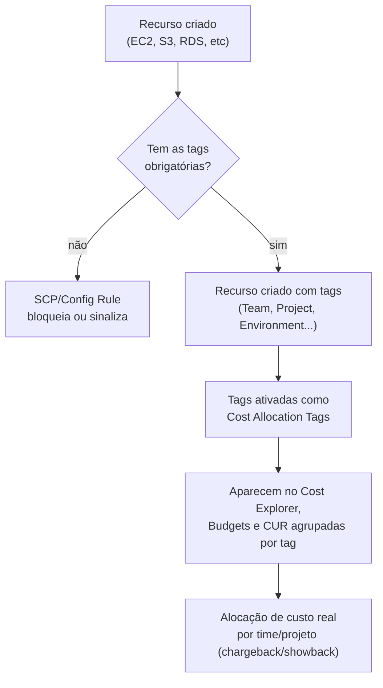
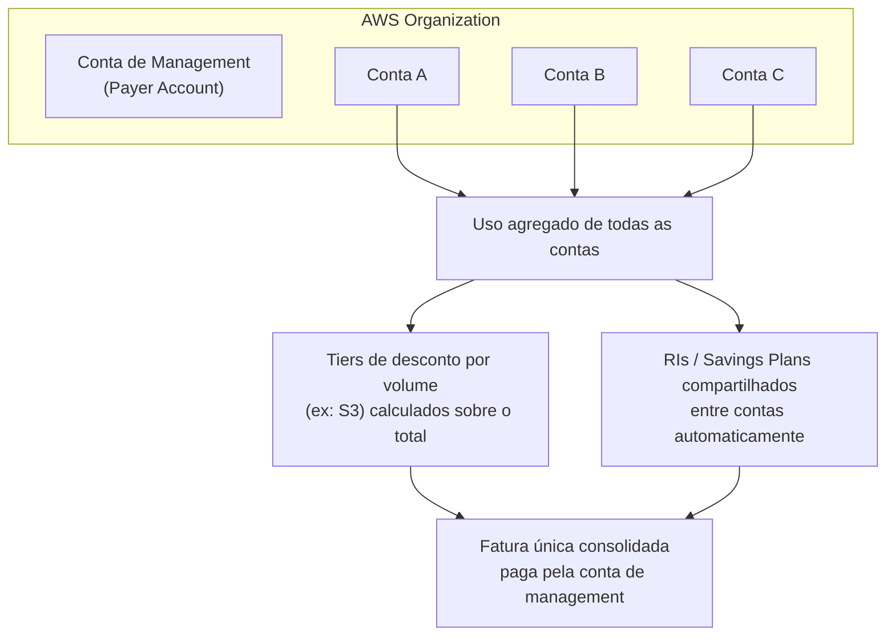
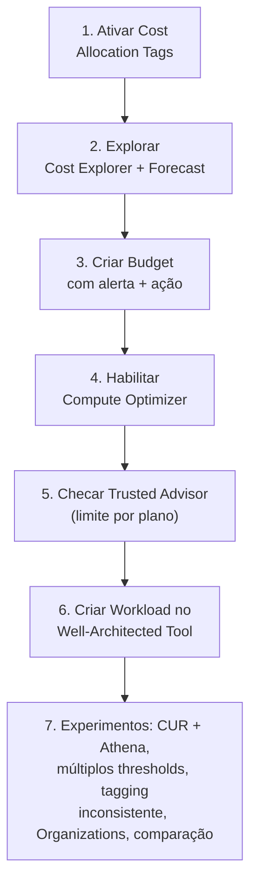

# Ferramentas de Custo e Governança — Guia Completo (Teoria + Prática + Dia a Dia)

## 0. Por que "otimizar custo" não é uma ferramenta só, é um processo

Uma confusão comum de quem está começando é achar que existe "a ferramenta de custo da AWS" — como se fosse um painel único que resolve tudo. Não existe. Custo na AWS é um **processo contínuo**, e a AWS oferece um conjunto de ferramentas que cobrem etapas diferentes desse processo: entender o que você já gastou, prever o que vai gastar, ser avisado quando algo sai do esperado, ter dados granulares para analisar, receber recomendações de otimização, e revisar a arquitetura como um todo.

Pense no ciclo assim: primeiro você precisa **enxergar** o gasto (Cost Explorer, CUR), depois **ser avisado** quando ele foge do controle (Budgets), depois **agir** para reduzir onde dá (Trusted Advisor, Compute Optimizer), e periodicamente **revisar a arquitetura inteira** sob a lente de custo, junto com os outros pilares (Well-Architected Tool). Nada disso funciona bem, no entanto, se você não sabe **de quem** é cada gasto — e é por isso que tagging (seção 6) é tratado aqui quase como um pré-requisito, não como só mais uma feature.


*O ciclo contínuo de gestão de custo na AWS — tagging alimenta todas as etapas.*

---

## 1. AWS Cost Explorer — visualizar e prever custo/uso

### O que ele resolve

É a ferramenta padrão para **responder perguntas visuais sobre o passado e o futuro do seu gasto**: "quanto gastei no mês passado por serviço?", "qual conta da minha Organization gastou mais?", "meu gasto está subindo ou descendo mês a mês?", "quanto devo esperar gastar no próximo mês, no ritmo atual?".

### Como funciona, na prática

- Interface gráfica no console (e também acessível via API — `aws ce get-cost-and-usage`) que deixa você **filtrar e agrupar** custo por várias dimensões: serviço, conta (linked account), região, tag, tipo de uso, etc.
- Guarda até **13 meses de histórico** por padrão, o que já é suficiente para comparar sazonalidade ano a ano em boa parte dos casos.
- Tem uma funcionalidade de **forecast (previsão)** — usa o histórico de gasto para prever o gasto dos próximos meses, com base em tendência estatística simples. Não é machine learning sofisticado, é bom o suficiente para dar uma noção de "para onde a fatura está indo" se nada mudar.
- Também mostra **RI (Reserved Instance) e Savings Plans utilization/coverage** — quanto do seu uso elegível já está coberto por desconto de compromisso, e quanto está sendo pago a preço on-demand desnecessariamente.

**No dia a dia:** Cost Explorer é a primeira parada quando alguém pergunta "por que a fatura subiu esse mês?" — você filtra por serviço, depois por conta, depois por tag, até achar o componente que mudou. É uma ferramenta de **investigação visual rápida**, não de análise profunda e customizada (para isso existe o CUR, seção 3).


*Cost Explorer cobre visualização, histórico, previsão e cobertura de desconto de compromisso.*

**O que muita gente erra na prova:** achar que Cost Explorer é a ferramenta certa para "análise granular linha a linha, com dados brutos para importar num BI". Não é — Cost Explorer é para visualização/exploração interativa; quando o cenário menciona "análise customizada", "dados granulares hora a hora", ou "importar em uma ferramenta de BI própria", a resposta é **Cost and Usage Report (CUR)**, não Cost Explorer.

---

## 2. AWS Budgets — alertas e ações automáticas

### O que ele resolve

Cost Explorer te mostra o que já aconteceu (e uma previsão simples). Mas ninguém fica olhando um painel o dia inteiro. **AWS Budgets** resolve o problema de "eu preciso ser avisado automaticamente quando o gasto sair do esperado, sem precisar checar manualmente".

### Tipos de budget

- **Cost budget** — o mais comum: defina um limite de gasto (ex: "US$ 5.000/mês") e seja alertado ao se aproximar ou ultrapassar.
- **Usage budget** — baseado em uso (ex: horas de EC2, GB de S3), não em valor monetário.
- **Reservation budget** — monitora se a **utilização** ou **cobertura** de RIs/Savings Plans está dentro do esperado (ex: alertar se a utilização cair abaixo de 80%, sinal de que você comprou compromisso demais).
- **Savings Plans budget** — equivalente ao anterior, mas focado especificamente em Savings Plans.

### Alertas baseados em thresholds — incluindo forecast

Você pode configurar alertas tanto para **gasto real (atual)** quanto para **gasto previsto (forecasted)** — ou seja, é possível ser avisado **antes mesmo de estourar o orçamento**, se a tendência do mês já indica que vai estourar. Isso é uma diferença importante: um alerta baseado só no "atual" te avisa tarde demais (quando você já ultrapassou); um alerta baseado em "forecasted" te dá tempo de agir antes.

### Ações automáticas (Budget Actions)

Diferente de só mandar um e-mail/notificação SNS, o AWS Budgets pode disparar **ações automáticas** quando um threshold é ultrapassado:
- Aplicar uma **IAM policy** restritiva a uma conta/usuário/role (ex: bloquear a criação de novas instâncias).
- Aplicar uma **Service Control Policy (SCP)** numa conta dentro de uma Organization.
- **Parar instâncias EC2 ou clusters RDS** automaticamente.

Essas ações podem ser configuradas para disparar automaticamente ou exigir aprovação manual antes de executar — dependendo do quão arriscada é a ação e de quanta confiança você tem no processo.


*AWS Budgets combina tipos de orçamento, thresholds (inclusive previstos) e ações automáticas configuráveis.*

**No dia a dia:** um padrão comum em empresas é configurar **múltiplos thresholds no mesmo budget** — por exemplo, 50% dispara só um e-mail informativo, 80% dispara um alerta mais sério para o time de FinOps, 100% dispara uma ação automática restritiva. Isso evita tanto o extremo de "só descobri no fim do mês" quanto o extremo de "uma ação drástica aconteceu sem ninguém saber que estava chegando perto".

**Pegadinha clássica de prova:** o cenário pede para **impedir que o gasto ultrapasse um limite automaticamente, sem intervenção humana** — a resposta certa é AWS Budgets com **Budget Actions configuradas para execução automática** (não manual), possivelmente aplicando uma SCP ou parando recursos. Só "alertar" (Cost Explorer, ou Budgets sem ação automática) não é suficiente para esse tipo de enunciado.

---

## 3. AWS Cost and Usage Report (CUR) — o relatório mais granular

### O que ele resolve

Cost Explorer é ótimo para exploração visual, mas tem limites de granularidade e de flexibilidade de análise. Quando você precisa de **dados brutos, no nível de item de linha mais detalhado possível**, para alimentar um BI próprio (QuickSight, Tableau, Power BI), rodar consultas SQL customizadas (via Athena), ou fazer alocação de custo extremamente específica — a resposta é o **Cost and Usage Report (CUR)**.

### Como funciona

- O CUR gera arquivos (CSV/Parquet) contendo **cada linha de uso e custo**, com o nível de detalhe mais granular disponível na AWS — inclui informações como recurso específico usado, tags aplicadas, taxa de desconto aplicada (RI/Savings Plan), custo antes e depois de descontos, etc.
- Os arquivos são entregues automaticamente em um **bucket S3** que você especifica, com atualização periódica (a AWS atualiza o relatório do mês corrente múltiplas vezes por dia conforme novos dados de uso chegam).
- A partir do S3, o fluxo comum é: **Athena** (consultas SQL direto sobre os arquivos) → **QuickSight** (dashboards) — ou carregar em qualquer outra ferramenta de BI/data warehouse que sua empresa já usa.
- É a **fonte de dados usada por ferramentas de terceiros** de gestão de custo em nuvem (CloudHealth, Cloudability, Vantage, etc.) — quando você contrata uma dessas ferramentas, é o CUR que elas consomem por trás.


*CUR é a base granular sobre a qual se constrói qualquer análise de custo customizada.*

**No dia a dia:** times de FinOps maduros praticamente sempre têm um pipeline montado em cima do CUR — é o padrão de mercado para qualquer análise de custo que precise ir além do que o Cost Explorer oferece de fábrica (ex: alocação de custo compartilhado entre times usando regras próprias, análise de tendência com granularidade horária, cruzamento com dados de negócio fora da AWS).

**O que muita gente erra na prova:** confundir CUR com Cost Explorer quando o enunciado menciona "o relatório mais detalhado" ou "análise customizada via ferramentas de terceiros/BI". Cost Explorer é interface pronta; CUR é dado bruto para você (ou uma ferramenta) processar como quiser.

---

## 4. AWS Trusted Advisor — checks de otimização (e a pegadinha do plano de suporte)

### O que ele resolve

O Trusted Advisor varre sua conta automaticamente e aponta problemas em cinco categorias: **custo, performance, segurança, tolerância a falhas (resiliência)** e **limites de serviço**. Na categoria de custo, ele identifica coisas como: instâncias EC2 ociosas ou subutilizadas, Elastic IPs não associados (que geram cobrança), volumes EBS não anexados, RIs subutilizadas, load balancers sem tráfego, entre outros.

### A pegadinha mais importante: nem todo check está disponível em todo plano de suporte

Esse é provavelmente o detalhe mais cobrado em prova sobre Trusted Advisor:

- No plano de suporte **Basic** e **Developer**, você só tem acesso a um conjunto limitado de checks — principalmente da categoria **segurança** (alguns checks básicos) e **limites de serviço**. **Os checks completos de custo, performance e tolerância a falhas exigem plano Business ou Enterprise.**
- Só a partir do plano **Business** (ou Enterprise On-Ramp/Enterprise) você tem acesso a **todos os checks**, nas cinco categorias completas, incluindo os de otimização de custo mais valiosos (instâncias ociosas, RIs subutilizadas, etc).

| Plano de suporte | Checks disponíveis no Trusted Advisor |
|---|---|
| Basic | Apenas um subconjunto limitado (principalmente segurança básica + limites de serviço) |
| Developer | Igual ao Basic — ainda limitado |
| Business | Todos os checks, nas 5 categorias (custo, performance, segurança, tolerância a falhas, limites de serviço) |
| Enterprise On-Ramp / Enterprise | Todos os checks + acesso a TAM (Technical Account Manager) para orientação adicional |


*O plano de suporte determina quais checks do Trusted Advisor você realmente enxerga.*

**Pegadinha clássica de prova:** o cenário descreve uma conta no plano **Basic** perguntando "como identificar instâncias EC2 ociosas para reduzir custo usando Trusted Advisor" — se a pergunta não menciona upgrade de plano, a resposta pode ser justamente "não é possível com o plano atual, seria necessário upgrade para Business ou Enterprise" ou, dependendo do enunciado, apontar para uma alternativa como **Compute Optimizer** (seção 5), que não exige plano de suporte pago para funcionar.

**No dia a dia:** empresas que já pagam plano Business/Enterprise (o que é comum em produção séria, porque esses planos também dão acesso a suporte técnico real, não só ao Trusted Advisor) tratam a aba de custo do Trusted Advisor como uma checklist recorrente — revisar mensalmente é uma prática simples que sistematicamente encontra dinheiro sendo desperdiçado (recursos esquecidos ligados, IPs não usados, etc).

---

## 5. AWS Compute Optimizer — rightsizing baseado em uso real via ML

### O que ele resolve

Trusted Advisor aponta problemas óbvios (ex: "essa instância está com CPU quase zero"), mas não é sofisticado o suficiente para recomendar, com confiança, **qual o tipo/tamanho ideal** de instância para sua carga de trabalho real. Isso é exatamente o que o **Compute Optimizer** faz.

### Como funciona

- Analisa o **histórico de métricas de utilização** (CPU, memória — se o CloudWatch Agent estiver instalado para expor memória, já que por padrão o CloudWatch não coleta uso de memória —, rede, disco) dos seus recursos ao longo do tempo, usando **machine learning**, e recomenda o tipo/tamanho de recurso que melhor equilibra performance e custo.
- Cobre múltiplos tipos de recurso: instâncias **EC2**, **Auto Scaling Groups**, funções **Lambda** (recomendando ajuste de memória alocada, o que também ajusta proporcionalmente a CPU disponível), volumes **EBS**, e serviços em contêiner no **ECS on Fargate**.
- É **gratuito de habilitar** — não exige plano de suporte pago (diferente do Trusted Advisor completo), o que o torna a alternativa natural quando o cenário de prova menciona uma conta sem plano Business/Enterprise precisando de recomendações de rightsizing.
- As recomendações vêm com **níveis de confiança/risco** — ex: "essa instância está superdimensionada, migrar para um tipo menor economiza X%, com risco baixo de impacto de performance com base no padrão de uso observado".


*Compute Optimizer usa uso real observado (não só limites configurados) para recomendar o tamanho ideal.*

**No dia a dia:** é comum encontrar instâncias que foram dimensionadas "no chute" na hora de subir o ambiente (ex: "vamos de m5.xlarge para garantir", sem medir necessidade real) e nunca mais foram revisadas. Rodar o Compute Optimizer periodicamente (ele atualiza recomendações continuamente à medida que mais dados de uso se acumulam) é uma das formas mais diretas de encontrar economia sem sacrificar performance, porque a recomendação é baseada em **dados reais de uso**, não em suposição.

**O que muita gente erra na prova:** confundir Compute Optimizer com Trusted Advisor. Trusted Advisor é mais genérico (cobre 5 categorias, incluindo segurança e limites) e depende de plano de suporte pago para os checks completos; Compute Optimizer é **especificamente sobre rightsizing baseado em ML**, é gratuito, e é a resposta certa quando o enunciado enfatiza "recomendação baseada em padrão de uso real/machine learning" sem mencionar plano de suporte.

---

## 6. AWS Well-Architected Tool — revisão formal, e o pilar de custo entre os 6

### O que ele resolve

As ferramentas anteriores olham para **métricas e números**. O **Well-Architected Tool** olha para **arquitetura e decisões de design** — é uma ferramenta gratuita que guia você (ou seu time) por um questionário estruturado, comparando sua carga de trabalho contra as melhores práticas do **AWS Well-Architected Framework**.

### Os 6 pilares do framework

1. **Excelência Operacional**
2. **Segurança**
3. **Confiabilidade** (Reliability)
4. **Eficiência de Performance**
5. **Otimização de Custo**
6. **Sustentabilidade**

O pilar de **Otimização de Custo** especificamente cobre práticas como: entender e controlar onde o dinheiro é gasto, usar o modelo de precificação certo para cada carga de trabalho (on-demand vs Reserved vs Spot vs Savings Plans), fazer rightsizing continuamente, e desligar/eliminar recursos não usados.

### Como funciona na prática

- Você cria uma **Workload** dentro da ferramenta, descrevendo a arquitetura (ambiente, região, contexto de negócio).
- Responde a um questionário estruturado por pilar — cada pergunta tem opções de melhores práticas que você marca como "já implementado" ou não.
- A ferramenta gera um **relatório com riscos identificados** (classificados como risco alto/médio) por pilar, junto com links para documentação de como resolver cada risco.
- É recomendado revisitar a review **periodicamente** (ex: antes de um grande lançamento, ou em cadência trimestral/semestral) porque a arquitetura e as melhores práticas evoluem.


*O Well-Architected Tool avalia a arquitetura inteira contra os 6 pilares, não só custo isoladamente.*

**No dia a dia:** diferente das outras ferramentas desta página, que são "automáticas" (rodam sozinhas em cima de métricas), o Well-Architected Tool é um **processo humano e qualitativo** — você (ou um arquiteto revisando) precisa realmente responder ao questionário com honestidade sobre o estado real da arquitetura. Empresas maduras usam isso como parte do processo de aprovação antes de uma carga de trabalho ir para produção, ou como auditoria periódica de cargas já existentes.

**O que muita gente erra na prova:** achar que o Well-Architected Tool é "sobre custo". É sobre os **6 pilares**, e custo é só um deles — se o enunciado quer algo puramente automatizado e quantitativo focado só em custo, a resposta é Cost Explorer/Budgets/Trusted Advisor/Compute Optimizer, não o Well-Architected Tool. O Well-Architected Tool entra quando o cenário fala em **"revisão formal da arquitetura"**, **"melhores práticas"**, ou **"avaliar riscos antes de lançar em produção"**.

---

## 7. Estratégia de tagging para alocação de custo (cost allocation tags)

### Por que isso é o pré-requisito de tudo

Toda ferramenta descrita até aqui — Cost Explorer, Budgets, CUR — pode filtrar e agrupar custo por **tag**. Mas isso só funciona se os recursos **tiverem sido marcados com tags consistentes desde a criação**. Sem tagging, você consegue responder "quanto gastei em EC2 no total", mas não consegue responder "quanto o time de Marketing gastou em EC2" ou "quanto custou o projeto X especificamente" — porque não existe informação nenhuma ligando o recurso a esse contexto de negócio.

Esse é o motivo de tagging aparecer quase como um requisito de "higiene básica de FinOps": sem ele, todo o resto da análise de custo (alocação por time, chargeback/showback interno, identificar qual projeto está queimando dinheiro) simplesmente não é possível — não é uma limitação de ferramenta, é ausência de dado.

### Cost Allocation Tags — o mecanismo específico

Nem toda tag aplicada a um recurso vira automaticamente uma coluna utilizável no Cost Explorer/CUR. Você precisa **ativar** a tag como **Cost Allocation Tag** explicitamente:
- **User-Defined Cost Allocation Tags** — tags que você mesmo criou (ex: `Team`, `Project`, `Environment`, `CostCenter`) e precisa ativar manualmente em Billing → Cost Allocation Tags.
- **AWS-Generated Cost Allocation Tags** — tags que a própria AWS aplica automaticamente em alguns casos (ex: `aws:createdBy`), também precisam ser ativadas para aparecer nos relatórios.

Depois de ativada, pode levar até 24 horas para a tag começar a aparecer nos dados de custo.

### Boas práticas reais de tagging

- Definir uma **taxonomia de tags obrigatória** antes de qualquer recurso ser criado — no mínimo algo como `Environment` (prod/dev/staging), `Team` ou `Owner`, `Project` ou `CostCenter`, e `Application`.
- Aplicar as tags **desde a criação do recurso** — retrofitting (aplicar tags depois, em recursos já existentes) é possível mas trabalhoso e sempre deixa lacunas (recursos deletados antes de serem tagueados nunca mais têm essa informação recuperável no histórico).
- Usar **AWS Config Rules** ou **Service Control Policies (SCPs)** para **impedir a criação de recursos sem as tags obrigatórias** — transformar tagging de "boa prática esperada" para "regra tecnicamente enforced" é o que realmente garante consistência em escala, porque depender só de disciplina humana falha conforme a organização cresce.
- Usar **AWS Tag Editor** para encontrar e corrigir recursos existentes sem tag ou com tag inconsistente (ex: `team=Marketing` vs `Team=marketing` — inconsistência de maiúsculas/minúsculas quebra agrupamento).


*Sem tagging consistente e ativado, nenhuma ferramenta de custo consegue atribuir gasto a um time ou projeto.*

**O que muita gente erra na prova:** achar que basta **aplicar** a tag no recurso para ela já aparecer no relatório de custo. Existe um passo intermediário obrigatório — **ativar a tag como Cost Allocation Tag** em Billing — que é frequentemente o detalhe que o enunciado está testando quando descreve "apliquei as tags mas elas não aparecem no relatório de custo".

**No dia a dia:** em qualquer engajamento de FinOps, a primeira pergunta prática costuma ser "vocês têm uma política de tagging consistente?" — se a resposta é não, isso vira a primeira tarefa, antes até de tentar otimizar qualquer coisa, porque sem isso é impossível medir se as otimizações feitas depois estão gerando efeito no lugar certo.

---

## 8. AWS Organizations — consolidated billing e desconto por volume agregado

### O problema que o consolidated billing resolve

Empresas maiores normalmente têm **múltiplas contas AWS** — uma prática recomendada, inclusive, para isolar ambientes (prod/dev), times, ou projetos por questões de segurança e governança (blast radius menor se uma conta for comprometida). Mas se cada conta pagasse sua fatura de forma completamente independente, a empresa perderia poder de negociação — o volume de uso de cada conta individualmente é menor do que o volume agregado de todas juntas.

O **AWS Organizations**, através do **consolidated billing**, resolve isso: todas as contas-membro de uma Organization têm seu uso **agregado numa única fatura**, paga pela **conta de management (payer account)**.

### Como o desconto por volume funciona na prática

Vários dos descontos por volume da AWS são calculados sobre o **uso agregado de todas as contas da Organization**, não conta por conta isoladamente. Exemplos:
- **Tiers de preço decrescente do S3** (quanto mais GB armazenado, menor o preço por GB nas faixas seguintes) — o volume de todas as contas é somado antes de aplicar os tiers.
- **Reserved Instances e Savings Plans comprados em uma conta** podem ser **compartilhados automaticamente** com outras contas da Organization (desde que o compartilhamento esteja habilitado), aplicando o desconto ao uso equivalente em qualquer conta-membro, não só na conta que comprou.

Isso significa que uma empresa com 20 contas pequenas, juntas, pode atingir tiers de desconto que nenhuma conta isolada atingiria sozinha — é literalmente mais barato operar com múltiplas contas dentro de uma Organization do que operar as mesmas 20 contas de forma independente sem consolidated billing.

### Governança além do desconto

Consolidated billing é o benefício de custo mais direto, mas o AWS Organizations também traz, junto:
- **Service Control Policies (SCPs)** — permitem restringir o que contas-membro podem fazer, incluindo (relevante para custo) bloquear o uso de tipos de instância caros, bloquear regiões não autorizadas, ou impedir a desativação de ferramentas de custo/tagging.
- Uma **única conta de management** vê a fatura consolidada inteira, mas cada conta-membro só vê o próprio uso — dá visibilidade central sem misturar dados operacionais entre times/produtos.


*O uso de todas as contas-membro é somado antes de aplicar tiers de desconto e compartilhamento de RIs/Savings Plans.*

**O que muita gente erra na prova:** achar que separar cargas de trabalho em múltiplas contas AWS é ruim para custo, porque "perde escala". É o oposto — dentro de uma Organization com consolidated billing habilitado, separar em múltiplas contas é uma prática recomendada tanto para segurança/governança **quanto** para custo, porque o desconto por volume continua sendo calculado de forma agregada.

**No dia a dia:** a estrutura recomendada tipicamente usa uma conta de management **dedicada só a faturamento e governança** (sem cargas de trabalho reais rodando nela), com contas-membro separadas por ambiente/time/produto — e RIs/Savings Plans de uso mais previsível (ex: uma carga de trabalho baseline que sempre roda) comprados de forma centralizada e compartilhados, para maximizar o desconto agregado.

---

# 🧪 Laboratório prático (para executar na AWS)

## Objetivo
Configurar um budget com alerta e ação automática, ativar cost allocation tags, e explorar as recomendações do Compute Optimizer.

### Passo 1 — Ativar Cost Allocation Tags
Console → Billing and Cost Management → **Cost Allocation Tags**
- Crie/marque recursos existentes (ex: uma instância EC2 de teste) com a tag `Project=lab-custo`
- Nessa mesma tela, ative a tag `Project` como User-Defined Cost Allocation Tag
- Aguarde até 24h para ela aparecer nos relatórios (nesse meio tempo, siga os próximos passos)

### Passo 2 — Explorar o Cost Explorer
Console → Cost Explorer → **Launch Cost Explorer**
- Agrupe o gasto por **Service** e depois por **Tag: Project**
- Habilite o **Forecast** e observe a previsão para o restante do mês

### Passo 3 — Criar um Budget com alerta e ação
Console → Billing and Cost Management → **Budgets** → **Create budget**
- Tipo: **Cost budget**
- Valor: um limite baixo, ex: US$ 10 (para testar rápido)
- Adicione um alerta em **80% do valor real** e outro em **100% do forecasted**
- Configure uma **Budget Action**: aplicar uma IAM policy restritiva (ex: negar `ec2:RunInstances`) quando o threshold de 100% real for atingido, com aprovação manual

### Passo 4 — Habilitar o Compute Optimizer
Console → Compute Optimizer → **Get started**
- Habilite para a conta (opt-in)
- Aguarde a coleta de métricas (leva algumas horas a dias para gerar recomendações confiáveis)
- Depois de gerado, revise as recomendações de rightsizing para qualquer instância EC2 de teste que você tenha rodando

### Passo 5 — Rodar uma checagem no Trusted Advisor
Console → Trusted Advisor
- Veja quais checks de custo estão disponíveis no seu plano de suporte atual
- Se estiver no plano Basic/Developer, observe que os checks completos de custo aparecem bloqueados, pedindo upgrade de plano

### Passo 6 — Criar uma Workload no Well-Architected Tool
Console → Well-Architected Tool → **Define workload**
- Nome: `lab-custo-workload`
- Responda ao menos as perguntas do pilar **Otimização de Custo**
- Gere o relatório de riscos (Milestone) e veja as recomendações associadas a cada risco alto/médio

### Passo 7 — Experimentos para fixar cada conceito
1. **CUR:** habilite um Cost and Usage Report apontando para um bucket S3, e depois de gerado, rode uma query simples no Athena filtrando por `line_item_usage_type` para ver o nível de detalhe que o CUR oferece comparado ao Cost Explorer.
2. **Budgets com múltiplos thresholds:** edite o budget criado no Passo 3 e adicione um terceiro alerta em 50% — simule (ajustando temporariamente o valor do budget para baixo) disparando os três níveis e observando as notificações.
3. **Tagging inconsistente:** crie dois recursos com tags `team=Eng` e `Team=eng` (case diferente) e observe no Cost Explorer que eles aparecem como grupos separados — depois use o **Tag Editor** para corrigir e padronizar.
4. **Organizations consolidated billing:** se tiver acesso a uma Organization de teste com múltiplas contas, compare a fatura consolidada na conta de management com o uso individual reportado em cada conta-membro.
5. **Compute Optimizer vs Trusted Advisor:** compare as recomendações de rightsizing do Compute Optimizer com os achados de custo do Trusted Advisor (se disponível no seu plano) para a mesma instância, e note a diferença de profundidade/confiança entre as duas.


*Sequência dos passos do laboratório prático.*

---

## Comandos AWS CLI úteis

```bash
# Consultar custo agrupado por serviço no último mês (Cost Explorer API)
aws ce get-cost-and-usage \
  --time-period Start=2026-07-01,End=2026-08-01 \
  --granularity MONTHLY \
  --metrics "UnblendedCost" \
  --group-by Type=DIMENSION,Key=SERVICE

# Obter a previsão de custo (forecast) para o mês corrente
aws ce get-cost-forecast \
  --time-period Start=2026-08-15,End=2026-09-01 \
  --metric UNBLENDED_COST \
  --granularity MONTHLY

# Listar budgets configurados na conta
aws budgets describe-budgets --account-id 123456789012

# Criar um budget simples via CLI (arquivo JSON com a definição)
aws budgets create-budget \
  --account-id 123456789012 \
  --budget file://budget-definicao.json \
  --notifications-with-subscribers file://budget-notificacoes.json

# Ativar uma cost allocation tag definida pelo usuário
aws ce update-cost-allocation-tags-status \
  --cost-allocation-tags-status TagKey=Project,Status=Active

# Listar recomendações do Compute Optimizer para instâncias EC2
aws compute-optimizer get-ec2-instance-recommendations

# Listar checks do Trusted Advisor disponíveis (requer plano Business/Enterprise para checks completos)
aws support describe-trusted-advisor-checks --language en

# Listar contas de uma Organization (para visão de consolidated billing)
aws organizations list-accounts
```

---

## Tabela de decisão rápida (prova + dia a dia)

| Cenário | Resposta provável |
|---|---|
| Visualizar gasto histórico e prever gasto futuro de forma interativa | AWS Cost Explorer |
| Ser alertado (ou agir automaticamente) quando o gasto ultrapassar um limite | AWS Budgets |
| Impedir automaticamente que o gasto continue subindo, sem intervenção humana | AWS Budgets com Budget Actions (execução automática) |
| Análise granular customizada, dado bruto para BI/Athena/ferramenta de terceiros | Cost and Usage Report (CUR) |
| Identificar instâncias ociosas/recursos não usados, mas conta está no plano Basic | Trusted Advisor não cobre tudo — considerar Compute Optimizer (gratuito) |
| Identificar instâncias ociosas/recursos não usados, conta no plano Business/Enterprise | AWS Trusted Advisor (checks completos de custo) |
| Recomendação de rightsizing baseada em uso real via machine learning | AWS Compute Optimizer |
| Revisão formal da arquitetura contra melhores práticas, incluindo mas não só custo | AWS Well-Architected Tool |
| Não consigo ver gasto por time/projeto no Cost Explorer | Faltou aplicar e/ou ativar Cost Allocation Tags |
| Múltiplas contas AWS, quer manter desconto por volume agregado | AWS Organizations com consolidated billing |
| RIs/Savings Plans comprados numa conta beneficiando outras contas | Compartilhamento habilitado dentro da Organization |
